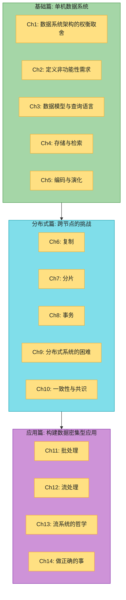

# DDIA 第二版 读书笔记

> **Designing Data-Intensive Applications, 2nd Edition**
> Martin Kleppmann & Chris Riccomini (O'Reilly, 2026)

一份**逐章重写、风格统一、内容扩充**的 DDIA 第二版中文读书笔记。原版笔记偏论文堆砌、图表混乱、内容单薄(尤其 Ch10-14);本项目从第一章起逐章重做,统一了配色与结构,并把每章扩充到原笔记的 **2-6 倍**,补上了原书有但旧笔记遗漏的大量精华(Raft 源码、etcd 实现、拜占庭 PBFT、流处理时间语义、拆解数据库哲学……)。

> 阅读环境:Obsidian **深色主题**。所有图表配色针对深色背景优化(每节点显式 `color:#1f1f1f`)。

---

## 全书架构总览



**章与章的逻辑递进:**


## 三大核心主题(贯穿全书,第 2 章)


---

## 章节索引

### 基础篇:数据系统的基石

| 章节 | 笔记链接 | 核心问题 | PDF 页码 |
|------|---------|---------|------|
| Ch1 | [数据系统架构的权衡取舍](ch01-数据系统架构的权衡取舍.md) | OLTP vs OLAP? 云 vs 自建? 单机 vs 分布式? | p25-56 |
| Ch2 | [定义非功能性需求](ch02-定义非功能性需求.md) | 如何衡量性能? 什么是真正的可靠? 如何设计可维护的系统? | p57-88 |
| Ch3 | [数据模型与查询语言](ch03-数据模型与查询语言.md) | 关系型 vs 文档型 vs 图? 如何选择查询语言? | p89-138 |
| Ch4 | [存储与检索](ch04-存储与检索.md) | B-Tree vs LSM-Tree? 列式存储? 全文搜索与向量嵌入? | p139-184 |
| Ch5 | [编码与演化](ch05-编码与演化.md) | Protobuf vs Avro vs JSON? 如何实现滚动升级? | p185-220 |

### 分布式篇:跨节点的挑战

| 章节 | 笔记链接 | 核心问题 | PDF 页码 |
|------|---------|---------|------|
| Ch6 | [复制](ch06-复制.md) | 主从 vs 多主 vs 无主? 如何处理复制延迟? | p221-274 |
| Ch7 | [分片](ch07-分片.md) | 按范围 vs 按哈希? 如何处理热点? 二级索引怎么办? | p275-300 |
| Ch8 | [事务](ch08-事务.md) | ACID 的真正含义? 隔离级别? 分布式事务? | p301-368 |
| Ch9 | [分布式系统的困难](ch09-分布式系统的困难.md) | 网络不可靠? 时钟不可信? 真相由谁决定? | p369-424 |
| Ch10 | [一致性与共识](ch10-一致性与共识.md) | 线性一致性? Raft/Paxos? etcd 如何工作? 拜占庭? | p425-474 |

### 应用篇:构建真实系统

| 章节 | 笔记链接 | 核心问题 | PDF 页码 |
|------|---------|---------|------|
| Ch11 | [批处理](ch11-批处理.md) | MapReduce 原理? Spark/Flink? Shuffle? ETL 最佳实践? | p475-510 |
| Ch12 | [流处理](ch12-流处理.md) | 消息队列 vs 日志? CDC? 事件时间? 流式 Join? exactly-once? | p511-562 |
| Ch13 | [流系统的哲学](ch13-流系统的哲学.md) | 拆解数据库? 端到端正确性? Timeliness vs Integrity? | p563-608 |
| Ch14 | [做正确的事](ch14-做正确的事.md) | 算法偏见? 监控资本主义? 隐私即权力? 工程师责任? | p609-626 |

---

## 笔记风格规范(每章统一遵循)

每章笔记都按同一套风格写,熟悉这套标记后阅读效率更高:

| 标记 | 含义 |
|------|------|
| 📚 **精选文献** | 每章只留少数真正改变认知的论文/资料,附"为什么值得读"。不再堆十几篇。 |
| 🗺️ **章节概览** | 大纲导航图 + 结构表,先看这里建立全局观。 |
| > 📝 **名词注释** | 抽象/专业名词紧跟一个注释块,把术语讲透(如 ISR、watermark、SCD、unbundling)。 |
| #### **深入:...** | 对难懂/易懵的概念,用**生活类比 + 手算例子 + 反例 + 决策表**讲具体。这是本项目最看重的部分。 |
| 🏭 **生产级产品速查表** | 每章末尾真实产品做法(Kafka/etcd/Spanner/Flink/Materialize…)。 |
| 🎯 **系统设计面试题** | 大厂格式(需求→容量→架构→深入→权衡)。 |
| 章末 **flowchart LR** | 树状总结图,ROOT 在左、分支竖排在右(深色主题可读)。**不用 mindmap**(配色无法控制)。 |

**配色语义**(深色背景友好):🟡 黄=起点/数据源 · 🟦 青=处理/服务 · 🟩 绿=输出/成功 · 🟪 紫=派生数据/难点 · 🟥 红=代价/风险 · 🟧 橙=强调。

---

## 如何使用这份笔记

- **快速复习**:看每章开头的 🗺️ 概览图 + 末尾的 📝 要点总结(flowchart LR)
- **攻克难点**:直接找 `#### 深入:` 小节(手算 + 类比 + 决策表)
- **查术语**:搜 `📝 名词注释`
- **面试准备**:看每章 🎯 系统设计题
- **选型参考**:看 🏭 生产级产品速查表
- **查论文**:每章 📚 精选文献,只列最值得读的几篇

## 笔记结构(每章骨架)

```
1. 📚 精选文献          ← 只留少数必读, 附"为什么值得读"
2. 🗺️ 章节概览          ← 导航图 + 结构表
3. 📖 详细内容(按小节)  ← 含 📝名词注释 + ####深入 + 手算/类比/决策表
4. 🏭 生产级产品速查表   ← 真实系统做法
5. 💻 代码示例          ← PySpark/Flink SQL/Go/Python
6. 🎯 系统设计面试题     ← 大厂格式
7. 📝 本章要点总结       ← flowchart LR + Takeaways + 连接下一章
```

## 进度追踪

**全部 14 章已完成 ✅**

- [x] Ch1: 数据系统架构的权衡取舍
- [x] Ch2: 定义非功能性需求
- [x] Ch3: 数据模型与查询语言
- [x] Ch4: 存储与检索
- [x] Ch5: 编码与演化
- [x] Ch6: 复制
- [x] Ch7: 分片
- [x] Ch8: 事务
- [x] Ch9: 分布式系统的困难
- [x] Ch10: 一致性与共识(含 etcd/raft 源码精读 + 拜占庭 PBFT)
- [x] Ch11: 批处理
- [x] Ch12: 流处理
- [x] Ch13: 流系统的哲学
- [x] Ch14: 做正确的事

---

## 关于

源书:*Designing Data-Intensive Applications, 2nd Edition*(Martin Kleppmann & Chris Riccomini, O'Reilly 2026)。本笔记为个人学习用途的重写整理,内容基于原书但做了风格统一、内容扩充和图表重做。请支持原书。
