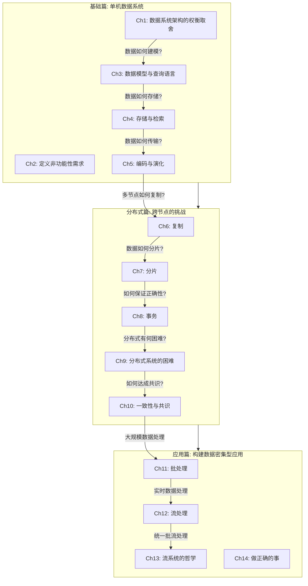

# DDIA 第二版 读书笔记

> **Designing Data-Intensive Applications, 2nd Edition**
> Martin Kleppmann & Chris Riccomini (O'Reilly, February 2026)

## 全书架构总览



## 三大核心主题


## 章节索引

### 基础篇: 数据系统的基石

| 章节 | 笔记链接 | 核心问题 | 页码 |
|------|---------|---------|------|
| Ch1 | [数据系统架构的权衡取舍](ch01-数据系统架构的权衡取舍.md) | OLTP vs OLAP? 云 vs 自建? 单机 vs 分布式? | p1-32 |
| Ch2 | [定义非功能性需求](ch02-定义非功能性需求.md) | 如何衡量性能? 什么是真正的可靠? 如何设计可维护的系统? | p33-64 |
| Ch3 | [数据模型与查询语言](ch03-数据模型与查询语言.md) | 关系型 vs 文档型 vs 图? 如何选择查询语言? | p65-114 |
| Ch4 | [存储与检索](ch04-存储与检索.md) | B-Tree vs LSM-Tree? 列式存储? 全文搜索与向量嵌入? | p115-160 |
| Ch5 | [编码与演化](ch05-编码与演化.md) | Protobuf vs Avro vs JSON? 如何实现滚动升级? | p161-196 |

### 分布式篇: 跨节点的挑战

| 章节 | 笔记链接 | 核心问题 | 页码 |
|------|---------|---------|------|
| Ch6 | [复制](ch06-复制.md) | 主从 vs 多主 vs 无主? 如何处理复制延迟? | p197-250 |
| Ch7 | [分片](ch07-分片.md) | 按范围 vs 按哈希? 如何处理热点? 二级索引怎么办? | p251-276 |
| Ch8 | [事务](ch08-事务.md) | ACID 的真正含义? 隔离级别? 分布式事务? | p277-344 |
| Ch9 | [分布式系统的困难](ch09-分布式系统的困难.md) | 网络不可靠? 时钟不可信? 真相由谁决定? | p345-400 |
| Ch10 | [一致性与共识](ch10-一致性与共识.md) | 线性一致性? Raft/Paxos? ZooKeeper 如何工作? | p401-450 |

### 应用篇: 构建真实系统

| 章节 | 笔记链接 | 核心问题 | 页码 |
|------|---------|---------|------|
| Ch11 | [批处理](ch11-批处理.md) | MapReduce 原理? Spark/Flink? ETL 最佳实践? | p451-486 |
| Ch12 | [流处理](ch12-流处理.md) | 消息队列 vs 日志? CDC? 流式 Join? | p487-538 |
| Ch13 | [流系统的哲学](ch13-流系统的哲学.md) | 如何统一批流? 端到端正确性? | p539-584 |
| Ch14 | [做正确的事](ch14-做正确的事.md) | 数据伦理? 隐私? 算法偏见? | p585-602 |

## 笔记结构说明

每章笔记统一采用以下结构:

```
1. 📚 核心论文与参考文献 ← 放最前面，方便快速回查
2. 🗺️ 章节概览与 Mermaid 架构图
3. 📖 详细内容（按小节展开，约为原书 1/3 浓缩）
4. 💻 代码示例与最佳实践
5. 🎯 系统设计面试题（含思路分析）
6. 📝 本章要点总结
```

## 如何使用这份笔记

- **快速复习**: 看每章开头的架构图 + 末尾的要点总结
- **深入理解**: 按小节展开阅读详细内容
- **查找论文**: 每章开头的论文列表，附有中文资源链接
- **面试准备**: 直接看每章末尾的系统设计题
- **实践参考**: 查看代码示例与最佳实践部分

## 进度追踪

- [x] 第1章: 数据系统架构的权衡取舍
- [x] 第2章: 定义非功能性需求
- [x] 第3章: 数据模型与查询语言
- [x] 第4章: 存储与检索
- [x] 第5章: 编码与演化
- [x] 第6章: 复制
- [x] 第7章: 分片
- [x] 第8章: 事务
- [x] 第9章: 分布式系统的困难
- [x] 第10章: 一致性与共识
- [x] 第11章: 批处理
- [x] 第12章: 流处理
- [x] 第13章: 流系统的哲学
- [x] 第14章: 做正确的事
