# Chapter 1: 数据系统架构的权衡取舍 (Trade-Offs in Data Systems Architecture)

> *"There are no solutions; there are only trade-offs. [...] But you try to get the best trade-off you can get, and that's all you can hope for."*
> — Thomas Sowell

本章是全书的导航图。它不教任何具体工具,只做一件事:**教你如何思考和比较数据系统的 trade-offs**。核心论点一句话——**没有万能的数据系统,只有权衡取舍**。

---

## 🧭 本章导读

数据系统架构的设计,归根结底是在四个维度上做选择。这四个维度贯穿全书:

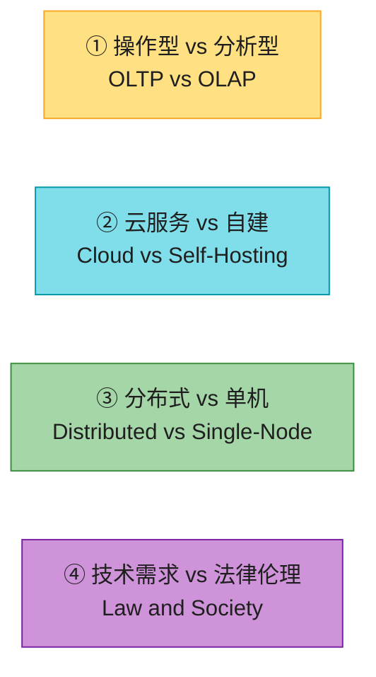

| 维度 | 核心问题 | 对应小节 |
|------|---------|---------|
| ① 操作 vs 分析 | 数据是用来"办事"还是用来"分析"的? | §2、§3 |
| ② 云 vs 自建 | 软件自己运维还是外包给厂商? | §5 |
| ③ 分布式 vs 单机 | 一台机器扛得住吗?真的需要分布式吗? | §6 |
| ④ 技术与伦理 | 法律和伦理如何反过来约束技术架构? | §7 |

> 💡 **怎么读这章**:先看上面的四象限建立全局观,然后每节都按「概念图 → 细节文字 → 真实产品」的顺序展开。最后用「生产级产品速查表」和「系统设计题」收口。

---

## 1. 数据密集型应用的本质

我们称一个应用是 **data-intensive(数据密集型)** 的,前提是「数据管理」是开发它的主要挑战 [1]。注意它和 **compute-intensive(计算密集型)** 的区别:

- **compute-intensive**:难点在于把一个超大计算并行化(如科学模拟、深度学习训练)。
- **data-intensive**:难点在于**数据本身**——数据量大、变更快、要在故障和并发下保持一致、还要高可用。

本书关心的是后者。这类应用几乎都由几个标准构建块拼装而成:

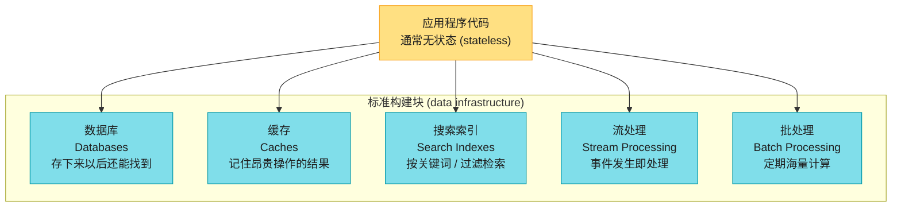

> 💡 **stateless 的含义**:后端应用代码处理完一个 HTTP 请求就"忘掉"了一切;凡是需要跨请求保留的信息,都必须落到客户端或服务端的数据基础设施里。所以**数据系统才是状态真正的归宿**——这也是为什么数据系统的选型如此关键。

难点不在"用对一个数据库",而在"当单个工具不够、需要把多个工具组合起来时,如何推理它们的 trade-offs"。这正是本书要训练的能力。

---

## 2. 操作型系统 vs 分析型系统 (OLTP vs OLAP)

这是全书**最重要的基础区分**之一。先看一个组织里有哪几类人和数据打交道:

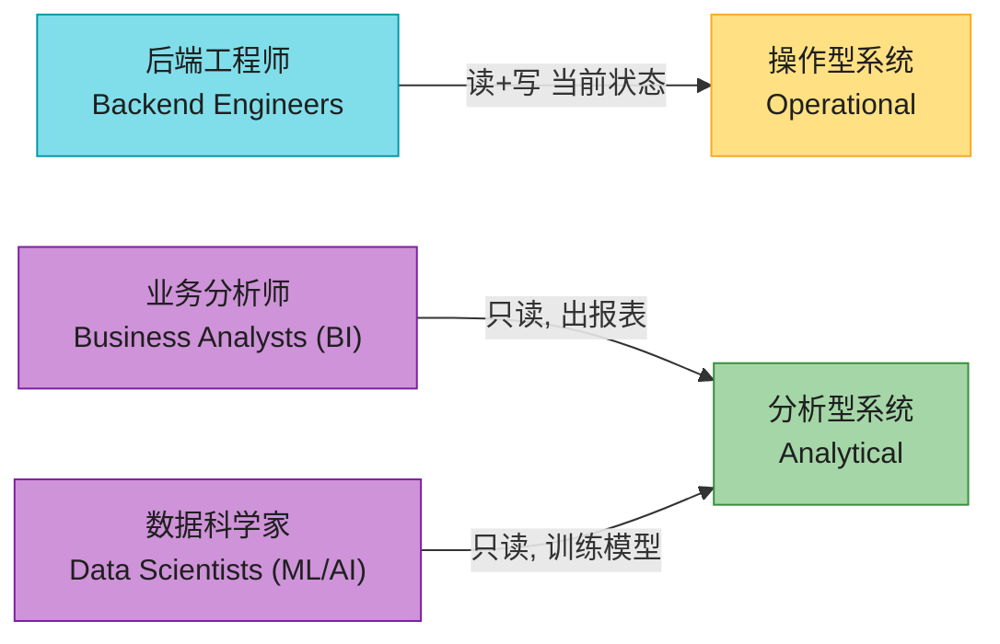

- **操作型系统 (Operational)**:数据在这里被**创建和修改**——服务外部用户的请求,应用代码既读又写。
- **分析型系统 (Analytical)**:存放来自操作系统的**只读副本**,为分析师和数据科学家优化,只做分析不改原数据(除非修正错误)。

### OLTP vs OLAP 特征对比

两者访问模式天差地别,直接上表(对应原书 Table 1-1):

| 属性 | 操作型系统 (OLTP) | 分析型系统 (OLAP) |
|------|-----------------|-----------------|
| **主要读取** | 点查询:按 key 取少量记录 | 聚合:扫描海量记录算 sum/count/avg |
| **主要写入** | 单条记录的增删改 | 批量导入 (ETL) 或事件流 |
| **人类用户** | web/mobile 应用的终端用户 | 内部分析师,辅助决策 |
| **机器用途** | 鉴权:这个动作是否被允许? | 风控:发现欺诈/滥用模式 |
| **查询类型** | 固定的、预定义的查询 | 任意的、即席探索 (ad-hoc) |
| **查询量** | 大量小查询 | 少量但复杂的查询 |
| **数据代表** | 当前时刻的最新状态 | 随时间累积的历史事件 |
| **数据规模** | GB → TB | TB → PB |

> 📝 这里"transaction"沿用自早期商业数据处理(一笔数据库写入对应一笔真实交易,如卖货、下单、发工资),后来含义泛化为"一组构成逻辑单元的读写"。Ch8 会严格定义。

### 为什么必须分离?

直接在 OLTP 库上跑分析查询是大忌,原因有四(适合用列表,不必画图):

1. **数据孤岛 (data silos)**:感兴趣的数据分散在几十个操作系统中,无法在单个查询里合并。
2. **schema 不匹配**:适合 OLTP 的规范化 schema 不适合分析(分析需要星型/雪花模型,见 Ch3)。
3. **互相拖累**:分析查询很贵,会严重影响线上 OLTP 的性能。
4. **网络隔离**:OLTP 系统常处于受保护的网络,分析师不允许直连(安全/合规)。

所以企业通常有**几十上百个 OLTP 系统**(每个微服务一个库),却只有**一个数据仓库**(让分析师能在单查询里跨系统联合分析)。

### 两个值得关注的"中间地带"

| 类别 | 说明 | 代表产品 |
|------|------|---------|
| **Product Analytics / 实时分析** | 面向用户产品的分析负载(聚合查询,但嵌入产品内);实时摄入 + 低延迟查询 | **Apache Pinot、Druid、ClickHouse** [6] |
| **HTAP (混合事务/分析)** | 在一个系统里同时做 OLTP 和 OLAP,免去 ETL | **TiDB**(TiKV 行存 + TiFlash 列存)、**SingleStore** |

> 💡 **HTAP 的真相**:多数 HTAP 系统**内部仍是两个引擎藏在统一接口后**(如 TiDB 的 TiKV 做 OLTP、TiFlash 做 OLAP,两者通过 Raft 复制同步)。所以即使有 HTAP,"操作 vs 分析"的区分对理解系统内部仍然成立。HTAP 不替代数据仓库,它适合"既要扫很多行分析、又要低延迟改单条记录"的混合负载(如**实时风控**)。

---

## 3. 数据分析的架构演进:数仓 → 数据湖 → Lakehouse

数据分析系统的形态在过去 30 年持续演进。先看大图,再拆细节:

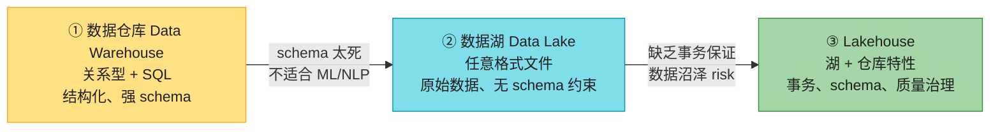

**① 数据仓库 (Data Warehouse)** — 1980s 末兴起。一个独立的数据库,分析师可以随便查而不影响 OLTP [7]。数据通过 **ETL** 灌入:

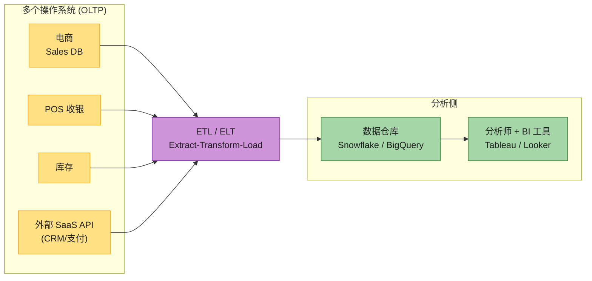

**ETL vs ELT** 的区别在于 Transform 和 Load 谁先:

| 模式 | 流程 | 何时用 |
|------|------|--------|
| **ETL** | 抽取 → 转换 → 加载(转换在外部完成) | 传统做法,仓库算力弱时 |
| **ELT** | 抽取 → 加载原始 → 在仓库内转换 | 现代做法,利用仓库强大算力(dbt 在 Snowflake/BigQuery 里跑 SQL 转换) |

> 🏭 **真实产品**:
> - **抽取层**:SaaS API → 仓库用 **Fivetran / Airbyte / Singer**(专门的 data connector)。
> - **转换层**:**dbt**(在仓库里写 SQL 做 transform,管理依赖和测试)。
> - **编排**:**Airflow / Dagster**(调度 ETL/ELT pipeline)。

**② 数据湖 (Data Lake)** — 数据仓库的关系模型 + SQL 对数据科学家不够用:他们要把表转成特征向量喂给 ML、要对文本做 NLP、要对图片做 CV,这些用 SQL 难表达。于是出现**数据湖**:一个集中式存储,装着"任何可能有用的数据"的副本,**不强制文件格式或 schema** [15]。湖里可能是 Parquet/Avro 记录,也可能是文本、图片、视频、基因组序列、稀疏矩阵、特征向量。

**寿司原则 (Sushi Principle)**:"raw data is better"(原始数据更好)[17]。数据湖保存**原始形态**,每个消费者按需转换,而不是在 ETL 里做不可逆的转换。数据湖常建在廉价的对象存储(如 S3)上,比关系存储便宜。

**③ Lakehouse** — 数据湖灵活但缺事务保证,容易退化成"数据沼泽 (data swamp)"。Lakehouse = 数据湖 + 仓库的事务/管理能力,代表是 **Delta Lake / Apache Iceberg / Apache Hudi**(在对象存储的 Parquet 文件上加一层事务元数据)。

**Reverse ETL** — 分析系统的产出反向推回操作系统:在仓库里训好的 ML 模型部署到线上做推荐/风控,用 **TFX / Kubeflow / MLflow** 部署。

---

## 4. 记录系统 vs 派生数据 (System of Record vs Derived Data)

和"操作 vs 分析"正交的另一组区分,帮助理清**数据在系统间的流动方向**:

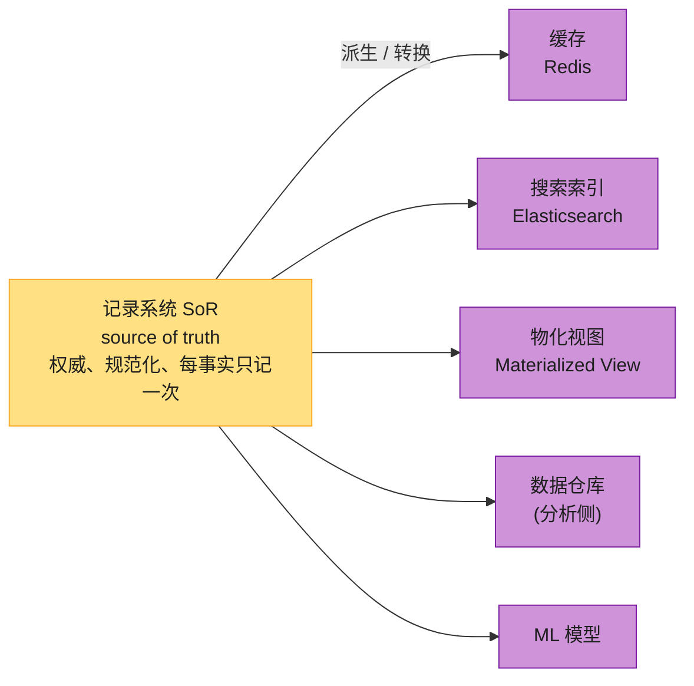

| | 记录系统 (System of Record) | 派生数据系统 (Derived Data) |
|---|---|---|
| **地位** | 权威数据源 (source of truth) | 从其他数据转换而来 |
| **冗余性** | 规范化,每个事实只记一次 | 技术上是冗余的(复制了已有信息) |
| **丢失后** | ❌ 无法恢复(这就是事实本身) | ✅ 可从记录系统**重建** |
| **存在意义** | 承载业务事实 | 优化特定读取模式(性能) |
| **典型** | 各微服务的主数据库 | 缓存、索引、物化视图、数仓、ML 模型 |

> 📝 **名词注释**
> - **物化视图 (materialized view)**:把一个(通常较重的)查询结果**预先算好、存成一张实表**,查询时直接读它而不用每次现场算。底层源数据变了就要刷新,所以它是典型的"派生数据"。
> - **source of truth(事实源)**:系统里"以它为准"的那个权威版本,出现不一致时一律听它的。
> - **规范化 (normalized)**:数据库设计里"每个事实只存一处、靠外键关联"的组织方式,目的就是避免冗余和不一致(Ch3 详谈)。
> - **冗余 (redundant)**:同一份信息在多处存了副本。派生数据本质上是"有意为之的冗余"——用多占空间来换读取性能。

> 💡 **一句话判断标准**:"如果这套数据丢了,能不能从别处重建?" 能 → 派生;不能 → 记录系统。
>
> 工具本身不分 SoR/派生——**取决于你怎么用**。Redis 当主存就是 SoR,当 MySQL 的缓存就是派生。澄清"谁派生自谁",能让混乱的架构瞬间清晰。

> 🏭 **工业实践 —— CDC 是派生数据的生命线**:
> 真实系统里,派生数据靠 **Change Data Capture(变更数据捕获)** 同步。**Debezium** 监听 MySQL 的 binlog / PostgreSQL 的 WAL,把行变更当成事件流发到 **Kafka**;下游的 Elasticsearch(建搜索索引)、Redis(刷缓存)、数据仓库(灌分析副本)各自消费、各自重建。这正是"派生数据可重建"的工程体现,也是 Ch11/Ch13 的核心主题。

---

## 5. 云服务 vs 自建 (Cloud vs Self-Hosting)

### 5.1 自己做还是外包?(build vs buy)

任何事第一个问题往往是:**自己做还是外包**?经验法则——**核心竞争力 / 竞争优势**的事自己做,**非核心、常规**的事交给厂商。

> 📝 **名词注释**
> - **build vs buy**:业界对"自建还是采购"的经典权衡,几乎所有技术选型都从这个问题开始。
> - **核心竞争力 (core competency)**:你公司赖以生存、别人难以复制的能力。比如对 Netflix 是推荐算法、对外卖平台是调度算法;而对绝大多数公司,**数据库运维并不是核心竞争力**,所以可以外包。
> - **运维 (operations / ops)**:让软件在生产环境持续跑下去的全部工作——部署、监控、扩容、打补丁、故障恢复。
> - **spectrum(光谱)**:原书用这个词强调"这不是非黑即白的二选一,而是一段连续区间",中间还有过渡形态(比如用开源软件魔改一版自己运维)。

软件这条权衡的关键在于:它其实包含**两个独立的决策**——**谁开发软件** + **谁运维它**。两两组合,就落在区间的不同位置:

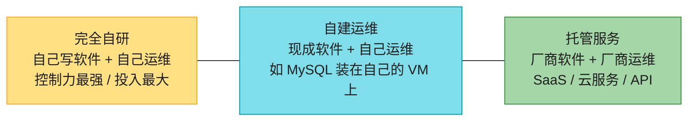

### 5.2 云的优缺点

**适合用云的场景**:负载波动大(分析查询就是典型——跑查询时要大量算力,跑完就闲置);团队不熟悉某系统的部署运维;想快速启动。

**云的最大缺点 = 失去控制力**(适合列表,不画图):

- ❌ 缺功能只能求厂商,自己改不了;
- ❌ 服务挂了只能干等恢复;
- ❌ 触发 bug / 性能问题时,看不到内部指标和日志,调试困难;
- ❌ **供应商锁定 (vendor lock-in)**:很多云服务没有标准 API,迁移成本极高;
- ❌ 地缘政治风险:跨国厂商可能因制裁断供;
- ❌ 隐私合规:要把数据安全托付给厂商。

> 💡 极端反例:对延迟极度敏感的应用(如**高频交易**)需要完全掌控硬件,这类系统不会上云。

### 5.3 云原生架构(本章最核心的技术内容)

"云原生 (cloud native)"不是"把软件搬上 VM",而是**从底层开始利用云服务来搭建高层服务**。下面这张大架构图展示了分层思想,然后我们拆开讲最关键的「存算分离」:

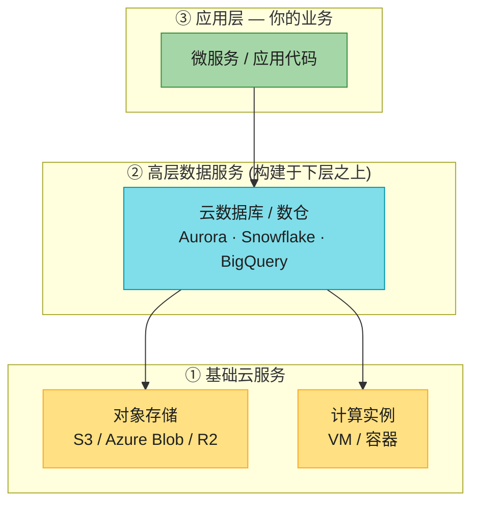

**拆解 1:分层与组合**。对象存储(如 S3)存大文件、API 简单但隐藏了底层物理机、数据自动跨机分布、磁盘/机器坏了也不丢数据。**Snowflake** 就构建在 S3 之上做数仓,又有别的服务构建在 Snowflake 之上。越高层越面向特定场景——需求匹配就用现成的,不匹配才从底层自己搭。

**拆解 2:存算分离(这是云原生最本质的架构变革)**。对比传统和云原生两种架构:

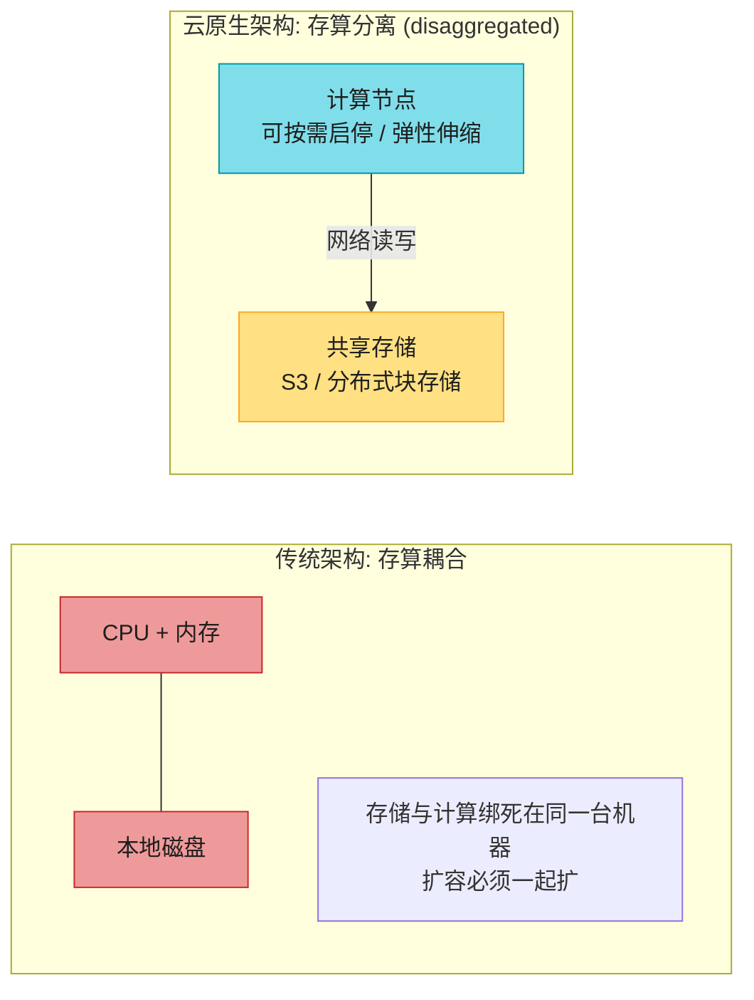

> 🏭 **真实产品怎么做的**:
> - **Amazon Aurora** [24]:把存储层做成跨 3 个 AZ 的共享分布式存储,计算节点(实例)无状态;"the log is the database"——只把日志传给存储层,存储层自己物化出页面。实例可秒级 failover,因为状态都在共享存储。
> - **Snowflake** [26]:数据全部存 S3,计算节点叫 virtual warehouse,可随时按大小启停、按秒计费;查询跑完就释放,真正"用多少付多少"。
> - **Azure SQL Hyperscale / Socrates** [25]:类似地,行/值太小不适合直接存对象存储,所以小值由专门服务管理,打包成大块再存对象存储。

> ⚠️ **虚拟磁盘(EBS)的陷阱**:云厂商也提供可挂载/卸载的虚拟磁盘(EBS、Azure managed disk),它本质是另一组机器模拟的块设备(每块 4 KiB),每次 I/O 都是**网络调用**,对网络抖动极敏感 [27]。真正云原生的系统会避开虚拟磁盘,直接构建在对象存储之上。

**拆解 3:多租户 (multitenancy)**。多个客户共享同一批硬件,提升利用率,但需要精细工程保证一个客户不影响别人的性能和安全 [32]。

### 5.4 自建 vs 云原生数据库对照(对应原书 Table 1-2)

| 类别 | 自建系统 | 云原生系统 |
|------|---------|----------|
| **Operational / OLTP** | MySQL、PostgreSQL、MongoDB | AWS Aurora、Azure SQL Hyperscale、Google Spanner |
| **Analytical / OLAP** | Teradata、ClickHouse、Spark | Snowflake、Google BigQuery、Azure Synapse |

### 5.5 云时代的运维:DevOps / SRE

传统 DBA/sysadmin 关注单机(容量规划、加磁盘、打补丁)。云把"单机"藏到了 API 后面(对象存储用按量计费取代容量规划),运维角色也随之演化:

- **自动化** 优于手动一次性任务;
- **临时 VM / 服务** 优于长期运行的服务器;
- **频繁发布**;
- **从故障中学习**(postmortem);
- **沉淀组织知识**,不因人员流动而流失 [34]。

但运维**并未消失**,只是重心变了:容量规划变成**财务规划**(别浪费云资源钱),性能优化变成**成本优化**;安全、监控、故障排查、服务集成仍然不可外包。

---

## 6. 分布式 vs 单机系统 (Distributed vs Single-Node)

涉及多机经网络通信的系统叫**分布式系统**,每个参与进程叫一个**节点 (node)**。

### 6.1 为什么要分布式?

原书列了 9 条理由,这里用列表(比画 9 个框清晰):

1. **固有分布式**——多用户各用各的设备,天然要联网。
2. **云服务间通信**——数据在一个服务、处理在另一个,必须走网络(微服务/云原生天然分布式)。
3. **容错 / 高可用**——一台机(或整个机房)挂了还能继续服务(见 Ch6)。
4. **可扩展性**——数据量/算力超出单机,分摊到多机(见 Ch7 分片)。
5. **低延迟**——全球用户,服务器部署到靠近他们的地区。
6. **弹性**——忙时扩、闲时缩,按使用付费。
7. **专用硬件**——不同组件用不同硬件(对象存储多磁盘少 CPU;分析多 CPU 大内存无磁盘;ML 用 GPU)。
8. **法律合规**——数据驻留 (data residency) 法要求某些数据必须在特定国家内处理。
9. **可持续性**——把任务调度到可再生能源充足的时间和地点,降碳排放。

### 6.2 分布式的代价(别急着上分布式!)

分布式不是免费午餐,代价包括:

- **网络可能失败**——请求可能丢失/延迟/重复,超时后你甚至不知道对方收没收到,盲目重试可能不安全(见 Ch9)。
- **网络调用慢**——跨服务调用比同进程函数调用慢几个数量级,所以"把计算搬到数据所在地"往往更快。
- **调试困难**——慢了不知道瓶颈在哪,需要**可观测性 (observability)** 和分布式追踪(**OpenTelemetry / Zipkin / Jaeger**,源自 Google 的 **Dapper** [48])。
- **跨服务数据一致性**——每个服务一个库,跨库一致性变成应用的责任;分布式事务(Ch8)很少在微服务里用,因为它违背了"服务独立"的初衷。

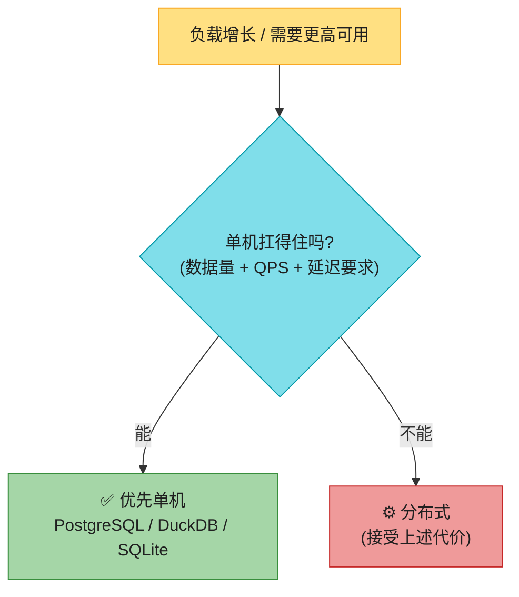

> 💡 **不要急于分布式!** CPUs、内存、磁盘越来越大越来越快。配合 **DuckDB、SQLite、KùzuDB** 这类单机数据库,很多负载一台机器就够了 [22][45][50]。McSherry 等人的论文 *"Scalability! But at What COST?"* [45] 实证指出:很多分布式系统的性能还不如一个**优化好的单线程程序**。详见文末文献。

### 6.3 微服务与 Serverless

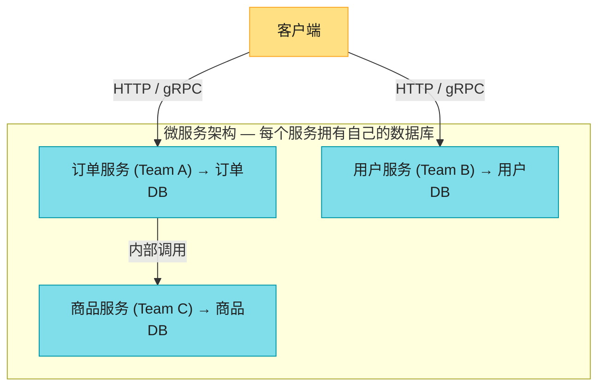

**核心原则**:每个服务有自己的库,**不在服务间共享数据库**——共享数据库会让库结构变成 API 的一部分,后续无法独立演化,还会让一个服务的查询拖慢别人。

> 💡 **微服务的本质是"用技术手段解决人的问题"**:让不同团队能独立推进、不必互相协调。大公司里这很有价值;但**小公司、少团队时,微服务往往是不必要的开销**——用最简单的方式实现才是正解 [51]。

**Serverless (FaaS)**:把基础设施管理外包给云厂商 [32]。云厂商根据请求自动分配/释放资源,你只为代码实际运行时间付费(把按量计费从存储带到代码执行)。代价:函数执行有**时间限制**、运行时受限、首次调用有**冷启动**延迟。注意"serverless"已变成一个营销词——BigQuery、某些 Kafka 服务都自称 serverless,只是表示"自动伸缩 + 按用量计费"。

### 6.4 云计算 vs 超级计算 (HPC)

大规模计算不止云一种,HPC(超算)是另一条路,优先级和技术都不同(用表格更清晰):

| 维度 | 云计算 (Cloud) | 超级计算 (HPC) |
|------|--------------|---------------|
| **用途** | 在线服务、业务系统 | 科学计算(气象、分子动力学、PDE) |
| **故障处理** | 服务持续运行,容忍部分故障 | 停机、修复、从 checkpoint 恢复 |
| **网络** | IP/Ethernet,Clos 拓扑 | 共享内存、RDMA,Mesh/Torus 拓扑 |
| **信任模型** | 互不信任的多租户,需隔离/加密/认证 | 高信任,专用网络 |
| **地理分布** | 跨多区域 | 所有节点通常在一起 |

> 📝 **名词注释**(这行网络术语偏硬件,看不懂可先跳过)
> - **Clos 拓扑**:数据中心常用的"多级交换机层层互连"网络结构,好处是任意两台机器间都有充足带宽(高 bisection bandwidth),Google 的 Jupiter 网络即是 [57]。
> - **RDMA (Remote Direct Memory Access)**:绕过 CPU 和操作系统、直接读写另一台机器内存的技术,延迟极低带宽极高,但要求硬件间互信。
> - **Mesh / Torus(网格 / 环面)**:超算常用的网络拓扑,每个节点与邻居做多维互连,适合通信模式已知的科学计算。
> - **多租户 (multitenancy)**:同一批物理机同时服务多个互不相关的客户(租户),靠隔离保证互不影响——云的常规模式,超算通常没有。
> - **checkpoint(检查点)**:把计算的中间状态定期存盘,节点挂了能从最近的存盘点续算,而不必从头重来。

---

## 7. 数据系统、法律与社会

数据系统的架构不只由技术决定,还受法律和伦理的反向约束。**GDPR** 给了欧洲居民对个人数据的控制权(被遗忘权、数据可携权等),类似法规还有 **CCPA**(加州)、**EU AI Act**(AI 监管);行业层面有 **PCI DSS**(支付卡)、**SOC Type 2**(服务审计)。

最有意思的是:**法律需求会反过来制造工程难题**。比如 GDPR 的"被遗忘权"要求删除某用户数据,但很多数据系统依赖**不可变结构(append-only log)**。删除请求必须级联传播到所有派生数据:

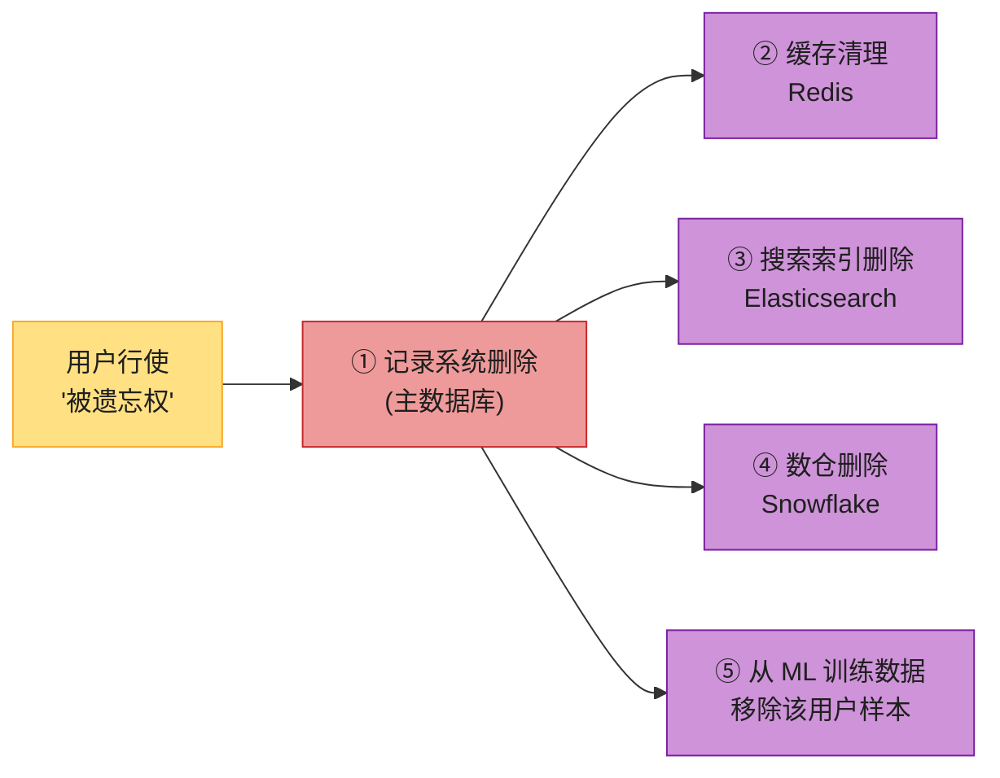

> 💡 这正是"派生数据"概念的价值:你得先知道**哪些数据派生自用户数据**,才能保证删干净。Ch12(流处理)和 Ch13(流系统哲学)会深入"如何在不可变日志上做删除"。

**数据最小化原则 (Datensparsamkeit)** [61]:只收集明确需要的数据,只用于收集时声明的目的,不留存超过必要时间。这和"大数据"哲学(先囤着说不定有用)正面对立。背后是**存储真实成本**的清醒认知:

> 存数据的成本远不止 S3 账单——还包括泄露后的责任与声誉损失、不合规的罚款,甚至**人身安全风险**(位置数据可能暴露去堕胎诊所的行踪、IP 日志可暴露大致位置)。算清这笔账,你会发现**有些数据根本不值得存**。

---

## 🏭 生产级产品速查表

把本章所有概念映射到真实产品,方便面试和实战时调用:

| 概念 | 自建 / 开源 | 云原生 / 托管 | 关键点 |
|------|-----------|-------------|--------|
| **OLTP 数据库** | PostgreSQL、MySQL、MongoDB | AWS Aurora、Cloud Spanner、TiDB | Aurora 存算分离;Spanner 全球强一致 |
| **OLAP / 数仓** | ClickHouse、Spark | Snowflake、BigQuery、Redshift | Snowflake 数据在 S3,计算弹性 |
| **Product Analytics** | Pinot、Druid、ClickHouse | — | 列存 + 实时摄入 + 低延迟 |
| **HTAP** | TiDB (TiKV+TiFlash)、SingleStore | — | 一个接口,内部行存+列存两引擎 |
| **数据湖** | S3 + Parquet/Iceberg/Delta/Hudi | — | 任意格式 + 事务元数据层 |
| **ETL 抽取** | Airbyte、Singer | Fivetran | 连 SaaS API → 仓库 |
| **ELT 转换** | dbt | — | 在仓库内用 SQL 做 transform |
| **编排** | Airflow、Dagster、Prefect | — | 调度 pipeline |
| **CDC(派生数据生命线)** | Debezium → Kafka | — | 监听 binlog/WAL 同步下游 |
| **缓存(派生)** | Redis | ElastiCache、Memorystore | 丢失可从 SoR 重建 |
| **搜索索引(派生)** | Elasticsearch / OpenSearch | — | 同上,可重建 |
| **分布式追踪** | OpenTelemetry、Zipkin、Jaeger | — | 源自 Google Dapper |
| **Serverless** | — | AWS Lambda、BigQuery(serverless) | 按运行时间计费,有冷启动 |

---

## 💻 代码与架构示例

### 示例 1:OLTP vs OLAP 查询模式对比

```sql
-- ===== OLTP: 点查询,按主键取单条,要求低延迟 =====
SELECT * FROM orders WHERE order_id = 12345;

-- OLTP 写入: 单条 CRUD
INSERT INTO orders (user_id, product_id, quantity, created_at)
VALUES (42, 1001, 2, NOW());

-- ===== OLAP: 聚合扫描海量记录 =====
-- 这类查询若直接打到 OLTP 库,可能跑数分钟并拖垮线上服务
SELECT
    store_id,
    DATE_TRUNC('month', sale_date) AS month,
    SUM(amount)            AS total_revenue,
    COUNT(DISTINCT customer_id) AS unique_customers
FROM sales
WHERE sale_date >= '2025-01-01'
GROUP BY store_id, DATE_TRUNC('month', sale_date)
ORDER BY total_revenue DESC;
```

### 示例 2:用 CDC 把派生数据串起来(Python 伪代码)

```python
"""
演示 SoR 与 Derived Data 的关系:
MySQL 是记录系统;Redis 缓存 / Elasticsearch 索引都是派生数据,
通过 CDC(Debezium → Kafka)消费变更事件来保持同步。
"""
from kafka import KafkaConsumer

# Debezium 把 MySQL binlog 转成 Kafka 消息:每行变更一个事件
consumer = KafkaConsumer('mysql.orders', auto_offset_reset='latest')

def handle_change(event):
    op   = event['payload']['op']      # c=create, u=update, d=delete
    row  = event['payload']['after'] or event['payload']['before']
    key  = f"order:{row['id']}"

    if op == 'd':
        cache.delete(key)              # 派生数据 1: 清缓存
        search.delete('orders', row['id'])  # 派生数据 2: 删索引
    else:
        cache.set(key, row)            # 派生数据可随时从 SoR 重建
        search.index('orders', row['id'], row)

for event in consumer:
    handle_change(event)
```

### 示例 3:数据最小化的代码体现

```python
# ❌ 反模式:什么都存(大数据思维)
def log_signup(user):
    db.insert('users', {
        **user,
        'password_plain': user['password'],   # 明文密码!
        'signup_ip': request.ip,               # 收集 IP
        'device_fingerprint': fp,              # 设备指纹
        'location_guess': geoip(request.ip),   # 推断位置
    })  # 一旦泄露,责任、罚款、人身安全风险全来

# ✅ 数据最小化:只存业务必需字段
def log_signup_minimal(user):
    db.insert('users', {
        'id': gen_id(),
        'email': user['email'],
        'password_hash': bcrypt.hash(user['password']),  # 只存哈希
        'created_at': now(),
    })  # 不收集即不承担相应风险
```

---

## 🎯 系统设计面试题

### 面试题 1:设计一个中型电商平台的数据架构 ★重点

**题目**:你正在设计一个中型电商平台(年 GMV 约 10 亿人民币),需要支持:
- 用户浏览、下单、支付(在线交易,DAU 50 万,峰值 QPS 5k)
- 业务团队每日看销售/库存报表
- 数据科学团队训练商品推荐模型
- 遵守 GDPR「被遗忘权」

**第 1 步 · 需求澄清**(面试时主动问):
- 写多还是读多?→ 电商读远大于写(浏览 vs 下单)。
- 分析实时还是离线?→ 报表 T+1 即可,推荐特征近实时。
- 数据驻留?→ 欧洲用户数据须留在欧盟区域。

**第 2 步 · 容量粗估**:
- 订单:50 万 DAU × 5% 转化 ≈ 2.5 万单/天,每单 ~1 KB → 25 MB/天,一年 ~10 GB,3 年 ~30 GB。OLTP 单库轻松。
- 行为日志(浏览/点击):DAU × 50 行 ≈ 2500 万/天 → 数 TB/年,需进数据湖。

**第 3 步 · 高层架构**:

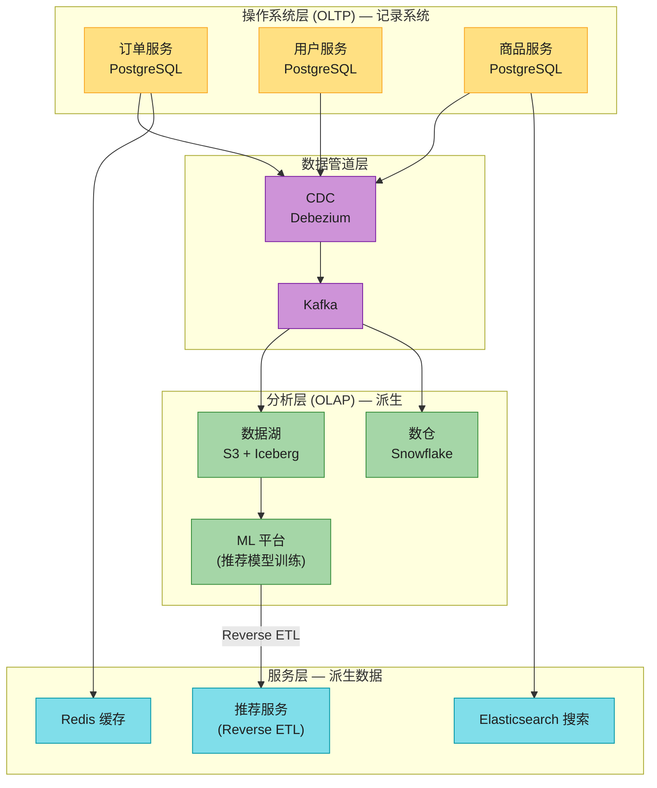

**第 4 步 · 深入讨论**:
- **System of Record**:各微服务的 PostgreSQL 是 SoR;Redis、ES、数仓、推荐模型全是派生数据。
- **ELT 还是 ETL?** → 现代选 ELT:原始事件先进数据湖(Sushi 原则),dbt 在 Snowflake 里做转换。
- **GDPR 删除链路**:用户请求删除 → ① 删 SoR 中该用户 → ② Kafka 发删除事件,下游 Redis/ES/数仓各自消费删除 → ③ 从 ML 训练数据集移除该用户样本并重训或打标记。
- **热点**:大促时某商品 QPS 暴涨 → Redis 缓存 + 读写分离(Ch6 复制)+ 热点 key 本地缓存。

**第 5 步 · 权衡**:
- 选 Aurora/Cloud SQL(托管)还是自建 PG?→ 无专职 DBA + 需要高可用 → 托管。
- 推荐用 Flink 实时算特征还是 Spark 批?→ 看延迟要求(Ch12/13 主题)。

---

### 面试题 2:云 vs 自建 —— 初创 SaaS 的数据库架构选型

**题目**:你是 50 人技术团队(3 后端、0 DBA)的 CTO,产品是 SaaS 平台,DAU 10 万预计一年涨到 100 万,需支持全球用户(美/欧/亚太),预算有限。

**思路**:
- **决策框架**:Build or Buy?→ 无 DBA + 预算有限 + 快速增长 + 全球部署 → **云服务优先**。
- **推荐组合**:
  - OLTP:Aurora / Cloud SQL(托管 PostgreSQL),多区域读副本。
  - 缓存:ElastiCache(托管 Redis)。
  - 分析:BigQuery / Athena(serverless,按查询付费,适合偶尔分析)。
  - 搜索:OpenSearch Service。
- **关键风险与对策**:
  - vendor lock-in → 用标准 SQL/接口,避免厂商专有扩展。
  - 多区域 → 读副本就近,写库主区域 + 异步复制(延迟权衡,见 Ch6)。
  - 成本失控 → 设 billing alert,大查询加 LIMIT/分区。
- **何时考虑迁出自建**:负载变得高度可预测且稳定时,自建可能更便宜 [21][22]。

---

### 面试题 3:微服务 vs 单体 —— 什么时候该拆?

**题目**:公司有个 3 年历史的单体应用,团队从 5 人涨到 50 人,有人提议拆微服务,你怎么评估?

**关键考察点**(微服务本质是组织问题):
- **核心收益是组织解耦**,不是技术优越性。
- **拆分信号**:50 人 ≈ 6–8 个小组 → 协调瓶颈出现 → 可考虑按业务边界拆。
- **拆分的代价**:跨服务数据一致性变复杂(分布式事务?最终一致性?见 Ch8);测试要起一堆依赖服务;API 演进要管 OpenAPI/gRPC 版本(Ch5)。
- **渐进式拆分**:先拆边界最清晰、变更最频繁的模块,不要一次性全拆。
- **小公司少团队时,单体 + 模块化往往更优**——书中原话:"implement in the simplest way possible"。

> 💡 **追问陷阱**:面试官可能问"微服务之间如何保证数据一致?" → 引出 Ch8 分布式事务、Saga 模式、最终一致性;回答时强调"微服务语境下很少用 2PC,因为违背服务独立性"。

---

## 📚 精选文献(只留真正值得读的)

第一章是导论,参考文献 60 多条,绝大多数不必读。下面 5 篇是真正值得花时间的:

| # | 文献 | 为什么值得读 |
|---|------|------------|
| [45] | McSherry et al. *"Scalability! But at What COST?"* HotOS 2015 | **反分布式主义的实证依据**。用单线程精心优化的程序,在多个真实 benchmark 上打败了 100+ 核的 Spark 集群。读完你会对"动辄上分布式"保持警惕。 |
| [24] | Verbitski et al. *"Amazon Aurora"* SIGMOD 2017 | **云原生数据库的奠基论文**。"The log is the database"——把存储层做成跨 AZ 共享、计算无状态。理解存算分离的最佳读物。 |
| [26] | Vuppalapati et al. *"Building an Elastic Query Engine on Disaggregated Storage"* NSDI 2020 | **Snowflake 架构论文**。数据在 S3、计算弹性启停、多租户,云原生数仓的教科书式设计。 |
| [11] | Stonebraker & Çetintemel *"‘One Size Fits All’: An Idea Whose Time Has Come and Gone"* ICDE 2005 | **经典中的经典**。论证"通用数据库已死,专用系统崛起",是理解 OLTP/OLAP/HTAP 分化的思想源头。 |
| [48] | Sigelman et al. *"Dapper"* Google 2010 | **分布式追踪的起源**。理解微服务/分布式系统可观测性的基础,后续 Zipkin/Jaeger/OpenTelemetry 都源于此。 |

> 一本配套书也强烈推荐:**《Fundamentals of Data Engineering》**(Reis & Housley)[3],把本章的 OLTP/OLAP/数仓/数据湖/lakehouse/CDC 串成完整的数据工程生命周期。

---

## 📝 本章要点总结

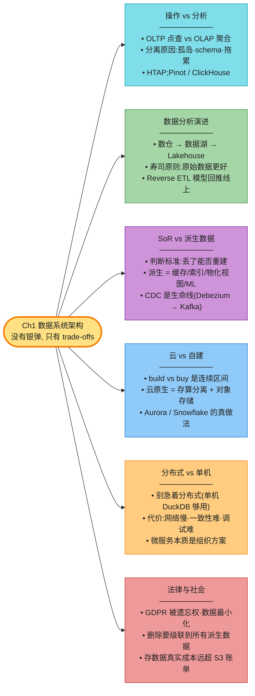

**核心 Takeaways**:

1. **没有银弹**——每个技术选择都是权衡,关键能力是学会提问、比较 trade-offs。
2. **OLTP/OLAP 分离**是数据架构基石,即使 HTAP 出现也抹不掉这个区分。
3. **不要过早分布式**——先评估单机方案(DuckDB/PG),分布式的复杂度代价是真实的。
4. **区分 SoR 和 Derived Data**——"丢了能不能重建"是判断标准,能让架构思维瞬间清晰。
5. **云原生的核心是存算分离**——不是把软件搬上 VM,而是从对象存储开始分层搭建。
6. **技术决策受非技术因素约束**——法律合规、团队能力、组织结构都是真实的约束条件。
