# Chapter 1: 数据系统架构的权衡取舍 (Trade-Offs in Data Systems Architecture)

> *"There are no solutions; there are only trade-offs. [...] But you try to get the best trade-off you can get, and that's all you can hope for."*
> — Thomas Sowell

---

## 📚 核心论文与参考文献

### 必读论文

| # | 论文/资料 | 作者 | 核心内容 | 链接 |
|---|---------|------|--------|------|
| [1] | "The Changing Paradigm of Data-Intensive Computing" | Kouzes et al. | 数据密集型计算范式的演变 | [doi:10.1109/MC.2009.26](https://doi.org/10.1109/MC.2009.26) |
| [7] | "An Overview of Data Warehousing and OLAP Technology" | Chaudhuri & Dayal | 数据仓库与 OLAP 技术综述（经典） | [doi:10.1145/248603.248616](https://doi.org/10.1145/248603.248616) |
| [8] | "Hybrid Transactional/Analytical Processing: A Survey" | Özcan et al. | HTAP 混合事务/分析处理综述 | [doi:10.1145/3035918.3054784](https://doi.org/10.1145/3035918.3054784) |
| [10] | "HTAP Databases: A Survey" | Zhang et al. | HTAP 数据库全面综述 (2024) | [doi:10.1109/TKDE.2024.3389693](https://doi.org/10.1109/TKDE.2024.3389693) |
| [11] | "'One Size Fits All': An Idea Whose Time Has Come and Gone" | Stonebraker & Çetintemel | 通用数据库已死，专用系统崛起 | [doi:10.1109/ICDE.2005.1](https://doi.org/10.1109/ICDE.2005.1) |
| [15] | "Data Lakes: A Survey of Functions and Systems" | Hai et al. | 数据湖功能与系统综述 | [doi:10.1109/TKDE.2023.3270101](https://doi.org/10.1109/TKDE.2023.3270101) |
| [24] | "Amazon Aurora: Design Considerations for High Throughput Cloud-Native Relational Databases" | Verbitski et al. | Aurora 云原生数据库设计 | [doi:10.1145/3035918.3056101](https://doi.org/10.1145/3035918.3056101) |
| [26] | "Building an Elastic Query Engine on Disaggregated Storage" | Vuppalapati et al. (Snowflake) | Snowflake 存算分离架构 | [NSDI 2020](https://www.usenix.org/conference/nsdi20/presentation/vuppalapati) |
| [32] | "Cloud Programming Simplified: A Berkeley View on Serverless Computing" | Jonas et al. | 伯克利视角看 Serverless | [arXiv:1902.03383](https://arxiv.org/abs/1902.03383) |
| [45] | "Scalability! But at What COST?" | McSherry et al. | 分布式系统的可扩展性 vs 单机性能 | [HotOS 2015](https://www.usenix.org/conference/hotos15/workshop-program/presentation/mcsherry) |
| [48] | "Dapper, a Large-Scale Distributed Systems Tracing Infrastructure" | Sigelman et al. (Google) | Google 分布式追踪系统 Dapper | [Google Research](https://research.google/pubs/pub36356/) |

### 推荐书籍

| 书名 | 作者 | 说明 |
|------|------|------|
| *Site Reliability Engineering* [33] | Beyer et al. (Google) | Google SRE 实践 |
| *Fundamentals of Data Engineering* [3] | Joe Reis & Matt Housley | 数据工程基础 |
| *Building Microservices* (2nd) [51] | Sam Newman | 微服务架构 |
| *Weapons of Math Destruction* [59] | Cathy O'Neil | 大数据如何加剧不平等 |
| *The Datacenter as a Computer* (3rd) [54] | Barroso et al. | 数据中心即计算机 |

### 中文资源

- Stonebraker 的 "One Size Fits All" 论文解读：搜索「数据库 一刀切 Stonebraker」可找到多篇中文博客
- Aurora 论文中文解读：搜索「Amazon Aurora 论文解读」
- Dapper 论文有大量中文翻译：搜索「Dapper 分布式追踪 论文翻译」
- DDIA 第一版中文翻译项目：[github.com/Vonng/ddia](https://github.com/Vonng/ddia)（第一版，但基础概念相通）

---

## 🗺️ 章节概览

本章是全书的导航图，定义了贯穿全书的核心术语和基本取舍维度。核心论点：**没有万能的数据系统，只有权衡取舍**。

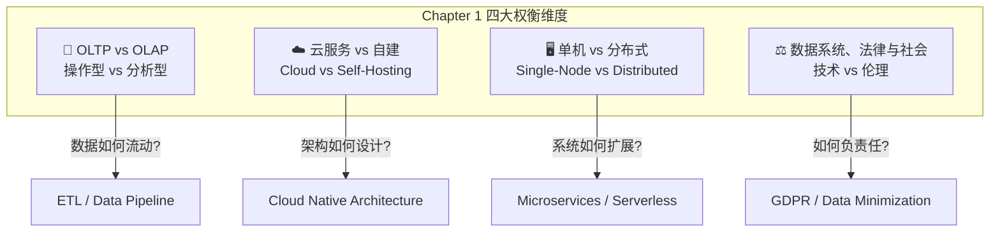

---

## 📖 详细内容

### 1.1 数据密集型应用的核心组件

一个典型的数据密集型应用通常由以下标准构建块组成：

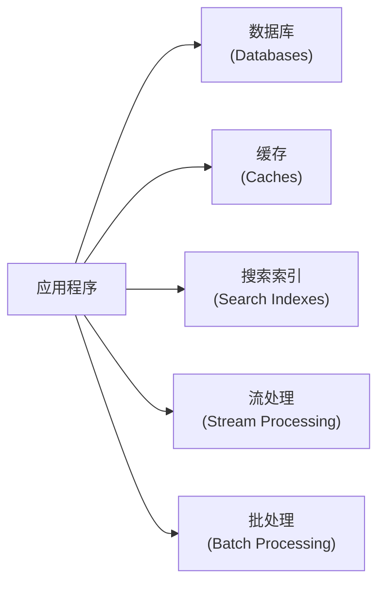

`★ Insight ─────────────────────────────────────`
- **data-intensive vs compute-intensive**：数据密集型应用的核心挑战是数据量、数据复杂度、数据变化速度，而非原始计算能力。这是本书的根本出发点。
- 本书的核心方法论：不是教你用某个特定工具，而是教你**如何思考和比较**不同数据系统的 trade-offs。
`─────────────────────────────────────────────────`

### 1.2 操作型系统 vs 分析型系统 (Operational vs Analytical)

这是全书最重要的基础区分之一。

#### OLTP vs OLAP 特征对比

| 属性 | 操作型系统 (OLTP) | 分析型系统 (OLAP) |
|------|-----------------|-----------------|
| **主要读取模式** | 按 key 查询少量记录 (point query) | 聚合扫描大量记录 |
| **主要写入模式** | 单条记录的 CRUD | 批量导入 (ETL) 或事件流 |
| **典型用户** | 终端用户 / 应用程序 | 业务分析师 / 数据科学家 |
| **机器用例** | 权限检查、欺诈检测 | 发现异常模式 |
| **查询类型** | 固定、预定义的查询 | 即席查询 (ad-hoc)、探索性 |
| **查询量** | 大量小查询 | 少量复杂查询 |
| **数据代表** | 当前时刻的最新状态 | 历史事件记录 |
| **数据集大小** | GB → TB | TB → PB |

#### 为什么要分离 OLTP 和 OLAP？

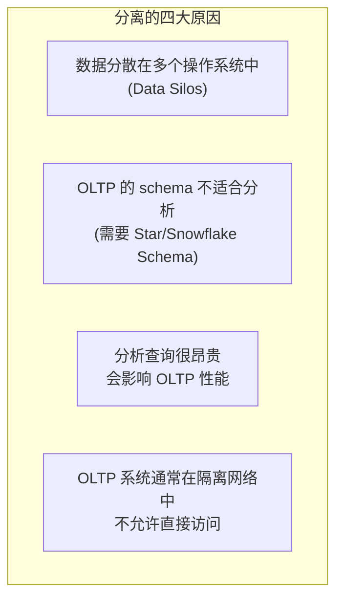

`★ Insight ─────────────────────────────────────`
- **Product Analytics (实时分析)** 是一个新兴类别：Pinot、Druid、ClickHouse 这类系统介于 OLTP 和 OLAP 之间，实时摄入 + 低延迟查询。传统 OLAP 是批量导入 + 高吞吐查询。
- **HTAP (混合事务/分析处理)** 试图在一个系统里同时支持 OLTP 和 OLAP。但多数 HTAP 系统内部仍是两个引擎藏在统一接口后面（如 TiDB 的 TiKV + TiFlash）。
`─────────────────────────────────────────────────`

### 1.3 数据仓库 (Data Warehousing)

#### ETL 流程

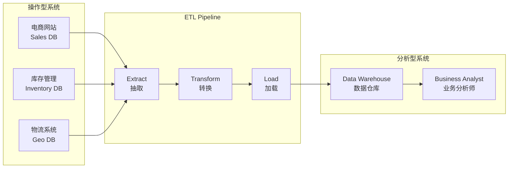

**ETL vs ELT**：
- **ETL**：先转换再加载（传统方式）
- **ELT**：先加载原始数据再在仓库中转换（现代方式，利用仓库的计算能力）

#### 从数据仓库到数据湖

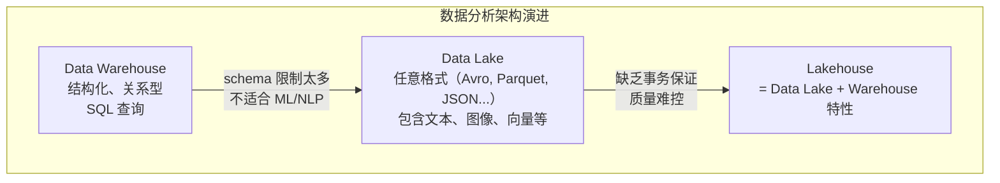

**关键概念 — Sushi Principle（寿司原则）**："raw data is better"（原始数据更好）。数据湖保存原始数据，让每个消费者按需转换，而不是在 ETL 过程中做不可逆的转换。

#### Reverse ETL

分析系统的输出反向推回操作系统：
- ML 模型部署到生产环境（推荐系统、欺诈检测）
- 使用 TFX、Kubeflow、MLflow 等工具

### 1.4 记录系统 vs 派生数据 (System of Record vs Derived Data)

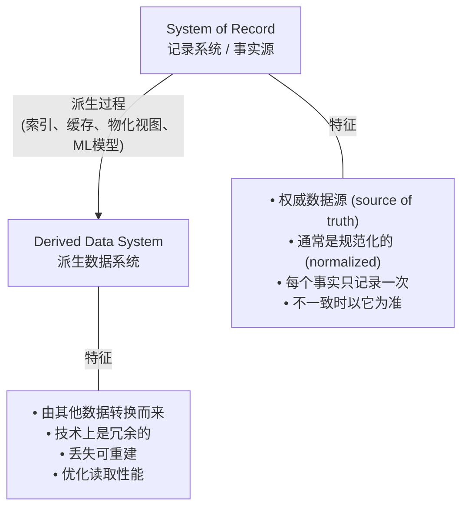

`★ Insight ─────────────────────────────────────`
- 数据库本身不是天然的 System of Record 或 Derived System —— 取决于你怎么用。一个 Redis 缓存是 Derived，但 Redis 做主存储时就是 System of Record。
- 这个区分会在 Ch11（批处理）和 Ch13（流系统哲学）中成为核心主题。
`─────────────────────────────────────────────────`

### 1.5 云服务 vs 自建 (Cloud vs Self-Hosting)

#### 软件部署的光谱

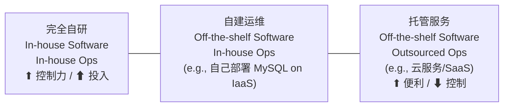

#### 自建 vs 云原生数据库对比

| 类别 | 自建系统 | 云原生系统 |
|------|---------|----------|
| **Operational/OLTP** | MySQL, PostgreSQL, MongoDB | AWS Aurora, Azure SQL DB Hyperscale, Google Cloud Spanner |
| **Analytical/OLAP** | Teradata, ClickHouse, Spark | Snowflake, Google BigQuery, Azure Synapse |

#### 云服务的优缺点

**优点：**
- 负载波动大时更划算（弹性计费 metered billing）
- 不需要容量规划（尤其是存储）
- 高可用，单机故障透明
- 运维外包，团队可聚焦业务

**缺点：**
- 失去控制力：功能缺失只能等厂商、宕机只能等恢复
- 调试困难：无法查看内部指标和日志
- **供应商锁定 (Vendor Lock-in)**：缺乏标准 API，迁移成本高
- 地缘政治风险：数据合规、制裁
- 安全信任：云厂商需要被信任能保护你的数据

#### 云原生架构的关键特征

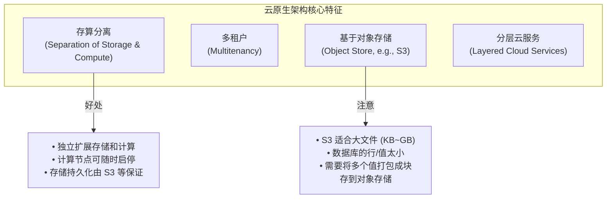

`★ Insight ─────────────────────────────────────`
- **存算分离**是云原生最核心的架构变革。传统系统中同一台机器负责存储和计算，云原生中 S3 只负责存储，计算节点可以弹性伸缩。这直接影响了 Ch4 存储引擎的设计。
- **虚拟磁盘 (EBS) 的陷阱**：每个 I/O 都是网络调用，对网络抖动极度敏感。真正的云原生系统会避免使用虚拟磁盘，直接构建在对象存储之上。
`─────────────────────────────────────────────────`

### 1.6 云时代的运维 (Operations in the Cloud Era)

**传统运维 → DevOps/SRE 转型**：

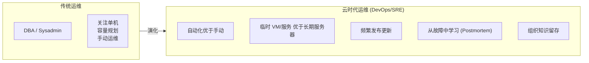

云时代运维的新关注点：
- **成本优化** 取代传统的容量规划
- **服务集成** 成为主要挑战（不同云服务之间缺乏标准）
- **安全**、**监控**、**故障排查** 仍然不可外包

### 1.7 分布式 vs 单机系统 (Distributed vs Single-Node)

#### 为什么要分布式？

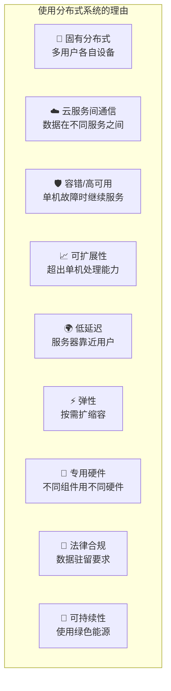

#### 分布式系统的代价

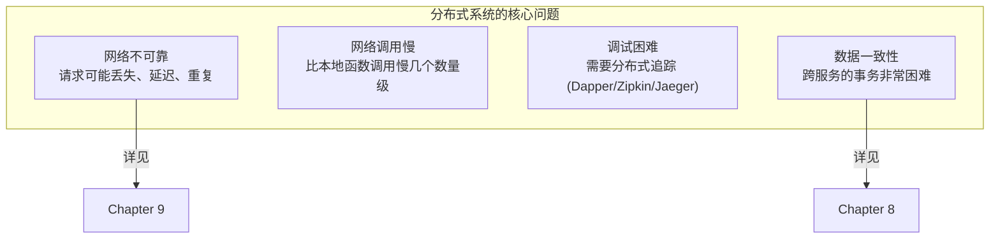

**重要观点**：不要急于分布式！

> "CPUs, memory, and disks have grown larger, faster, and more reliable. When combined with single-node databases such as DuckDB, SQLite, and KùzuDB, many workloads can now run on a single node." — p21

`★ Insight ─────────────────────────────────────`
- McSherry et al. 的论文 "Scalability! But at What COST?" [45] 指出：很多分布式系统的性能还不如优化好的单机程序。**分布式不是免费的午餐**。
- **微服务的本质是组织问题的技术解决方案**：允许不同团队独立推进。小公司、少团队时，微服务可能是不必要的开销。
`─────────────────────────────────────────────────`

### 1.8 微服务与 Serverless

#### 微服务架构

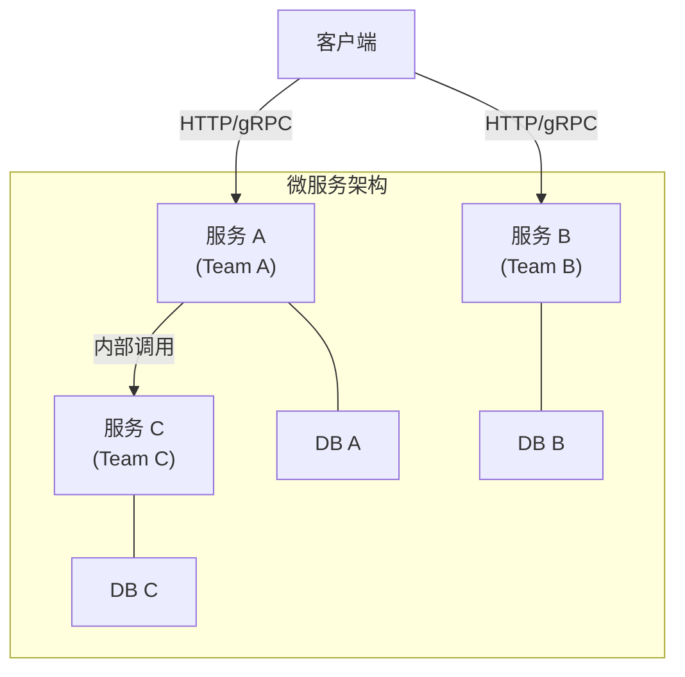

**核心原则**：每个服务拥有自己的数据库，不共享数据库。共享数据库会让数据库结构成为 API 的一部分，难以独立演化。

#### Serverless (FaaS)

- 云厂商自动分配和释放资源
- 按实际执行时间计费
- 限制：执行时间限制、冷启动延迟
- "Serverless" 越来越变成一个计费模型术语（BigQuery、Kafka 都自称 Serverless）

### 1.9 云计算 vs 超级计算 (Cloud vs HPC)

| 维度 | 云计算 | 超级计算 (HPC) |
|------|--------|---------------|
| **用途** | 在线服务、业务系统 | 科学计算、模拟 |
| **故障处理** | 服务持续运行，容忍部分故障 | 停机、修复、从 checkpoint 恢复 |
| **网络** | IP/Ethernet，Clos 拓扑 | 共享内存、RDMA，Mesh/Torus 拓扑 |
| **信任模型** | 互不信任的多租户 | 高信任，专用网络 |
| **地理分布** | 多区域 | 所有节点通常在一起 |

### 1.10 数据系统、法律与社会

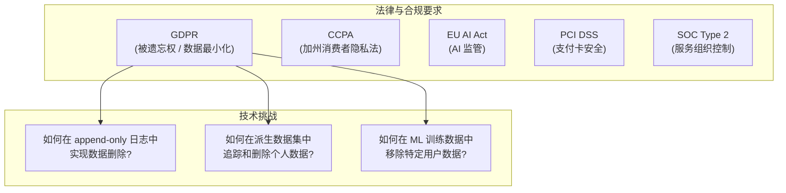

**数据最小化原则 (Datensparsamkeit)**：
- 只收集明确需要的数据
- 只用于收集时声明的目的
- 不保留超过必要时间
- 与"大数据"哲学（先收集再说）形成对立

`★ Insight ─────────────────────────────────────`
- GDPR 的「被遗忘权」对很多依赖不可变日志 (immutable log) 的架构构成根本性挑战。这在 Ch12（流处理）和 Ch13（流系统哲学）中会深入讨论。
- 数据存储的真正成本不仅是 S3 账单，还包括泄露风险、合规罚款、声誉损失。**有些数据不值得存**。
`─────────────────────────────────────────────────`

---

## 💻 代码示例与最佳实践

### 实践 1: OLTP vs OLAP 查询模式对比 (SQL)

```sql
-- ========================================
-- OLTP 典型查询: 点查询 (Point Query)
-- 按主键查找单条记录，低延迟
-- ========================================
SELECT * FROM orders WHERE order_id = 12345;

-- OLTP 典型写入: 单条 CRUD
INSERT INTO orders (user_id, product_id, quantity, created_at)
VALUES (42, 1001, 2, NOW());

-- ========================================
-- OLAP 典型查询: 聚合扫描大量记录
-- 扫描数百万行，计算统计量
-- ========================================
SELECT
    store_id,
    DATE_TRUNC('month', sale_date) AS month,
    SUM(amount) AS total_revenue,
    COUNT(DISTINCT customer_id) AS unique_customers
FROM sales
WHERE sale_date >= '2025-01-01'
GROUP BY store_id, DATE_TRUNC('month', sale_date)
ORDER BY total_revenue DESC;

-- OLAP: 跨表关联分析 (为什么需要数据仓库)
-- 这种查询在 OLTP 数据库上运行可能需要数分钟，严重影响线上服务
SELECT
    p.category,
    AVG(r.rating) AS avg_rating,
    COUNT(*) AS review_count
FROM products p
JOIN reviews r ON p.product_id = r.product_id
JOIN orders o ON r.order_id = o.order_id
WHERE o.created_at >= '2025-01-01'
GROUP BY p.category
HAVING COUNT(*) > 100;
```

### 实践 2: ETL Pipeline 伪代码 (Python)

```python
"""
简化的 ETL Pipeline 示例
展示从多个操作系统抽取 → 转换 → 加载到数据仓库的基本流程
"""
from datetime import datetime, timedelta

# ========================================
# Extract: 从多个源系统抽取数据
# ========================================
def extract_from_oltp(source_db, last_sync_time):
    """增量抽取：只拉取上次同步之后变更的记录"""
    return source_db.query(
        "SELECT * FROM orders WHERE updated_at > %s",
        [last_sync_time]
    )

# ========================================
# Transform: 清洗、转换、去规范化
# ========================================
def transform_orders(raw_orders, product_lookup, user_lookup):
    """
    将规范化的 OLTP 数据转换为适合分析的去规范化宽表
    这就是为什么分析系统需要不同的 schema
    """
    transformed = []
    for order in raw_orders:
        transformed.append({
            'order_id': order['id'],
            'order_date': order['created_at'],
            # 去规范化: 直接嵌入产品和用户信息，避免运行时 JOIN
            'product_name': product_lookup[order['product_id']]['name'],
            'product_category': product_lookup[order['product_id']]['category'],
            'user_country': user_lookup[order['user_id']]['country'],
            'amount': order['quantity'] * product_lookup[order['product_id']]['price'],
        })
    return transformed

# ========================================
# Load: 写入数据仓库
# ========================================
def load_to_warehouse(warehouse, transformed_data, table_name):
    """批量写入数据仓库 (可以是 Snowflake, BigQuery 等)"""
    warehouse.bulk_insert(table_name, transformed_data)

# ========================================
# Orchestration
# ========================================
def run_etl_pipeline():
    last_sync = get_last_sync_time()

    # Extract from multiple sources
    orders = extract_from_oltp(sales_db, last_sync)
    inventory = extract_from_oltp(inventory_db, last_sync)

    # Transform
    enriched_orders = transform_orders(orders, product_cache, user_cache)

    # Load
    load_to_warehouse(snowflake, enriched_orders, 'fact_orders')

    update_sync_time(datetime.now())
```

### 实践 3: System of Record vs Derived Data 的架构模式

```python
"""
展示 System of Record 和 Derived Data 的关系
以及为什么"数据丢失后能否重建"是关键判断标准
"""

class SystemOfRecord:
    """
    记录系统: 权威数据源
    - 每个事实只记录一次 (normalized)
    - 数据不可从其他系统重建
    """
    def __init__(self, database):
        self.db = database

    def create_order(self, user_id, product_id, quantity):
        # 这是权威事实 — 用户确实下了这个订单
        order = self.db.insert('orders', {
            'user_id': user_id,
            'product_id': product_id,
            'quantity': quantity,
            'created_at': datetime.now()
        })
        return order

class DerivedDataSystem:
    """
    派生数据系统: 从记录系统派生而来
    - 技术上是冗余的
    - 丢失后可以从 System of Record 重建
    - 存在的意义: 优化特定的读取模式
    """
    def __init__(self, cache, search_index):
        self.cache = cache          # Redis: 优化点查询
        self.search = search_index  # Elasticsearch: 优化全文搜索

    def rebuild_from_source(self, source_db):
        """派生数据的核心特征: 可以从源数据完全重建"""
        all_orders = source_db.query("SELECT * FROM orders")

        for order in all_orders:
            # 重建缓存
            self.cache.set(f"order:{order['id']}", order)
            # 重建搜索索引
            self.search.index('orders', order['id'], order)
```

---

## 🎯 系统设计面试题

### 面试题 1: 设计一个电商平台的数据架构

**题目**：你正在设计一个中型电商平台，需要支持：
- 用户浏览商品、下单、支付（在线交易）
- 业务团队需要每天查看销售报表（分析查询）
- 数据科学团队需要训练推荐模型（机器学习）
- 需要遵守 GDPR 的"被遗忘权"

**关键考察点**：OLTP/OLAP 分离、ETL 设计、System of Record 识别、GDPR 合规

**参考思路框架**：

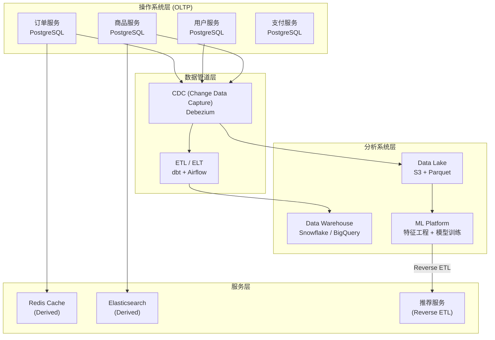

**思考方向**：
- System of Record 是各个微服务的 PostgreSQL
- Cache、Search Index、Data Warehouse 都是 Derived Data
- GDPR 删除请求需要：(1) 删除 SoR 中的用户数据 (2) 级联清理所有 Derived 系统 (3) 从 ML 训练数据中移除
- 选 ELT 还是 ETL？现代做法倾向 ELT —— 原始数据先入湖，在仓库中做转换

---

### 面试题 2: 云服务 vs 自建 —— 你如何为一个初创公司选择数据库架构？

**题目**：你是一个 50 人技术团队的初创公司 CTO，产品是一个 SaaS 平台：
- 当前 DAU 10 万，预期一年内增长到 100 万
- 团队有 3 个后端工程师，0 个专职 DBA
- 需要支持全球用户（美国、欧洲、亚太）
- 预算有限

**关键考察点**：Build vs Buy 决策、云原生架构、团队能力匹配、成本模型

**思考方向**：

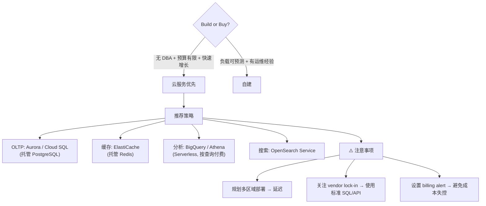

---

### 面试题 3: 微服务 vs 单体 —— 什么时候该拆分？

**题目**：你的公司有一个 3 年历史的单体应用，团队从 5 人增长到 50 人。有人提议拆分为微服务。你怎么评估？

**关键考察点**：微服务的本质是组织问题、数据一致性挑战、拆分时机

**思考方向**：
- 微服务的核心收益是**组织解耦**，不是技术优越性
- 50 人团队 → 大约 6-8 个小组 → 开始出现协调瓶颈 → 可以考虑拆分
- 但要注意：每个服务独立数据库 → 跨服务数据一致性变复杂 → 分布式事务？最终一致性？
- **渐进式拆分**：先识别边界最清晰的模块，不要一次性全拆
- "Implement in the simplest way possible" — 书中的建议

---

## 📝 本章要点总结

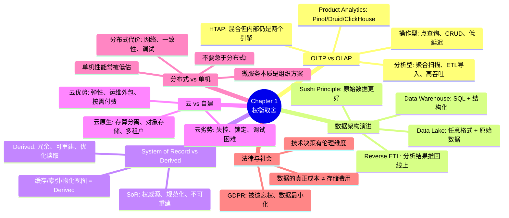

### 核心 Takeaways

1. **没有银弹**：每种技术选择都是权衡，关键是理解 trade-offs
2. **OLTP/OLAP 分离**是数据架构的基石，即使 HTAP 出现也不会完全消除这个区分
3. **不要过早分布式**：先评估单机方案，分布式的复杂度代价是真实的
4. **区分 System of Record 和 Derived Data**：这能让你的架构思维更清晰
5. **技术选择受非技术因素影响**：法律合规、团队能力、组织结构都是约束条件
6. **云原生的核心是存算分离**，不仅是把软件搬到 VM 上
