# 第2章：定义非功能性需求 (Defining Nonfunctional Requirements)

> *"The Internet was done so well that most people think of it as a natural resource like the Pacific Ocean, rather than something that was man-made."*
> — Alan Kay

---

## 📚 核心论文与参考文献

### 必读论文

| # | 论文/资料 | 作者 | 核心内容 | 链接 |
|---|---------|------|--------|------|
| [7] | "Metastable Failures in Distributed Systems" | Bronson et al. | 分布式系统中的亚稳态故障 | [doi:10.1145/3458336.3465286](https://doi.org/10.1145/3458336.3465286) |
| [9] | "Metastable Failures in the Wild" | Huang et al. | 真实生产环境中的亚稳态故障案例 | [OSDI 2022](https://www.usenix.org/conference/osdi22/presentation/huang-lexiang) |
| [18] | "Fail-Slow at Scale: Evidence of Hardware Performance Faults in Large Production Systems" | Gunawi et al. | 大规模系统中的"慢故障"现象 | [FAST 2018](https://www.usenix.org/conference/fast18/presentation/gunawi) |
| [20] | "Dynamo: Amazon's Highly Available Key-Value Store" | DeCandia et al. | Amazon Dynamo 设计（经典） | [doi:10.1145/1294261.1294281](https://doi.org/10.1145/1294261.1294281) |
| [27] | "The Tail at Scale" | Dean & Barroso (Google) | 尾延迟问题及应对策略 | [doi:10.1145/2408776.2408794](https://doi.org/10.1145/2408776.2408794) |
| [32] | "The t-digest: Efficient Estimates of Distributions" | Dunning | t-digest 百分位近似算法 | [doi:10.1016/j.simpa.2020.100049](https://doi.org/10.1016/j.simpa.2020.100049) |
| [35] | "DDSketch: A Fast and Fully-Mergeable Quantile Sketch" | Masson et al. | DDSketch 分位数近似算法 | [doi:10.14778/3352063.3352135](https://doi.org/10.14778/3352063.3352135) |
| [40] | "Simple Testing Can Prevent Most Critical Failures" | Yuan et al. | 简单测试可以预防大多数关键故障 | [OSDI 2014](https://www.usenix.org/conference/osdi14/technical-sessions/presentation/yuan) |
| [42] | "Failure Trends in a Large Disk Drive Population" | Pinheiro et al. (Google) | Google 硬盘故障率研究 | [FAST 2007](https://www.usenix.org/conference/fast-07/failure-trends-large-disk-drive-population) |
| [70] | "How Complex Systems Fail" | Cook | 复杂系统如何失败（经典短文） | [web.mit.edu](https://how.complexsystems.fail/) |
| [84] | "The Case for Shared Nothing" | Stonebraker | Shared-Nothing 架构的经典论述 | [perma.cc/P9YL-C4PS](https://perma.cc/P9YL-C4PS) |
| [95] | "No Silver Bullet — Essence and Accident in Software Engineering" | Brooks | 本质复杂性 vs 偶然复杂性（经典） | *The Mythical Man-Month*, 1995 |

### 推荐书籍

| 书名 | 作者 | 说明 |
|------|------|------|
| *Chaos Engineering* [41] | Rosenthal & Jones | 混沌工程原理与实践 |
| *Release It!* (2nd) [12] | Michael Nygard | 发布生产级软件的实践 |
| *Implementing SLOs* [28] | Alex Hidalgo | SLO/SLI/Error Budget 实践指南 |
| *The Field Guide to Understanding "Human Error"* (3rd) [73] | Sidney Dekker | 理解"人为错误"的本质 |
| *Drift into Failure* [74] | Sidney Dekker | 复杂系统如何渐进式失败 |
| *Domain-Driven Design* [98] | Eric Evans | 领域驱动设计 |
| *Kill It with Fire* [89] | Marianne Bellotti | 遗留系统的现代化策略 |

### 中文资源

- "The Tail at Scale" 论文有大量中文解读：搜索「尾延迟 Jeff Dean」
- Richard Cook 的 "How Complex Systems Fail" 有中文翻译：搜索「复杂系统如何失败 Cook」
- Amazon Dynamo 论文中文解读：搜索「Dynamo 论文翻译」
- Brooks "No Silver Bullet" 中文版收录在《人月神话》中
- 混沌工程中文社区：搜索「Netflix Chaos Monkey 混沌工程」

---

## 🗺️ 章节概览

本章通过一个 **Twitter/X 社交网络时间线** 的案例，引出四大非功能性需求的定义和度量方法。

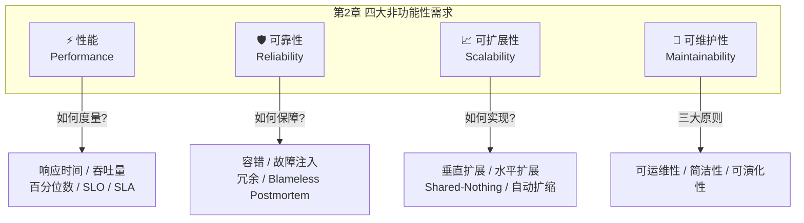

---

## 📖 详细内容

### 2.1 案例研究：社交网络的 Home Timeline

这个案例贯穿全章，用来具体化性能和可扩展性的概念。

#### 基本假设

- **5 亿条** 推文/天，约 **5,800 条/秒**，峰值可达 **150,000 条/秒**
- 平均每用户关注 200 人，有 200 个粉丝
- 少数名人有 **1 亿+ 粉丝**（如 Obama）
- 要求：发布后 **5 秒内** 被粉丝看到

#### 方案一：拉模式 (Pull / Fan-out on Read)

```sql
-- 每次用户请求 Home Timeline 时实时查询
SELECT posts.*, users.* FROM posts
  JOIN follows ON posts.sender_id = follows.followee_id
  JOIN users   ON posts.sender_id = users.id
  WHERE follows.follower_id = current_user
  ORDER BY posts.timestamp DESC
  LIMIT 1000
```

**问题**：
- 1000 万在线用户 × 每 5 秒轮询 = **200 万次查询/秒**
- 每次查询需 JOIN 200 个关注用户的推文 → **4 亿次查找/秒**

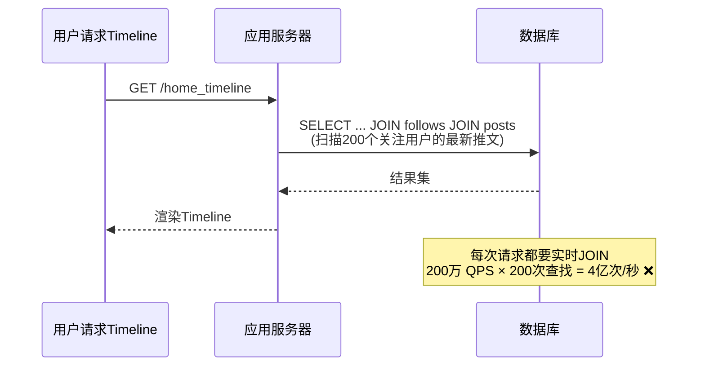

#### 方案二：推模式 (Push / Fan-out on Write / 物化)

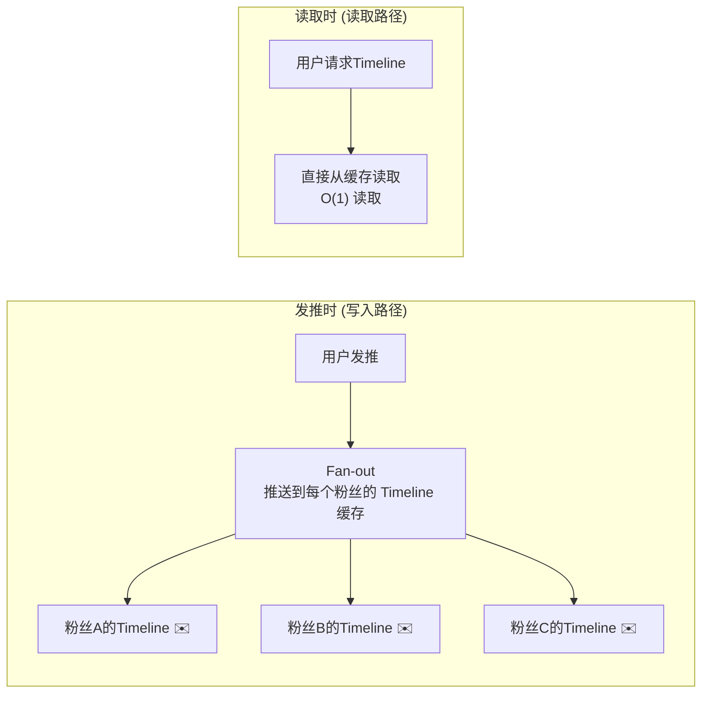

**优势**：
- 5,800 推/秒 × 200 粉丝 = **约 100 万次写入/秒**（比 4 亿次查找少得多）
- 读取是 O(1)，直接从预计算的 Timeline 缓存返回
- 流量高峰时可入队列，延迟些许可接受

**这就是物化视图 (Materialized View) 的思想** — 预计算查询结果，用写入时的额外工作换取读取时的速度。

#### 名人问题 (Celebrity Problem)

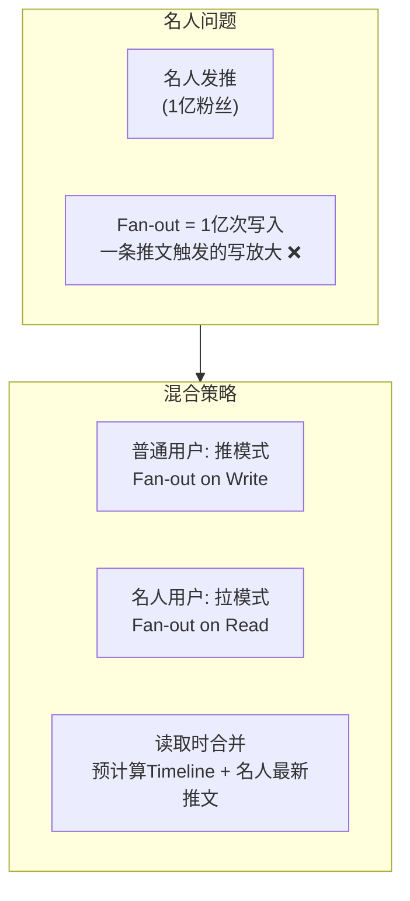

`★ Insight ─────────────────────────────────────`
- 这个案例完美展示了 **read-heavy vs write-heavy 的权衡**。推模式把计算从读路径移到写路径，是典型的空间换时间。
- 名人问题是一个 **hot spot** 的经典例子 — 不均匀的粉丝分布导致单纯的推模式无法工作，需要混合策略。这种思维在 Ch7（分片）中会再次出现。
- Bluesky 甚至选择了"有损 Timeline" [5] — 对于关注很多人的用户，丢弃部分推文是可以接受的。这是一种务实的工程权衡。
`─────────────────────────────────────────────────`

### 2.2 描述性能 (Describing Performance)

#### 两大性能指标

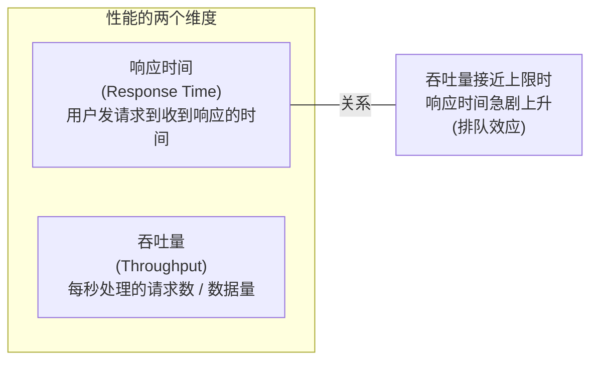

#### 响应时间的构成


**关键区分**：
- **Response Time（响应时间）** = 客户端感知的全部时间（包括网络 + 排队 + 处理）
- **Service Time（服务时间）** = 服务端实际处理请求的时间
- **Latency（延迟）** = 请求处于非活跃处理状态的等待时间
- 必须在**客户端侧**测量响应时间，服务端测量会遗漏排队延迟

#### 队头阻塞 (Head-of-Line Blocking)

服务器同时能处理的请求数有限（受 CPU 核数限制），少量慢请求就会阻塞后续快请求。即使后续请求的 service time 很短，response time 也会因等待前面的慢请求而变长。

#### 系统过载时的恶性循环 (Metastable Failure)

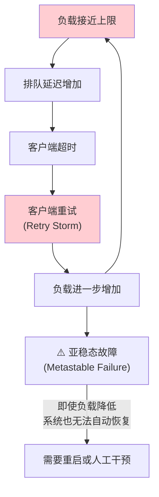

**防御措施**：
- **指数退避 (Exponential Backoff)**：重试间隔指数增长 + 随机抖动
- **熔断器 (Circuit Breaker)**：暂停向出错服务发送请求
- **令牌桶 (Token Bucket)**：限制重试频率
- **负载卸载 (Load Shedding)**：主动拒绝超出承载能力的请求
- **反压 (Backpressure)**：通知客户端降速

`★ Insight ─────────────────────────────────────`
- **Metastable Failure** 是第二版新增的重要概念。与普通过载不同，亚稳态故障的特征是：即使触发条件消失，系统仍然无法自动恢复。Retry storm 是最经典的触发模式。
- 这在微服务架构中尤其危险：一个服务的延迟增加 → 调用方超时重试 → 被调用方负载翻倍 → 级联故障。
`─────────────────────────────────────────────────`

### 2.3 平均值、中位数与百分位数

#### 为什么不用平均值？

```
平均响应时间 = 所有请求响应时间之和 / 请求数

问题：一个 10 秒的异常请求 + 99 个 100ms 的正常请求
平均值 = (10000 + 99×100) / 100 = 199ms

看起来还行？但有 1% 的用户等了 10 秒！
平均值无法告诉你"有多少用户实际体验到了糟糕的延迟"
```

#### 百分位数才是正确的度量


**Amazon 的实践**：用 **p999** 作为内部服务的响应时间要求。因为最慢的请求往往来自数据量最大的用户 — 也就是最有价值的客户 [20]。但 p9999 被认为收益递减，优化成本过高。

#### 尾延迟放大 (Tail Latency Amplification)

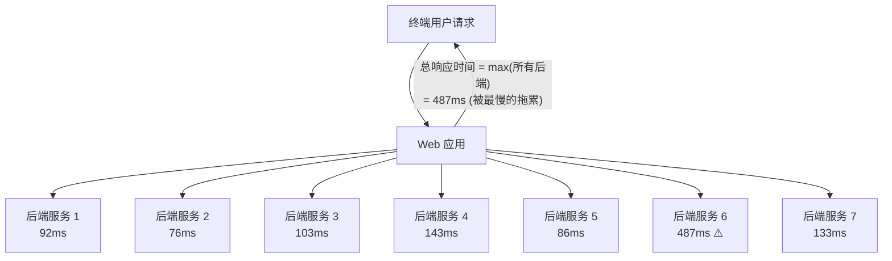

**关键洞察**：当一个终端请求需要并行调用 N 个后端时，整体响应时间取决于**最慢的那个**。即使每个后端的 p99 只有 1%，调用 7 个后端时有约 7% 的概率遇到至少一个慢请求。**调用链越长，尾延迟越严重**。

#### SLO 与 SLA

| 概念 | 定义 | 示例 |
|------|------|------|
| **SLO** (Service Level Objective) | 服务性能目标 | p50 < 200ms, p99 < 1s |
| **SLA** (Service Level Agreement) | 带有违约惩罚的合同 | 99.9% 请求响应正常，否则退款 |

#### 百分位数的计算方法

- **精确方法**：保留时间窗口内所有请求的响应时间，排序取分位
- **近似算法**（推荐用于生产）：
  - **HdrHistogram** [31] — 高动态范围直方图
  - **t-digest** [32, 33] — 可合并的分位数估计
  - **DDSketch** [35] — 快速、可合并、有误差保证

**注意**：百分位数**不能**直接取平均来聚合！多台机器的 p99 取平均不等于整体的 p99。正确做法是**合并直方图**再计算。

### 2.4 可靠性与容错 (Reliability and Fault Tolerance)

#### Fault vs Failure

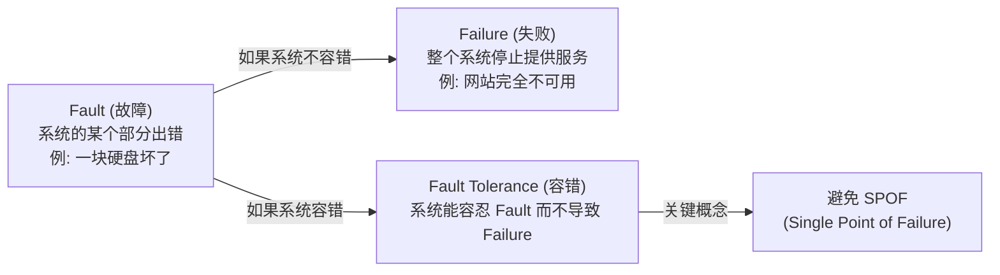

**Fault Injection（故障注入）**：主动注入故障来验证容错能力。Netflix 的 Chaos Monkey 随机杀进程，正是这种思想。**Chaos Engineering（混沌工程）** 是系统化实践这一理念的学科 [41]。

#### 硬件故障

| 组件 | 年故障率 | 说明 |
|------|---------|------|
| 磁盘 (HDD) | 2%-5% | 10,000 块盘 → 每天约 1 块故障 |
| 固态盘 (SSD) | 0.5%-1% | 不可纠正错误率比 HDD 更高 |
| CPU | 1/1000 | 偶尔计算出错误结果（静默数据损坏）|
| 内存 (DRAM) | >1%/年 | 即使有 ECC，仍有不可纠正错误 |
| 整个数据中心 | 罕见但可能 | 断电、火灾、地震、太阳风暴 |

**应对策略**：
- **单机冗余**：RAID、双电源、热备 CPU — 传统方式
- **多机冗余**：分布式系统，任一节点故障不影响服务 — 云时代的主流
- **可用区 (Availability Zone)**：云厂商将可能同时故障的资源分组

**Rolling Upgrade（滚动升级）**：多节点容错系统的额外好处 — 逐一升级节点，不需要停机维护。详见 Ch5。

#### 软件故障

与硬件故障不同，软件故障往往是**高度相关**的 — 同一个 bug 可能同时影响所有节点：

- **闰秒 bug** (2012)：Linux 内核 bug 导致大量 Java 程序同时挂起
- **固件 bug**：某型号 SSD 在精确运行 32,768 小时后集体失败
- **资源耗尽**：一个异常请求触发 OOM，被 OS 杀掉进程
- **级联故障**：一个服务变慢 → 调用方超时 → 重试 → 雪崩
- **跨系统交互**：各系统单独测试正常，组合后出现意外行为

**应对**：没有银弹，需要组合多种手段 — 彻底的测试、进程隔离、允许崩溃重启、避免重试风暴、持续监控。

#### 人为因素

> "配置变更是导致大型互联网服务中断的首要原因，硬件故障只占 10%-25%。" [72]

**关键理念**：

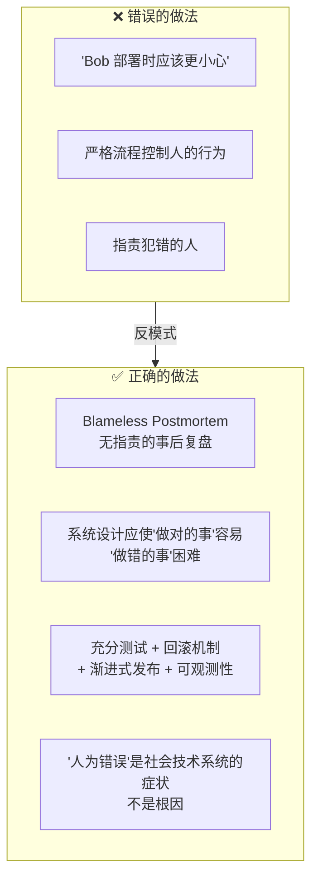

`★ Insight ─────────────────────────────────────`
- **Post Office Horizon 丑闻** [78] 是一个令人震惊的案例：英国邮局的会计软件 bug 导致数百名邮局经理被错误定罪（偷窃/欺诈），因为英国法律**假定计算机输出是可靠的**。这提醒我们：软件不可靠的后果可以超越技术范畴。
- Richard Cook 的 "How Complex Systems Fail" [70] 是仅 3 页的经典短文，每个工程师都应该读。核心观点：复杂系统始终处于"部分故障"状态，安全不是一种状态而是一种持续的活动。
`─────────────────────────────────────────────────`

### 2.5 可扩展性 (Scalability)

#### 理解负载 (Understanding Load)

讨论可扩展性之前，必须先量化负载：
- 请求量 / QPS
- 读写比
- 数据到达速率
- 同时在线用户数
- **关键：找到你的负载瓶颈所在** — 是平均情况还是极端情况主导？

#### 线性可扩展性

> 资源翻倍 → 处理能力翻倍 → 性能不变 = **线性可扩展 (Linear Scalability)**

这是理想情况。现实中成本增长通常**快于**线性（规模不经济），但偶尔也能**慢于**线性（规模经济、更好的负载分布）。

#### 三种扩展架构

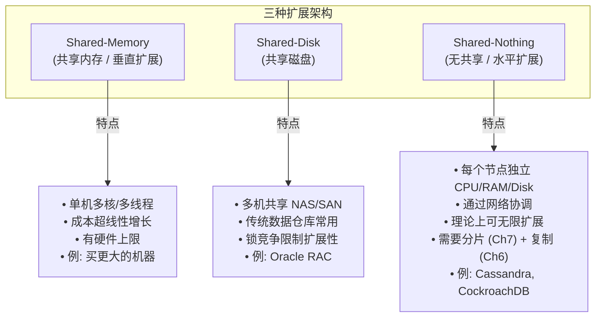

**云原生的变种**：存算分离架构 — 多个计算节点共享同一个存储服务（如 S3），类似 Shared-Disk 但存储 API 是专为数据库优化的，而不是通用文件系统/块设备 [85]。

#### 可扩展性原则

- **没有万能的扩展方案** — 10 万 QPS（每请求 1KB）和 3 QPS/分钟（每请求 2GB）的系统架构完全不同，即使数据吞吐量相同
- **每增长一个数量级就需要重新审视架构**
- **不要过早优化** — 初创公司应 "Choose Boring Technology" [80]，专注灵活性
- **简单优先** — 5 个服务比 50 个服务简单，单机数据库比分布式集群简单
- **务实组合** — 好的架构通常是多种方法的混合

### 2.6 可维护性 (Maintainability)

> "软件的大部分成本不在初始开发，而在持续维护。" [87, 88]

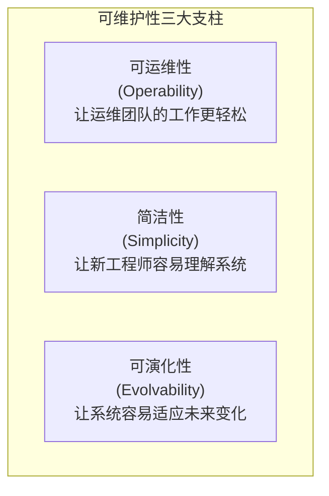

#### 可运维性 (Operability)

好的运维实践：
- 提供监控工具和可观测性，揭示系统运行时行为
- 避免对单机的依赖（任何机器都能下线维护）
- 提供好的文档和操作模型（"如果我做 X，会发生 Y"）
- 提供合理的默认值，同时允许管理员覆盖
- 自我修复，同时给管理员手动控制能力
- 行为可预测，少出意外

**自动化的悖论** [90]：自动化处理了简单情况，留给人类的都是最复杂的边缘情况。因此自动化程度越高，反而需要**更高技能**的运维团队来处理自动化搞不定的问题。

#### 简洁性 (Simplicity)

- **Big Ball of Mud** [93]：复杂度失控的软件项目
- **本质复杂性 vs 偶然复杂性** [95]：
  - 本质复杂性：问题域固有的复杂度，无法消除
  - 偶然复杂性：由工具和实现方式引入的，可以通过更好的抽象来减少
- **抽象**是管理复杂性的最佳工具 — 例如 SQL 隐藏了存储引擎的复杂性

#### 可演化性 (Evolvability)

- 需求**永远在变** — 新功能、新平台、新法规、业务增长
- **松耦合**的系统比紧耦合更容易修改
- **不可逆操作要格外慎重** [100] — 例如数据库迁移如果不能回退，风险极高
- **最小化不可逆性** (Minimize Irreversibility) → 提高灵活性
- 在数据系统层面追求敏捷性，本书称之为 **evolvability**

---

## 💻 代码示例与最佳实践

### 实践 1：百分位数计算与监控

```python
"""
使用 t-digest 计算流式百分位数
这是生产环境中高效计算 p50/p95/p99 的推荐方式
"""
import time
import random
from tdigest import TDigest  # pip install tdigest

class LatencyMonitor:
    """
    滑动窗口百分位数监控器
    注意: 不能对百分位数取平均来聚合!
    正确的方式是合并 digest 后再计算百分位
    """
    def __init__(self, window_seconds=60):
        self.digest = TDigest()
        self.window = window_seconds
        self.measurements = []

    def record(self, latency_ms: float):
        """记录一次请求的延迟"""
        now = time.time()
        self.measurements.append((now, latency_ms))
        self.digest.update(latency_ms)
        # 清理过期数据 (简化实现)
        self._cleanup(now)

    def percentile(self, p: float) -> float:
        """获取第 p 百分位数 (0-100)"""
        return self.digest.percentile(p)

    def report(self) -> dict:
        """生成监控报告"""
        return {
            'p50': self.percentile(50),
            'p95': self.percentile(95),
            'p99': self.percentile(99),
            'p999': self.percentile(99.9),
            'count': len(self.measurements),
        }

    def _cleanup(self, now):
        cutoff = now - self.window
        self.measurements = [
            (t, v) for t, v in self.measurements if t > cutoff
        ]

# 使用示例
monitor = LatencyMonitor(window_seconds=60)

# 模拟请求：大多数很快，少数很慢 (长尾分布)
for _ in range(10000):
    if random.random() < 0.01:  # 1% 慢请求
        monitor.record(random.uniform(500, 5000))
    else:
        monitor.record(random.uniform(5, 100))

print(monitor.report())
# 预期: p50 ~50ms, p95 ~95ms, p99 ~2500ms (尾延迟!)
```

### 实践 2：指数退避 + 抖动 (防止 Retry Storm)

```python
"""
指数退避 + 随机抖动: 防止 Retry Storm 导致亚稳态故障
这是分布式系统中最重要的客户端模式之一
"""
import time
import random

def retry_with_exponential_backoff(
    func,
    max_retries: int = 5,
    base_delay_ms: float = 100,
    max_delay_ms: float = 30000,
    jitter: bool = True
):
    """
    带指数退避和抖动的重试机制

    关键设计决策:
    1. 指数增长: 每次重试间隔翻倍, 避免同时重试
    2. 随机抖动: 打散多个客户端的重试时间点
    3. 上限封顶: 避免等待时间过长
    """
    for attempt in range(max_retries + 1):
        try:
            return func()
        except Exception as e:
            if attempt == max_retries:
                raise  # 最后一次仍然失败, 抛出异常

            # 计算退避时间
            delay = min(base_delay_ms * (2 ** attempt), max_delay_ms)

            if jitter:
                # Full Jitter: 在 [0, delay] 范围内随机选择
                # 这比固定延迟更能分散重试流量
                delay = random.uniform(0, delay)

            print(f"Attempt {attempt+1} failed: {e}. "
                  f"Retrying in {delay:.0f}ms...")
            time.sleep(delay / 1000)


# ========================================
# 熔断器模式 (Circuit Breaker)
# ========================================
class CircuitBreaker:
    """
    简化版熔断器: 连续失败超过阈值时 "断开",
    停止向故障服务发送请求一段时间
    """
    CLOSED = 'closed'      # 正常通行
    OPEN = 'open'          # 断开, 拒绝所有请求
    HALF_OPEN = 'half_open'  # 试探性允许少量请求

    def __init__(self, failure_threshold=5, recovery_timeout=30):
        self.state = self.CLOSED
        self.failure_count = 0
        self.failure_threshold = failure_threshold
        self.recovery_timeout = recovery_timeout
        self.last_failure_time = 0

    def call(self, func):
        if self.state == self.OPEN:
            if time.time() - self.last_failure_time > self.recovery_timeout:
                self.state = self.HALF_OPEN  # 尝试恢复
            else:
                raise Exception("Circuit breaker is OPEN - request rejected")

        try:
            result = func()
            if self.state == self.HALF_OPEN:
                self.state = self.CLOSED  # 恢复成功
                self.failure_count = 0
            return result
        except Exception as e:
            self.failure_count += 1
            self.last_failure_time = time.time()
            if self.failure_count >= self.failure_threshold:
                self.state = self.OPEN
            raise
```

### 实践 3：SLO 监控与告警

```python
"""
SLO 监控: 基于 Error Budget 的告警策略
参考 Google SRE 和 Alex Hidalgo 的 Implementing SLOs [28]
"""
from dataclasses import dataclass
from datetime import timedelta

@dataclass
class SLODefinition:
    """SLO 定义"""
    name: str
    target: float              # 例: 0.999 (99.9%)
    window: timedelta          # 例: 30 天
    metric_type: str           # 'availability' or 'latency'
    latency_threshold_ms: float = None  # 延迟类 SLO 的阈值
    latency_percentile: float = None    # 例: 99 (即 p99)

# 示例 SLO 定义
api_availability_slo = SLODefinition(
    name="API 可用性",
    target=0.999,              # 99.9% 的请求成功
    window=timedelta(days=30),
    metric_type='availability'
)

api_latency_slo = SLODefinition(
    name="API 延迟",
    target=0.99,               # 99% 的请求
    window=timedelta(days=30),
    metric_type='latency',
    latency_threshold_ms=200,  # 在 200ms 内完成
    latency_percentile=99
)

def calculate_error_budget(slo: SLODefinition, total_requests: int,
                           failed_requests: int) -> dict:
    """
    计算 Error Budget (错误预算)

    SLO 99.9% + 30天窗口 + 100万请求/天 = 允许 30,000 个失败请求
    已消耗的 Error Budget 是告警的关键信号
    """
    error_budget_total = total_requests * (1 - slo.target)
    error_budget_remaining = error_budget_total - failed_requests
    burn_rate = failed_requests / error_budget_total if error_budget_total > 0 else 0

    return {
        'slo_name': slo.name,
        'target': f"{slo.target*100}%",
        'error_budget_total': int(error_budget_total),
        'errors_occurred': failed_requests,
        'budget_remaining': int(error_budget_remaining),
        'budget_consumed_pct': f"{burn_rate*100:.1f}%",
        'alert': burn_rate > 0.5,  # 消耗超过50%时告警
    }

# 使用示例
result = calculate_error_budget(
    slo=api_availability_slo,
    total_requests=30_000_000,  # 30天 × 100万/天
    failed_requests=20_000
)
# budget_total = 30,000  已用 20,000  剩余 10,000  消耗 66.7% → 告警!
```

---

## 🎯 系统设计面试题

### 面试题 1：设计一个社交网络的 Feed 流系统

**题目**：设计类似 Twitter/微博 的 Feed 流系统，需要支持：
- 2 亿注册用户，2000 万 DAU
- 用户发帖、关注/取关、查看 Home Timeline
- 5 秒内看到关注的人发的新帖
- 部分用户有千万级粉丝

**关键考察点**：推拉混合模型、Fan-out 计算、名人问题、物化视图

**参考思路**：

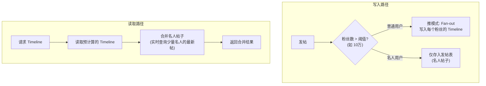

**思考方向**：
- Fan-out 计算：2000 万 DAU × 平均发帖 1 次/天 ÷ 86400 = ~230 帖/秒 × 200 粉丝 = 46000 Timeline 写入/秒
- 存储选型：Timeline 缓存用 Redis（Sorted Set 按时间排序），帖子本体用 MySQL/PostgreSQL
- 名人阈值怎么定？需要动态调整，不是一个固定数字
- 关注/取关时如何处理已有 Timeline？可以懒清理

---

### 面试题 2：设计一个延迟敏感服务的监控告警系统

**题目**：你负责一个电商网站的 API Gateway，需要设计监控系统：
- 每秒 5 万个请求
- SLO：p50 < 100ms, p99 < 500ms, 可用性 99.95%
- 需要实时发现延迟退化和错误率突增
- 告警要快速且不能太多（避免告警疲劳）

**关键考察点**：百分位数计算、滑动窗口、Error Budget、尾延迟放大

**参考思路**：

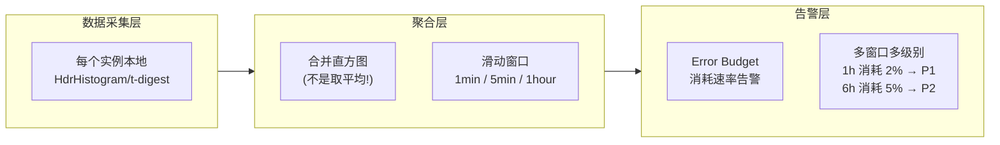

**思考方向**：
- 不能用平均值聚合百分位数 — 必须合并直方图
- 多窗口 burn rate 告警比固定阈值更准确
- 尾延迟放大：API Gateway 调用多个下游，需要逐级追踪

---

### 面试题 3：如何在不停机的情况下升级一个有状态服务？

**题目**：你的服务运行在 20 个节点上，需要将数据库 Schema 从 v1 升级到 v2（有不兼容变更），同时不能中断服务。

**关键考察点**：Rolling Upgrade、向前/向后兼容、Blue-Green 部署

**思考方向**：
- 三阶段部署：(1) 部署可同时读 v1+v2 格式的新代码 (2) 迁移数据 (3) 清理旧格式支持
- 滚动升级：逐一更新节点，容错系统可以容忍部分节点在旧版本
- 回滚计划：如果新版有问题，如何快速回到旧版？
- 数据格式兼容性详见 Ch5

---

## 📝 本章要点总结

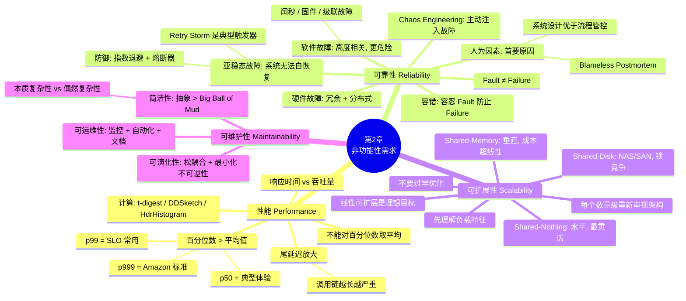

### 核心 Takeaways

1. **用百分位数而非平均值衡量性能** — p50 看典型体验，p99/p999 看尾延迟。不能对百分位数取平均来聚合
2. **尾延迟放大**是微服务架构的固有问题 — 调用链越长，一个慢请求拖慢整体的概率越高
3. **亚稳态故障 (Metastable Failure)** 比普通过载更危险 — Retry Storm 是典型触发器，需要指数退避 + 熔断器来防御
4. **Fault ≠ Failure**，容错系统通过冗余将组件级 Fault 隔离，防止系统级 Failure
5. **软件故障比硬件故障更危险**，因为它们是高度相关的（同一 bug 同时影响所有节点）
6. **"人为错误"是系统问题的症状，不是根因** — Blameless Postmortem 比追责更能防止再次发生
7. **可扩展性不是一维标签** — 没有"可扩展"或"不可扩展"，只有"在特定负载下的扩展方案"
8. **简洁是可维护性之母** — 用好的抽象消除偶然复杂性，每个新系统终将成为遗留系统
