# Chapter 2: 定义非功能性需求 (Defining Nonfunctional Requirements)

> *"The Internet was done so well that most people think of it as a natural resource like the Pacific Ocean, rather than something that was man-made. When was the last time a technology with a scale like that was so error-free?"*
> — Alan Kay

做应用时,你脑子里最先冒出来的是**功能性需求 (functional requirements)**:有哪些页面、哪些按钮、每个操作做什么。但还有一类同样重要却常被忽略的需求——**非功能性需求 (nonfunctional requirements)**:应用要**快**、**可靠**、**安全**、**合规**、**好维护**。一个慢得让人抓狂或动不动就挂的应用,功能再全也等于不存在。

本章聚焦四个非功能性需求,它们贯穿全书后续所有章节:

---

## 🧭 本章导读

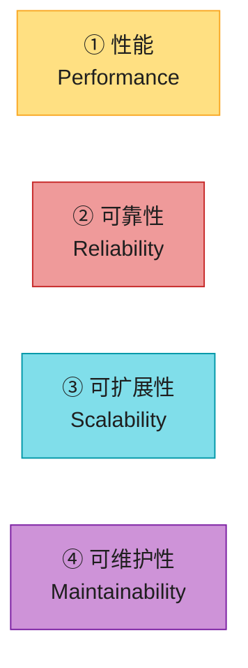

| 维度 | 一句话 | 度量/实现 |
|------|--------|----------|
| ① 性能 | 多快?吞吐多大? | 响应时间百分位(p50/p99/p999)、吞吐量 |
| ② 可靠性 | 出错了还能不能用? | 容错、冗余、混沌工程、blameless postmortem |
| ③ 可扩展性 | 负载涨了扛得住吗? | Shared-Nothing、分片、autoscaling |
| ④ 可维护性 | 改起来痛不痛? | 可运维性、简洁性、可演化性 |

抽象定义很干,所以原书先用一个**社交网络 Home Timeline**的案例把性能和扩展性的概念落地。这个案例也是系统设计面试的高频题,值得吃透。

> 📝 **名词注释**
> - **功能性 vs 非功能性需求**:前者回答"做什么"(发帖、下单),后者回答"做得怎么样"(多快、多稳)。后者常不被显式写下,但同样致命。
> - **SLA / SLO**:本章会反复出现,指服务性能/可用性的目标与合同承诺,详见 §3。

---

## 1. 案例:社交网络的 Home Timeline

假设要实现一个 X(Twitter)风格的社交网络:用户发帖、互相关注,核心读操作是 **home timeline**——展示你关注的人最近发的帖。

### 1.1 基本假设(先量化负载)

| 参数 | 数值 | 说明 |
|------|------|------|
| 发帖量 | **5 亿帖/天**,均 **5,800 帖/秒** | 峰值可飙到 **150,000 帖/秒** |
| 平均关注/粉丝 | **200 / 200** | 但分布极不均:大多数人没几个粉丝,少数名人(Obama)有 **1 亿+** |
| 时效要求 | 发帖后 **5 秒内** 粉丝可见 | |

数据用关系库存:一张 `users`、一张 `posts`、一张 `follows`(对应原书 Figure 2-1)。

### 1.2 方案一:拉模式(Pull / Fan-out on Read)

最直觉的做法——读 timeline 时实时查库:

```sql
SELECT posts.*, users.* FROM posts
  JOIN follows ON posts.sender_id = follows.followee_id
  JOIN users   ON posts.sender_id = users.id
  WHERE follows.follower_id = current_user
  ORDER BY posts.timestamp DESC
  LIMIT 1000;
```

配合**轮询 (polling)**:客户端每 5 秒发一次这个查询。算一下账,会发现问题:

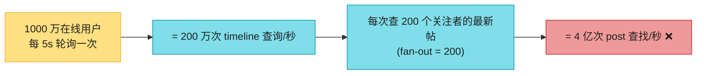

4 亿次/秒的查找是个天文数字。而且关注了几万个账号的"重度用户",这条查询对他们极其昂贵。**读路径太重了**。

### 1.3 方案二:推模式(Push / Fan-out on Write)

反过来想:与其读时现算,不如**发帖时就预计算好**,塞进每个粉丝的 timeline 缓存里——像往信箱里投信。

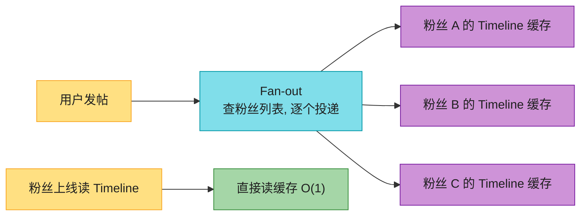

再算账:5,800 帖/秒 × 平均 200 粉丝(fan-out factor = 200)= **约 100 万次 timeline 写入/秒**。比拉模式的 4 亿次查找少了 **400 倍**。读变成 O(1) 直接返回缓存。

> 💡 这就是**物化视图 (materialized view)** 思想——预计算查询结果存起来,**用写路径的额外工作换读路径的速度**。timeline 缓存是典型的**派生数据**(Ch1 §4 概念)。高峰期写不动时,可以入队列延迟投递,但 timeline 读取始终飞快(只读缓存)。

#### 深入:fan-out 和物化视图到底在干啥?

**fan-out(扇出)的生活类比**:你在公司给 200 人群发一封邮件——你只点了一次"发送"(1 个写请求),但邮件系统要给 200 个人各投一份(200 个下游动作)。**fan-out factor = 200**。timeline 场景里:一个用户发帖(1 次)→ 投进 200 个粉丝的 timeline 缓存(200 次写)→ fan-out = 200。

**物化视图 vs 普通视图 vs 索引**(这三个特别容易混):

| 概念 | 存不存数据? | 何时算? | timeline 场景里的对应 |
|------|-----------|---------|---------------------|
| **视图 (view)** | ❌ 只存查询定义 | 每次查时**现算** | 拉模式:每次读 timeline 都跑那条 JOIN SQL |
| **物化视图 (materialized view)** | ✅ 把结果**真存成一张表** | 写时**预先算好**,查时直接读 | 推模式:发帖时算好存进缓存,读时 O(1) |
| **索引 (index)** | 原表不动,加个**辅助结构**(B+树等) | 写时维护索引 | 给 posts 表加 sender_id 索引,加速拉模式 |

> 一句话记忆:**视图是"配方",物化视图是"按配方提前做好的菜",索引是"给原菜加的目录"**。物化视图用**额外的存储 + 写时计算**换**读时的速度**——这正是 timeline 推模式的本质,也是 §2 性能权衡的经典范例。

**fan-out 的代价**:fan-out 越大,一次写引发的下游写越多(叫**写放大**)。普通用户 fan-out 200 还好;名人 fan-out 1 亿就是灾难——这正是下一节的"名人问题"。

### 1.4 名人问题 (Celebrity Problem) 与混合策略

推模式有个致命软肋:**名人发帖**。一个 1 亿粉丝的名人发一条帖 → 触发 **1 亿次 timeline 写入(写放大)**,而且这些写还必须可靠完成(不能像普通用户那样丢)。据说 Justin Bieber 一度占用了 Twitter **3% 的服务器** [6]。

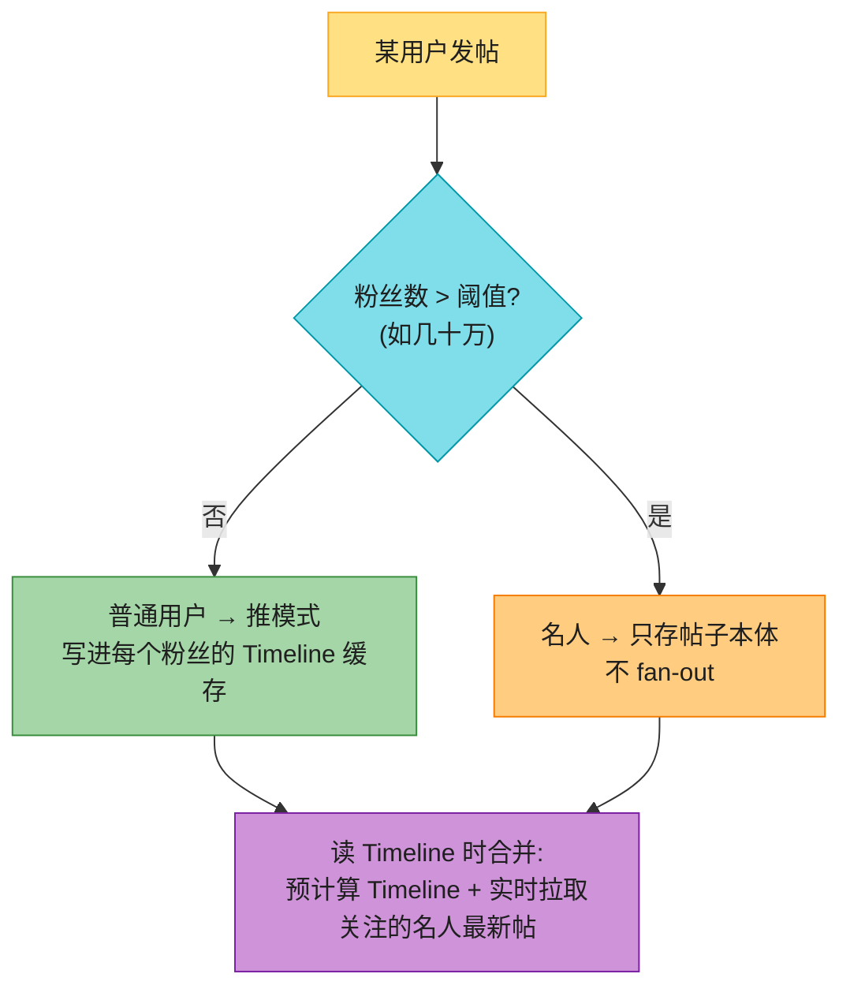

这就是**推拉混合策略**:普通用户用推(读快),名人用拉(避免写放大),读时合并。另一个极端情况——**关注了海量账号且那些账号发帖超多**的用户,根本看不完,可以直接丢部分 timeline 写、只给采样 [5](Bluesky 的 "lossy timeline" 就是这么干的,务实接受有损)。

> 🏭 **真实产品怎么做的**:
> - **Twitter**:早期是拉模式,后因扩展性改推模式,再因名人问题演化为混合 [1][2]。timeline 缓存用 **Redis 的 Sorted Set(ZSET)**,score = 时间戳,`ZREVRANGE` 取最新 N 条,O(log N) 高效。
> - **微博**:类似混合策略,名人(大 V)走拉,普通用户走推;timeline 同样用 Redis/Memcached。
> - **Bluesky**:对关注极多的用户主动做**有损 timeline** [5],工程上接受"看不全"。

> 💡 **承前启后**:这个案例完美示范了 **read-heavy vs write-heavy 的权衡**、**物化视图**、以及**热点 (hot spot)** 问题。热点在 **Ch7 分片**(如何把名人均匀打散)会再次出现。

---

## 2. 描述性能 (Describing Performance)

### 2.1 两大指标:响应时间 vs 吞吐量

| 指标 | 定义 | timeline 案例里的体现 |
|------|------|---------------------|
| **响应时间 (response time)** | 用户发请求到收到响应的全部时间 | "加载 timeline 耗时"、"发帖到粉丝可见的时延" |
| **吞吐量 (throughput)** | 每秒处理的请求数 / 数据量 | "发帖/秒"、"timeline 写入/秒" |

两者相关:负载低时响应快,负载接近硬件上限时,排队导致响应时间**急剧上升**(原书 Figure 2-3 的 hockey-stick 曲线)。吞吐量决定你需要多少机器(成本),响应时间决定用户爽不爽。**可扩展**的系统 = 能靠加机器显著提高最大吞吐量。

### 2.2 响应时间的构成(别把这几个词混着用)

这几个术语在本书有**精确区分**(对应原书 Figure 2-4):

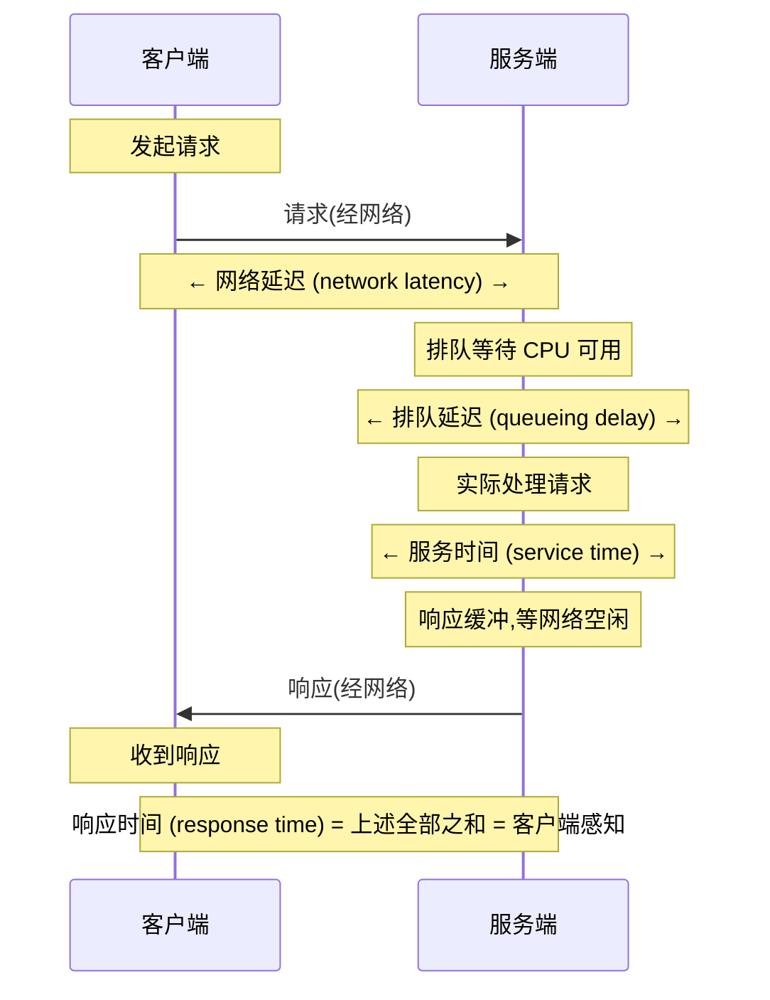

> 📝 **名词注释**
> - **响应时间 (response time)**:客户端看到的全部时间(网络 + 排队 + 处理 + ...)。**必须在客户端侧测量**,服务端测会漏掉排队延迟。
> - **服务时间 (service time)**:服务端**真正在处理**这个请求的时间(不含等待)。
> - **延迟 (latency)**:本书里指请求"没在被处理"的等待时间(latent = 潜伏);**网络延迟**特指请求/响应在网络里跑的时间。
> - **jitter(抖动)**:网络延迟的随机波动。
> - **为什么响应时间每次都不一样**:上下文切换、丢包重传、GC 停顿、缺页换页、甚至机箱机械振动 [18] 都会引入随机延迟。

### 2.3 队头阻塞(为什么少量慢请求会拖垮大家)

服务器能并行处理的事有限(受 CPU 核数约束)。**只要少数慢请求占住了处理资源,后面的快请求就得排队等**——即使后面请求本身 service time 极短,客户端看到的 response time 也会被前面的慢请求拖长。这叫 **head-of-line blocking**。

> 💡 正因如此,**排队延迟是响应时间波动的主要来源**,也正因如此必须在客户端侧测响应时间(服务端只看 service time 看不到排队)。

**举个生活例子**:超市只开一个收银台(= 单核 CPU)。前面有个人推了一整车商品慢慢结账(慢请求,service time 长),后面排队的人哪怕只买一瓶水(快请求),也只能干等——他们感知到的是"等待 + 结账"的总时间,不是自己那瓶水的结账时间。

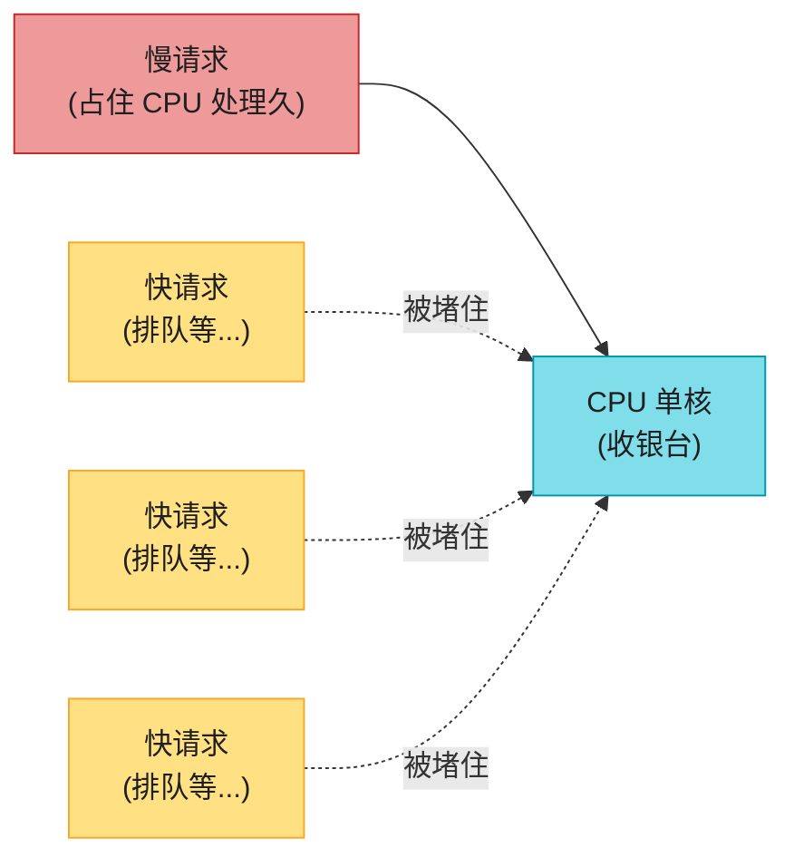

**为什么必须在客户端测**:服务端日志里的 service time 只算"请求正在被处理"的时长,**排队等待不算**。于是会出现这种情况——服务端说"我处理这个请求只花 5ms"(没撒谎),用户却说"我等了 800ms"(因为请求在队列里堵了 795ms)。两边都没错,但只有客户端的数字才反映真实体验。

### 2.4 过载的恶性循环:亚稳态故障(2 版重点新增)

如果系统被推到接近上限,可能进入**恶性循环**:排队太长 → 客户端超时 → 重试 → 请求量进一步暴涨 → 更拥挤。最可怕的是:**即使负载降下来,系统也回不去了**,要重启或人工干预才能恢复。这叫 **metastable failure(亚稳态故障)**[7][8][9]。


> 💡 **为什么比普通过载更危险**:普通过载,负载一降就恢复;亚稳态是系统被困在一个"低效稳态"里出不来。**retry storm(重试风暴)** 是最常见的触发器。微服务里尤其致命:A 慢 → B 超时重试 → A 负载翻倍 → 级联故障。

**防御措施(客户端 + 服务端)**:

| 措施 | 谁做 | 作用 |
|------|------|------|
| **指数退避 + 抖动 (exponential backoff + jitter)** [10][11] | 客户端 | 重试间隔指数增长 + 随机化,打散重试时间点 |
| **熔断器 (circuit breaker)** [12][13] | 客户端 | 对方连续出错就暂停发送,别再火上浇油 |
| **令牌桶 (token bucket)** [14] | 客户端 | 限制重试速率 |
| **负载卸载 (load shedding)** [15] | 服务端 | 主动拒绝超出承载能力的请求(快速失败好过拖死) |
| **反压 (backpressure)** [16] | 服务端→客户端 | 明确叫客户端"慢点" |

> 🏭 **真实产品**:Netflix 的 **Hystrix**(熔断器鼻祖,已停更)→ 现在主流是 **Resilience4j**;gRPC 内置 retry + hedging;服务端限流常用 **Envoy / Nginx** 的限流插件。

#### 深入:亚稳态到底"稳"在哪?(为什么负载降了也回不去)

很多人卡在这里:普通过载我懂,但"亚稳态"为什么负载降了还回不去?关键是——**系统被推过临界点后,它的"有效容量"被削低了**(缓存全失效、GC 频繁、重试堆积都在拖后腿),所以即使原始流量回落,相对新的低容量它仍然过载,被困住了。

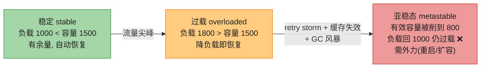

**retry storm 的完整时序**(最经典的触发路径):

| 时刻 | 原始负载 | 实际负载 | 发生了什么 |
|------|---------|---------|-----------|
| T0 | 1000 QPS | 1000 | 正常,容量 1500 |
| T1 | 1400 QPS(峰值) | 1400 | 接近容量,排队增加 |
| T2 | 1400 | 1400 | p99 从 100ms 飙到 2s |
| T3 | 1400 | **2800** | 客户端 1s 超时,重试 → 翻倍 |
| T4 | 1400 | **4000+** | 更多超时→更多重试,雪崩 |
| T5 | **1000**(峰值过去了) | 仍 3000+ | **重试循环自维持**,回不去 |
| T6 | — | — | 只能重启/扩容这种"外力"恢复 |

> 💡 **真实案例** [9]:很多大厂的大型故障都是这个模式——一个短暂流量尖峰把系统推过临界点,之后即使流量回落,**重试循环 + 缓存失效 + GC 风暴**共同把"有效容量"压低,系统死锁在亚稳态。这也是为什么防御措施要"宁可快速失败,也不要让请求堆着"。

#### 深入:防御措施为什么这样设计?

- **指数退避**:重试间隔 `1s → 2s → 4s → 8s`,给系统留出"消化积压"的喘息窗口,而不是连续猛打。
- **Full Jitter(完全抖动)优于 Equal Jitter**:AWS Brooker 用数学证明 [10]——如果 1000 个客户端同时超时、都用**相同**的指数退避,它们会在**相同时间点**集体重试(同步重试,制造二次尖峰);Full Jitter 在 `[0, 退避值]` 区间**完全随机**取值,把重试时间点彻底打散,峰值最低。
- **熔断器**:连续失败 N 次 → 跳闸 OPEN → 一段时间内直接拒绝请求 → 给下游**强制喘息**,而不是继续重试火上浇油;冷却后 HALF_OPEN 试探性放几个请求,成功才全恢复。
- **负载卸载**:服务端发现自己逼近极限时**主动返回 503**,让客户端快速失败。拖死(请求占着资源超时)比快速失败(立刻被拒释放资源)**更糟**——前者是慢性死亡。

---

## 3. 平均值、中位数与百分位数

### 3.1 为什么平均值会骗你

```
100 个请求:99 个 100ms,1 个 10s
平均 = (99×100 + 1×10000)/100 = 199ms  ← 看起来"还行"
但!有 1% 的用户等了 10 秒!
```

平均值(算术平均)**无法告诉你"有多少用户体验到了糟糕的延迟"**。它对估算吞吐上限有用 [19],但描述"典型体验"很差——被少数极端值带偏。

### 3.2 百分位数才是对的度量

把所有响应时间排序,看分布:

| 百分位 | 含义 | 用途 |
|--------|------|------|
| **p50(中位数)** | 一半请求快于此值 | "典型"用户体验 |
| **p95** | 95% 的请求快于此值 | 大多数用户的最坏体验 |
| **p99** | 99% 的请求快于此值 | **SLO 常用基准** |
| **p999** | 99.9% 快于此值(千分之一慢于此) | Amazon 内部标准 |
| **p9999** | 99.99% | 一般不值得优化(收益递减、被不可控随机事件主导) |

**Amazon 为什么用 p999?** 因为最慢的请求往往来自**数据量最大的用户**(买得最多、账户最复杂)——也就是**最有价值的客户** [20]。让网站对这批人快,商业上至关重要。但再往上优化到 p9999 被认为太贵、且随机噪声主导,不值。

### 3.3 尾延迟放大(微服务时代必须懂)

当一个终端请求需要**并行调用多个后端**,整体响应时间 = **max(所有后端)**——只要一个慢,整体就慢。

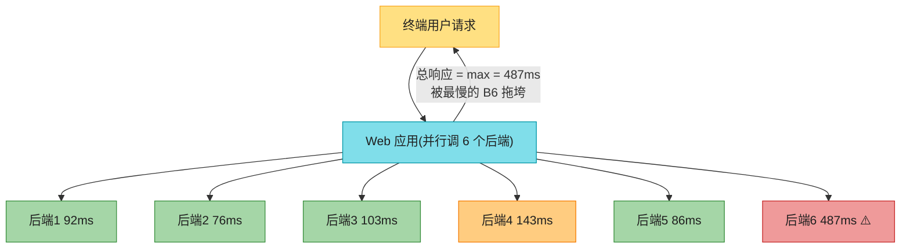

**算一下概率**:即使每个后端只有 1% 的请求慢(p99),并行调 6 个,至少遇到一个慢请求的概率 ≈ `1 - 0.99^6 ≈ 5.8%`。**调用链越长,尾延迟越严重**——这是 *"The Tail at Scale"* [27] 的核心洞察,也是为什么大厂拼命优化尾延迟(请求间冗余/对冲请求、微分区、跨请求结果缓存等)。

#### 深入:百分位数到底怎么算?(手算一遍就不玄了)

假设 10 次请求的响应时间(ms),按到达顺序:
`[5, 8, 7, 6, 200, 9, 8, 7, 6, 10]`

**第一步——从小到大排序**:
`[5, 6, 6, 7, 7, 8, 8, 9, 10, 200]`  ← 那个 200 是异常慢请求

**第二步——按位置取分位**:

| 指标 | 取第几个 | 结果 |
|------|---------|------|
| **p50(中位数)** | 第 5~6 个平均 | (7+8)/2 = **7.5ms** |
| **p90** | 第 9 个 | **10ms** |
| **p99** | 逼近最后一个 | **200ms** |
| **算术平均** | 全加起来 / 10 | (5+6+...+200)/10 = **26.6ms** |

看出问题了吗:**p50 是 7.5ms,平均却 26.6ms——平均被那一个 200ms 的异常值拉高了 3.5 倍!** 报"平均 26.6ms"会让老板以为体验不错,但其实有 10% 的用户等了 200ms。这就是为什么必须看百分位而不是平均。

#### 深入:为什么百分位"不能取平均"?(一个反例记一辈子)

监控多台机器时,新手最常犯的错:把每台机器各自的 p99 求平均,当成整体 p99。**这是错的**。

设两台机器各 100 个请求:
- 机器 A:全部都是 100ms(均匀)。**p99(A) = 100ms**
- 机器 B:99 个 10ms + 1 个 1000ms。**p99(B) = 1000ms**

"平均 p99" = (100 + 1000) / 2 = **550ms** ❌

但合并 200 个请求后真实排序:`[99个10ms, 100个100ms, 1个1000ms]`,整体 p99 = 第 198 个 = **100ms** ✅

**真实整体 p99(100)和"平均 p99"(550)差了 5.5 倍!** 因为百分位只记录"一个点",丢掉了分布形状;两个形状不同的分布合并后形状完全变了,原来的点就没意义了。正确做法:**保留直方图,合并直方图后重算分位**(这正是 t-digest / DDSketch 强调 "mergeable" 的原因)。

#### 深入:大厂怎么对付尾延迟?(The Tail at Scale 的实战)

既然并行调用必然放大尾延迟,Google 等大厂用这些招 [27]:

| 招数 | 做法 | 直觉 |
|------|------|------|
| **对冲请求 (hedged requests)** | 发请求 A,若几 ms 内没回,再发副本请求 B,谁先回用谁 | 多花一点资源换尾延迟大幅下降 |
| **微分区 (micro-partitioning)** | 数据切成大量小分区,热点被均匀分散 | 避免某个分区被烤过载变慢 |
| **跨请求结果缓存** | 同样的子查询结果在多个请求间复用 | 减少重复慢调用 |
| **隔离"慢组件"** | 关键路径与非关键路径用不同资源池 | 避免互相拖累 |

### 3.4 SLO、SLA 与 Error Budget

| 概念 | 全称 | 含义 | 例子 |
|------|------|------|------|
| **SLI** | Service Level Indicator | 具体测量的指标 | "p99 响应时间"、"成功率" |
| **SLO** | Service Level **Objective** | 团队内部的**目标** | p50 < 200ms 且 p99 < 1s;99.9% 请求成功 |
| **SLA** | Service Level **Agreement** | 对外的**合同**(违约有惩罚) | 99.9% 可用,否则退款 |
| **Error Budget** | 错误预算 | `1 - SLO 目标` 允许的失败额度 | SLO 99.9% → 30 天可容忍 43 分钟故障 |

> 💡 **Error Budget 的妙用**:把"可靠性"从道德绑架变成可量化决策。预算没烧完 → 可以激进发版;预算快烧光 → 冻结新功能、专心稳定性。这是 Google SRE 的核心思想 [28]。

#### 深入:Error Budget 到底怎么用?(一个团队决策实战)

Error Budget 最大的价值:**把"要多可靠"从团队吵架变成数字**。开发想快发版、SRE 想稳,以前靠谁嗓门大;现在看预算——**有余额听开发的(发版),见底了听 SRE 的(冻结)**。

**例子**:某 API 的 SLO = 99.9% 可用,30 天滚动窗口。

**第一步——把 SLO 换算成"可容忍故障量"**:
- 30 天 ≈ 43,200 分钟
- 允许失败 0.1% → **每月故障预算 ≈ 43 分钟**(或换算成失败请求数,如 3000 万请求 × 0.1% = 3 万次)

**第二步——按消耗做决策**:

| 场景 | 已烧预算 | 剩余 | 决策 |
|------|---------|------|------|
| A:风平浪静 | 10 分钟 | 33 分钟 | ✅ 可以激进发版、试风险功能 |
| B:月初就连出事 | 40 分钟 | 3 分钟 | ⛔ 冻结非紧急发版,全员修稳定性 |

**第三步——还要看"消耗速率 (burn rate)",不光看总量**:

即使总预算没超标,**烧得太快也说明要出事**。比如 1 小时内就烧掉了月度预算的 1% → burn rate ≈ `1% × 720 ÷ 1` = **7.2 倍** → 按这速度几天就烧光 → 立即告警。这就是面试题 2 里"多窗口 burn rate 告警"的原理:**短窗口看速率(快速发现异常),长窗口看总量(防止误报)**。

> 🏭 **真实产品**:Google SRE 最早系统化这套方法 [28];开源工具 **Sloth**(给 Prometheus 自动生成 SLO 告警规则)、商业的 **Nobl9** 把它做成了开箱即用的产品。

### 3.5 百分位数的计算(生产实践)

要在监控大盘上实时显示 p50/p99,需要高效算法。

| 方法 | 说明 | 典型用途 |
|------|------|---------|
| 朴素:留全部值排序 | 精确但贵,内存/CPU 吃不消 | 小流量 |
| **HdrHistogram** [31] | 高动态范围直方图,固定大小 | Cassandra、HBase |
| **t-digest** [32][33] | 可合并的分位估计算法 | 很多 APM 工具 |
| **DDSketch** [35] | 快速、可合并、有相对误差保证 | **Datadog** 在用 |
| **Circllhist / OpenHistogram** [34] | 对数线性直方图 | Circonus、OpenTSDB |

> 🏭 **真实产品**:**Prometheus** 用 histogram 类型 + `histogram_quantile()` 函数算分位数;**Datadog** 用 DDSketch;**Cassandra** 内部用 HdrHistogram 报延迟。

> ⚠️ **致命陷阱:百分位数不能取平均!** 把 10 台机器各自的 p99 求平均,**不等于**整体的 p99(数学上无意义)。正确做法是**合并直方图 (add the histograms)** [36] 再算分位。这也是为什么上面这些库都强调 "mergeable"。

---

## 4. 可靠性与容错 (Reliability and Fault Tolerance)

可靠性 ≈ "**即使出了问题,也能继续正确工作**"。

### 4.1 Fault ≠ Failure(这俩不是一回事)

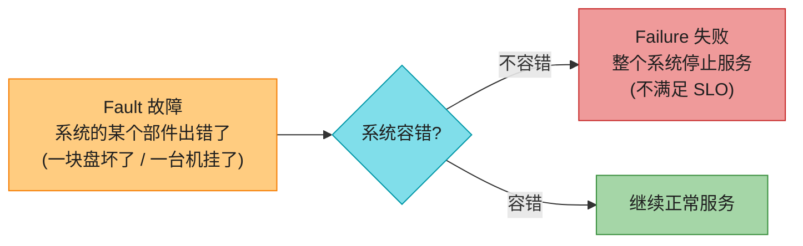

> 📝 **名词注释**
> - **Fault(故障)**:某个**部件**出错(单盘、单机、某依赖服务)。
> - **Failure(失败)**:**整个系统**停止提供服务(达不到 SLO)。
> - 两者其实是一回事的**不同层级**:单盘 failure 对大盘只是个 fault——如果系统有冗余能扛住。容错 = 把部件级 fault 隔离掉,不让它升级成系统级 failure。
> - **SPOF(Single Point of Failure,单点故障)**:某个部件一坏就拖垮全系统 → 它不容错。
> - **容错是有上限的**:能容忍"最多同时坏 2 块盘"或"3 节点中最多 1 个宕机"。要是地球被黑洞吞了,容错这个 fault 得去太空托管服务器——预算批不下来 😄。

### 4.2 主动制造故障:Fault Injection 与混沌工程

反直觉地,**故意触发故障**能提升可靠性:随机杀进程,逼着容错机制持续被"演练",这样真出事时才不会掉链子。很多致命 bug 其实是**错误处理写得烂** [40]。系统化做这件事的学科叫 **Chaos Engineering(混沌工程)** [41]。

> 🏭 **真实产品**:Netflix 的 **Chaos Monkey**(随机杀生产实例)、**Gremlin**(商业化混沌工程平台)、AWS 的 **Fault Injection Service**。

### 4.3 硬件故障(独立 → 靠冗余扛)

| 组件 | 年故障率/特征 | 说明 |
|------|-------------|------|
| 机械硬盘 HDD | **2%–5%**/年 [42][43] | 1 万块的集群,**每天坏约 1 块** |
| SSD | 0.5%–1%/年 [45] | 但**不可纠正错误率比 HDD 还高**(约每盘每年一次,即使全新)[47][48] |
| CPU | **约 1/1000** 机器偶发算错 [51][52] | 制造缺陷导致,**静默数据损坏 (SDC)**——不崩溃,直接返回错结果,最阴险 |
| 内存 DRAM | 即使有 ECC,**>1%** 机器/年遇不可纠错 [54] | 宇宙射线、物理缺陷、甚至 RowHammer 攻击能翻 bit [55] |
| 整机房 | 罕见但灾难性 | 断电、火灾、地震;**太阳风暴**可能摧毁电网和海底光缆 [57] |

**应对:冗余 (redundancy)**。冗余在**故障独立**时最有效(一块盘坏不影响别的)。但现实里故障有**相关性**——整个机架、整个机房可能同时挂 [43][59]。

应对手段的演化:

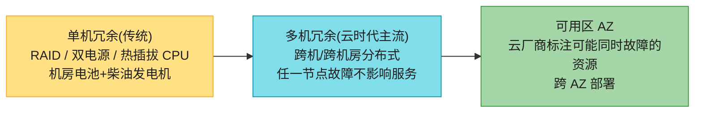

> 💡 **能容忍整机宕机 → 额外好处:滚动升级 (rolling upgrade)**。单机系统打补丁得停机;多机容错系统可以**一台一台重启**,用户无感。详见 Ch5。

### 4.4 软件故障(高度相关 → 更危险)

硬件故障虽然弱相关,但基本独立(一块盘坏,别的盘暂时没事)。**软件故障则高度相关**——因为很多节点跑同一份代码、同一个 bug [61][62],会**同时**出问题,造成的系统 failure 远多于独立硬件故障 [49]。经典案例:

- **闰秒 bug(2012-06-30)**:Linux 内核 bug 让大量 Java 应用同时挂起,带垮好几个大型互联网服务 [63]。
- **固件 bug**:某型号 SSD 在精确运行 **32,768 小时**(不到 4 年)后集体失效,数据不可恢复 [64]。
- **资源耗尽**:一个异常请求触发 OOM 被 OS 杀;或客户端库 bug 导致请求量暴涨 [66]。
- **级联故障 (cascading failure)**:A 变慢 → 调用方超时 → 重试雪崩 → 拖垮更多组件 [68][69]。
- **跨系统交互失效**:各自测试正常,组合起来才暴露的 bug [67]。

这些 bug 往往**潜伏很久**,直到某个罕见的边界条件触发——本质是**软件对环境做了某个假设,而该假设偶尔不再成立** [70][71]。

> ⚠️ **没有银弹**:只能组合多招——仔细审视假设与交互、彻底测试(含 property testing)、进程隔离、允许崩溃重启、避免重试风暴、生产环境持续监控分析。

### 4.5 人为因素(其实是首要原因)

> "对大型互联网服务的研究发现:**配置变更是宕机的首要原因**,硬件/网络故障只占 10%–25%。"[72]

把问题简单归咎于"人为错误"、想靠更严的流程管住人,是**适得其反**的。所谓"人为错误"不是事故的**因**,而是社会技术系统问题的**症状**——人们已经在尽力做好工作了 [73]。

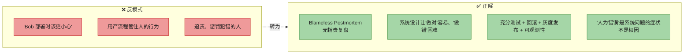

> 💡 **Blameless Postmortem(无指责复盘)**[75]:事故后,相关的人在**免于惩罚**的氛围下完整复盘,让组织学到教训——可能暴露的是业务优先级、资源投入、激励机制等系统性问题。调查时对简单答案要警惕:"Bob 该小心点"没用,"我们必须用 Haskell 重写"也没用。
>
> ⚠️ **Post Office Horizon 丑闻** [78][79]:英国邮局的会计软件 bug 制造了虚假"亏损",导致 1999–2019 年间**数百名邮局经理被错误定罪**(偷窃/欺诈),有人破产、有人自杀。根源之一是英国法律**假定计算机输出可靠**。这是软件不可靠后果**超越技术范畴**的血淋淋例证。

---

## 5. 可扩展性 (Scalability)

> 可扩展性 ≠ 一维标签。说"X 可扩展"没意义;该问的是:"如果负载按某种方式增长,我们有哪些应对手段?""加多少资源能扛住?""按当前增速,什么时候会撞到架构天花板?"

### 5.1 先理解负载

讨论扩展前,必须先量化当前负载(否则"负载翻倍会怎样"无从谈起)。负载指标因应用而异:

- **吞吐量**:QPS、每天新增数据量 GB、每小时结账数
- **峰值变量**:同时在线用户数
- **统计特征**:读写比、缓存命中率、每用户的数据项数(如粉丝数)

关键要分清:**瓶颈是被平均情况主导,还是被少数极端情况主导?**(timeline 案例里就是少数名人主导。)

负载增长时有两种问法:① 资源不变,性能如何退化?② 要保性能不变,资源得加多少?

> **线性可扩展 (linear scalability)**:资源翻倍 → 处理能力翻倍 → 性能不变。这是理想。现实中成本通常**增长快于线性**(规模不经济),偶尔能**慢于线性**(规模经济、负载更均衡分布 [81][82])。

### 5.2 三种扩展架构(本节核心)

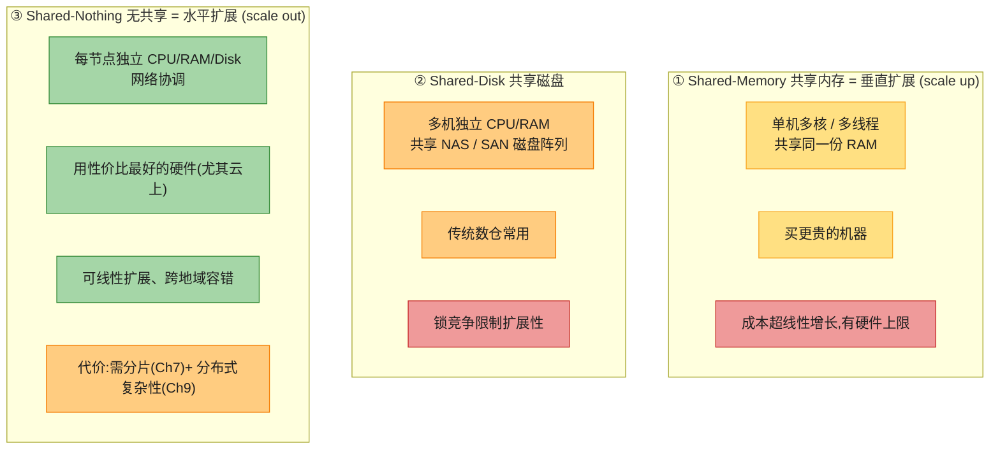

> 📝 **名词注释**
> - **垂直扩展 (scale up / scaling up)**:换更强的单机(更多核/内存/盘)。天花板低、成本递增快。
> - **水平扩展 (scale out / scaling out)**:加更多普通机器。Shared-Nothing 是其代表。
> - **NAS (网络附加存储) / SAN (存储区域网络)**:把磁盘做成多机共享的阵列。Shared-Disk 的基础。
> - **云原生存算分离变种**:多个计算节点共享一个专用存储服务(如 S3)。形似 Shared-Disk,但存储给的是**为数据库定制的 API**(不是通用文件系统/块设备),避开了老式 Shared-Disk 的扩展瓶颈 [85]。Aurora / Socrates / Snowflake 都是这类。

> 🏭 **真实产品**:
> - **Shared-Nothing**:**Cassandra、CockroachDB、Spanner、DynamoDB**(每个节点管自己的数据,靠复制+分片扩展)。
> - **Shared-Disk**:**Oracle RAC**(多实例共享存储,靠分布式锁协调,扩展性受限)。
> - **存算分离**:**Aurora / Socrates(SQL Server Hyperscale)/ Snowflake**。

#### 深入:三种架构的"机器长什么样"?

抽象名词容易懵,把每种架构画成具体的硬件组成就清楚了:

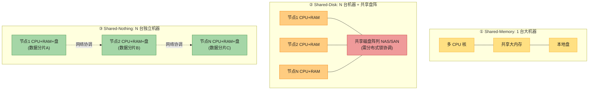

**Shared-Memory 为啥又贵又封顶?** 单机能塞多少 CPU 核、多大内存,有物理上限;而且高端机价格**不是线性的**——翻倍的配置往往要花 3~5 倍的钱(因为要用大型机、高端互联等特殊硬件)。整机一挂,全挂。

**Shared-Disk 为啥被锁拖死?** 多个节点共享同一份磁盘数据,当两个节点都要改同一条记录时,**必须靠分布式锁商量"谁先写"**。节点越多,锁的消息开销越大、等待越久——加机器到一定数量后,**锁竞争的开销反而超过新机器带来的算力**,继续加只会更慢。这就是 Oracle RAC 这种架构扩展受限的根源(它用 "Cache Fusion" 在节点间频繁传锁消息)。

**Shared-Nothing 为啥能接近线性扩展?** 数据按分片分散到各节点(Ch7 详谈)。绝大多数请求只命中**一个节点**上的数据,在那台机器本地处理,**不跟别的节点抢锁**。加机器 = 加新分片 = 直接加容量,所以接近线性。代价是:某节点挂了,它那份数据得靠**复制**兜底(Ch6);跨多个分片的事务特别难做(Ch8 的分布式事务);还得处理数据怎么分(Ch7 分片策略)。

### 5.3 扩展性原则

- **没有万能的 "magic scaling sauce"**:10 万 QPS × 1KB/请求 和 3 次/分钟 × 2GB/请求,吞吐都是 100MB/s,但架构天差地别。
- **每增长一个数量级,就得重新审视架构**——而且通常**不值得提前规划超过一个数量级**。
- **把系统拆成能独立运作的小组件**:微服务、分片、流处理、shared-nothing 都源自这一原则。难点在于**划清"该在一起的"和"该分开的"边界**。
- **别过度复杂化**:单机数据库够用就别上分布式。autoscaling 很酷,但负载可预测时手动扩容**运维意外更少**。5 个服务比 50 个简单。
- **好架构通常是多种方法的务实混合**。

---

## 6. 可维护性 (Maintainability)

> 软件的大部分成本**不在初始开发,而在持续维护**——修 bug、保运行、查故障、适配新平台、加新功能、还技术债 [87][88]。**今天我们写的每个系统,只要活得够久,终将成为遗留系统。** 设计时要为维护者着想。

可维护性三大支柱:

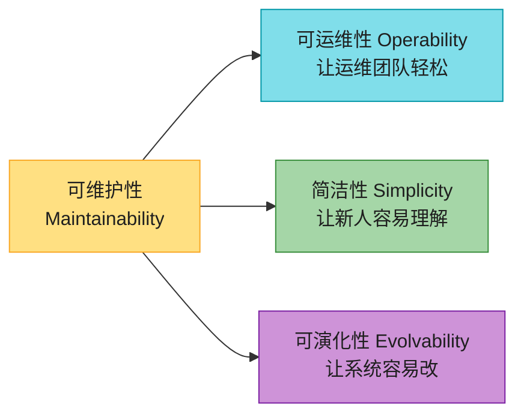

### 6.1 可运维性 (Operability)

> "好的运维能弥补不完善的软件,但好的软件在烂运维下也跑不稳。"[62]

好的可运维性 = 让例行任务变简单,让运维能聚焦高价值工作。数据系统应做到:支持监控/可观测性、不依赖单机(能下线维护)、提供清晰文档和操作模型("做 X 会发生 Y")、合理默认值且允许覆盖、适度自愈但保留人工控制、行为可预测少意外。

> ⚠️ **自动化的悖论 (Ironies of Automation)** [90]:自动化处理了简单情况,**留给人的都是最复杂的边缘情况**;而且自动化系统出问题时**更难排查**。所以自动化程度越高,反而越需要**更高技能**的运维。自动化不是越多越好,要找平衡点。

### 6.2 简洁性 (Simplicity)

复杂度失控的项目叫 **Big Ball of Mud(大泥球)** [93]。复杂度拖慢所有人、超预算、改一处就引 bug(隐藏假设、意外交互更容易被忽略)[71]。

| 复杂度类型 | 含义 | 应对 |
|-----------|------|------|
| **本质复杂性 (essential)** | 问题域固有,无法消除 | 只能接受 |
| **偶然复杂性 (accidental)** | 工具/实现引入,可消除 | 靠更好的抽象减少 [95] |

> 💡 注意本质/偶然的边界会随工具演进而移动 [96],这个二分法并不完美,但作为思考框架有用。
>
> **管理复杂度最好的工具是抽象 (abstraction)**:一个好的抽象能把大量实现细节藏在干净外观后面,还能被很多应用复用——比如**高级语言**藏了机器码/寄存器,**SQL** 藏了磁盘/内存数据结构和并发冲突。本书讲的就是这类通用抽象(事务、索引、事件日志)。

### 6.3 可演化性 (Evolvability)

需求**永远在变**:新功能、新平台、新法规、业务增长逼着架构改。松耦合、简洁的系统更好改。本书把"数据系统层面的敏捷性"专门叫 **evolvability** [99]。

> 💡 **让改动困难的最大元凶是不可逆性 (irreversibility)** [100]。比如数据库迁移,如果出问题**回不去**,风险就极高;如果随时能退回老系统,就敢大胆改。所以——**最小化不可逆性 = 最大化灵活性**。

---

## 🏭 生产级产品速查表

| 概念 | 真实产品 | 关键点 |
|------|---------|--------|
| Timeline/Feed 缓存 | **Redis ZSET**、Memcached | score=时间戳,`ZREVRANGE` 取最新 |
| 推拉混合 Feed | **Twitter / 微博** | 名人走拉、普通人走推 |
| 百分位监控 | **Prometheus**(`histogram_quantile`)、**Datadog**(DDSketch) | 必须合并直方图,不能取平均 |
| 分位数算法库 | HdrHistogram、t-digest、DDSketch | Cassandra / HBase 用 HdrHistogram |
| 重试/熔断 | **Resilience4j**、(老)Netflix Hystrix、gRPC retry | 指数退避+抖动 防止 retry storm |
| 限流/负载卸载 | Envoy、Nginx 限流、AWS 负载卸载 | 服务端快速失败 |
| 混沌工程 | **Chaos Monkey**、Gremlin、AWS FIS | 主动注入故障验证容错 |
| SLO/Error Budget | Google SRE、**Sloth**、Nobl9 | 用错误预算量化可靠性决策 |
| 分布式追踪 | OpenTelemetry、Zipkin、Jaeger | 源自 Google Dapper |
| Shared-Nothing DB | Cassandra、CockroachDB、Spanner | 水平扩展 |
| Shared-Disk DB | Oracle RAC | 锁竞争限制扩展 |
| 存算分离 DB | Aurora、Socrates、Snowflake | 专用存储 API |

---

## 💻 代码与架构示例

### 示例 1:用 t-digest 做流式百分位监控

```python
"""
生产环境高效算 p50/p95/p99 的推荐姿势。
关键: 多实例聚合时必须 merge digest, 绝不能对百分位取平均!
"""
from tdigest import TDigest  # pip install tdigest
import random

class LatencyMonitor:
    def __init__(self):
        self.digest = TDigest()      # 可合并的分位估计结构

    def record(self, latency_ms: float):
        self.digest.update(latency_ms)

    def report(self) -> dict:
        return {
            'p50':  round(self.digest.percentile(50), 1),
            'p95':  round(self.digest.percentile(95), 1),
            'p99':  round(self.digest.percentile(99), 1),
            'p999': round(self.digest.percentile(99.9), 1),
            'count': self.digest.count,
        }

    def merge(self, other: 'LatencyMonitor') -> 'LatencyMonitor':
        """横向扩展时: 合并多台机器的 digest, 而非取百分位平均"""
        m = LatencyMonitor()
        m.digest = self.digest + other.digest   # t-digest 支持 +
        return m

# 模拟: 99% 请求 5-100ms, 1% 慢请求 500-5000ms (长尾)
mon = LatencyMonitor()
for _ in range(100000):
    if random.random() < 0.01:
        mon.record(random.uniform(500, 5000))
    else:
        mon.record(random.uniform(5, 100))
print(mon.report())
# 预期: p50~50ms, p95~100ms, p99~2500ms  ← p99 远大于 p50, 这就是尾延迟!
```

### 示例 2:指数退避 + 熔断器(防亚稳态故障)

```python
"""
防 retry storm 的两大客户端模式:
1. 指数退避 + Full Jitter: 打散重试时间点
2. 熔断器: 对方连续失败就停发请求, 别火上浇油
"""
import time, random

def retry_with_backoff(func, max_retries=5, base_ms=100, cap_ms=30000):
    for attempt in range(max_retries + 1):
        try:
            return func()
        except Exception as e:
            if attempt == max_retries:
                raise
            delay = min(base_ms * (2 ** attempt), cap_ms)
            delay = random.uniform(0, delay)   # Full Jitter, 关键!
            time.sleep(delay / 1000)

class CircuitBreaker:
    """连续失败超阈值 → OPEN(拒所有请求); 冷却后 HALF_OPEN 试探; 成功 → CLOSED"""
    CLOSED, OPEN, HALF_OPEN = 'closed', 'open', 'half_open'
    def __init__(self, fail_threshold=5, cool_down=30):
        self.state = self.CLOSED
        self.fails = 0
        self.fail_threshold = fail_threshold
        self.cool_down = cool_down
        self.opened_at = 0

    def call(self, func):
        if self.state == self.OPEN:
            if time.time() - self.opened_at > self.cool_down:
                self.state = self.HALF_OPEN
            else:
                raise Exception("熔断中, 拒绝请求 (快速失败)")
        try:
            r = func()
            if self.state == self.HALF_OPEN:
                self.state, self.fails = self.CLOSED, 0   # 恢复
            return r
        except Exception:
            self.fails += 1
            self.opened_at = time.time()
            if self.fails >= self.fail_threshold:
                self.state = self.OPEN
            raise
```

### 示例 3:Error Budget 告警

```python
"""
把"可靠性"变成可量化的预算决策。
SLO 99.9% + 30天 + 100万请求/天 → 允许 ~43000 个失败请求。
烧得太快 → 告警/冻结发版。
"""
def error_budget(slo_target, window_requests, actual_failures):
    budget = window_requests * (1 - slo_target)
    burn_rate = actual_failures / budget          # 消耗速率
    return {
        'budget_total': int(budget),
        'consumed_pct': f"{burn_rate*100:.1f}%",
        'alert': burn_rate > 0.5,                 # 过半即告警
        'action': 'freeze releases' if burn_rate >= 1.0 else 'ok',
    }

# SLO 99.9%, 30天×100万/天=3000万请求, 实际失败 2万
print(error_budget(0.999, 30_000_000, 20_000))
# budget=30000, 消耗 66.7% → 告警!
```

---

## 🎯 系统设计面试题

### 面试题 1:设计一个 Twitter/微博式 Feed 流系统 ★重点

**题目**:设计类 Twitter 的 Feed 流,2 亿注册用户 / 2000 万 DAU,用户发帖、关注/取关、看 home timeline,要求发帖后 5 秒内粉丝可见,部分用户千万级粉丝。

**第 1 步 · 需求澄清**:
- 读多写多?→ 读远多于写(刷 timeline 频率远高于发帖)。
- 实时性?→ 5 秒内可见。
- 是否需要保证严格有序?→ 不需要,可接受最终一致。

**第 2 步 · 容量估算**:
- 发帖:2000 万 DAU × 人均 1 帖/天 ÷ 86400 ≈ **230 帖/秒**,峰值 ×10 ≈ 2300 帖/秒。
- 假设人均 200 粉丝 → fan-out 200 → **约 4.6 万次 timeline 写入/秒**(均值)。
- 读 timeline:2000 万 DAU,假设每人每天刷 50 次 → **约 1.2 万次读/秒**(读路径压力反而更大)。
- 存储:每帖 1KB,5 亿帖/天 → 500GB/天,留存 30 天 ≈ 15TB(帖子本体),timeline 缓存另算。

**第 3 步 · 高层架构(推拉混合)**:

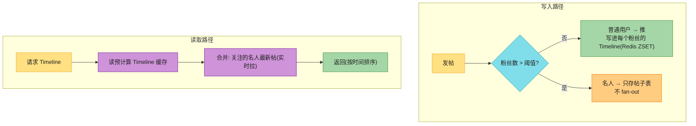

**第 4 步 · 深入讨论**:
- **存储选型**:帖子本体存 MySQL/PostgreSQL(按用户分库);timeline 缓存用 **Redis ZSET**(score=时间戳);名人帖单独存" celebrity inbox"。
- **名人阈值**:不是固定值,根据当前 fan-out 写放大动态调整(粉丝数 × 发帖频率)。
- **关注/取关**:取关时不必立即清理已 fan-out 的帖(懒清理,读时过滤即可,省写)。
- **防 retry storm / metastable**:发帖走消息队列(Kafka),消费失败退避重试,消费端限流。
- **容错**:timeline 写入是派生数据,丢了能从帖子表重建(Ch1 的 SoR/派生思想)。

**第 5 步 · 权衡**:
- 全推 vs 全拉 vs 混合?→ 混合最稳,但复杂度高。
- timeline 缓存要不要持久化?→ Redis 可配 AOF,但更关键是能从 SoR 重建。
- 严格时间序 vs 排序算法?→ 现代平台(如 X)已转向推荐算法排序,那是另一个话题。

---

### 面试题 2:设计延迟敏感服务的监控告警 ★重点

**题目**:电商 API Gateway,5 万 QPS,SLO:p50 < 100ms、p99 < 500ms、可用性 99.95%,要能实时发现延迟退化和错误率突增,且告警不能太多(防告警疲劳)。

**第 1 步 · 需求澄清**:延迟以客户端为准还是服务端?→ 服务端测 + 关键路径客户端上报;告警窗口多长?→ 短窗口(快速发现) + 长窗口(防误报)。

**第 2 步 · 架构**:

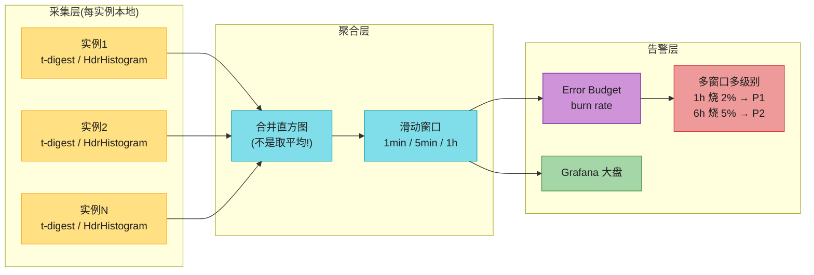

**第 3 步 · 关键决策**:
- **绝不对百分位取平均**——每实例本地用 t-digest/HdrHistogram,聚合时**合并直方图** [36]。
- **多窗口 burn rate 告警**:同时看 1h 和 6h 的 error budget 消耗速率,两者都超阈值才告警——比固定阈值(p99 > 500ms 就告警)准确得多,大幅减少误报 [28]。
- **尾延迟追踪**:API Gateway 并行调多个下游,用分布式追踪(OpenTelemetry)逐级定位哪个下游在拖后腿。
- **告警分级**:P1(立即处理)、P2(工作时间处理)、仅大盘展示(不告警)——防告警疲劳。

**第 4 步 · 权衡**:精确 vs 近似?→ 用 t-digest 近似,省资源换可接受的误差;采集开销?→ 本地聚合 + 定期上报,减少网络压力。

---

### 面试题 3:如何在不停机下升级一个有状态服务?

**题目**:20 个节点的服务,数据库 schema 要从 v1 升到 v2(有不兼容变更),不能中断服务。

**关键考察点**:rolling upgrade、前后兼容、blue-green、分阶段迁移。

**思路**:
- **核心原则:最小化不可逆性**(Ch2 §6.3)。能回滚就敢大胆改。
- **三阶段发布(扩展兼容期)**:
  1. 部署能**同时读 v1 和 v2**格式的新代码(v2 字段可选);
  2. 滚动升级所有节点到新代码 → 在线迁移数据 v1→v2;
  3. 数据迁完后,部署**只写 v2** 的代码,清理 v1 兼容逻辑。
- **滚动升级 (rolling upgrade)**:多机容错系统可一台一台重启,用户无感(Ch2 §4.3 的容错红利)。
- **回滚预案**:每步都能退回上一步;数据库迁移用扩展(shadow write)而非直接改原列。
- 数据格式兼容性详见 **Ch5**。

---

## 📚 精选文献(只留真正值得读的)

第二章引用上百条,绝大多数是故障统计/度量算法的细节论文,不必读。这 6 篇值得花时间:

| # | 文献 | 为什么值得读 |
|---|------|------------|
| [27] | Dean & Barroso *"The Tail at Scale"* CACM 2013 | **尾延迟圣经**。Google 大佬写的,讲清了"为什么并行调用越多、p99 越重要",以及 hedged/tail-tolerant 策略。每个做后端的人都该读。 |
| [20] | DeCandia et al. *"Dynamo: Amazon's Highly Available Key-Value Store"* SOSP 2007 | **p999 思想的来源** + eventual consistency 经典。也是 Ch6 复制、Ch10 共识的基础。 |
| [70] | Richard Cook *"How Complex Systems Fail"* 2000 | **仅几页的经典短文**(免费)。核心:复杂系统永远处于"部分故障"状态,安全是持续活动而非状态。读完会重新理解可靠性。 |
| [84] | Stonebraker *"The Case for Shared Nothing"* 1986 | **Shared-Nothing 架构的奠基论述**,理解 Ch5/Ch7 分布式存储的根基。 |
| [9] | Huang et al. *"Metastable Failures in the Wild"* OSDI 2022 | **2 版新增的核心概念**。真实生产系统的亚稳态故障案例集,读完会对 retry storm 有全新警惕。 |
| [40] | Yuan et al. *"Simple Testing Can Prevent Most Critical Failures"* OSDI 2014 | 实证研究:绝大多数分布式系统致命故障其实是**错误处理写得烂**,且靠简单测试就能拦下。给测试投入提供了数据依据。 |

> 配套书:**《Site Reliability Engineering》**(Google)[28] 和 **《Implementing SLOs》**(Hidalgo)——把本章的 SLO/Error Budget 讲成完整工程方法论。**《Release It!》**(Nygard)[12] 是容错模式(熔断/限流/隔离)的实战经典。

---

## 📝 本章要点总结

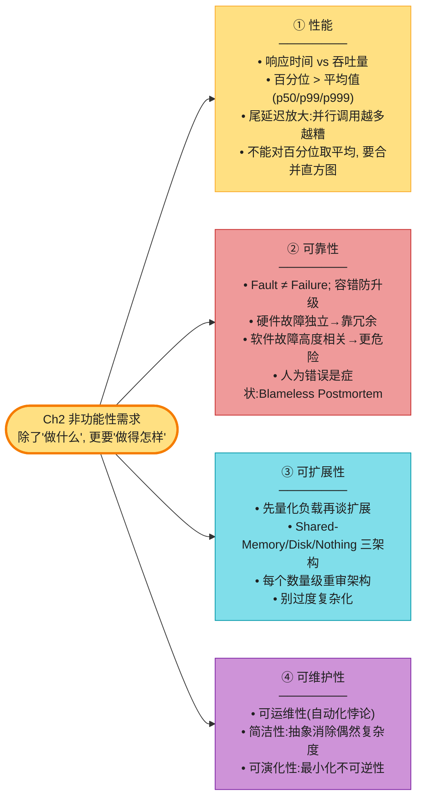

**核心 Takeaways**:

1. **用百分位数而非平均值衡量性能**——p50 看典型、p99/p999 看尾延迟;聚合时**合并直方图**,绝不能取平均。
2. **尾延迟放大**是微服务/并行调用的固有问题——调用链越长,撞上一个慢请求的概率越高(The Tail at Scale)。
3. **亚稳态故障比普通过载更危险**——retry storm 触发,系统被锁死无法自恢复;靠指数退避+抖动、熔断器、负载卸载防御。
4. **Fault ≠ Failure**——容错把部件级故障隔离,防止升级成系统级失败;主动注入故障(混沌工程)反而提升可靠性。
5. **软件故障比硬件故障更危险**——它们高度相关,同一 bug 会同时打垮所有节点(闰秒、固件 bug、级联故障)。
6. **"人为错误"是系统问题的症状,不是根因**——Blameless Postmortem 比追责更能防再犯;配置变更是首要宕机原因。
7. **可扩展性不是一维标签**——没有"可扩展/不可扩展",只有"在某负载下的扩展方案";每增长一个数量级就得重审架构。
8. **简洁 + 抽象 + 最小化不可逆**是可维护性的三大杠杆——今天写的系统终将成为遗留系统。
