# 第3章：数据模型与查询语言 (Data Models and Query Languages)

> *"The limits of my language mean the limits of my world."*
> — Ludwig Wittgenstein, *Tractatus Logico-Philosophicus* (1922)

---

## 📚 核心论文与参考文献

### 必读论文

| # | 论文/资料 | 作者 | 核心内容 | 链接 |
|---|---------|------|--------|------|
| [4] | "A Relational Model of Data for Large Shared Data Banks" | Edgar Codd | 关系模型的奠基论文（1970） | [doi:10.1145/362384.362685](https://doi.org/10.1145/362384.362685) |
| [5] | "What Goes Around Comes Around" | Stonebraker & Hellerstein | 数据模型演化历史综述（经典） | *Readings in Database Systems*, 4th ed. |
| [27] | "Spanner: Google's Globally-Distributed Database" | Corbett et al. (Google) | Google 全球分布式数据库 | [OSDI 2012](https://www.usenix.org/conference/osdi12/technical-sessions/presentation/corbett) |
| [29] | "Bigtable: A Distributed Storage System for Structured Data" | Chang et al. (Google) | Google Bigtable（列族存储） | [OSDI 2006](https://www.usenix.org/conference/osdi06/bigtable-distributed-storage-system-structured-data) |
| [33] | "What Goes Around… And Around…" | Stonebraker & Pavlo | 数据模型历史更新版 (2024) | [doi:10.1145/3685980.3685984](https://doi.org/10.1145/3685980.3685984) |
| [34] | "The PageRank Citation Ranking" | Page, Brin et al. | PageRank 经典论文 | [Stanford InfoLab](http://ilpubs.stanford.edu:8090/422/) |
| [35] | "TAO: Facebook's Distributed Data Store for the Social Graph" | Bronson et al. (Facebook) | Facebook 社交图谱存储 | [USENIX ATC 2013](https://www.usenix.org/conference/atc13/technical-sessions/presentation/bronson) |
| [36] | "Industry-Scale Knowledge Graphs: Lessons and Challenges" | Noy et al. (Google) | 工业级知识图谱经验 | [doi:10.1145/3331166](https://doi.org/10.1145/3331166) |
| [37] | "KÙZU Graph Database Management System" | Feng et al. | KùzuDB 图数据库 | [CIDR 2023](https://www.cidrdb.org/cidr2023/papers/p48-feng.pdf) |
| [40] | "Cypher: An Evolving Query Language for Property Graphs" | Francis et al. | Cypher 查询语言设计 | [doi:10.1145/3183713.3190657](https://doi.org/10.1145/3183713.3190657) |
| [60] | "Datalog and Recursive Query Processing" | Green et al. | Datalog 与递归查询 | [doi:10.1561/1900000017](https://doi.org/10.1561/1900000017) |
| [69] | "Towards Scalable Dataframe Systems" | Petersohn et al. | 可扩展 DataFrame 系统 | [doi:10.14778/3407790.3407807](https://doi.org/10.14778/3407790.3407807) |

### 推荐书籍

| 书名 | 作者 | 说明 |
|------|------|------|
| *The Data Warehouse Toolkit* (3rd) [14] | Ralph Kimball & Margy Ross | 维度建模权威指南（Star/Snowflake Schema）|
| *Exploring CQRS and Event Sourcing* [65] | Dominic Betts et al. (Microsoft) | CQRS 与事件溯源实践 |
| *Foundations of Databases* [62] | Abiteboul, Hull, Vianu | 数据库理论基础 |

### 中文资源

- Codd 关系模型论文解读：搜索「Codd 关系模型 1970」
- Google Spanner 论文中文翻译：搜索「Spanner 论文中文」
- Bigtable 论文中文翻译：搜索「Bigtable 论文翻译」
- Star Schema / Snowflake Schema：搜索「星型模型 雪花模型 数据仓库」
- Event Sourcing 中文入门：搜索「事件溯源 CQRS 入门」
- Cypher 查询语言教程：[Neo4j 中文社区](https://neo4j.com/docs/)

---

## 🗺️ 章节概览

本章是全书信息量最大的章节之一，覆盖了从关系模型到图模型、从 SQL 到 Datalog 的完整数据模型光谱，并引入了 Event Sourcing/CQRS 这一重要架构模式。

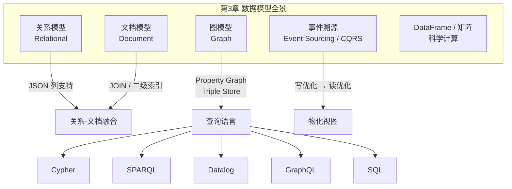

---

## 📖 详细内容

### 3.1 数据模型的层次抽象

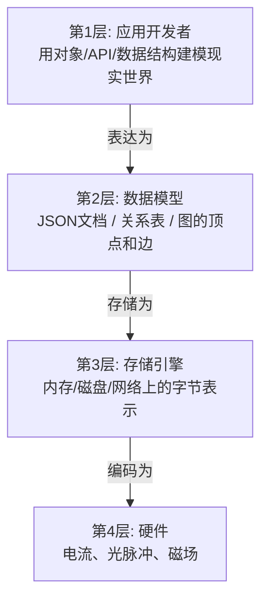

**核心思想**：每一层通过提供一个清晰的数据模型来隐藏下层的复杂性。本章关注第2层。

### 3.2 关系模型 vs 文档模型

#### 阻抗失配 (Impedance Mismatch)

面向对象编程语言中的对象 ↔ 关系数据库中的表/行/列 之间需要翻译层。

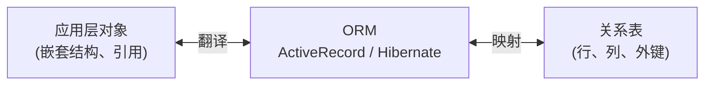

**ORM 的问题**：
- N+1 查询问题：获取 N 条评论 → 1 次查询评论 + N 次查询每条评论的作者
- ORM 只对 OLTP 有效，数据分析仍需直接操作关系 schema
- ORM 生成的 schema 可能对直接查询不友好

#### LinkedIn 简历：关系模型 vs 文档模型

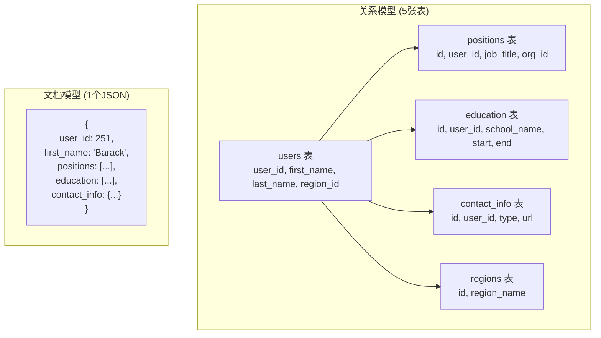

**文档模型的优势**：
- **数据局部性 (Data Locality)**：一次读取获取完整简历，无需多表 JOIN
- **贴近应用对象**：JSON 结构直接映射到代码中的对象
- **Schema 灵活**：可随时添加新字段

**文档模型的劣势**：
- 无法直接引用嵌套项（"user 251 的第二份工作"）
- 多对多关系处理困难（需要应用层 JOIN 或 `$lookup`）
- 文档过大时性能下降（更新需重写整个文档）

`★ Insight ─────────────────────────────────────`
- 一对多关系形成**树结构** → 文档模型天然适合。多对多关系形成**图结构** → 图模型天然适合。关系模型是中间地带，两种都能处理但都不是最自然的。
- 实际中 one-to-many 和 one-to-few 是不同的：简历的职位（few）适合嵌入文档，名人的百万评论（many）不适合嵌入。
`─────────────────────────────────────────────────`

### 3.3 规范化、反规范化与 JOIN

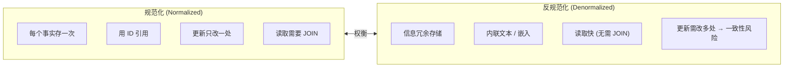

**为什么用 ID 而不是文本？**
- ID 对人无意义 → 永远不需要改变
- 文本对人有意义 → 可能需要改变（城市改名、公司更名）
- 改变时：ID 只需改引用表一处，文本需找到所有副本

**规范化 vs 反规范化的选择**：
| 场景 | 推荐 |
|------|------|
| OLTP 小到中规模 | 规范化（一致性好，JOIN 代价可接受）|
| OLAP / 数据仓库 | 反规范化（历史数据不变，读性能优先）|
| 超大规模系统 | 混合：部分反规范化 + 异步一致性 |

**Twitter Timeline 案例的启示**：
- 物化 Timeline 是反规范化的缓存
- Timeline 中只存 post_id（不存内容），读取时 **hydrate（水合）** 实际内容
- 这种 "ID 存储 + 读取时 JOIN" 并不影响性能，因为按 ID 查找可以高度并行化

### 3.4 星型模型与雪花模型 (数据仓库)

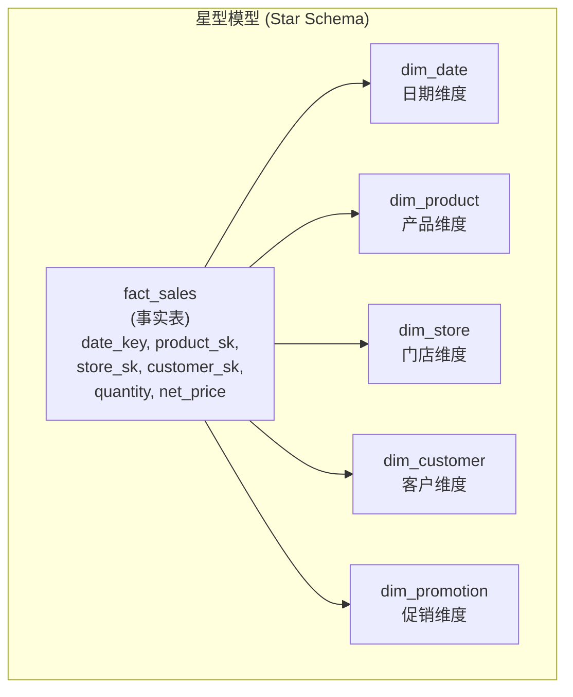

| 概念 | 说明 |
|------|------|
| **事实表 (Fact Table)** | 记录事件（一次购买、一次点击），通常非常宽（100+ 列）且非常大（PB 级）|
| **维度表 (Dimension Table)** | 描述事件的 who/what/where/when/how/why |
| **星型模型** | 事实表在中心，维度表围绕 → 形如星星 |
| **雪花模型** | 维度表进一步规范化（品牌、分类拆成子维度表）→ 更规范但更复杂 |
| **OBT (One Big Table)** | 极端反规范化，维度直接嵌入事实表 → 查询快但存储大 |

`★ Insight ─────────────────────────────────────`
- 数据仓库中反规范化的代价很低，因为数据主要是**历史不可变的事件日志**，不存在 OLTP 中"更新一致性"的问题。
- **事实表的每一行代表一个事件**，这个理念和 Event Sourcing 非常相似。区别：事实表是无序集合，Event Sourcing 的日志是有序序列。
`─────────────────────────────────────────────────`

### 3.5 何时用哪种模型？

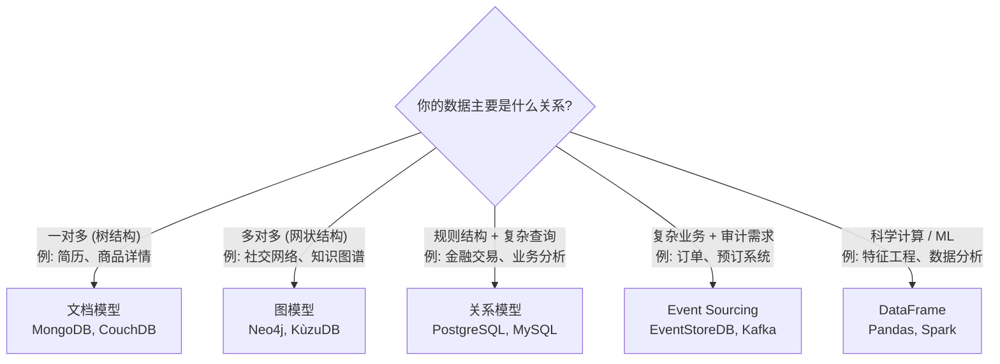

#### Schema-on-Read vs Schema-on-Write

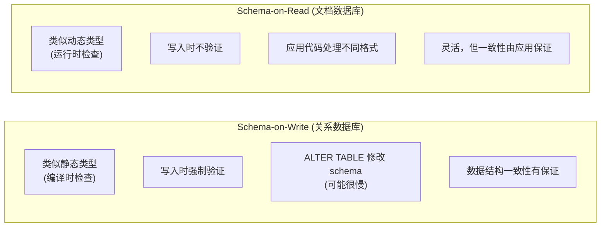

**Schema 迁移实例**：
```sql
-- Schema-on-Write: 关系数据库拆分 name 字段
ALTER TABLE users ADD COLUMN first_name text DEFAULT NULL;
UPDATE users SET first_name = split_part(name, ' ', 1);  -- 可能很慢!
```

```javascript
// Schema-on-Read: 文档数据库 — 应用代码处理新旧格式
if (user && user.name && !user.first_name) {
    user.first_name = user.name.split(" ")[0];
}
```

**Schema-on-Read 更适合**：数据类型异构、外部数据源结构不可控的场景。

### 3.6 图数据模型

#### Property Graph 模型

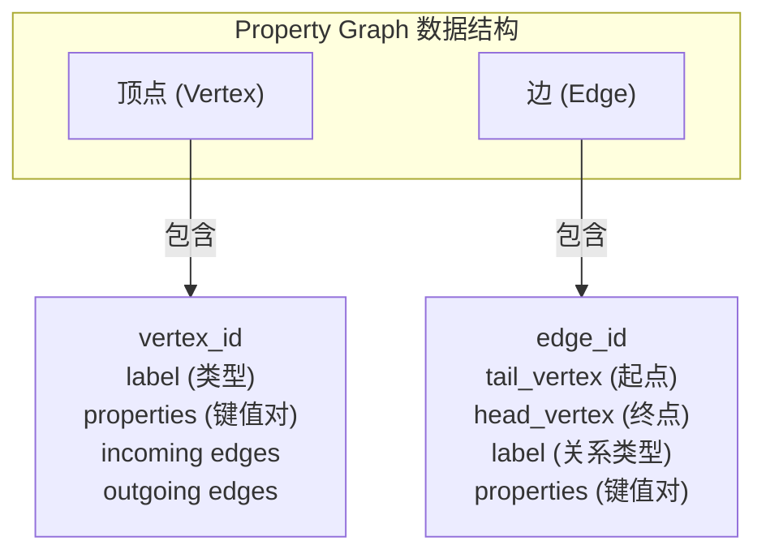

**用关系数据库实现 Property Graph**：

```sql
CREATE TABLE vertices (
    vertex_id  integer PRIMARY KEY,
    label      text,
    properties jsonb
);

CREATE TABLE edges (
    edge_id     integer PRIMARY KEY,
    tail_vertex integer REFERENCES vertices (vertex_id),
    head_vertex integer REFERENCES vertices (vertex_id),
    label       text,
    properties  jsonb
);

CREATE INDEX edges_tails ON edges (tail_vertex);
CREATE INDEX edges_heads ON edges (head_vertex);
```

**图模型的核心优势**：
- 任何顶点可以与任何其他顶点建立边 → 极度灵活
- 可以正反向高效遍历（索引 tail 和 head）
- 一个图中可以存储**异构数据**（人、地点、事件、组织...）
- 非常适合**可演化性**：新增关系类型不需要修改 schema

#### 四种图查询语言对比

同一个查询："找出生于美国、现居欧洲的人"

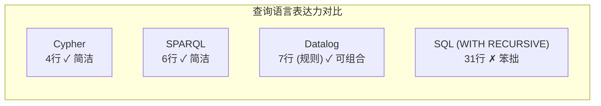

**Cypher** (Neo4j, Memgraph, KùzuDB):
```cypher
MATCH
  (person) -[:BORN_IN]->  () -[:WITHIN*0..]-> (:Location {name:'United States'}),
  (person) -[:LIVES_IN]-> () -[:WITHIN*0..]-> (:Location {name:'Europe'})
RETURN person.name
```

**SPARQL** (Triple Store):
```sparql
PREFIX : <urn:example:>
SELECT ?personName WHERE {
  ?person :name ?personName.
  ?person :bornIn / :within* / :name "United States".
  ?person :livesIn / :within* / :name "Europe".
}
```

**Datalog** (Datomic, LogicBlox, CozoDB):
```prolog
within_recursive(LocID, PlaceName) :- location(LocID, PlaceName, _).
within_recursive(LocID, PlaceName) :- within(LocID, ViaID),
                                      within_recursive(ViaID, PlaceName).
migrated(PName, BornIn, LivingIn) :- person(PersonID, PName),
                                     born_in(PersonID, BornID),
                                     within_recursive(BornID, BornIn),
                                     lives_in(PersonID, LivingID),
                                     within_recursive(LivingID, LivingIn).
us_to_europe(Person) :- migrated(Person, "United States", "Europe").
```

`★ Insight ─────────────────────────────────────`
- **GQL (Graph Query Language)** 于 2024 年发布为 ISO 标准 [46, 47, 48]，基于 Cypher。未来图数据库有望统一查询语言，就像 SQL 统一了关系数据库。
- Datalog 的独特之处在于**规则可以组合和递归** — 像函数一样构建复杂查询。它是 Prolog 的子集，学术研究中影响深远，但工业界采用有限。
- GraphQL 名字带 "Graph" 但**不是图查询语言** — 它是 API 查询语言，设计上故意限制了表达能力（不支持递归、不支持任意条件），以防客户端发起昂贵查询。
`─────────────────────────────────────────────────`

### 3.7 Event Sourcing 与 CQRS

这是第二版新增的重要内容。

#### 核心思想

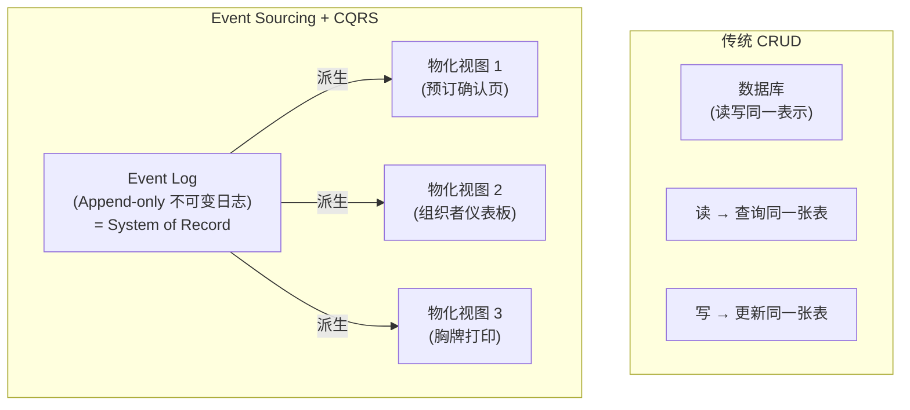

**Event Sourcing**：以不可变事件日志作为事实源（SoR），每个状态变更记录为一个事件。
**CQRS (Command Query Responsibility Segregation)**：写入路径和读取路径使用不同的数据表示。

#### 优点

- 事件传达**意图** — "预订被取消" 比 "active 列改为 false" 更清晰
- 物化视图可**重建** — 删除视图，从日志重新计算即可
- 可以有**多个物化视图**，各自针对不同查询模式优化
- **审计日志**是天然内置的
- 事件日志写入吞吐高（顺序追加）
- 减少不可逆操作（错误事件可以通过追加删除事件来修正）

#### 缺点与挑战

- **外部信息的确定性**：事件中包含的汇率等外部数据可能变化 → 需要在事件中快照外部状态
- **GDPR 删除权**：不可变日志 vs 个人数据删除 → 可用 **crypto-shredding**（加密存储，销毁密钥即删除）
- **副作用**：重建视图时不能重新发送确认邮件 → 需要区分首次处理和重放
- **所有视图必须以相同顺序处理事件** → 分布式环境中不容易保证（详见 Ch10）

### 3.8 DataFrames、矩阵与数组

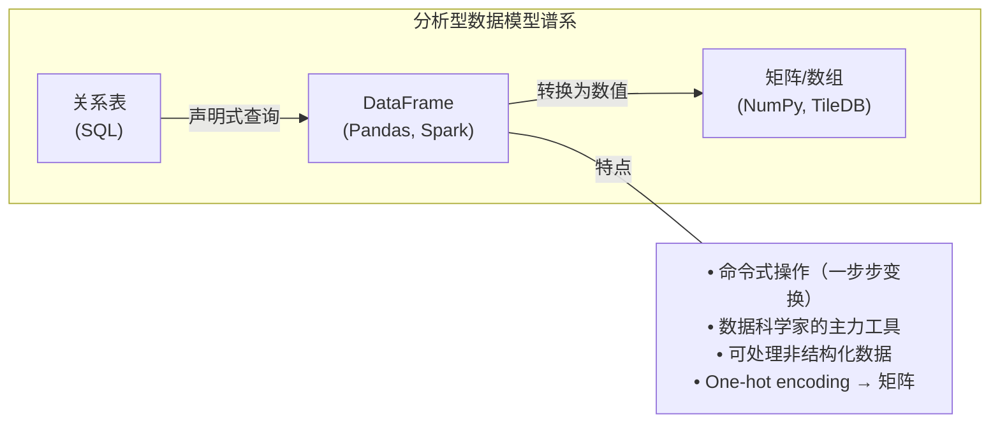

**DataFrame vs 关系表**：
| 维度 | 关系表 | DataFrame |
|------|--------|-----------|
| 查询方式 | 声明式 (SQL) | 命令式（链式操作）|
| 用途 | OLTP + OLAP | 数据探索 + ML 特征工程 |
| JOIN 术语 | JOIN | merge |
| 是否稀疏 | 否 | 可以处理稀疏矩阵 |

### 3.9 关系-文档融合趋势

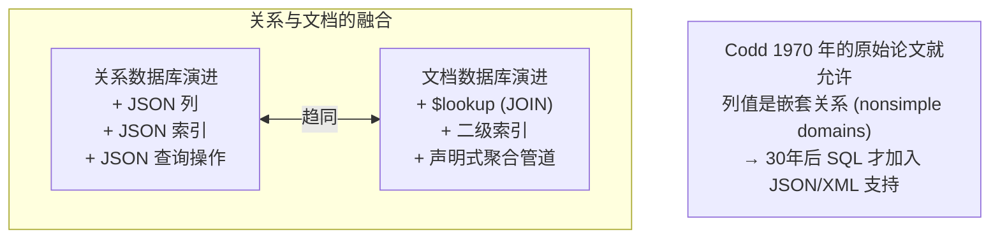

---

## 💻 代码示例与最佳实践

### 实践 1：MongoDB 聚合管道 vs SQL

```javascript
// ========================================
// MongoDB 聚合管道: 按月统计鲨鱼观察数
// ========================================
db.observations.aggregate([
    { $match: { family: "Sharks" } },
    { $group: {
        _id: {
            year:  { $year:  "$observationTimestamp" },
            month: { $month: "$observationTimestamp" }
        },
        totalAnimals: { $sum: "$numAnimals" }
    }}
]);
```

```sql
-- 等价的 PostgreSQL 查询
SELECT
    date_trunc('month', observation_timestamp) AS observation_month,
    sum(num_animals) AS total_animals
FROM observations
WHERE family = 'Sharks'
GROUP BY observation_month;
```

### 实践 2：用 PostgreSQL 实现 Property Graph

```sql
-- ========================================
-- Property Graph 完整实现
-- ========================================

-- 建表
CREATE TABLE vertices (
    vertex_id  integer PRIMARY KEY,
    label      text,
    properties jsonb
);

CREATE TABLE edges (
    edge_id     integer PRIMARY KEY,
    tail_vertex integer REFERENCES vertices (vertex_id),
    head_vertex integer REFERENCES vertices (vertex_id),
    label       text,
    properties  jsonb
);

CREATE INDEX edges_tails ON edges (tail_vertex);
CREATE INDEX edges_heads ON edges (head_vertex);

-- 插入数据
INSERT INTO vertices VALUES
    (1, 'Location', '{"name":"North America", "type":"continent"}'),
    (2, 'Location', '{"name":"United States", "type":"country"}'),
    (3, 'Location', '{"name":"Idaho", "type":"state"}'),
    (4, 'Location', '{"name":"London", "type":"city"}'),
    (5, 'Person',   '{"name":"Lucy"}'),
    (6, 'Person',   '{"name":"Alain"}');

INSERT INTO edges VALUES
    (10, 3, 2, 'within',   '{}'),   -- Idaho within US
    (11, 2, 1, 'within',   '{}'),   -- US within North America
    (12, 5, 3, 'born_in',  '{}'),   -- Lucy born in Idaho
    (13, 5, 4, 'lives_in', '{}'),   -- Lucy lives in London
    (14, 5, 6, 'married',  '{}');   -- Lucy married Alain

-- 递归查询: 找出 Idaho 属于哪些地区
WITH RECURSIVE within_recursive(vertex_id) AS (
    SELECT vertex_id FROM vertices
    WHERE label = 'Location' AND properties->>'name' = 'Idaho'
  UNION
    SELECT edges.head_vertex FROM edges
    JOIN within_recursive ON edges.tail_vertex = within_recursive.vertex_id
    WHERE edges.label = 'within'
)
SELECT v.properties->>'name' AS place
FROM within_recursive wr
JOIN vertices v ON wr.vertex_id = v.vertex_id;
-- 结果: Idaho, United States, North America
```

### 实践 3：Event Sourcing 基本框架

```python
"""
Event Sourcing + CQRS 最小实现框架
展示"事件日志是 System of Record，物化视图是 Derived Data"的核心思想
"""
from dataclasses import dataclass, field
from datetime import datetime
from typing import Any

# ========================================
# 事件定义 (用过去时命名!)
# ========================================
@dataclass
class Event:
    event_type: str
    timestamp: datetime
    data: dict

# 事件日志 (Append-only, 不可变)
class EventLog:
    def __init__(self):
        self.events: list[Event] = []

    def append(self, event: Event):
        """追加事件 — 永远不修改或删除已有事件"""
        self.events.append(event)

    def replay(self, from_index: int = 0):
        """从指定位置重放事件 — 用于重建物化视图"""
        return self.events[from_index:]

# ========================================
# 物化视图 (Derived Data, 可随时重建)
# ========================================
class SeatAvailabilityView:
    """会议座位可用性视图 — 从事件日志派生"""
    def __init__(self):
        self.capacity: dict[str, int] = {}   # conf_id -> 总容量
        self.booked: dict[str, int] = {}     # conf_id -> 已预订

    def process_event(self, event: Event):
        """处理单个事件来更新视图"""
        if event.event_type == 'conference_created':
            conf_id = event.data['conf_id']
            self.capacity[conf_id] = event.data['venue_capacity']
            self.booked[conf_id] = 0

        elif event.event_type == 'seats_reserved':
            conf_id = event.data['conf_id']
            self.booked[conf_id] += event.data['num_seats']

        elif event.event_type == 'booking_canceled':
            conf_id = event.data['conf_id']
            self.booked[conf_id] -= event.data['num_seats']

    def available_seats(self, conf_id: str) -> int:
        return self.capacity.get(conf_id, 0) - self.booked.get(conf_id, 0)

    def rebuild_from_log(self, event_log: EventLog):
        """核心能力：从事件日志完全重建"""
        self.__init__()  # 重置状态
        for event in event_log.replay():
            self.process_event(event)

# ========================================
# 使用示例
# ========================================
log = EventLog()
view = SeatAvailabilityView()

# 写入事件
events = [
    Event('conference_created', datetime.now(),
          {'conf_id': 'ddia-2026', 'venue_capacity': 500}),
    Event('seats_reserved', datetime.now(),
          {'conf_id': 'ddia-2026', 'num_seats': 3, 'customer_id': 'c001'}),
    Event('seats_reserved', datetime.now(),
          {'conf_id': 'ddia-2026', 'num_seats': 5, 'customer_id': 'c002'}),
    Event('booking_canceled', datetime.now(),
          {'conf_id': 'ddia-2026', 'num_seats': 3, 'customer_id': 'c001'}),
]

for e in events:
    log.append(e)
    view.process_event(e)

print(view.available_seats('ddia-2026'))  # 495

# 物化视图出 bug? 修复代码后重建!
view.rebuild_from_log(log)
print(view.available_seats('ddia-2026'))  # 仍然是 495
```

---

## 🎯 系统设计面试题

### 面试题 1：为一个社交网络设计数据模型

**题目**：设计一个类似 LinkedIn 的职业社交网络，需要支持：
- 用户简历（教育经历、工作经历、技能）
- 用户之间的连接关系（一度、二度、三度人脉）
- 技能背书（用户 A 为用户 B 的某项技能背书）
- "你可能认识的人"推荐

**关键考察点**：关系 vs 文档 vs 图模型的选择、多对多关系处理

**参考思路**：

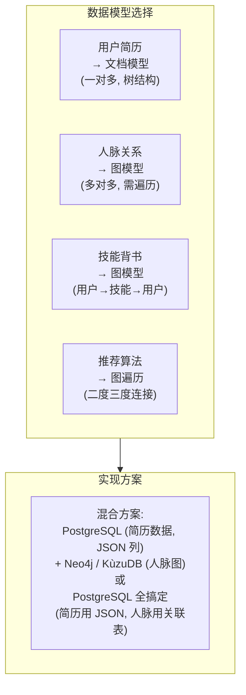

**思考方向**：
- 简历数据天然是 one-to-many → 文档模型或 PostgreSQL + jsonb
- 人脉图需要 "几度人脉" → 图遍历（BFS），用 Cypher 的 `[:CONNECTED*1..3]` 很自然
- 小公司可以用 PostgreSQL + WITH RECURSIVE 搞定一切，不需要引入图数据库
- "你可能认识的人" 本质是 "找共同好友最多的二度人脉" — 典型图查询

---

### 面试题 2：为一个电商平台选择 Schema-on-Read 还是 Schema-on-Write？

**题目**：你的电商平台有多种商品类型（书籍、电子产品、服装），每种有不同的属性。同时需要支持第三方卖家上架商品（属性不可控）。

**关键考察点**：Schema 灵活性 vs 数据一致性

**参考思路**：

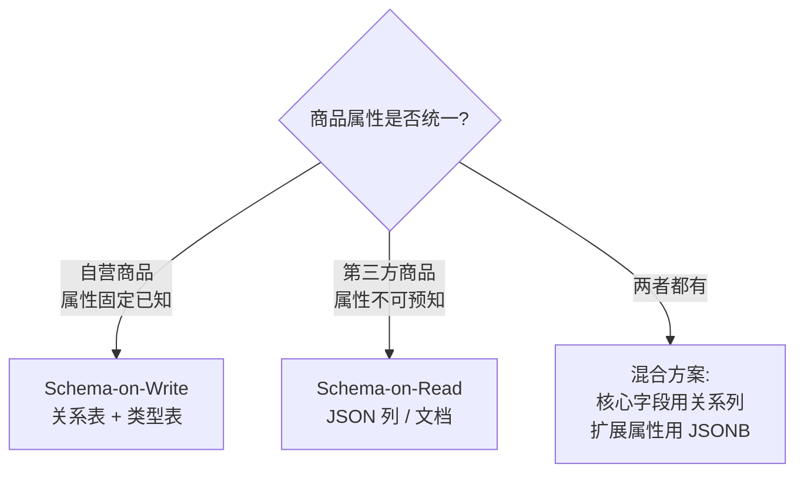

**推荐方案**（大多数情况）：
```sql
CREATE TABLE products (
    id          BIGINT PRIMARY KEY,
    name        TEXT NOT NULL,        -- 核心字段: schema-on-write
    price       DECIMAL NOT NULL,
    category    TEXT NOT NULL,
    seller_id   BIGINT REFERENCES sellers(id),
    attributes  JSONB                 -- 扩展属性: schema-on-read
);

-- 可以对 JSONB 内的字段建索引!
CREATE INDEX idx_brand ON products ((attributes->>'brand'));
```

---

### 面试题 3：设计一个订单管理系统，使用 Event Sourcing

**题目**：电商订单系统需要支持：下单、支付、发货、退款、取消，以及完整的审计日志。传统 CRUD 方案中，取消订单后很难追溯之前的状态。

**关键考察点**：Event Sourcing vs CRUD、物化视图设计、GDPR 合规

**参考思路**：

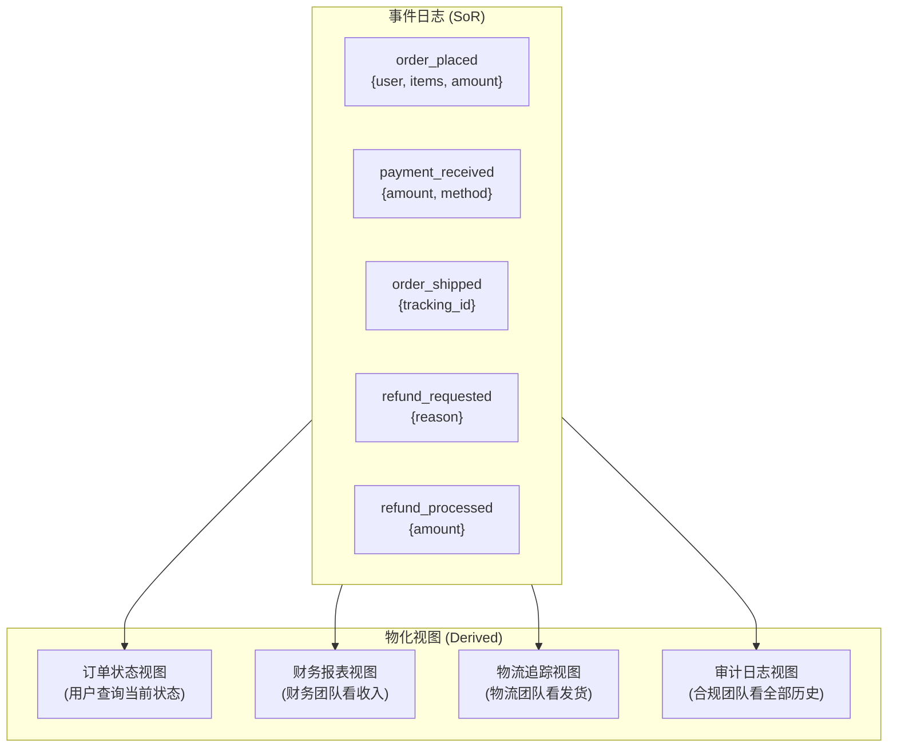

**思考方向**：
- 用 Kafka 存事件日志，各消费者维护自己的物化视图
- "取消订单"不是删除，是追加 `order_canceled` 事件
- 审计日志是天然附带的，不需要额外实现
- GDPR 删除：使用 crypto-shredding，每个用户一个加密密钥

---

## 📝 本章要点总结

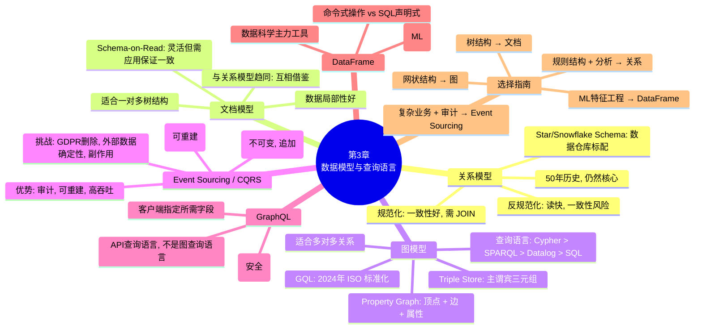

### 核心 Takeaways

1. **数据模型决定了你如何思考问题** — 选择关系/文档/图不仅是技术决策，更影响你对数据的认知方式
2. **一对多 → 文档，多对多 → 图，通用 → 关系** — 这是最简单的选择框架
3. **规范化 vs 反规范化不是非此即彼** — 混合使用，关键看数据的更新频率和读取模式
4. **Schema-on-Read ≠ 无 Schema** — 总有隐式 schema，问题只是谁来验证（数据库还是应用代码）
5. **关系和文档数据库正在趋同** — PostgreSQL 有 JSONB，MongoDB 有 `$lookup`，选择时看生态而非模型差异
6. **图查询语言比 SQL 处理图数据简洁 10 倍** — 4 行 Cypher = 31 行 SQL (WITH RECURSIVE)
7. **Event Sourcing 将状态变更记录为不可变事件** — 天然支持审计、可重建物化视图，但需处理 GDPR 和副作用
8. **没有万能的数据模型** — 好的系统往往混合使用多种模型（PostgreSQL 存核心数据 + Redis 存缓存 + Elasticsearch 存搜索索引 + Neo4j 存图关系）
