# Chapter 3: 数据模型与查询语言 (Data Models and Query Languages)

> *"The limits of my language mean the limits of my world."*
> — Ludwig Wittgenstein, *Tractatus Logico-Philosophicus* (1922)

数据模型可能是软件开发中**最重要**的部分——它不仅影响代码怎么写,更深远地影响你**如何思考要解决的问题**。选了什么数据模型,就选了看世界的视角。

---

## 🧭 本章导读

大多数应用是"一层层数据模型叠起来的"。每一层的关键问题都是:**它如何用下一层的语言来表达?**

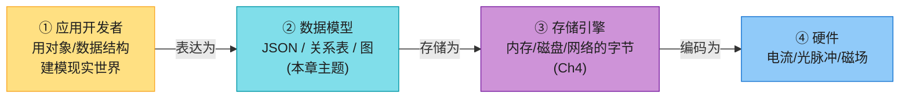

本章关注第②层。它横向铺开了几大数据模型,帮你判断**什么场景该用哪个**:

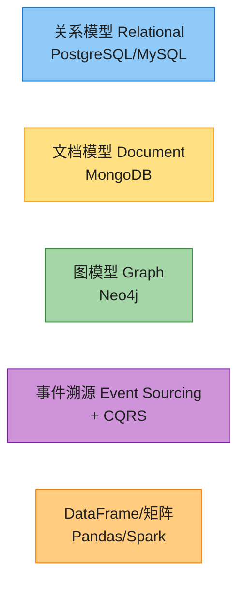

| 模型 | 最适合的关系形态 | 典型场景 |
|------|---------------|---------|
| 关系 | 任意(通用中间地带) | 业务系统、金融交易、数仓分析 |
| 文档 | **一对多(树)** | 简历、商品详情、内容管理 |
| 图 | **多对多(网)** | 社交网络、知识图谱、推荐 |
| 事件溯源 | 复杂业务+审计 | 订单、预订、财务 |
| DataFrame | 科学计算/ML | 特征工程、数据分析 |

> 📝 **名词注释**
> - **声明式查询语言 (declarative)**:SQL、Cypher、SPARQL 都是声明式——你描述"**要什么**"(结果要满足什么条件、怎么排序聚合),**不说"怎么做"**;由查询优化器决定用哪个索引、什么 join 顺序。好处是简洁,且数据库可以偷偷做并行化/优化而不用改查询 [1][2]。与之相反的是命令式(Python/Java,一步步告诉计算机怎么做)。
> - **阻抗失配 / N+1 / 规范化 / hydrate** 等术语见各小节注释。

---

## 1. 关系模型 vs 文档模型

关系模型(Codd 1970 [4])把数据组织成**关系(relation,SQL 里叫表)**——每个关系是**无序的元组集合(tuple,SQL 里叫行)**。它统治了半个多世纪,中间打败了层级模型、网状模型、对象数据库、XML 数据库等挑战者 [5]。2010s 的 NoSQL 运动没能颠覆它,但留下了一个持久遗产:**文档模型(用 JSON 表示数据)**。

### 1.1 对象关系阻抗失配 (Impedance Mismatch)

现代应用多用面向对象语言写,而对象和关系表之间需要一层别扭的翻译,这种脱节叫**阻抗失配**(术语借自电子学:两个电路阻抗不匹配会导致信号反射)。

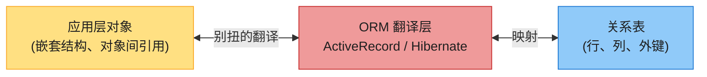

**ORM 框架**(ActiveRecord、Hibernate)能减少样板代码,但常被吐槽 [7]:

- 没法完全隐藏两种模型的差异,开发者还是得同时想着对象和表;
- 只对 OLTP 友好,数据工程师做分析还是要直接碰关系 schema;
- 自动生成的 schema 可能对直接查询不友好、效率低;
- **容易写出低效查询,典型是 N+1 问题**。

> 📝 **名词注释**
> - **ORM (Object-Relational Mapping)**:对象到关系表的自动映射框架。
> - **N+1 查询问题** [8]:要显示 N 条评论及其作者名。手写 SQL 会用一次 JOIN 把作者名一起查出来(1 次查询);但 ORM 可能先查 N 条评论(1 次),再**每条评论各查一次**作者(N 次),总共 N+1 次查询——比 JOIN 慢得多。解决办法:明确告诉 ORM"取评论时一并预取作者"(eager loading)。

### 1.2 案例:LinkedIn 简历(一对多关系)

不是所有数据都适合关系表。看一份简历(LinkedIn profile):一个人有 `first_name`、`last_name`(单值),但也有**多段工作经历、多段教育、多条联系方式**(一对多)。关系式做法是拆成多张表,用外键关联:

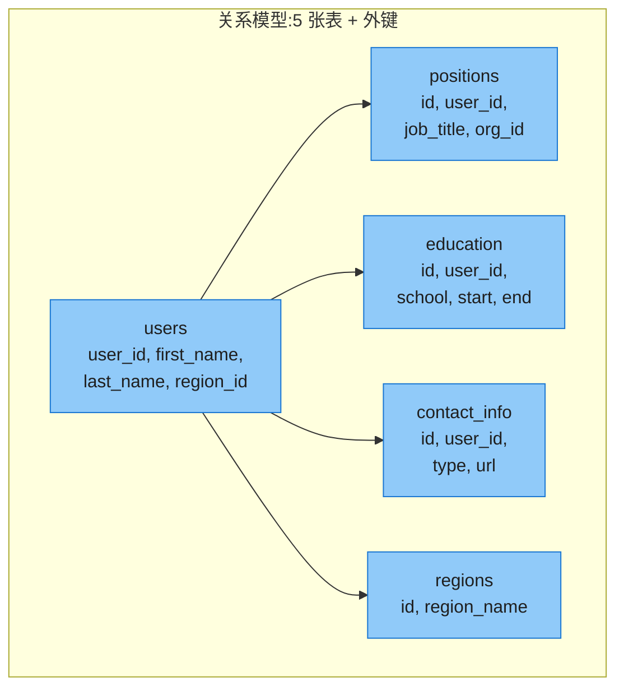

读一份完整简历,要么查 5 次表,要么做一个复杂的多表 JOIN。而**文档模型**把整份简历存成一个 JSON:

```json
{
  "user_id": 251,
  "first_name": "Barack",
  "last_name": "Obama",
  "positions": [
    {"job_title": "President", "organization": "United States of America"},
    {"job_title": "US Senator (D-IL)", "organization": "United States Senate"}
  ],
  "education": [
    {"school_name": "Harvard University", "start": 1988, "end": 1991}
  ],
  "contact_info": {"website": "https://barackobama.com"}
}
```

**文档模型的优势**:

| 优势 | 说明 |
|------|------|
| **数据局部性 (locality)** | 整份简历在一个文档里,一次读取就拿到全部,不用多表 JOIN |
| **贴近应用对象** | JSON 结构直接映射代码里的对象,减少阻抗失配 |
| **schema 灵活** | 随时加新字段,不用 ALTER TABLE |

**文档模型的劣势**:

- **不能直接引用嵌套项**——只能说"user 251 的 positions 列表的第 2 项",没有独立 ID;
- **多对多关系处理困难**——需要应用层手动 JOIN 或 `$lookup`;
- **大文档性能差**——更新要重写整个文档;只读一小部分也要加载整篇。

> 💡 **核心洞察(贯穿全章)**:
> - **一对多关系 = 树结构 → 文档模型天然适合**;
> - **多对多关系 = 图结构 → 图模型天然适合**;
> - **关系模型是通用中间地带**——两种都能处理,但都不是最自然。
>
> 还要注意 **one-to-many ≠ one-to-a-lot**:简历里几段工作经历(few)适合嵌进文档;名人帖子下成千上万条评论(many)就不该全嵌进一个文档,关系表更合适 [11][12]。

> 📝 **名词注释**
> - **shredding(撕碎)**:把一个文档式结构拆成多张关系表(如把简历的 positions 拆成单独表)。文档结构强时,shredding 会让 schema 臃肿、代码复杂。
> - **数据局部性 (data locality)**:相关数据物理上存在一起,一次 I/O 就能读完。文档模型天然有局部性;关系模型靠 Spanner 的 interleaved table、Bigtable 的 column family 等机制补上 [27][29]。

---

## 2. 规范化、反规范化与 JOIN

### 2.1 为什么用 ID 而不是文本?

简历里 `region_id` 存的是 ID(如 `"us:91"`),而不是直接写字符串 `"Washington, DC, United States"`。为什么?因为 region 来自**标准化下拉列表**,用 ID 引用有诸多好处:

- **风格拼写一致**(不会有人填 "Washington DC" 有人填 "Washington, D.C.");
- **避免歧义**(Washington 是 DC 还是华盛顿州?);
- **易于更新**——城市改名只在 regions 表改一处,所有引用自动跟着变;
- **支持本地化**(同一地区 ID,中文界面显示"华盛顿",英文显示 "Washington");
- **更好的搜索**(地区列表能编码"华盛顿在东海岸",纯字符串看不出来)。

> 📝 **名词注释**
> - **规范化 (normalization)**:有意义的对人类信息(如地名)**只存一处**,其它地方用无意义的 ID 引用。优点:一致、易更新;代价:读取时要 JOIN 把 ID 解析回文本。
> - **反规范化 (denormalization)**:把人类可读的信息**冗余复制**到多处。优点:读取快(少 JOIN);代价:更新要改多处,有一致性风险。
> - **一句话:ID 对人无意义 → 永不需要改;文本对人有意 → 迟早要改**。改文本时,ID 只动一处,文本要找遍所有副本。

### 2.2 规范化 vs 反规范化:权衡

```mermaid
flowchart LR
    subgraph NORM["规范化 Normalized"]
        N1["每个事实只存一次"]
        N2["用 ID 引用"]
        N3["✅ 写快、一致性好"]
        N4["❌ 读要 JOIN"]
    end

    subgraph DENORM["反规范化 Denormalized"]
        D1["信息冗余存储"]
        D2["直接内联文本/对象"]
        D3["✅ 读快(少 JOIN)"]
        D4["❌ 写慢、一致性风险"]
    end

    NORM <-->|"读写权衡"| DENORM

    style N1 fill:#A5D6A7,stroke:#388E3C,color:#1f1f1f
    style N2 fill:#A5D6A7,stroke:#388E3C,color:#1f1f1f
    style N3 fill:#A5D6A7,stroke:#388E3C,color:#1f1f1f
    style N4 fill:#EF9A9A,stroke:#C62828,color:#1f1f1f
    style D1 fill:#FFCC80,stroke:#F57C00,color:#1f1f1f
    style D2 fill:#FFCC80,stroke:#F57C00,color:#1f1f1f
    style D3 fill:#A5D6A7,stroke:#388E3C,color:#1f1f1f
    style D4 fill:#EF9A9A,stroke:#C62828,color:#1f1f1f
```

| 场景 | 推荐 | 原因 |
|------|------|------|
| OLTP 中小规模 | **规范化** | 一致性好,JOIN 代价可接受 |
| OLAP / 数仓 | **反规范化** | 历史数据不变,读性能优先 |
| 超大规模 | **混合** | 部分反规范化 + 异步保持一致 |

> 💡 反规范化可以看作一种**派生数据**(Ch1 §4)——冗余副本需要一套流程来保持更新。

### 2.3 深入:Twitter Timeline 的反规范化启示

回到 Ch2 的 timeline 案例。X(Twitter)实际存储的物化 timeline **不存帖子正文**,每条只存 `post_id`、`sender_id` 和少量 repost/reply 标识 [13]。读 timeline 时仍要做两次"JOIN":

1. 用 `post_id` 查帖子正文 + 点赞数等;
2. 用 `sender_id` 查用户名、头像。

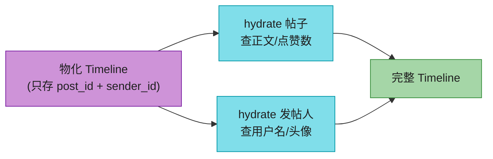

> 📝 **名词注释**:**hydrate(水合)**——按 ID 查回人类可读信息的过程,本质是**在应用代码里做 JOIN**。
>
> **为什么不把正文也反规范化进 timeline?** 因为正文相关数据**变得太快**(热门帖点赞数每秒变几次,有人频繁换头像/用户名),反规范化进来一旦读取就过时了,而且存储成本暴涨。所以:**变化快的部分保持规范化(读时 hydrate),变化慢的部分才反规范化**。
>
> 💡 这说明"读时要 JOIN"**并不必然妨碍高性能**——按 ID hydrate 高度可并行,成本不随关注数/粉丝数增长。最 scalable 的方案往往是**部分反规范化 + 部分规范化**,要仔细权衡各项的读写频率。

---

## 3. 星型与雪花 Schema(数据仓库)

数仓(Ch1 §3)通常用关系模型,但有一套专门为分析师优化的表结构约定:**星型 schema、雪花 schema、dimensional modeling、OBT** [14]。

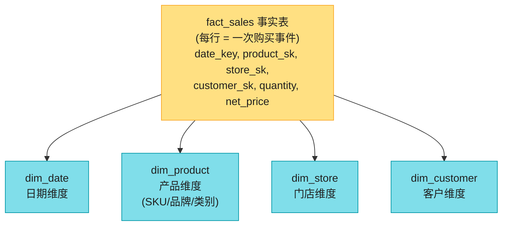

| 概念 | 说明 |
|------|------|
| **事实表 (fact table)** | 每行代表一个**事件**(一次购买/一次点击),通常极宽(100+ 列)、极大(PB 级) |
| **维度表 (dimension table)** | 描述事件的 **who/what/where/when/how/why**(产品、门店、客户、日期) |
| **星型 schema (star)** | 事实表在中心,维度表围绕——形如星星;**分析师最爱**(简单) |
| **雪花 schema (snowflake)** | 维度表进一步规范化(品牌、类别拆成子维度表);更规范但更复杂 |
| **OBT (One Big Table)** | 极端反规范化,把维度直接嵌入事实表;查询快但存储大 [15] |

> 📝 **名词注释**:**事实表的外键 (foreign key)** 指向维度表;查询时常要多表 JOIN 到多个维度。日期也用维度表,是为了编码"是否节假日"等额外信息。

> 💡 **深入:为什么数仓敢大举反规范化?** 因为数仓的数据本质是**不可变的历史事件日志**——卖出去的东西不会回头改,所以反规范化的"更新一致性"痛点在 OLTP 里很要命,在分析里基本不存在。这也是 OBT 这种激进反规范化在数仓能工作的原因。
>
> 💡 **事实表每一行 = 一个事件**,这个理念跟 §6 的 **Event Sourcing** 很像。区别:事实表是无序集合,Event Sourcing 的日志是有序序列。

---

## 4. 何时用哪个模型 + Schema 灵活性

### 4.1 决策框架

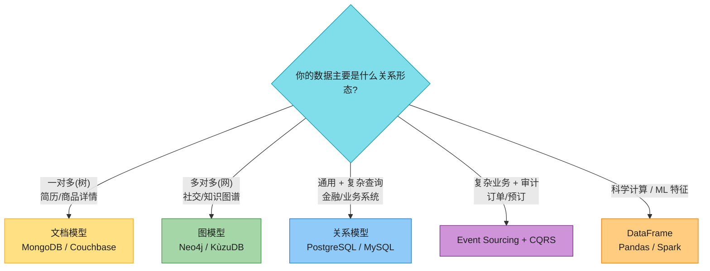

### 4.2 Schema-on-Read vs Schema-on-Write

文档数据库常被叫 "schemaless"(无 schema),这其实**有误导**——读数据的代码总假设某种结构,只是这个**隐式 schema 不由数据库强制** [19]。更准确的说法:

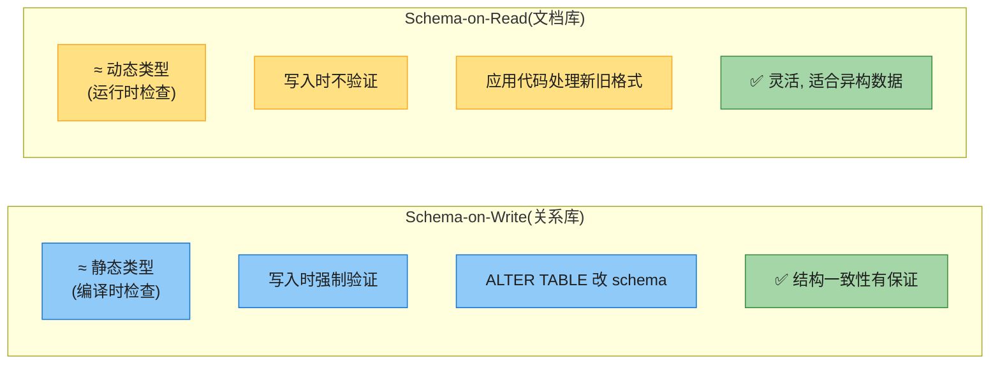

#### 深入:改 schema 时两者差别有多大?

场景:原来把全名存一个 `name` 字段,现在想拆成 `first_name` / `last_name`。

**Schema-on-Read(文档库)**——直接开始写带新字段的新文档,读代码处理老文档:

```javascript
if (user && user.name && !user.first_name) {
    // 2023-12-08 之前写的老文档没有 first_name
    user.first_name = user.name.split(" ")[0];
}
```
缺点:**每处读数据的代码**都得处理老格式。

**Schema-on-Write(关系库)**——做一次迁移:

```sql
ALTER TABLE users ADD COLUMN first_name text DEFAULT NULL;  -- 加列(通常很快)
UPDATE users SET first_name = split_part(name, ' ', 1);     -- 回填(大表上很慢!)
```
缺点:`UPDATE` 大表很慢(每行都要重写);改列类型甚至要整表复制。有 `pt-online-schema-change`、`gh-ost`、`pgroll` 等工具做零停机迁移 [23][24][26],但操作上仍是挑战。

> 💡 **折中**:关系库也可以"加一个默认 NULL 的列(快),读取时再填值"——模拟 schema-on-read。所以两者并非泾渭分明。
>
> **Schema-on-Read 更适合**:数据异构(对象类型太多,没法每类一表)、结构由不可控的外部系统决定。

### 4.3 数据局部性

文档通常作为**连续字符串**存储(JSON/XML/BSON)。如果应用常需**整个文档**(如渲染网页),这种局部性有性能优势——不用多次磁盘寻道。但局部性**只在你要大部分文档时有用**;只读一小部分大文档、或频繁小更新(要重写整篇),反而吃亏。建议:**文档别太大,少做频繁小更新**。

关系模型也能获得局部性:**Spanner** 的 interleaved table(子表行嵌进父表)[27]、**Oracle** 的 multi-table index cluster tables [28]、**Bigtable/HBase** 的 column family [29]。

### 4.4 查询语言:MongoDB 聚合管道 vs SQL

文档库查询语言更多样。以"按月统计鲨鱼观察数"为例 [原书 Example]:

```sql
-- PostgreSQL (声明式 SQL)
SELECT date_trunc('month', observation_timestamp) AS observation_month,
       sum(num_animals) AS total_animals
FROM observations
WHERE family = 'Sharks'
GROUP BY observation_month;
```

```javascript
// MongoDB 聚合管道(命令式链式,JSON 语法)
db.observations.aggregate([
    { $match: { family: "Sharks" } },
    { $group: {
        _id: { year:  {$year:  "$observationTimestamp"},
               month: {$month: "$observationTimestamp"} },
        totalAnimals: { $sum: "$numAnimals" }
    }}
]);
```

两者表达力相当,差别主要是语法风格(SQL 英文句子式 vs JSON 管道式)。

### 4.5 关系与文档的融合

两类数据库正在**趋同** [33]:

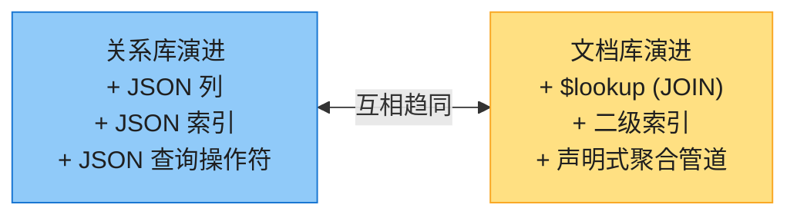

> 💡 这是好事——**关系+文档混合**是最强组合:既有关系式的 JOIN 和多对多能力,又有文档式的 schema 灵活。PostgreSQL 的 JSONB、MongoDB 的 `$lookup` 都是此趋势的产物。
>
> 有趣的是 **Codd 1970 年的原始论文**就允许关系里的值是嵌套关系(他叫 nonsimple domains)——30 年后 SQL 才加 JSON/XML 支持,绕了一大圈回到原点 [4]。

---

## 5. 图数据模型 (Graph-Like Data Models)

当**多对多关系非常普遍且复杂**时,关系模型开始吃力,把数据建模成**图**更自然。

图由**顶点 vertex(也叫 node/entity)**和**边 edge(也叫 relationship/arc)**组成。典型场景:社交图、网页链接图、道路网;经典算法:最短路径、PageRank [34]。图的强大还在于:**一个图里可以存完全异构的对象**(人、地点、事件、评论混在一起),Facebook 的社交图、Google 的知识图谱都是这么干的 [35][36]。

### 5.1 Property Graph(属性图)

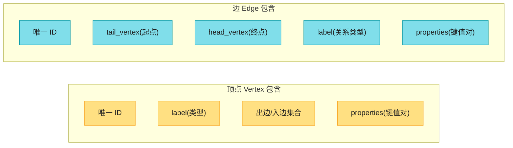

**用关系表实现 Property Graph**(Neo4j/Memgraph/KùzuDB [37] 内部思路):

```sql
CREATE TABLE vertices (
    vertex_id  integer PRIMARY KEY,
    label      text,
    properties jsonb
);
CREATE TABLE edges (
    edge_id     integer PRIMARY KEY,
    tail_vertex integer REFERENCES vertices (vertex_id),  -- 起点
    head_vertex integer REFERENCES vertices (vertex_id),  -- 终点
    label       text,
    properties  jsonb
);
CREATE INDEX edges_tails ON edges (tail_vertex);  -- 正向遍历
CREATE INDEX edges_heads ON edges (head_vertex);  -- 反向遍历
```

**图模型的核心优势**:

- 任何顶点可连任何顶点,**没有 schema 限制**哪些能关联;
- 给定顶点,能**双向高效遍历**(所以 tail 和 head 都建索引);
- 用不同 label 在**一个图里存异构数据**,仍保持清晰模型;
- **极佳的可演化性**——加新关系类型不用改 schema。

> ⚠️ **图的局限**:一条边只能连**两个**顶点;而关系的 join 表能用一行多外键表达**三方或更高元关系**。图里要表达这种,得额外建一个"中间顶点"或用 hypergraph。

### 5.2 案例:Lucy 的迁移(贯穿后续查询语言)

原书用这个小例子贯穿所有图查询语言:Lucy 出生于美国 Idaho,现居欧洲 London,丈夫 Alain。问:**"找出所有从美国迁移到欧洲的人"**。底下用四种语言写同一个查询。

### 5.3 Cypher(Neo4j 等的查询语言)

```cypher
MATCH
  (person) -[:BORN_IN]->  () -[:WITHIN*0..]-> (:Location {name:'United States'}),
  (person) -[:LIVES_IN]-> () -[:WITHIN*0..]-> (:Location {name:'Europe'})
RETURN person.name
```

> 📝 **名词注释**:
> - `(person) -[:BORN_IN]-> ()`:匹配任何由 BORN_IN 边连起来的两个顶点,起点绑到变量 `person`。
> - `:WITHIN*0..`:**沿 WITHIN 边走 0 次或多次**——像正则的 `*`。这是关键:Lucy 的 LIVES_IN 可能指向城市,城市 within 州,州 within 国家,层级不定,`*0..` 一次表达"层级不定"。

### 5.4 用 SQL 查图(WITH RECURSIVE)

图数据能存进关系库(§5.1),那能用 SQL 查吗?能,但**很笨拙**。每遍历一条边 = 一次 JOIN;而图查询里**JOIN 次数事先不确定**(层级不定),得用递归 CTE:

```sql
WITH RECURSIVE
  in_usa(vertex_id) AS (          -- 美国境内的所有地点
      SELECT vertex_id FROM vertices
        WHERE label='Location' AND properties->>'name'='United States'
    UNION
      SELECT edges.tail_vertex FROM edges
        JOIN in_usa ON edges.head_vertex = in_usa.vertex_id
        WHERE edges.label='within'
  ),
  in_europe(vertex_id) AS ( ... )   -- 同理,欧洲境内
  ...
SELECT vertices.properties->>'name'
FROM vertices
JOIN born_in_usa     ON vertices.vertex_id = born_in_usa.vertex_id
JOIN lives_in_europe ON vertices.vertex_id = lives_in_europe.vertex_id;
```

> 💡 **4 行 Cypher = 31 行 SQL**!这就是数据模型+查询语言选对的力量。SQL 笨拙的根因:**关系模型假设 JOIN 次数事先已知**,而图遍历次数不定。SQL 还要操心循环检测、广度/深度优先等细节 [42]。

### 5.5 四种图查询语言对比

同一个查询,四种语言:

| 语言 | 风格 | 行数 | 代表实现 |
|------|------|------|---------|
| **Cypher** | 模式匹配(箭头) | ~4 | Neo4j、Memgraph、KùzuDB、Amazon Neptune、Apache AGE |
| **SPARQL** | 三元组模式 | ~6 | Datomic、AllegroGraph、Blazegraph、Neptune |
| **Datalog** | 规则(像 Prolog) | ~7 | Datomic、CozoDB、LinkedIn LIquid |
| **SQL (WITH RECURSIVE)** | 递归 CTE | ~31 | 任何关系库 |

**SPARQL**(Triple Store 的查询语言):

```sparql
PREFIX : <urn:example:>
SELECT ?personName WHERE {
  ?person :name ?personName.
  ?person :bornIn  / :within* / :name "United States".
  ?person :livesIn / :within* / :name "Europe".
}
```

> 📝 **名词注释**:**Triple Store(三元组存储)** 用 `(subject, predicate, object)` 三元组存一切,等价于 property graph,只是叫法不同。如 `(Jim, likes, bananas)`。subject=顶点,predicate=边或属性。RDF 是它的数据模型,Turtle 是它的文本格式 [51]。SPARQL 早于 Cypher,Cypher 的模式匹配就是借鉴 SPARQL。

**Datalog**(最古老,1980s [60]):

```prolog
within_recursive(LocID, PlaceName) :- location(LocID, PlaceName, _).          % 规则1
within_recursive(LocID, PlaceName) :- within(LocID, ViaID),                    % 规则2(递归)
                                      within_recursive(ViaID, PlaceName).
migrated(PName, BornIn, LivingIn) :- person(PersonID, PName),                  % 规则3
                                     born_in(PersonID, BornID),
                                     within_recursive(BornID, BornIn), ... .
us_to_europe(Person) :- migrated(Person, "United States", "Europe").           % 规则4
```

> 💡 Datalog 的独特处:**用规则一步步推导新"虚拟表"**,规则可互相引用、可递归(像函数调用)。它基于 Prolog,学术影响大,工业界用得少,但表达复杂查询非常强大。

### 5.6 GraphQL(名字带 Graph,但**不是**图查询语言!)

GraphQL 是 **API 查询语言**,给客户端(移动 App / 前端)用来精确请求渲染 UI 所需的 JSON 字段:

```graphql
query ChatApp {
  channels {
    name
    recentMessages(latest: 50) {
      content
      sender { fullName imageUrl }
      replyTo { content sender { fullName } }
    }
  }
}
```

> 💡 **为什么故意限制表达力?** GraphQL 查询来自**不可信的客户端**,不能让用户发起昂贵查询搞 DoS。所以它**不支持递归**(不像 Cypher/SPARQL/SQL/Datalog)、不支持任意搜索条件,除非服务端主动开放。它可以在任何数据库(关系/文档/图)之上实现。响应里的冗余(同用户发多条消息,名字重复多次)是**有意的取舍**——用更大响应换更简单的 UI 渲染。

> 🏭 **GQL(Graph Query Language)** 于 **2024 年成为 ISO 标准** [46][47][48],基于 Cypher。未来图数据库有望像关系库统一于 SQL 那样统一于 GQL。

---

## 6. Event Sourcing 与 CQRS(2 版重要新增)

前面所有模型都是"**读和写用同一种数据表示**"。但复杂应用里,很难找到一种表示能同时满足所有读和写需求。**Event Sourcing + CQRS** 的思路:**写一种表示,读多种派生表示**。

### 6.1 核心思想

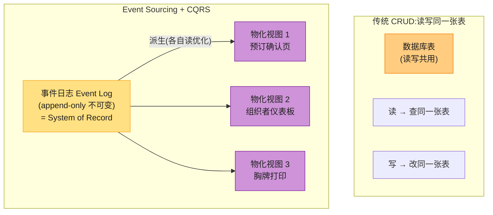

> 📝 **名词注释**
> - **Event Sourcing(事件溯源)**:以**不可变的事件日志**作为事实源 (SoR),每次状态变更记为一个事件(用**过去时**命名,如 "seats_were_booked")。
> - **CQRS(Command Query Responsibility Segregation)**:写路径(command)和读路径(query)**用不同的数据表示**,各自优化。
> - **command vs event**:用户请求先作为 **command(命令)** 进来,要校验(如有无足够座位);校验通过、确定有效后,变成一个 **event(事实)** 追加进日志。事件日志**只含有效事件**,消费者不许拒绝事件。
> - **物化视图 / projection / read model**:从事件日志派生、为特定查询优化的读模型。可随时删除重建。

### 6.2 优点

- **事件传达意图**——"预订被取消" 比 "active 列改 false + 删 3 行 + 插 1 行退款" 清晰得多;
- **物化视图可重建**——视图有 bug?改完代码,删掉视图从日志重放,瞬间修复;
- **可有多个物化视图**,各自为不同查询优化,可用任何数据模型、可去规范化,甚至只放内存;
- **审计日志天然内置**——金融等强监管行业刚需;
- **写吞吐高**——顺序追加比随机更新快,流量尖峰可入队缓冲;
- **减少不可逆操作**——写错事件就追加一个"补偿事件"撤销,而不是艰难回滚事务。

### 6.3 缺点与挑战

| 挑战 | 说明 | 应对 |
|------|------|------|
| **外部数据确定性** | 事件含汇率等外部数据,重算时结果会变 | 事件里**快照外部状态**(把当时汇率存进事件),或能按时间戳查历史值 |
| **GDPR 删除权** | 不可变日志 vs 删除个人数据 | **crypto-shredding**——加密存储个人数据,销毁密钥即"删除" [68] |
| **副作用** | 重建视图时不该重发确认邮件 | 区分"首次处理"和"重放",重放时抑制外部副作用 |
| **顺序保证** | 所有视图必须按日志相同顺序处理事件 | 分布式环境不易,详见 Ch10 |

### 6.4 深入:Event Sourcing vs 数仓事实表

两者都是"过去事件的集合",但有关键差异:

| | 数仓事实表 | Event Sourcing 日志 |
|---|----------|-------------------|
| **结构** | 所有行同列(固定 schema) | 多种事件类型,各有不同属性 |
| **顺序** | 无序集合 | **有序序列**(顺序错了结果就错) |
| **用途** | 分析 | 业务状态重建 |

> 🏭 **真实产品**:**EventStoreDB**、**MartenDB**(基于 PostgreSQL)、**Axon Framework** 专为 event sourcing 设计;也可用 **Kafka** 存事件日志 + 流处理器(Flink)维护物化视图(Ch12 详谈)。

---

## 7. DataFrames、矩阵与数组

前面那些模型主要用于 OLTP/OLAP。科学计算和 ML 场景还会遇到 **DataFrame** 和**多维数组/矩阵**。

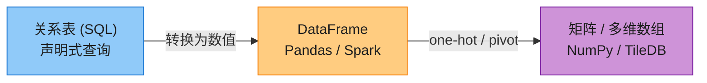

**DataFrame vs 关系表**:

| 维度 | 关系表 | DataFrame |
|------|--------|-----------|
| 操作方式 | 声明式 SQL | **命令式链式**(一步步 wrangle) |
| JOIN 叫法 | JOIN | **merge** |
| 用途 | OLTP + OLAP | 数据探索 + ML 特征工程 |
| 列数 | 通常几十 | 可达成千上万 |
| 稀疏数据 | 不擅长 | 能处理稀疏矩阵 |

> 📝 **名词注释**:
> - **DataFrame**:类似带标签的电子表格/表,R 的 data.frame、Python Pandas、Spark/ArcticDB/Dask 都支持 [69]。数据科学家的主力工具。
> - **one-hot encoding(独热编码)**:把类别变量(电影类型:喜剧/剧情/恐怖)变成数字列——每种值一列,是该值的那列填 1,其余填 0。让 ML 算法能吃下分类数据。
> - **稀疏矩阵 (sparse matrix)**:大多数元素为 0 的矩阵(如用户-电影评分矩阵,大部分人没评大部分电影)。用特殊格式只存非零项,省内存。NumPy/SciPy 擅长。

> 💡 **关系 → DataFrame → 矩阵** 是 ML 的典型流水线:从关系库存数据 → 用 DataFrame 清洗变换 → 转成数值矩阵喂给 ML 算法(线性代数)。矩阵只能含数字,所以类别、日期都要编码成数值(one-hot、缩放等)。
>
> 🏭 **array database**:**TileDB** [70] 专门存大多维数组,用于地理栅格、医学影像、天文观测;金融业用 DataFrame 存时间序列(**ArcticDB** 来自 Man Group/Bloomberg [72])。Ch11 批处理会再见 DataFrame。

---

## 8. 其他值得一提的模型

- **基因组数据库(GenBank [73])**:DNA 序列相似性搜索,需要专门的长字符串匹配引擎。
- **复式记账 / 分布式账本**:**TigerBeetle** 等专为复式记账设计;区块链/加密货币基于分布式账本,内建价值转移。
- **全文搜索 / 向量搜索**:信息检索是另一大类数据模型,Ch4 会涉及搜索索引和向量嵌入。

---

## 🏭 生产级产品速查表

| 数据模型 | 产品 | 关键点 |
|---------|------|--------|
| 关系(通用) | PostgreSQL、MySQL、SQLite | 半个世纪主流;JSONB 已融入 |
| 关系(分布式) | Spanner、CockroachDB、TiDB | Spanner 的 interleaved table 提供局部性 |
| 文档 | MongoDB、Couchbase | `$lookup` 做 JOIN;schema-on-read |
| 关系+文档融合 | **PostgreSQL JSONB** | 一个库两全其美,加 GIN 索引查 JSON 字段 |
| 图(Property Graph) | Neo4j、Memgraph、KùzuDB、Amazon Neptune | Cypher 查询 |
| 图(Triple Store) | Datomic、AllegroGraph、Blazegraph | SPARQL / Datalog |
| 图(SQL 之上) | Apache AGE(PostgreSQL 扩展) | 不换库也能玩图 |
| 宽列(wide-column) | Bigtable、HBase、Cassandra | column family 管局部性 |
| Event Sourcing | EventStoreDB、MartenDB、Axon、**Kafka** | 不可变日志 + 物化视图 |
| DataFrame | Pandas、Spark、ArcticDB、Dask、Polars | ML 特征工程 |
| 数组数据库 | TileDB | 科学多维数组 |
| 记账 | TigerBeetle | 复式记账专用 |

---

## 💻 代码示例

### 示例 1:MongoDB 聚合管道 vs 等价 SQL

```javascript
// MongoDB: 按月统计鲨鱼观察数
db.observations.aggregate([
    { $match: { family: "Sharks" } },                    // WHERE
    { $group: {                                           // GROUP BY
        _id: { year:  {$year:  "$observationTimestamp"},
               month: {$month: "$observationTimestamp"} },
        totalAnimals: { $sum: "$numAnimals" }             // SUM()
    }}
]);
```

```sql
-- PostgreSQL 等价查询
SELECT date_trunc('month', observation_timestamp) AS observation_month,
       sum(num_animals) AS total_animals
FROM observations
WHERE family = 'Sharks'
GROUP BY observation_month;
```

### 示例 2:用 PostgreSQL 实现 Property Graph + 递归查询

```sql
-- 建表(见 §5.1)
-- 插入 Lucy 的数据
INSERT INTO vertices VALUES
    (1,'Location','{"name":"North America","type":"continent"}'),
    (2,'Location','{"name":"United States","type":"country"}'),
    (3,'Location','{"name":"Idaho","type":"state"}'),
    (5,'Person',  '{"name":"Lucy"}');

INSERT INTO edges VALUES
    (10, 3, 2, 'within',  '{}'),   -- Idaho within US
    (11, 2, 1, 'within',  '{}'),   -- US within North America
    (12, 5, 3, 'born_in', '{}');   -- Lucy born in Idaho

-- 递归查询: Idaho 属于哪些地区? (Cypher 里一行 :WITHIN*0.. 就搞定)
WITH RECURSIVE within_recursive(vertex_id) AS (
    SELECT vertex_id FROM vertices
      WHERE properties->>'name' = 'Idaho'
  UNION
    SELECT edges.head_vertex FROM edges
      JOIN within_recursive ON edges.tail_vertex = within_recursive.vertex_id
      WHERE edges.label = 'within'
)
SELECT v.properties->>'name' AS place
FROM within_recursive wr JOIN vertices v ON wr.vertex_id = v.vertex_id;
-- 结果: Idaho, United States, North America
```

### 示例 3:Event Sourcing + CQRS 最小框架(Python)

```python
"""
核心思想:事件日志 = System of Record(不可变),物化视图 = Derived(可重建)。
事件用过去时命名! 这是会议座位可用性的物化视图。
"""
from dataclasses import dataclass
from datetime import datetime

@dataclass
class Event:
    event_type: str        # 用过去时:'seats_reserved' 而非 'reserve_seats'
    timestamp: datetime
    data: dict

class EventLog:
    """Append-only 事件日志(永不修改/删除已有事件)"""
    def __init__(self): self.events = []
    def append(self, e): self.events.append(e)
    def replay(self): return list(self.events)

class SeatAvailabilityView:
    """物化视图:从事件派生,可随时从日志重建"""
    def __init__(self):
        self.capacity = {}    # conf_id -> 总容量
        self.booked = {}      # conf_id -> 已订

    def process_event(self, e):
        if e.event_type == 'conference_created':
            self.capacity[e.data['conf_id']] = e.data['venue_capacity']
            self.booked[e.data['conf_id']] = 0
        elif e.event_type == 'seats_reserved':
            self.booked[e.data['conf_id']] += e.data['num_seats']
        elif e.event_type == 'booking_canceled':   # 取消也是事件!
            self.booked[e.data['conf_id']] -= e.data['num_seats']

    def available(self, conf_id):
        return self.capacity.get(conf_id, 0) - self.booked.get(conf_id, 0)

    def rebuild_from_log(self, log):
        """视图有 bug? 改完代码,删掉重放即可"""
        self.__init__()
        for e in log.replay():
            self.process_event(e)

# 用法
log = EventLog()
view = SeatAvailabilityView()
for e in [
    Event('conference_created', datetime.now(), {'conf_id':'ddia','venue_capacity':500}),
    Event('seats_reserved',    datetime.now(), {'conf_id':'ddia','num_seats':3}),
    Event('seats_reserved',    datetime.now(), {'conf_id':'ddia','num_seats':5}),
    Event('booking_canceled',  datetime.now(), {'conf_id':'ddia','num_seats':3}),
]:
    log.append(e); view.process_event(e)
print(view.available('ddia'))   # 497
view.rebuild_from_log(log)      # 重建后仍是 497
```

---

## 🎯 系统设计面试题

### 面试题 1:为职业社交网络设计数据模型 ★重点

**题目**:设计类 LinkedIn 的职业社交网络,支持:用户简历(教育/工作/技能)、人脉连接(一度/二度/三度)、技能背书、"你可能认识的人"推荐。

**第 1 步 · 需求澄清**:
- 简历结构会有多深?→ 工作经历可能嵌套(公司→部门),但通常 few 级。
- 人脉查询多深?→ 至少二度(朋友的朋友),推荐要三度。
- 数据规模?→ 假设亿级用户。

**第 2 步 · 关键洞察:不同子问题适合不同模型**

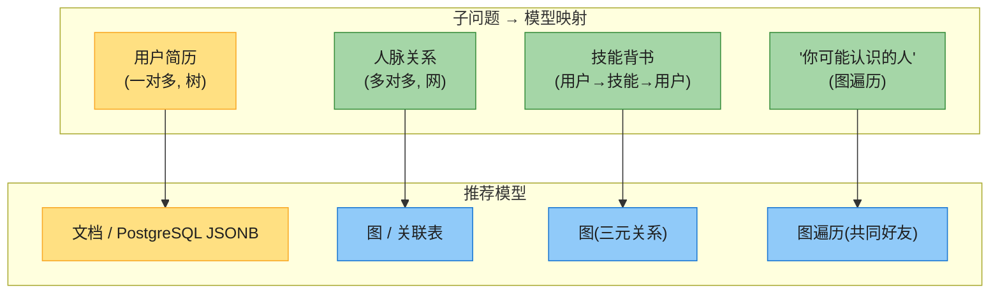

**第 3 步 · 方案**:

| 方案 | 适用 | 做法 |
|------|------|------|
| **小公司(全 PostgreSQL)** | 数据量中、团队小 | 简历用 `jsonb` 列;人脉用 `connections(user_id, friend_id)` 关联表 + 双向索引;"N 度人脉"用 `WITH RECURSIVE` |
| **大公司(混合)** | 亿级、深图遍历 | 简历 PostgreSQL;人脉图用 **Neo4j / TAO**(Facebook 的社交图存储 [35]) |

**第 4 步 · 深入**:
- "你可能认识的人"本质 = **找共同好友最多的二度人脉**——典型图查询,Cypher 一句 `MATCH (me)-[:KNOWS]-(friend)-[:KNOWS]-(fof) RETURN fof` 搞定。
- 技能背书是三元关系(A 给 B 的技能 C 背书)——图的边带属性,或关联表 `(endorser, endorsee, skill)`。
- **不要过早引入图数据库**——`WITH RECURSIVE` 在中小规模够用,团队人少时一个 PostgreSQL 全搞定最简单。

---

### 面试题 2:电商商品 schema —— Schema-on-Read 还是 Schema-on-Write?

**题目**:电商平台有多种商品(书、电子产品、服装)各有不同属性;还要支持第三方卖家上架(属性不可控)。

**关键考察点**:schema 灵活性 vs 一致性。

**推荐方案(混合)**:

```sql
CREATE TABLE products (
    id          BIGINT PRIMARY KEY,
    name        TEXT NOT NULL,         -- 核心字段: schema-on-write(强一致)
    price       DECIMAL NOT NULL,
    category    TEXT NOT NULL,
    seller_id   BIGINT REFERENCES sellers(id),
    attributes  JSONB                  -- 扩展属性: schema-on-read(灵活)
);
CREATE INDEX idx_attr_brand ON products ((attributes->>'brand'));  -- 能给 JSON 字段建索引!
```

**思路**:核心、稳定的字段(名称/价格)用关系列强制;异构、不可控的扩展属性(书有页数、服装有尺码、第三方自定义)用 JSONB。一个库两全其美——这正是 §4.5 关系-文档融合的实战。

---

### 面试题 3:用 Event Sourcing 设计订单系统

**题目**:电商订单需支持下单、支付、发货、退款、取消,及完整审计日志。传统 CRUD 取消后难追溯之前状态。

**架构**:

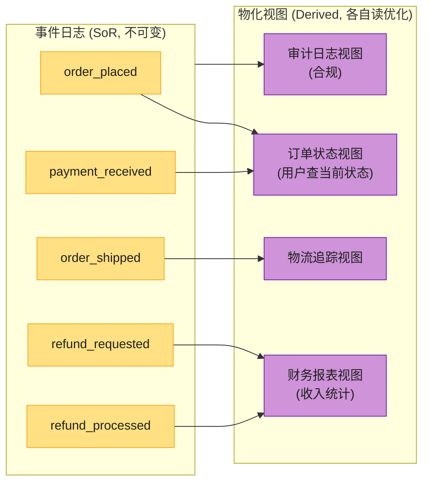

**要点**:
- 用 **Kafka** 存事件日志,各消费者(Flink/独立服务)维护自己的物化视图。
- "取消订单"不是 DELETE/UPDATE,是追加 `order_canceled` 事件——历史完整保留。
- 审计日志天然附带,不用额外造。
- GDPR 删除:用 **crypto-shredding**,每用户一个加密密钥,销毁密钥即"删除"。
- 副作用(发确认邮件)只在首次处理时触发,重放重建视图时抑制。

---

## 📚 精选文献(只留真正值得读的)

第三章引用 70 多条,多数是查询语言细节,不必读。这 6 篇值得:

| # | 文献 | 为什么值得读 |
|---|------|------------|
| [4] | Codd *"A Relational Model of Data for Large Shared Data Banks"* CACM 1970 | **关系模型的奠基论文**。理解为什么这个模型统治了半个世纪,以及它原本就支持嵌套(nonsimple domains)。 |
| [5] | Stonebraker & Hellerstein *"What Goes Around Comes Around"* 2005 | **数据模型演化史经典综述**。讲清了关系模型如何打败层级/网状/对象/XML 等挑战者,模式反复出现。 |
| [33] | Stonebraker & Pavlo *"What Goes Around Comes Around… And Around…"* SIGMOD Record 2024 | **上文的 2024 更新版**,补充了 NoSQL/DataFrames/图等新内容,印证"历史总在重演"。 |
| [35] | Bronson et al. *"TAO: Facebook's Distributed Data Store for the Social Graph"* ATC 2013 | **工业级社交图存储**。Facebook 如何用"对象+关联"图模型支撑数十亿用户,理解图模型在超大规模的实战。 |
| [14] | Kimball & Ross *The Data Warehouse Toolkit* 3rd | **维度建模(星型/雪花 schema)的权威指南**。做数仓/分析的必读,实操性极强。 |
| [27] | Corbett et al. *"Spanner: Google's Globally-Distributed Database"* OSDI 2012 | **理解关系模型如何在分布式+局部性上进化**(interleaved table)。也是 Ch6/Ch10 的基础。 |

> 想深入图查询语言:读 **Cypher 论文** [40];想搞 event sourcing:读 **Greg Young 的 CQRS/Event Sourcing** [65][66]。

---

## 📝 本章要点总结

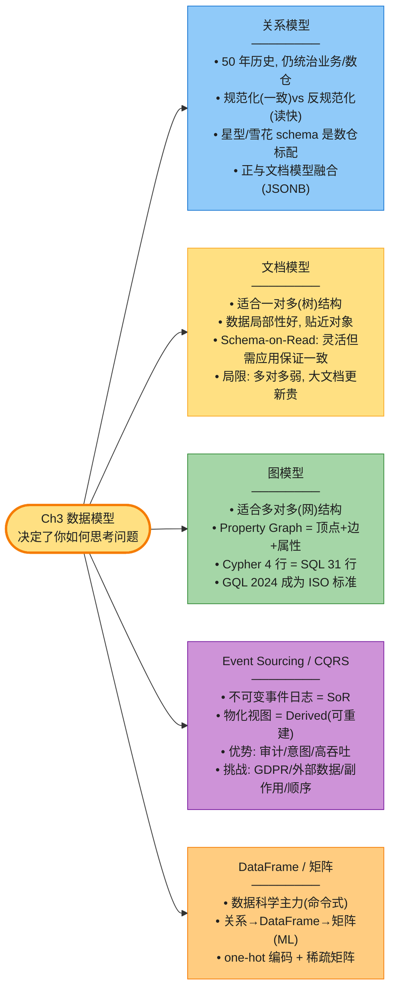

**核心 Takeaways**:

1. **数据模型决定思维方式**——选关系/文档/图不只是技术决策,更影响你对数据的认知。
2. **一对多→文档,多对多→图,通用→关系**——最简单的选型框架。
3. **规范化 vs 反规范化是读写权衡**,不是非此即彼;变化慢的反规范化、变化快的保持规范化(Twitter 只存 ID 读时 hydrate)。
4. **Schema-on-Read ≠ 无 schema**——总有隐式 schema,只是谁来验证(库 vs 应用代码)。
5. **关系和文档正在融合**——PostgreSQL JSONB + MongoDB `$lookup`,选型应看生态而非模型差异。
6. **图查询语言处理图数据比 SQL 简洁 10 倍**(4 行 Cypher = 31 行 SQL)。
7. **GraphQL 不是图查询语言**——是限制表达力的 API 查询语言,防客户端 DoS。
8. **Event Sourcing 把状态变更记为不可变事件**——天然支持审计和可重建物化视图,但要处理 GDPR、外部数据确定性、副作用、顺序。
9. **没有万能数据模型**——好系统往往混合多种(PostgreSQL 存核心 + Redis 缓存 + Elasticsearch 搜索 + Neo4j 图)。
