# Chapter 4: 存储与检索 (Storage and Retrieval)

> *"A computer does not primarily compute in the sense of doing arithmetic. […] They primarily are filing systems."*
> — Richard Feynman

数据库最底层只做两件事:**给你数据时存起来,你再要时还给**。Ch3 讲了"你给数据的格式和取数据的接口";本章从**数据库的视角**讲——它内部怎么存、怎么找。

你大概不会自己写存储引擎,但要在众多引擎里**选对、调好**,就得知道引擎盖下在干什么。**存储引擎是 DDIA 最硬核的一章**,也是面试高频。

---

## 🧭 本章导读

存储引擎按工作负载分两大流派:

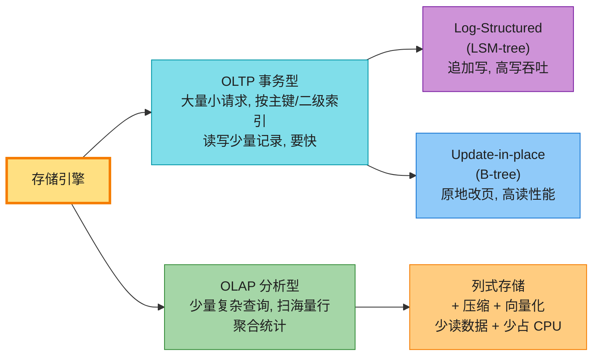

| 流派 | 核心思想 | 代表 |
|------|---------|------|
| **LSM-tree** | 只追加、不修改;后台合并 | RocksDB、Cassandra、HBase、Lucene |
| **B-tree** | 固定大小页,原地覆盖写 | 几乎所有关系库(PostgreSQL/MySQL) |
| **列存** | 按列而非按行存,压缩+向量化 | Snowflake、BigQuery、DuckDB、Parquet |

---

## 1. 从最简单的数据库开始

两个 bash 函数就是一个 key-value 数据库:

```bash
db_set () { echo "$1,$2" >> database; }                            # 追加写
db_get () { grep "^$1," database | sed "s/^$1,//" | tail -n 1; }   # 取最后一条
```

`db_set` 往文件末尾追加一行 `key,value`;`db_get` 找该 key 的所有行,取最后一条(最新值)。**写很快(追加)**,但**读很慢**——每次 `db_get` 要从头扫整个文件,O(n) 复杂度。

> 📝 **名词注释**
> - **log(日志)**:本书里指 **append-only 的记录序列**(不一定是人类可读的应用日志)。极其重要的原语,全书反复出现。
> - **index(索引)**:为加速查找而**额外**维护的派生结构。**索引是空间换时间**——加快读,但每次写都要更新索引,所以**拖慢写**。这就是存储系统的核心权衡:选对索引让查询飞,但索引越多写越慢、越占地方 [1]。

---

## 2. Log-Structured 存储(LSM-tree)

### 2.1 第一步:内存 Hash Index

最简单的加速——在内存维护一个哈希表,key → 该 key 最新值在文件里的字节偏移:

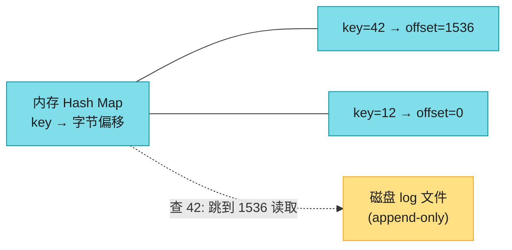

读取走哈希表定位、一次寻道读值,**飞快**。但缺点一堆:

- ❌ **旧值永不回收**,磁盘早晚撑爆;
- ❌ 哈希表**不持久化**,重启要全量扫日志重建(慢);
- ❌ 哈希表**必须放内存**(磁盘哈希表随机 I/O 多、扩容贵、碰撞麻烦);
- ❌ **范围查询低效**——查 key 10000~19999 只能一个个查,不能扫描。

### 2.2 第二步:SSTable(排序字符串表)

实际系统很少用哈希索引,**更常见的是让数据按 key 排序** [3]。**SSTable(Sorted Strings Table)** 就是一种按 key 排序、每个 key 只出现一次的文件格式:

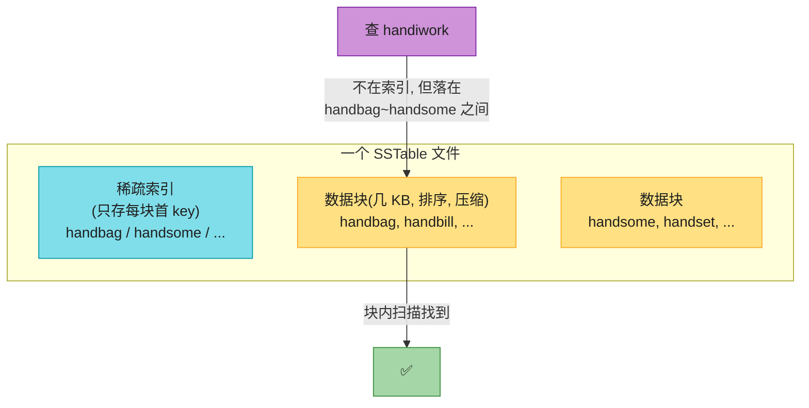

**SSTable 三大优势**:

1. **合并高效**——像归并排序(mergesort),多路读、取最小 key 写出,极省内存;
2. **稀疏索引**——不用把所有 key 放内存,只存每个数据块(几 KB)的首 key;查 `handiwork` 不在索引,但知道它在 `handbag`~`handsome` 之间,跳到 handbag 块内扫描即可,几 KB 一下就扫完;
3. **块压缩**——每个数据块可压缩,省磁盘省 I/O 带宽(代价是一点 CPU)。

### 2.3 第三步:构建 LSM-tree(memtable + SSTable + compaction)

SSTable 读起来爽,但不能直接追加写(会破坏排序)。解决办法是 **log-structured** 混合方案——**内存排序结构 + 磁盘不可变文件 + 后台合并**:

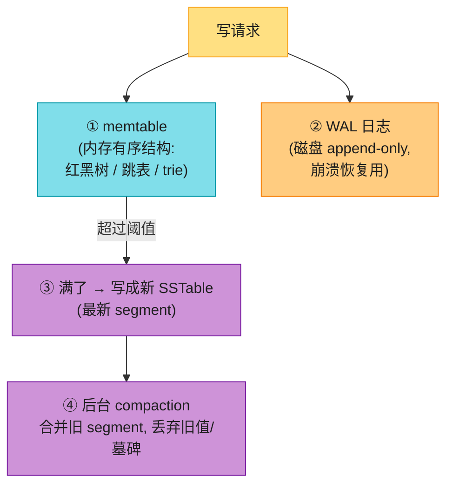

**写入流程**:
1. 写入内存的 **memtable**(有序结构);
2. 同时追加到 **WAL**(崩溃后能恢复 memtable);
3. memtable 满了(几 MB)→ 冻结,写成一个新 SSTable 到磁盘;
4. 后台 **compaction** 把多个 SSTable 归并成一个,丢弃被覆盖的旧值和 tombstone。

**读取流程**:先查 memtable → 再查最新的 SSTable → 一路查到最老的。都没找到 = key 不存在。

**删除**:不真的删,而是追加一个 **tombstone(墓碑)** 标记;compaction 时才真正丢弃旧值。

> 📝 **名词注释**
> - **memtable(内存表)**:内存里的有序数据结构,LSM 写入的第一站。
> - **WAL(Write-Ahead Log,预写日志)**:写操作先追加到此磁盘文件再改内存页,崩溃后用它重建状态。B-tree 也用同样的机制保证持久性。
> - **tombstone(墓碑)**:LSM 里表示"这个 key 已删除"的特殊记录;compaction 时才真正清除旧值。
> - **compaction(压实/合并)**:LSM 后台把多个 SSTable 归并、去重、清墓碑的过程,像归并排序。

> 🏭 **真实产品**:这套机制源自 Google **Bigtable** 论文(创造了 SSTable/memtable 术语)[9],用于 **RocksDB、Cassandra、ScyllaDB、HBase** [7][8];1996 年以 **LSM-tree** 之名首次发表 [10]。SSTable 还适合存对象存储(**SlateDB、Delta Lake**)[12]。

#### 深入:SSTable 文件不可变的好处

SSTable 一旦写好就**永不修改**。这带来一堆好处:后台 compaction 时,读仍可照常服务(读旧文件);崩溃恢复简单(删掉没写完的 SSTable 重来即可);还能直接存对象存储(S3)——**这也是云原生数据库能存算分离的底层基础**。

### 2.4 Bloom Filter:快速判断"key 不在"

LSM 读取的痛点:读一个**不存在**的 key,或读很久没更新的 key,要**查遍所有 SSTable**。解决办法——每个 SSTable 附带一个 **Bloom filter(布隆过滤器)**[13]:

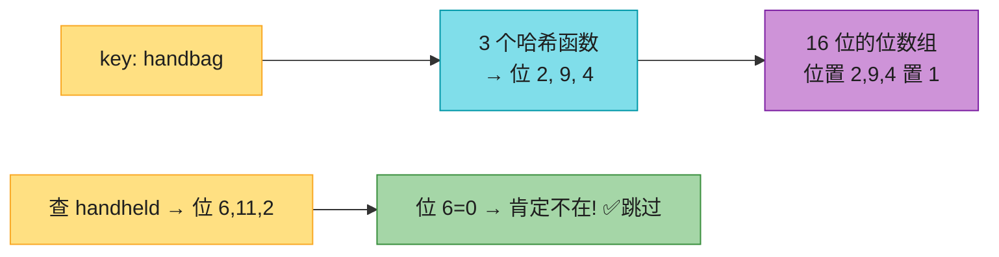

**原理**:每个 key 经多个哈希函数映射到位数组的几个位置,置 1。查询时同样哈希:

- 若**任一位是 0** → 该 key **肯定不在**(无假阴性);
- 若**所有位都是 1** → key **可能在**(有假阳性,因为别的 key 可能恰好把这些位置 1 了)。

> 📝 **名词注释**:**假阳性 (false positive)**——Bloom filter 说"在",但其实不在。在 LSM 场景无害:说不在就跳过(省事);说在就老老实实查稀疏索引确认(顶多多做点活)。
>
> **经验值**:每 key 分配 **10 位** → 假阳性率 **1%**;每多加 5 位,假阳性率降 10 倍。

### 2.5 Compaction 策略

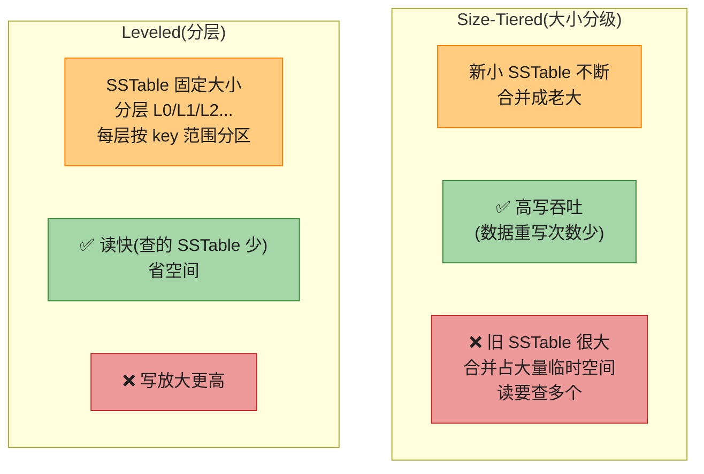

**经验**:**写多读少 → size-tiered;读多写少 → leveled**;写少量 key 很频繁 + 大量 key 很少写,leveled 也占优 [18]。

### 2.6 嵌入式数据库(Embedded DB)

不是所有数据库都是网络服务。**嵌入式数据库**是跑在你应用进程里的库,通过函数调用读写本地文件。代表:**RocksDB、SQLite、LMDB、DuckDB、KùzuDB** [19]。移动端存本地数据常用;后端若数据量小、并发不高(如多租户每租户一个独立库)也适用 [20]。

---

## 3. B-Tree(原地更新的树)

LSM 是"只追加",**B-tree** 则是"**原地覆盖写**"——把数据库切成**固定大小的页(page)**,可直接覆盖某一页。B-tree 1970 年问世 [21],至今仍是**几乎所有关系库的标准索引**,半个世纪没被取代。

### 3.1 结构:页与分支

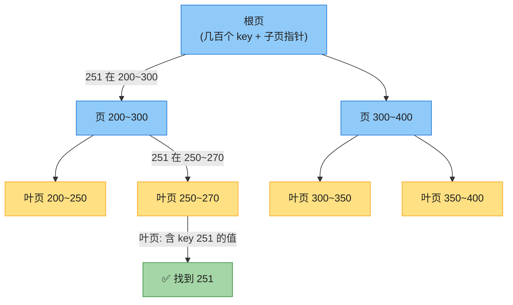

**查找 key 251**:从根页出发 → 251 落在 200~300 区间 → 进对应子页 → 251 落在 250~270 → 进叶页 → 找到值。

> 📝 **名词注释**
> - **page(页)**:B-tree 的基本单位,固定大小(PostgreSQL 8KB、MySQL 16KB)。每页有页号,页号 × 页大小 = 文件字节偏移,所以页可像指针一样互相引用。
> - **branching factor(分支因子)**:一页有多少个子页指针。实践中通常**几百**(图里是 6 只是示意)。
> - **B+ tree**:叶页存实际值、内部页只存边界 key 的变体——业界 B-tree 几乎都是 B+ tree,本书不区分。

**关键数字**:4 级深、4KB 页、分支因子 500 的 B-tree 能存 **250 TB**。所以大多数数据库只需 3~4 次页读取就能定位任意 key,性能可预测。

### 3.2 页分裂(Page Splitting)

插入 key 334,但目标页(333~345)满了 → **分裂成两个半满页**,父页更新边界:

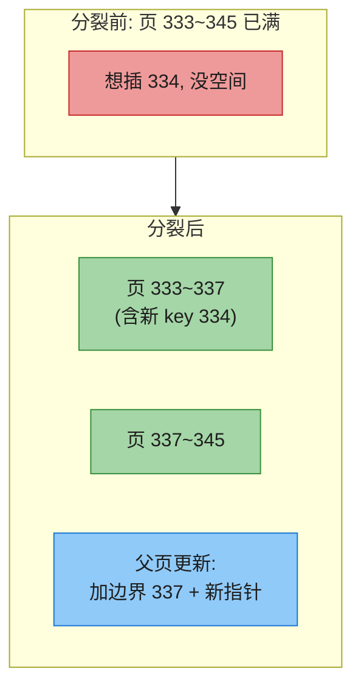

分裂会**向上传播**——父页也满了就继续分裂,甚至一路裂到根,造出新的根(树变深一层)。这保证 B-tree **永远平衡**:`n` 个 key 深度恒为 O(log n)。删除更复杂(可能要合并页)。

### 3.3 让 B-tree 可靠:WAL

B-tree 的基本写操作是"**覆盖一个页**"。但像页分裂这种**一次要改多个页**的操作很危险——如果只写了部分页就崩溃,树就损坏了(出现孤儿页)。另外硬件可能**原子写整个页都做不到**,产生"**torn page(撕裂页)**"[23]。

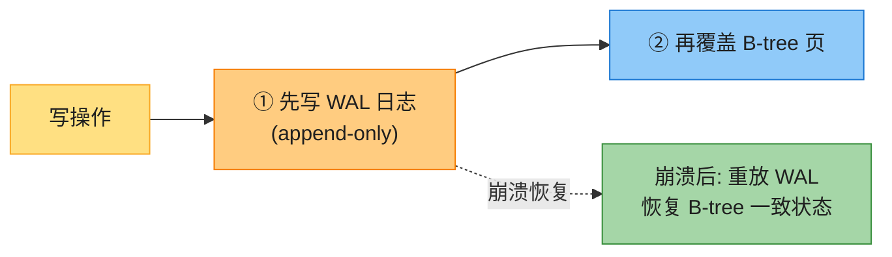

> 📝 **名词注释**:**WAL(write-ahead log,预写日志)**——所有 B-tree 修改必须**先追加到 WAL 再改页**;崩溃后重放 WAL 恢复。文件系统里这叫 **journaling(日志)**。B-tree 页通常先在内存缓冲,**按需 flush**(用 `fsync` 强制刷盘才保证持久)。

### 3.4 B-tree 变体

- **Copy-on-write B-tree**(如 LMDB [26]):修改的页写到**新位置**,父页也新建版本指向新位置——不用 WAL,也利于并发(快照隔离)。
- **缩写键**:内部页只存足以区分子范围的键片段 → 一页塞更多 key → 分支因子更高 → 树更浅。
- **兄弟指针**:叶页加左右兄弟指针 → 范围扫描不用回父页跳转。
- **顺序布局叶页**:让叶页在磁盘上顺序排列,减少寻道(但树长大了难维护)。

---

## 4. B-Tree vs LSM-Tree 全方位对比

**经验法则:LSM 适合写密集,B-tree 适合读密集** [27][28]。但 benchmark 对工作负载细节很敏感,必须实测。两者也非互斥——有的引擎混合两者(多个 B-tree 用 LSM 风格合并)。

### 4.1 读性能

| | B-tree | LSM |
|---|--------|-----|
| 点查询 | 每层读一页,3-4 次即可,**快且可预测** | 要查多个 SSTable(Bloom 帮忙减少磁盘 I/O) |
| 范围查询 | **简单快**(沿排序结构扫) | 能用 SSTable 排序,但要**并行扫所有 segment** 合并;Bloom 帮不上忙(没法枚举范围内所有 key 哈希)[29] |
| 延迟稳定性 | 稳定 | 写吞吐高时 memtable 满 + compaction 跟不上 → **延迟尖峰**(需 backpressure 暂停读写 [30][31]) |

### 4.2 顺序写 vs 随机写(SSD 深入)

B-tree 写散落各处的页 → **随机写**;LSM 写整个 segment → **顺序写**。磁盘顺序写吞吐远高于随机写。

#### 深入:为什么 SSD 上顺序写还是比随机写快?

HDD 时代理由很明显(随机写要机械移磁头、等盘片转,毫秒级)。但 **SSD 没有机械部件**,顺序写为什么仍更快?关键在**闪存的擦除单位**:

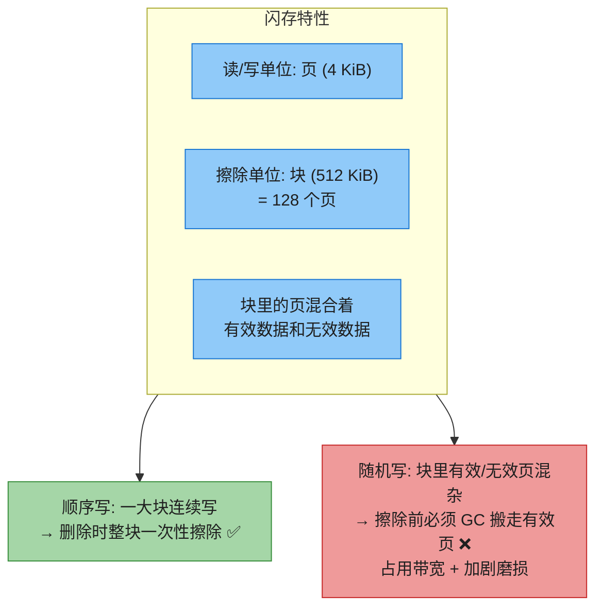

> 📝 **名词注释**:**SSD GC(垃圾回收)**——擦除块前,要把块里仍有效的页搬到别的块。随机写让块里有效/无效页混杂,GC 要做大量搬运;顺序写让一整块属于同一文件,删除时整块擦除无需 GC。所以**随机写既慢又磨损 SSD** [33][34][36]。

### 4.3 写放大(Write Amplification)

**一次应用层写,落到磁盘往往是多次 I/O**——这叫写放大。

| 引擎 | 写入路径 | 放大 |
|------|---------|------|
| **LSM** | WAL 一次 + memtable 落盘一次 + 每次 compaction 都重写 | 中(但可分离 key/value 降低 [37]) |
| **B-tree** | WAL 一次 + 页本身一次 + 即使改几字节也要写整页 | 每条数据**至少写两次** |

> 📝 **名词注释**:**写放大 (Write Amplification, WA)** = 总写入字节 ÷ 若只追加无索引的写入字节。写密集场景,瓶颈是磁盘写带宽,**WA 越高每秒能扛的写越少**;还会加快 SSD 磨损。**经验:LSM 的 WA 通常更低**(不写整页 + 压缩),这是它适合写密集的另一原因 [40]。

> 💡 **RUM Conjecture(读-更新-内存 假说)**[27]:一个访问方法只能同时优化 Read overhead、Update overhead、Memory 三个中的两个——LSM 优化了 update+memory(牺牲读),B-tree 优化了 read+memory(牺牲 update)。完美的"读/写/空间放大都低"不存在,**选型本质是选放大权衡**。

### 4.4 磁盘空间(空间放大)

- **B-tree 易碎片化**——大量删除后,文件中夹着很多空闲页,但它们在文件中间无法还给 OS。需要后台 vacuum 进程整理(PostgreSQL 的 vacuum [25])。
- **LSM 压缩好**——compaction 周期性重写、SSTable 无空页、块压缩充分,**磁盘占用通常比 B-tree 小**。但 size-tiered compaction 临时占空间多;被覆盖的旧值要等 compaction 才清掉。

> ⚠️ **删除的隐患**:GDPR 要"彻底删除"。LSM 里被删的记录可能还藏在高层 SSTable,直到 tombstone 传遍所有 compaction 层级才真消失,可能耗时很久 [42]。SSTable 的不可变性则利于**快照/备份**——记下当时有哪些文件即可,不用复制。

### 4.5 综合对比表

| 维度 | B-tree | LSM-tree |
|------|--------|----------|
| **写** | 随机写页,WA 高 | 顺序追加,**高吞吐** |
| **读(点查)** | **快且稳** | 稍慢(查多 SSTable) |
| **范围查询** | **快** | 较慢(并行扫多 segment) |
| **写放大** | 高(≥2x + 整页写) | 较低 |
| **空间** | 碎片化 | **紧凑**(压缩好) |
| **延迟稳定性** | 稳 | 可能尖峰(compaction/backpressure) |
| **删除彻底性** | 立即 | 慢(tombstone 传播) |
| **崩溃恢复** | 重放 WAL | 删未完成 SSTable + 重放 WAL |
| **适合** | 读密集、要求稳定低延迟 | 写密集、海量数据 |

#### 深入:三种放大(存储引擎选型的核心框架)

存储引擎的性能可归结为**三种放大 (amplification)**——一次逻辑操作实际要付出多少物理代价:

| 放大 | 定义 | B-tree | LSM |
|------|------|--------|-----|
| **读放大 (Read Amp)** | 读一次逻辑数据要几次磁盘 I/O | O(log n) 页读取,**3-4 次可预测** | 要查 memtable + 多个 SSTable,**可能很多次**(尤其读不存在的 key 要查遍;Bloom 缓解) |
| **写放大 (Write Amp)** | 写一次逻辑数据实际写多少字节 | WAL + 页 + 改几字节也写整页,**≥2x** | WAL + flush + 多次 compaction 重写(但顺序大块;可 key/value 分离降低) |
| **空间放大 (Space Amp)** | 逻辑数据占多少磁盘 | 碎片化,~1.5x | 旧值/墓碑未清 + size-tiered 临时空间 |

> 💡 **RUM Conjecture** 回顾:Read、Update(写)、Memory(空间)三种放大**此消彼长,无法同时最小**。B-tree 牺牲写放大换读+空间;LSM 牺牲读放大换写+空间。**所以选型 = 选你要牺牲哪一个**。这个框架比"LSM 写优 B-tree 读优"更精确——它告诉你三者是**三角权衡**,没有全胜方案。

---

## 5. 二级索引与值的存储

### 5.1 主键索引 vs 二级索引

- **主键索引**:唯一标识一行,其它记录靠它引用。
- **二级索引**(SQL 的 `CREATE INDEX`):按非主键列查找。和主键索引底层**用同样的结构(B-tree 或 LSM)**,区别只是二级索引的值**不一定唯一**——一个索引项可能对应多行。两种解法:① 值存成"匹配行 ID 的列表"(postings list);② 把行 ID 拼进 key 让每项唯一。

### 5.2 索引里存什么值?

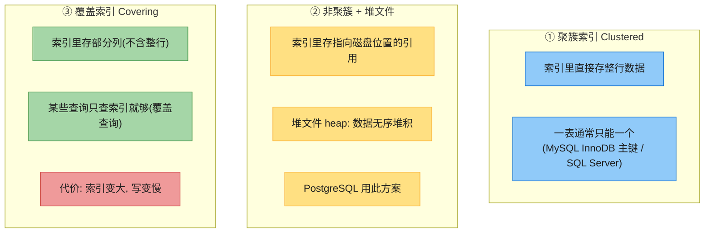

> 📝 **名词注释**:
> - **聚簇索引 (clustered index)**:索引结构里直接存**整行**数据,数据按索引键物理排序。一表通常只能一个。
> - **堆文件 (heap file)**:数据无序堆积的地方;索引指向这里的磁盘位置。**InnoDB 二级索引**指向主键,需二次查找;**PostgreSQL** 索引直接指向堆位置。
> - **覆盖索引 (covering index)**:索引里额外包含几个常被一起查的列,让查询**只查索引就够**,不用回表。
>
> **更新值的麻烦**:堆文件方案下,改值不改正文 key 时可原位覆盖(若新值不比旧值大);新值更大要搬家,所有索引都要更新指针或留转发指针。

---

## 6. 内存数据库 (In-Memory Databases)

磁盘笨重(要精心布局),但它**持久**(断电不丢)、**每 GB 便宜**。随着 RAM 变便宜,很多数据集其实能全放内存——催生了**内存数据库**。

> 📝 **名词注释**:**内存数据库**——数据常驻内存,磁盘只作为追加日志/快照做持久化(或靠副本)。**Memcached** 纯缓存(重启可丢);**Redis/Couchbase** 弱持久化(异步刷盘);**VoltDB、SingleStore、Oracle TimesTen、RAMCloud** 强持久化 [46][47][48]。

#### 深入:内存数据库为什么快?(反直觉)

**不是因为不用读盘**!磁盘数据库若内存够大,OS 也会把热点块缓存进内存,同样不必读盘。真正原因是——内存数据库**避免了"把内存结构编码成可写盘形式"的开销** [49]。磁盘数据库要操心页布局、序列化、崩溃恢复等,这些都有性能税。

另一个独特优势:**能提供磁盘索引做不到的数据模型**(Redis 的优先队列、集合等)。因为全在内存,实现简单。

---

## 7. 分析型存储 (Data Storage for Analytics)

数仓和 OLTP 库表面都是 SQL,但**内部截然不同**——为完全不同的查询模式优化。

### 7.1 OLTP vs OLAP 存储差异

| | OLTP | OLAP |
|---|------|------|
| 查询 | 按主键读写少量记录 | 扫海量行做聚合 |
| 写 | 随机、用户驱动 | 批量 ETL 导入 |
| 索引 | B-tree / LSM(点查+范围) | 列存 + 压缩 + 向量化 |
| 关注 | 低延迟、高并发 | 扫描吞吐、CPU 效率 |

### 7.2 云数仓 + 存算分离

**BigQuery、Redshift、Snowflake** 等云数仓,数据存对象存储、计算无状态弹性伸缩,**存算分离**(Ch1 §5.3)。

### 7.3 数据湖的解耦组件(2 版重点)

随着分析数据搬到对象存储上的数据湖,原本一体的系统**拆成了四个独立组件** [55]:

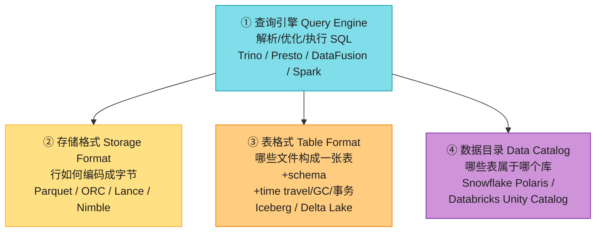

> 💡 **为什么要解耦?** 以前 Hive 把这些绑在一起;拆开后,**同一份数据(Parquet 文件)可被不同引擎(Trino/Spark)读**,catalog 也能被数据治理/发现工具访问——这就是开放数据湖架构的根基。

### 7.4 列式存储 (Column-Oriented)

事实表常有 100+ 列,但典型分析查询只用到 4~5 列(`SELECT *` 在分析里罕见)[52]。行存要把整行(100+ 字段)读进内存再过滤,太浪费。**列存把每一列的值存一起**:

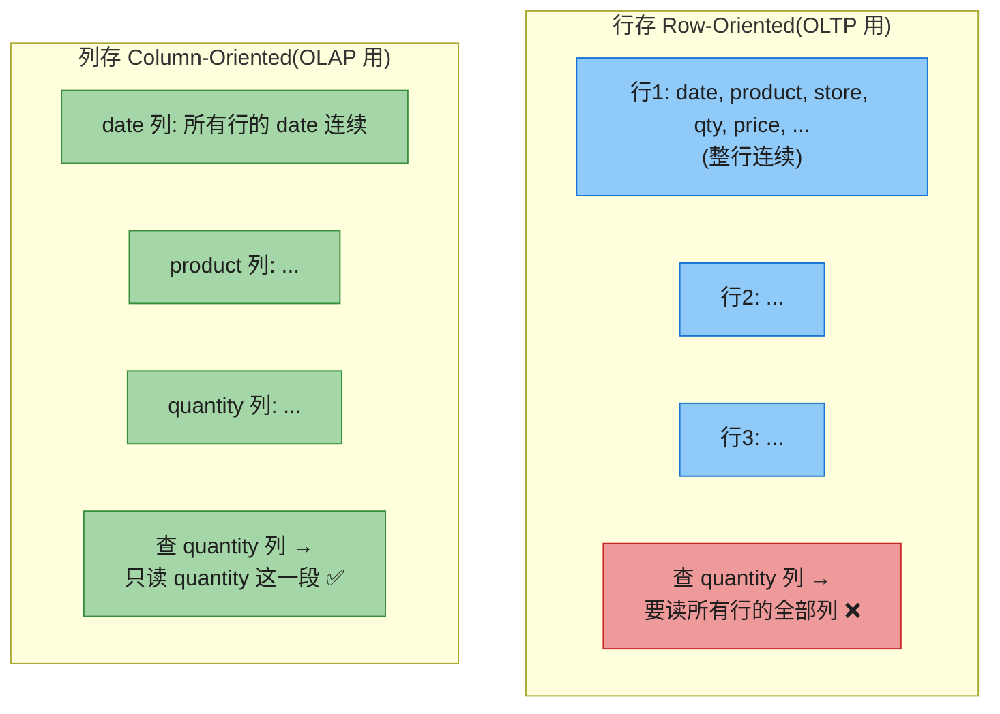

**重组一行**:第 23 行 = 从每列各取第 23 个值拼起来(所以**各列必须按相同行序存储**)。

实际中不把整列(万亿行)存一处,而是**切成几千~几百万行一块**,每块独立按列存;常按时间范围分块,查询只读相关日期的块。

> ⚠️ **别混淆**:列存 ≠ **wide-column(列族,column-family)**数据模型(Bigtable/HBase 那种"一行几千列")。列族模型其实**按行存**,只是允许每行列不同 [9]。

> 🏭 **列存几乎统治了分析**:**Snowflake**[61]、**BigQuery**、**DuckDB**[62]、**Pinot**[63]、**Druid**[64];存储格式 **Parquet / ORC / Lance / Nimble**;内存格式 **Apache Arrow**、Pandas/NumPy;时序库 **InfluxDB IOx / TimescaleDB**。

### 7.5 列压缩:位图编码 (Bitmap Encoding)

列存天然适合压缩(同列数据相似)。数仓最有效的是**位图编码**:

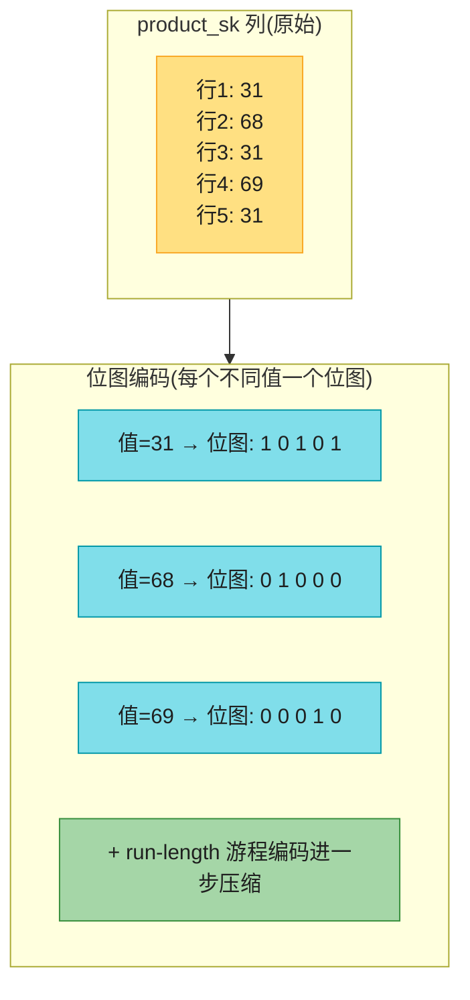

**原理**:某列有 `n` 个不同值 → 造 `n` 个位图,每行一位(是该值=1,否则=0)。位图通常很稀疏,再**游程编码(run-length)**压缩连续的 0/1。**roaring bitmaps** 在两种表示间自动切换取最紧凑的 [74]。

#### 深入:位图让查询飞起来

```sql
WHERE product_sk IN (31, 68, 69)        -- 加载 3 个位图, 按位 OR
WHERE product_sk = 30 AND store_sk = 3  -- 加载 2 个位图, 按位 AND
```

**为什么按位 AND/OR 这么快?** 因为各列**行序相同**,所以"product 位图第 k 位"和"store 位图第 k 位"指的是**同一行**——按位逻辑运算直接得到匹配行集。CPU 的位运算和 SIMD 极快,百万行瞬间过滤。位图甚至能解图查询(找"被 X 关注且关注 Y 的用户")[75]。

### 7.6 排序的列存

列存可不像行存那样天然有序,但可**主动按某列排序**作为索引。注意:**必须整行一起排序**(各列行序要一致),不能各列独立排。

- **第一排序键**(如 `date_key`)压缩效果最好——排完后该列是长串重复值,游程编码能压到几 KB(即使几十亿行)。
- 第二、第三排序键效果递减(更"杂乱")。
- 排序还能**裁剪扫描范围**(查上个月只扫上月块)。

### 7.7 写入列存

往排好序的列存中间插一行很贵(后面所有压缩列都要重写)。但**批量写**摊销了重写成本。常见 LSM 式做法:**写先进入内存的行存 → 攒够后批量合并进磁盘列存文件**(对象存储友好)。查询时合并内存近写 + 磁盘列存,对分析师透明(改完立即可查)。

### 7.8 查询执行:编译 vs 向量化

复杂分析 SQL 拆成查询计划(多个算子,可跨机并行)。扫百万行时,**不光磁盘 I/O,CPU 时间也是瓶颈**。逐行解释执行太慢,两大高效方案 [77]:

| 方案 | 做法 | 类比 |
|------|------|------|
| **查询编译 (Query Compilation)** | 把 SQL 生成代码 → 编译成机器码(LLVM JIT)→ 在内存列数据上跑 | JVM 的 JIT |
| **向量化 (Vectorized)** | 不编译,但用**预定义算子批量处理**一列的很多值(非逐行) | SIMD 批处理 |

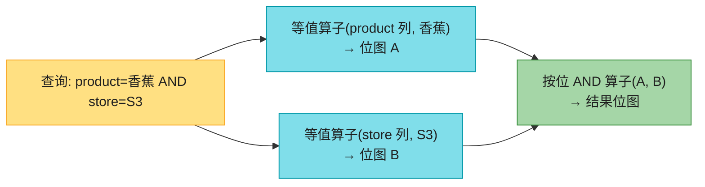

> 📝 **名词注释**:**向量化 (vectorized)** 这里指**一次处理一批值**(用 SIMD 单指令多数据),**不是** §8.3 语义搜索里的"向量"——同名不同义,别混 [72]。
>
> 两者实现迥异但都利用现代 CPU:顺序访问(减少 cache miss)、紧凑内循环(避免分支预测失败)、SIMD/多线程、**直接在压缩数据上算**(不解码)。

#### 深入:延迟物化(Late Materialization)

列存还有个和"向量化"并列的关键优化——**延迟物化** [73]。行存查询是"读整行 → 过滤";列存反过来:

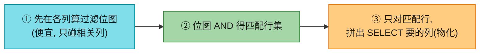

**为什么省?** 假设 WHERE 过滤掉 99% 的行。若**提前物化**(先拼完整行再过滤),99% 的拼接白做了;**延迟物化**只在最后对那 1% 匹配行才拼,且只拼 SELECT 真正要的列。配合向量化,这是 C-Store 论文让列存性能起飞的核心贡献 [56]。

### 7.9 物化视图与数据立方体

**物化视图 (materialized view)** 是把查询结果**真的写到磁盘**的副本(虚拟视图只是查询快捷方式)。底层数据变要更新视图(有的库自动维护,或用 **Materialize** 这类专门系统 [81])。**以写换读**,适合反复跑同样查询的场景。

**数据立方体 (data cube / OLAP cube)**:预计算常用聚合(COUNT/SUM/AVG)。比如按 (date, product) 两维网格,每格存该组合的 SUM(net_price);可沿任一维汇总(某产品不分日期的总销售)。多维(5 维超立方体)同理。**优点**:某些查询几乎已被预算好,瞬间出结果;**缺点**:不灵活(非维度条件查不了,如"价格 > $100 的占比")。所以数仓**尽量保留原始数据**,数据立方只作加速。

---

## 8. 多维索引与全文搜索

B-tree/LSM 只支持**单属性范围查询**。有时要同时按多个属性查。

### 8.1 多维索引

**拼接索引 (concatenated index)**:把多列拼成一个 key(如电话簿按 lastname, firstname 排)。能查"某姓"或"某姓+某名",但**查"某名"没用**(因为名字在排序中是次要的)。

**多维索引**能**同时**按多列查询。最典型是地理空间:

```sql
-- 查地图矩形区域内的餐厅: 二维范围查询
SELECT * FROM restaurants
WHERE latitude  > 51.4946 AND latitude  < 51.5079
  AND longitude > -0.1162 AND longitude < -0.1004;
```

拼接索引做不到(只能给"经度范围内任意纬度"或反之)。解法:① 用 **space-filling curve** 把二维位置转成一维数再用 B-tree [83];② 专用空间索引如 **R-tree、Bkd-tree**(把空间划分,让邻近点落在同一子树)[84]。**PostGIS** 用 PostgreSQL 的 GiST 机制实现 R-tree [85];也可用规则网格(三角形/方形/六边形,如 Uber 的 H3 [86])。

> 💡 多维索引不止地理:电商用 (R,G,B) 三维搜颜色范围;气象用 (date, temperature) 二维同时按时间和温度过滤。

### 8.2 全文搜索 (Full-Text Search)

全文搜索按"文中任意位置的关键词"搜文档 [88]。本质可看作**多维查询**——每个可能出现的词(term)是一个维度,文档含该词则该维=1。搜 "red apples" = 查 red 维=1 且 apples 维=1。

核心数据结构是**倒排索引 (inverted index)**:

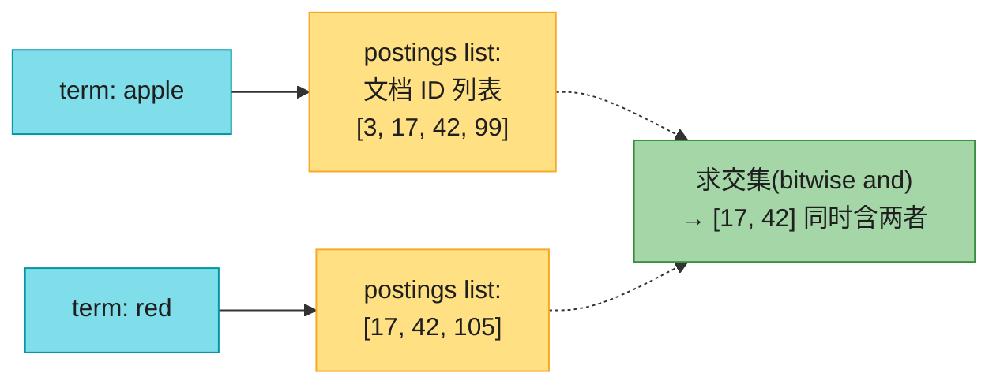

> 📝 **名词注释**:
> - **倒排索引 (inverted index)**:key=term(词),value=含该词的文档 ID 列表(postings list)。文档 ID 顺序时,postings list 可表示成稀疏位图(第 n 位=1 表示文档 n 含该词)[89]。
> - **postings list(倒排表)**:含某 term 的文档 ID 列表。求"同时含两词"=两个 postings list 求交(位图 AND)。

> 🏭 **Lucene**(Elasticsearch、Solr 的底层引擎)就这么干 [90]:term→postings 存在 SSTable 式排序文件里,后台 LSM 合并 [91]。**PostgreSQL 的 GIN 索引**也用 postings list 支持全文搜索和 JSON 内索引 [92][93]。

#### 深入:模糊匹配(错别字、子串)

- **n-gram / trigram**:把词切成所有长度 n 的子串(hello → hel, ell, llo),对 trigram 建倒排索引 → 能搜任意 ≥3 字符子串,甚至支持正则(代价:索引很大)[94]。
- **编辑距离**:错别字容错。Lucene 把 term 集存成**有限状态自动机(类 trie)**,转成 **Levenshtein 自动机**高效搜"编辑距离 ≤ k"的词 [95][97]。

### 8.3 向量嵌入与语义搜索(Vector Embeddings)★ 2 版新增

关键词匹配的局限:用户搜"如何注销账户",帮助页标题是"取消订阅"——意思一样但**词完全不同**,关键词匹配找不到。**语义搜索**要理解"意思"。

**思路**:用 **embedding model**(通常 LLM)把文档翻译成一个**浮点数向量**(vector embedding)——向量是多维空间里的一个点,**语义相近的文档,向量在空间里也相近**。

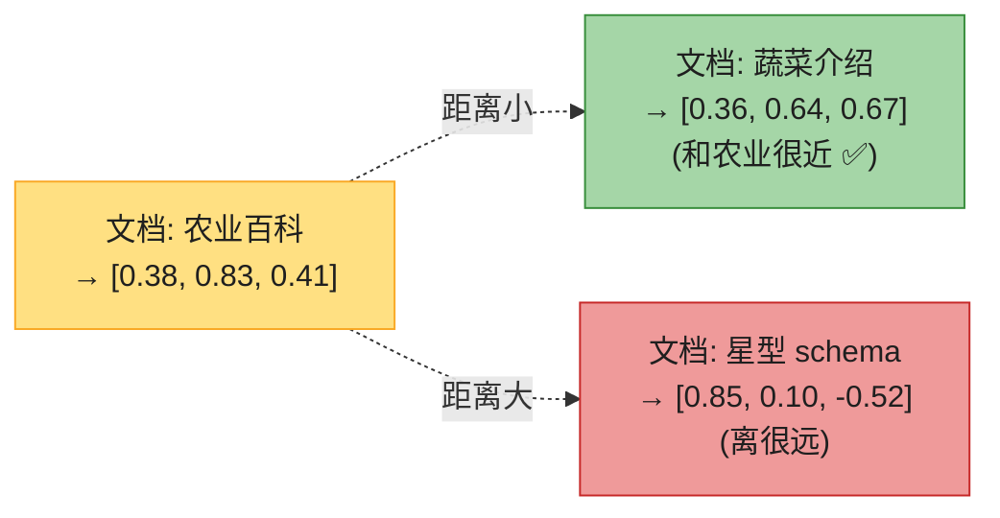

> 📝 **名词注释**:
> - **向量嵌入 (vector embedding)**:文档/图片/音频经模型映射出的**浮点数数组**(常 1000+ 维),代表多维空间里的位置。我们不关心单个数字含义,它只是"指向抽象空间某位置"的坐标。
> - **距离函数**:**余弦相似度**(两向量夹角余弦,衡量方向接近)或**欧氏距离**(直线距离)。语义搜索用它度量"相似度"。

#### 深入:三种距离/相似度怎么选?

| 度量 | 公式直觉 | 取值范围 | 适用场景 |
|------|---------|---------|---------|
| **余弦相似度 (cosine)** | 两向量**夹角**的余弦 | [-1, 1](越大越像) | **文本 embedding**——只看"话题方向",不管向量长短 |
| **点积 (dot product)** | 余弦 × 两向量模长积 | 任意 | 向量**已归一化**(模长=1)时,点积 = 余弦,**计算最快**(不算模长),ANN 库常默认此假设 |
| **欧氏距离 (Euclidean / L2)** | 两点**直线距离** | ≥0(越小越像) | **图像/空间/物理数据**——绝对位置有意义 |

> 💡 **怎么选?** 文本/语义搜索 → **余弦**(或归一化后用点积);图像/地理/原始数值 → **欧氏**。embedding 模型通常会说明它优化的是哪种距离——**用模型训练时用的同一种距离**效果最好。
> - **RAG(Retrieval-Augmented Generation,检索增强生成)**:把搜索结果塞进 LLM 上下文,让回答基于你的知识库——向量检索是 RAG 的核心。

**向量索引**:用户查询 → embedding 模型把查询转成向量 → 找库里最接近的文档向量。但高维空间里 R-tree 不好使,需专用向量索引:

| 索引 | 做法 | 特点 |
|------|------|------|
| **Flat(扁平)** | 原样存,查询时和每个向量算距离 | **精确**但慢 |
| **IVF(倒排文件)** | 向量空间聚类成若干分区(centroid),查询只搜最近几个分区(probes) | 近似、快;probes 越多越准越慢 |
| **HNSW(分层小世界图)** | 多层图,顶层稀疏底层密集;从顶层找最近节点,逐层下沉逼近 | 近似、主流,精度/速度平衡好 |

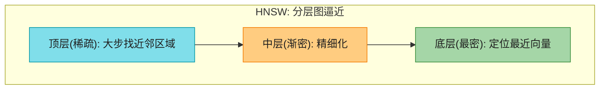

> 📝 **名词注释**:**ANN(Approximate Nearest Neighbor,近似最近邻)**——IVF/HNSW 都不保证找到真正的最近邻,只找"大概最近的",换速度。这是向量检索的根本权衡。
>
> 🏭 **真实产品**:Facebook 的 **Faiss** 库(IVF/HNSW 多变体)[101];**pgvector**(PostgreSQL 扩展,支持 IVF+HNSW)[102];**Pinecone、Milvus、Weaviate、Qdrant、LanceDB** 等专用向量库;Elasticsearch/OpenSearch 也加了向量检索。模型:**Word2Vec、BERT、GPT** 系列 [98][99][100],现多模态(文本+图片一套模型)。

---

## 🏭 生产级产品速查表

| 类别 | 产品 | 关键点 |
|------|------|--------|
| LSM 引擎 | RocksDB、Cassandra、HBase、ScyllaDB、Lucene | 高写吞吐;Lucene 的 term 索引也是 SSTable 式 |
| B-tree 引擎 | PostgreSQL、MySQL/InnoDB、SQLite | 读稳,关系库标配 |
| 嵌入式 | RocksDB、SQLite、LMDB、DuckDB、KùzuDB | 进程内库,无网络 |
| 内存库 | Redis、Memcached(纯缓存)、VoltDB、SingleStore | 避免编码开销,非不读盘 |
| 云数仓(列存) | Snowflake、BigQuery、Redshift | 存算分离 + 对象存储 |
| 单机分析(列存) | DuckDB、ClickHouse | 嵌入式 OLAP,单机也能扫海量 |
| Product Analytics | Pinot、Druid、ClickHouse | 实时列存 OLAP |
| 列存格式 | Parquet、ORC、Lance、Nimble、Arrow(内存) | 数据湖事实标准 |
| 表格式 | Iceberg、Delta Lake、Hudi | 不可变文件 + 元数据 = 可增删/事务/time travel |
| 数据目录 | Polaris、Unity Catalog、Iceberg catalog | 表元数据,治理/发现 |
| 全文搜索 | Elasticsearch、Solr(Lucene)、PostgreSQL GIN | 倒排索引 |
| 向量库 | Faiss、pgvector、Pinecone、Milvus、Qdrant、LanceDB | ANN 检索(IVF/HNSW) |
| 空间索引 | PostGIS(R-tree on GiST)、Uber H3 | 地理多维 |

---

## 💻 代码示例

### 示例 1:最简单的数据库(bash)

```bash
#!/bin/bash
db_set () { echo "$1,$2" >> database; }                            # 追加写,O(1)
db_get () { grep "^$1," database | sed "s/^$1,//" | tail -n 1; }   # 扫全文取最新,O(n)

db_set 42 '{"name":"SF","attractions":["Golden Gate"]}'
db_get 42   # → {"name":"SF",...}
# 写飞快(追加),读慢(全扫描) → 这就是为什么需要索引
```

### 示例 2:LSM 写入流程(Python 伪代码)

```python
class LSMStore:
    """LSM-tree 核心:memtable + WAL + SSTable + 后台 compaction"""
    def __init__(self):
        self.memtable = {}        # 实际用红黑树/跳表保有序
        self.wal = open('wal.log', 'a')
        self.sstables = []        # 磁盘上的 SSTable 列表(从新到旧)
        self.bloom = [BloomFilter() for _ in self.sstables]

    def put(self, key, value):
        self.wal.write(f"{key},{value}\n"); self.wal.flush()   # ① 先写 WAL
        self.memtable[key] = value                             # ② 再写 memtable
        if len(self.memtable) > MEMTABLE_THRESHOLD:
            self._flush_memtable()                             # ③ 满了落盘成 SSTable

    def delete(self, key):
        self.put(key, TOMBSTONE)          # 删除 = 写一个墓碑

    def get(self, key):
        if key in self.memtable:          # ① 先查 memtable
            return self.memtable[key]
        for sst, bloom in zip(self.sstables, self.bloom):
            if not bloom.might_contain(key):   # ② Bloom 说不在 → 跳过
                continue
            val = sst.get(key)                 # ③ 查 SSTable 稀疏索引+块
            if val is not None:
                return val if val != TOMBSTONE else None
        return None                       # 都没有 = key 不存在

    def _flush_memtable(self):
        new_sst = SSTable.dump_sorted(self.memtable)   # 有序写出
        self.sstables.insert(0, new_sst)
        self.bloom.insert(0, BloomFilter.from(new_sst))
        self.memtable = {}
        self.wal.truncate(0)               # 旧 WAL 可弃
        if len(self.sstables) >= 4:
            self._compact()                # 后台合并

    def _compact(self):
        # 归并排序式合并多个 SSTable, 保留最新值, 清墓碑
        ...
```

### 示例 3:列存位图查询(Python 示意)

```python
# product_sk 列的位图编码(每行一位)
bitmap_31 = [1,0,1,0,1]   # 行1,3,5 是产品31
bitmap_68 = [0,1,0,0,0]   # 行2 是产品68
bitmap_69 = [0,0,0,1,0]   # 行4 是产品69

# WHERE product_sk IN (31, 68, 69):三个位图按位 OR
def bit_or(a, b): return [x | y for x, y in zip(a, b)]
in_list = bit_or(bit_or(bitmap_31, bitmap_68), bitmap_69)
# → [1,1,1,1,1]  全部行命中

# WHERE product_sk=31 AND store_sk=3:两个列的位图按位 AND
bitmap_store3 = [1,0,0,1,0]   # store 列: 行1,4 是门店3
def bit_and(a, b): return [x & y for x, y in zip(a, b)]
result = bit_and(bitmap_31, bitmap_store3)
# → [1,0,0,0,0]  只有行1同时满足  (CPU/SIMD 实际一次处理 64/256 位, 极快)
```

---

## 🎯 系统设计面试题

### 面试题 1:为某工作负载选存储引擎 ★重点

**题目**:你在做时序监控指标存储,写入模式是每秒百万级数据点(按 timestamp 追加),读取主要是"查某指标最近 1 小时的 p99"或"按时间范围扫描"。选 B-tree 还是 LSM?

**分析**:
- **写**:海量追加、几乎不更新 → **LSM 的顺序追加完胜 B-tree 的随机写页**。
- **范围读**:按时间范围扫描 → LSM 的 SSTable 本身排序,范围扫描也能高效(虽然要并行多 segment)。
- **结论**:**LSM**(InfluxDB IOx、TimescaleDB + 列存都是这思路)。
- **进一步**:指标分析是聚合扫描 → 配**列存 + 压缩**,CPU 也省。
- **坑**:memtable 满 + compaction 跟不上 → 延迟尖峰 → 需 backpressure;监控指标写多但很少删 → tombstone 问题小。

**追问**:如果改成"用户档案,按 user_id 点查为主、几乎不写"?→ **B-tree**(点查快且稳)。

---

### 面试题 2:设计电商商品全文搜索

**题目**:电商要支持"红色跑步鞋"这类搜索,能处理错别字、同义词,还要按销量/评分排序。

**架构**:


**要点**:
- 用 **Elasticsearch**(底层 Lucene 倒排索引);错别字用 **Levenshtein 编辑距离**;同义词用词典扩展。
- 排序用 **BM25/TF-IDF** 算相关性,再叠加业务字段(销量、评分、是否促销)。
- 商品变更 → 通过 CDC/消息把更新推到 ES 重建索引(ES 是**派生数据**)。
- **进阶**:加向量字段(商品描述 embedding)做语义搜索,关键词 + 向量混合检索。

---

### 面试题 3:设计 RAG 知识库检索

**题目**:公司有 10 万篇内部文档,要做"问机器人公司政策"功能,答案要基于文档(LLM 不能瞎编)。

**架构**:

```mermaid
flowchart LR
    INGEST["离线: 文档切块(chunk)"]
    EMB1["embedding 模型<br/>→ 每块一个向量"]
    VDB["向量库<br/>(HNSW 索引)"]

    Q["用户问: 年假怎么请?"]
    EMB2["query → embedding"]
    SEARCH["向量检索 top-K 最相似块"]
    LLM["LLM(把检索到的块塞进 prompt)"]
    ANS["基于文档的回答"]

    INGEST --> EMB1 --> VDB
    Q --> EMB2 --> SEARCH --> LLM --> ANS
    VDB -.-> SEARCH

    style INGEST fill:#FFE082,stroke:#F9A825,color:#1f1f1f
    style EMB1 fill:#80DEEA,stroke:#0097A7,color:#1f1f1f
    style VDB fill:#FFCC80,stroke:#F57C00,color:#1f1f1f
    style Q fill:#FFE082,stroke:#F9A825,color:#1f1f1f
    style EMB2 fill:#80DEEA,stroke:#0097A7,color:#1f1f1f
    style SEARCH fill:#A5D6A7,stroke:#388E3C,color:#1f1f1f
    style LLM fill:#CE93D8,stroke:#7B1FA2,color:#1f1f1f
    style ANS fill:#A5D6A7,stroke:#388E3C,color:#1f1f1f
```

**要点**:
- 文档**切块**(chunk,几百字一块)再 embedding,粒度合适。
- 向量库选 **pgvector**(数据已在 PostgreSQL)或 **Milvus/Qdrant**(专用、规模大),索引用 **HNSW**。
- 检索 top-K(如 5~10)个最相似块,拼进 LLM prompt → 回答有依据。
- **混合检索**:向量(语义)+ BM25(精确关键词)双路召回,效果更好。
- 文档更新 → 重新 embedding 入库;删除要清向量。

---

## 📚 精选文献(只留真正值得读的)

第四章引用上百条,多数是存储/压缩算法细节。这 7 篇值得:

| # | 文献 | 为什么值得读 |
|---|------|------------|
| [9] | Chang et al. *"Bigtable"* OSDI 2006 | **SSTable + memtable 的起源**。LSM 派系(RocksDB/Cassandra/HBase)的鼻祖,理解列族模型。 |
| [10] | O'Neil et al. *"The Log-Structured Merge-tree"* Acta Informatica 1996 | **LSM-tree 原始论文**。理解写优化的理论根基,之后所有 LSM 工程实现都基于它。 |
| [21] | Bayer & McCreight *"Organization and Maintenance of Large Ordered Indices"* 1970 | **B-tree 的诞生论文**。半个世纪仍统治关系库索引,值得看原初思想。 |
| [56] | Stonebraker et al. *"C-Store: A Column-Oriented DBMS"* VLDB 2005 | **列存数据库的奠基**。理解为什么分析该用列存,Vertica 的前身。 |
| [58] | Melnik et al. *"Dremel: Interactive Analysis of Web-Scale Datasets"* VLDB 2010 | **嵌套数据列存(Dremel)→ Parquet 的基础**。BigQuery 的核心,理解 Parquet 的 shredding/striping。 |
| [73] | Abadi et al. *"The Design and Implementation of Modern Column-Oriented DBMS"* Foundations and Trends in Databases 2013 | **列存系统设计的集大成综述**。压缩、向量化、延迟物化全讲透,做 OLAP 必读。 |
| [104] | Malkov & Yashunin *"HNSW: Efficient and Robust ANN Search"* IEEE TPAMI 2020 | **HNSW 算法原论文**。当今向量检索的主流算法,Faiss/Milvus/pgvector 都用它。 |

> 想深入 B-tree 细节:读 Graefe *"Modern B-Tree Techniques"* [2];想搞懂数据湖:读 **Delta Lake 论文** [12] 和 Apache Iceberg 规范。

---

## 📝 本章要点总结

```mermaid
flowchart LR
    ROOT(["Ch4 存储与检索<br/>数据库 = filing system"])

    B1["LSM-tree(写优)<br/>────────<br/>• memtable+WAL+SSTable+compaction<br/>• 只追加不修改, 顺序写<br/>• Bloom filter 滤不存在的 key<br/>• compaction: size-tiered vs leveled<br/>• 代表: RocksDB/Cassandra/Lucene"]
    B2["B-tree(读优)<br/>────────<br/>• 固定页原地覆盖写<br/>• 3-4 层即可存 250TB, 读稳<br/>• 页分裂保持平衡<br/>• WAL 防崩溃, 变体 copy-on-write<br/>• 代表: PostgreSQL/MySQL/SQLite"]
    B3["两者对比<br/>────────<br/>• 写吞吐: LSM > B-tree(顺序 vs 随机)<br/>• 读稳定: B-tree > LSM<br/>• 写放大都存在(LSM 通常更低)<br/>• RUM 假说: 读/写/空间三选二"]
    B4["列存(OLAP)<br/>────────<br/>• 按列存, 只读需要的列<br/>• 位图编码+游程压缩+roaring<br/>• 排序的列存: 首键压缩最好<br/>• 查询: JIT 编译 vs 向量化(SIMD)<br/>• 数据湖: 查询/存储格式/表格式/目录 解耦"]
    B5["内存/索引/搜索<br/>────────<br/>• 内存库快在不编码, 非不读盘<br/>• 聚簇/堆/覆盖索引<br/>• 倒排索引(postings)→ 全文搜索<br/>• 向量嵌入+ANN(IVF/HNSW)→ 语义搜索/RAG"]

    ROOT --> B1
    ROOT --> B2
    ROOT --> B3
    ROOT --> B4
    ROOT --> B5

    style ROOT fill:#FFE082,stroke:#F57C00,color:#1f1f1f,stroke-width:3px
    style B1 fill:#CE93D8,stroke:#7B1FA2,color:#1f1f1f
    style B2 fill:#90CAF9,stroke:#1976D2,color:#1f1f1f
    style B3 fill:#80DEEA,stroke:#0097A7,color:#1f1f1f
    style B4 fill:#A5D6A7,stroke:#388E3C,color:#1f1f1f
    style B5 fill:#FFCC80,stroke:#F57C00,color:#1f1f1f
```

**核心 Takeaways**:

1. **索引是空间换时间**——加快读但拖慢写,选对索引是存储调优的核心。
2. **LSM(追加+合并)写优,B-tree(原地改页)读优**——这是 OLTP 存储两大流派的根本分野。
3. **SSTable 不可变**是 LSM 的灵魂——崩溃恢复简单、利于快照、还能存对象存储(云原生根基)。
4. **Bloom filter** 用假阳性换速度——"不在"一定准,"在"可能假,在 LSM 场景无害。
5. **写放大**是写密集系统的隐形杀手——LSM 通常更低,但 SSD GC 让随机写在任何引擎都吃亏。
6. **RUM 假说**:读、写、空间三种放大只能优化两个——选型本质是选放大权衡。
7. **内存库快在不编码,不是不读盘**——磁盘库内存够大也不读盘,但省了编码开销。
8. **列存 + 位图压缩 + 向量化**是 OLAP 的三件套——少读数据、少占 CPU、SIMD 飞快。
9. **数据湖正在解耦**——查询引擎 / 存储格式(Parquet) / 表格式(Iceberg) / 数据目录,各自独立演进。
10. **向量检索(ANN)是 RAG/语义搜索的基石**——IVF/HNSW 用近似换速度,与全文搜索互补。
