# 第4章：存储与检索 (Storage and Retrieval)

> *"One of the miseries of life is that everybody names things a little bit wrong. [...] A computer does not primarily compute in the sense of doing arithmetic. They primarily are filing systems."*
> — Richard Feynman, *Idiosyncratic Thinking* seminar (1985)

---

## 📚 核心论文与参考文献

### 必读论文

| # | 论文/资料 | 作者 | 核心内容 | 链接 |
|---|---------|------|--------|------|
| [2] | "Modern B-Tree Techniques" | Goetz Graefe | B-Tree 技术综述（权威） | [doi:10.1561/1900000028](https://doi.org/10.1561/1900000028) |
| [9] | "Bigtable: A Distributed Storage System for Structured Data" | Chang et al. (Google) | 引入 SSTable 和 memtable 概念 | [OSDI 2006](https://www.usenix.org/conference/osdi06/bigtable-distributed-storage-system-structured-data) |
| [10] | "The Log-Structured Merge-Tree (LSM-Tree)" | O'Neil et al. | LSM-Tree 原始论文（1996） | [doi:10.1007/s002360050048](https://doi.org/10.1007/s002360050048) |
| [12] | "Delta Lake: High-Performance ACID Table Storage over Cloud Object Stores" | Armbrust et al. (Databricks) | Delta Lake 表格式设计 | [doi:10.14778/3415478.3415560](https://doi.org/10.14778/3415478.3415560) |
| [13] | "Space/Time Trade-offs in Hash Coding with Allowable Errors" | Burton Bloom | Bloom Filter 原始论文（1970） | [doi:10.1145/362686.362692](https://doi.org/10.1145/362686.362692) |
| [16] | "LSM-Based Storage Techniques: A Survey" | Chen Luo & Michael Carey | LSM 存储技术综述（2019） | [doi:10.1007/s00778-019-00555-y](https://doi.org/10.1007/s00778-019-00555-y) |
| [21] | "Organization and Maintenance of Large Ordered Indices" | Bayer & McCreight | B-Tree 原始论文（1970） | [doi:10.1145/1734663.1734671](https://doi.org/10.1145/1734663.1734671) |
| [24] | "ARIES/IM: An Efficient and High Concurrency Index Management Method Using Write-Ahead Logging" | C. Mohan & Frank Levine | WAL 索引管理（经典） | [doi:10.1145/130283.130338](https://doi.org/10.1145/130283.130338) |
| [56] | "C-Store: A Column-Oriented DBMS" | Stonebraker et al. | 列式存储开创性论文 | [VLDB 2005](http://vldb.org/conf/2005/) |
| [58] | "Dremel: Interactive Analysis of Web-Scale Datasets" | Melnik et al. (Google) | Google Dremel（Parquet 基础） | [doi:10.14778/1920841.1920886](https://doi.org/10.14778/1920841.1920886) |
| [61] | "The Snowflake Elastic Data Warehouse" | Dageville et al. | Snowflake 架构设计 | [doi:10.1145/2882903.2903741](https://doi.org/10.1145/2882903.2903741) |
| [73] | "The Design and Implementation of Modern Column-Oriented Database Systems" | Abadi et al. | 现代列式数据库设计综述 | [doi:10.1561/1900000024](https://doi.org/10.1561/1900000024) |
| [77] | "Everything You Always Wanted to Know About Compiled and Vectorized Queries But Were Afraid to Ask" | Kersten et al. | 编译执行 vs 向量化执行对比 | [doi:10.14778/3275366.3284966](https://doi.org/10.14778/3275366.3284966) |
| [98] | "Efficient Estimation of Word Representations in Vector Space" | Mikolov et al. (Google) | Word2Vec 论文 | [arXiv:1301.3781](https://arxiv.org/abs/1301.3781) |
| [103] | "Revisiting the Inverted Indices for Billion-Scale Approximate Nearest Neighbors" | Baranchuk et al. | IVF 向量索引 | [ECCV 2018](https://doi.org/10.1007/978-3-030-01258-8_13) |
| [104] | "Efficient and Robust Approximate Nearest Neighbor Search Using HNSW Graphs" | Malkov & Yashunin | HNSW 向量索引算法 | [doi:10.1109/TPAMI.2018.2889473](https://doi.org/10.1109/TPAMI.2018.2889473) |

### 推荐书籍

| 书名 | 作者 | 说明 |
|------|------|------|
| *Introduction to Algorithms* (3rd) [5] | Cormen et al. (CLRS) | 算法导论（B-Tree、红黑树、哈希表） |
| *Introduction to Information Retrieval* [88] | Manning et al. | 信息检索入门（倒排索引、全文搜索） |
| *Python for Data Analysis* (3rd) [70] | Wes McKinney | Pandas/DataFrame 实践 |

### 中文资源

- LSM-Tree 原理详解：搜索「LSM-Tree 原理 详解」
- B-Tree / B+Tree 可视化：[B-Tree Visualization](https://www.cs.usfca.edu/~galles/visualization/BTree.html)
- Bloom Filter 原理：搜索「布隆过滤器 原理 实现」
- RocksDB 中文文档：搜索「RocksDB Wiki 中文」
- 列式存储入门：搜索「列式存储 Parquet 原理」
- 向量数据库入门：搜索「向量数据库 HNSW Faiss 入门」

---

## 🗺️ 章节概览

本章是全书最核心的技术章节之一，从最简单的两行 bash 脚本构建的"数据库"出发，逐步推导出现代存储引擎的核心数据结构，涵盖 OLTP（B-Tree / LSM-Tree）和 OLAP（列式存储）两大体系，并拓展到全文搜索和向量嵌入。

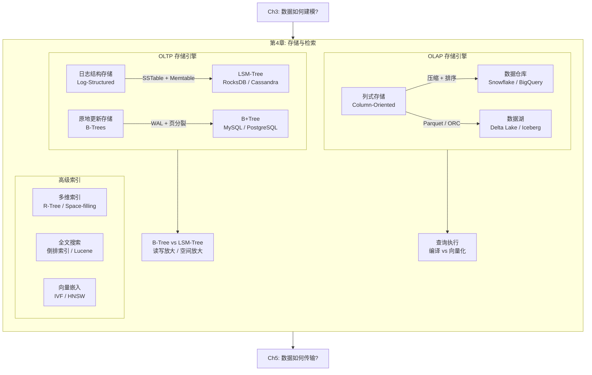

### 本章结构一览

| 小节 | 主题 | 关键概念 |
|------|------|---------|
| 4.1 | Log-Structured Storage | Hash Index, SSTable, 稀疏索引 |
| 4.2 | LSM-Trees | Memtable, Compaction, Bloom Filter |
| 4.3 | B-Trees | 页、分裂、WAL、B+Tree 变体 |
| 4.4 | B-Tree vs LSM-Tree 对比 | 读/写放大、顺序/随机写、磁盘空间 |
| 4.5 | 索引中的值存储 | 聚簇索引、堆文件、覆盖索引 |
| 4.6 | 内存数据库 | Redis、VoltDB、RAMCloud |
| 4.7 | 分析型数据存储 | 云数据仓库、存算分离、数据湖 |
| 4.8 | 列式存储与查询执行 | 位图编码、排序、编译/向量化 |
| 4.9 | 多维索引与全文搜索 | R-Tree、倒排索引、n-gram |
| 4.10 | 向量嵌入 | 语义搜索、IVF、HNSW |
## 4.1 从零开始：日志结构存储 (Log-Structured Storage)

### 世界上最简单的数据库

书中用两个 bash 函数构建了"世界上最简单的数据库"：

```bash
#!/bin/bash

db_set () {
    echo "$1,$2" >> database
}

db_get () {
    grep "^$1," database | sed -e "s/^$1,//" | tail -n 1
}
```

**工作原理：**
- `db_set key value`：将键值对追加到文件末尾
- `db_get key`：扫描整个文件，找到 key 的最后一次出现

**性能特征：**

| 操作 | 复杂度 | 原因 |
|------|--------|------|
| 写入 | **O(1)** | 追加写非常高效 |
| 读取 | **O(n)** | 必须扫描整个文件 |
| 范围查询 | **O(n)** | 无排序，无法跳过 |

> **关键洞察**: 追加写（append-only）是最简单、最高效的写入方式。很多数据库内部都使用 log（追加只写的记录序列），这是一个反复出现的基本原语。

⚠️ 注意：这里的 *log* 不是应用日志（application log），而是更通用的概念——**磁盘上追加写的记录序列**，可以是二进制的，只供数据库内部使用。

### Hash Index：用内存哈希表加速读取

第一个优化思路：在内存中维护一个哈希表，key → 文件中的字节偏移量。

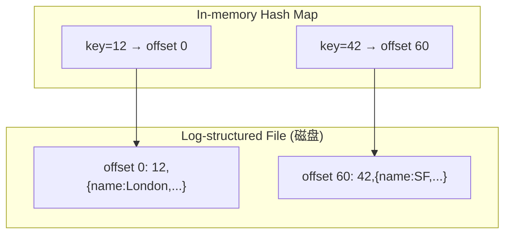

**这就是 Bitcask**（Riak 的默认存储引擎）的核心思想。

**优点：**
- 写入极快（追加 + 更新哈希表）
- 读取也快（一次哈希查找 + 一次磁盘 seek）
- 如果数据已在文件系统缓存中，读取甚至不需要磁盘 I/O

**局限：**
1. **磁盘空间无限增长**：旧值不会被覆盖
2. **哈希表必须全部放内存**：磁盘上的哈希表性能很差（随机 I/O、扩容代价高、哈希冲突处理复杂）
3. **不支持范围查询**：无法高效扫描 key 从 10000 到 19999 的记录
4. **重启后需要重建哈希表**：扫描整个文件，速度慢

### SSTable：排序的字符串表

> SSTable = **Sorted Strings Table**

核心改进：在日志文件的基础上，要求 **key-value 对按 key 排序**，且每个 key 只出现一次。


**相比哈希索引的三大优势：**

#### 优势1：高效合并（类似归并排序）

多个 SSTable 文件可以像归并排序一样合并：并行读取各文件，取最小 key 写入输出，遇到重复 key 取最新值。

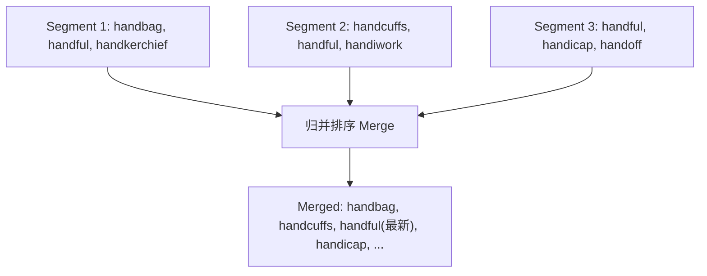

#### 优势2：稀疏索引（不需要索引所有 key）

不需要在内存中保存每个 key 的偏移量——只需保存部分 key（稀疏索引），然后利用排序进行区间定位：

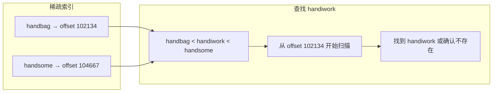

每个 block 通常几 KB，扫描非常快。

#### 优势3：块压缩

每个 block 可以在写入磁盘前压缩（如图 4-2 中的阴影区域），节省磁盘空间和 I/O 带宽。
## 4.2 LSM-Trees：日志结构合并树

### 构建和合并 SSTable

SSTable 读性能好但写困难——不能简单追加（会破坏排序）。解决方案是 **log-structured** 方法：在追加日志和排序文件之间取得混合。

**LSM-Tree 写入流程（4 步）：**

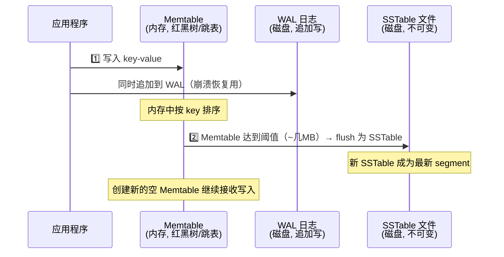

**LSM-Tree 读取流程：**

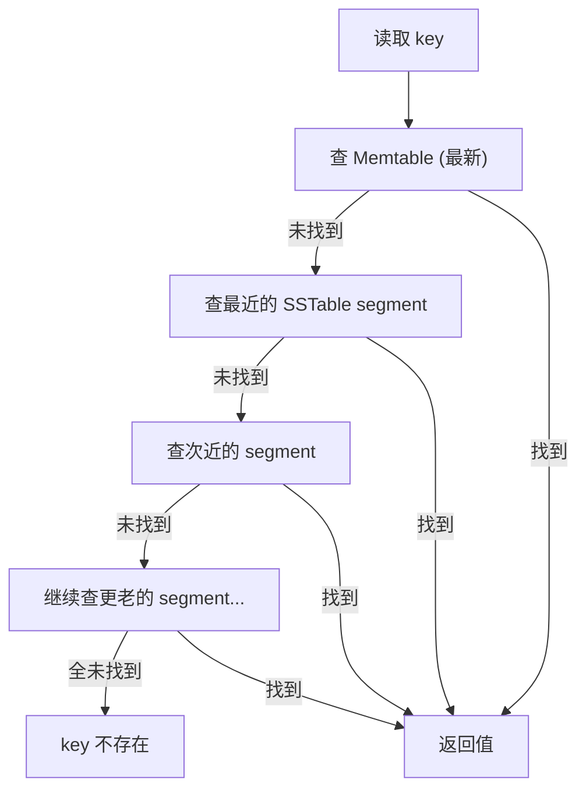

**后台合并与压缩（Compaction）：**

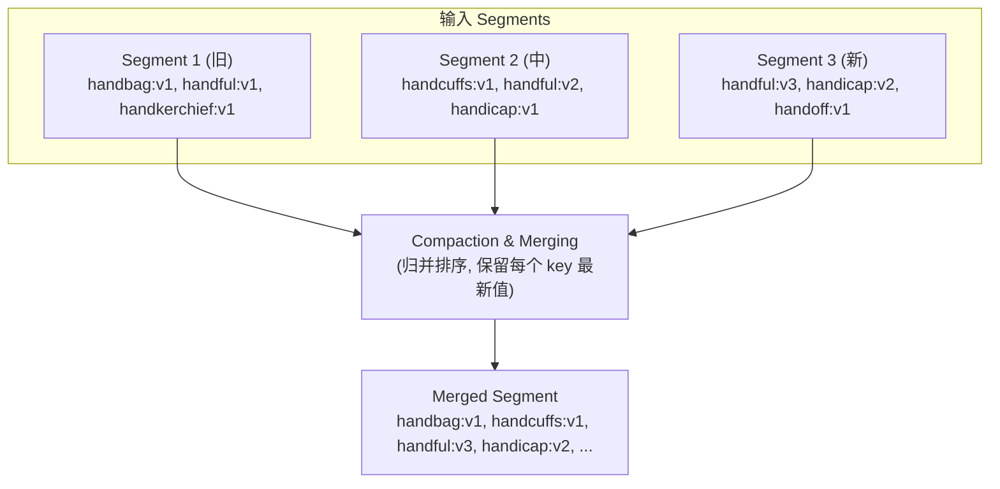

**删除操作**：写入一个特殊的 **tombstone（墓碑）** 标记。合并时遇到墓碑，丢弃该 key 的所有旧值。

**崩溃恢复**：
- SSTable 文件是不可变的 → 崩溃时直接删除未完成的 SSTable 即可
- Memtable 数据通过 WAL 恢复
- WAL 可能含有不完整记录 → 通过 checksum 检测并丢弃

> **这就是 RocksDB [7]、Cassandra、ScyllaDB、HBase [8] 的核心算法**，它们都受 Google Bigtable 论文 [9]（引入了 SSTable 和 memtable 概念）的启发。该算法最早由 O'Neil 等人在 1996 年以 **Log-Structured Merge-Tree (LSM-Tree)** [10] 的名字发表。

### Bloom Filter：加速不存在 key 的查询

**问题**: 读取一个不存在的 key 很慢——需要检查 memtable + 所有 SSTable segments。

**解决方案**: 每个 SSTable 关联一个 **Bloom Filter** [13]——一种快速判断 key "可能存在"或"一定不存在"的概率数据结构。

```
Bloom Filter 原理（以 16 bits 为例）：

存入 "handbag":  Hash("handbag") = {2, 9, 4}
                 → 将 bit 2, 9, 4 设为 1

存入 "handoff":  Hash("handoff") = {9, 15, 5}
                 → 将 bit 9, 15, 5 设为 1

Bloom filter: [0,0,1,0,1,1,0,0,0,1,0,0,0,0,0,1]
               0 1 2 3 4 5 6 7 8 9 ...       15

查询 "handheld": Hash("handheld") = {6, 11, 2}
                 → bit 6 = 0 → 一定不存在！✓（跳过这个 SSTable）

查询 "handbag":  Hash("handbag") = {2, 9, 4}
                 → 全是 1 → 可能存在（需实际查找确认）
```

**False Positive（假阳性）：** Bloom Filter 可能误报"存在"（因为 bit 被其他 key 碰巧设为 1），但永远不会误报"不存在"。

**经验法则：**
- 每个 key 分配 10 bits → 假阳性率 ~1%
- 每多 5 bits → 假阳性率降低 10 倍

在 LSM 引擎中：
- Bloom Filter 说 **不存在** → 安全跳过该 SSTable ✓
- Bloom Filter 说 **存在** → 需查找确认（假阳性只是多做一点无用功，无害）

### Compaction 策略

LSM 存储引擎需要决定何时触发 compaction、合并哪些 SSTable。两种主流策略：

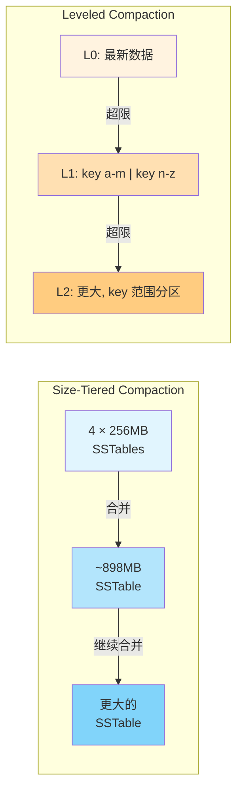

| 特性 | Size-Tiered | Leveled |
|------|-------------|---------|
| **原理** | 新+小 SSTable 逐步合并为大的 | 固定大小，按层级(L0→L1→L2)组织 |
| **写吞吐** | ✅ 更高（大块顺序合并，数据重写次数少） | 较低（更频繁的增量合并） |
| **读性能** | 较差（可能需检查多个 SSTable） | ✅ 更好（每层 key 不重叠，检查更少） |
| **磁盘空间** | 合并时需大量临时空间 | 更省空间 |
| **适用场景** | 写多读少 | 读多写少，key 频繁更新 |

> **经验法则**: 写多 → Size-Tiered；读多 → Leveled。大多数 LSM 实现（如 RocksDB）支持多种策略可配置。
## 4.3 B-Trees：原地更新的树形索引

### B-Tree 基本概念

B-Tree 是最广泛使用的索引结构，1970 年由 Bayer & McCreight [21] 提出，至今仍是几乎所有关系数据库和很多非关系数据库的标准索引实现。

**与 LSM-Tree 的根本区别：**

| | LSM-Tree | B-Tree |
|--|---------|--------|
| 存储单元 | 可变大小的 **segments**（几 MB） | 固定大小的 **pages**（4-16 KiB） |
| 写入方式 | **追加写**，文件不可变 | **原地更新**，覆盖磁盘上的页 |
| 写后可变性 | 不可变（immutable） | 可变（mutable） |

### B-Tree 结构

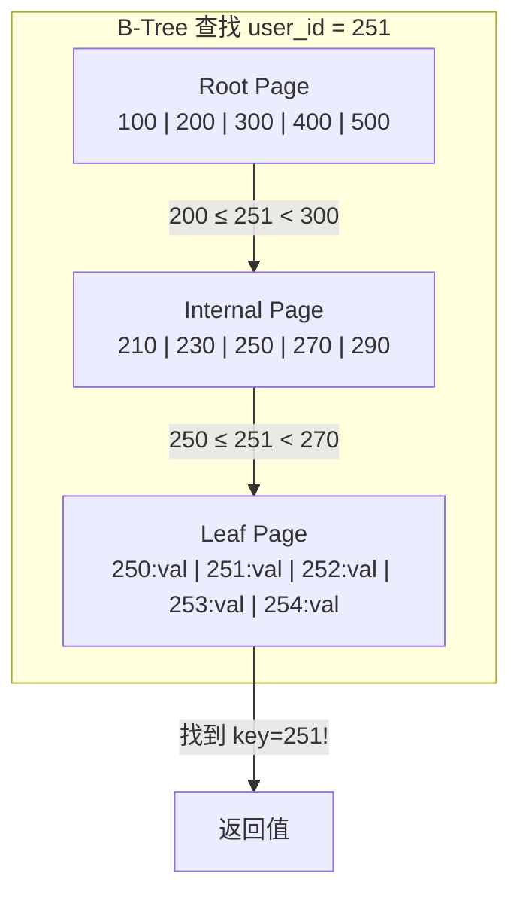

**核心概念：**

- **页（Page）**：B-Tree 的基本单位，对应磁盘上的固定大小块。PostgreSQL 默认 8 KiB，MySQL 默认 16 KiB
- **根页（Root）**：查找的起点
- **内部节点（Internal）**：包含 key 和指向子页的引用（page number）
- **叶子页（Leaf）**：包含 key 和实际的值（或指向值的引用）
- **分支因子（Branching Factor）**：每页的子引用数量，通常几百个

**容量计算**：一棵 4 层深、分支因子 500、页大小 4 KiB 的 B-Tree 可以存储 **250 TB** 的数据！

| Level | Pages | 说明 |
|-------|-------|------|
| Level 0 (root) | 1 | 根页 |
| Level 1 | 500 | 分支因子 500 |
| Level 2 | 250,000 | 500^2 |
| Level 3 (leaf) | 125,000,000 | 500^3, × 4 KiB ≈ 500 GB 索引 → 可存储 **250 TB** 数据 |

### 页分裂（Page Splitting）

当一个叶子页满了，需要插入新 key 时：

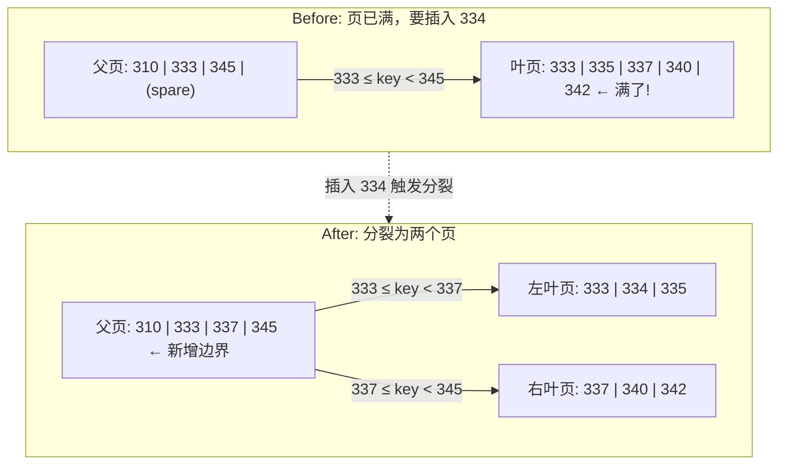

**分裂可能级联**：如果父页也没空间容纳新引用，父页也要分裂，一直级联到根。如果根被分裂，就产生新根，树增高一层。

这保证了 B-Tree 始终 **平衡（balanced）**：n 个 key 的 B-Tree 深度始终为 O(log n)。

### 使 B-Tree 可靠：WAL

**核心问题**：B-Tree 的写操作是原地覆盖（overwrite in place）。如果在页分裂时崩溃（写了部分页），可能产生：
- **孤儿页（Orphan Page）**：没有父节点指向的页
- **撕裂页（Torn Page）**：只写了一半的页

**解决方案：Write-Ahead Log (WAL)**，又称 **redo log** 或 **journaling**：

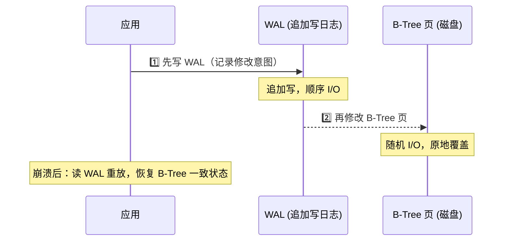

**性能优化**：B-Tree 实现通常不会立即将每个修改的页刷盘，而是先缓冲在内存中（buffer pool）。只要 WAL 已持久化（写入 WAL + fsync），数据就是安全的，B-Tree 页可以稍后批量刷盘。

### B-Tree 变体

B-Tree 经过 50+ 年发展，有许多变体：

| 变体 | 描述 | 典型应用 |
|------|------|---------|
| **Copy-on-Write** | 不覆盖旧页，写入新位置，更新父页指针。对并发控制和快照有利 | LMDB, Btrfs |
| **Key 缩写** | 内部节点只存 key 的缩写（仅需区分范围边界），增大分支因子 | 大多数实现 |
| **顺序叶子布局** | 尝试让叶子页在磁盘上顺序排列，减少 seek（难以随树增长维持） | 部分优化实现 |
| **兄弟指针** | 叶子页增加左右兄弟指针，支持按顺序扫描 key 而无需回溯父节点 | B+Tree（广泛使用） |

> 本书中提到的 "B-tree" 实际上通常指 **B+Tree**——叶子节点之间有顺序链接的变体，这是绝大多数数据库的实际实现。
## 4.4 B-Tree vs LSM-Tree：全方位对比

这是本章最重要的对比之一——理解两种引擎的权衡，对选型和调优至关重要。

> **经验法则**: LSM-Tree 更适合写密集场景，B-Tree 更适合读密集场景。但 benchmark 对细节高度敏感，必须用你自己的实际负载测试。而且两者并非严格二选一——有些引擎混合了两种思想。

### 读性能

| 方面 | B-Tree | LSM-Tree |
|------|--------|----------|
| 点查询 | ✅ 通常 3-4 次页读取（树深度），非常稳定 | 可能需要检查多个 SSTable（Bloom Filter 帮助减少） |
| 范围查询 | ✅ 利用排序树结构 + 叶子兄弟指针，高效 | 也可利用排序，但需并行扫描多个 segment 再合并 |
| 延迟稳定性 | ✅ 更可预测（页数固定） | 可能出现毛刺（compaction 占用 I/O） |

### 写性能

#### 顺序写 vs 随机写

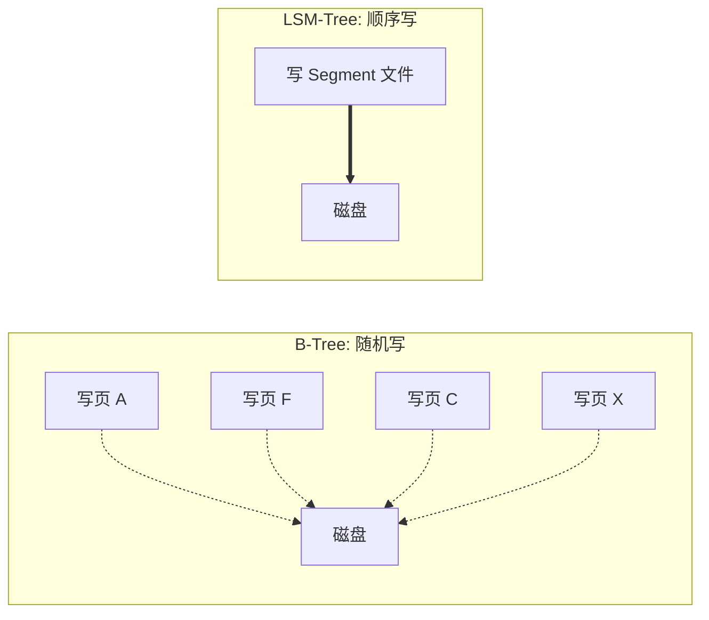

- **B-Tree**：key 分布在 key space 各处 → 页写入位置随机 → **随机写（散落各处）**
- **LSM-Tree**：整个 segment 文件一次性写出（flush memtable 或 compaction） → **顺序写（大块连续）**

在 HDD 上差异巨大（顺序写 >> 随机写）；在 SSD（尤其 NVMe）上差异较小但仍然存在——SSD 的 Flash 擦除块（512 KiB）机制使得顺序写也更友好。

#### 写放大（Write Amplification）

**定义**：应用写入 1 字节数据，实际写入磁盘的总字节数。

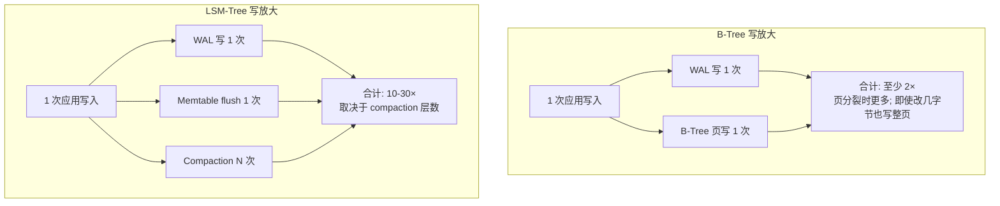

| | B-Tree | LSM-Tree |
|---|--------|----------|
| 最低写放大 | ~2× | ~1× (仅 WAL + flush) |
| 典型写放大 | 2-3× | 10-30× (多层 compaction) |
| 对写吞吐影响 | 较小（写放大低） | 依赖：如果 compaction 跟不上写入速度会成为瓶颈 |

> 看起来 LSM 写放大更高？但关键在于 LSM 的写是**顺序的**。磁盘顺序写吞吐远高于随机写，所以即使写放大更高，LSM 的实际写吞吐通常更高。

**背压（Backpressure）**: 当 compaction 跟不上写入速度时，LSM 引擎（如 RocksDB）会暂停读写直到 memtable 被 flush 完毕。

### 磁盘空间使用

| 方面 | B-Tree | LSM-Tree |
|------|--------|----------|
| 碎片化 | 删除 key 后页内产生空洞，无法归还 OS，需要 VACUUM | 不碎片化（compaction 重写文件） |
| 压缩 | 较差（页内空间利用率不高） | ✅ 更好（SSTable block 可压缩） |
| 临时空间 | 不需要额外空间 | Compaction 期间需要临时空间（尤其 Size-Tiered） |
| 数据确认删除 | 直接删除 | 删除的数据可能在 tombstone 传播完之前仍存在于旧 segment 中 |

### 快照和备份

- **LSM-Tree**: SSTable 不可变 → 快照非常简单：记录当前 segment 列表即可，不需要实际复制数据
- **B-Tree**: 页会被覆盖 → 高效快照较难（需要 copy-on-write 或一致性点）

### 综合对比表

| 维度 | B-Tree | LSM-Tree |
|------|--------|----------|
| 读性能 | ★★★★★ | ★★★☆☆ |
| 写吞吐 | ★★★☆☆ | ★★★★★ |
| 空间效率 | ★★★☆☆ | ★★★★☆ |
| 延迟稳定性 | ★★★★★ | ★★★☆☆ |
| 范围查询 | ★★★★★ | ★★★★☆ |
| 并发控制 | ★★★★★ | ★★★★☆ |
| **代表系统** | PostgreSQL, MySQL/InnoDB, SQL Server, Oracle | RocksDB, Cassandra, ScyllaDB, HBase, LevelDB |
## 4.5 多列索引与值的存储方式

### 主键索引 vs 二级索引

到目前为止讨论的都是 **主键索引（Primary Key Index）**——每个 key 唯一标识一条记录。

**二级索引（Secondary Index）** 允许按非主键列查询：

```sql
-- 主键索引: 按 user_id 查找
SELECT * FROM users WHERE user_id = 42;

-- 二级索引: 按 email 查找（需要 CREATE INDEX）
SELECT * FROM users WHERE email = 'alice@example.com';
```

**与主键索引的区别**：二级索引的 value 不唯一——同一个 email 可能对应多行。解决方式：
1. value 是一个 **行 ID 列表**（类似全文搜索的 postings list）
2. 给每个 value 附加行 ID 使之唯一

B-Tree 和 LSM-Tree 都可以实现二级索引。

### 索引中存什么值？

三种策略，各有权衡：

#### 策略1：聚簇索引（Clustered Index）

数据行**直接存在索引中**。

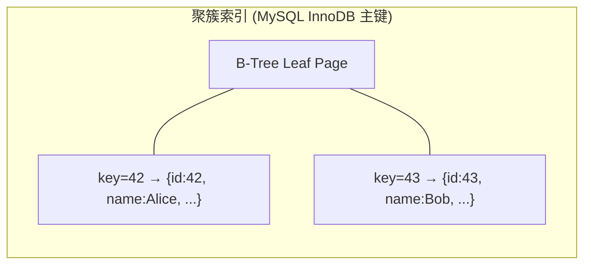

- ✅ 读取快（无需额外查找）
- ❌ 写入时可能需要移动数据
- MySQL InnoDB：主键自动是聚簇索引；SQL Server 可指定一个

#### 策略2：非聚簇索引 + 堆文件（Heap File）

索引只存 key → 指向**堆文件（heap file）**中行数据的引用。

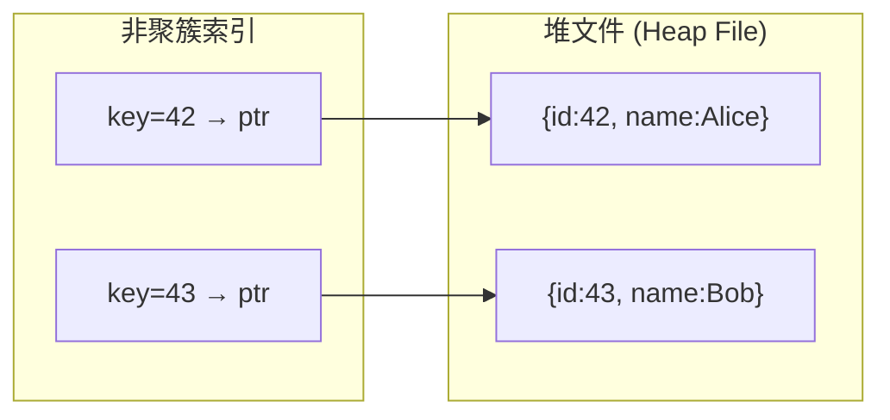

- ✅ 多个二级索引可共享同一个堆文件
- ❌ 读取需要一次额外的磁盘 seek（index → heap）
- ⚠️ 更新值变大时可能需要移动到堆中新位置 → 所有索引指针需更新，或在旧位置留转发指针
- PostgreSQL 使用这种方式

#### 策略3：覆盖索引（Covering Index）

在非聚簇索引中**额外存储部分列**。

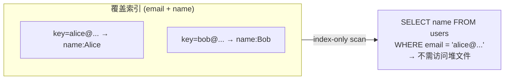

- ✅ 某些查询可以完全由索引满足（covering query）
- ❌ 索引更大，写入更慢
- 又称 **index with included columns**

### 堆文件中的值更新

- 新值 ≤ 旧值大小 → 原地覆盖 ✅
- 新值 > 旧值大小 → 需要搬迁到堆中新位置 → 需更新所有指向它的索引，或在旧位置留**转发指针（forwarding pointer）** [2]
## 4.6 内存数据库 (In-Memory Databases)

### 为什么要把数据放内存？

前面讨论的所有数据结构都是为 **磁盘** 设计的。磁盘有两大优势：持久性（断电不丢）和低成本（每 GB 价格远低于 RAM）。但随着 RAM 成本下降，很多数据集完全放得进内存。

### 内存数据库的分类

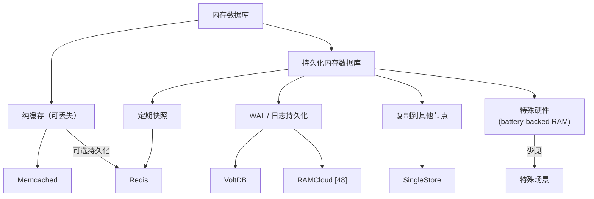

### 关键数据库

| 数据库 | 模型 | 持久化方式 | 特点 |
|--------|------|----------|------|
| **Memcached** | Key-Value | 无（纯缓存） | 最简单，丢了重建 |
| **Redis** | Key-Value + 丰富数据结构 | 可选（异步写盘 / AOF） | 优先队列、集合、有序集合等 |
| **VoltDB** | 关系型 | WAL + 复制 | 高性能 OLTP |
| **SingleStore** | 关系型 | WAL + 复制 | HTAP |
| **Oracle TimesTen** | 关系型 | WAL | 嵌入式高性能 |
| **RAMCloud** [48] | Key-Value | Log-structured（内存+磁盘） | 开源，斯坦福研究 |

### 为什么内存数据库快？

> **反直觉**：内存数据库的性能优势**不是因为不需要从磁盘读**。

即使是基于磁盘的数据库，如果你有足够内存，操作系统的文件缓存（page cache）也会把热数据缓存到内存中——读请求同样不需要真正的磁盘 I/O。

**真正的优势**：内存数据库避免了将内存数据结构编码为磁盘友好格式的开销 [49]。

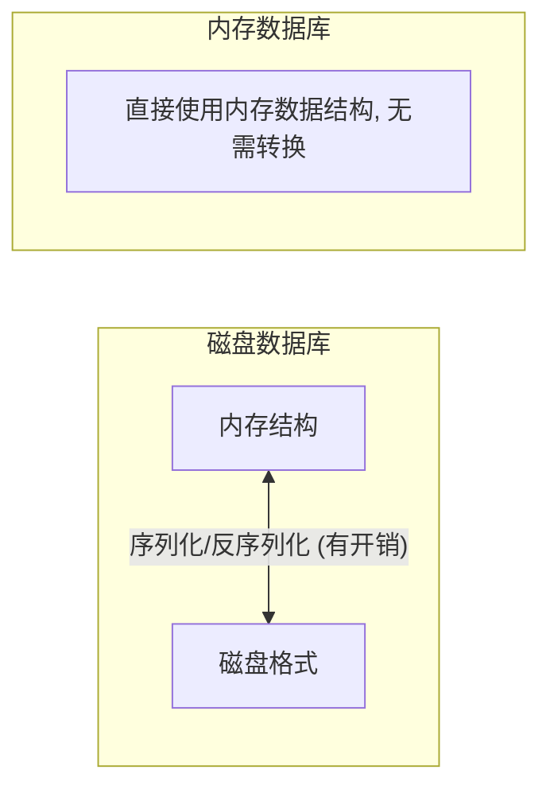

### 内存数据库的独特能力

因为不受磁盘数据结构的限制，内存数据库可以提供磁盘数据库难以高效实现的数据模型：

- **Redis**：直接在数据库层提供优先队列、有序集合、集合运算等数据结构
- 这些结构在磁盘索引中实现会非常低效，但在内存中实现简单且高效
## 4.7 分析型数据存储 (Data Storage for Analytics)

### OLTP vs OLAP：两个世界

虽然数据仓库和 OLTP 数据库表面上都用 SQL，但内部的存储引擎针对截然不同的查询模式优化。

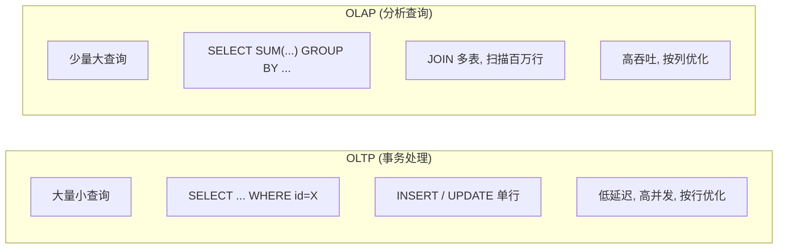

### 云数据仓库

传统数仓（Teradata、Vertica、SAP HANA）逐渐被云原生数仓取代：

| 系统 | 架构特点 |
|------|---------|
| **Google BigQuery** [54] | Serverless，存算分离，按查询计费 |
| **Amazon Redshift** | 集群式，可选 Serverless |
| **Snowflake** [61] | 存算分离，弹性计算层，多集群共享数据 |
| **Databricks SQL** | 基于 Spark + Delta Lake |

**云数仓的核心架构优势：存算分离**

```mermaid
graph TD
    subgraph TRADITIONAL["传统架构"]
        BOUND["计算 + 存储 (绑定在一起)"]
    end
    subgraph CLOUD["云原生架构 (存算分离)"]
        C1["计算节点 1"]
        C2["计算节点 2"]
        S3["对象存储 S3 / GCS<br/>(独立扩展容量)"]
        C1 --> S3
        C2 --> S3
    end
```

### 数据湖的解耦组件

开源数仓（Hive, Trino, Spark）已经拆分为独立组件：

| 组件 | 功能 | 代表 |
|------|------|------|
| **查询引擎** | 解析 SQL、生成执行计划、分布式执行 | Trino, Apache DataFusion, Presto |
| **存储格式** | 将行数据编码为字节写入文件（列式） | Parquet, ORC, Lance, Nimble |
| **表格式** | 定义哪些文件组成一张表，支持 ACID、时间旅行 | Apache Iceberg, Delta Lake, Hudi |
| **数据目录** | 定义哪些表存在于数据库中，管理 schema | Snowflake Polaris, Databricks Unity Catalog, Apache Iceberg REST Catalog |

这种解耦让你可以混合搭配：比如用 Trino 查询 Iceberg 表中的 Parquet 文件。
## 4.8 列式存储、压缩与查询执行

### 为什么需要列式存储？

数仓 fact 表往往有 100+ 列，但一个查询通常只访问 3-5 列：

```sql
SELECT dim_date.weekday, dim_product.category, SUM(fact_sales.quantity)
FROM fact_sales
  JOIN dim_date    ON fact_sales.date_key = dim_date.date_key
  JOIN dim_product ON fact_sales.product_sk = dim_product.product_sk
WHERE dim_date.year = 2024
  AND dim_product.category IN ('Fresh fruit', 'Candy')
GROUP BY dim_date.weekday, dim_product.category;
-- 只需 date_key, product_sk, quantity 三列！
```

**行式存储的问题**：即使只需 3 列，也必须将整行（100+ 列）从磁盘加载到内存，然后丢弃 97 列 → 浪费 I/O。

**列式存储的思路**：将每一列的数据单独存储。

```mermaid
graph TD
    subgraph ROW["行式存储 (Row-oriented)"]
        R1["Row 1: date_key=260102, product_sk=69, store_sk=4, ..., discount=13.99"]
        R2["Row 2: date_key=260102, product_sk=69, store_sk=5, ..., discount=9.99"]
    end
    subgraph COL["列式存储 (Column-oriented)"]
        C1["date_key: 260102, 260102, 260102, 260103, ..."]
        C2["product_sk: 69, 69, 74, 30, ..."]
        C3["store_sk: 4, 5, 3, 2, ..."]
        C4["quantity: 1, 3, 5, 1, ..."]
    end
```

**关键约束**：各列的第 k 项属于同一行。所以要重组一行，取各列的第 k 项即可。

实际实现中，列存引擎将表分成 **block**（百万行级别），每个 block 内按列存储。常按时间分区，查询只加载时间范围内的 block。

### 列压缩

列数据非常适合压缩——同一列的值类型相同、重复度高。

#### 位图编码（Bitmap Encoding）

当列的**基数（distinct values 数量）较低**时效果极好：

```
product_sk 列: [69, 69, 69, 69, 74, 30, 30, 30, 30, 29, 31, 31, 30, 30, 30, 68, 69, 69]

Bitmap for each distinct value:
  product_sk=29: [0,0,0,0,0,0,0,0,0,1,0,0,0,0,0,0,0,0]
  product_sk=30: [0,0,0,0,0,1,1,1,1,0,0,0,1,1,1,0,0,0]
  product_sk=31: [0,0,0,0,0,0,0,0,0,0,1,1,0,0,0,0,0,0]
  product_sk=69: [1,1,1,1,0,0,0,0,0,0,0,0,0,0,0,0,1,1]
  product_sk=74: [0,0,0,0,1,0,0,0,0,0,0,0,0,0,0,0,0,0]
```

位图通常很稀疏（大量 0）→ 用 **Run-Length Encoding (RLE)** 进一步压缩：

```
product_sk=69: 1,1,1,1,0,0,0,0,0,0,0,0,0,0,0,0,1,1
  RLE 编码:    0个0, 4个1, 12个0, 2个1  →  "0,4,12,2"
```

**位图的查询威力**：

```sql
WHERE product_sk IN (31, 68, 69)
  → 加载 3 个 bitmap，做 bitwise OR

WHERE product_sk = 30 AND store_sk = 3
  → 加载两列各自的 bitmap，做 bitwise AND
```

> ⚠️ 不要混淆**列式存储**和**宽列（wide-column / column-family）存储**。Bigtable、HBase、Cassandra 是宽列存储，但它们是**行式**的——同一行的所有列存在一起。

### 排序的列式存储

列存可以选择按某列排序整张表（行级别排序，各列保持对齐）：

```
排序前:  date_key: [260103, 260102, 260102, 260103, ...]
         product:  [30,     69,     69,     30, ...]

按 date_key 排序后:
         date_key: [260102, 260102, 260103, 260103, ...]  ← 重复值集中
         product:  [69,     69,     30,     30, ...]      ← 也更集中
```

**双重好处**：
1. **查询加速**：按 date_key 范围扫描只需读连续区域
2. **压缩增强**：排序后第一排序列重复值更集中，RLE 效果极好（甚至十亿行也能压到几 KB）

可以再指定第二排序列（如 product_sk）——在 date_key 相同的行内，按 product_sk 排序。第二、三排序列的压缩效果递减。

### 写入列式存储

列式存储对**单行写入**非常不友好（需要改所有列文件的对应位置，重写压缩块）。

**解决方案**：类似 LSM-Tree 的方式：

**写入路径**：

| 步骤 | 操作 |
|------|------|
| 1 | 新数据先写入内存中的行式缓冲区（row-oriented, sorted） |
| 2 | 积累足够多后，批量转为列式格式写入磁盘 |
| 3 | 旧的列式文件不变（immutable），新文件与之合并 |

**查询路径**：同时查内存中的行式数据 + 磁盘上的列式数据 → 查询引擎对用户隐藏这个细节。

Snowflake、Vertica、Apache Pinot、Druid 等都使用这种方式 [61, 63, 64, 76]。

### 查询执行：编译 vs 向量化

分析查询需要扫描百万行，**CPU 时间也很关键**（不只是 I/O）。两种优化路径：

| 方式 | 原理 | 优势 | 代表 |
|------|------|------|------|
| **Query Compilation** | 将 SQL 编译为机器码（通过 LLVM 等），JIT 执行 | 极致性能，无解释开销 | HyPer, Apache Spark Tungsten |
| **Vectorized Processing** | 批量处理一列中的一批值（而非逐行），调用预构建的批量算子 | 缓存友好、利用 SIMD、可直接操作压缩数据 | DuckDB, Snowflake, Velox |

```mermaid
graph TD
    subgraph VEC_EXEC["向量化执行示例"]
        P["product_sk 列: 30,30,30,69,69,31,..."]
        S["store_sk 列: 3,5,3,4,3,3,..."]
        P -->|"equality(product_sk, 30)"| BMP1["bitmap: 1,1,1,0,0,0,..."]
        S -->|"equality(store_sk, 3)"| BMP2["bitmap: 1,0,1,0,1,1,..."]
        BMP1 -->|"bitwise AND"| RESULT["结果: 1,0,1,0,0,0,...<br/>→ product=30 且 store=3 的行"]
        BMP2 --> RESULT
    end
```

两种方式都利用现代 CPU 特性：顺序内存访问（缓存友好）、紧凑循环（避免分支预测失败）、SIMD 指令、直接操作压缩数据。

### 物化视图与 Data Cube

**物化视图**：预计算的查询结果，存储在磁盘上。底层数据变化时需要更新。

**Data Cube（OLAP Cube）**：按多个维度预聚合数据的网格。

```
             product_sk
              32    33    34    35   ...  total
date_key
260101     149.60 31.01 84.58 28.18 ... 40710.53
260102     132.18 19.78 82.91 10.96 ... 73091.28
260103     196.75  0.00 12.52 64.67 ... 54688.10
...
total    14967.09 5910.43 7328.85 6885.39 ...  lots
```

- ✅ 某些聚合查询瞬间返回（直接读预计算值）
- ❌ 灵活性不如原始数据（无法回答"价格 > $100 的比例"这类非维度条件的查询）
- 大多数数仓保留原始数据，Data Cube 仅作为特定查询的加速层
## 4.9 多维索引与全文搜索

### 多维索引

B-Tree 和 LSM-Tree 只支持**单一维度**的范围查询（一个 key）。但有时需要同时查询多个维度。

#### 连接索引（Concatenated Index）

最简单的多列索引：将多列拼接为一个 key。

```
电话簿索引: (lastname, firstname)

可以查询:
  ✅ 所有姓 "Smith" 的人
  ✅ 所有叫 "Smith, Alice" 的人
  ❌ 所有名叫 "Alice" 的人（不管姓什么）← 索引无法帮忙
```

**局限**：只能按拼接顺序的前缀查询。

#### 真正的多维索引

**场景**：餐厅搜索——同时按经纬度范围查询：

```sql
SELECT * FROM restaurants
WHERE latitude  > 51.4946 AND latitude  < 51.5079
  AND longitude > -0.1162 AND longitude < -0.1004;
```

连接索引无法同时高效过滤两个维度——它要么给你一个纬度范围内的所有经度，要么反过来。

**解决方案：**

| 索引类型 | 原理 | 适用 |
|---------|------|------|
| **空间填充曲线** (Space-filling curve) | 将二维坐标映射为一维数值（如 Z-order curve），再用普通 B-Tree | 简单但不够灵活 |
| **R-Tree** [84] | 将空间划分为嵌套的矩形区域，相近的点分在同一子树 | 地理空间查询（PostGIS） |
| **Bkd-Tree** [84] | R-Tree 的动态变体 | 高维空间 |

**不只是地理位置**——多维索引适用于任何多条件同时过滤的场景：
- 电商：按 (red, green, blue) 三维颜色搜索
- 气象：按 (date, temperature) 搜索特定时段特定温度
- 天文：按 (赤经, 赤纬) 搜索星体

### 全文搜索

**需求**：在大量文本文档中搜索关键词（如 "red apples"）。这也可以看作多维索引——每个 term 是一个维度。

```
文档向量化表示:
  doc1: red=1, apples=1, banana=0, ...  ← 包含 "red" 和 "apples"
  doc2: red=0, apples=1, banana=1, ...  ← 不包含 "red"

查询 "red apples" = 在 red 维度=1 且 apples 维度=1 的文档
```

#### 倒排索引（Inverted Index）

全文搜索的核心数据结构：

```
term → postings list (包含该 term 的文档 ID 列表)

"red"    → [doc1, doc5, doc12, doc99, ...]
"apples" → [doc1, doc3, doc12, doc45, ...]

搜索 "red apples":
  → 取 "red" 和 "apples" 的 postings list
  → 求交集 → [doc1, doc12, ...]
```

如果文档 ID 是连续整数，postings list 可以用**稀疏位图**表示（与列式存储的位图编码完全相同！），交集就是 bitwise AND。

**Lucene**（Elasticsearch 和 Solr 的底层引擎）就是这样实现的——term → postings list 的映射存储在 SSTable-like 的排序文件中，后台使用 LSM-Tree 类似的合并策略 [90]。

#### N-gram 索引

将文本拆为长度 n 的子串，为每个子串建立倒排索引：

```
"hello" 的 trigrams (n=3): "hel", "ell", "llo"

索引:
  "hel" → [doc1, doc5, ...]
  "ell" → [doc1, doc3, ...]
  "llo" → [doc1, doc7, ...]
```

支持正则表达式搜索、模糊匹配。缺点是索引很大 [94]。

#### 模糊搜索与编辑距离

Lucene 支持按 **编辑距离（edit distance）** 搜索——查找与查询词拼写相近的词（容忍拼写错误）：

- 使用 **Levenshtein automaton** [97]：一个有限状态自动机，能高效枚举给定编辑距离内的所有词
- 底层将 term 存储为 **trie**（字符级的树结构），在 trie 上执行自动机匹配 [96]
## 4.10 向量嵌入与语义搜索

### 从关键词搜索到语义搜索

全文搜索基于精确关键词匹配——查询 "how to close my account" 不会匹配到标题为 "canceling your subscription" 的文档，尽管语义相同。

**语义搜索（Semantic Search）** 通过理解文档的"含义"来检索，是 AI 应用（如 RAG）的重要基础。

### 向量嵌入（Vector Embedding）

embedding 模型将文本转化为高维浮点数向量：

```
"agriculture" → [0.38, 0.83, 0.41]     ← 3维示例（实际常 1000+维）
"vegetables"  → [0.36, 0.64, 0.67]     ← 与 agriculture 很近
"star schemas" → [0.85, 0.10, -0.52]   ← 与上面两个很远
```

**关键性质**：语义相近的文档，其向量在多维空间中的距离也近。

**距离度量**：
- **余弦相似度（Cosine Similarity）**：衡量两个向量的夹角，范围 [-1, 1]
- **欧氏距离（Euclidean Distance）**：两点间的直线距离

**Embedding 模型演进**：
- Word2Vec [98] (2013) → BERT [99] (2019) → GPT [100] (2018)
- 现代模型支持多模态：文本 + 图像 + 音频
- 维度通常 1000+，单个向量并不直观可解释

### 向量索引（Vector Index）

**问题**：给定一个查询向量，在数百万文档向量中找到最近的 k 个。R-Tree 等传统多维索引在高维（100+维）下性能急剧退化。

三种专用向量索引：

#### 1. Flat Index（暴力搜索）

```mermaid
graph TD
    Q["查询向量 q"] --> SCAN["遍历所有文档向量, 计算距离, 取 top-k"]
```
- ✅ 结果精确
- ❌ O(n) 复杂度，数据量大时极慢

#### 2. IVF（Inverted File）索引

```mermaid
graph TD
    subgraph IVF_INDEX["IVF 索引"]
        C1["Centroid 1"]
        C2["Centroid 2"]
        C3["Centroid 3"]
        C1 --- V1A["向量 A"]
        C1 --- V1B["向量 B"]
        C1 --- V1C["向量 C"]
        C2 --- V2A["向量 D"]
        C2 --- V2B["向量 E"]
        C2 --- V2C["向量 F"]
        C3 --- V3A["向量 G"]
        C3 --- V3B["向量 H"]
        C3 --- V3C["向量 I"]
    end
    Q["查询向量"] -->|"找最近的 centroid (nprobe 个)"| C1
    Q -->|"只在该分区内搜索"| V1A
```

- ✅ 比暴力搜索快得多
- ❌ 近似结果——边界处的近邻可能被遗漏（query 和 document 可能落在不同分区）
- nprobe 越大越准但越慢

#### 3. HNSW（Hierarchical Navigable Small World）索引

```mermaid
graph TD
    subgraph HNSW["HNSW 分层图"]
        subgraph L2["Layer 2 (最稀疏, 少量节点)"]
            N2A(("●")) --- N2B(("●")) --- N2C(("●"))
        end
        subgraph L1["Layer 1 (中等密度)"]
            N1A(("●")) --- N1B(("●")) --- N1C(("●")) --- N1D(("●")) --- N1E(("●"))
        end
        subgraph L0["Layer 0 (最稠密, 全部节点)"]
            N0["● ● ● ● ● ● ● ● ● ● ● ● ● ● ●"]
        end
        N2A --> N1A
        N2B --> N1C
        N2C --> N1E
        L1 --> L0
    end
    QV["查询向量"] -->|"从 Layer 2 入口开始"| N2A
    N2A -->|"找最近节点, 下降"| N1A
    N1A -->|"在更稠密层找更近邻居"| L0
    L0 -->|"返回最终结果"| RES["近似最近邻"]
```

- ✅ 非常快（类似跳表的分层导航）
- ❌ 近似结果；内存占用较大

**主流实现**：
- **Facebook Faiss** [101]：支持 IVF 和 HNSW 的多种变体
- **PostgreSQL pgvector** [102]：在 PostgreSQL 中支持 IVF 和 HNSW
- 专用向量数据库：Pinecone, Weaviate, Qdrant, Milvus 等

---

## 💻 代码示例与最佳实践

### 示例1：简单 LSM-Tree 风格存储（Python 概念演示）

```python
import os, json, bisect

class SimpleLSM:
    """极简 LSM-Tree 概念演示（非生产代码）"""

    def __init__(self, dir="db"):
        self.dir = dir
        os.makedirs(dir, exist_ok=True)
        self.memtable = {}          # 内存中的排序 map
        self.memtable_size = 0
        self.threshold = 1024 * 64  # 64KB 时 flush
        self.segments = []          # 磁盘上的 SSTable 文件列表（新→旧）

    def put(self, key: str, value: str):
        self.memtable[key] = value
        self.memtable_size += len(key) + len(value)
        if self.memtable_size >= self.threshold:
            self._flush()

    def get(self, key: str) -> str | None:
        # 1. 先查 memtable
        if key in self.memtable:
            val = self.memtable[key]
            return None if val == "__TOMBSTONE__" else val
        # 2. 从最新到最旧查各 segment
        for seg_file in self.segments:
            val = self._search_segment(seg_file, key)
            if val is not None:
                return None if val == "__TOMBSTONE__" else val
        return None

    def delete(self, key: str):
        self.put(key, "__TOMBSTONE__")  # 写入墓碑

    def _flush(self):
        """将 memtable flush 为排序的 SSTable 文件"""
        seg_id = len(self.segments)
        seg_file = os.path.join(self.dir, f"seg_{seg_id:04d}.json")
        # 按 key 排序写入
        sorted_data = dict(sorted(self.memtable.items()))
        with open(seg_file, "w") as f:
            json.dump(sorted_data, f)
        self.segments.insert(0, seg_file)  # 最新的放前面
        self.memtable.clear()
        self.memtable_size = 0

    def _search_segment(self, seg_file: str, key: str) -> str | None:
        with open(seg_file) as f:
            data = json.load(f)
        return data.get(key)
```

### 示例2：Bloom Filter（Python 概念演示）

```python
import hashlib

class BloomFilter:
    """简单 Bloom Filter 实现"""

    def __init__(self, size: int = 1024, num_hashes: int = 3):
        self.size = size
        self.num_hashes = num_hashes
        self.bits = [0] * size

    def _hashes(self, key: str) -> list[int]:
        positions = []
        for i in range(self.num_hashes):
            h = hashlib.sha256(f"{key}_{i}".encode()).hexdigest()
            positions.append(int(h, 16) % self.size)
        return positions

    def add(self, key: str):
        for pos in self._hashes(key):
            self.bits[pos] = 1

    def might_contain(self, key: str) -> bool:
        """返回 True = 可能存在；返回 False = 一定不存在"""
        return all(self.bits[pos] == 1 for pos in self._hashes(key))

# 使用示例
bf = BloomFilter(size=64, num_hashes=3)
bf.add("handbag")
bf.add("handoff")

print(bf.might_contain("handbag"))   # True  (确实存在)
print(bf.might_contain("handheld"))  # False (一定不存在)
print(bf.might_contain("unknown"))   # False 或 True (可能是假阳性)
```

### 示例3：PostgreSQL 索引策略实战

```sql
-- 1. 查看查询执行计划（判断是否用了索引）
EXPLAIN ANALYZE SELECT * FROM users WHERE email = 'alice@example.com';

-- 2. 创建 B-Tree 索引（最常用）
CREATE INDEX idx_users_email ON users (email);

-- 3. 创建覆盖索引（避免回表）
CREATE INDEX idx_users_email_name ON users (email) INCLUDE (name, avatar_url);
-- 查询 SELECT name, avatar_url FROM users WHERE email = '...'
-- 可以 index-only scan，不需要访问堆文件

-- 4. 创建复合索引（注意列顺序 = 查询过滤顺序）
CREATE INDEX idx_orders_user_date ON orders (user_id, created_at DESC);
-- 高效查询: WHERE user_id = 42 ORDER BY created_at DESC LIMIT 10

-- 5. 地理空间索引（PostGIS + R-Tree via GiST）
CREATE INDEX idx_restaurants_location ON restaurants
  USING gist (location);  -- location 是 geometry 类型

-- 6. 全文搜索索引（GIN）
CREATE INDEX idx_articles_search ON articles
  USING gin (to_tsvector('english', title || ' ' || body));

-- 7. 向量搜索索引（pgvector + HNSW）
CREATE INDEX idx_docs_embedding ON documents
  USING hnsw (embedding vector_cosine_ops);
```

### 最佳实践

| 场景 | 推荐存储引擎 | 原因 |
|------|------------|------|
| 通用 OLTP（MySQL/PostgreSQL） | B-Tree (InnoDB / 默认) | 读写均衡，成熟稳定 |
| 写密集 OLTP（时序数据、日志） | LSM-Tree (RocksDB / Cassandra) | 高写吞吐、顺序写友好 |
| 嵌入式/移动端 | SQLite / DuckDB | 零配置、单文件 |
| 数据仓库分析 | 列式存储 (Parquet + Iceberg) | 只读少数列、压缩好 |
| 全文搜索 | Elasticsearch (Lucene) | 倒排索引 + 分布式 |
| 向量语义搜索 | pgvector / Faiss / 专用向量DB | HNSW/IVF 索引 |
| 高性能缓存 | Redis / Memcached | 纯内存、丰富数据结构 |

---

## 🎯 系统设计面试题

### 面试题1：设计一个时序数据库（如监控指标存储）

**题目**: 设计一个系统存储服务器监控指标（CPU、内存、网络），支持：写入 100 万指标/秒，按时间范围查询某个指标的历史值。

**思路分析**:

```
写入模式: 高吞吐、追加写（时间单调递增）→ LSM-Tree 天然适合
查询模式: 按 (metric_name, time_range) 查询 → 需要复合索引

存储方案:
  1. 写入层: LSM-Tree 接收写入（memtable → SSTable）
  2. 存储层: 按时间分片(如每小时一个 segment)
  3. 压缩:   同一指标的值变化小 → delta encoding + 列式存储
  4. 索引:   (metric_id, timestamp) 复合键，利用排序快速范围扫描
  5. 降采样:  旧数据自动降低精度（1s → 1min → 1h）减少存储

参考系统: InfluxDB (列式 + LSM), TimescaleDB (PostgreSQL + 时间分区),
          Prometheus (本地 TSDB), Apache Druid (列式实时分析)
```

### 面试题2：为什么 MySQL 用 B+Tree 而不是 Hash Index？

**参考答案**:

1. **范围查询**: B+Tree 支持 `WHERE price > 100 AND price < 200`，Hash 只能精确匹配
2. **排序**: B+Tree 的叶子节点有序链接 → `ORDER BY` 不需要额外排序
3. **前缀查询**: `WHERE name LIKE 'Alice%'` 可以利用 B+Tree
4. **磁盘友好**: B+Tree 节点大小 = 磁盘页（16KB），一次 I/O 读一个节点；Hash 表随机访问
5. **稳定性能**: B+Tree 查询 O(log n)，最差也是 O(log n)；Hash 在冲突严重时退化

### 面试题3：Elasticsearch 如何实现全文搜索？

**参考答案**:

```
核心数据结构: 倒排索引 (term → postings list)

写入流程 (类似 LSM-Tree):
  1. 文档写入内存缓冲区 (类似 memtable)
  2. 定期 flush 为不可变的 segment (类似 SSTable)
  3. 后台 merge segments (类似 compaction)

搜索流程:
  1. 分词: "red apples" → ["red", "apples"]
  2. 查倒排索引: 取每个 term 的 postings list
  3. 合并: 求交集 (AND) 或并集 (OR)
  4. 评分: TF-IDF / BM25 算法计算相关度
  5. 排序: 按得分返回 top-k

分布式:
  - 数据分片 (sharding) 到多个节点
  - 查询发到所有分片，各分片返回局部 top-k
  - 协调节点合并所有局部结果，返回全局 top-k
```

### 面试题4：设计一个分析型查询引擎的存储层

**题目**: 你负责设计一个数仓的存储层，数据量 PB 级，查询延迟要求 < 10 秒。

**关键设计决策**:

| 决策点 | 选择 | 理由 |
|--------|------|------|
| 存储格式 | **列式** (Parquet) | 分析查询只读少数列 |
| 压缩 | RLE + 字典编码 + Snappy | 列数据重复度高，压缩率高 |
| 分区策略 | 按时间 + 按热门维度 | 大多数查询有时间范围过滤 |
| 排序键 | (date, customer_id) | 最常见查询维度 |
| 存储位置 | 对象存储 (S3) | 存算分离，弹性扩展 |
| 元数据 | Apache Iceberg 表格式 | 支持 ACID、时间旅行、schema 演化 |
| 查询执行 | 向量化处理 | 利用 SIMD、缓存友好 |
| 缓存 | 热数据缓存到本地 SSD | 减少对象存储延迟 |

---

## 📝 本章要点总结

```mermaid
mindmap
  root((第4章<br/>存储与检索))
    OLTP 存储引擎
      LSM-Tree
        追加写 + 后台合并
        写吞吐高, 顺序 I/O
        Bloom Filter 加速不存在 key
        Size-Tiered vs Leveled Compaction
        代表: RocksDB, Cassandra
      B-Tree
        原地更新 + WAL
        读延迟稳定, 范围查询高效
        页分裂, Copy-on-Write 变体
        代表: PostgreSQL, MySQL
      对比
        LSM 写优, B-Tree 读优
        写放大 vs 随机/顺序 I/O
    索引与值存储
      聚簇索引: 数据在索引中
      堆文件: 索引存指针
      覆盖索引: 索引含部分列
    内存数据库
      优势不在于不读盘
      而是无需序列化/反序列化
      Redis, VoltDB, RAMCloud
    OLAP 存储引擎
      列式存储
        只读需要的列
        位图编码 + RLE 压缩
        排序增强压缩
      查询执行
        编译 vs 向量化
        SIMD, 缓存友好
      数据湖
        查询引擎 / 存储格式 / 表格式 / 数据目录
    高级索引
      多维: R-Tree, 空间填充曲线
      全文: 倒排索引, n-gram
      向量: IVF, HNSW
```

### 核心主线

```
数据库的本质 = 写入数据 + 读取数据
                ↓
如何让写入快？→ 追加写（Log）→ LSM-Tree
如何让读取快？→ 排序 + 索引 → B-Tree / SSTable + 稀疏索引
如何两者兼顾？→ 取决于工作负载，没有银弹
```

### 十大 Takeaways

1. **Log 是最基本的存储原语**：追加写是最高效的写操作，从简单日志到 LSM-Tree、WAL、事件溯源，log 无处不在

2. **两大 OLTP 索引范式**：LSM-Tree（追加写 + 后台合并）vs B-Tree（原地更新 + WAL），各有权衡，没有绝对优劣

3. **LSM-Tree 适合写密集**：顺序写、高压缩、写吞吐高，但读延迟不稳定（compaction 影响）、写放大可能很高

4. **B-Tree 适合读密集**：读延迟稳定、范围查询高效，但写是随机 I/O、空间碎片化

5. **Bloom Filter 是 LSM 的救星**：以极少空间（~10 bits/key）换取快速排除不存在的 key，避免无用的多层查找

6. **索引值存储的三种策略**：聚簇索引（数据在索引中）、堆文件（数据在堆中，索引存指针）、覆盖索引（索引中存部分列）——权衡读速度与写开销

7. **内存数据库的优势不在于"不读盘"**，而在于**无需序列化/反序列化**——可以直接使用内存数据结构

8. **列式存储是 OLAP 的基石**：只读需要的列、高压缩率（位图 + RLE）、排序增强压缩、向量化执行利用 CPU SIMD

9. **现代数据湖四层解耦**：查询引擎 / 存储格式 / 表格式 / 数据目录 ——可以灵活混搭

10. **向量搜索是新的索引前沿**：语义搜索通过 embedding 将文档映射到高维空间，IVF 和 HNSW 是两种主流近似最近邻索引

### 连接下一章

```
第4章回答了: 数据如何在单机上存储和检索?
第5章将回答: 数据如何编码传输? 如何支持 schema 演化和滚动升级?
              → Protobuf vs Avro vs JSON, 前向/后向兼容性
```
