# Chapter 5: 编码与演化 (Encoding and Evolution)

> *"Everything changes and nothing stands still."*
> — Heraclitus of Ephesus(万物皆变,无物常驻)

应用总会变——加功能、改需求、业务演进。**变化往往要求同时改数据格式和代码。** 但在大系统里,代码不可能瞬间全部换掉(滚动升级、客户端用户不更新),于是**新旧代码、新旧数据格式必须共存**。本章回答一个核心问题:**怎么让数据格式能随时间演化,而不破坏系统?**

---

## 🧭 本章导读

本章由**两个维度**构成——**编码格式**(数据怎么变成字节)× **数据流模式**(字节怎么在进程间流动):

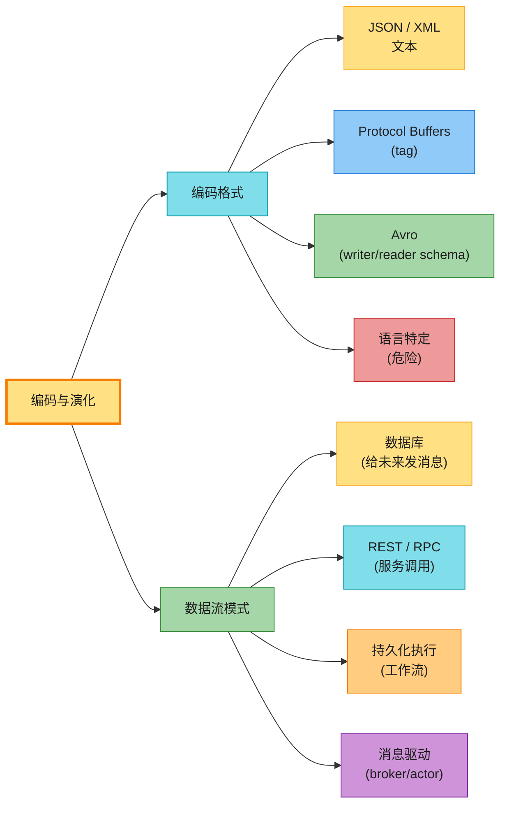

贯穿全章的关键词是**兼容性**:无论数据从哪种渠道流动,**发送方和接收方可能是不同版本的代码**,格式必须能容忍这种差异。

---

## 1. 兼容性基础

新旧代码共存时,要维护**两个方向**的兼容:

| 兼容性 | 含义 | 难度 |
|--------|------|------|
| **向后兼容 (backward)** | **新代码能读旧数据** | 较易——你写新代码时知道旧格式,显式处理即可 |
| **向前兼容 (forward)** | **旧代码能读新数据** | 较难——要旧代码忽略新版本加的东西 |

> 📝 **名词注释**:API 场景下要分清方向。想让**老客户端调用新服务** → 请求要向后兼容、响应要向前兼容。想让**新客户端调用老服务** → 请求要向前兼容、响应要向后兼容。

### 1.1 前向兼容的陷阱:静默数据丢失

向前兼容有个隐蔽的坑(原书 Figure 5-1):

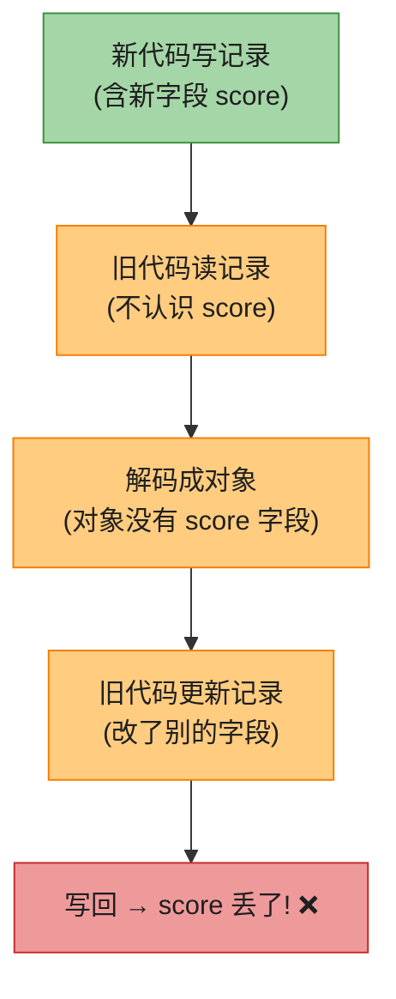

**理想行为**:旧代码虽然看不懂 `score`,但应**原样保留**它。可若解码时把记录映射到一个**没有 score 字段的对象**,写回时 score 就被丢了。**解法:用能保留未知字段 (unknown fields) 的格式/对象**(Protobuf/Avro 都支持)。

### 1.2 编码与解码

程序里的数据有**两种表示**:

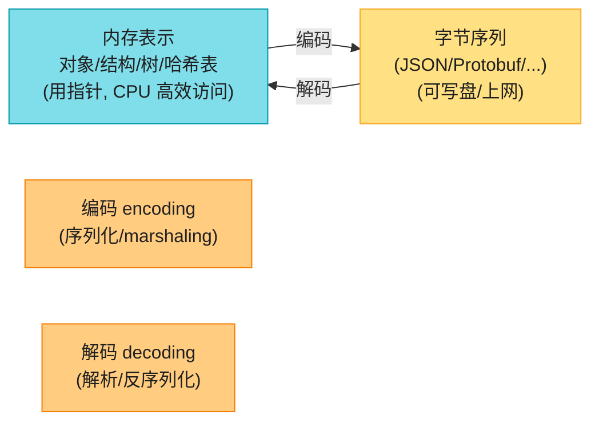

> 📝 **名词注释**:**encoding(编码)** = 内存对象 → 字节序列;**decoding(解码)** = 反过来。本书用 encoding 而非 serialization,因为 **serialization 在事务语境(Ch8)里是另一个意思**(可串行化),避免歧义。也有 **zero-copy 格式**(Cap'n Proto、FlatBuffers)设计成运行时和磁盘/网络用同一表示,无需转换。

---

## 2. 编码格式

### 2.1 语言特定格式:方便但危险

Java `Serializable`、Python `pickle`、Ruby `Marshal` 能用最少代码存取对象,但有**致命问题**:

- ❌ **绑死语言**——别的语言读不了,等于把自己锁死在一种语言;
- ❌ **安全漏洞**——解码要实例化任意类,攻击者构造恶意字节序列可**远程执行代码**(RCE)[1][2][3];
- ❌ **版本/前后兼容常被忽略**;
- ❌ **效率差**(Java serialization 出了名的慢且臃肿)[5]。

> 💡 **只在极短暂的临时场景用**,千万别用来持久化或跨服务传输。

### 2.2 JSON / XML / CSV:文本格式

跨语言标准格式。人类可读,但有一堆毛病:

| 问题 | 说明 |
|------|------|
| **数字歧义** | XML/CSV 分不清数字和数字字符串;JSON 分了字符串/数字,**但不分整数/浮点,且无精度** |
| **大整数丢失** | > 2⁵³ 的整数在 JS 的 IEEE 754 double 里无法精确表示。**X 的 post ID > 2⁵³**,API 不得不同时返回数字和字符串两份,绕过 JS 的错误解析 [8] |
| **无二进制字符串** | 只支持 Unicode 文本,二进制要 Base64 编码(膨胀 ~33%,hacky) |
| **Schema 复杂** | XML Schema / JSON Schema 强大但难学难实现,演化兼容性难 [10][11] |
| **CSV 模糊** | 值里含逗号/换行怎么办?转义规则有标准(RFC 4180)但很多解析器不正确实现 |

> 💡 尽管有缺陷,JSON/XML/CSV 作为**跨组织数据交换**格式仍会长期流行——不同组织能达成一致就不错了,漂不漂亮、高不高效是次要的。

### 2.3 JSON Schema

JSON Schema 已广泛用于 web 服务(OpenAPI)、schema 注册表(Confluent Schema Registry、Apicurio)、数据库(PostgreSQL `pg_jsonschema`、MongoDB `$jsonSchema`)。它有**开放式 (open)** 和**封闭式 (closed)** 内容模型:开放式(默认,`additionalProperties:true`)允许 schema 未定义的字段任意存在;封闭式只允许显式定义的字段。开放式灵活但演化复杂。

### 2.4 二进制 JSON:省得不多

JSON 比 XML 紧凑,但仍比二进制格式占地方。一堆二进制 JSON 变体(MessagePack、CBOR、BSON、UBJSON、Smile...)应运而生。但它们**没 schema,得把字段名也编码进去**——所以省得很有限:例子里 MessagePack 编码 66 字节,纯文本 JSON 才 81 字节,**不值得为这点空间牺牲可读性** [13]。要真正省,得用带 schema 的格式(下面)。

### 2.5 Protocol Buffers(protobuf)

Google 的二进制编码,需 **schema(IDL)**:

```protobuf
syntax = "proto3";
message Person {
    string user_name = 1;        // 字段名 + tag 号
    int64 favorite_number = 2;
    repeated string interests = 3;  // repeated = 列表
}
```

同样数据 protobuf 只要 **33 字节**(MessagePack 66、JSON 81)。省空间的秘密:

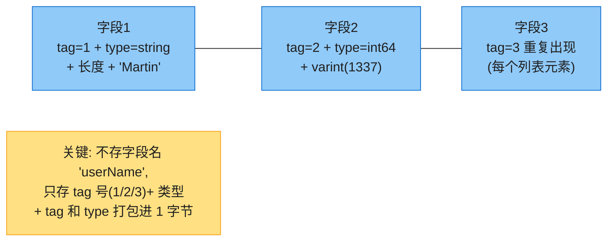

> 📝 **名词注释**:
> - **tag(标签号)**:schema 里每个字段后的数字(`= 1`)。编码数据**只存 tag 不存字段名**,所以字段名可随便改,**但 tag 绝不能改**(改了旧数据全废)。
> - **varint(变长整数)**:小数字用 1 字节,大的多用几字节(每字节高位标识"还有后续")。1337 用 2 字节,而 -64~63 只要 1 字节。
> - **repeated**:protobuf 没显式 list 类型,`repeated` 表示同一 tag 在记录里重复出现多次。

#### 深入:Protobuf schema 演化规则(怎么改才不破坏兼容)

| 操作 | 是否兼容 | 说明 |
|------|---------|------|
| **改字段名** | ✅ | 编码数据只认 tag 不认名 |
| **改 tag 号** | ❌ 永远不行 | 旧数据会读错 |
| **加新字段(新 tag)** | ✅ | 旧代码遇到不认识的 tag → 用类型标注算出长度**跳过**(保住未知字段)→ 向前兼容;新代码读旧数据缺这字段 → 填默认值 → 向后兼容 |
| **删字段** | ⚠️ | 相当于反向的"加字段";**该 tag 永远不能复用**(可能还有旧数据含它),要在 schema 里 `reserved` 标记 |
| **改字段类型** | ⚠️ | 部分类型可改(查文档),但有截断风险(如 int32→int64,旧代码用 32 位变量装 64 位值会截断) |

> 💡 **proto3 默认所有字段可选**(取消 required),就是为了让删字段/加字段都安全。**核心心法:tag 是永久身份,字段名只是别名。**

### 2.6 Avro

Apache Avro(Hadoop 子项目,因为 protobuf 不适合 Hadoop 场景 [16])。同样要 schema,但**没有 tag 号**:

```avro
record Person {
    string               userName;
    union { null, long } favoriteNumber = null;   // union + default
    array<string>        interests;
}
```

同样数据 Avro 只要 **32 字节**(最紧凑)。但编码里**既无字段名也无 tag 也无类型**——只是值拼起来:

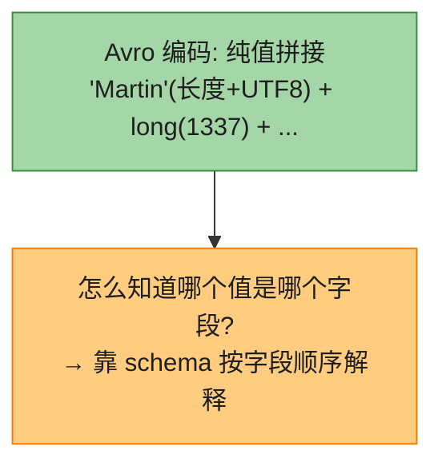

**关键:解码时必须用和编码时完全一致的 schema**,否则解错。

#### 深入:writer's schema vs reader's schema(Avro 演化的灵魂)

Avro 解码用**两个 schema**:writer's schema(编码时用的,必须一致)+ reader's schema(应用期望的,可不同版本)。Avro **按字段名匹配**两者差异并翻译:

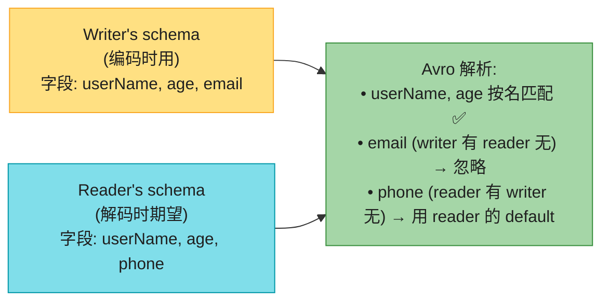

**演化规则**:只能加/删**带 default 值**的字段(否则破坏对应方向兼容)。改字段名可用 `aliases`(向后兼容但不向前)。加 union 分支向后不向前。

**writer's schema 怎么传给 reader?**(不能每条记录都带整个 schema,太大):① 大文件——开头带一次(Avro object container);② 数据库——每条记录带版本号,库里存所有版本 schema(**Confluent Schema Registry**、LinkedIn Espresso 这么干);③ 网络连接——建连时协商一次(Avro RPC)。

#### 深入:Avro 的杀手锏——动态生成 schema

Avro 比 protobuf 强在哪?**没有 tag 号 → 友好于动态生成的 schema**。

例子:把关系库 dump 成二进制文件。用 Avro,可从数据库 schema **自动生成** Avro schema(列名→字段名);数据库加一列删一列,重新生成 schema 即可,导出程序完全不用管。而 protobuf 的 tag 号得**人工分配和维护**(否则可能复用旧 tag),自动化困难——因为 protobuf 压根不是为动态 schema 设计的 [23]。

> 💡 **这就是为什么大数据生态(Kafka、Hadoop)爱用 Avro 而非 protobuf**——数据源 schema 经常变,Avro 能自动跟上。

### 2.7 Protobuf vs Avro 速查

| 维度 | Protobuf | Avro |
|------|----------|------|
| 字段标识 | **tag 号** | **字段名** |
| schema 是否随数据 | 否(代码里编译) | writer's schema 需传递 |
| 动态 schema | 不友好 | **友好(杀手锏)** |
| 编码大小 | 33 字节 | **32 字节** |
| 演化改字段名 | ✅ 随便(tag 不变) | 需 aliases(向后兼容) |
| 典型用途 | gRPC、微服务 API | Kafka、Hadoop、数据湖 |

#### 深入:为什么 schema 格式能省一半以上字节?

同一条记录(`userName=Martin, favoriteNumber=1337, interests=[daydreaming,hacking]`)在不同格式下的大小:

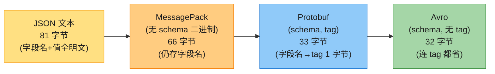

**省在哪?** 关键是**字段名的处理**:
- **JSON/MessagePack**:每条记录都要存字段名字符串(`"userName"` 8 字节、`"favoriteNumber"` 14 字节...)。MessagePack 比 JSON 只省了引号/分隔符和类型编码,**字段名一个没少**,所以 81→66 只省了 18%。
- **Protobuf**:字段名换成 **tag 号**(1、2、3,各 1 字节)打包进类型字节 → 66→33,直接**腰斩**。但每条记录仍带 tag。
- **Avro**:解码靠 schema 按顺序解释,**数据里既无字段名也无 tag**,只剩纯值 → 32 字节,**最紧凑**。

> 💡 **代价**:schema 格式省空间,但数据**不可读**(必须 schema 才能解);且要维护 schema 注册表。所以——**存盘/网络传输(尤其海量)用 schema 格式,人工调试/跨组织交换用 JSON**。

### 2.8 schema 的价值

protobuf/Avro 用 schema 描述二进制格式,schema 语言比 JSON Schema 简单(只定义字段+类型,不做复杂校验),但换来:① 比"二进制 JSON"更紧凑(省掉字段名);② schema 本身是**活的文档**(解码必需,所以不会和现实脱节);③ schema 库可**部署前检查兼容性**;④ 静态语言能从 schema **生成代码 + 编译期类型检查**。

> 💡 schema 演化提供了类似 schema-on-read 的灵活性,同时给更好的数据保证和工具——**两全其美**。但仍要尽量减少同时存在的 schema 版本数,运维才简单。

---

## 3. 数据流模式

数据从一进程流到另一进程有四种典型方式,每种对兼容性有不同要求。

### 3.1 通过数据库:给未来的自己发消息

数据库里,写进程编码、读进程解码。**存数据 = 给未来的自己发消息**——所以**向后兼容是必须的**(未来读得懂现在写的)。

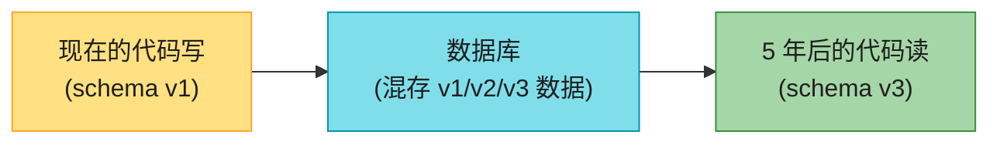

#### 深入:"Data Outlives Code"(数据比代码活得久)

应用代码几分钟就全换成新版了,但**数据库里的数据可能 5 年前的还在,用着 5 年前的编码**!这是数据库兼容性比 RPC 更难的根源——RPC 假设服务端先升级、客户端后升级(单向),数据库却要容忍**任意版本的数据共存**。

- **LSM 引擎**:compaction 时顺手用最新格式重写(渐进迁移,Ch4);
- **关系库**:加个 `null` 默认列通常不重写数据,读旧行时填 null;
- **复杂变更**(单值变多值、拆表)仍要应用层重写,大型数据集很贵 [28];
- **归档存储**:dump 快照/进数仓时,统一用最新 schema + Avro object container / **Parquet 列存**(Ch4)。

> ⚠️ 滚动升级期间,**新代码写的记录可能被旧代码读**——所以数据库**也需要向前兼容**(不只向后)。

### 3.2 通过服务:REST 与 RPC

服务端暴露 API,客户端调用。**微服务的核心目标就是服务能独立部署、独立演化**——所以 API 必须跨版本兼容,团队才能不互相阻塞地发版。

**Web services**(用 HTTP 作传输):三类场景——客户端 App 调服务(公网)、同组织服务互调(内网)、跨组织服务互调(公网 API,如支付/OAuth)。

**REST** 是最流行的服务设计哲学:基于 HTTP,用 URL 标识资源,用 HTTP 特性做缓存/认证/内容协商。定义 API 用 **IDL**:web 服务用 **OpenAPI(=Swagger)**,gRPC 用 **Protocol Buffers**。

```yaml
# OpenAPI 示例(YAML)
openapi: 3.0.0
paths:
  /ping:
    get:
      responses:
        '200':
          content:
            application/json:
              schema: { type: object, properties: { message: { type: string } } }
```

框架(FastAPI、Spring Boot、gRPC)帮你把路由/指标/认证等琐事做了,你专注业务逻辑;还能从定义生成多语言客户端 SDK、文档、GUI 测试界面。

#### 深入:RPC 的根本缺陷(为什么"远程调用像本地函数"是坏抽象)

RPC(1970s 提出 [38])想让远程调用看起来像本地函数调用,这叫 **location transparency(位置透明性)**。**这抽象是有缺陷的** [39][40]——网络调用和本地调用有 6 大本质差异:

| # | 本地函数调用 | 网络请求(RPC) |
|---|------------|--------------|
| 1 | 可预测,成功/失败自己控 | **不可预测**——请求/响应可能丢,远端可能慢或挂 |
| 2 | 返回结果 / 抛异常 / 死循环 | 多一种:**超时无响应**——你根本不知道发生了什么(Ch9 详谈) |
| 3 | 重试不存在 | 重试可能**重复执行**(除非幂等)——本地调用没这问题(Ch12) |
| 4 | 耗时稳定 | **慢且方差极大**(好时 <1ms,拥堵时几秒) |
| 5 | 可传指针/引用 | 参数必须**编码成字节**传,大对象/可变对象很麻烦 |
| 6 | 同一语言,类型一致 | 客户端/服务端可能**不同语言**,类型系统不同(JS 的 >2⁵³ 问题) |

> 💡 **结论**:别把远程服务伪装得太像本地对象。**REST 的部分魅力正在于它把"网络上状态转移"当成和函数调用不同的东西**。

**负载均衡 / 服务发现 / 服务网格**(让客户端找到服务、分摊流量):

| 方案 | 说明 |
|------|------|
| 硬件 LB | 数据中心专用设备,客户端连单地址,LB 转发到某个实例 |
| 软件 LB | NGINX、HAProxy,装在普通机器上,行为同上 |
| DNS | 域名映射多 IP,客户端网络层选一个;**缺点:DNS 缓存久,服务频繁变动会看到过期 IP** |
| 服务发现 | etcd/ZooKeeper 集中注册表,实例启动时注册 + 心跳;客户端查可用端点直连;比 DNS 更动态,还能给元数据(分片、机房)做智能路由 |
| 服务网格 | LB + 服务发现的高级形态,以 sidecar/进程库形式部署在客户端和服务端两侧(如 **Istio、Linkerd**);连接加密、可观测性、故障检测都在 mesh 层做,业务代码无感 |

#### 深入:服务网格 sidecar 怎么工作?

传统软件 LB 跑在单独机器;服务网格把 LB **塞进每个节点(sidecar 容器)**,业务进程只和本地 sidecar 通信:

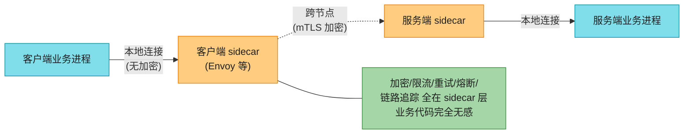

**妙处**:跨节点的脏活(双向 TLS 加密、限流、重试、熔断、全链路追踪、故障检测)**全部下沉到 sidecar**,业务代码只管发本地请求。换加密协议、加可观测性,都不用动业务代码。代价是**多一跳 + sidecar 运维复杂**——所以通常配合 Kubernetes 这种动态编排用。

**RPC 兼容性**:相比数据库,服务可简化假设——**服务端先升级、客户端后升级**——所以只需请求向后兼容 + 响应向前兼容。兼容性继承自所用编码(gRPC/protobuf、Avro RPC 按各自规则;REST/JSON 加可选参数/响应字段通常兼容)。跨组织 RPC 时,服务方**无法强制客户端升级**,兼容性要长期甚至永久维护;必要时**多版本 API 并存**。API 版本控制无标准(URL 加版本号 / Accept header / 服务端存客户端版本 [43][44])。

### 3.3 持久化执行与工作流(2 版新增)

服务架构里,一个业务(如支付)要调多个服务(风控→信用卡→银行)。这一串步骤叫 **workflow**,每步叫 **task**(Temporal 叫 activity)。**workflow engine** 决定每步何时何机执行、失败怎么办、并行度多少。


> 🏭 **真实产品**:**Airflow、Dagster、Prefect**(ETL 编排)、**Camunda、Orkes**(图形化 BPMN,非工程师也能定义)、**Temporal、Restate**(持久化执行)。

#### 深入:持久化执行如何做到 exactly-once?

支付场景:扣了信用卡却没入账 = 灾难。但又没法把跨服务的两步包进一个数据库事务(还涉及第三方支付网关)。**持久化执行框架**(Temporal 等)的解法:

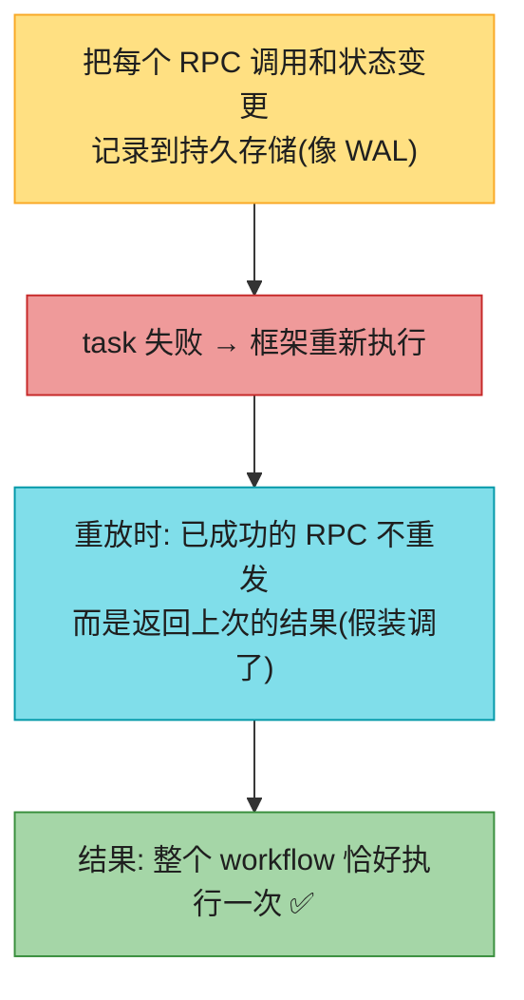

**代价/挑战**:
- 外部服务仍需提供**幂等 API**,你要用唯一 ID 防重复执行 [48];
- 框架按顺序记录 RPC,**重放要求确定性 (deterministic)**——同样的输入产生同样的调用序列。**改代码很脆**:光调换函数顺序就可能引入未定义行为 [49]。安全做法是**新代码单独部署**,旧 workflow 实例继续用老代码,新实例才用新代码 [50];
- 随机数、系统时钟等**非确定性代码**是坑——框架提供确定性版本,或用静态分析(Temporal Workflow Check)检测 [49]。

> 💡 "让代码确定性重放"是个强大但棘手的思想,Ch9 会再讨论。

### 3.4 事件驱动架构

另一种数据流:请求叫 **event/message**。和 RPC 不同——**发送方不等接收方处理完**,且消息通常经中间人 **message broker(消息代理)**中转,而非直连。

**broker 相比直连 RPC 的优势**:

- 接收方不可用/过载时,broker **缓冲**,提可靠性;
- 接收进程崩溃,broker **自动重投**,防丢;
- 免去服务发现(发送方不直连接收方 IP);
- 一条消息可发**多个接收方**;
- **逻辑解耦**——发送方只管发布,不在乎谁消费。

两种分发模式:

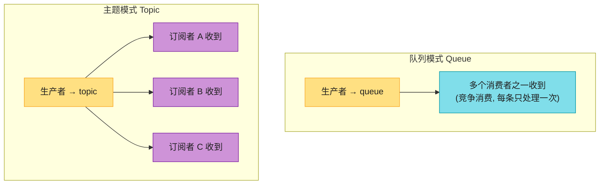

> 🏭 **真实产品**:开源 **RabbitMQ、ActiveMQ、NATS、Redpanda、Kafka**;云 **Kinesis、Azure Service Bus、GCP Pub/Sub**(Ch12 详比)。broker 不强求数据模型,消息就是字节+元数据,可用 protobuf/Avro/JSON,配 **schema registry** 查兼容性 [20][22];**AsyncAPI** 是消息版的 OpenAPI。
>
> **持久性差异**:多数 broker 消息消费后自动删;有的可配永久存(用于 **event sourcing**,见 Ch3 §6)。消费者若把消息再转发到别的 topic,要注意**保留未知字段**,否则重蹈 §1.1 的数据丢失覆辙。

#### 分布式 Actor 框架

**Actor 模型**:单进程并发模型——不直接碰线程(避免竞态/锁/死锁),逻辑封装在 **actor** 里(每个 actor 常代表一个客户/实体),有本地状态(不共享),靠**异步消息**通信;消息投递不保证(某些错误下会丢);每个 actor 一次只处理一条消息,所以不用考虑线程。

**分布式 actor 框架**(**Akka、Orleans、Erlang/OTP**)把这套模型扩展到多节点——同节点和跨节点用同一套消息机制,跨节点时透明编码传输。**位置透明性在 actor 模型里比 RPC 好**,因为 actor 模型本来就假设"消息可能丢"(即使单进程内)——本地和远程的失配没那么大。

但**滚动升级**时仍要担心前后兼容(新节点发消息给老节点,反之亦然),用本章的编码格式解决。

---

## 🏭 生产级产品速查表

| 类别 | 产品 | 关键点 |
|------|------|--------|
| 文本格式 | JSON、XML、CSV | 跨组织交换,人类可读;数字/二进制有坑 |
| 二进制 JSON | MessagePack、CBSON、BSON、Smile | 无 schema,省得不多 |
| Schema 二进制 | **Protobuf**、**Avro**、Thrift、FlatBuffers、Cap'n Proto | 紧凑+演化语义清晰 |
| Schema 注册表 | Confluent Schema Registry、Apicurio、Buf Schema Registry | 存版本+查兼容性 |
| 服务 IDL | **OpenAPI/Swagger**(REST)、**Protobuf**(gRPC)、AsyncAPI(消息) | 定义+文档+生成代码 |
| 服务框架 | FastAPI、Spring Boot、gRPC、Connect | 路由/指标/认证自动化 |
| 服务发现 | etcd、ZooKeeper、Consul、Eureka | 注册+心跳+查询 |
| 服务网格 | Istio、Linkerd、Envoy | sidecar LB + 加密 + 可观测 |
| 工作流引擎 | Airflow、Dagster、Prefect(ETL);Temporal、Restate(持久化执行) | 调度+exactly-once |
| 消息 broker | Kafka、RabbitMQ、NATS、Redpanda、Pulsar;Kinesis/Pub/Sub | 异步解耦+缓冲+重投 |
| Actor 框架 | Akka、Orleans、Erlang/OTP | 消息并发+分布式透明 |

---

## 💻 代码示例

### 示例 1:Protobuf schema 演化实战

```protobuf
// ===== v1 schema =====
message User {
    string user_name = 1;
    int64  favorite_number = 2;
    repeated string interests = 3;
}

// ===== v2 schema(向后+向前兼容)=====
message User {
    string user_name = 1;
    int64  favorite_number = 2;
    repeated string interests = 3;
    string email = 4;          // ✅ 加新字段, 用新 tag
    reserved 5;                // ✅ 删过的 tag 标记 reserved, 防复用
    reserved "old_field";      //    也可按名 reserve
    // int64 score = 5;        // ❌ 绝对不行! tag 5 曾用过
}
// v1 代码读 v2 数据: 遇到 tag 4(不认识)→ 按类型跳过保留 ✅
// v2 代码读 v1 数据: 缺 email → 填默认空串 ✅
```

### 示例 2:Avro schema 演化(按名匹配 + default)

```json
// writer's schema v1
{
  "type": "record", "name": "User",
  "fields": [
    {"name": "userName", "type": "string"},
    {"name": "age", "type": "long"}
  ]
}

// reader's schema v2(加字段带 default → 向后兼容)
{
  "type": "record", "name": "User",
  "fields": [
    {"name": "userName", "type": "string"},
    {"name": "age", "type": "long"},
    {"name": "email", "type": ["null","string"], "default": null}  // ✅ 有 default
  ]
}
// v2 reader 读 v1 数据: 缺 email → 填 default null ✅
// 若 email 无 default → 新 reader 读不了旧 writer → 破坏向后兼容 ❌
```

### 示例 3:FastAPI 服务(自动生成 OpenAPI)

```python
from fastapi import FastAPI
from pydantic import BaseModel

app = FastAPI(title="Ping Pong", version="1.0.0")

class PongResponse(BaseModel):
    message: str = "Pong!"

@app.get("/ping", response_model=PongResponse)
async def ping():
    return PongResponse()
# FastAPI 自动生成 /openapi.json + /docs(Swagger UI)
# 客户端可用该定义生成多语言 SDK; 演化时加可选字段保持兼容
```

### 示例 4:幂等的 RPC 客户端(防重复执行)

```python
import uuid, requests

def charge_card_idempotent(amount, customer):
    # 幂等键:同一业务多次重试只扣一次
    idempotency_key = f"charge-{customer}-{order_id}"  # 稳定唯一
    return requests.post("https://api.stripe.com/charges",
        json={"amount": amount, "customer": customer},
        headers={"Idempotency-Key": idempotency_key})  # 服务端据 key 去重
# 即使网络超时重试, 不会重复扣款(Ch12 幂等性详谈)
```

---

## 🎯 系统设计面试题

### 面试题 1:如何让 API 演化而不破坏成千上万的客户端?★重点

**题目**:你的 SaaS API 有大量外部客户端(他们控制不了升级节奏)。要给 `/users` 响应加字段、改一个字段含义,怎么安全上线?

**思路(分阶段、可回滚)**:

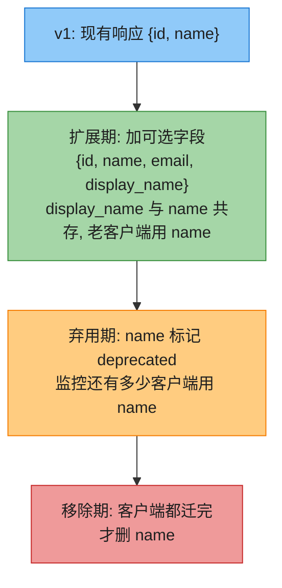

**要点**:
- **只加不删**(向后兼容):加字段是安全的,老客户端忽略新字段;
- **改含义=新字段**:别改老字段的语义,加个新字段(`display_name`)并行,老客户端继续用老字段;
- **版本号**:URL(`/v2/users`)或 Accept header;服务端可存"某客户端要哪个版本";
- **监控弃用**:用日志统计还有谁在用老字段,降到 0 才删;
- **Schema Registry**:部署前自动检查新 schema 对老 schema 的兼容性(Confluent/Buf)。

---

### 面试题 2:给 Kafka 数据流选编码格式

**题目**:Kafka 上传用户行为事件,多个下游消费,事件 schema 会随产品演进变化。选 JSON、Protobuf 还是 Avro?

**分析**:

| 格式 | 适配 Kafka? |
|------|-----------|
| JSON | ✅ 简单,但大、无强 schema、数字有坑 |
| Protobuf | ✅ 紧凑,但 tag 号需人工维护,schema 变更要小心 |
| **Avro** | ✅✅ **最佳**——动态 schema 友好(产品 schema 常变),配 Schema Registry 自动管理版本+查兼容 |

**推荐**:Avro + Confluent Schema Registry。生产者注册 schema,registry 检查向后兼容;消息只存 schema ID(4 字节),消费者按 ID 拉 schema 解码。这正好用上 Avro 的动态 schema 优势。

---

### 面试题 3:支付系统的可靠执行

**题目**:支付要调风控→扣卡→入账三步,任一失败都不能出现"扣了卡没入账"。怎么设计?

**思路**:
- 别用裸 RPC 链 + try/catch——中途崩溃状态不一致;
- 用**持久化执行框架(Temporal)**:每步结果记 WAL,失败重放时跳过已成功的 RPC;
- 第三方支付网关必须**幂等**(用幂等键);
- workflow 代码要**确定性**重放——别在里面用随机/时钟/直接调外部;
- 改 workflow 代码时,旧实例继续跑老代码,新实例用新代码;
- 兜底:对账系统定期核对扣款和入账是否一致(Trust but verify)。

---

## 📚 精选文献(只留真正值得读的)

第五章引用 50 多条,多数是格式规范。这 5 篇值得:

| # | 文献 | 为什么值得读 |
|---|------|------------|
| [15] | Kleppmann *"Schema Evolution in Avro, Protocol Buffers and Thrift"* 2012 | **作者本人的经典博客**,三种格式演化规则一图看懂,本章的精华浓缩版。免费必读。 |
| [39] | Waldo et al. *"A Note on Distributed Computing"* Sun Labs 1994 | **"网络调用 ≠ 本地调用"的经典论证**,RPC location transparency 缺陷的理论根基。薄薄几页,影响深远。 |
| [38] | Birrell & Nelson *"Implementing Remote Procedure Calls"* TOCS 1984 | **RPC 的开山论文**。理解 RPC 模型的设计初衷,再看它为何有缺陷。 |
| [44] | Leach *"APIs As Infrastructure: Future-Proofing Stripe with Versioning"* 2017 | **Stripe 真实的大规模 API 版本演化实践**。面试题 1 的实战来源,讲怎么长期维护多版本 API。 |
| [52] | Bernstein et al. *"Orleans: Distributed Virtual Actors"* MSR 2014 | **分布式 Actor 模型的代表作**(微软游戏/Halo 用)。理解 actor 模型如何扩展到多节点。 |

> 想深入 Avro:读 **Apache Avro 规范** [17];想搞 schema 演化工程实践:读 **Confluent Schema Registry 文档** [20] 和 Kleppmann 博客 [15]。

---

## 📝 本章要点总结

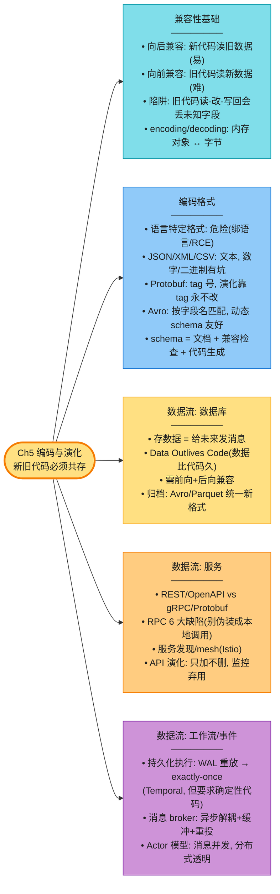

**核心 Takeaways**:

1. **演化不可避免,新旧代码必须共存**——所有数据流都要假设读写方版本可能不同。
2. **向后兼容易,向前兼容难**(要旧代码忽略新东西),且向前兼容有"静默丢数据"陷阱。
3. **语言内置序列化是地雷**——绑语言、有 RCE 漏洞、忽略兼容性。
4. **JSON/XML/CSV 跨组织交换够用**,但数字精度(>2⁵³)、二进制字符串、schema 复杂是真坑。
5. **Protobuf 靠 tag 号**——字段名随便改,tag 永不能改/复用;加字段用新 tag。
6. **Avro 靠字段名匹配** + writer/reader 双 schema——动态生成 schema 的场景(Kafka/数据湖)完胜 Protobuf。
7. **schema 是活的文档**——解码必需所以不会脱节,还能部署前查兼容性、生成代码。
8. **RPC 的 location transparency 是有缺陷的抽象**——网络调用有 6 大本质区别(超时、重试、延迟、编码、跨语言),别伪装成本地调用。
9. **数据库需要双向兼容**,因为"Data Outlives Code"——5 年前的数据还在用旧编码。
10. **持久化执行用 WAL 重放做到 exactly-once**(Temporal),但代价是代码必须确定性重放。
