# 第5章：编码与演化 (Encoding and Evolution)

> *"Everything changes and nothing stands still."*
> — Heraclitus of Ephesus, as quoted by Plato in *Cratylus* (360 BCE)

---

## 📚 核心论文与参考文献

### 必读论文

| # | 论文/资料 | 作者 | 核心内容 | 链接 |
|---|---------|------|--------|------|
| [14] | "Thrift: Scalable Cross-Language Services Implementation" | Slee et al. (Facebook) | Apache Thrift 跨语言服务框架 | [perma.cc/22BS-TUFB](https://perma.cc/22BS-TUFB) |
| [15] | "Schema Evolution in Avro, Protocol Buffers and Thrift" | Martin Kleppmann | 三种格式的 Schema 演化对比 | [perma.cc/E4R2-9RJT](https://perma.cc/E4R2-9RJT) |
| [29] | "Project Cambria: Translate Your Data with Lenses" | Litt et al. | 用 Lens 翻译数据实现兼容 | [perma.cc/WA4V-VKDB](https://perma.cc/WA4V-VKDB) |
| [30] | "Data on the Outside Versus Data on the Inside" | Pat Helland | 服务边界内外的数据本质不同（经典） | [perma.cc/GH56-WYZS](https://perma.cc/GH56-WYZS) |
| [31] | "Architectural Styles and the Design of Network-Based Software Architectures" | Roy Fielding | REST 架构风格（Fielding 博士论文） | [perma.cc/LWY9-7BPE](https://perma.cc/LWY9-7BPE) |
| [38] | "Implementing Remote Procedure Calls" | Birrell & Nelson | RPC 原始论文（1984） | [doi:10.1145/2080.357392](https://doi.org/10.1145/2080.357392) |
| [41] | "Designing Robust and Predictable APIs with Idempotency" | Brandur Leach (Stripe) | API 幂等性设计 | [perma.cc/JD22-XZQT](https://perma.cc/JD22-XZQT) |
| [52] | "Orleans: Distributed Virtual Actors for Programmability and Scalability" | Bernstein et al. (Microsoft) | Orleans Actor 框架 | [perma.cc/PD3U-WDMF](https://perma.cc/PD3U-WDMF) |

### 推荐书籍

| 书名 | 作者 | 说明 |
|------|------|------|
| *ASN.1 Complete* [24] | John Larmouth | ASN.1 标准详解（历史参考） |

### 中文资源

- Protobuf 官方文档中文版：搜索「Protocol Buffers 中文教程」
- Avro 入门：搜索「Apache Avro 入门 Schema 演化」
- gRPC 中文文档：搜索「gRPC 中文文档」
- JSON Schema 入门：搜索「JSON Schema 入门教程」
- Temporal 工作流引擎：搜索「Temporal workflow 入门」

---

## 🗺️ 章节概览

本章解决一个核心问题：**当应用程序不断演化时，数据编码格式如何支持新旧代码共存？** 这对滚动升级（rolling upgrade）和微服务架构至关重要。

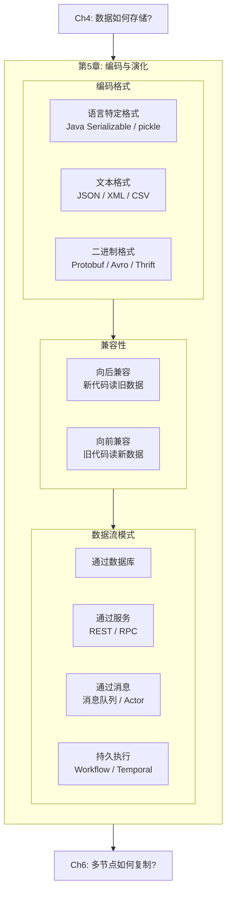

### 本章结构一览

| 小节 | 主题 | 关键概念 |
|------|------|---------|
| 5.1 | 兼容性基础 | 向前兼容、向后兼容、滚动升级 |
| 5.2 | 语言特定格式与 JSON/XML | 语言绑定问题、数字精度、JSON Schema |
| 5.3 | Protocol Buffers | field tag、varint、schema 演化规则 |
| 5.4 | Avro | writer's/reader's schema、动态生成 schema |
| 5.5 | 数据流：通过数据库 | data outlives code、archival storage |
| 5.6 | 数据流：REST 与 RPC | Web services、RPC 的问题、服务发现 |
| 5.7 | 数据流：消息与事件驱动 | Message broker、Actor 模型、Durable execution |
## 5.1 兼容性基础：为什么编码格式如此重要

### 变化是不可避免的

应用程序不断演化：新功能上线、需求变更、数据格式调整。Ch2 提出的 **可演化性（evolvability）** 正是为此而来。

### 新旧代码必须共存

在大型系统中，代码变更不可能瞬间完成：

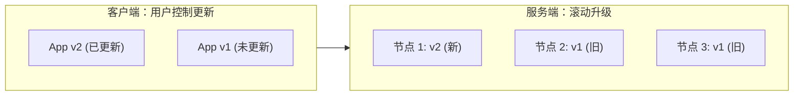

- **服务端**：滚动升级（rolling upgrade / staged rollout），逐个节点部署新版本
- **客户端**：用户可能不会立即更新 App

因此，新旧数据格式必须**同时**存在于系统中。

### 两个方向的兼容性

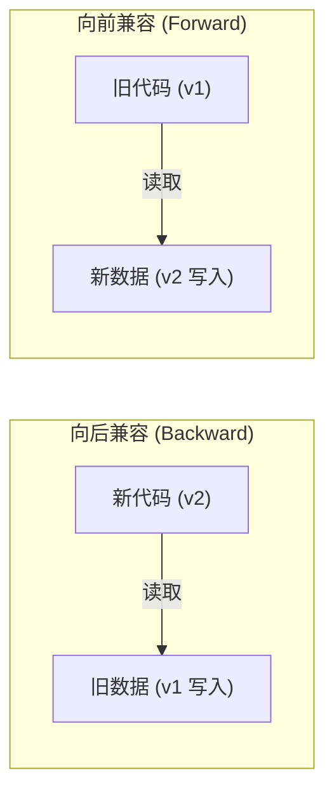

| 方向 | 含义 | 难度 |
|------|------|------|
| **向后兼容** (Backward) | 新代码能读旧数据 | 较容易：新代码知道旧格式，显式处理即可 |
| **向前兼容** (Forward) | 旧代码能读新数据 | 较难：旧代码需要能忽略它不认识的新字段 |

**API 场景的兼容性要求：**
- 旧客户端调用新服务 → 请求需**向前**兼容，响应需**向后**兼容
- 新客户端调用旧服务 → 请求需**向后**兼容，响应需**向前**兼容

### 前向兼容的陷阱：数据丢失

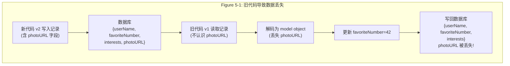

**教训**：旧代码读取-修改-写回时，如果不保留未知字段，新代码写入的数据会丢失。编码格式需要支持**保留未知字段**。

### 编码与解码

程序处理数据有两种表示：

| 表示 | 用途 | 特点 |
|------|------|------|
| **内存表示** | CPU 处理 | 对象、结构体、哈希表、树，使用指针 |
| **字节序列** | 磁盘/网络 | 自包含，无指针，可跨进程传输 |

- 内存 → 字节序列：**编码**（encoding / serialization / marshaling）
- 字节序列 → 内存：**解码**（decoding / parsing / deserialization / unmarshaling）

> ⚠️ 本书用 *encoding* 而非 *serialization*，因为后者在事务上下文中有完全不同的含义（见 Ch8）。
## 5.2 语言特定格式与 JSON/XML

### 语言特定格式：方便但危险

| 语言 | 内置序列化 |
|------|----------|
| Java | `java.io.Serializable`, Kryo |
| Python | `pickle` |
| Ruby | `Marshal` |

**四大问题：**

1. **语言锁定**：用 Java 序列化的数据，Python 无法读取。将你绑死在一种语言上
2. **安全漏洞**：反序列化可以实例化任意类 → 远程代码执行（RCE）攻击 [1, 2, 3]
3. **无版本控制**：缺乏向前/向后兼容性设计 [4]
4. **性能差**：Java 内置序列化以性能低下和体积臃肿著称 [5]

> **结论**：除了极短暂的临时用途，不要使用语言内置的序列化。

### JSON, XML, CSV：文本格式

跨语言的通用选择，但有各自的问题：

| 格式 | 优点 | 问题 |
|------|------|------|
| **JSON** | 广泛支持，相对简洁 | 不区分整数和浮点数；大数精度丢失（JS 的 2^53 限制）；无二进制字符串 |
| **XML** | 功能强大，有 Schema | 过于冗长 [6]；数字/字符串歧义 |
| **CSV** | 最简单 | 无 Schema；逗号/换行转义模糊；不支持嵌套 |

**JSON 的数字精度陷阱**：

```json
// Twitter/X 的 post ID 是 64 位整数
// JSON 返回两种形式以兼容 JavaScript 客户端：
{
  "id": 505874924095815700,     // JSON number (JS 会丢失精度)
  "id_str": "505874924095815681" // 字符串形式 (精确)
}
```

### JSON Schema

JSON Schema 已成为系统间数据交换的标准方式，广泛用于：
- **OpenAPI** (Swagger) Web 服务规范
- **Schema Registry**（Confluent, Red Hat Apicurio）
- **数据库校验**（PostgreSQL `pg_jsonschema`, MongoDB `$jsonSchema`）

**JSON Schema 示例（整数 key → 字符串 value 的映射）：**

```json
{
  "$schema": "http://json-schema.org/draft-07/schema#",
  "type": "object",
  "patternProperties": {
    "^[0-9]+$": { "type": "string" }
  },
  "additionalProperties": false
}
```

**开放 vs 封闭内容模型：**
- `additionalProperties: true`（默认）→ 开放模型，允许额外字段
- `additionalProperties: false` → 封闭模型，只允许定义的字段
- 实践中常用开放模型（方便向前兼容——新字段不会被拒绝）

**JSON Schema 的局限**：功能强大但也复杂——条件逻辑、远程引用、命名类型等使得向前/向后兼容的推理变得困难 [10, 11]。

### 二进制 JSON 编码

JSON 的二进制变体（MessagePack, CBOR, BSON, UBJSON 等）在某些场景更紧凑、解析更快，但：
- 未被广泛采用
- 仍然在编码中包含字段名（因为没有 schema）
- 空间节省有限：66 bytes (MessagePack) vs 81 bytes (JSON 文本)

> 真正的空间优化来自 **schema-based 二进制格式**（Protobuf, Avro），可以将相同记录编码到 ~32-33 bytes。
## 5.3 Protocol Buffers

### 基本原理

Protocol Buffers (protobuf) 是 Google 开发的二进制编码格式（Apache Thrift [14] 由 Facebook 开发，原理类似）。

**核心思想**：用 schema 定义数据结构，编码时**不存储字段名**，只存储 field tag（数字）。

```protobuf
syntax = "proto3";

message Person {
    string user_name = 1;       // field tag = 1
    int64 favorite_number = 2;  // field tag = 2
    repeated string interests = 3; // field tag = 3
}
```

### 编码原理

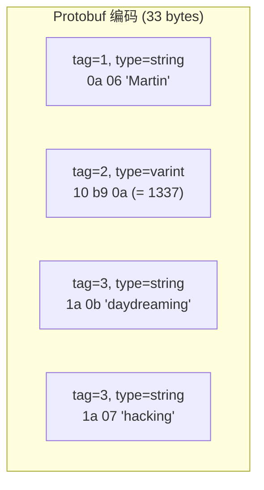

**关键设计：**

| 特性 | 说明 |
|------|------|
| **Field tag** | 数字（1, 2, 3...），替代字段名，极紧凑 |
| **Varint 编码** | 变长整数：-64~63 = 1 byte, -8192~8191 = 2 bytes, 小数更省空间 |
| **无显式数组** | `repeated` 修饰符表示列表，编码为同一 tag 的多次出现 |
| **不含字段名** | 编码中只有 tag 数字，字段名仅在 schema 定义中 |

**空间对比**：同一条记录

| 格式 | 大小 |
|------|------|
| JSON (文本) | 81 bytes |
| MessagePack (二进制 JSON) | 66 bytes |
| **Protocol Buffers** | **33 bytes** |

### Schema 演化规则

**核心原则**：field tag 是编码的关键，改名可以但**不能改 tag 数字**。

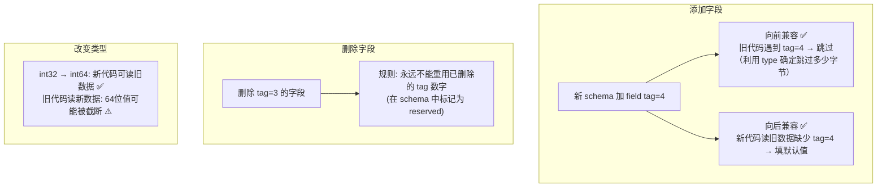

**详细规则：**

| 操作 | 向后兼容 | 向前兼容 | 注意 |
|------|---------|---------|------|
| **添加字段**（新 tag） | ✅ 缺失字段填默认值 | ✅ 未知 tag 被跳过 | 新字段不能是 required |
| **删除字段** | ✅ 同"添加"的镜像 | ✅ 同"添加"的镜像 | tag 号永不重用 |
| **改字段名** | ✅ 编码不含名字 | ✅ 编码不含名字 | 对二进制格式无影响 |
| **改字段类型** | 部分可以 | 部分可以 | 可能截断值（如 int64→int32） |
| **改 tag 号** | ❌ 破坏兼容 | ❌ 破坏兼容 | **绝对不能改** |
## 5.4 Avro

### 与 Protobuf 的关键区别

Apache Avro 由 Hadoop 社区于 2009 年创建 [16]，因为 Protobuf 不适合 Hadoop 的使用场景。

**最核心的区别**：Avro 编码中**没有 field tag**，也没有任何标识字段的信息——纯粹是值的拼接。

```
// Avro IDL
record Person {
    string              userName;
    union { null, long } favoriteNumber = null;
    array<string>        interests;
}
```

### 编码对比

| 格式 | 大小 | 编码中包含 |
|------|------|----------|
| JSON | 81 bytes | 字段名 + 类型标识 + 值 |
| MessagePack | 66 bytes | 字段名 + 类型标识 + 值 |
| Protobuf | 33 bytes | field tag + 类型标识 + 值 |
| **Avro** | **32 bytes** | **仅值**（无字段标识，无类型标识） |

**Avro 解码的前提**：读写双方必须使用**完全相同的 schema** 才能正确解码，因为字段的位置和类型完全由 schema 决定。

### Writer's Schema vs Reader's Schema

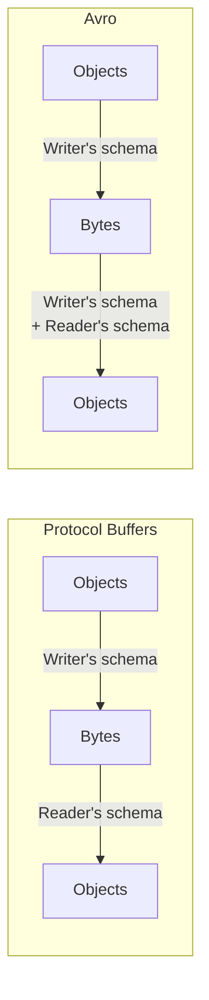

**关键差异**：Avro 解码时需要**两个 schema**：
- **Writer's schema**：写入数据时用的 schema（随数据一起存储/传输）
- **Reader's schema**：读取数据的代码期望的 schema

Avro 的解码器**按字段名匹配**两个 schema，解决差异：

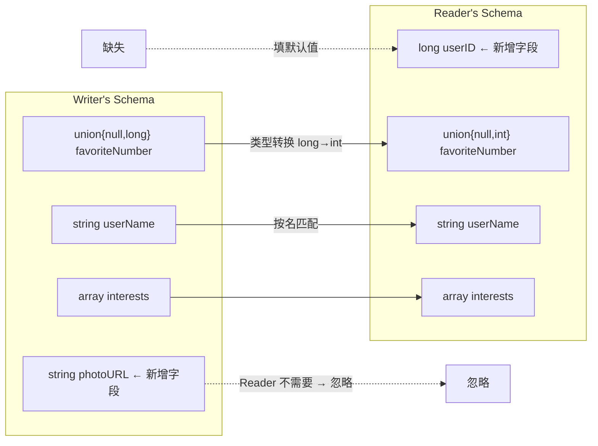

### Schema 演化规则

| 操作 | 规则 | 兼容性 |
|------|------|--------|
| **添加字段** | 必须有默认值 | 向后 ✅ 向前 ✅ |
| **删除字段** | 被删字段必须之前有默认值 | 向后 ✅ 向前 ✅ |
| **添加无默认值字段** | ❌ 新 reader 读不了旧数据 | 破坏向后兼容 |
| **删除无默认值字段** | ❌ 旧 reader 读不了新数据 | 破坏向前兼容 |
| **改字段名** | 可用 aliases 保持兼容 | 向后 ✅ 向前 ❌ |
| **改字段类型** | Avro 可做类型转换 | 取决于具体类型 |

**Null 的处理**：Avro 不默认允许 null。要允许 null，必须用 union type：`union { null, long, string }`。null 只能作为第一个分支的默认值。这比"所有字段默认 nullable"更安全 [19]。

### Writer's Schema 如何传递？

读者需要知道 writer's schema，但不能每条记录都附带完整 schema。三种场景：

| 场景 | 方案 |
|------|------|
| **大文件（批量）** | 文件头写一次 schema（Avro object container file 格式） |
| **数据库单条记录** | 每条记录开头存 schema 版本号 → 从 **Schema Registry** 查询 writer's schema（Confluent [20], LinkedIn Espresso [21]） |
| **网络通信** | 连接建立时协商 schema 版本（Avro RPC） |

### 动态生成 Schema：Avro 的独特优势

**问题**：将关系数据库 dump 为二进制格式。

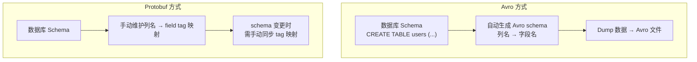

Avro 用字段名（而非数字 tag）标识字段 → 从数据库 schema **自动**生成 Avro schema，无需手动维护映射。数据库加减列时，Avro schema 自动跟着变，reader's schema 按名匹配即可。

这是 Protobuf 做不到的——Protobuf 的 field tag 需要手动分配和维护。

### Schema 的价值

尽管 JSON/XML 也能用，但 schema-based 二进制格式（Protobuf, Avro）提供更强的保障：

1. **更紧凑**：省略字段名，编码仅为值
2. **Schema 即文档**：强制维护最新 schema，不会与实际数据脱节
3. **兼容性检查**：在部署前自动检测向前/向后兼容性
4. **代码生成**：从 schema 自动生成类型安全的代码（静态语言友好）
5. **等价于 schema-on-read 的灵活性**：但有更好的工具保障
## 5.5 数据流模式：通过数据库

### 数据库 = 给未来的自己发消息

存储数据到数据库，就像是给**未来的自己**（或未来版本的代码）发消息。向后兼容是必需的——否则你将无法读取自己之前写入的数据。

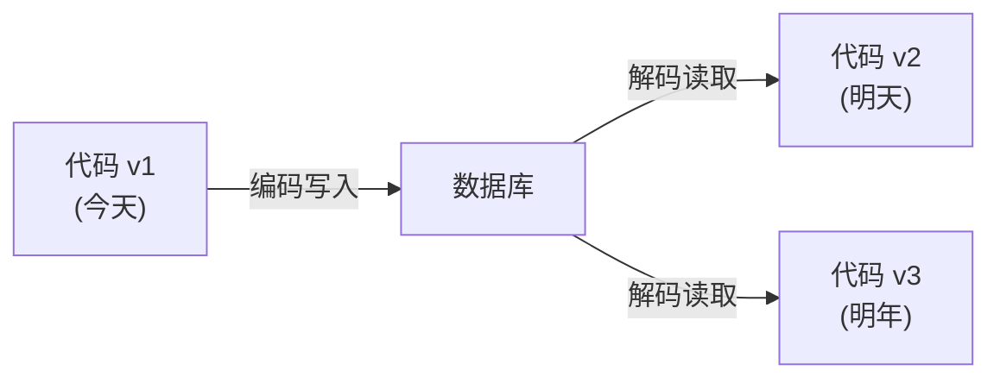

在滚动升级期间，数据库可能同时被新旧版本的代码访问 → **向前兼容**也是必要的。

### Data Outlives Code

> **"数据比代码活得更久"**

部署新版代码只需几分钟（服务端）。但数据库中的数据可能跨越多年——5 年前写入的数据仍然以当时的格式存储。

**数据库的 schema 演化策略**：
- **不重写旧数据**：大多数关系数据库（如 PostgreSQL）在 `ALTER TABLE ADD COLUMN` 时不重写现有行，而是在读取时为缺失列填 null
- **LSM-Tree 引擎**：compaction 时自然用最新格式重写数据
- **显式迁移**：代价高昂，通常异步执行、尽力而为 [28]

### Archival Storage（归档存储）

定期将数据库快照导出为归档格式（备份或导入数据仓库）时：
- 可以用**最新 schema** 统一编码，即使源数据库包含多个历史 schema 版本
- 数据一次性写入且不可变 → **Avro object container file** 非常合适
- 也适合转为列式格式（如 Parquet）供分析使用
## 5.6 数据流模式：REST 与 RPC

### Web Services

通过网络通信时，最常见的模式是客户端-服务端（C/S）。HTTP 上的 API 称为 **Web Service**。

**三种常见的 Web Service 场景**：

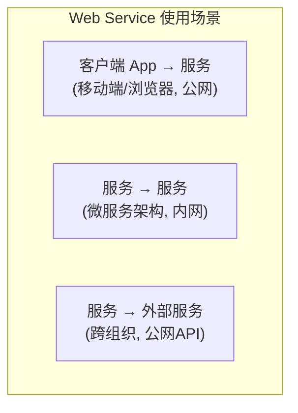

### REST vs RPC

**REST** (Representational State Transfer) [31, 32]：
- 建立在 HTTP 原则之上：URL 标识资源、HTTP 方法表示操作
- 简单的数据格式（通常 JSON）
- 利用 HTTP 特性：缓存、内容协商、认证
- 服务定义：**OpenAPI** (Swagger) [33]

**RPC** (Remote Procedure Call) [38]：
- 试图让远程调用看起来像本地函数调用（location transparency）
- 由来已久：EJB, RMI, DCOM, CORBA [34], SOAP, WS-* [35, 36, 37]
- 现代版本：**gRPC**（基于 Protobuf）, Avro RPC

### RPC 的根本问题

**远程调用与本地调用有本质区别** [39, 40]：

| 方面 | 本地调用 | 远程调用 |
|------|---------|---------|
| **可预测性** | 成功或失败，明确 | 可能丢请求、丢响应、超时 |
| **结果确定性** | 必定返回结果（或异常） | 可能没有结果（timeout），不知是否执行 |
| **重试安全性** | 无需重试 | 重试可能导致重复执行 → 需要**幂等性** [41] |
| **延迟** | 纳秒级，稳定 | 毫秒级，波动极大 |
| **参数传递** | 指针/引用 | 必须序列化为字节 |
| **类型系统** | 同一语言 | 跨语言需类型转换（如 JS 的 2^53 问题） |

> REST 的优势在于**不伪装成本地调用**——它明确地把远程通信当作状态转移，而非函数调用。

### 服务发现与负载均衡

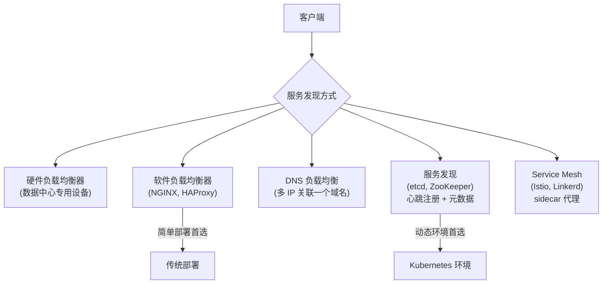

### RPC 的兼容性

数据流通过服务时，可以做一个简化假设：**服务端先升级，客户端后升级**。

| 方向 | 需要的兼容性 |
|------|------------|
| 请求（client → server） | **向后兼容**（新服务端读旧请求） |
| 响应（server → client） | **向前兼容**（旧客户端读新响应） |

- gRPC → 使用 Protobuf 的兼容性规则
- REST → 添加可选请求参数、添加响应字段通常是兼容的

### API 版本控制

跨组织的 API 提供者**无法强制客户端升级** → 可能需要长期维护多个 API 版本。

常见策略：
- URL 中嵌入版本号：`/api/v1/users`
- HTTP Accept 头：`Accept: application/vnd.myapi.v2+json`
- API Key 绑定版本 [44]
## 5.7 数据流模式：消息传递、工作流与 Actor

### 消息传递 vs RPC

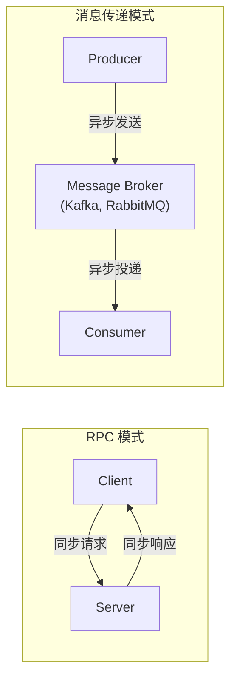

**消息 broker 相比直接 RPC 的优势**：

1. **缓冲**：接收方不可用时，broker 暂存消息，提高可靠性
2. **自动重投**：消费者崩溃后可重新投递消息
3. **无需服务发现**：发送方不需知道接收方地址
4. **一对多**：一条消息可发给多个订阅者
5. **解耦**：发送方不关心谁消费消息

**通信是异步的**：发送方发完即忘（fire-and-forget），不等回复。

### Message Broker

| 代际 | 代表 | 特点 |
|------|------|------|
| 商业软件 | TIBCO, IBM WebSphere, webMethods | 企业级，昂贵 |
| 开源 | RabbitMQ, ActiveMQ, HornetQ, NATS, Redpanda, **Apache Kafka** | 广泛采用 |
| 云服务 | Amazon Kinesis, Azure Service Bus, Google Cloud Pub/Sub | 托管服务 |

**两种消息分发模式**：

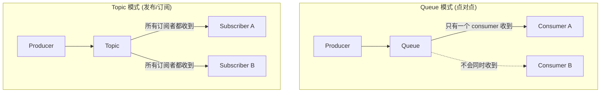

**Schema 管理**：broker 不关心消息格式（只是字节序列），但通常搭配 **Schema Registry** [20, 22] 管理 Protobuf/Avro/JSON schema 的版本和兼容性。**AsyncAPI** 是消息传递领域的 OpenAPI 等价物。

**消息持久性**：
- 大多数 broker 将消息写盘（崩溃不丢失）
- 消费后通常删除（与数据库不同）
- 某些 broker（Kafka）可配置为永久保留（支持 Event Sourcing）

> ⚠️ 消费者将消息 republish 到另一个 topic 时，需注意保留未知字段——否则会出现 Figure 5-1 的数据丢失问题。

### Durable Execution 与 Workflow

**场景**：支付处理需要调用多个服务（风控、扣款、入账），如果中间步骤失败怎么办？

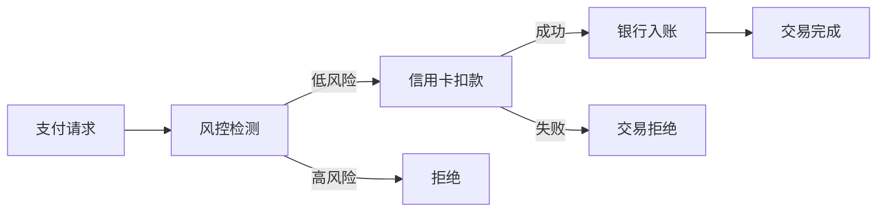

**Workflow Engine** 管理这种多步骤流程：

| 类型 | 代表 | 特点 |
|------|------|------|
| **ETL/数据编排** | Airflow, Dagster, Prefect | 编排数据管道 |
| **图形化流程** | Camunda, Orkes | BPMN 可视化定义 |
| **Durable Execution** | **Temporal** [46], Restate [47] | 代码即工作流，exactly-once 语义 |

**Durable Execution 的核心思想**：

框架（如 Temporal）将所有 RPC 调用和状态变更记录到 **持久日志**（类似 WAL）。如果任务失败：
- 框架重新执行工作流
- **跳过已成功的步骤**（不重复 RPC 调用，直接返回之前的结果）
- 从失败点继续

→ 实现 **exactly-once semantics**（精确一次语义）

**Durable Execution 的注意事项**：
- 代码必须是**确定性的**：不能使用随机数生成器、系统时钟等（框架提供替代实现）[49]
- 外部服务必须提供**幂等 API** [48]
- 修改已运行的 workflow 代码要小心：旧的 workflow 实例应继续用旧代码，新实例用新代码 [50]

### Distributed Actor Frameworks

**Actor 模型**：一种并发编程模型，用"消息传递"替代"共享内存 + 锁"。

| 概念 | 说明 |
|------|------|
| **Actor** | 一个封装了本地状态的实体，每次处理一条消息 |
| **通信** | Actor 之间通过异步消息交互（无共享状态） |
| **调度** | 每个 Actor 独立调度，无需担心线程安全 |

**分布式 Actor** 扩展到多节点——消息可以透明地在本地或网络上传递：

| 框架 | 语言 | 说明 |
|------|------|------|
| **Akka** | Scala/Java | JVM 生态最流行 |
| **Orleans** [52] | C# | Microsoft 开发，"虚拟 Actor"概念 |
| **Erlang/OTP** | Erlang | Actor 模型的鼻祖之一 |

**Actor + 编码兼容性**：滚动升级时，新旧版本的 Actor 共存 → 消息格式需要向前/向后兼容，使用本章讨论的编码格式（Protobuf, Avro 等）。

> Actor 模型的 location transparency（位置透明）比传统 RPC 更好——因为 Actor 本身就假设消息可能丢失，不伪装成本地调用。

---

## 💻 代码示例与最佳实践

### 示例1：Protobuf Schema 演化实战

```protobuf
// v1: 初始 schema
syntax = "proto3";

message UserProfile {
    string name = 1;
    string email = 2;
    int32  age = 3;
}

// v2: 添加字段（向前+向后兼容 ✅）
message UserProfile {
    string name = 1;
    string email = 2;
    int32  age = 3;
    string avatar_url = 4;    // 新增：旧代码忽略此字段
    repeated string tags = 5; // 新增：旧代码忽略此字段
}

// v3: 删除字段（注意保留 tag）
message UserProfile {
    string name = 1;
    string email = 2;
    reserved 3;               // age 已删除，tag 3 永不重用
    reserved "age";           // 字段名也保留
    string avatar_url = 4;
    repeated string tags = 5;
}
```

### 示例2：Avro Schema 演化

```json
// Writer's schema (v1)
{
  "type": "record",
  "name": "UserProfile",
  "fields": [
    {"name": "name",  "type": "string"},
    {"name": "email", "type": "string"},
    {"name": "age",   "type": ["null", "int"], "default": null}
  ]
}

// Reader's schema (v2) — 添加了 avatar_url，删除了 age
{
  "type": "record",
  "name": "UserProfile",
  "fields": [
    {"name": "name",       "type": "string"},
    {"name": "email",      "type": "string"},
    {"name": "avatar_url", "type": ["null", "string"], "default": null}
  ]
}
// Avro 解码时: age 字段被忽略, avatar_url 填默认值 null → 兼容!
```

### 示例3：OpenAPI + FastAPI 服务定义

```python
from fastapi import FastAPI
from pydantic import BaseModel

app = FastAPI(title="User Service", version="2.0.0")

class UserProfile(BaseModel):
    name: str
    email: str
    avatar_url: str | None = None  # v2 新增，可选字段 → 兼容

class UserProfileV1(BaseModel):  # 保留旧版本响应模型
    name: str
    email: str

@app.get("/api/v2/users/{user_id}", response_model=UserProfile)
async def get_user_v2(user_id: int):
    ...

@app.get("/api/v1/users/{user_id}", response_model=UserProfileV1)
async def get_user_v1(user_id: int):
    ...  # 旧版 API 继续维护
```

### 最佳实践

| 场景 | 推荐格式 | 原因 |
|------|---------|------|
| 微服务内部通信 | **gRPC (Protobuf)** | 高效二进制、强类型、schema 演化清晰 |
| 公开 REST API | **JSON + OpenAPI** | 可读性好、工具生态丰富、浏览器友好 |
| 大数据批处理 / 数据湖 | **Avro** 或 **Parquet** | 动态 schema、与 Hadoop/Spark 集成好 |
| 消息队列消息格式 | **Protobuf / Avro + Schema Registry** | 兼容性自动检查 |
| 前后端通信 | **JSON** (可选 JSON Schema) | 最广泛支持、调试方便 |
| 临时/内部存储 | **别用语言特定格式** | 避免语言锁定和安全风险 |

---

## 🎯 系统设计面试题

### 面试题1：如何实现零停机的滚动升级？

**题目**: 你的服务有 100 个实例，需要从 v1 升级到 v2。v2 的 API 新增了一个 `priority` 字段。如何确保升级过程中不中断服务？

**思路分析**:

| 步骤 | 措施 | 说明 |
|------|------|------|
| 1 | v2 的 `priority` 字段必须有默认值 | 向后兼容：v2 代码读 v1 数据时填默认值 |
| 2 | v1 代码必须忽略未知字段 | 向前兼容：v1 读 v2 写入的含 priority 的数据时跳过 |
| 3 | v1 代码读写时必须保留未知字段 | 避免 Figure 5-1 的数据丢失问题 |
| 4 | 先升级服务端，再升级客户端 | 请求需向后兼容，响应需向前兼容 |
| 5 | 数据库：`ALTER TABLE ADD COLUMN priority DEFAULT null` | 不重写旧行，读时填 null |

### 面试题2：Protobuf vs Avro vs JSON，如何选择？

**参考答案**:

| 维度 | JSON | Protobuf | Avro |
|------|------|----------|------|
| 可读性 | ✅ 人类可读 | ❌ 二进制 | ❌ 二进制 |
| 紧凑度 | 较差 (81B) | 好 (33B) | 最好 (32B) |
| Schema 必需 | 可选 | 必需 | 必需 |
| 字段标识 | 字段名 | field tag (数字) | 字段名 |
| 动态 schema | ✅ 天然支持 | ❌ 需手动维护 tag | ✅ 可从 DB schema 自动生成 |
| 兼容性检查 | 手动/工具 | Schema 内置规则 | Schema 内置规则 |
| 生态 | 最广泛 | gRPC、Google 全家桶 | Hadoop/Kafka 生态 |

**选型建议**：公开 API → JSON；内部微服务 → Protobuf (gRPC)；大数据管道 → Avro

### 面试题3：消息队列 vs RPC，什么时候用哪个？

**参考答案**:

| 维度 | RPC (REST/gRPC) | Message Queue |
|------|-----------------|---------------|
| 通信模式 | 同步（请求-响应） | 异步（fire-and-forget） |
| 耦合度 | 强（需要知道对方地址） | 弱（通过 broker 解耦） |
| 可靠性 | 依赖重试 + 超时 | broker 缓冲 + 自动重投 |
| 适用场景 | 需要立即得到结果 | 可以延迟处理、需要削峰 |
| 一对多 | 不支持（需单独调用每个接收方） | 天然支持（pub/sub） |
| 流量突刺 | 可能压垮下游 | broker 天然削峰 |

---

## 📝 本章要点总结

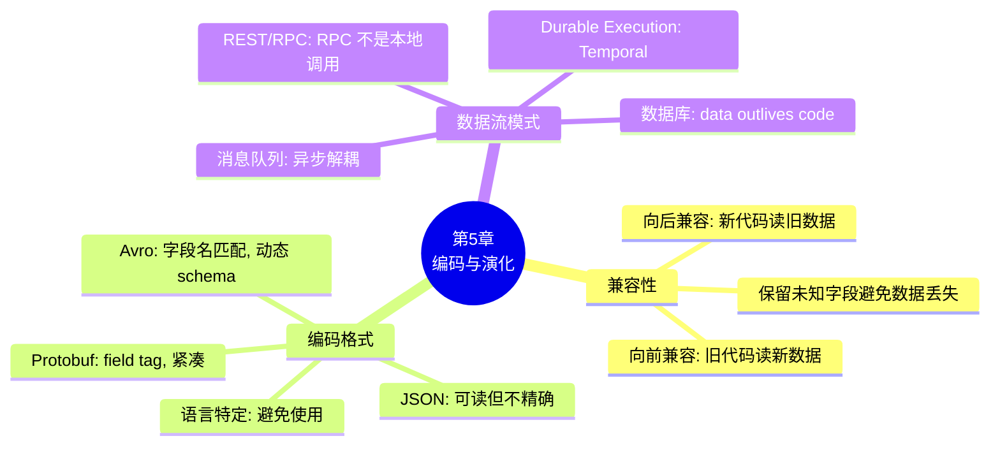

### 核心主线

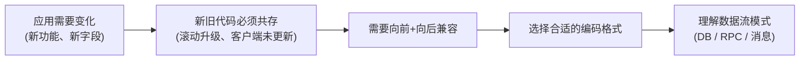

### 八大 Takeaways

1. **向后兼容容易，向前兼容难**：新代码读旧数据只需显式处理；旧代码读新数据需要能忽略未知字段

2. **不要用语言特定序列化**：语言锁定、安全漏洞（反序列化攻击）、无兼容性保证

3. **JSON 够用但不精确**：不区分整数/浮点、大数精度丢失、无二进制字符串支持；JSON Schema 可弥补部分不足

4. **Protobuf 用 field tag 替代字段名**：极紧凑（33 bytes vs 81 bytes JSON），tag 号不能改、不能重用

5. **Avro 用字段名匹配 writer/reader schema**：最紧凑（32 bytes），天然适合动态生成 schema（如数据库 dump）

6. **数据比代码活得更久（data outlives code）**：5 年前的数据仍以旧格式存储，数据库的 schema 演化策略必须考虑这一点

7. **RPC 不是本地调用**：网络不可靠、延迟不可预测、需要幂等性设计——REST 更诚实地面对这些问题

8. **消息传递提供解耦和缓冲**：异步、一对多、削峰；Durable Execution（Temporal）进一步提供 exactly-once 语义

### 连接下一章

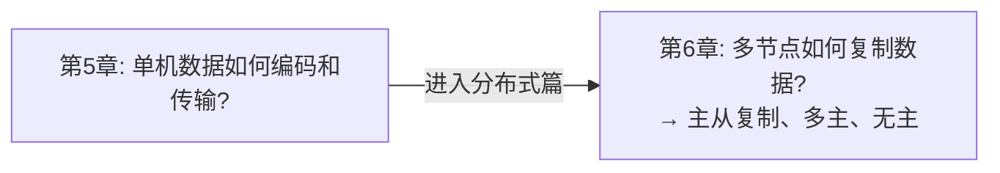
