# 第6章：复制 (Replication)

> *"The major difference between a thing that might go wrong and a thing that cannot possibly go wrong is that when a thing that cannot possibly go wrong goes wrong, it usually turns out to be impossible to get at or repair."*
> — Douglas Adams, *Mostly Harmless* (1992)

---

## 📚 核心论文与参考文献

### 必读论文

| # | 论文/资料 | 作者 | 核心内容 | 链接 |
|---|---------|------|--------|------|
| [1] | "Notes on Distributed Databases" | Lindsay et al. (IBM) | 分布式数据库早期研究（1979） | [perma.cc/EPZ3-MHDD](https://perma.cc/EPZ3-MHDD) |
| [5] | "Amazon DynamoDB: A Scalable, Predictably Performant, and Fully Managed NoSQL Database Service" | Elhemali et al. | DynamoDB 架构（2022） | [USENIX ATC 2022](https://www.usenix.org/conference/atc22) |
| [6] | "CockroachDB: The Resilient Geo-Distributed SQL Database" | Taft et al. | CockroachDB 地理分布架构 | [doi:10.1145/3318464.3386134](https://doi.org/10.1145/3318464.3386134) |
| [14] | "GitHub Availability This Week" | Jesse Newland | GitHub MySQL Failover 事故 | [perma.cc/3YRF-FTFJ](https://perma.cc/3YRF-FTFJ) |
| [22] | "Replicated Data Consistency Explained Through Baseball" | Doug Terry | 用棒球比赛解释一致性级别（经典） | [perma.cc/F4KZ-AR38](https://perma.cc/F4KZ-AR38) |
| [23] | "Session Guarantees for Weakly Consistent Replicated Data" | Terry et al. | Read-your-writes 等会话保证 | [doi:10.1109/PDIS.1994.331722](https://doi.org/10.1109/PDIS.1994.331722) |
| [45] | "Dynamo: Amazon's Highly Available Key-Value Store" | DeCandia et al. | 原始 Dynamo 论文（经典） | [doi:10.1145/1323293.1294281](https://doi.org/10.1145/1323293.1294281) |
| [46] | "Conflict-Free Replicated Data Types" | Shapiro et al. | CRDT 原始论文 | [doi:10.1007/978-3-642-24550-3_29](https://doi.org/10.1007/978-3-642-24550-3_29) |
| [47] | "Operational Transformation in Real-Time Group Editors" | Sun & Ellis | OT 算法（经典） | [doi:10.1145/289444.289469](https://doi.org/10.1145/289444.289469) |
| [58] | "Time, Clocks, and the Ordering of Events in a Distributed System" | Leslie Lamport | Lamport 时钟（经典中的经典） | [doi:10.1145/359545.359563](https://doi.org/10.1145/359545.359563) |

### 中文资源

- Dynamo 论文中文翻译：搜索「Dynamo 论文 中文翻译」
- CRDT 入门：搜索「CRDT 冲突无关数据类型 入门」
- Raft 共识算法可视化：[The Secret Lives of Data](http://thesecretlivesofdata.com/raft/)
- 分布式系统中的时钟问题：搜索「Lamport 时钟 向量时钟 入门」

---

## 🗺️ 章节概览

本章是分布式篇的第一章，解决核心问题：**如何在多台机器上保持同一份数据的副本？** 这是后续所有分布式话题（分片、事务、共识）的基础。

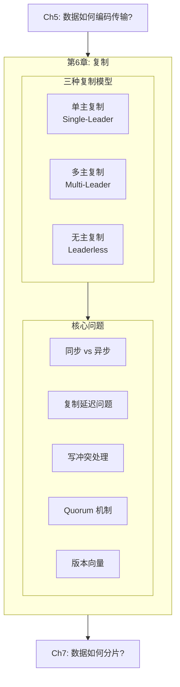

### 本章结构一览

| 小节 | 主题 | 关键概念 |
|------|------|---------|
| 6.1 | 单主复制基础 | Leader/Follower、同步/异步/半同步 |
| 6.2 | 故障处理与复制日志 | Failover、WAL shipping、逻辑复制、CDC |
| 6.3 | 复制延迟问题 | Read-your-writes、单调读、一致前缀读 |
| 6.4 | 多主复制 | 跨地域、Sync Engine、Local-first |
| 6.5 | 写冲突处理 | LWW、手动合并、CRDT、OT |
| 6.6 | 无主复制 | Dynamo-style、Read repair、Hinted handoff |
| 6.7 | Quorum 与一致性 | w+r>n、Quorum 的局限、监控 |
| 6.8 | 并发写检测 | Happens-before、Version vectors |
## 6.1 单主复制基础 (Single-Leader Replication)

### 为什么要复制？

| 目的 | 说明 |
|------|------|
| **低延迟** | 将数据放在离用户地理位置近的地方 |
| **高可用** | 部分节点故障时系统继续工作 |
| **读扩展** | 增加读副本来分担读负载 |

> 本章假设数据集足够小，每台机器可以保存完整数据副本。Ch7 将讨论数据太大时如何分片。

### 复制的核心难题

复制静态数据很简单——复制一次即可。**真正的难题是处理数据变化（changes）**。

### 单主复制模型

最常见的复制方式，也叫 leader-based / primary-backup / active-passive：

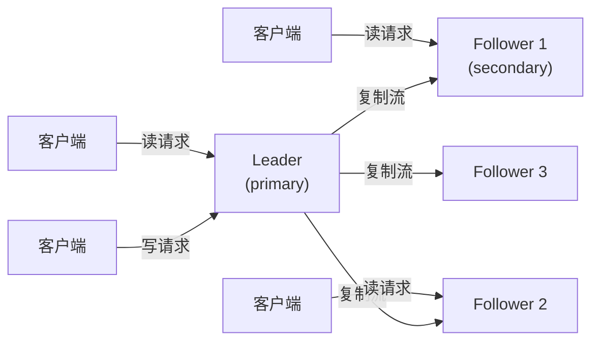

**规则**：
1. 一个副本被指定为 **Leader**——所有写入必须通过它
2. 其他副本是 **Follower**——从 Leader 接收复制日志（replication log / change stream），按同样顺序应用
3. 读请求可以发给 Leader 或任何 Follower

**广泛使用**：PostgreSQL, MySQL, MongoDB, Kafka, Raft (CockroachDB, TiDB, etcd), RabbitMQ 等。

### 同步 vs 异步复制

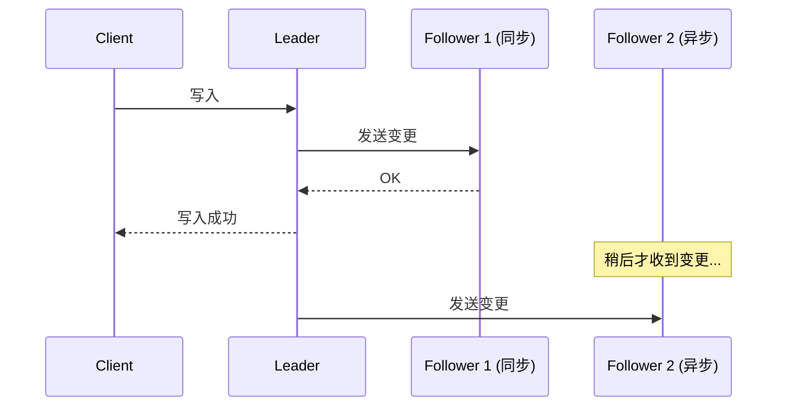

| 模式 | 描述 | 优点 | 缺点 |
|------|------|------|------|
| **同步** | Leader 等待 Follower 确认后才回复客户端 | Follower 数据保证最新；Leader 故障时数据不丢 | 任何一个同步 Follower 卡住 → 整个系统阻塞 |
| **异步** | Leader 不等确认直接回复客户端 | 写入不被慢 Follower 阻塞 | Leader 故障时未复制的写入可能丢失 |
| **半同步** | 一个 Follower 同步，其余异步；同步的挂了则切换另一个为同步 | 至少 2 个节点有最新数据 | 复杂度适中 |

> **实践中**：完全同步不现实（一个节点故障拖垮全局），完全异步有丢数据风险。大多数系统使用半同步或 Quorum 方式（后述）。

### Backup vs Replication

| | 备份 (Backup) | 复制 (Replication) |
|--|------|------|
| 目的 | 时间点回退、灾难恢复 | 高可用、读扩展、低延迟 |
| 时效 | 定期快照（可能滞后数小时） | 实时或近实时 |
| 误删恢复 | ✅ 可以回退到删除之前 | ❌ 删除操作也会被复制 |
| 互补性 | 二者互补，不能相互替代 | |
## 6.2 故障处理与复制日志实现

### 添加新 Follower（无停机）

| 步骤 | 操作 |
|------|------|
| 1 | 对 Leader 拍一致性快照（不加锁，大多数数据库内置） |
| 2 | 将快照复制到新 Follower |
| 3 | Follower 连接 Leader，请求快照之后的所有变更（通过 log sequence number / binlog coordinates / GTID） |
| 4 | Follower 追上 Leader = caught up，开始正常接收实时变更流 |

### 故障处理

#### Follower 故障：Catch-up Recovery

Follower 在本地日志中知道最后处理到哪个位置。重启后从该位置向 Leader 请求后续变更，追上即可。

#### Leader 故障：Failover

Leader 故障处理远比 Follower 复杂——需要 **Failover（故障切换）**：

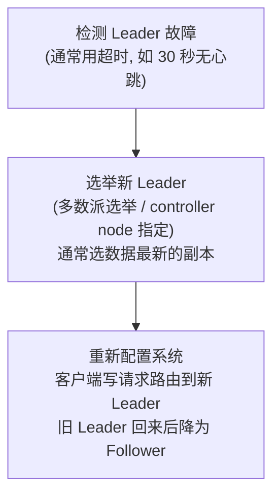

**Failover 可能出的问题：**

| 问题 | 说明 | 后果 |
|------|------|------|
| **未复制的写入丢失** | 异步复制时，新 Leader 可能缺少旧 Leader 最后几个写入 | 数据丢失；常见做法是丢弃旧 Leader 的未复制写入 |
| **Split Brain** | 两个节点都认为自己是 Leader | 同时接受写入 → 数据冲突/损坏 |
| **外部系统不一致** | GitHub 事故 [14]：新 Leader 的自增 ID 回退，与 Redis 缓存冲突 | 用户隐私数据泄露 |
| **超时设置两难** | 太短 → 不必要的 failover（网络抖动）；太长 → 恢复慢 | 都有代价 |

> **Split Brain 防护**：称为 **fencing**——发现两个 Leader 时强制关掉一个。但如果机制设计不好，可能关掉两个（更糟）[15]。

### 复制日志的实现方式

| 方式 | 原理 | 优点 | 缺点 | 代表 |
|------|------|------|------|------|
| **Statement-based** | 转发 SQL 语句（INSERT/UPDATE/DELETE） | 简单紧凑 | 非确定性函数(NOW/RAND)、执行顺序依赖、副作用 | MySQL < 5.1 |
| **WAL shipping** | 转发物理 WAL（字节级磁盘块变更） | 实现简单 | 与存储引擎紧耦合 → 不能主从跑不同版本（零停机升级困难） | PostgreSQL, Oracle |
| **Logical (row-based) log** | 行级逻辑变更（插入的新值、删除的 key、更新的新旧值） | 与存储引擎解耦 → 可跨版本；对外部消费友好 | 额外维护逻辑日志 | MySQL binlog (row), PostgreSQL logical replication |
| **Trigger-based** | 应用层触发器/存储过程捕获变更 | 最灵活（可自定义逻辑） | 开销大、易出 bug | Databus, Bucardo |

### 逻辑复制与 CDC

**逻辑日志**的一大优势是可以被外部系统消费——将数据库变更发送到数据仓库、搜索引擎、缓存等。这种技术叫做 **Change Data Capture (CDC)** [21]，Ch12 将深入讨论。

### 对象存储上的数据库 (Zero-Disk Architecture)

新趋势：数据库将所有数据存储在对象存储（S3/GCS）上，利用对象存储的高持久性和多区域复制，简化复制和 Leader 选举：

| 优势 | 说明 |
|------|------|
| 低成本 | 冷数据放对象存储，热数据用 SSD/内存缓存 |
| 高持久性 | 对象存储自带多区域复制 |
| 简化架构 | 利用 conditional write (CAS) 实现 Leader 选举 |
| 数据集成 | 多个数据库共享同一对象存储 (Parquet/Iceberg) |

代表：Neon (PostgreSQL)、WarpStream、Confluent Freight、Buf's Bufstream、Redpanda Serverless、SlateDB。这种架构称为 **Zero-Disk Architecture (ZDA)**。
## 6.3 复制延迟问题 (Problems with Replication Lag)

### 为什么会有延迟？

单主复制中，所有写入经过 Leader，读请求可分发到 Follower（read scaling）。但只有异步复制才能支持 read scaling（同步复制下任何 Follower 故障都会阻塞写入）。

**Replication lag**：Follower 落后于 Leader 的时间差。正常情况下毫秒级，但网络拥塞或高负载时可达秒级甚至分钟级。

这引出了 **最终一致性（eventual consistency）** [22, 24]——如果停止写入并等待足够久，所有副本最终一致。但"足够久"可能很长。

### 三种经典异常

#### 异常1：读不到自己的写入

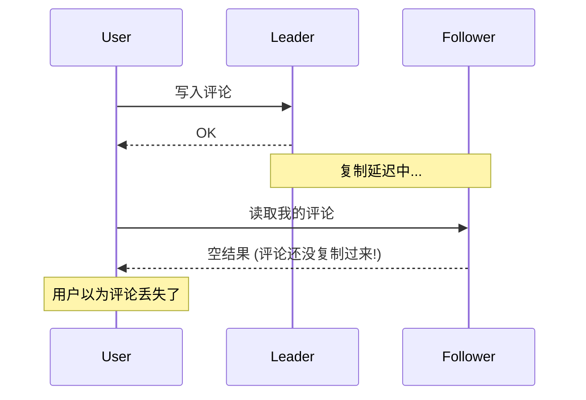

**解决方案：Read-after-write consistency（读己之写一致性）** [23]

| 策略 | 适用场景 |
|------|---------|
| 用户读自己修改的数据时，从 Leader 读 | 用户明确修改了某内容（如个人主页） |
| 最近 1 分钟内有写入 → 从 Leader 读 | 无法明确判断什么被修改时 |
| 客户端记住最后写入的时间戳，要求副本至少追到该时间戳 | 使用逻辑时间戳（如 log sequence number） |

**跨设备问题**：用户在手机上写入，在电脑上查看——需要集中式元数据来追踪最后写入时间戳；且可能需要路由到同一区域。

#### 异常2：时间倒流（Monotonic Reads）

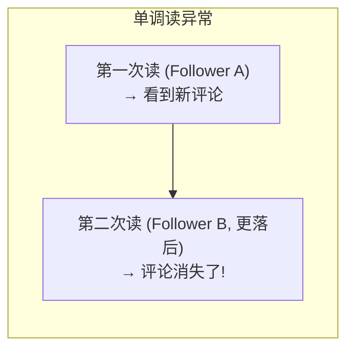

用户先读到较新的 Follower，再读到较旧的 Follower，仿佛时间倒退了。

**解决方案：Monotonic reads（单调读）**

保证用户的连续读取不会看到时间倒退。实现方式：让同一用户的读请求始终路由到同一个副本（如基于 user ID 的 hash）。

#### 异常3：因果倒置（Consistent Prefix Reads）


原因：写入 Q 和 A 经由不同 shard 的 Leader，复制到 Follower 的延迟不同 → 观察者看到因果顺序颠倒。

**解决方案：Consistent prefix reads（一致前缀读）**

保证因果相关的写入按正确顺序被观察到。实现方式：将因果相关的写入路由到同一个分片（但不总是高效）；或使用版本向量跟踪因果依赖（后述）。

### 更好的解决方案

应用层处理这些问题很复杂且容易出错。更好的方式是选择提供**强一致性保证**的数据库（如线性一致性 Ch10 + ACID 事务 Ch8），让数据库对应用透明地处理这些问题。

> 过去 NoSQL 运动认为强一致性和可扩展性不可兼得，但现在 NewSQL（CockroachDB、YugabyteDB 等）已经证明二者可以共存。
## 6.4 多主复制 (Multi-Leader Replication)

### 为什么需要多主？

单主复制的限制：所有写入必须经过唯一的 Leader。如果 Leader 所在区域不可达，写入就无法进行。

多主复制（也称 active-active / bidirectional）：允许多个节点接受写入，每个 Leader 异步复制给其他 Leader。

> **同步多主 ≈ 单主**：如果两个 Leader 之间的复制是同步的，网络中断时其中一个无法写入，等同于单主。因此多主复制通常是**异步**的。

### 多主复制的使用场景

#### 场景1：跨地域部署（Geo-Distributed）

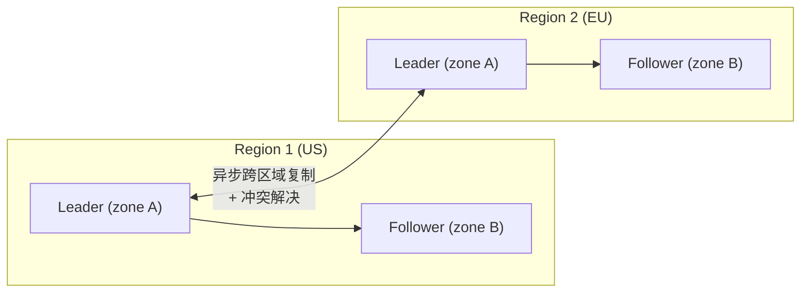

| 维度 | 单主（跨地域） | 多主（跨地域） |
|------|-------------|-------------|
| 写延迟 | 高（写入必须跨网络到 Leader 所在区域） | 低（写入到本地 Leader） |
| 区域容错 | Leader 区域挂了 → 需 failover | 每个区域独立写入，其他区域挂了不影响 |
| 网络容错 | 对跨区域链路敏感（同步等待） | 跨区域链路中断时各区域继续写入 |
| 一致性 | 可提供强一致性 | **弱**——需要冲突解决 |

#### 场景2：离线客户端 / Sync Engine

日历应用：在手机、笔记本、平板上都有数据副本，离线时照常编辑，上线后同步。

→ 每个设备就是一个 "Leader"，每个设备都可独立写入 → 本质上是极端形式的多主复制，"网络延迟"可达数小时/天。

**Sync Engine**：管理这种同步的软件库：
- 专有后端：Google Firestore, Realm, Ditto
- Local-first 开源：PouchDB/CouchDB, Automerge, Yjs

#### 场景3：实时协作编辑

Google Docs、Figma、Linear——多用户同时编辑同一文件。每个浏览器 tab 就是一个"副本"，变更实时同步到其他用户。本质上也是多主复制。

### 多主复制的拓扑

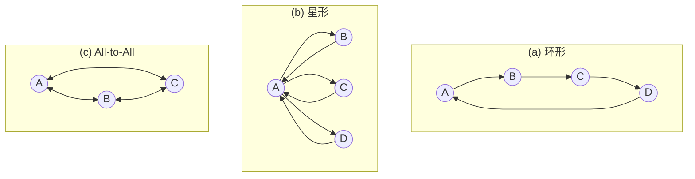

| 拓扑 | 容错性 | 问题 |
|------|--------|------|
| **环形** | 差：一个节点故障中断整个环 | 需手动重新配置 |
| **星形** | 差：中心节点故障影响全部 | 单点故障 |
| **All-to-all** | 好：消息可走多条路径 | 消息可能乱序到达（因果倒置问题，需 version vectors） |

> **多主复制被视为"危险领域"** [30]——自增 ID、触发器、完整性约束等容易出问题。能避免就避免。
## 6.5 写冲突处理 (Dealing with Conflicting Writes)

### 冲突的本质

多主复制最大的问题：两个 Leader 同时接受对同一记录的不同修改。

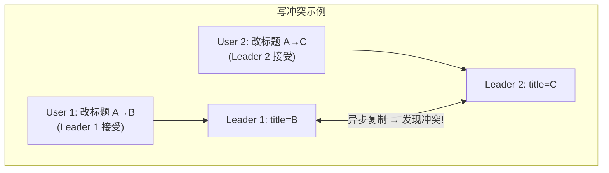

> **并发（concurrent）的定义**：两个操作互不知晓对方的存在——不是"同时发生"，而是"互相不知道"。即使相隔几分钟，只要一方不知道另一方的写入已经生效，就是并发。

### 冲突解决策略

#### 策略1：冲突避免 (Conflict Avoidance)

最简单的方法——避免冲突发生：
- 确保同一记录的所有写入都路由到同一个 Leader（如按 user ID 分配"home region"）
- 从单个用户视角看 = 单主

**局限**：当需要更换用户的 home region 时（区域故障或用户搬家），冲突避免就失效了。

#### 策略2：Last Write Wins (LWW)

给每个写入附加时间戳，总是保留最新时间戳的值：

| 时间戳 | 操作 | 结果 |
|--------|------|------|
| t=100 | User 1: title=B | |
| t=101 | User 2: title=C | C wins (timestamp 更大) |

**问题**：
- 并发写入的时间戳顺序本质上是**随机的**——某个写入被静默丢弃
- 依赖真实时钟同步 → 不可靠（Ch9 详述）
- 使用逻辑时钟（logical clock）可避免时钟问题

**适用场景**：仅当可以接受数据丢失时（如缓存），或者只做 INSERT 不做 UPDATE（唯一 key 不冲突）。

#### 策略3：手动合并 (Manual / Siblings)

保留所有冲突版本（称为 **siblings**），由应用代码或用户手动合并（类似 Git merge conflict）。

**Amazon 购物车的教训**：
- 两台设备并发修改购物车，合并时取集合并集
- Device 1 删除 Book, Device 2 删除 DVD → 合并后 Book 和 DVD 都回来了！
- 因为简单的集合并集无法正确处理删除操作

#### 策略4：自动冲突解决

使用算法自动合并冲突值，保证所有副本**收敛（converge）到同一状态** → **强最终一致性（strong eventual consistency）** [46]。

| 数据类型 | 合并策略 |
|---------|---------|
| **文本** | 检测字符级插入/删除，合并所有变更 |
| **列表/集合** | 跟踪元素的插入/删除，正确处理删除 |
| **计数器** | 合并各副本的增量和减量（不重复计算） |
| **Key-Value Map** | 对每个 key 独立应用冲突解决 |

两大算法族：

| 算法 | 原理 | 代表应用 |
|------|------|---------|
| **CRDT** (Conflict-free Replicated Data Types) [46] | 每个字符/元素有唯一不可变 ID，操作基于 ID 定位 → 无需变换 | Redis Enterprise, Riak, Azure Cosmos DB, Automerge, Yjs |
| **OT** (Operational Transformation) [47] | 记录操作的位置索引，远程操作到达时变换索引以适应本地已发生的变更 | Google Docs, ShareDB |

> 对于协作编辑和 local-first 应用，冲突解决是不可避免的，CRDT 和 OT 是目前最成熟的自动化方案。
## 6.6 无主复制 (Leaderless Replication)

### 核心思想

放弃 Leader 的概念——客户端直接向多个副本并行发送写入，从多个副本并行读取。

**历史**：早在 1970 年代就有无主系统 [1, 50]，后被关系数据库的主从模式取代。Amazon 的 **Dynamo** [45]（2007）使其重新流行 → Riak, Cassandra, ScyllaDB 受其启发，统称 **Dynamo-style**。

> ⚠️ Amazon DynamoDB 与原始 Dynamo 论文同名但架构完全不同——DynamoDB 使用单主复制（基于 Multi-Paxos） [5, 51]。

### 节点故障时的读写

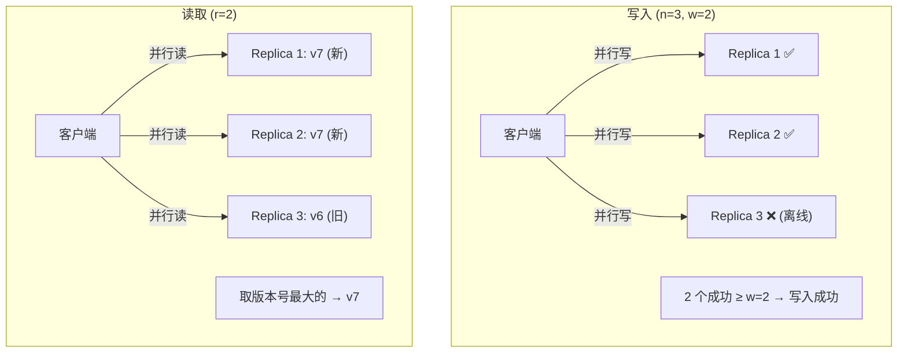

**关键特性**：无 failover——不需要选举新 Leader，节点恢复后自动追赶。

### 追赶缺失的写入

| 机制 | 原理 | 触发时机 |
|------|------|---------|
| **Read Repair** | 客户端读到旧值时，将新值写回落后的副本 | 每次读请求 |
| **Hinted Handoff** | 副本 A 代替不可用的副本 B 暂存写入，B 恢复后转交 | 写入时目标副本不可用 |
| **Anti-Entropy** | 后台进程比对副本差异，补齐缺失数据（无特定顺序） | 周期性后台任务 |

### 单主 vs 无主的性能对比

| 维度 | 单主 | 无主 |
|------|------|------|
| **一致性** | 可提供强一致性 | 通常是最终一致性 |
| **读扩展** | Follower 可分担读负载，但可能返回旧值 | 多副本并行读，取最新 |
| **尾延迟** | 受限于 Leader 性能；Follower 延迟只影响读 | **Request hedging** [56]：取最快响应的副本，显著降低尾延迟 |
| **Leader 故障** | 需要 failover（有风险） | 无 failover，天然处理节点故障 |
| **灰色故障** | 需判断是否触发 failover | 自然适应——慢节点的响应被快节点"覆盖" |
| **网络中断** | Leader 侧中断 → 系统不可写 | 只要有足够多的可达副本就能继续读写 |
## 6.7 Quorum 机制与一致性局限

### Quorum 公式

设 n 个副本，写入需 w 个确认成功，读取需查询 r 个副本：

> **只要 w + r > n，读写 quorum 必有重叠 → 至少一个节点有最新值**

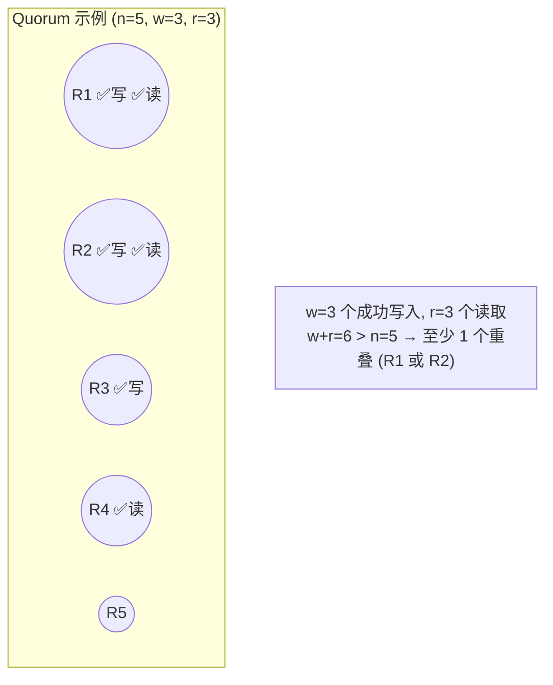

### 常见配置

| 配置 | w | r | 容错 | 适用场景 |
|------|---|---|------|---------|
| n=3, w=2, r=2 | 2 | 2 | 容忍 1 个节点故障 | 最常见的小集群配置 |
| n=5, w=3, r=3 | 3 | 3 | 容忍 2 个节点故障 | 更高可用 |
| w=n, r=1 | n | 1 | 写不容错，读很快 | 读多写少 |
| w=1, r=n | 1 | n | 写快但不持久，读慢 | 写多读少 |

### Quorum 的一致性局限

即使满足 w + r > n，以下边界情况仍可能读到旧值：

| 场景 | 说明 |
|------|------|
| **Sloppy quorum** | 网络分区时，写入到了非"正式"副本 (hinted handoff) → 读 quorum 不含这些临时副本 |
| **并发写读** | 写入进行中读取 → 可能读到部分写入的旧值 |
| **写入部分失败** | 写成功了 w-1 个但第 w 个失败 → 不回滚已成功的 → 后续读可能看到也可能看不到 |
| **节点恢复** | 携带新值的节点故障，从携带旧值的副本恢复 → 新值丢失，跌破 w |
| **LWW 时钟偏斜** | 使用真实时钟做 LWW，时钟不同步导致新值被旧时间戳覆盖 |

> **结论**：Quorum 不是强一致性的保证——它是一种**提高读到最新值概率**的机制。Dynamo-style 数据库主要面向可以容忍最终一致性的场景。

### 监控复制延迟

- **单主**：Leader 和 Follower 各自的 replication log 位置之差 = 复制延迟
- **无主**：没有固定的写入顺序 → 难以精确度量延迟；hinted handoff 数量是一个间接指标，但"最终一致性"的"最终"很模糊

### Sloppy Quorum

当网络分区导致客户端无法连接到足够多的"正式"副本时：

| 选择 | 行为 | 效果 |
|------|------|------|
| **严格 quorum** | 返回错误 | 强一致但不可用 |
| **Sloppy quorum** | 写入到任何可达节点（即使不是该 key 的正式副本） | 高可用但读可能不一致 |

Sloppy quorum + hinted handoff = "写入总是被接受，稍后再转交给正确的副本"。Riak 和 Dynamo 称之为 *consistency level ANY*。

### 多区域无主复制

Cassandra 和 ScyllaDB 支持跨区域的无主复制：
- 客户端写入本地区域的 coordinator node
- Coordinator 转发到本区域所有副本 + 其他区域每个的一个副本（由远程副本再分发）
- Quorum 可配置为全局 quorum（跨区域）或 local quorum（仅本区域，避免跨区域延迟但更可能读旧值）
## 6.8 检测并发写入与版本向量

### 并发的定义：Happens-Before 关系

两个操作 A 和 B 之间只有三种可能：

| 关系 | 定义 | 处理方式 |
|------|------|---------|
| A happens before B | B 知道 A 的存在并依赖于 A | B 覆盖 A（安全） |
| B happens before A | A 知道 B 的存在并依赖于 B | A 覆盖 B（安全） |
| A 和 B 并发 | 双方互不知晓 | **冲突——需要解决** |

> **关键洞察**：并发不是"同时发生"，而是"互相不知道"。即使相隔几分钟，只要操作 A 开始时不知道 B 的结果，它们就是并发的。这与物理学中的相对论有类似之处——信息传播速度有限 [58]。

### 版本号算法：单副本情况

服务器为每个 key 维护一个版本号（version number）：

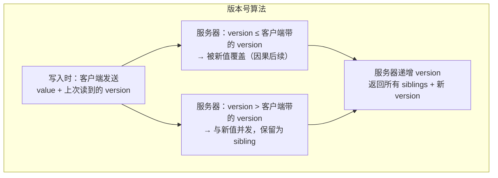

**购物车示例 (Figure 6-15)**：

| 步骤 | Client 1 | Client 2 | 服务器状态 |
|------|----------|----------|---------|
| 1 | +milk (v1) | | v1: {milk} |
| 2 | | +eggs (不知道 milk) | v2: {milk}, {eggs} (siblings) |
| 3 | +flour (基于 v1) | | v3: {milk,flour}, {eggs} |
| 4 | | +ham (基于 v2) | v4: {milk,flour}, {eggs,milk,ham} |
| 5 | +bacon (基于 v3, 合并 eggs) | | v5: {milk,flour,eggs,bacon}, {eggs,milk,ham} |

核心：客户端每次写入都带上之前读到的 version → 服务器知道哪些旧值可以安全覆盖，哪些是并发的（需保留为 siblings）。

### Version Vectors：多副本情况

单个版本号只适用于单副本。多副本时，需要**每个副本独立维护版本号**：

> **Version Vector** = 所有副本的版本号集合，如 `{R1: 5, R2: 3, R3: 7}`

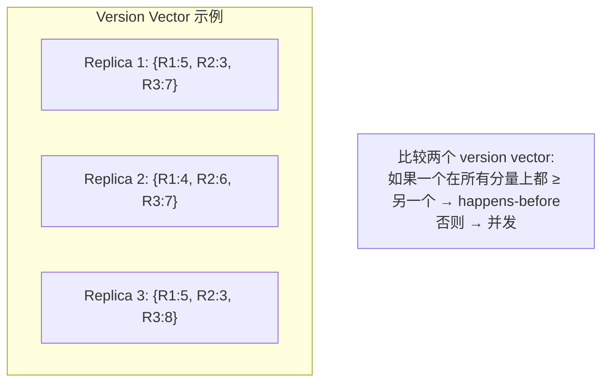

**判定规则**：
- `{R1:5, R2:3}` ≥ `{R1:4, R2:3}` → 前者 happens after 后者 → 安全覆盖
- `{R1:5, R2:3}` vs `{R1:4, R2:4}` → 互不支配 → **并发** → 需要冲突解决

Version vector 随读写请求在客户端和服务器之间传递（Riak 将其编码为字符串，称为 **causal context**），使数据库能区分覆盖和并发。

> ⚠️ Version vector 有时被错误地称为 vector clock。二者相似但不同——比较副本状态时应使用 version vector [61, 64, 65]。

---

## 💻 代码示例与最佳实践

### 示例1：PostgreSQL 流复制配置

```sql
-- Leader (postgresql.conf)
wal_level = replica
max_wal_senders = 10        -- 最多 10 个 follower 连接
synchronous_standby_names = 'follower1'  -- 半同步：follower1 是同步的

-- Follower (recovery.conf / standby.signal)
primary_conninfo = 'host=leader-host port=5432 user=replicator'
```

```bash
# 添加新 Follower（无停机）
pg_basebackup -h leader-host -D /var/lib/postgresql/data -Fp -Xs -P -R
# -R 自动创建 standby.signal 和 primary_conninfo
```

### 示例2：Cassandra Quorum 读写 (Python)

```python
from cassandra.cluster import Cluster
from cassandra.policies import DCAwareRoundRobinPolicy
from cassandra import ConsistencyLevel

cluster = Cluster(
    ['node1', 'node2', 'node3'],
    load_balancing_policy=DCAwareRoundRobinPolicy(local_dc='us-east')
)
session = cluster.connect('my_keyspace')

# Quorum 写 (w = n/2 + 1)
stmt = session.prepare("INSERT INTO users (id, name) VALUES (?, ?)")
stmt.consistency_level = ConsistencyLevel.QUORUM
session.execute(stmt, [user_id, name])

# Local quorum 读 (仅本数据中心)
stmt = session.prepare("SELECT * FROM users WHERE id = ?")
stmt.consistency_level = ConsistencyLevel.LOCAL_QUORUM
result = session.execute(stmt, [user_id])
```

### 最佳实践

| 场景 | 推荐复制模式 | 原因 |
|------|----------|------|
| 通用 OLTP（需强一致性） | **单主** (PostgreSQL, MySQL) | 简单可靠，事务支持好 |
| 跨地域低延迟写入 | **多主** (CockroachDB) 或 **无主** (Cassandra) | 写入到本地副本 |
| 离线/协作编辑 | **多主 + CRDT** (Automerge, Yjs) | 设备离线时可独立写入 |
| 高可用读密集 | **单主 + 读副本** | 读扩展简单 |
| 极端可用性要求 | **无主** (Cassandra/ScyllaDB) | 无 failover 开销 |

---

## 🎯 系统设计面试题

### 面试题1：设计一个跨地域的用户资料服务

**题目**: 用户分布在美国、欧洲、亚洲。要求：写延迟 < 50ms，读延迟 < 20ms，容忍单区域故障。

**思路分析**:

| 方案 | 写延迟 | 读延迟 | 一致性 | 复杂度 |
|------|--------|--------|--------|--------|
| 单主 (US) + 全球读副本 | 高 (跨洋) | 低 (本地读) | 强 (读 Leader 时) | 低 |
| 多主 (每区域一个 Leader) | 低 (本地写) | 低 | 弱 (需冲突解决) | 高 |
| 无主 (Cassandra, LOCAL_QUORUM) | 低 (本地写) | 低 | 最终一致 | 中 |

推荐：**用户资料极少被并发修改** → 用"冲突避免"策略（按 user ID 路由到 home region） + 多主复制。等价于对单个用户的单主，但跨用户的多主。

### 面试题2：GitHub Failover 事故分析

**题目**: 2012年 GitHub 的 MySQL follower 被提升为新 leader，但其自增 ID 计数器落后于旧 leader，导致新 leader 分配了与旧 leader 已分配的重复主键。这些主键也被 Redis 使用，导致用户看到了其他人的数据。如何防范？

**参考答案**:
1. 使用 UUID 或 ULID 替代自增 ID → 避免 ID 冲突
2. Failover 时检查新旧 Leader 的 replication log 位置差距 → 差距过大则拒绝 failover
3. 使用 Raft/Paxos 共识协议（如 CockroachDB）→ 只有数据最新的节点能成为 Leader
4. 外部系统（Redis）和数据库之间的一致性 → 使用 CDC 或双写 + 幂等性保证

### 面试题3：Quorum 就能保证强一致性吗？

**参考答案**: 不能。即使 w+r>n，以下情况仍可能读到旧值：
- 写入部分成功（< w 个节点成功但不回滚）
- Sloppy quorum（写到了非正式副本）
- 读写并发（写入进行中的读取）
- 时钟偏斜导致 LWW 覆盖了"更新"的值
- 节点恢复时从旧副本恢复数据

要真正的强一致性 → 需要 **线性一致性（linearizability, Ch10）** + **共识协议（Raft/Paxos）**。

---

## 📝 本章要点总结

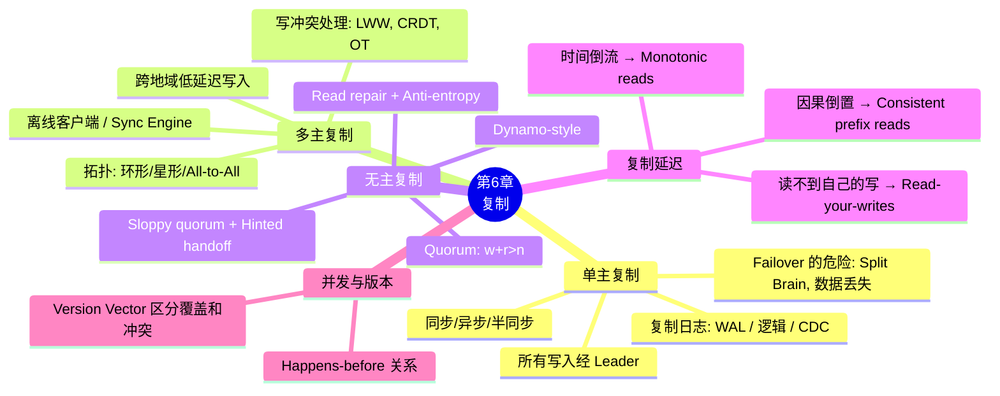

### 核心主线

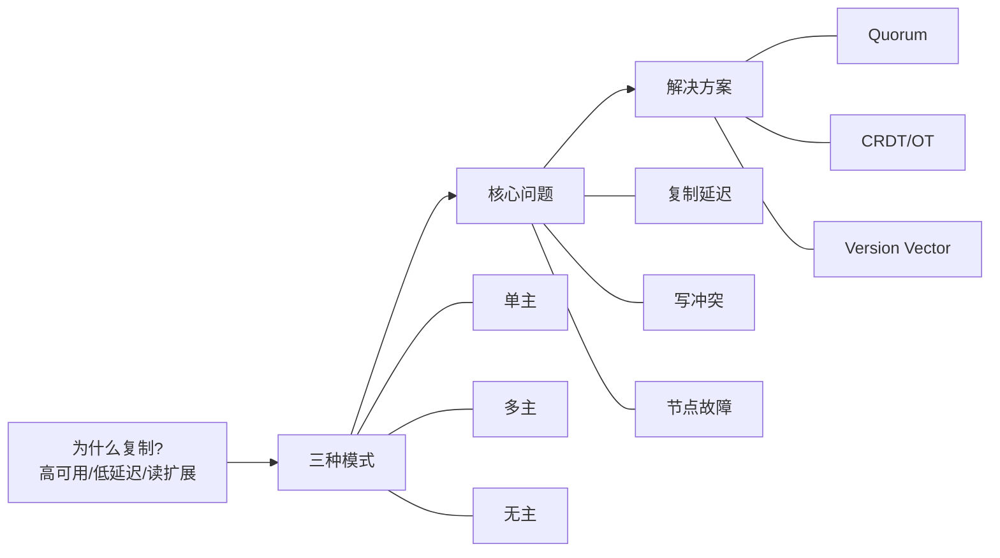

### 十大 Takeaways

1. **三种复制模式**：单主（写入经 Leader）、多主（多个 Leader 互相复制）、无主（客户端直接多副本读写）

2. **同步 vs 异步是根本权衡**：同步保证数据一致但一个节点卡住全局阻塞；异步高吞吐但 Leader 故障可能丢数据；半同步是折中

3. **Failover 比想象的危险**：未复制写入丢失、Split Brain、外部系统不一致（GitHub 事故）、超时设置两难

4. **逻辑复制 > WAL shipping**：逻辑日志与存储引擎解耦，支持跨版本复制和 CDC

5. **三种复制延迟异常**：读不到自己的写入（read-your-writes）、时间倒流（monotonic reads）、因果倒置（consistent prefix reads）

6. **多主复制 = 处理写冲突**：LWW 会丢数据、手动合并复杂、CRDT/OT 可自动合并但有局限

7. **无主复制的核心是 Quorum**：w+r>n 保证读写 quorum 重叠，但不是强一致性的绝对保证

8. **Quorum 有许多边界情况**：sloppy quorum、并发读写、部分写入成功不回滚、节点恢复等都可能破坏一致性

9. **并发 = 互不知晓**，不是"同时发生"。通过 version vector 跟踪因果依赖，区分"覆盖"和"冲突"

10. **强一致性需要共识协议**：单纯的 Quorum 不够，需要 Raft/Paxos 等协议（Ch10）。NewSQL 数据库（CockroachDB, TiDB）结合了分布式 + 强一致性

### 连接下一章

