# 第6章：复制 (Replication)

> *"The major difference between a thing that might go wrong and a thing that cannot possibly go wrong is that when a thing that cannot possibly go wrong goes wrong, it usually turns out to be impossible to get at or repair."*
> — Douglas Adams, *Mostly Harmless* (1992)

复制（replication）＝ 把同一份数据保存在多台通过网络相连的机器上。听起来简单，但一旦数据会**随时间变化**，"怎么把变更同步到所有副本"就成了分布式系统最古老也最棘手的问题之一（原理自 1970 年代起几乎没变 [1]）。这一章就是讲"变更如何复制"，下一章（分片）才讲"数据如何拆开"。

---

## 🗺️ 章节导航

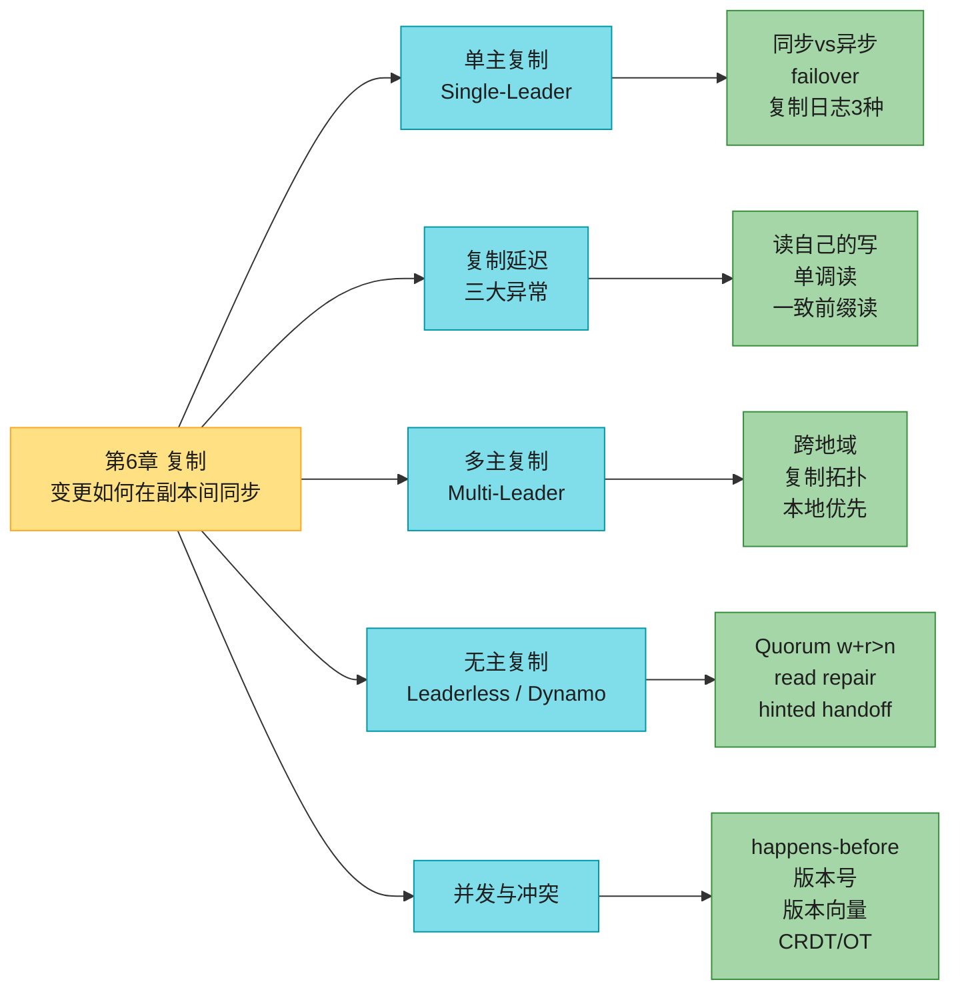

> 📝 **名词注释**
> - **副本 (replica)**：存有数据一份拷贝的节点。本章假设每台机器都装得下完整数据集（下一章才讨论装不下要分片的情况）。
> - **leader / follower**：leader（也叫 primary、source、master）负责接写；follower（也叫 secondary、read replica、hot standby）从 leader 拉变更日志同步。旧文献叫 master/slave，因带冒犯意味已被弃用 [8]。
> - **复制延迟 (replication lag)**：一次写在 leader 生效，到它出现在 follower 上，这两者之间的时间差。正常运行通常 < 1 秒，异常时可能几分钟甚至几小时。

---

## 0. 为什么要复制 & 复制 ≠ 备份

复制的三大动机（背下来）：

| 动机 | 例子 | 本质 |
|------|------|------|
| **低延迟** | 用户在北京、副本放北京 | 数据**地理上靠近**用户，访问更快 |
| **高可用 / 持久性** | 一台机器挂了，另一台顶上 | 部分**故障**也能继续工作 |
| **读扩展** | 99% 读、1% 写的网站 | 读请求**分散到多个副本**，提升读吞吐 |

**复制 ≠ 备份**，这是新手最容易混的点：

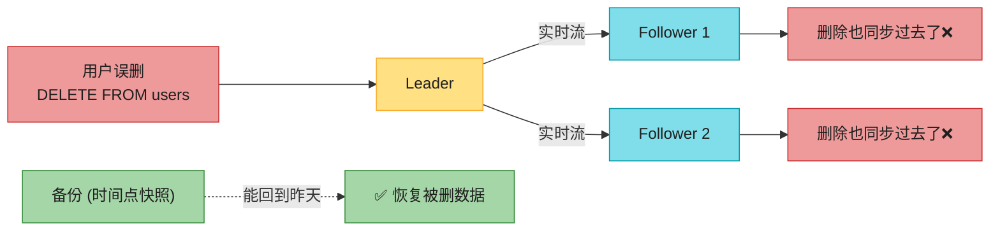

- **副本**：快速反映 leader 的最新写入（包括删除）。误删时，删除也会传染到所有副本，**复制救不了你**。
- **备份**：保存某个时间点的旧快照，能"穿越回过去"。两者**互补**：搭新 follower 时常用备份做起点；归档复制日志也常是备份流程的一部分。

> 📝 **名词注释：存算分离 / 对象存储做"内部备份"**
> 有些数据库内部保存历史不可变快照（一种内置备份）。但这意味着旧版本数据和当前数据挤在**同一块存储**上。如果数据量大，更省钱的做法是：把冷备份扔进**对象存储**（S3 / GCS / Azure Blob，针对低频访问优化、极便宜），数据库主存只放当前态。这正是云原生数据库的底层逻辑（详见 §1.7）。

---

## 1. 单主复制 (Single-Leader Replication)

单主（leader-based / primary-backup / active-passive）是**最常见**的复制模型，几乎所有关系库都内置：PostgreSQL、MySQL、Oracle Data Guard [3]、SQL Server AlwaysOn [4]；文档库如 MongoDB、DynamoDB [5]；消息队列如 Kafka；以及基于共识算法（Raft）的 CockroachDB [6]、TiDB [7]、etcd、RabbitMQ quorum queue。

### 1.1 基本工作流

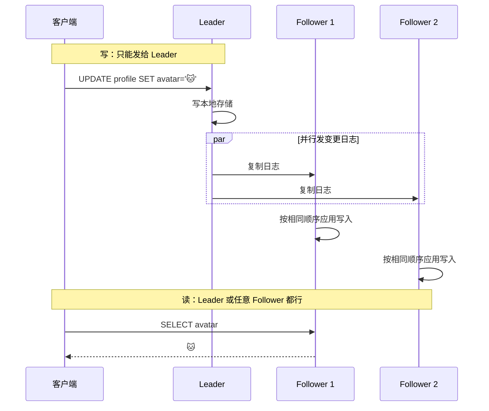

三条铁律：
1. **写**：客户端必须发给 leader，leader 先写本地。
2. **同步**：leader 把变更作为**复制日志 / change stream** 发给所有 follower，follower 按与 leader **完全相同的顺序**应用。
3. **读**：客户端可读 leader 或任意 follower；但**只有 leader 能接写**（follower 对客户端只读）。

> 📝 **名词注释：分片 + 单主**
> 如果数据库还**分片**了（下一章），每个分片各有一个 leader，不同分片的 leader 可能在不同节点上，但**每个分片依然只有一个 leader**。多主复制（§3）是"同一个分片同时有多个 leader"，那是另一回事。

### 1.2 同步 vs 异步复制（核心权衡）

这是复制系统**最重要的一个配置项**。看这个场景：用户更新头像，leader 收到后转发给 follower，再回复用户"成功"。

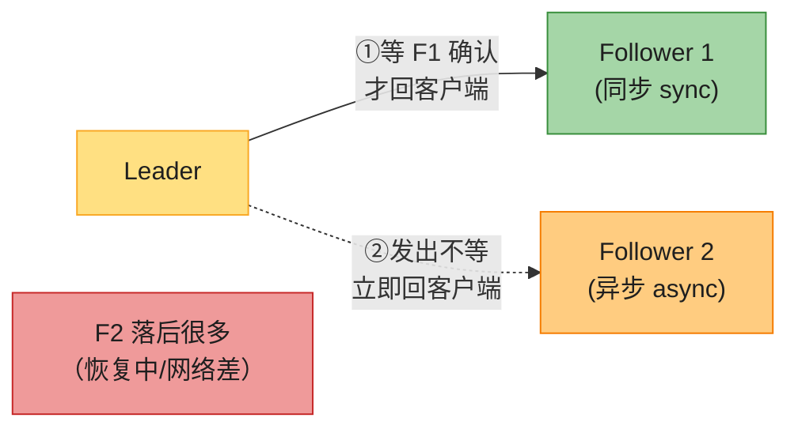

- **同步**：leader 等 follower 1 确认收到后，才告诉用户"成功"，也才让别的客户端看到这次写。
  - ✅ 强保证：follower 1 一定有最新数据，leader 挂了数据不丢。
  - ❌ 致命缺点：follower 1 一旦不响应（崩溃/网络故障），**整个系统写不了**——leader 必须阻塞所有写，等它回来。
- **异步**：leader 发出去就立即回客户端，不等 follower 2。
  - ✅ follower 2 慢/挂不影响 leader 继续写。
  - ❌ leader 挂了且不可恢复时，**还没复制到 follower 2 的写入全丢**（哪怕已经告诉客户端"成功"了——即"已确认的写"未必持久）。

#### 深入：三种配置怎么选（半同步是工程主流）

> **生活类比**：你寄快递。
> - **全同步**＝必须每个收件人都当面签收，你才算寄完。一个人不在家，全车快递卡死。
> - **全异步**＝往邮筒一扔就走，管它到不到。
> - **半同步 (semisync)**＝至少有一个人当面签收了，你就放心走。

工程上"全同步"几乎没人用（任何一个 follower 宕机就全停），现实是三种折中：

| 配置 | 含义 | 写延迟 | 写可用性 | 持久性 | 典型产品 |
|------|------|--------|---------|--------|---------|
| **全同步**（所有 follower） | 等所有副本确认 | 极高（取最慢者） | 极差（一台挂全停） | 最高 | 几乎不用 |
| **半同步 (semisync)** | 只等 1 个 follower，其余异步 | 中 | 好 | 高（至少 2 份：leader + 1 个同步 follower） | MySQL semisync、PG `synchronous_standby_names` |
| **多数派 quorum** | 等多数（如 3/5）确认 | 中 | 好 | 高 | 共识系统（Raft/Paxos）、DynamoDB |
| **全异步** | 一个都不等 | 最低 | 最好（leader 永远能写） | **最低（failover 会丢已确认的写）** | MySQL 默认、PG 默认、Redis、Cassandra |

**半同步的精髓**：同步 follower 不可用时，把另一个异步 follower **提拔为同步**，始终保证"至少两个节点（leader + 一个同步副本）有最新数据"。Kafka 的 `min.insync.replicas`、MongoDB 的 `w:majority` 本质都是这个思路的延伸。

**全异步的代价**：本章后面 §1.5 的 GitHub 事故、Redis 的"acknowledged writes lost"，根因都是全异步 + failover。**削峰可用性，但拿持久性换的。**

> 📝 **名词注释：region 与 availability zone (zone)**
> - **region（地域）**：一个地理区域，含若干数据中心。如 AWS 的 `us-east-1`（弗吉尼亚）。
> - **zone（可用区）**：region 内的一个独立数据中心，独立供电/制冷。如 `us-east-1a`。
> - 同 region 多 zone：网络极快，系统可跨 zone 当本地跑，能抗**单区故障**；但抗不了整个 region 故障。
> - 抗 region 故障必须跨 region 部署，代价是**更高延迟、更低吞吐、更贵流量费**。

### 1.3 添加新 Follower（无停机）

需要新增副本时，**不能直接拷数据文件**——客户端一直在写，文件拷到一半数据就在变，拷出来的是"四不像"。也不能锁库（违背高可用目标）。正确流程：


关键是第 3 步：快照必须关联到 leader 复制日志里的**一个精确位置**，否则不知道从哪儿开始追。各产品叫法不同：

| 产品 | "快照位置"叫法 |
|------|---------------|
| PostgreSQL | **LSN**（Log Sequence Number，日志序列号） |
| MySQL | **binlog coordinate**（文件名+偏移）或 **GTID**（Global Transaction ID） |
| Kafka | **offset**（分区内的偏移量） |

> 🏭 **实战**：把复制日志归档到对象存储 + 定期全量快照，既能做灾备，又能"下载文件搭新 follower"。**WAL-G**（PostgreSQL/MySQL/SQLServer）、**Litestream**（SQLite）就是干这个的——Litestream 让 SQLite 这个单文件库也能流式备份到 S3，单机数据库秒级恢复。

### 1.4 Follower 故障：Catch-up Recovery

概念上最简单：follower 本地磁盘存着自己收到的变更日志。崩溃重启/网络中断后，从日志知道自己**最后处理到哪一笔**，连上 leader 把"断连期间"漏掉的变更补齐即可。

> ⚠️ **性能陷阱**：写吞吐高、或 follower 离线太久，要补的写入可能**堆积如山**。追赶期间，恢复中的 follower 和 leader（要额外发积压）**双双高负载**。leader 还面临两难：follower 长时间不回，是**留着日志等它**（leader 磁盘可能爆），还是**删掉它没确认的日志**（follower 回来只能从备份重建）？

### 1.5 Leader 故障：Failover（最难）

follower 恢复是"补数据"，leader 恢复是"换老大"——要选新 leader、重定向客户端、让其他 follower 改跟新 leader。这整个过程叫 **failover（故障转移）**。

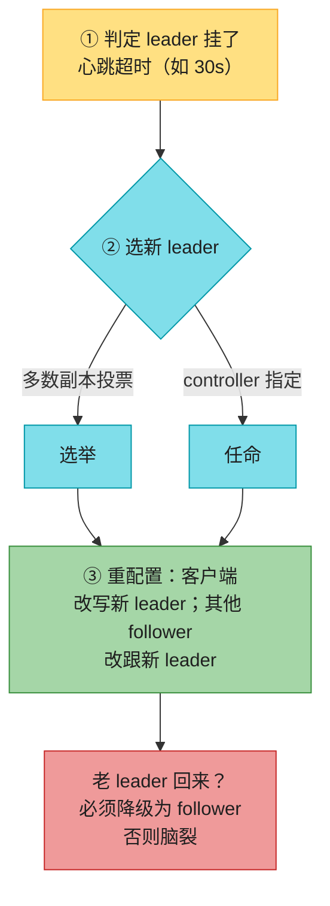

三步：
1. **判定 leader 挂了**：没有万全之策，大多用**心跳超时**（节点间互发心跳，30s 不回就当死）。计划内维护可走"安全交接"，不算超时。
2. **选新 leader**：要么**剩余副本多数投票**，要么**预先指定的 controller 节点任命**。最佳人选 = 数据最新的副本（丢得最少）。让所有节点对一个新 leader 达成一致，是个**共识问题**（第 10 章详谈）。
3. **重配置**：客户端改写新 leader；老 leader 若回来还自以为是 leader，必须**强制降级**。

#### 深入：Failover 的四大陷阱（这就是为什么很多团队宁可选手动 failover）

> **生活类比**：换值班长。听起来简单，但实际可能：旧班长其实没死只是手机没信号（误判）、新班长没拿到最新台账（丢数据）、两个班长同时以为自己是班长（脑裂）、还没等交接完客户已经乱套。

**陷阱 1：异步复制导致丢"已确认"的写**
异步模式下，新 leader 可能没收到老 leader 的全部写。老 leader 回来后，那些未复制的写怎么办？**最常见做法：直接丢弃**。这意味着"你以为已经提交的写，其实并不持久"。GitHub 2012 事故 [14] 就是这么炸的。

**陷阱 2：跨系统协调（GitHub 事故详解）**
GitHub 那次：一台**数据落后的 MySQL follower** 被提升为 leader。它用自增计数器分配主键，但新 leader 的计数器**落后于老 leader**，于是**复用了老 leader 已经发出去过的主键**。而这些主键同时被写进了一个 Redis 库。主键复用 → MySQL 和 Redis 数据对不上 → **私密数据泄露给了错误的用户**。教训：**数据库外的系统（Redis、缓存、搜索索引）和库内容要协调时，丢写尤其危险。**


**陷阱 3：脑裂 (split brain)**
某些故障场景下（第 9 章），**两个节点都以为自己是 leader**。若两个 leader 都接写、又没有冲突解决（§4），数据大概率丢失或损坏。安全兜底：检测到双 leader 就**强制关闭其中一个**。但设计不慎可能**两个都被关 → 全停** [15]。而且等你发现脑裂关节点时，数据可能已经坏了。这种"限制/关闭老 leader"的机制叫 **fencing（围栏）**，第 10 章「分布式锁与租约」详谈。

**陷阱 4：超时设多长？**
- 设长 → leader 真挂时，恢复慢。
- 设短 → 误判：临时负载尖峰让节点响应超时，或网络抖动包延迟，**触发不必要的 failover**。系统本就高负载/网络差时，一次多余 failover 往往**火上浇油**。

> 🏭 **生产级取舍**：正因这四大陷阱，**很多运维团队即便软件支持自动 failover，也宁愿手动操作**。选新 leader 最重要的一条：**挑数据最新的 follower**。半同步下＝老 leader 等过的那个 follower；异步下＝日志序列号最大的。丢零点几秒写入或许可忍，选个落后几天的 follower 就是灾难。

### 1.6 复制日志的三种实现

leader-based 复制底层怎么把变更传出去？三种主流方法，差别极大。

#### ① 基于语句 (Statement-based)
leader 把每条写语句（`INSERT`/`UPDATE`/`DELETE`）原样记录、转发，follower 像收到客户端请求一样解析执行。

**致命缺陷**：
- 调用**非确定性函数**（`NOW()` 当前时间、`RAND()` 随机数）→ 每个副本生成不同值，数据分叉。
- 用了**自增列**或依赖现有数据的语句（`UPDATE ... WHERE <条件>`）→ 必须在所有副本上**严格相同顺序**执行，并发事务下限制大。
- 有**副作用**的语句（触发器、存储过程、UDF）→ 副作用可能在各副本不同。

> workaround：leader 在记日志时，把非确定函数**替换成固定返回值**。这种"按固定顺序执行确定性语句"的思路 = **状态机复制 (state machine replication)**，和 [[ch05]] 讲过的 Event Sourcing 同源。MySQL 5.1 前用语句级，现在一旦语句含非确定性就**自动切到行级**。VoltDB 靠**强制事务确定性**让语句级复制变安全 [16]。

#### ② 预写日志传送 (WAL Shipping)
第 4 章讲过 B-tree 靠 **WAL（预写日志）** 抗崩溃。WAL 含恢复索引和堆所需的一切信息，所以**同样的日志**也能在另一节点造个副本：leader 写盘的同时，把 WAL 跨网发给 follower。PostgreSQL、Oracle 用这个 [17,18]。

**缺点**：WAL 描述的是**极低层**的数据（哪个磁盘块改了哪些字节），**和存储引擎强耦合**。一旦存储格式跨版本变了，leader 和 follower 就**不能跑不同版本**。

> 🏭 **为什么这很要命**：如果复制协议允许 follower 跑**更新版本**，就能**零停机升级**——先升 follower，再 failover 让升级节点当 leader。WAL shipping 做不到（版本必须一致），**升级就得停机**。

#### ③ 逻辑（行级）日志 (Logical / Row-based)
让**复制日志**和**存储引擎**解耦：复制用"逻辑日志"（描述对**表/行**的变更），存储引擎内部另用一套（物理 WAL）。

关系库的逻辑日志通常是行粒度的记录序列：
- **插入行**：所有列的新值。
- **删除行**：能唯一标识该行的信息（主键；没主键就得记所有旧值）。
- **更新行**：唯一标识 + 所有列新值（至少变更列的新值）。
- 改多行的事务 → 多条记录 + 一条"提交"记录。

> 🏭 **MySQL** 用行级时，在 WAL 之外**单独**维护逻辑日志 **binlog**；**PostgreSQL** 的逻辑复制是**把物理 WAL 解码**成行级 insert/update/delete 事件 [19]。

**逻辑日志的两大优势**：
1. **解耦 → 后向兼容** → leader/follower 可跑不同版本 → **零停机升级** [20]。
2. **易被外部应用解析** → 这正是 **CDC（Change Data Capture）** 的基础：把库内容发给数仓、自建索引、缓存。第 12 章详谈。

#### 深入：三种日志本质对比（MySQL 实战 + 选型决策）

> **类比**：同一个"教别人怎么做这道菜"的目标——
> - **语句级**＝把菜谱念给对方（"放盐、翻炒"），对方自己照做。问题是"少许盐""适量油"这类模糊指令，每个人做出来不一样。
> - **WAL（物理）**＝把锅里的每个分子怎么移动都精确记录。精确但和具体那口锅（存储格式）绑死。
> - **逻辑（行级）**＝只记录"最终这盘菜有什么料"（蛋、番茄各多少克）。换口锅也能做。

| 维度 | 语句级 Statement | 物理 WAL | 逻辑/行级 Logical |
|------|-----------------|----------|------------------|
| 记录内容 | SQL 原文 | 磁盘块字节变化 | 行级增删改 |
| 与存储引擎耦合 | 中 | **高**（换版本/格式即坏） | **低**（解耦） |
| 跨版本运行 | 难 | ❌ 不行 | ✅ 可（零停机升级） |
| 体积 | 最小（一条 SQL） | 大 | 中 |
| 非确定性函数 | ❌ 易出错 | ✅ 安全 | ✅ 安全 |
| 外部易解析（CDC） | 一般 | 难 | ✅ 最好 |
| 典型产品 | MySQL<5.1、VoltDB | PostgreSQL 流复制、Oracle | MySQL binlog、PG 逻辑复制、Debezium CDC |

> **选型直觉**：要 CDC、要零停机升级、要异构 → **逻辑日志**；纯内部高吞吐同步、不在意版本一致 → **物理 WAL**；语句级只在确定性可保证时（VoltDB）才安全。

---

## 1.7 对象存储与零盘架构 (ZDA)

> 📝 **名词注释：对象存储 (object store)**
> 像 Amazon S3、GCS、Azure Blob 这类存储：数据作为"对象"放在"桶"里，通过 HTTP API 读写。**极便宜**、**跨多区/多地域自动复制**、**超高耐久性**（11 个 9）；但**读写延迟高**（比本地盘/EBS 慢得多）、**按 API 调用计费**、**对象通常不可变**（大对象随机写极贵）、**往往没有标准文件系统接口**。

越来越多数据库把对象存储当**主存**用，而不只是归档。四大好处：

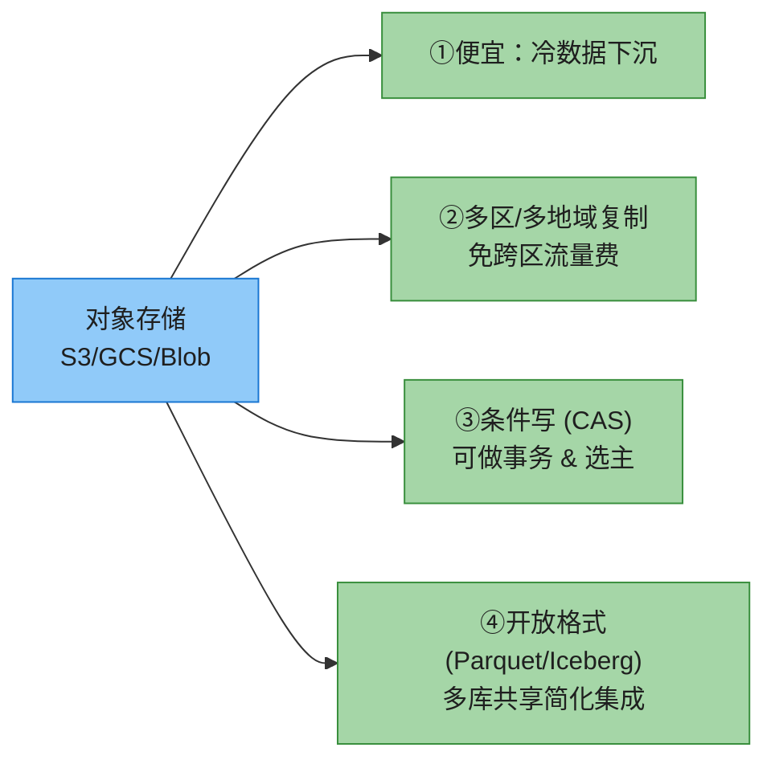

**③的妙用**：对象存储的**条件写**（compare-and-set：仅当对象版本未变才允许覆盖）本质是个 CAS 原语，能用来实现**事务**和**leader 选举** [10,11]。等于把"选主/原子提交"这种分布式难题外包给了对象存储——架构瞬间简化。

**代价**：对象存储延迟高、按调用收费（逼你批处理，批处理又增加延迟）、不可变（随机写贵）、接口非 POSIX（FUSE 挂载常缺非顺序写/软链等特性）。

#### 深入：零盘架构 (ZDA, Zero-Disk Architecture) ——存算分离的极致

不同系统的折中策略谱系：


**ZDA 的颠覆性**：所有数据持久化到对象存储，磁盘和内存**纯缓存**。节点**没有任何持久状态** → 运维爆炸式简化（节点随便起随便杀，状态全在 S3）。这就是为什么**几乎每个现代云数仓**（Snowflake、BigQuery、Redshift）都长这样，以及 Turbopuffer（向量搜索）、SlateDB（云原生 LSM）。

> 🏭 **Kafka 兼容的 ZDA 们**：**WarpStream**、**Confluent Freight**、**Bufstream**、**Redpanda Serverless** 都是"Kafka 协议 + 零盘架构"。它们把 Kafka 原来 Broker 本地盘存的日志段搬到 S3，broker 变成无状态——于是可以秒级伸缩到 0、按用量计费、跨区复制几乎免费（用 S3 的跨区复制）。代价是**延迟比本地盘 Kafka 高一个量级**（S3 写延迟 ~10ms+）。

> 🏭 **WAL 单独存的代表**：**Neon**（Serverless Postgres）把数据放 S3，但 **WAL 放在叫 Safekeepers [12] 的低延迟系统**里（用 Paxos 保证 WAL 持久），计算层无状态。这是"对象存储做主存 + WAL 单独低延迟"的典型。

---

## 2. 复制延迟问题 (Problems with Replication Lag)

复制的第二动机（读扩展）催生了**读多写少**架构：建很多 follower，读分散到各 follower。但这**只有异步复制才现实**——同步的话一台 follower 挂就全停。于是矛盾出现：

> **异步 follower 可能读到旧数据**。同一时刻查 leader 和查 follower，结果可能不一样——这种"不一致"是**暂时的**：停止写入等一会儿，follower 最终会追上。这叫 **最终一致性 (eventual consistency)** [22]。

> 📝 **名词注释：最终一致性 (eventual consistency)**
> Terry 等人 1994 提出 [23]、Vogels 2004 普及 [24]，曾是 NoSQL 的战斗口号。注意"eventually（最终）"是**故意模糊**的——没说多久。正常运行可能亚秒级，但接近满载或网络出问题时，延迟可能飙到几秒甚至几分钟。**不要把"最终"当成"很快"。**

当延迟飙到分钟级，不一致就从理论问题变成**真实的应用 bug**。下面三种经典异常，每一种都对应一种"一致性保证"来治。

### 2.1 异常 1：读不到自己的写 (Read-Your-Writes)

用户提交数据后立刻查看（如发评论后刷新页面）。写进了 leader，但读命中了一个**还没追上的 follower** → 用户看到"自己的评论没了"，以为提交失败，反复重提。

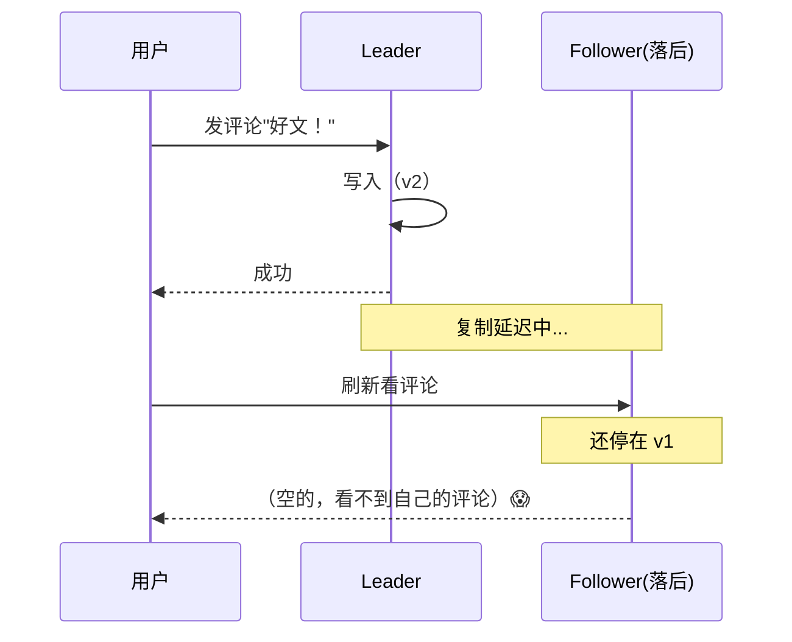

**药方：read-after-write 一致性**（也叫 read-your-writes [23]）——保证用户重载页面后，**总能看到自己刚提交的更新**。注意它**只保证看到自己的**，别人的更新仍可能延迟。

#### 深入：实现 read-after-write 的四种策略

| 策略 | 做法 | 适用 | 缺点 |
|------|------|------|------|
| **A. 关键读走 leader** | "用户可能改过的"读 leader，其余读 follower | 个人资料只本人能改 → 自己资料读 leader | 需预判"哪些可能被改" |
| **B. 时间窗** | 记录用户最后更新时间，1 分钟内全读 leader [25] | 大部分内容用户可改 | 1 分钟外仍可能踩雷 |
| **C. 时间戳对齐** | 客户端记住最近写的 LSN/时间戳，读时确保副本至少同步到该点；没到就换副本或等 [26] | 通用、精确 | 跨设备难（见下） |
| **D. 监控延迟** | follower 落后超 1 分钟就**拒绝查询** | 简单兜底 | 落后时读直接失败 |

> **跨设备 read-after-write**：用户在手机上写、电脑上读（或反之），更麻烦：
> - 策略 C 要"记住最近写时间戳"，但**一台设备不知道另一台设备写了啥** → 这个元数据得**集中存储**。
> - 不同设备网络路由可能落到**不同 region**（家里宽带 vs 蜂窝），若读必须落 leader 所在 region，得先把该用户所有设备的请求**路由到同一 region**。

### 2.2 异常 2：时间倒流 (Monotonic Reads)

用户连续读两次，每次随机命中不同副本。第一次命中**新鲜** follower（看到新评论），第二次命中**落后** follower（评论又消失了）——**时间倒着走**，极度困惑。

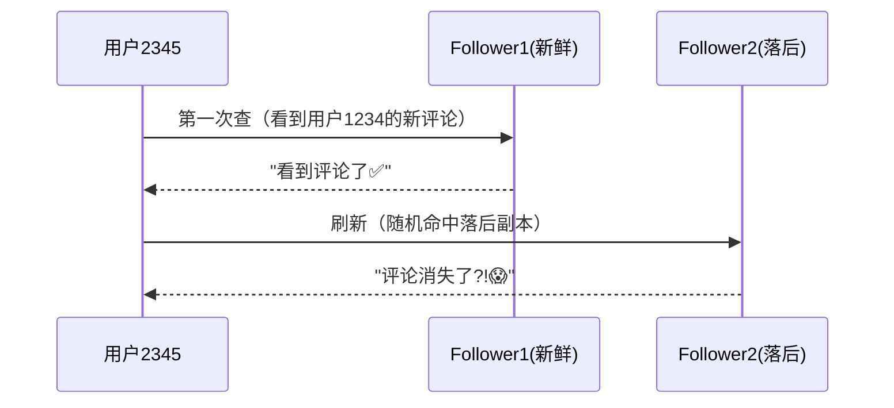

**药方：单调读 (monotonic reads)** [22] —— 比强一致弱、比最终一致强。用户可以读到旧值，但**连续多次读不会时间倒退**（不会先看到新值再看旧值）。

**实现**：保证**同一用户的读总落同一副本**（不同用户可不同副本）。例如按 **user_id 哈希**选副本而非随机。缺点：该副本挂了，请求得重路由到别的副本。

### 2.3 异常 3：因果倒置 (Consistent Prefix Reads)

观察者通过 follower 听一段对话，结果**先听到答案、后听到问题**：

```
Mr. Poons:    你能看到多远的未来？
Mrs. Cake:    通常大概 10 秒，Poons 先生。
```
若 Mrs. Cake 的话走低延迟 follower、Mr. Poons 的话走高延迟 follower，观察者听到的是：
```
Mrs. Cake:    通常大概 10 秒，Poons 先生。
Mr. Poons:    你能看到多远的未来？     ← 像先答后问，读心术😂
```

**药方：一致前缀读 (consistent prefix reads)** [22] —— 如果一组写有先后顺序，任何读者都应**按相同顺序**看到它们。

> 📝 **为什么分片库特别容易中招**：单分片总是按相同顺序应用写，天然有一致前缀。但**分片库各分片独立运作，没有全局写顺序**，读者可能看到库的一部分新、一部分旧。解决：把**有因果关系**的写路由到同一分片（但有些应用做不到高效）。第 7 章详谈。

### 2.4 更彻底的解决方案：直接上强一致

在应用层自己实现上面三种保证（读 leader、时间戳对齐…）**复杂且易错**。最省心的编程模型是：**选一个本身提供强一致（如线性一致性，第 10 章）+ ACID 事务（第 8 章）的库**，把复制难题丢给数据库，当单机用。

2010s 初 NoSQL 宣称"强一致限制扩展性，大规模必须拥抱最终一致"。但之后 **NewSQL**（CockroachDB、TiDB、Spanner、YugabyteDB）证明：**强一致 + 事务 + 分布式容错/高可用/可扩展可以同时拥有**。

当然仍有理由用弱一致复制：网络中断时**更抗揍**、开销更低。本章剩余部分就讲这些"弱但有韧性"的方案。

---

## 3. 多主复制 (Multi-Leader Replication)

单主的最大软肋：**所有写必须经过唯一 leader**。连不上 leader（如网络断了）就写不了。自然延伸：**允许多个节点接写**。每个处理写的节点把变更转发给所有其他节点，叫 **多主（multi-leader / active-active / 双向复制）**。每个 leader 同时充当其他 leader 的 follower。

> 同步多主 ≈ 单主（写 A 时同步等 B，网络一断就写不了 A，等于把 B 当 leader、A 当转发器），所以**多主实际都指异步多主**——任一 leader 断网也能继续写。

### 3.1 跨地域部署 (Geo-Distributed)

单 region 内用多主通常不划算（复杂度 > 收益）。但在**多地域**场景，多主有意义：leader 分布在各地域，写本地处理、异步复制到其他地域。

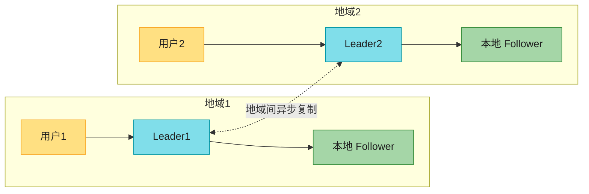

**单主 vs 多主（多地域）四维对比**：

| 维度 | 单主（跨地域） | 多主（每地域一 leader） |
|------|---------------|----------------------|
| **性能** | 每次写都跨公网到 leader 所在 region，延迟高 | 本地 region 写、异步复制，**用户感知快** |
| **抗 region 故障** | leader region 挂 → 跨 region failover | 各 region 独立运作，断网照写，恢复后追 |
| **抗网络问题** | 对跨 region 链路极敏感（必须等响应） | 异步多主对网络抖动容忍好 |
| **一致性** | 可强一致（可串行事务，第 8 章） | **弱得多**：不能保证账户不透支、用户名唯一 |

> ⚠️ **一致性的根本限制** [28]：多主下，不同 leader 可能各自处理"单独看没问题"的写（付点钱、注册某用户名），合在一起就违反约束。这是分布式系统的**基本限制**。要硬约束 → 选单主。多主适合**不需要这类全局约束**的应用。

> 🏭 **谁用多主**：MySQL、Oracle、SQL Server、YugabyteDB 内置；Redis Enterprise、EDB Postgres Distributed、pglogical [29] 是外挂。但多主常是**事后打补丁**的功能，配置坑多，和自增键/触发器/完整性约束常打架——被视为"能不用就不用的危险地带" [30]。

### 3.2 复制拓扑 (Replication Topology)

拓扑 = 写从一个节点传到另一个节点的通信路径。两个 leader 只有一种拓扑（互发）。>2 个 leader 时有几种：

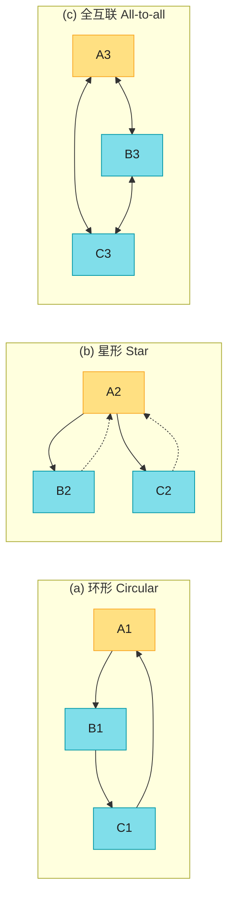

- **环形**：每个节点从一节点收写，连同自己的写转发给下一节点。
- **星形**：一个根节点转发给所有其他（可推广为树）。
- **全互联**：每个 leader 发给所有其他——最通用、容错最好。

> 📝 **防无限循环**：环形/星形里写要经过多跳，必须**防止写无限转发**。每个节点有唯一 ID，复制日志里给每条写打上"**经过的所有节点 ID**"标签 [31]。收到带自己 ID 的写 → 说明已处理过 → 忽略。

#### 深入：环形/星形 vs 全互联的取舍

| 维度 | 环形 / 星形 | 全互联 |
|------|-----------|-------|
| 容错 | ❌ **一个节点挂，链路断**（其他节点无法通信，需手动重配） | ✅ 消息可走多条路径，无单点 |
| 写到达延迟 | 多跳，可能较慢 | 一跳直达 |
| 潜在坑 | 单点故障 | **写乱序**（见下） |

**全互联的乱序坑（Figure 6-8）**：网络拥堵让某些链路变快，写**"超车"**。客户端 A 在 leader1 插入一行，客户端 B 在 leader3 更新该行。但 leader2 可能**先收到 UPDATE（更新一个不存在的行）后收到 INSERT**。这是因果问题（update 依赖 insert），靠给写打时间戳**不够**——时钟不能保证足够同步（第 9 章）。要正确排序得用**版本向量**（§6.3）。

> ⚠️ **现实**：很多多主系统**没用好的排序技术**，对乱序问题裸奔。用多主务必读文档、充分测试，确认它真的提供了你以为的保证。

### 3.3 同步引擎与本地优先软件 (Sync Engines / Local-First)

多主的另一大舞台：**需要断网也能工作的应用**。日历 App——手机/电脑都要随时看会议、加会议，不管有没有网。离线时的改动，等联网再同步。这时**每个设备都是个本地副本 leader**，设备间异步多主复制（复制延迟可能是小时甚至天）。

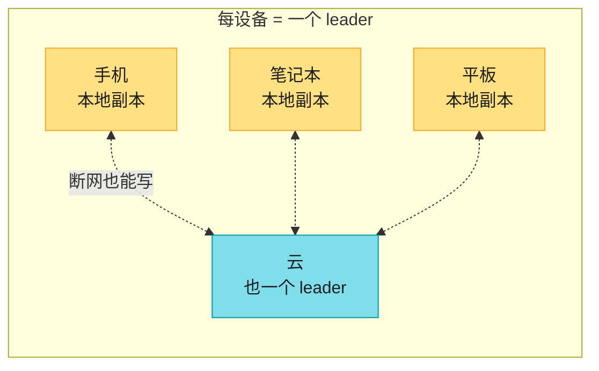

架构上，这和跨地域多主是**同一件事的极端版**：每台设备 = 一个"region"，网络极不可靠。

> 📝 **三个相关名词**
> - **实时协作 (real-time collaboration)**：Google Docs、Figma、Linear——用户输入**立即**反映在 UI，不等服务器往返；他人编辑低延迟同步 [32-34]。每个打开共享文件的浏览器标签都是个副本，编辑异步复制给其他协作者。**即便不允许离线编辑**，"多人不等服务器响应就能编辑"本身就已经是多主了。
> - **离线优先 (offline-first)** [38]：允许离线继续编辑（常借助同步引擎实现）。
> - **本地优先 (local-first)** [39]：不仅离线优先，还**就算软件作者关停所有在线服务也能继续工作**——靠开放标准同步协议、多服务商可切换实现。Git 就是 local-first 协作系统（虽不支持实时）。

> 📝 **名词注释：同步引擎 (sync engine)**
> 捕获用户对文件的每次改动，在线则即时发给协作者、离线则本地存着等会儿发；同时接收协作者改动、合并进本地副本、刷新 UI。多人并发改同一文件还需冲突合并逻辑。**Lotus Notes（1980s）[43] 最早实践**；今天通用同步引擎：闭源后端（Google Firestore、Realm、Ditto）、开源后端（PouchDB/CouchDB、Automerge、Yjs）。游戏领域对应物叫 **netcode**。

#### 同步引擎的利与弊

| 优势 | 劣势 |
|------|------|
| 本地数据 → UI 极快（目标 16ms 内渲染，60Hz） | 需**预下载所有可能用到的数据**到客户端 |
| 断网照用，"离线 = 极大网络延迟" | 数据量巨大时不适用（下载整个电商目录没意义） |
| 简化前端编程模型：读写本地几乎不失败，更声明式 [41] | — |
| 配合响应式编程，实时显示他人编辑 [42] | — |

---

## 4. 写冲突处理 (Dealing with Conflicting Writes)

多主（无论跨地域服务端、还是端上本地优先）的**头号难题**：不同 leader 上的并发写会导致**冲突**，必须解决。

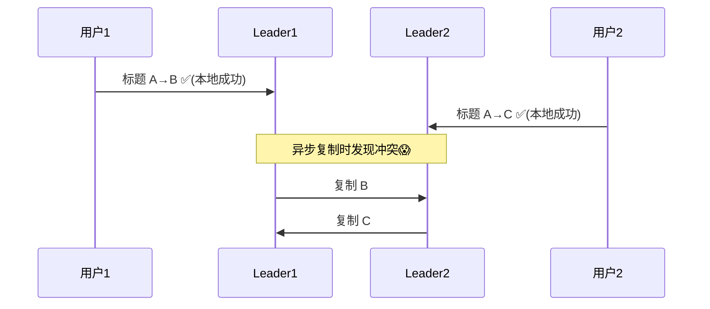

两个 wiki 用户同时把同一页标题从 A 改成 B 和 C，各自本地都成功，但异步复制时就撞上了。**单主库不会有这问题**（写都排队过 leader）。

> 📝 **"并发"的精确定义（重要！）**
> 两写**并发 ≠ 物理上同时发生**。判据是"**一个写发生时，另一个写是否已经生效**"。哪怕两次写物理时间隔了几小时（离线编辑），只要彼此互不知道对方存在，就是**并发**。完整判定算法见 §6。

### 4.1 策略 1：冲突避免 (Conflict Avoidance)

治本：让冲突**根本不发生**。如果应用能保证"**某条记录的所有写都走同一个 leader**"，就不会冲突——哪怕整体是多主。例如只能改自己资料的应用：每个用户固定路由到"home region"，对该用户读写都用那的 leader。从单个用户视角看，等价于单主。

**局限**：一旦你要**改某记录的归属 leader**（某 region 挂了要切流量、用户搬家了），归属切换进行中用户若还在写，冲突又会出现，得靠下面的方法解决。

> **另一例**：自增主键冲突避免——两个 leader 一个只发奇数、一个只发偶数，保证不会撞。其他 ID 方案见第 10 章。

### 4.2 策略 2：最后写胜 (LWW，丢弃并发写)

最简单的解决：每个写带时间戳，**总是用时间戳最大的那个**。Figure 6-9 里若用户1时间戳大，所有 leader 都定标题为 B，丢弃 C。时间戳相同就用值比较（字符串字典序）。

> ⚠️ **名字有误导**："last write wins"暗示有"最后"。但**并发写谁先谁后本就未定义**，时间戳顺序对并发写**本质是随机的**。所以 LWW 的真实含义是：**并发写同一记录时，随机挑一个当赢家，其余静默丢弃**——哪怕它们在各自 leader 上都已成功。代价是**数据丢失**。

- **只插入、永不更新、键唯一** → LWW 没问题。
- **更新已有记录 / 不同 leader 插同键** → 要么接受丢写，要么换下面的方法。
- 用真实时钟时间戳 → 对**时钟同步极敏感**：某节点钟快了，你想覆盖它的写可能被忽略（你时间戳更小）。改用**逻辑时钟**可解（第 10 章）。

#### 深入：LWW 为什么会偷偷丢数据（时钟漂移反例）

> **手算反例**：三节点 A、B、C，真实时钟 `t=100`。
> - A 的钟**快了 10s**（它以为是 110）。用户在 A 写 `x=1`，时间戳记 **110**。
> - 网络把 A 的写传给 B、C。
> - 真实 `t=105`，用户在 B 写 `x=2`（晚于 A 的写，本应覆盖）。但 B 钟准，时间戳记 **105**。
> - LWW 比较：110 > 105 → **B 较新的写被丢弃**，留下 A 的旧值 `x=1`。
> - 用户明明"后写的"覆盖不了"先写的"。😱

这就是 Cassandra / ScyllaDB 默认 LWW 的隐患——**依赖时钟，时钟一漂就静默丢写**。生产实践：**只插不更新**（用 UUID 当键），或接受最终一致。

### 4.3 策略 3：手动解决 (Manual / Siblings)

像 Git 合并冲突：两个分支改了同一行 → 合并时报告冲突，等人解决。数据库不会让整个复制流程停下来等人，而是**把并发的多个值都存下来**（叫 **siblings 兄弟值**）。下次查这条记录返回所有值（B 和 C 都给），你在应用层合并（拼成 "B/C"），或让用户选，再写回。

**问题**：
- **API 变形**：本来标题是个字符串，冲突时变成"字符串集合"，应用代码别扭。
- **打扰用户**：要做冲突解决 UI，用户还可能懵。
- **自动合并的坑（亚马逊购物车事故）**：早期亚马逊购物车按"取所有 sibling 的**并集**"合并 → 用户在一副本删了商品，但另一副本旧 sibling 还有 → **删掉的商品又冒回来** [45]。Figure 6-10：设备1删 Book、设备2删 DVD，并集合并后两个都回来了。

### 4.4 策略 4：自动冲突解决 (CRDT / OT)

最理想：算法自动把并发写合并成一致状态，保证所有副本**收敛**（处理过相同写集的副本，无论到达顺序，最终状态相同）。最终一致 + 收敛保证 = **强最终一致 (strong eventual consistency)** [46]。

不同数据类型有不同合并算法，目标是尽量保留所有更新的意图、避免丢数据：

| 数据类型 | 自动合并做法 |
|---------|------------|
| **文本**（wiki 标题/正文） | 检测字符增删，合并保留所有增删；同位置并发插入则确定性排序 |
| **集合**（待办/购物车） | 类似文本追踪增删；记住 Book/DVD 已删 → 合并后 `Cart={Soap}`，避免购物车复活 |
| **计数器**（点赞数） | 统计各 sibling 的加减次数，正确相加，不重不漏 |
| **键值映射** | 同 key 用其他算法合并值，不同 key 独立处理 |

> **局限**：约束类需求无解。如"列表不超过 5 项"，多人并发各加项导致总数 >5，只能丢弃一些。但对很多应用，自动合并已足够。

#### 深入：CRDT vs OT——Google Docs 怎么做协同编辑

两大算法族（Figure 6-11）：**CRDT**（无冲突复制数据类型）[46] 和 **OT**（操作转换）[47]。例子：两副本都从文本 `ice` 开始，一个在前面插 `n`（→ `nice`），另一个在后面插 `!`（→ `ice!`），合并结果都应是 `nice!`。

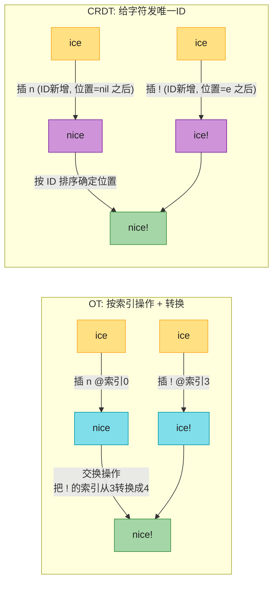

| 维度 | OT | CRDT |
|------|----|----|
| 核心机制 | 记录操作**索引**，应用前按并发操作**转换索引** | 给每个字符/元素**唯一不可变 ID**，按 ID 定位而非索引 |
| 收敛 | 靠转换函数（设计易错） | 内建收敛（同 ID 集合必然一致） |
| 典型场景 | **Google Docs** 等实时文本协作 [32] | 分布式库 **Redis Enterprise、Riak、Cosmos DB** [49]；JSON 同步引擎 **Automerge / Yjs** |
| OT 同步引擎 | ShareDB | — |

> 🏭 两者各有取舍，也能融合（Egwalker [48] 结合 OT 与 CRDT 优点，更小更快）。OT 多用于实时文本协同，CRDT 多用于分布式库和 JSON 同步。

### 4.5 冲突的"隐藏"类型

有些冲突一目了然（同一字段两值）。有些很隐蔽：**会议室预订系统**——每次预订是插一条新记录，应用要保证"同一时段同一房间不能被两组人订"。即使应用预订前检查了可用性，两组人**几乎同时**预订、都看到房间空着 → 冲突。这类约束冲突没有速效答案，第 8 章和第 13 章会深入可扩展的检测与解决。

---

## 5. 无主复制 (Leaderless Replication)

前面两种（单主/多主）都基于"客户端写给一个 leader，系统负责把写复制到其他副本"。无主复制**抛弃 leader 概念，任何副本都能直接接写**。这其实是最早的复制模型 [1,50]，关系库时代被遗忘，2007 年 Amazon 的 **Dynamo** [45] 让它重新流行。Riak、Cassandra、ScyllaDB 都受 Dynamo 启发，所以也叫 **Dynamo-style**。

> 📝 **名词注释：Dynamo ≠ DynamoDB**
> 原始 **Dynamo** 只在论文里、Amazon 内部用，从未对外发布。同名的 **DynamoDB**（Amazon 后来推出的云库）架构**完全不同**——它用基于 **Multi-Paxos** 共识的**单主**复制 [5,51]，不是 Dynamo-style。别搞混。

有些无主实现里**客户端直接写给多个副本**，有些用一个 **coordinator（协调者）节点**代发——但 coordinator **不强制写的顺序**（这点和 leader 本质不同），后果深远。

### 5.1 节点故障时：没有 failover

3 副本，其中 1 个在重启装补丁。单主得 failover；无主**根本没有 failover 这回事**——所有副本平等：

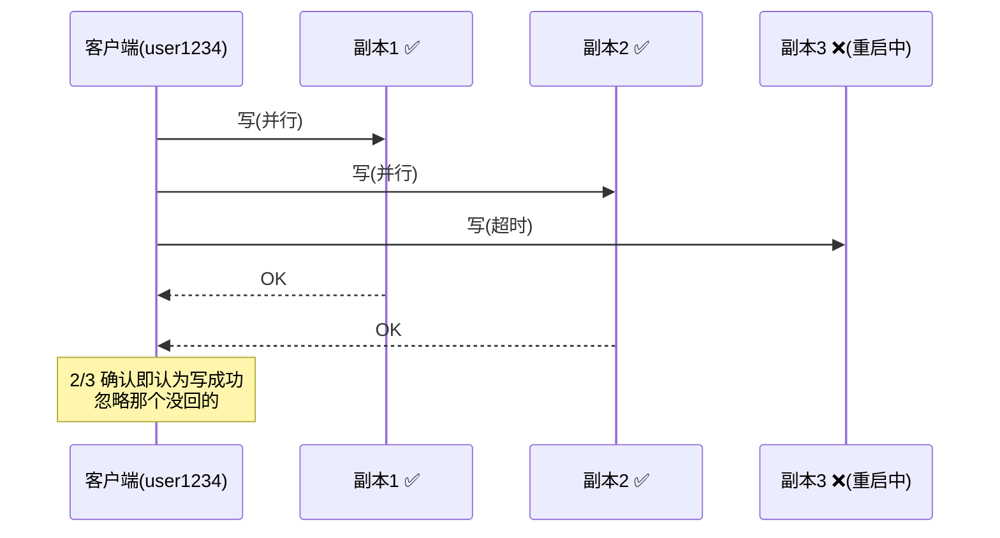

客户端**并行**写给 3 个副本，2 个可用副本确认，1 个错过——只要 2/3 确认就算成功，忽略那个掉队的。

### 5.2 读时纠正 + 追赶缺失的写

掉队的副本上线后，读它可能返回旧值。所以**读也并行发给多个节点**，可能收到一个最新值、一个旧值。每个写的值都带**版本号/时间戳**，客户端收到多个值时取**最大的**（哪怕只有一个副本返回最新值）。

掉线副本回来后，怎么补漏？三种机制：

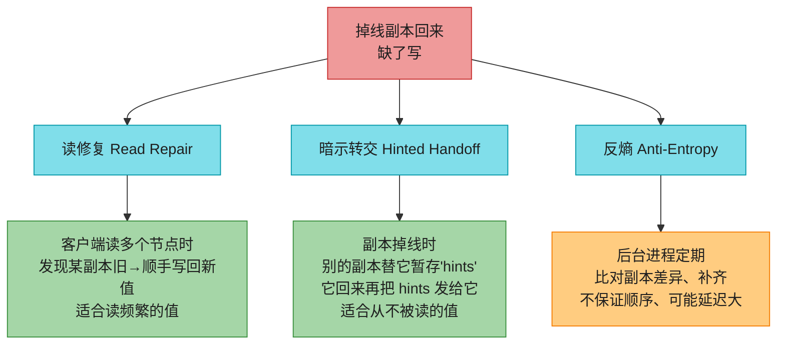

- **读修复 (read repair)**：客户端并行读多个节点，发现某副本值旧（如副本3返 v6，副本1/2 返 v7），客户端顺手把新值写回那个旧副本。**适合读频繁的值**。
- **暗示转交 (hinted handoff)**：某副本不可用时，另一个副本**替它暂存写（hint）**。它回来后，暂存者把 hint 发给它再删除。**补救从不被读、读修复顾不上的值**。
- **反熵 (anti-entropy)**：后台进程定期比对副本差异、复制缺失数据。和 leader-based 的复制日志不同，**不按特定顺序**，可能有显著延迟。

### 5.3 Quorum：w + r > n

Figure 6-12 里 2/3 确认就算写成功。能再放宽吗？只 1/3 呢？一般化：n 个副本，每次写须 **w 个节点**确认才算成功，每次读至少查 **r 个节点**。

> 📝 **核心定理：只要 w + r > n，读就一定能读到最新值。**
> 因为读的 r 个节点和写的 w 个节点**必然有交集**（否则 w + r ≤ n），交集中至少 1 个节点有最新写。

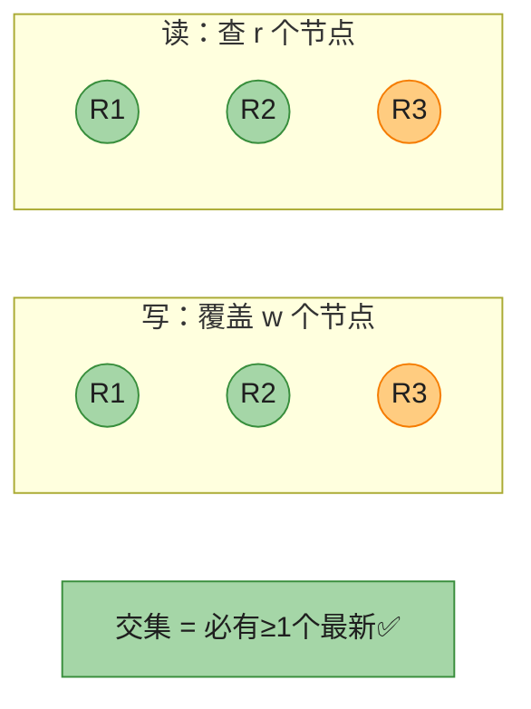

满足 w+r>n 的读写叫 **quorum（法定人数）读写** [50]。把 r、w 理解成"读写有效的最少票数"。

#### 深入：Quorum 数学手算（容错数 & 常见配置）

> **手算 1：容错数推导**
> n 个副本，能容忍多少节点不可用？
> - 写能继续 ⟺ 可用副本 ≥ w ⟺ 不可用 ≤ n − w
> - 读能继续 ⟺ 可用副本 ≥ r ⟺ 不可用 ≤ n − r
> - 读写都能继续 ⟺ 不可用 ≤ **min(n−w, n−r)**
>
> | 配置 | 写容错 (n−w) | 读容错 (n−r) | 综合 |
> |------|-----------|-----------|------|
> | n=3, w=2, r=2 | 1 | 1 | **容忍 1 台挂** |
> | n=5, w=3, r=3 | 2 | 2 | **容忍 2 台挂** |
> | n=5, w=5, r=1 | 0 | 4 | 读飞快、但 1 台挂就写不了 |
> | n=5, w=1, r=5 | 4 | 0 | 写飞快、但 1 台挂就读不了 |
>
> **奇数 n + w=r=(n+1)/2（多数派）** 是最常见的折中：兼顾 w+r>n 与容忍 ⌊n/2⌋ 故障。

> **手算 2：为什么 w+r>n 保证读到最新**
> 反证：若读不到最新，则 r 个读节点**全没有**最新写 → 这 r 个节点都不在那 w 个写节点里 → r + w ≤ n。与 w+r>n 矛盾。所以必有交集。
>
> **反例（w+r ≤ n 会怎样）**：n=3, w=1, r=1。写在 R1，读查 R2。R1、R2 无交集 → **可能读到完全的旧值**。代价换来的好处：延迟更低（不用等那么多节点）、可用性更高。但更可能读到陈旧数据。

> 📝 **quorum ≠ 多数派**
> 只要读集合和写集合**至少交叠 1 个节点**即可，不必都是"过半"。这给了分布式算法设计灵活性 [52]（如 Flexible Paxos）。也可把 w、r 设得更小（w+r≤n），牺牲一致换延迟/可用。

#### 深入：Quorum 的"假"保证——边缘情况下照样读旧值

即便 w+r>n，以下情况仍可能读到旧值 [53]，**别把 quorum 当绝对保证**：

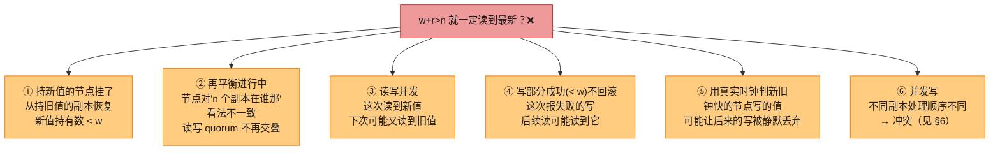

> 🏭 Dynamo-style 库普遍**为可容忍最终一致的场景优化**。w、r 让你**调节读到旧值的概率** [54]，但别当绝对保证。

### 5.4 监控陈旧度 (Monitoring Staleness)

运维角度，**必须监控库是否返回过时结果**。即便应用能忍旧读，复制健康度也要可观测。

- **单主/leader-based**：写按相同顺序应用到 leader 和 follower，每个节点在复制日志里有**明确位置**（已应用的写数）。leader 当前位置 − follower 当前位置 = **复制延迟**，可精确度量。
- **无主**：没有固定写顺序，监控更难。可用"某副本为转交存的 hint 数"近似 [55]，但难解释。最终一致是**故意模糊**的保证，但运维需要能量化"eventual"。

### 5.5 单主 vs 无主：性能对比

单主能给强一致（无主难/做不到），但单主读 leader 有性能问题：读吞吐受 leader 容量限制；leader 挂要等检测 + failover；leader 慢立即拖垮用户。

**无主的最大优势：抗故障、抗慢节点**。没有 failover、请求本来就并行发多副本，一个副本慢/挂对响应时间几乎无影响——客户端直接用更快副本的响应。这叫 **请求对冲 (request hedging)**，能显著降尾延迟 [56]。

```mermaid
flowchart LR
    C["客户端"] -->|"并行发 3 个"| R1["副本1 慢🐢"]
    C -->|"并行发 3 个"| R2["副本2 快⚡"]
    C -->|"并行发 3 个"| R3["副本3 中"]
    R2 -->|"最快返回→用它"| C
    Note["r=2: 等第2快的<br/>hedging 削平尾延迟"]

    style C fill:#FFE082,stroke:#F9A825,color:#1f1f1f
    style R1 fill:#EF9A9A,stroke:#C62828,color:#1f1f1f
    style R2 fill:#A5D6A7,stroke:#388E3C,color:#1f1f1f
    style R3 fill:#FFCC80,stroke:#F57C00,color:#1f1f1f
    style Note fill:#80DEEA,stroke:#0097A7,color:#1f1f1f
```

> 📝 **名词注释：灰故障 (gray failure) [57]**
> 节点没完全死，而是处于**异常慢**的降级态。这是云系统的"阿喀琉斯之踵"。单主必须判断"够不够糟到该 failover"（failover 本身可能添乱）；无主根本**不用区分正常 vs 故障**——慢节点响应被忽略即可，问题天然不存在。

**无主也有性能坑**：
- 掉线副本恢复时要存 hint、又要转交 hint，**系统本就吃紧时还雪上加霜** [55]。
- 副本越多 → quorum 越大 → 等待响应越多 → 即便只等最快的 r/w，撞上慢副本概率也变大 → 响应时间上升。**实践中 quorum 很少超过 4/7 或 5/9**。
- 大规模网络中断让客户端连不上足够多副本 → 无法凑 quorum。部分无主库允许"任意可达副本接写"（Riak/Dynamo 叫 **sloppy quorum** [45]；Cassandra/ScyllaDB 叫 **consistency level ANY**）——不保证后续读到，但比写失败强。

> 多主比无主更能抗网络中断（读写只和一个 leader 通信，可和客户端同地），但写是异步传播 → 读可能任意旧。**Quorum 是折中**：容错好 + 高概率读到最新。

### 5.6 多区域无主

无主也适合多区域——本就为容忍并发写、网络中断、延迟尖峰而设计。

> 🏭 **Cassandra/ScyllaDB 的多区域写**：客户端先选本区域一个 **coordinator 节点**，把写发给它；coordinator 转发给**本区域所有副本** + **每个其他区域各一个副本**（由它再转发给该区域其他副本）——避免跨区域请求多次。一致性级别可选：全域 quorum、每区域各自 quorum、或仅本地 quorum（不等慢的跨区域请求，但更可能读到旧值）。
> 🏭 **Riak** 把客户端-节点通信全限制在一个区域内（n = 区域内副本数），跨区域是**集群间异步后台复制**（类似多主）。

---

## 6. 检测并发写入 (Detecting Concurrent Writes)

和多主一样，无主也允许并发写同一 key → 冲突。冲突可能在写时检测，也可能在 read repair / hinted handoff / anti-entropy 时才暴露。难处：**网络延迟和部分故障让事件到达各节点顺序不同**。

```mermaid
flowchart LR
    subgraph NODES["3 节点写 key X"]
        N1["节点1: 收A, 没收B(瞬断)"]
        N2["节点2: 先A后B"]
        N3["节点3: 先B后A"]
    end
    BAD["若各节点直接覆盖→永久不一致<br/>节点2 以为 X=B, 其余以为 X=A"]
    style N1 fill:#FFCC80,stroke:#F57C00,color:#1f1f1f
    style N2 fill:#FFCC80,stroke:#F57C00,color:#1f1f1f
    style N3 fill:#FFCC80,stroke:#F57C00,color:#1f1f1f
    style BAD fill:#EF9A9A,stroke:#C62828,color:#1f1f1f
```

要最终一致，副本须**收敛**到同一值。可用 §4 的任何机制：LWW（Cassandra/ScyllaDB）、手动、CRDT（Riak）。

### 6.1 happens-before 关系与"并发"

两个操作**到底算不算并发**？关键判据：

> **操作 A happens-before 操作 B** ⟺ B 知道 A、依赖 A、或建立在 A 之上。
> **两个操作并发** ⟺ 谁也不 happens-before 谁 [58]。

注意：**和物理时间无关**。即便两次写物理隔了几小时，只要互不知情，就是并发。

> 📝 **名词注释：因果依赖 (causal dependency)**
> Figure 6-8：A 插入、B 递增——B 递增的是 A 插入的值，所以 B **建立在** A 上，B 必在 A 之后。这叫 B 因果依赖 A。Figure 6-14：两个客户端各写 key X，互不知情 → 无因果依赖 → 并发。

任意两操作 A、B 只有三种可能：A→B、B→A、或并发。我们要的是个算法判这三种。若一操作先于另一，后者覆盖前者；若并发，冲突待解。

> 📝 **并发、时间与相对论**
> 看似"同时发生才算并发"，但精确时间不重要（分布式时钟本就不可靠，第 9 章）。**只要两者互不知情即并发**，无关物理时刻。这和物理**狭义相对论**有共鸣：信息传播不能超光速，两事件若距离/时间间隔短于光速传播所需，就**无法互相影响**。计算机里，网络慢/断也能让两次本可互相影响的操作变成"并发"——彼此够不着。

### 6.2 版本号算法（单副本情况）

先看单副本怎么判并发，再推广到多副本。算法：

1. 服务端给每个 key 维护**版本号**，每次写该 key 就**自增**，并存新版本号 + 值。
2. 客户端读 key 时，服务端返回**所有未被覆盖的值（siblings）** + 最新版本号。**客户端必须先读再写。**
3. 客户端写 key 时，必须带上**前次读的版本号**，并**合并**前次读到的所有值（如用 CRDT + 用户输入）。
4. 服务端收到带版本号 v 的写：可覆盖所有 ≤ v 的值（已知被合并进新值），但**必须保留所有 > v 的值**（它们与本次写并发）。

> 服务端**仅凭版本号**就能判并发，无需解读值本身——值可以是任意数据结构。若写不带版本号，则它**与所有其他写并发**，不覆盖任何东西，只是作为后续读的一个 sibling 返回。

#### 深入：购物车版本号算法完整手算（Figure 6-15）

两个客户端并发往同一购物车加东西。初始空。共 5 次写：

| 步 | 动作 | 客户端带版本号 | 服务端判定 | 服务端存储(siblings) | 返回 |
|----|------|--------------|-----------|---------------------|------|
| 1 | C1 加 milk | （首次，无） | v1，无并发 | `{[milk]@v1}` | v1 |
| 2 | C2 加 eggs（不知 C1 加了 milk） | （首次，无） | v2；与 milk 并发 | `{[milk]@v1, [eggs]@v2}` | v2 |
| 3 | C1 加 flour，以为车是 [milk,flour] | 带 v1 | v3：覆盖 ≤v1 的 [milk]；保留 >v1 的 [eggs]（并发） | `{[milk,flour]@v3, [eggs]@v2}` | v3 |
| 4 | C2 加 ham，合并上次返回的 [milk]+[eggs] → [eggs,milk,ham] | 带 v2 | v4：覆盖 ≤v2 的 [eggs]；保留 >v2 的 [milk,flour]（并发） | `{[milk,flour]@v3, [eggs,milk,ham]@v4}` | v4 |
| 5 | C1 加 bacon，合并 [milk,flour]+[eggs] → [milk,flour,eggs,bacon] | 带 v3 | v5：覆盖 ≤v3 的 [milk,flour]；保留 >v3 的 [eggs,milk,ham] | `{[milk,flour,eggs,bacon]@v5, [eggs,milk,ham]@v4}` | v5 |

```mermaid
flowchart LR
    S1["1: [milk]@v1<br/>(C1)"] --> S3["3: [milk,flour]@v3<br/>覆盖v1, 与v2并发"]
    S2["2: [eggs]@v2<br/>(C2)"] --> S4["4: [eggs,milk,ham]@v4<br/>覆盖v2, 与v3并发"]
    S3 --> S5["5: [milk,flour,eggs,bacon]@v5<br/>覆盖v3, 与v4并发"]
    S4 -.并发.-> S5
    style S1 fill:#A5D6A7,stroke:#388E3C,color:#1f1f1f
    style S2 fill:#A5D6A7,stroke:#388E3C,color:#1f1f1f
    style S3 fill:#80DEEA,stroke:#0097A7,color:#1f1f1f
    style S4 fill:#80DEEA,stroke:#0097A7,color:#1f1f1f
    style S5 fill:#CE93D8,stroke:#7B1FA2,color:#1f1f1f
```

**关键洞察**：客户端永远没拿到完全最新的状态（总有并发写在进行），但**旧版本最终都被覆盖，没有写丢失**。这就是强最终一致的威力。

### 6.3 版本向量 (Version Vectors)

单副本用单个版本号够了。**多副本并发接写**时不够，要**每个副本各维护一个版本号**：每个副本处理写时自增自己的版本号，并**跟踪从其他副本看到的版本号**。所有副本版本号的集合 = **版本向量 (version vector)** [59]。

最有趣的变体是 **dotted version vector** [60,61]，Riak 2.0 在用 [62,63]。和上面购物车的版本号思路类似。

版本向量在**读时由副本返给客户端、写时由客户端带回**（Riak 把它编码成字符串叫 **causal context**）。它让库能区分"覆盖"和"并发写"。还保证了"从一个副本读、写回另一个副本"是安全的——可能产生 sibling，但只要正确合并就不丢数据。

> 📝 **版本向量 vs 向量时钟 (vector clock)**
> 常被混用，但不完全一样 [61,64,65]。区别微妙。简言之：**比较副本状态时用版本向量是对的**。

---

## 🏭 生产级产品速查表（复制机制）

> 这是本章的重头。每个产品怎么实现复制，一目了然。

| 产品 | 复制模型 | 复制日志 | 同步性 | 选主 | 特色 |
|------|---------|---------|--------|------|------|
| **PostgreSQL** | 单主 | 物理流复制(WAL) / 逻辑复制(行级) | 可配：async / `remote_write` / `remote_apply`(sync) | Patroni/Repmgr(外部) + Raft | LSN 定位；`synchronous_standby_names` 配半同步 |
| **MySQL** | 单主 | binlog(语句/行/混合) + GTID | 默认 async，semisync 插件 | MHA/Orchestrator(外部) | 行级最常用；GTID 让 failover 不丢事务 |
| **Kafka** | 单主(每分区) | 日志段(offset) | ISR 机制(可同步) | Controller + ZooKeeper/KRaft | **见下 ISR 深入** |
| **Elasticsearch** | 单主(每分片) | translog + segment | primary → in-sync copies | Master 节点 + 2 节点法定 | **见下 ES 深入** |
| **Redis** | 单主 | 命令流(异步) | **全异步** | Sentinel / Cluster Gossip | **见下 Redis 困境** |
| **MongoDB** | 单主 | oplog(行级) | write concern 可配 | 副本集选举(多数) | read/write concern 灵活 |
| **Cassandra** | **无主** | hinted handoff + read repair | quorum(可调) | 无 leader | **见下 Cass 深入** |
| **DynamoDB** | 单主 | — | Multi-Paxos 多数 | Paxos 自动 | **注意：不是 Dynamo-style！** |
| **CockroachDB / TiDB** | 单主(每 Range) | Raft 日志 | Raft 多数 | Raft 选举 | 强一致 NewSQL |
| **WarpStream/Redpanda Serverless** | ZDA | 对象存储日志段 | S3 跨区复制 | 无状态 broker | 零盘，秒级伸缩到 0 |

### 🏭 深入：Kafka 的 ISR（In-Sync Replicas）机制

Kafka 每个分区一个 leader、若干 follower。核心是 **ISR（同步副本集合）**：

```mermaid
flowchart LR
    P["生产者"] -->|"acks=all"| LDR["分区 Leader"]
    LDR -->|"拉取(follower 主动拉)"| F1["Follower1 ✅在ISR"]
    LDR -->|"拉取"| F2["Follower2 ✅在ISR"]
    LDR -.->|"落后超过<br/>replica.lag.time.max.ms"| F3["Follower3 ❌<br/>被踢出ISR"]
    ISR["ISR = {Leader, F1, F2}<br/>min.insync.replicas=2"]
    LDR -->|"等 ISR 中 ≥min 个确认"| OK["才算写成功"]

    style P fill:#FFE082,stroke:#F9A825,color:#1f1f1f
    style LDR fill:#80DEEA,stroke:#0097A7,color:#1f1f1f
    style F1 fill:#A5D6A7,stroke:#388E3C,color:#1f1f1f
    style F2 fill:#A5D6A7,stroke:#388E3C,color:#1f1f1f
    style F3 fill:#EF9A9A,stroke:#C62828,color:#1f1f1f
    style ISR fill:#CE93D8,stroke:#7B1FA2,color:#1f1f1f
    style OK fill:#A5D6A7,stroke:#388E3C,color:#1f1f1f
```

**关键参数**：
- `acks=all`（旧叫 `-1`）：leader 等**所有 ISR 副本**确认才回 ack。
- `min.insync.replicas=2`：ISR 里**至少**这么多个才算"够数"。若 ISR 缩到 < 这个值，**直接拒写**（宁可不可用也不丢数据）。
- `replica.lag.time.max.ms`：follower 落后超过这个时间就**踢出 ISR**。
- `unclean.leader.election.enable`：**false（默认）**＝ leader 挂只从 ISR 选继任，宁可不可用也不丢；**true**＝允许从非 ISR 副本选继任（可能丢数据换可用性）。这是 Kafka 版的"可用 vs 一致"开关。

> **生产铁律**：`replication.factor=3, min.insync.replicas=2, acks=all, unclean.leader.election.enable=false` —— 这是"宁可写失败也不丢数据"的配置。`leader epoch`（继任编号）防止老 leader 复活造成数据截断不一致。

### 🏭 深入：Elasticsearch 的 primary / replica 分片复制

ES 每个索引分成若干**主分片 (primary)**，每个主分片有若干**副本分片 (replica)**。写流程：

```mermaid
sequenceDiagram
    participant C as 客户端
    participant P as Primary 分片
    participant R1 as Replica 1 (in-sync)
    participant R2 as Replica 2 (in-sync)
    C->>P: 写文档
    P->>P: 写 translog + index
    par 并行
        P->>R1: 转发
        P->>R2: 转发
    end
    R1-->>P: OK
    R2-->>P: OK
    Note over P: 等"所有 in-sync 副本"确认(默认 wait_for_active_shards)
    P-->>C: 成功
```

- **in-sync copies**：和 Kafka ISR 同理——保持同步的副本集合。
- **脑裂治理史**：ES 7.0 前，集群脑裂会出现两个 master，用 `minimum_master_nodes` 勉强防。**7.0 起引入协调子系统**，每次选主自动按法定（多数节点同意）形成，**彻底移除 `minimum_master_nodes`**，从架构上消灭脑裂——这是"用共识算法根治 failover 陷阱3"的典范。
- **故障恢复**：primary 挂，从 in-sync replica 提升一个当新 primary。

### 🏭 深入：Redis 的"已确认写丢失"困境

Redis 主从是**全异步命令流复制**。这带来一个根本困境：

```mermaid
flowchart LR
    C["客户端"] -->|"SET k v"| M["Master"]
    M -->|"✅ 立即回复 OK"| C
    M -.->|"异步复制中..."| S["Slave(还没收到)"]
    M -.->|"💥 Master 此时崩溃"| DEAD["挂了"]
    DEAD --> PROMOTE["Slave 升主"]
    PROMOTE --> LOST["那次 SET 丢了！<br/>客户端明明收到 OK"]

    style C fill:#FFE082,stroke:#F9A825,color:#1f1f1f
    style M fill:#80DEEA,stroke:#0097A7,color:#1f1f1f
    style S fill:#A5D6A7,stroke:#388E3C,color:#1f1f1f
    style DEAD fill:#EF9A9A,stroke:#C62828,color:#1f1f1f
    style PROMOTE fill:#FFCC80,stroke:#F57C00,color:#1f1f1f
    style LOST fill:#EF9A9A,stroke:#C62828,color:#1f1f1f
```

- **Redis Sentinel**：监控 + 自动 failover + 通知客户端。但**复制仍是异步** → failover 会丢已确认的写。
- **Redis Cluster**：分片 + gossip + 自动 failover，同样异步。
- **Redis 7.x 的 WAIT 命令**：`WAIT numreplicas timeout` 可让客户端**显式等** N 个副本确认——但这**不是真同步**，超时后照样返回，不改变默认行为。
- **结论**：Redis 把**性能**放在持久性之前。要"不丢已确认写"得用 Kafka(`acks=all`)、或 PG 同步复制。Redis 适合缓存场景，不适合当唯一 SoR。

### 🏭 深入：Cassandra 的可调一致性 (Tunable Consistency)

Cassandra 无主，**每次读写单独指定一致性级别 (Consistency Level)**：

| CL | 含义 | w+r>n? | 典型用途 |
|----|------|--------|---------|
| `ONE` | 等 1 个副本 | 否 | 最高性能/可用，可读旧 |
| `LOCAL_ONE` | 本数据中心 1 个 | 否 | 多 DC 低延迟读 |
| `QUORUM` | 等多数 (⌊n/2⌋+1) | ✅ | 强一致读写 |
| `LOCAL_QUORUM` | 本 DC 多数 | ✅(本DC内) | 多 DC，避免跨 DC 延迟 |
| `ALL` | 等全部 | ✅ | 最强一致，任一挂就失败 |

> **妙处**：同一张表，**写用 QUORUM、读用 QUORUM** → 强一致；**写 ALL、读 ONE** → 读飞快但写慢且脆。一致性变成**按请求调的旋钮**，而非全局固定。`read repair` 默认开启（读到不一致就后台修）。

---

## 💻 配置与代码示例

### PostgreSQL 流复制（物理 WAL + 半同步）

```sql
-- 主库 postgresql.conf
wal_level = replica              -- 支持物理复制
max_wal_senders = 10
synchronous_standby_names = 'FIRST 1 (standby1)'  -- 半同步：至少等1个
-- synchronous_commit = on       -- 默认 on；remote_apply 最强(等从库应用完)

-- 备库 recovery.conf / standby.signal
primary_conninfo = 'host=leader port=5432 user=repl'
restore_command = 'cp /archive/%f %p'   -- 从 WAL-G/S3 拉归档
```

搭新从库（无停机）：
```bash
pg_basebackup -h leader -D /var/lib/postgresql/data -U repl -P -R
# -R 自动写 standby.signal + primary_conninfo，LSN 定位自动完成
```

### Cassandra 可调一致性读写（Python）

```python
from cassandra.cluster import Cluster
from cassandra import ConsistencyLevel as CL

session = Cluster(['node1','node2','node3']).connect()

# 强一致读写（w+r>n）
write = session.prepare(
    "INSERT INTO users (id, name) VALUES (?, ?)")
write.consistency_level = CL.QUORUM
session.execute(write, (uuid, 'Alice'))

read = session.prepare("SELECT name FROM users WHERE id = ?")
read.consistency_level = CL.QUORUM          # 配合 QUORUM 写 → 强一致
row = session.execute(read, (uuid,)).one()

# 多数据中心：本 DC 强一致，避免跨 DC 延迟
read.consistency_level = CL.LOCAL_QUORUM
```

### 生产铁律速查

- **不丢已确认写**：PG 同步 / Kafka `acks=all, min.insync.replicas=2` / Mongo `w:majority`。
- **零停机升级**：用逻辑复制（PG logical / MySQL binlog），先升从再 failover。
- **监控复制延迟**：PG `pg_stat_replication.replay_lag`；MySQL `Seconds_Behind_Master`；Kafka `UnderReplicatedPartitions`。设告警阈值。
- **failover 谨慎**：宁可手动；自动 failover 配 fencing，防脑裂。

---

## 🎯 系统设计面试题

### 面试题 1：设计一个跨地域的全球用户资料服务

**需求澄清**：读写均全球分布；用户改自己资料后立即看到；可用性 > 强一致；用户名要全局唯一。

**容量估算**：10 亿用户，资料平均 2KB → 2TB。读 QPS 100k、写 QPS 1k（100:1 读多写少）。

**高层架构**：3 region（美/欧/亚），每 region 一套多主库（本地写）+ 本地缓存。

```mermaid
flowchart LR
    subgraph US["美西"]
        UU["用户"] --> LU["本地 Leader"]
        LU --> LC["本地缓存"]
    end
    subgraph EU["欧洲"]
        UE["用户"] --> LE["本地 Leader"]
        LE --> EC["本地缓存"]
    end
    subgraph AS["亚太"]
        UA["用户"] --> LA["本地 Leader"]
        LA --> AC["本地缓存"]
    end
    LU <-.->|"异步多主复制"| LE
    LE <-.->|"异步多主复制"| LA
    UNIQ["用户名唯一约束<br/>→ 路由到'归属 region'"]
    RYW["read-your-writes<br/>→ 自己资料读本地 leader"]

    style UU fill:#FFE082,stroke:#F9A825,color:#1f1f1f
    style UE fill:#FFE082,stroke:#F9A825,color:#1f1f1f
    style UA fill:#FFE082,stroke:#F9A825,color:#1f1f1f
    style LU fill:#80DEEA,stroke:#0097A7,color:#1f1f1f
    style LE fill:#80DEEA,stroke:#0097A7,color:#1f1f1f
    style LA fill:#80DEEA,stroke:#0097A7,color:#1f1f1f
    style LC fill:#CE93D8,stroke:#7B1FA2,color:#1f1f1f
    style EC fill:#CE93D8,stroke:#7B1FA2,color:#1f1f1f
    style AC fill:#CE93D8,stroke:#7B1FA2,color:#1f1f1f
    style UNIQ fill:#A5D6A7,stroke:#388E3C,color:#1f1f1f
    style RYW fill:#A5D6A7,stroke:#388E3C,color:#1f1f1f
```

**深入讨论**：
1. **多主还是单主？** 跨地域写延迟敏感 → **多主异步**（§3.1）。代价：放弃全局强约束。
2. **read-your-writes**：自己资料读本地 leader（§2.1 策略A）；别人资料读本地 follower/缓存（容忍延迟）。
3. **用户名唯一**：多主无法保证全局唯一（§3.1 根本限制）。解法 = **冲突避免**（§4.1）：用户名 → 哈希到固定"归属 region"，注册都走那。归属 region 内是单主，能强一致查重。
4. **冲突兜底**：万一归属切换中并发写，用 LWW（最后注册者赢）+ 通知用户重选。
5. **监控**：每 region 复制延迟告警；超过阈值熔断读本地（避免读到太旧）。

**权衡**：可用性、低延迟优先 → 接受多主弱一致 + 冲突可能；用户名唯一用"归属路由"特例解决。

### 面试题 2：GitHub 2012 事故——根因分析 & 如何避免

**事故**：MySQL follower failover，新 leader 自增主键落后 → 复用旧主键 → 与 Redis 数据错位 → 私密数据泄露给错误用户。

**根因链**（§1.5 陷阱1+2）：
1. 全异步复制 → 新 leader 没拿到老 leader 全部写。
2. 自增计数器是**状态**，状态落后于老 leader。
3. 数据库**外**系统（Redis）也用这个主键，跨系统一致性被破坏。

**如何避免**：
- **主键不用自增**：改用 **UUID / 雪花 ID（Snowflake）**——分布式唯一，无状态、无复用。这是事后全行业的教训。
- **用 GTID / 逻辑日志**：MySQL GTID 保证事务全局唯一标识，failover 不丢已提交事务。
- **半同步**：`rpl_semi_sync_master_wait_for_slave_count=1`，至少一个从库确认。
- **跨系统协调用 outbox 模式**：数据库 → CDC（Debezium）→ Redis，而非应用双写，保证最终一致。

### 面试题 3：Quorum 真能保证强一致吗？（高频陷阱题）

**答**：**不能**。w+r>n 只保证"读写集合有交集"，但 §5.3 深入列了 6 种边缘情况照样读旧值：新值节点恢复回旧、再平衡中集合不交叠、读写并发、部分成功不回滚、时钟漂移、并发写冲突。

**进阶追问**：那怎么才真强一致？→ **线性一致性 (linearizability)**，要共识算法（Raft/Paxos），第 10 章。Quorum 只是"高概率读到最新"，不是"保证"。

### 面试题 4：选型——什么场景用哪种复制？

| 场景需求 | 推荐 | 理由 |
|---------|------|------|
| 金融账户、强约束、可接受 failover | **单主 + 同步/共识**(Spanner/CockroachDB) | 强一致、不丢写 |
| 全球读多写少网站 | **单主 + 异步 follower 读扩展** | 读扩展、read-your-writes 处理 |
| 跨地域写、容忍弱一致 | **多主异步** | 本地写快、抗网络 |
| 高可用、抗灰故障、可调一致 | **无主 quorum**(Cassandra) | 无 failover、hedging 降尾延迟 |
| 离线协作编辑 | **多主 + CRDT**(Yjs/Automerge) | 断网照写、自动合并收敛 |
| 海量冷数据、Serverless | **ZDA**(WarpStream/Snowflake) | 对象存储、节点无状态 |

---

## 📚 精选文献

> 原书本章引用 65 篇，这里只留最值得读的。

- **[45] DeCandia et al. "Dynamo: Amazon's Highly Available Key-Value Store" (SOSP 2007).** 无主/quorum/sloppy quorum/hinted handoff 的源头。读它理解 Cassandra/Riak 的设计基因。
- **[46] Shapiro et al. "Conflict-Free Replicated Data Types (CRDT)" (2011).** CRDT 的奠基论文。想做协作编辑/本地优先必读。
- **[58] Lamport. "Time, Clocks, and the Ordering of Events in a Distributed System" (1978).** 分布式系统最著名的论文之一。happens-before、逻辑时钟、并发的定义全在这。
- **[50] Gifford. "Weighted Voting for Replicated Data" (1979).** quorum (w+r>n) 的起源。
- **[39] Kleppmann et al. "Local-First Software" (Onward! 2019).** 本地优先软件宣言，离线优先 + 数据所有权。

---

## 📝 本章要点总结

```mermaid
flowchart LR
    ROOT["第6章 复制<br/>核心结论"] --> T1["三大模型"]
    ROOT --> T2["同步vs异步"]
    ROOT --> T3["复制延迟3保证"]
    ROOT --> T4["冲突解决4策略"]
    ROOT --> T5["quorum 与并发"]

    T1 --> T1a["单主：强一致、易理解<br/>failover 是软肋"]
    T1 --> T1b["多主：跨地域/离线<br/>弱一致、有冲突"]
    T1 --> T1c["无主：抗故障、hedging<br/>可调一致、收敛难监控"]

    T2 --> T2a["全异步=可用性高<br/>但failover丢已确认写"]
    T2 --> T2b["半同步=工程主流<br/>至少2份最新"]

    T3 --> T3a["read-your-writes<br/>看到自己的写"]
    T3 --> T3b["monotonic reads<br/>时间不倒流"]
    T3 --> T3c["consistent prefix<br/>因果顺序"]

    T4 --> T4a["避免/ LWW/ 手动/ CRDT-OT"]
    T4 --> T4b["LWW会丢数据<br/>CRDT强最终一致"]

    T5 --> T5a["w+r>n≠强一致<br/>6种边缘仍读旧"]
    T5 --> T5b["happens-before判并发<br/>版本向量多副本"]

    style ROOT fill:#FFE082,stroke:#F9A825,color:#1f1f1f
    style T1 fill:#80DEEA,stroke:#0097A7,color:#1f1f1f
    style T2 fill:#80DEEA,stroke:#0097A7,color:#1f1f1f
    style T3 fill:#80DEEA,stroke:#0097A7,color:#1f1f1f
    style T4 fill:#80DEEA,stroke:#0097A7,color:#1f1f1f
    style T5 fill:#80DEEA,stroke:#0097A7,color:#1f1f1f
    style T1a fill:#A5D6A7,stroke:#388E3C,color:#1f1f1f
    style T1b fill:#A5D6A7,stroke:#388E3C,color:#1f1f1f
    style T1c fill:#A5D6A7,stroke:#388E3C,color:#1f1f1f
    style T2a fill:#A5D6A7,stroke:#388E3C,color:#1f1f1f
    style T2b fill:#A5D6A7,stroke:#388E3C,color:#1f1f1f
    style T3a fill:#A5D6A7,stroke:#388E3C,color:#1f1f1f
    style T3b fill:#A5D6A7,stroke:#388E3C,color:#1f1f1f
    style T3c fill:#A5D6A7,stroke:#388E3C,color:#1f1f1f
    style T4a fill:#A5D6A7,stroke:#388E3C,color:#1f1f1f
    style T4b fill:#A5D6A7,stroke:#388E3C,color:#1f1f1f
    style T5a fill:#A5D6A7,stroke:#388E3C,color:#1f1f1f
    style T5b fill:#A5D6A7,stroke:#388E3C,color:#1f1f1f
```

### 十大 Takeaways

1. **复制 ≠ 备份**：副本同步删除，误删时救不了你；备份能穿越回过去。
2. **单主最常见**：写必经 leader，读可任意副本；failover 是最大软肋。
3. **同步 vs 异步是第一权衡**：全异步可用性最高，但 failover 会丢"已确认"的写（GitHub/Redis 事故根因）。
4. **半同步是工程主流**：至少 leader + 1 个同步副本有最新数据。
5. **三种复制日志**：语句级（非确定易错）/ 物理 WAL（耦合强、不能跨版本）/ 逻辑行级（解耦、可零停机升级、CDC 友好）。
6. **复制延迟三大异常**：读不到自己的写、时间倒流、因果倒置 → 对应 read-after-write / monotonic / consistent-prefix 三种保证。
7. **多主适合跨地域/离线**：本地写快、抗网络，但弱一致、有冲突、难保证全局约束。
8. **冲突解决四策略**：避免（最干净）/ LWW（会丢数据）/ 手动 siblings / CRDT-OT（强最终一致）。
9. **无主 + quorum**：w+r>n 高概率读到最新，但**不是强一致**（6 种边缘仍读旧）；无 failover、hedging 抗灰故障。
10. **判并发靠 happens-before，不靠物理时间**；多副本用版本向量；收敛靠 CRDT。

### 连接下一章

本章假设**每个副本存全量数据**——大数据集不现实。下一章**分片 (Sharding)**：把数据拆成多份、各存一份，每条记录只属于一个分片。分片 + 复制组合（每个分片有自己的 leader/follower），才能水平扩展到 PB 级。之后第 8 章（事务）、第 9 章（分布式困难）、第 10 章（一致性与共识）会深入本章埋下的伏笔：failover、脑裂、共识、线性一致性、fencing。
