# 第7章：分片 (Sharding)

> *"Clearly, we must break away from the sequential and not limit the computers. We must state definitions and provide for priorities and descriptions of data. We must state relationships, not procedures."*
> — Grace Murray Hopper, *Management and the Computer of the Future* (1962)

---

## 📚 核心论文与参考文献

### 必读论文

| # | 论文/资料 | 作者 | 核心内容 | 链接 |
|---|---------|------|--------|------|
| [4] | "Herding Elephants: Lessons Learned from Sharding Postgres at Notion" | Garrett Fidalgo | Notion 的 PostgreSQL 分片实践 | [perma.cc/5J5V-W2VX](https://perma.cc/5J5V-W2VX) |
| [6] | "FoundationDB: A Distributed Unbundled Transactional Key Value Store" | Zhou et al. | FoundationDB 分布式 KV 架构 | [doi:10.1145/3448016.3457559](https://doi.org/10.1145/3448016.3457559) |
| [8] | "Reducing the Scope of Impact with Cell-Based Architecture" | Robisson Oliveira (AWS) | Cell-Based 架构 | [perma.cc/4KWW-47NR](https://perma.cc/4KWW-47NR) |
| [12] | "Scaling Datastores at Slack with Vitess" | Ganguli et al. | Slack 使用 Vitess 分片 MySQL | [perma.cc/UW8F-ALJK](https://perma.cc/UW8F-ALJK) |
| [18] | "Consistent Hashing and Random Trees" | Karger et al. | 一致性哈希原始论文 (1997) | [doi:10.1145/258533.258660](https://doi.org/10.1145/258533.258660) |
| [21] | "A Fast, Minimal Memory, Consistent Hash Algorithm" | Lamping & Veach | Jump Consistent Hashing | [arXiv:1406.2294](https://arxiv.org/abs/1406.2294) |
| [24] | "Shard Manager: A Generic Shard Management Framework for Geo-Distributed Applications" | Lee et al. (Facebook) | Facebook 分片管理框架 | [doi:10.1145/3477132.3483546](https://doi.org/10.1145/3477132.3483546) |

### 中文资源

- 一致性哈希原理：搜索「一致性哈希 原理 详解」
- Vitess 分片 MySQL：搜索「Vitess MySQL 分片 入门」
- Cassandra 分片策略：搜索「Cassandra partitioner 分片策略」
- HBase Region Splitting：搜索「HBase Region 分裂 合并」

---

## 🗺️ 章节概览

本章解决的核心问题：**当数据量或吞吐量超出单机能力时，如何将数据拆分到多台机器上？** 分片（sharding）与复制（replication, Ch6）是正交的——通常同时使用。

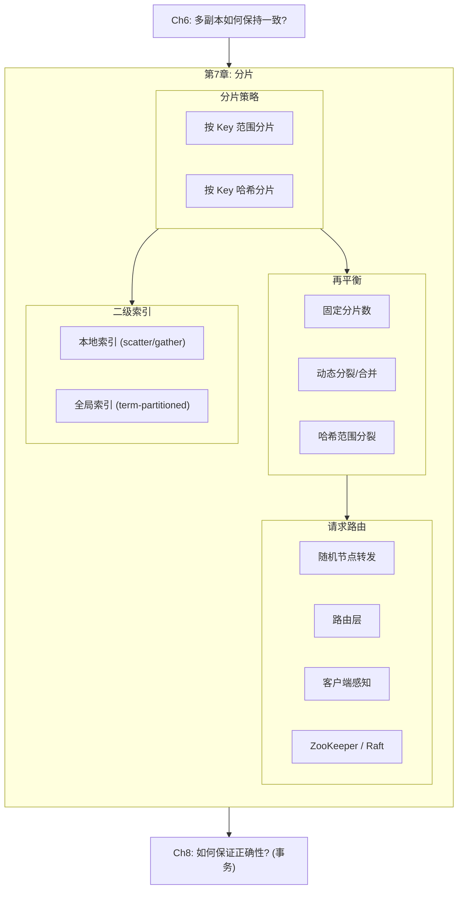

### 本章结构一览

| 小节 | 主题 | 关键概念 |
|------|------|---------|
| 7.1 | 分片的利弊与多租户 | 水平扩展、热点、Cell-Based Architecture |
| 7.2 | 按 Key 范围分片 | 范围扫描、热点时间戳、动态分裂 |
| 7.3 | 按 Key 哈希分片 | 一致性哈希、固定分片数、哈希范围分裂 |
| 7.4 | 热点问题与再平衡 | 热 Key 拆分、自动 vs 手动再平衡 |
| 7.5 | 请求路由 | ZooKeeper、Gossip、Routing tier |
| 7.6 | 二级索引与分片 | Local index (scatter/gather) vs Global index (term-partitioned) |
## 7.1 分片的利弊与多租户

### 分片 vs 复制

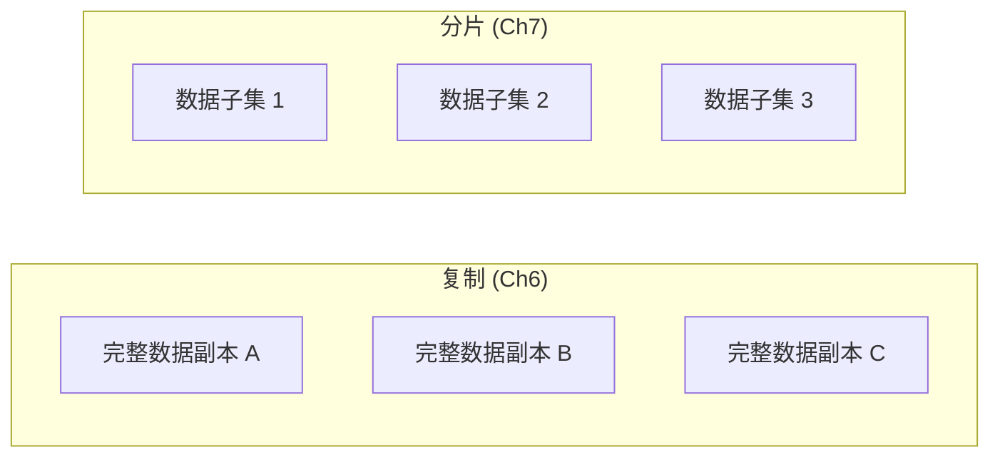

- **复制**：每个节点保存完整数据副本 → 高可用 + 读扩展
- **分片**：每个节点只保存数据的一个子集 → 容量扩展 + 写扩展

实践中两者通常**同时使用**：每个分片有多个副本（如 Figure 7-1 所示，Node 1 可能是 Shard 1 的 Leader 同时是 Shard 2 的 Follower）。

### 为什么需要分片？

| 场景 | 说明 |
|------|------|
| **数据量超出单机** | 单机磁盘容量不足以存储全部数据 |
| **写吞吐超出单机** | 单机 CPU/IO 无法处理所有写入 |
| **读吞吐超出单机** | 复制可以扩展读，但分片可以进一步分散负载 |

> **重要提醒**：如果单机能搞定，**不要分片**。分片引入巨大的复杂度——partition key 选择、分布式事务、跨分片查询等。现代单机已经非常强大。

### 分片的代价

| 代价 | 说明 |
|------|------|
| **Partition Key 选择困难** | 决定了数据如何分布，选错了会造成热点 |
| **跨分片查询** | 无法知道 partition key 时需扫描所有分片 |
| **分布式事务** | 跨分片的写入需要分布式事务（Ch8），性能差 |
| **二级索引复杂** | 二级索引与分片的交互是一个难题 |
| **运维复杂度** | 再平衡（rebalancing）、故障处理更复杂 |

### 单机也分片

一些系统在**单机内**也使用分片——利用多核 CPU 并行或 NUMA 架构：
- Redis、VoltDB、FoundationDB [6] 使用单线程进程 per shard，分片数 = CPU 核数
- 避免锁竞争，每个核心独立处理一个分片

### 多租户分片 (Sharding for Multitenancy)

SaaS 产品中，每个租户（tenant）是一个独立的数据集。分片天然适合多租户：

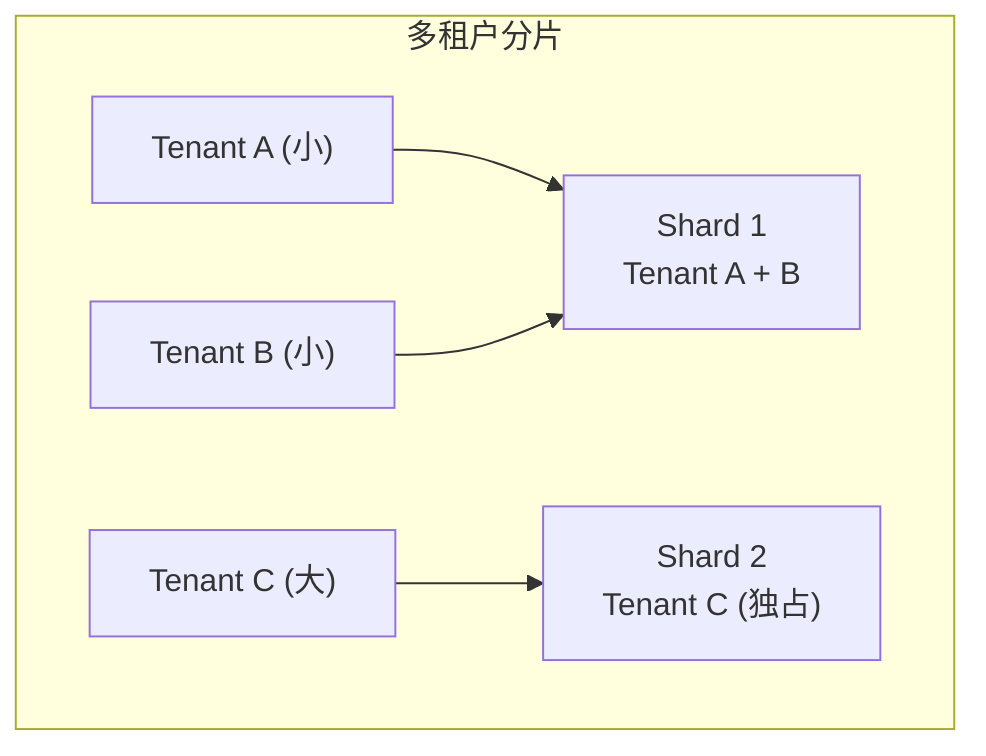

**多租户分片的优势**：

| 优势 | 说明 |
|------|------|
| **资源隔离** | 一个租户的重查询不影响其他租户 |
| **权限隔离** | 数据物理分离，减少越权风险 |
| **Cell-Based Architecture** [8] | 服务 + 存储按租户分组为独立 cell → 故障隔离 |
| **合规/数据驻留** | 将特定租户的分片分配到特定地区 |
| **渐进式 Schema 迁移** | 逐租户滚动升级 schema [11] |
| **独立备份恢复** | 按租户独立备份和恢复 |

**多租户分片的挑战**：
- 单个大租户可能超出单分片容量 → 需要在租户内部再分片 [12]
- 小租户太多时每个一个分片 → 开销过大，需要合并
- 跨租户的功能（如全局报表）需要跨分片查询
## 7.2 按 Key 范围分片 (Key Range Sharding)

### 基本原理

将 key 空间按范围划分，每个分片负责一段连续的 key 范围。类似百科全书的分卷——第 1 卷 A-B，第 2 卷 C-D，等等。

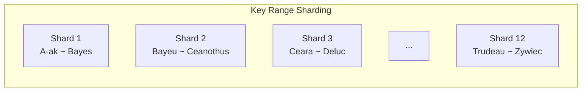

**关键细节**：
- 范围边界不一定均匀间隔（如字母表）——需要根据**实际数据分布**调整
- 边界可手动设置（Vitess for MySQL）或自动调整（HBase, Bigtable, MongoDB, CockroachDB, FoundationDB）

### 优势：范围扫描

分片内 key 有序存储（B-Tree 或 SSTable）→ **范围查询非常高效**：

```sql
-- 传感器数据场景：获取某传感器某月的所有读数
-- 如果 key = (sensor_id, timestamp)，同一传感器的数据在同一分片内连续
SELECT * FROM readings
WHERE sensor_id = 'S42'
  AND timestamp >= '2024-01-01'
  AND timestamp <  '2024-02-01';
-- → 只需查询一个分片，范围扫描即可
```

可以将 key 视为**连接索引**（concatenated index）：key 的第一部分确定分片，分片内按第二部分排序。

### 热点问题

**危险模式**：如果 key 是时间戳，所有写入集中在"当前时间"对应的分片 → 一个分片承担所有写入（热点），其他空闲。

**解决方案**：用其他字段作为 key 的第一部分（如 sensor_id），时间戳作为第二部分：

| Key 设计 | 效果 |
|---------|------|
| `timestamp` | 所有写入集中在一个分片（热点！） |
| `sensor_id + timestamp` | 写入按传感器分散到不同分片 ✅ 但按时间范围查所有传感器需要跨分片 |

### 动态再平衡：分裂与合并

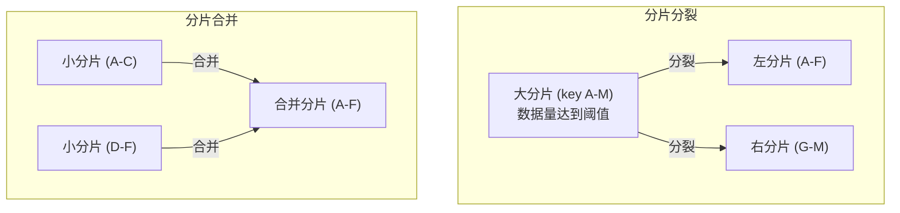

- **分裂触发**：分片大小达到阈值（HBase 默认 10 GB）或写入吞吐持续过高
- **合并触发**：大量删除后分片变小 → 合并相邻的小分片
- 类似 B-Tree 的分裂/合并（Ch4）
- **Pre-splitting**：HBase/MongoDB 允许在空数据库上预设初始分片边界（需预知数据分布）

**分裂的代价**：需要重写分片中的所有数据（类似 LSM compaction），如果分片本身已因负载高而需要分裂，分裂操作本身会加剧负载。

### 数据仓库中的分片

BigQuery、Snowflake、Delta Lake 等数据仓库也使用类似的分区方式：
- **Partition key**：决定数据落在哪个分区（通常按日期）
- **Cluster columns**：分区内的排序列，加速范围扫描和过滤
- 不仅优化查询性能，还能提升压缩率
## 7.3 按 Key 哈希分片 (Hash Sharding)

### 基本原理

对 key 应用哈希函数，根据哈希值分配到分片。即使原始 key 分布不均（如连续时间戳），哈希值也会均匀分布。

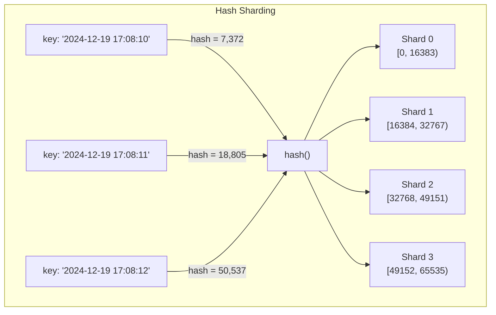

**常用哈希函数**：MongoDB 用 MD5，Cassandra/ScyllaDB 用 Murmur3。注意编程语言内置的 `hashCode()` / `Object#hash` 可能跨进程不一致 [16]，不适合分片。

### 代价：失去范围查询

哈希打散了 key 的顺序 → **范围查询变成全分片扫描**。

**Cassandra 的折中方案**：key 由多列组成时，第一列用哈希决定分片，分片内按后续列排序：

```
-- Cassandra 复合 partition key
PRIMARY KEY ((sensor_id), timestamp)
-- sensor_id 被哈希 → 决定分片
-- 同一 sensor_id 的数据在同一分片内按 timestamp 排序
-- → 单传感器的时间范围查询仍然高效
```

### hash(key) % N 的陷阱

最简单的方案是 `hash(key) % node_count`，但**增删节点时几乎所有 key 需要迁移**：

| 3 nodes: hash % 3 | 4 nodes: hash % 4 | 迁移？ |
|---|---|---|
| hash=0 → node 0 | hash=0 → node 0 | 不动 |
| hash=3 → node 0 | hash=3 → node 3 | **迁移** |
| hash=7 → node 1 | hash=7 → node 3 | **迁移** |

→ 不可接受。需要更好的方案。

### 方案1：固定分片数 (Fixed Number of Shards)

**核心思想**：分片数远多于节点数，分片分配到节点上。增删节点时只移动整个分片，不拆分。

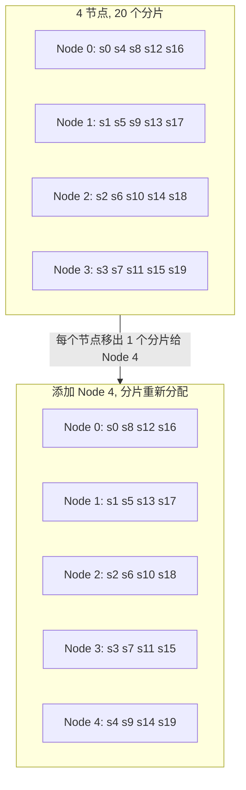

**优点**：移动整个分片比拆分分片便宜得多；不同硬件可分配不同数量的分片。

**使用者**：Citus (PostgreSQL), Riak, Elasticsearch, Couchbase。

**缺点**：分片数创建时固定，事后难改。太少 → 单个分片太大；太多 → 管理开销大。数据量变化大时难以选对。

### 方案2：哈希范围分裂 (Hash-Range Sharding)

结合哈希分片和范围分裂：每个分片对应一段**哈希值范围**（而非原始 key 范围），分片可以像 key-range sharding 一样动态分裂/合并。

**使用者**：Cassandra, ScyllaDB（每个节点默认 16-256 个范围，随机边界）。

### 一致性哈希 (Consistent Hashing)

将 key 映射到分片，满足两个性质：
1. key 均匀分布到各分片
2. 分片数变化时，尽可能少的 key 需要迁移

**注意**：此处的"一致性"与 replica consistency (Ch6) 和 ACID consistency (Ch8) 完全无关——仅指 key 尽量留在原分片。

| 算法 | 原理 | 使用者 |
|------|------|--------|
| **Consistent Hashing** [18] | 哈希环 + 虚拟节点 | Cassandra, ScyllaDB |
| **Rendezvous / HRW** [19] | 每个 key 对所有节点打分，选最高分 | |
| **Jump Consistent Hash** [21] | 确定性跳跃算法，内存极小 | |
## 7.4 热点问题与再平衡

### 热点 Key (Hot Spots)

即使哈希分片让 key 均匀分布，**负载仍可能不均**——某些 key 的访问频率远高于其他：

| 场景 | 热点原因 |
|------|--------|
| 社交媒体 | 明星发帖 → 该帖的 key 被百万次读写 [22] |
| 电商 | 秒杀商品 → 该商品 ID 的分片压力爆炸 |
| 游戏 | 热门服务器 → 某个分片集中大量活跃用户 |

### 缓解热点的策略

#### 策略1：应用层 Key 拆分

对已知热 key 添加随机后缀，将写入分散到多个"虚拟 key"：

```
原始 key:  celebrity_post_123
拆分为:   celebrity_post_123_00
          celebrity_post_123_01
          ...
          celebrity_post_123_99
→ 写入分散到 ~100 个分片
→ 读取时需并行查 100 个 key 再合并
```

**代价**：读取变复杂（需合并多个 key）；只对少量已知热 key 使用（大多数 key 不需要拆分）；需要额外的元数据记录哪些 key 被拆分了。

#### 策略2：数据库层热管理

一些云数据库提供自动热点管理：
- **DynamoDB Adaptive Capacity** [26, 17]：自动检测热分片并拆分
- **Facebook Shard Manager** [24]：通过灵活的分片分配策略将热分片移到空闲节点

#### 策略3：读写分离热管理

某些 key 读热但写冷（或反之）→ 读和写需要不同的策略：
- 读热：增加读副本 / 缓存层
- 写热：key 拆分 / 批量合并写入

### 自动 vs 手动再平衡

| 模式 | 优点 | 风险 |
|------|------|------|
| **全自动** | 无需人工干预，适应负载变化 | 再平衡本身消耗大量 IO/网络 → 可能加剧已有的性能问题；自动故障检测 + 自动再平衡 → **级联故障**风险 |
| **半自动** | 系统建议分片迁移方案，人工确认后执行 | 较安全，但需运维人员在线 |
| **手动** | 完全可控 | 慢，但可用于预见性再平衡（如大促前） |

**级联故障的经典场景**：
1. Node A 因过载响应变慢
2. 系统判定 Node A "故障"
3. 自动将 Node A 的分片迁移到其他节点
4. 其他节点承担额外负载 → 也变慢
5. 系统判定更多节点"故障" → 继续迁移
6. 最终全集群崩溃

> **建议**：生产环境保持人工审批再平衡，至少在关键时刻（如已有节点过载时）。DynamoDB 等云数据库的全自动再平衡经过大量工程优化，但自建系统需谨慎。
## 7.5 请求路由 (Request Routing)

### 核心问题

客户端想读写 key=X 的数据，但 X 在哪个节点上？分片到节点的映射随再平衡而变化。

### 三种路由方式

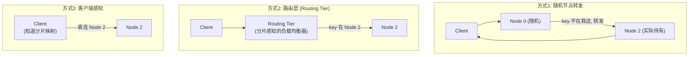

### 谁来维护分片映射？

| 方案 | 原理 | 使用者 |
|------|------|--------|
| **ZooKeeper / etcd** | 每个节点注册到 ZK；ZK 维护 shard→node 映射；路由层/客户端订阅变更通知 | HBase, SolrCloud, Kafka |
| **Raft 内置共识** | 数据库节点间通过 Raft 共识协议同步分片映射，无需外部协调 | Kafka (KRaft), YugabyteDB, TiDB, ScyllaDB [28] |
| **Gossip 协议** | 节点间相互传播集群状态（无中心协调）；一致性较弱但简单 | Riak, Cassandra |
| **Config Server** | 专用的配置服务器维护映射 | MongoDB (mongos + config servers) |

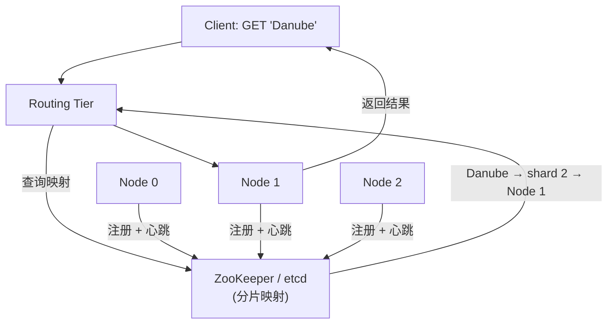

### 分片迁移期间的路由

分片从 Node A 迁移到 Node B 的过程中，请求可能发到旧节点。处理方式：
- 旧节点转发请求到新节点
- 或返回重定向（类似 HTTP 302）让客户端重试

### OLTP vs OLAP 的路由差异

- **OLTP**：每个请求通常只涉及一个 key → 路由到单个分片
- **OLAP**：查询需要聚合/JOIN 多个分片的数据 → 发送到所有相关分片，并行执行后合并结果（Ch11 详述）
## 7.6 二级索引与分片

### 问题：二级索引不服从分片规则

主键索引天然与分片对齐——知道 partition key 就知道去哪个分片。但二级索引（如"按颜色查找汽车"）涉及的记录可能散布在多个分片中。

### 方案1：本地二级索引 (Local Secondary Index)

每个分片独立维护自己的二级索引，只索引本分片的数据。

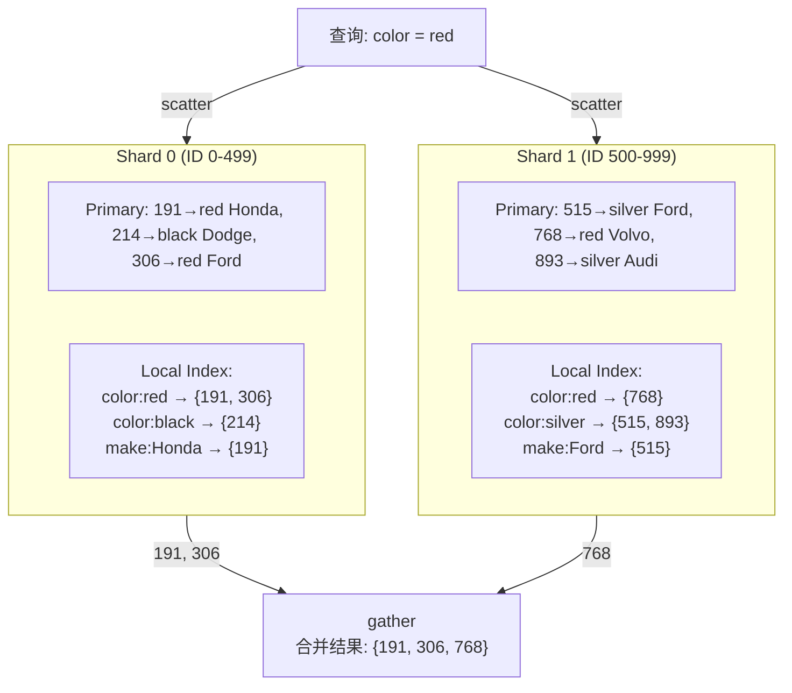

**也叫**：document-partitioned index [29]

| 优点 | 缺点 |
|------|------|
| 写入简单（只需更新本分片的索引） | 读取需查询**所有分片** (scatter/gather) |
| 无跨分片写入 | 尾延迟高（最慢的分片决定响应时间） |
| | 分片数越多，查询越慢 |

**使用者**：MongoDB, Riak, Cassandra, Elasticsearch [30-32], SolrCloud, VoltDB [33]

### 方案2：全局二级索引 (Global Secondary Index)

构建一个覆盖**所有分片**数据的全局索引，索引本身也按索引值分片。

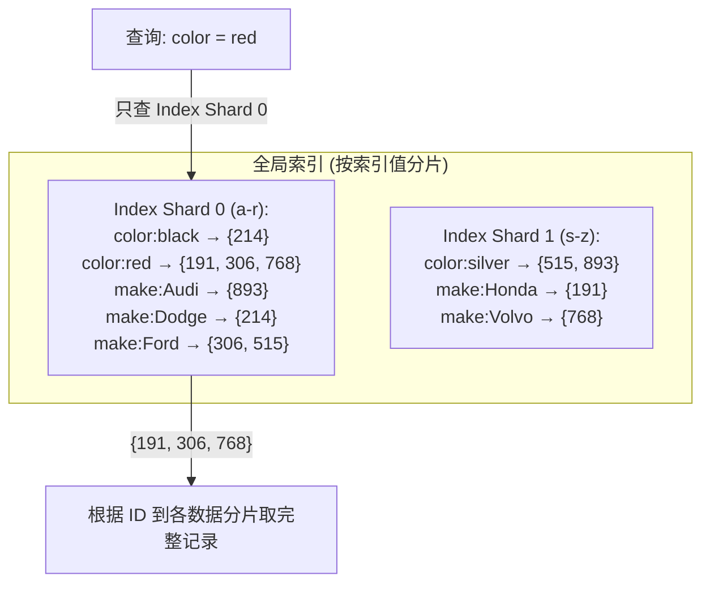

**也叫**：term-partitioned index [29]

| 优点 | 缺点 |
|------|------|
| 按单个索引值查询只需查一个索引分片 | 写入复杂：一条记录可能影响多个索引分片 |
| 读性能好 | 写入需要分布式事务保证一致性（或接受异步更新的延迟） |

**使用者**：CockroachDB, TiDB, YugabyteDB, DynamoDB

**DynamoDB 的 GSI 是异步更新的**——写入后全局索引可能短暂过时（类似复制延迟）。

### 综合对比

| 维度 | Local Index | Global Index |
|------|-------------|--------------|
| 写入复杂度 | 低（单分片） | 高（跨分片） |
| 读取复杂度 | 高（scatter/gather） | 低（单索引分片） |
| 一致性 | 与主数据实时一致 | 可能异步滞后 |
| 适用场景 | 写多读少；或查询总是包含 partition key | 读多写少；按索引值查询频繁 |

### 多条件查询的挑战

查询 `color = red AND make = Ford` 时：
- **Local index**：发到所有分片，每个分片内做 AND → scatter/gather
- **Global index**：两个条件可能在不同索引分片上 → 需要交叉两个 postings list（如果 list 很长，跨网络传输代价大）

---

## 💻 代码示例与最佳实践

### 示例1：PostgreSQL + Citus 分片

```sql
-- 安装 Citus 扩展后，将 orders 表按 customer_id 分片
SELECT create_distributed_table('orders', 'customer_id');

-- 同一 customer_id 的查询自动路由到单个分片 → 高效
SELECT * FROM orders WHERE customer_id = 42;

-- 跨分片查询（全局聚合）→ Citus 自动 scatter/gather
SELECT customer_id, SUM(amount)
FROM orders
GROUP BY customer_id
ORDER BY SUM(amount) DESC
LIMIT 10;

-- co-location: 将 orders 和 order_items 按同一 key 分片
-- → 同一客户的 JOIN 在单个分片内完成
SELECT create_distributed_table('order_items', 'customer_id',
    colocate_with => 'orders');
```

### 示例2：Cassandra 复合分片键

```sql
-- 复合主键: user_id 决定分片, posted_at 决定分片内排序
CREATE TABLE posts (
    user_id     UUID,
    posted_at   TIMESTAMP,
    content     TEXT,
    PRIMARY KEY ((user_id), posted_at)
) WITH CLUSTERING ORDER BY (posted_at DESC);

-- 高效: 同一用户的最近 10 条帖子 (单分片范围扫描)
SELECT * FROM posts
WHERE user_id = ?
ORDER BY posted_at DESC
LIMIT 10;

-- 低效: 查找所有用户的帖子 (全分片扫描)
-- Cassandra 会警告: "ALLOW FILTERING required"
SELECT * FROM posts WHERE posted_at > '2024-01-01';
```

### 最佳实践

| 决策 | 建议 |
|------|------|
| 是否分片 | 单机能撑住就不要分片 |
| 分片策略 | 按 key 范围 → 范围查询友好但有热点风险；按 key 哈希 → 均匀但失去范围能力 |
| Partition Key 选择 | 选择基数高、查询频繁包含、写入分散的列 |
| 复合 Key | 第一列决定分片（高基数），后续列决定分片内排序 |
| 再平衡 | 保持人工审批；预留 headroom 避免紧急再平衡 |
| 二级索引 | 写密集 → local index；读密集 → global index |

---

## 🎯 系统设计面试题

### 面试题1：设计一个分布式社交媒体的 Feed 存储

**题目**: 设计类似 Twitter 的系统，支持：1 亿用户，每用户每天平均 5 条帖子，读取某用户最近 100 条帖子。

**思路分析**:

| 决策 | 选择 | 原因 |
|------|------|------|
| 分片 Key | `user_id` | 同一用户的帖子在同一分片 → 读取高效 |
| 排序 Key | `posted_at DESC` | 分片内按时间倒序 → 获取最新帖子 = 范围扫描 |
| 分片策略 | 按 `user_id` 哈希 | 用户 ID 分布均匀，避免热点 |
| 热门用户 | Key 拆分 + 缓存 | 明星用户的帖子被百万次读取 → 缓存层 |
| 时间线 (Feed) | 扇出写 (fan-out-on-write) | 发帖时写入 follower 的 timeline → 读取无需 JOIN |
| 二级索引 | 不需要 | 主查询模式是按 user_id 查 → 与分片键对齐 |

### 面试题2：hash(key) % N 为什么不行？

**参考答案**:
- N (节点数) 改变时，几乎所有 key 的 `hash % N` 结果都变了 → 大量数据迁移
- 3 节点 → 4 节点时，约 75% 的 key 需要迁移
- 替代方案：固定分片数（key → shard 映射不变，只调整 shard → node 映射）或一致性哈希（最小化迁移）

### 面试题3：Local Index vs Global Index 如何选？

**参考答案**:

| 如果... | 选择 | 原因 |
|--------|------|------|
| 查询总是包含 partition key | Local | 只需查一个分片，无 scatter |
| 按非 partition key 频繁查询 | Global | 避免 scatter/gather 的尾延迟 |
| 写入吞吐远大于读取 | Local | 写入无需跨分片 |
| 读取吞吐远大于写入 | Global | 单索引分片即可响应 |
| 必须保证索引与数据实时一致 | Local | Global 通常异步更新 |

---

## 📝 本章要点总结

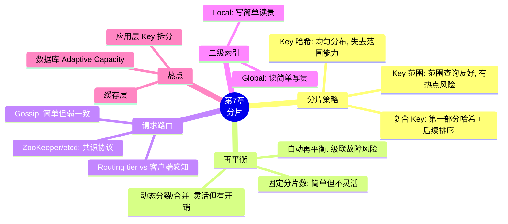

### 核心主线


### 八大 Takeaways

1. **能不分片就不分片**：单机性能很强，分片引入 partition key 选择、分布式事务、跨分片查询等巨大复杂度

2. **两种基本策略**：Key 范围分片（范围查询友好，有热点风险）vs Key 哈希分片（均匀分布，失去范围查询能力）

3. **复合 Key 是最佳实践**：第一部分决定分片（用哈希保证均匀），后续部分决定分片内排序（保留范围查询能力）

4. **hash(key) % N 是反模式**：节点数变化时大量数据迁移。用固定分片数或一致性哈希替代

5. **热点无法完全消除**：即使哈希均匀分布 key，少数超热 key 仍需特殊处理（应用层拆分、缓存、数据库层 adaptive capacity）

6. **自动再平衡有级联故障风险**：自动故障检测 + 自动再平衡 → 过载节点被"判死"→ 其他节点也过载 → 雪崩。保持人工审批更安全

7. **请求路由依赖元数据一致性**：ZooKeeper/etcd 通过共识协议维护 shard→node 映射；Gossip 更简单但一致性弱

8. **二级索引两种方式**：Local（写简单读贵，scatter/gather）vs Global（读简单写贵，可能异步滞后）

### 连接下一章

