# 第7章：分片 (Sharding)

> *"Clearly, we must break away from the sequential and not limit the computers. We must state definitions and provide for priorities and descriptions of data. We must state relationships, not procedures."*
> — Grace Murray Hopper, *Management and the Computer of the Future* (1962)

第 6 章讲**复制**：同一份数据放多台机器。本章讲**分片（sharding）**：数据太多/写入太高，单机扛不住，就把数据**拆成多份**，每台机器只存一份。分布式数据库通常**两者都用**——每个分片再各自复制几份。

---

## 🗺️ 章节导航

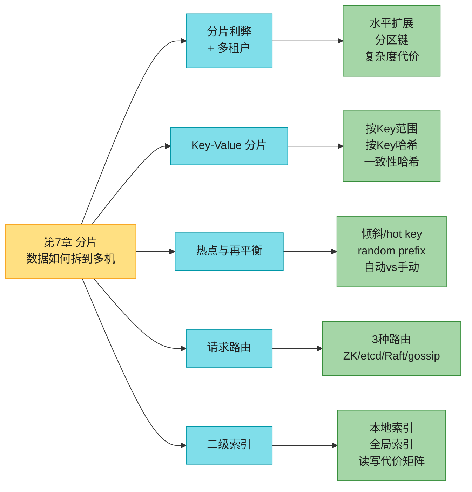

---

## 0. 分片 vs 复制 & 一堆同义词

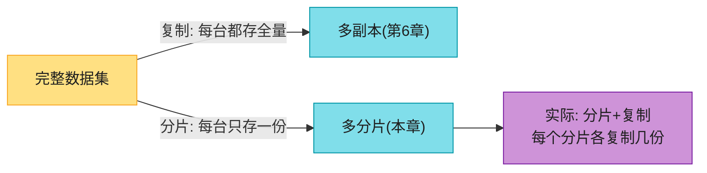

**分片 + 复制组合**（Figure 7-1）：每个分片有自己的 leader/follower，分散在不同节点。一个节点**可能同时是某些分片的 leader、另一些分片的 follower**，但每个分片始终只有一个 leader。本章为简化，先忽略复制（复制方案与分片方案基本独立）。

> 📝 **名词注释：分片 (shard) 的一堆别名**
> 不同软件叫法不同，**本质都是同一件事**：
> | 术语 | 产品 |
> |------|------|
> | partition（分区） | Kafka |
> | range（范围） | CockroachDB |
> | region（区域，≠地理region） | HBase、TiDB |
> | vBucket | Couchbase |
> | vnode | Riak |
> | token-range | Cassandra |
> | tablet（片） | Bigtable、YugabyteDB、ScyllaDB |
>
> **PostgreSQL 特例**：partitioning = 同机拆大表（便于整分区删除等）；sharding = 跨机拆。其他系统里两者常混用。

> 📝 **词源**："shard" 据说源自网游《Ultima Online》——一块魔法水晶碎成多片，每片折射出一个游戏世界的副本，于是 shard 就指"一组并行游戏服务器之一"，后被借到数据库。另一说法是 SHARD = "System for Highly Available Replicated Data"缩写（1980s 一个数据库，细节已不可考）。
>
> ⚠️ **分片 ≠ 网络分区 (network partition / netsplit)**——后者是节点间网络故障，第 9 章讲。两者只是英文都叫 partition，毫无关系。

---

## 1. 分片的利弊 (Pros and Cons)

### 1.1 为什么要分片：水平扩展

分片的**首要动机是可扩展性 (scalability)**：数据量或写入吞吐超过单机能力时，把数据和写入摊到多机。这是实现**水平扩展（scale-out，加更多小机器）**而非垂直扩展（换更大机器）的主要工具（[[ch02]] 讲过 shared-nothing 架构）。

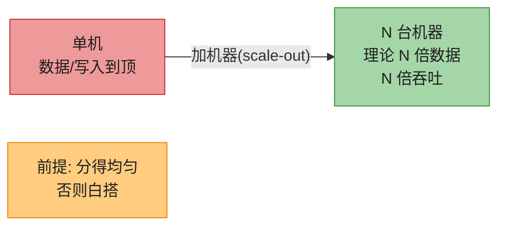

> 💡 **读瓶颈 ≠ 写瓶颈**：如果是**读吞吐**不够，**不一定非要分片**——用第 6 章的**读扩展（加 follower）**即可。分片主要解决**数据量**和**写入吞吐**单机装不下/扛不住的问题。

### 1.2 分片的代价（为何"能不分就不分"）

复制在小规模和大规模都有用（容错、离线），但分片是**重量级方案**，主要在大规模才有意义。**单机能搞定就别分片**（如今单机能力很强！）。原因——分片带来一堆复杂度：

| 代价 | 说明 |
|------|------|
| **要选分区键 (partition key)** | 同一分区键的所有记录放同一分片。选错 → 访问灾难。**且方案极难更改**。 |
| **不知在哪个分片 → 全分片扫描** | 知道在哪个分片，访问快；不知道就得低效地搜遍所有分片（scatter-gather）。 |
| **关系数据难分片** | KV 数据按 key 分片容易；关系数据要按二级索引查、要 join（可能跨分片）就难。 |
| **跨分片写需分布式事务** | 一次写要更新多个分片的相关记录 → 分布式事务。单机事务常见且快，**跨分片事务慢得多、可能成瓶颈**（第 8 章）。 |

> 📝 **名词注释：分区键 (partition key) / 分片键 (shard key)**
> 决定一条记录进哪个分片的字段。KV 库里通常是 key 本身或 key 的前缀；关系库里可能是某列（不一定是主键）。**所有分区键相同的记录必在同一分片**——这是后面"复合键"能做高效范围查询的基础。

### 1.3 单机也分片（每核一进程）

有些系统**单机内部也分片**：每个 CPU 核跑一个单线程进程，靠分片把负载摊到多核，或利用 **NUMA**（非统一内存访问：某些内存 bank 离某个 CPU 更近）[5]。**Redis、VoltDB、FoundationDB** 就是每核一进程 + 分片跨核 [6]。

> 🏭 **启示**：分片不只是"跨机器"，连"跨 CPU 核"都用同一套思想。Redis 单线程模型之所以快，部分原因就是避免了跨核协调——把数据分片到核，每核独立。

---

## 2. 多租户分片 (Sharding for Multitenancy)

> 📝 **名词注释：多租户 (multitenancy) / 租户 (tenant)**
> SaaS 产品常是多租户：每个**租户 = 一个客户**。一个租户下可能有多个用户账号，但每个租户的数据集**自包含、与其他租户隔离**。例如邮件营销服务里，每个签约企业是一个租户，它的订阅者、投递数据都和别的企业分开。

分片常用来实现多租户：**每个租户一个分片**，或**多个小租户合并到一个大分片**。这些分片可以是物理独立的数据库，也可以是一个大逻辑库的若干可独立管理部分 [7]。

### 2.1 多租户分片的六大优势

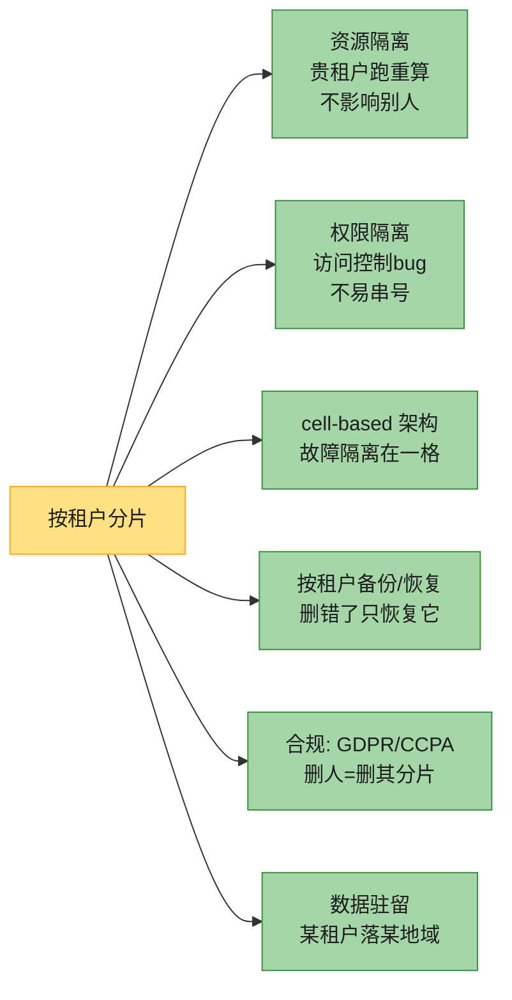

1. **资源隔离**：某租户跑重操作，跑在不同分片上的其他租户性能不易受影响。
2. **权限隔离**：访问控制有 bug，租户数据物理分开 → 不易误把 A 租户数据给 B。
3. **cell-based 架构** [8]：不只存储层分片，**应用代码服务也分片**。一组租户的服务+存储打包成自包含 **cell**，各 cell 大致独立运行。**一个 cell 的故障局限在该 cell**，不波及其他。
4. **按租户备份/恢复** [9]：每个租户的分片单独备份 → 租户误删时能单独恢复，不影响别人。
5. **法规合规（GDPR/CCPA）**：个人有权要求导出/删除自己的数据。若每个人的数据在独立分片，导出/删除 = 对其分片的简单操作 [10]。
6. **数据驻留 (data residence)**：某租户数据必须存某司法管辖区 → region-aware 库可把该租户分片指派到对应 region。
7. **灰度 schema 滚动** [11]：schema 变更可逐租户灰度上线，提前发现问题再全量。降低风险（但事务性地做较难）。

### 2.2 多租户分片的三大挑战

- **单租户太大**：假设了每个租户单机装得下。若某租户超大 → 还得**在该租户内部再分片**，绕回"为扩展而分片" [12]。
- **太多小租户**：每租户一分片开销太大。可合并若干小租户到大分片，但**租户增长后怎么从一分片迁到另一分片**又成问题。
- **跨租户功能**：若要 join 跨租户数据，跨分片 join 很难。

> 🏭 **真实案例**：Slack 用 **Vitess**（MySQL 分片层）按 workspace（租户）分片 [12]；Notion 把 500GB 单 Postgres 按 page_id 哈希分片到多机 [4]——都是"单租户/单库撑不住后被迫分片"的典型。

---

## 3. Key-Value 数据的分片

### 3.1 目标：均匀 + 可再平衡

分片的目标：**把数据和查询负载均匀摊到各节点**。理想情况下 10 个节点能扛 10 倍数据、10 倍读写吞吐（忽略复制）。加减节点时能**再平衡 (rebalance)** 让负载重新均匀。


> 📝 **名词注释：倾斜 (skew) / 热点 (hot spot)**
> 分片不公 → 某些分片数据/查询远多于其他 = **倾斜**。极端时全部负载堆在一个分片，9/10 节点闲置，瓶颈在那一个忙节点 = **热分片 (hot shard / hot spot)**。某个 key 负载特别高（如明星）= **热 key (hot key)**。

我们需要一个算法：**输入分区键 → 输出在哪个分片**，且**可再平衡**以缓解热点。两大流派：按 key 范围、按 key 哈希。

#### 深入：分区键选型三原则（选错万劫不复）

分区键一旦上线极难改（MongoDB 4.2 前根本不能改），所以**设计阶段必须慎之又慎**。三大判据：

```mermaid
flowchart TD
    KEY["分区键候选"] --> C{"① 基数 high cardinality<br/>键值够多样吗?"}
    C -->|"否(如性别/状态)"| BAD1["❌ 分不开<br/>最多几个分片"]
    C -->|"是"| F{"② 频率 low frequency<br/>单值不过分集中?"}
    F -->|"否(某值占大流量)"| BAD2["❌ 热点"]
    F -->|"是"| M{"③ 非单调 non-monotonic<br/>不是递增序列?"}
    M -->|"是单调(时间戳/ObjectId)"| BAD3["❌ 写全砸最新分片"}
    M -->|"非单调"| GOOD["✅ 可用(范围分片下)<br/>或哈希分片"]
    style KEY fill:#FFE082,stroke:#F9A825,color:#1f1f1f
    style C fill:#80DEEA,stroke:#0097A7,color:#1f1f1f
    style F fill:#80DEEA,stroke:#0097A7,color:#1f1f1f
    style M fill:#80DEEA,stroke:#0097A7,color:#1f1f1f
    style BAD1 fill:#EF9A9A,stroke:#C62828,color:#1f1f1f
    style BAD2 fill:#EF9A9A,stroke:#C62828,color:#1f1f1f
    style BAD3 fill:#EF9A9A,stroke:#C62828,color:#1f1f1f
    style GOOD fill:#A5D6A7,stroke:#388E3C,color:#1f1f1f
```

> **反例 1（基数太低）**：用"国家"当分区键，但 80% 用户在某个国家 → 那个分片爆，其他国家分片空。
> **反例 2（频率集中）**：用"user_id"，但某明星 user_id 占了三成流量 → 该分片热点。
> **反例 3（单调递增）**：用自增 ID 或时间戳单独当范围分片键 → 所有写都堆在"最新"那个分片（[[ch04]] 的 LSM 也有类似问题）。

> **解法组合拳**：
> - 单调键想用 → 改**哈希分片**（打散）或**复合键**（前缀散开 + 后缀排序）。
> - 热点 key → 应用层随机前缀拆写（§3.4）。
> - 关联记录要同分片 → 用"业务实体 ID"当分区键（如 `user_id`，把该用户的订单、地址都聚一起，本地 join）。

> 🏭 **MongoDB 的复合分片键** `{userId: 1, _id: 1}`：`userId` 当分区键前缀（散开），`_id`（ObjectId，单调）当后缀在分片内排序。这样既避免 `_id` 单独作键的单调热点，又能在同 `userId` 内做高效范围查询。**选键前务必模拟峰值负载、倾斜、查询模式反复推演。**

### 3.2 按 Key 范围分片 (Sharding by Key Range)

像纸质百科全书：每个分片拥有**一段连续的 key 范围**（从最小到最大），每个分片 = 一卷。

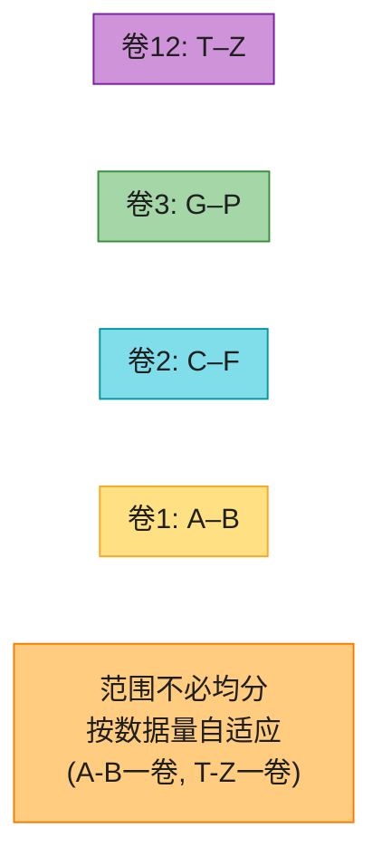

> **关键**：范围边界**不必均匀**——数据不均匀分布，边界要**适应数据**。A-B 一卷、T-Z 一卷，比"每两字母一卷"更均衡。

**边界谁定？**
- **手动**：管理员定。**Vitess**（MySQL 分片层）用手动。
- **自动**：**Bigtable / HBase / MongoDB(range) / CockroachDB / RethinkDB / FoundationDB** 自动。**YugabyteDB** 手动+自动皆可。

**分片内 key 排序**（B-tree / SSTable，第 4 章）→ **范围扫描 (range scan) 容易**，还能把 key 当**复合索引**一次取多条相关记录。

> **传感器例子**：key = 时间戳。范围扫描能轻松取"某月所有读数"。**但有个大坑** ↓

#### 范围分片的大坑：时间戳导致写热点

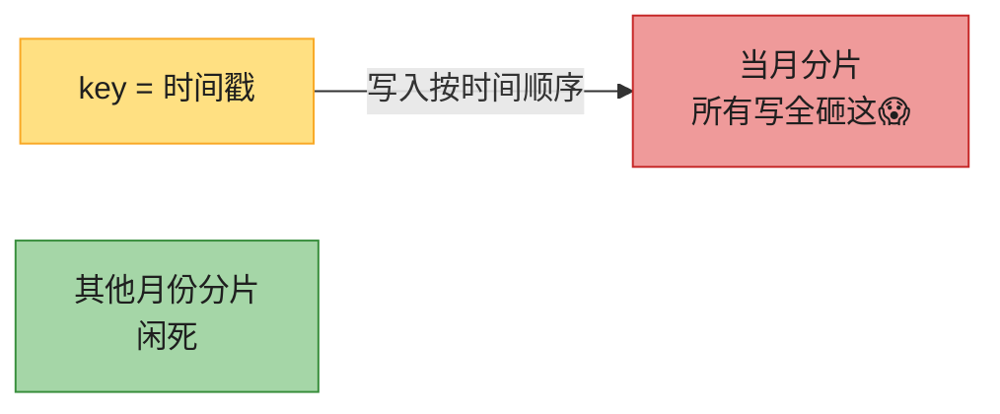

key 是时间戳 → 分片对应时间段（如一月一分片）。实时写数据时，**所有写都砸向"本月"那个分片**，其他闲死 [13]。

**解法**：别用时间戳当 key **第一部分**。**前缀加传感器 ID** → 先按传感器 ID 排、再按时间戳。多个传感器同时活跃，写入就均匀摊开了。代价：要查"某时段多个传感器的值"，得**每个传感器各做一次范围查询**。

> 🏭 **MongoDB 复合分片键**：`{ sensorId: 1, timestamp: 1 }` —— 前缀 `sensorId` 决定分片（散开），同 `sensorId` 内按 `timestamp` 排序（范围查询高效）。这就是"分区键 = key 前缀，分片内按其余 key 排序"的精髓。

#### 范围分片的再平衡：分裂与合并

- **预分裂 (pre-splitting)**：空库时先配一组初始分片（HBase、MongoDB 支持），需预判 key 分布选合适边界 [14]。
- **分裂 (split)**：分片太大/写入持续超阈值 → 分裂成两个连续子范围，分散到不同节点。HBase 默认 **10GB** 触发分裂。
- **合并 (merge)**：大量删除后相邻小分片合并成大分片。类似 B-tree 顶层行为。

> ⚠️ **分裂很贵**：要把分片所有数据重写到新文件（类似 LSM 的 compaction）。**需要分裂的分片往往本就高负载**，分裂的开销会火上浇油，可能压垮它。

### 3.3 按 Key 哈希分片 (Sharding by Hash of Key)

如果你**不在乎相邻 key 是否同分片**（如多租户里 key 是 tenant ID），常见做法是**先对分区键求哈希**再映射到分片。

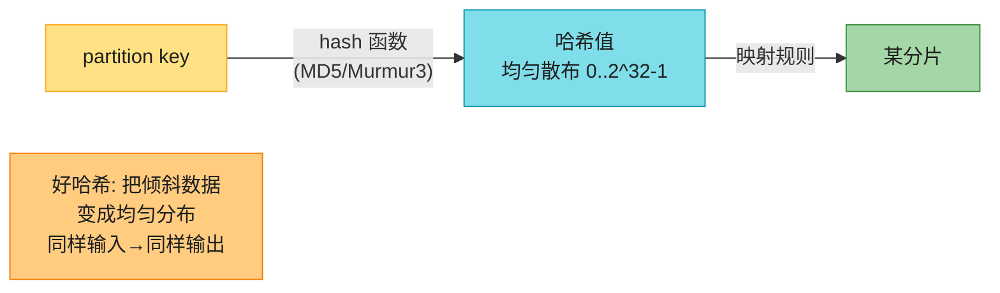

**哈希函数**：分片用**不必密码学强度**。**MongoDB 用 MD5**；**Cassandra / ScyllaDB 用 Murmur3**。

> ⚠️ **语言内置哈希不一定能用**：Java 的 `Object.hashCode()`、Ruby 的 `Object#hash`，**同一个 key 在不同进程可能哈希值不同** → 不能用于分片 [16]。必须用**跨进程稳定**的哈希。

#### hash(key) % N 的陷阱（Figure 7-3）

第一反应：哈希值**对节点数 N 取模**。`hash(key) % 10` → 0~9，10 个节点编号 0~9，完美？

**致命问题：N 一变，几乎所有 key 都要搬家。**

#### 深入：hash(key)%N 为什么是灾难（数据搬迁量手算）

> **手算（Figure 7-3）**：3 节点 → 加第 4 个节点。
> 加之前（N=3），key 按 `hash%3`：
> - node0 存 hash=0,3,6,9,...
> - node1 存 hash=1,4,7,...
> - node2 存 hash=2,5,8,...
>
> 加第 4 个节点后（N=4），key 按 `hash%4` 重新分配：
> - hash=3 → 原在 node0，现 `3%4=3` → **node3**
> - hash=6 → 原在 node0，现 `6%4=2` → **node2**
> - hash=9 → 原在 node0，现 `9%4=1` → **node1**
>
> **结果：加 1 个节点，约 3/4 的 key 都要搬迁！** 明明只多了 1/4 容量，却搬了 3/4 数据——绝大多数是**无意义搬迁**。

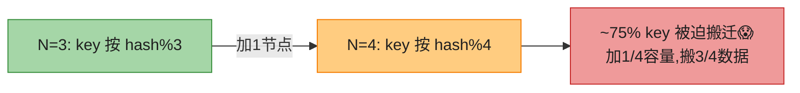

`mod N` 易算，但**再平衡极低效**。我们需要"**搬得越少越好**"的方案。三大解法：

#### 方案 1：固定分片数 (Fixed Number of Shards)

最简单也最常用：**一开始就创建远多于节点数的分片**，每节点分多个。

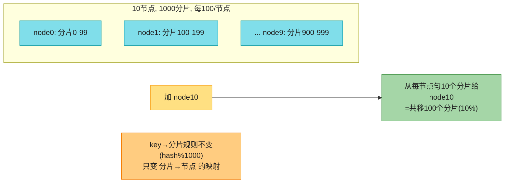

key 进 `hash(key) % 1000` 号分片；系统单独维护"分片→节点"映射。加节点时，把部分分片从旧节点迁到新节点直到均匀。**只搬整个分片（比分裂分片便宜）；key→分片规则不变，只变分片→节点映射。**

> 💡 **技巧**：分片数选**因子多的数**（如 1000、2048），便于均匀分给各种节点数（不必节点数是 2 的幂）。还能照顾**异构硬件**——给强节点分更多分片。

> 🏭 **谁用**：**Citus**（Postgres 分片层）、**Riak**、**Elasticsearch**、**Couchbase**、**Redis Cluster（16384 槽）**。

**局限**：需要**一开始就估准分片数**。估错（规模增长到需要比分片数还多的节点）→ 昂贵的 **resharding**（每个分片都要分裂重写，占大量磁盘；有些系统 resharding 时不让并发写 → 改分片数得停机）。数据量高度可变时（开始小、未来暴增）选分片数很难。

#### 方案 2：哈希范围分裂 (Hash-Range Sharding)

若分片数无法预估，用**能随负载自适应**的方案。范围分片有这个特性（可分裂），但有相邻 key 写热点风险。**解法：把范围分片和哈希结合**——每个分片拥有一段**哈希值范围**（而非 key 范围）。

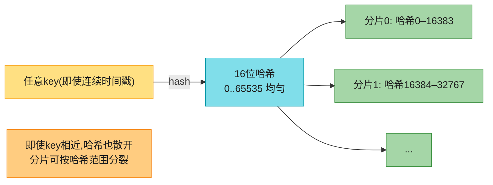

和范围分片一样，太满/太忙就分裂。**代价**：分区键上的范围查询低效（范围内的 key 现在散在所有分片）。但若 key 是多列、分区键只是第一列，**同分区键内的其余列仍可高效范围查询**（只要范围查询里所有记录同分区键 → 同分片）。

> 🏭 **谁用**：**YugabyteDB、DynamoDB** [17] 用 hash-range；**MongoDB** 可选。**Cassandra/ScyllaDB** 用其变体（下图）。

#### 方案 2.5：Cassandra/ScyllaDB 的 vnode 变体

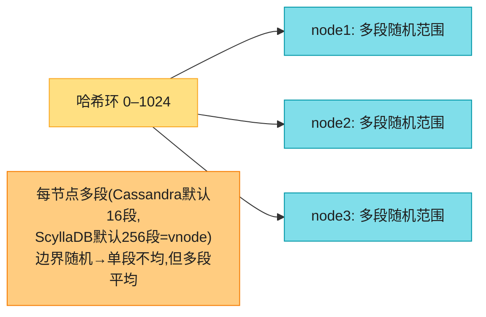

哈希空间分成**与节点数成比例的多段**（图示每节点 3 段；实际 Cassandra 16 段/节点，ScyllaDB **256 段/节点**），**边界随机**。有些段大有些小，但每节点多段 → **不均相互抵消** [15]。加减节点时调整边界、分裂/合并。图 7-6 加 node3 时，node1 转移两段的部分、node2 转移一段的部分给 node3，**给新节点公平份额，又不多搬**。

> 📝 **名词注释：vnode（虚拟节点）**
> ScyllaDB 的"每节点 256 段"就是 **vnode（虚拟节点）**——一个物理节点在哈希环上占 256 个虚拟位置。vnode 的好处：①加节点时数据从**所有**老节点均匀流向新节点（而非只从一个邻居流），避免单点瓶颈；②异构节点可给强节点更多 vnode。这是**一致性哈希的工程强化版**。

#### 一致性哈希 (Consistent Hashing)

> 📝 **名词注释：一致性哈希 (consistent hashing)**
> 一种把 key 映射到固定数量分片的哈希函数，满足两条：
> 1. 每个分片的 key 数**大致相等**。
> 2. 分片数变化时，**尽可能少的 key 搬家**。
>
> ⚠️ "consistent" 这里和**副本一致性（第6章）**、**ACID 一致性（第8章）**都无关，指"**key 尽量留在原分片**"的倾向。

#### 深入：一致性哈希原理手算（环形空间）

> **核心思想**：把哈希空间想象成一个**环**（0 到 2^32-1 首尾相连）。节点和 key 都映射到环上某个点。**key 顺时针走，遇到的第一个节点就是它的归属。**

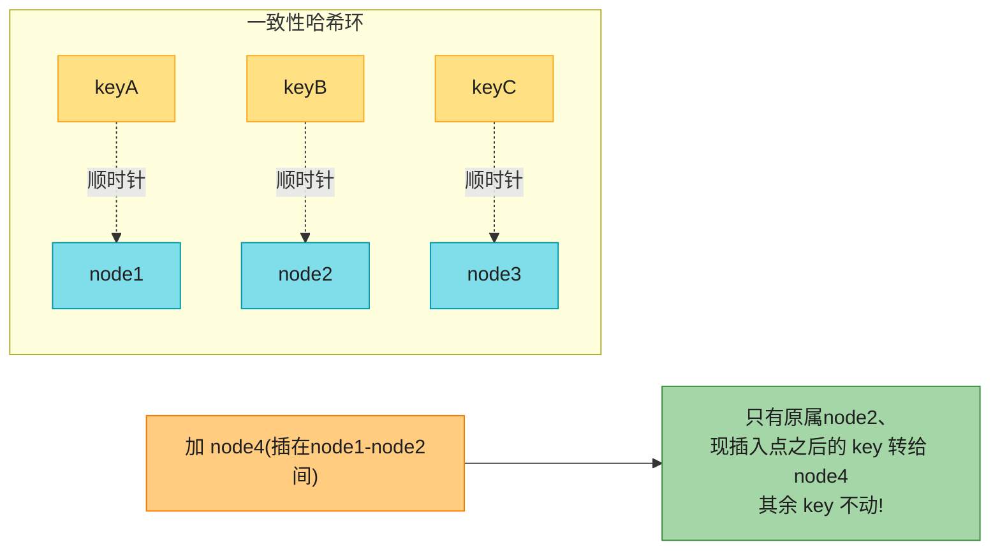

> **对比 hash%N**：加一个节点，一致性哈希**只搬约 1/N 的 key**（新节点接管的那段弧），而不是 hash%N 的 ~3/4。这就是"consistent"——**最小搬迁**。
>
> **基础一致性哈希的问题**：节点少时，环上节点分布**不均**（某节点管一大段弧 → 数据倾斜）。**解法 = vnode**：每节点在环上占多个虚拟点（Cassandra/ScyllaDB 的做法），分布自然均匀。

#### 深入：一致性哈希三大变体对比 + jump 手算

基础环形一致性哈希好理解，但工程上有几个更强的变体：

| 变体 | 思想 | 内存 | 加减节点搬迁量 | 典型用户 |
|------|------|------|--------------|---------|
| **环形一致性哈希** [18] | 节点+key 都上环，key 顺时针找节点 | O(节点数) | ~1/N（加 vnode 更匀） | Cassandra、Memcached |
| **rendezvous hashing (HRW)** [20] | 对每 key，给所有节点算权重，取最大 | O(节点数)/请求 | ~1/N | Apache Ignite、一些缓存客户端 |
| **jump consistent hashing** [21] | 纯函数 `jump(key, num_buckets)` | **0** | ~1/N | Google 内部、Vitess |

> **jump consistent hashing 手算直觉**：它是这样递推的——"分片数从 `b-1` 变成 `b` 时，每个 key 有 `1/b` 的概率要搬到新桶 `b-1`，其余 `(b-1)/b` 留在原桶"。最终 `jump(key, b)` 给出 key 在 `b` 个桶时的归属。关键性质：**加第 b 个桶时，只有 1/b 的 key 移动**，和环形一致性哈希一样省搬迁，但**不需要存环结构、纯 O(1) 计算、零内存**。代价是桶数必须是连续整数（不能任意跳号），且只支持"桶"语义不支持"节点在环上的任意位置"。
>
> **怎么选**：节点数固定且要纯函数无状态 → **jump**；节点异构/要灵活放置 → **环形 + vnode**；客户端轻量、节点少 → **rendezvous**。Cassandra/ScyllaDB 选环形+vnode，正是为了异构和灵活。

> 🏭 **变体补充**：
> - **rendezvous hashing (highest random weight，约会哈希) [20]**：对每个 key，给所有节点算一个权重，取最大者。加减节点只需重算受影响 key。
> - 原始一致性哈希 = **Karger et al. 1997** [18]。

### 3.4 倾斜负载与缓解热点

一致性哈希保证 **key 均匀分布**，但**不保证负载均匀**——若某些 key 数据量/请求率远高，仍会倾斜。


> 🏭 **经典案例**：2010 年，**Justin Bieber 占了 Twitter 约 3% 的服务器** [22]——一个明星账号就是巨大的热点。

**缓解策略**：

#### 策略 1：应用层 key 拆分（随机前缀）

若已知某 key 极热：**在 key 开头/结尾加随机数**。加 2 位随机数 → 把写均匀拆到 **100 个 key**，散到不同分片。

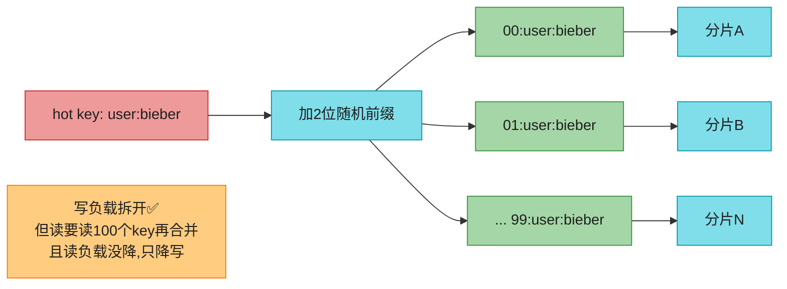

**代价**：
- **读变贵**：要读全部 100 个 key 再合并。
- **只降写、不降读**：每个分片对该热 key 的读量没减。
- **额外记账**：只对极少数热 key 加随机数才划算（绝大多数低吞吐 key 不必）。需**追踪哪些 key 被拆**、何时把普通 key 升级成热 key。
- **负载随时间变**：某帖爆红几天后冷却；某些 key 写热、某些读热，策略不同。

#### 策略 2：数据库层热管理（云服务自适应）

大规模云服务有**自动化热点处理**：Amazon 叫 **heat management [26] / adaptive capacity（自适应容量）[17,27]**。当某分片过热，**自动拆分/迁移它**，或给热点 key 临时分配更多资源。

> 🏭 **DynamoDB adaptive capacity**：某分区持续吃满吞吐上限时，DynamoDB 自动把它拆成多个分区、把空闲容量调度过来，**用户无感**。这是"把策略1自动化、对用户透明"的极致。

#### 策略 3：用范围/哈希范围分片隔离热 key

范围（或哈希范围）分片的好处：**能把单个热 key 单独放进一个分片**，甚至给它**独占一台机器** [25]。纯固定哈希分片做不到（key 被钉死在某分片）。

### 3.5 自动 vs 手动再平衡

再平衡（加减节点时重分片）有个重要问题：**自动还是手动？**

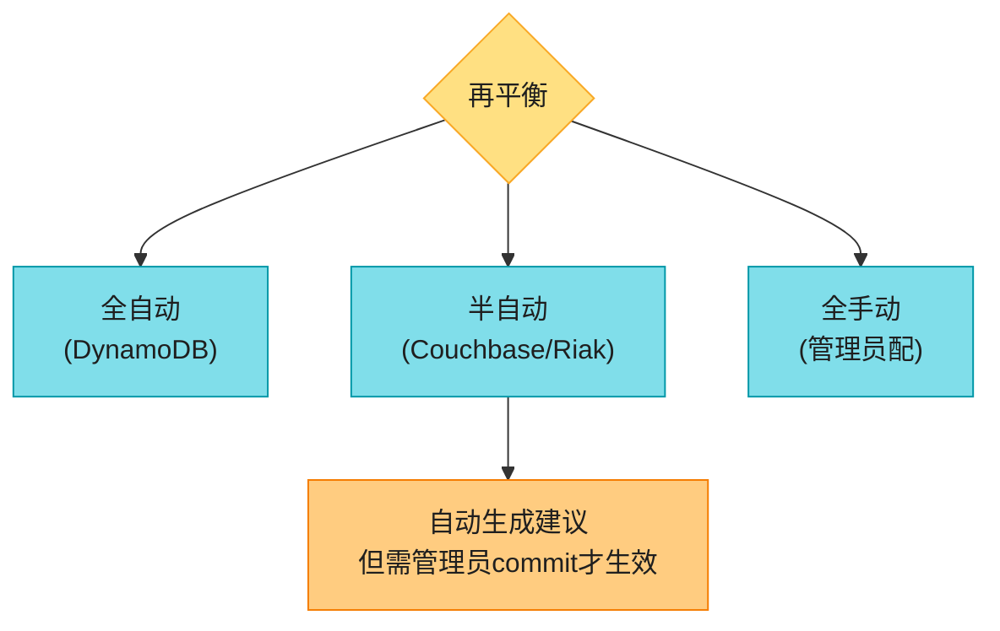

#### 深入：自动再平衡的级联失败风险（为什么"人参与"有价值）

全自动再平衡方便（少运维、能 autoscale，DynamoDB 几分钟内加减分片 [17,27]），**但有危险**：

> **再平衡很贵**（重路由请求 + 大量数据跨网搬迁）。做得不慎会**压垮网络/节点**，连累其他请求。系统还得边搬边接写——若已接近写吞吐上限，**分片分裂可能跟不上写入速度** [27]。

> **配合自动故障检测时尤其危险（级联失败）**：
> ```mermaid
> flowchart LR
>     SLOW["某节点过载→响应慢"] --> DEAD["其他节点误判它'死了'"]
>     DEAD --> REBAL["自动再平衡: 把负载搬走"]
>     REBAL --> MORE["给其他节点+网络加更多负载"]
>     MORE --> SLOW2["其他节点也变慢→也被误判死"]
>     SLOW2 --> CASCADE["级联失败😱<br/>雪崩"]
>     style SLOW fill:#FFCC80,stroke:#F57C00,color:#1f1f1f
>     style DEAD fill:#EF9A9A,stroke:#C62828,color:#1f1f1f
>     style REBAL fill:#EF9A9A,stroke:#C62828,color:#1f1f1f
>     style MORE fill:#EF9A9A,stroke:#C62828,color:#1f1f1f
>     style SLOW2 fill:#EF9A9A,stroke:#C62828,color:#1f1f1f
>     style CASCADE fill:#C62828,stroke:#000000,color:#FFFFFF
> ```

> **所以：再平衡"人参与 (human in the loop)"有好处**——比全自动慢，但能防运维意外。**预期流量暴增**（黑五、世界杯售票）时，**预防性手动再平衡**也很有用。

#### 深入：零停机再平衡怎么搬数据（双写 + 回填 + 切换）

再平衡本质是"把一批数据从 A 节点迁到 B 节点，期间不能停服、不能丢写、不能读旧"。标准工程套路：


1. **双写/CDC**：搬迁期间，新写入同时落 A 和 B（或写 A 后用 CDC 如 Debezium 把变更流到 B），保证增量不丢。
2. **回填**：把 A 的存量数据批量拷到 B（这步最慢，可能几小时到几天，靠限流不压垮系统）。
3. **校验**：比对 A、B 数据一致（行数、校验和、采样比对）。
4. **灰度切换**：路由层先把**少量读**切到 B，观察没问题再全切。**保留回滚能力**（出问题切回 A）。
5. **清理**：确认稳定后停写 A、下线 A 上该分片数据。

> 🏭 **Redis Cluster 的槽迁移**正是这个套路的最小化版：迁移中源节点对新请求若发现 key 已迁走 → 返回 **ASK** 让客户端去目标节点试一次（不缓存，因迁移未完成）；迁移完成后 → 返回 **MOVED** 让客户端永久更新路由缓存。迁移期间双节点都能服务，过渡平滑。
>
> 🏧 **resharding 的痛点**：步骤2（回填）极慢且占磁盘/带宽；步骤4（切换）有短暂不一致窗口；若分片数本身要变（如固定分片数估错了要 reshard），每个分片都要分裂重写，更贵。这就是为什么**一开始就把分片数估够**（固定分片数方案）或**用能自适应分裂的方案**（哈希范围/范围分片）如此重要。

---

## 4. 请求路由 (Request Routing)

知道怎么分片、怎么再平衡了，下一个问题：**要读写某个 key，怎么知道连哪个节点（IP:端口）？** 这叫**请求路由**，和[[ch05]]讲过的**服务发现**很像。

**关键区别**：应用服务实例通常**无状态**，负载均衡器可发给任意实例；但**分片库的请求只能由持有该分片副本的节点处理**。

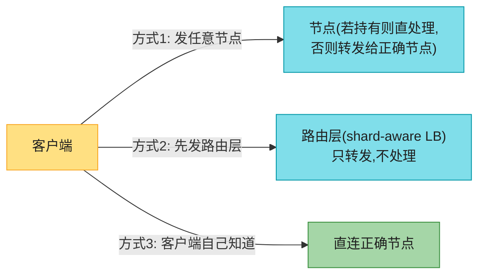

三种方式（Figure 7-7）：
1. **任意节点 + 转发**：客户端（经 round-robin LB）发任意节点。持有则直处理，否则转发给正确节点、代收回复。
2. **路由层**：客户端先发路由层，它决定转发给谁。路由层**不处理请求**，只当 shard-aware 负载均衡器。
3. **客户端感知**：客户端自己知道分片+映射，直连正确节点，无中间层。

### 4.1 三个待解问题

| 问题 | 说明 |
|------|------|
| **谁决定分片→节点？** | 最简单是**单协调者**，但它挂了怎么办？failover 时怎么防脑裂（两个协调者做矛盾分配）？ |
| **路由方怎么获知映射变化？** | 路由方（节点/路由层/客户端）怎么知道分片→节点的最新分配？ |
| **搬迁过渡期怎么办？** | 分片从 A 搬到 B 时，B 已接管但 A 上还有在途请求，怎么办？ |

### 4.2 谁维护映射：协调服务

很多系统靠**独立协调服务**（**ZooKeeper / etcd**）跟踪分片分配（Figure 7-8）。它们用**共识算法**（第 10 章）提供容错 + 防脑裂。每节点在 ZK 注册，ZK 维护**权威的分片→节点映射**。路由层/客户端订阅 ZK；分片易主或节点增删时，ZK **通知**路由层更新。

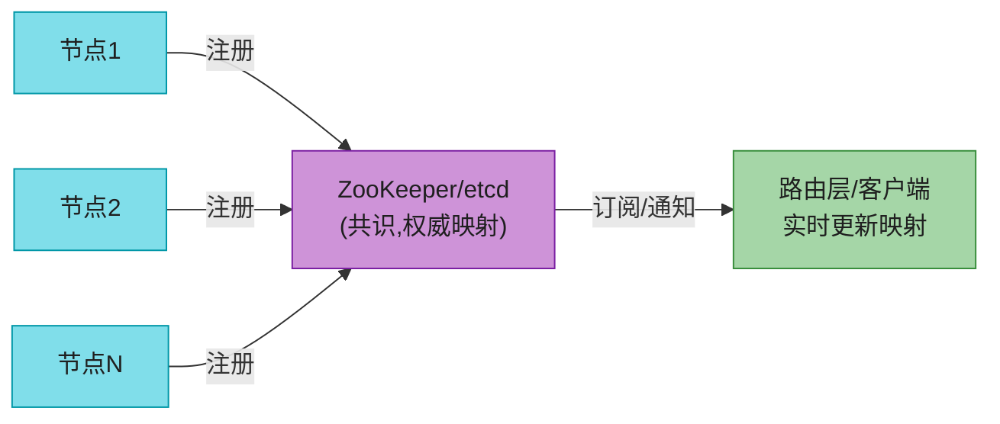

> 🏭 **谁用什么**：
> - **ZooKeeper**：HBase、SolrCloud 管分片分配。
> - **etcd**：Kubernetes 跟踪服务实例在哪。
> - **MongoDB**：自研 **config server** + **mongos** 守护进程当路由层。
> - **Kafka、YugabyteDB、TiDB、ScyllaDB** [28]：内置 **Raft** 共识做协调。
> - **Riak**：**gossip 协议**——节点间互传集群状态变化。比共识**弱得多**（可能脑裂，集群不同部分对同一分片有不同节点分配），但无主库本就只做弱一致保证，能容忍。

> 📝 **客户端怎么找 IP**：用路由层或随机发节点时，客户端还得先找到要连的 IP。这部分不像分片→节点映射变得那么快，**用 DNS 通常够了**。

### 4.3 OLTP vs OLAP 的路由差异

上面的路由聚焦"**为单个 key 找分片**"——主要服务于**分片 OLTP 库**。分析库（OLAP）也分片，但查询执行很不同：**不是在单分片执行，而是要并行聚合/join 多分片数据**。这些并行查询执行技术第 11 章讲。

---

## 5. 二级索引与分片（本章最难）

到此为止的分片方案都依赖"**客户端知道要访问记录的分区键**"。KV 模型里分区键 = 主键前缀（或全部），用分区键定分片、路由读写，很顺。

**一旦涉及二级索引 (secondary index)**（[[ch04]]讲过），就复杂了。二级索引通常**不唯一标识记录**，而是"按某值搜索"：找用户 123 的所有操作、找含 "hogwash" 的文章、找所有红色车。KV 库常没二级索引，但关系库标配、文档库常见、全文搜索引擎（Solr/ES）的**存在理由**。

**核心难题：二级索引没法干净地映射到分片。** 两大方案：**本地**、**全局**。

### 5.1 本地二级索引 (Local Secondary Indexes / Document-Partitioned)

每个分片**独立维护自己的二级索引**，只覆盖本分片记录，不关心别的分片。**写只动含该记录的那一个分片**——所以叫**本地索引**，信息检索里叫 **document-partitioned index（按文档分区索引）[29]**。

```mermaid
flowchart LR
    subgraph S0["分片0 (车ID 0-499)"]
        D0["红色车ID列表<br/>(postings list)"]
        D0a["丰田车ID列表"]
    end
    subgraph S1["分片1 (车ID 500-999)"]
        D1["红色车ID列表"]
        D1a["丰田车ID列表"]
    end
    subgraph S2["分片2 (车ID 1000-1499)"]
        D2["红色车ID列表"]
        D2a["丰田车ID列表"]
    end
    NOTE["每个分片只索引自己的记录<br/>写: 只动1个分片✅<br/>读: 红色车散在各分片, 要scatter-gather❌"]
    style S0 fill:#80DEEA,stroke:#0097A7,color:#1f1f1f
    style S1 fill:#80DEEA,stroke:#0097A7,color:#1f1f1f
    style S2 fill:#80DEEA,stroke:#0097A7,color:#1f1f1f
    style D0 fill:#A5D6A7,stroke:#388E3C,color:#1f1f1f
    style D0a fill:#A5D6A7,stroke:#388E3C,color:#1f1f1f
    style D1 fill:#A5D6A7,stroke:#388E3C,color:#1f1f1f
    style D1a fill:#A5D6A7,stroke:#388E3C,color:#1f1f1f
    style D2 fill:#A5D6A7,stroke:#388E3C,color:#1f1f1f
    style D2a fill:#A5D6A7,stroke:#388E3C,color:#1f1f1f
    style NOTE fill:#FFCC80,stroke:#F57C00,color:#1f1f1f
```

**二手车网站例子**（Figure 7-9）：每条挂牌有唯一 ID，按 ID 分片（ID 0-499 在分片0...）。要支持按颜色/品牌筛选 → 在 color、make 上建二级索引。声明索引后，库自动维护：往库加一辆红车时，该分片自动把它的 ID 加进 `color:red` 的 ID 列表（**postings list**，[[ch04]]讲过）。

> ⚠️ **别在 KV 模型上手搓二级索引**：可能想在应用代码里自建"值→ID"映射。**极度危险**——竞态、间歇性写失败（部分改动存了部分没存）极易让索引和数据失步（见第 8 章「多对象事务的必要性」）。

**读的代价**：
- 若**已知分区键** → 只在该分片搜。
- 若**只要部分结果** → 发任意分片即可。
- 若**要全部结果、且不知分区键** → **必须发所有分片、合并结果**（scatter-gather）。图 7-9 里红车在分片0和分片1都有。

#### 深入：本地索引的 scatter-gather 尾延迟放大

scatter-gather 让二级索引读**很贵**：即便并行查各分片，也** prone to 尾延迟放大（tail latency amplification）**（[[ch02]]讲过）——**整个查询的延迟 = 最慢那个分片的延迟**。100 个分片里只要 1 个慢，整查询就慢。

更糟：它**限制了扩展性**——加更多分片能存更多数据，但**若每个查询都要过每个分片，查询吞吐并不会随分片增加而提升**。

> 🏭 **谁用本地索引**：**MongoDB、Riak、Cassandra [31]、Elasticsearch [32]、SolrCloud、VoltDB** [33] 都用本地二级索引。

### 5.2 全局二级索引 (Global Secondary Indexes / Term-Partitioned)

不每个分片各搞一套，而是建一个**覆盖所有分片数据**的全局索引。但不能只存一个节点（瓶颈、违背分片初衷）——**全局索引本身也要分片，且可按与主键索引不同的方式分片**。

```mermaid
flowchart LR
    subgraph DATA["数据分片(按车ID)"]
        P0["分片0: ID0-499"]
        P1["分片1: ID500-999"]
        P2["分片2: ID1000-1499"]
    end
    subgraph IDX["全局索引分片(按颜色term)"]
        I0["索引分片0: 颜色a-r"]
        I1["索引分片1: 颜色s-z"]
    end
    P0 -->|"红色车ID"| I0
    P1 -->|"红色车ID"| I0
    P2 -->|"红色车ID"| I0
    NOTE["color:red 的 postings 聚在索引分片0<br/>单条件查询只读1个索引分片✅<br/>但写一辆红车可能要更新多个索引分片❌"]
    style P0 fill:#80DEEA,stroke:#0097A7,color:#1f1f1f
    style P1 fill:#80DEEA,stroke:#0097A7,color:#1f1f1f
    style P2 fill:#80DEEA,stroke:#0097A7,color:#1f1f1f
    style I0 fill:#CE93D8,stroke:#7B1FA2,color:#1f1f1f
    style I1 fill:#CE93D8,stroke:#7B1FA2,color:#1f1f1f
    style NOTE fill:#FFCC80,stroke:#F57C00,color:#1f1f1f
```

图 7-10：所有分片的红车 ID 都聚到 `color:red` 下，但索引本身分片——颜色 a-r 在索引分片0、s-z 在索引分片1；品牌索引类似（边界在 f/h 间）。这种索引叫 **term-partitioned（按词分区）[29]**。

> 📝 **名词注释：term（词项）**
> 全文搜索里 term = 可搜索的关键词（[[ch04]]讲过）。这里推广为"二级索引里可搜索的任意值"。全局索引用 **term 当分区键**，查某 term/值时就能定到要查哪个索引分片。索引分片可含连续 term 范围（图 7-10），也可按 term 哈希分。

**全局索引的优势**：单条件查询（如 `color=red`）**只读一个索引分片**就能取 postings list。
**但取记录仍要跨分片**：若要的是记录本身（不只是 ID），仍要去那些 ID 所在的各数据分片读。

**多条件查询的难处**：要查"某颜色 AND 某品牌"（或文本里同时出现多个词），这些 term 可能在**不同索引分片**。要算两个 postings list 的**逻辑 AND**（交集），list 短没事，**长 list 跨网传交集很慢** [29]。

**写的难处**：写一条记录可能影响**多个索引分片**（文档里每个 term 可能在不同分片）→ **更难保持二级索引与数据同步**。可选 **分布式事务**原子更新主记录+二级索引（第 8 章）。

> 🏭 **谁用全局索引**：**CockroachDB、TiDB、YugabyteDB**；**DynamoDB** 同时支持本地(LSI)和全局(GSI)。DynamoDB 的 GSI 写是**异步**反映的 → 读 GSI 可能旧（和第 6 章复制延迟问题类似）。**读多写少、postings 不太长**时全局索引很有用。

### 5.3 综合对比：本地 vs 全局二级索引

#### 深入：读写代价矩阵

| 维度 | 本地索引 (document-partitioned) | 全局索引 (term-partitioned) |
|------|-------------------------------|---------------------------|
| **写** | ✅ 只动 1 个分片（含该记录的） | ❌ 可能动多个索引分片（每 term 可能不同分片） |
| **写一致性** | ✅ 易（单分片事务即可） | ❌ 难（需分布式事务，否则可能失步/异步延迟） |
| **单条件读** | ❌ scatter-gather 全分片 | ✅ 只读 1 个索引分片 |
| **取记录本身** | 已知分区键则快 | 仍要跨数据分片读 |
| **尾延迟** | ❌ 放大（等最慢分片） | ✅ 单分片，无放大 |
| **扩展性** | ❌ 加分片不提升查询吞吐 | ✅ 读吞吐随索引分片提升 |
| **多条件 AND** | 各分片本地算 | postings list 跨网交集，长 list 慢 |
| **典型产品** | MongoDB/Cassandra/ES/VoltDB | CockroachDB/TiDB/YugabyteDB/DynamoDB GSI |

> **选型直觉**：
> - **写多读少、能容忍 scatter-gather** → **本地索引**（写简单、一致性好）。
> - **读多写少、要低延迟查询、postings 不长** → **全局索引**（读快、可扩展，接受写复杂/可能异步）。
> - 全文搜索（ES/Solr）几乎都本地索引 + scatter-gather——因为 term 极多、写要实时，全局索引的写代价受不了。

---

## 6. 数据仓库的分片与聚类

数仓（**BigQuery、Snowflake、Delta Lake**）用类似但术语不同的方式：

> 📝 **名词注释：partitioning vs clustering（数仓版）**
> | 数仓 | 对应概念 |
> |------|---------|
> | **BigQuery** partition key | 分区键（决定记录在哪个分区） |
> | **BigQuery** cluster columns | 分区内记录**怎么排序** |
> | **Snowflake** micro-partition | 自动把记录分到微分区；用户可定义 **cluster key** |
> | **Delta Lake** | 支持手动/自动分区 + cluster key |

聚类不只提升范围扫描，还改善**压缩**和**过滤**性能（同值聚在一起，列存压缩率更高，[[ch04]]讲过列存）。

---

## 🏭 生产级产品速查表（分片机制）

| 产品 | 分片单位 | 分片方式 | 再平衡 | 路由/协调 | 特色 |
|------|---------|---------|--------|----------|------|
| **MongoDB** | shard(分片) | 范围 or 哈希(复合键) | 自动分裂 | **config server + mongos** | shard key 选错很难改；zones 可地域路由 |
| **Cassandra** | token-range | Murmur3 哈希 + **vnode(16/节点)** | 加节点自动 | **gossip** | 无主；compaction strategy 影响分片读 |
| **ScyllaDB** | tablet | Murmur3 + **vnode(256/节点)** | 加节点自动 | **Raft** [28] | shard-per-core，NUMA 优化 |
| **Redis Cluster** | **hash slot(16384槽)** | CRC16 哈希 % 16384 | 槽迁移(手动/自动) | 客户端感知 + gossip | 固定槽经典案例；槽迁移用 MOVED/ASK |
| **HBase** | **region** | key 范围 | 自动分裂(默认10GB) | **ZooKeeper** + HMaster | 自动分裂典范；预分裂可选 |
| **DynamoDB** | partition | 哈希 | **adaptive capacity** 自动 | 内部 | GSI/LSI；分区按吞吐自动加减 |
| **Citus (Postgres)** | shard | 哈希(固定分片数) | 手动/分片重分布 | 协调节点 | schema-based sharding；HTAP |
| **Vitess (MySQL)** | vshard | 范围 or 哈希 | 手动 + 工具 | vtgate + vttablet | 按 workspace/租户分片(Slack) |
| **CockroachDB** | **range** | 范围(自动分裂) | 自动 | **Raft** | 强一致；range 跨副本 Raft |
| **TiDB** | **region** | 范围(自动分裂) | 自动 | PD + **Raft** | HTAP(TiKV+TiFlash) |
| **YugabyteDB** | tablet | 范围 or 哈希 | 自动 | **Raft** | 手动+自动 tablet 分裂皆可 |
| **BigQuery** | partition | 按 ingestion 时间/范围 | 自动 | 内部 | partition + cluster columns |
| **Snowflake** | micro-partition | 自动 | 自动 | 内部 | cluster key 用户定义 |

### 🏭 深入：MongoDB 的 shard key ——选错万劫不复

MongoDB 分片键一旦设定**极难更改**（4.2 起部分支持改键，但昂贵）。选键三原则：
1. **高基数 (high cardinality)**：键值要多样，否则分不开（如"性别"只有2值 → 顶多2分片）。
2. **低频率 (low frequency)**：单值不能太集中，否则热点（如某 user_id 占九成流量）。
3. **非单调递增 (non-monotonic)**：别用 ObjectId/时间戳单独当键 → 全部写砸一个分片（范围分片的坑）。用**哈希分片键**或**复合键 `{userId, _id}`**。

> 🏭 **范围 vs 哈希分片键**：MongoDB 同时支持。范围键支持范围查询但易热点；哈希键打散写但不支持范围查询。**混合**：复合键前缀范围、后缀哈希。

### 🏭 深入：Redis Cluster 的 16384 槽

Redis Cluster 把 key 空间分成 **16384 个 hash slot**。`CRC16(key) % 16384` 定槽，每节点负责一段槽（固定分片数方案的教科书实现）。
- **MOVED 重定向**：客户端请求错节点 → 返回 MOVED 告诉正确节点，客户端缓存更新。
- **ASK 重定向**：槽迁移中 → 临时返回 ASK 让客户端去目标节点试一次（不缓存，因迁移未完成）。
- **hash tag**：`user:{123}:profile` 和 `user:{123}:orders` 花括号内相同 → 同槽 → 可在同节点做事务/Lua。这是"把相关 key 钉一起"的技巧。

### 🏭 深入：HBase region 自动分裂

HBase 按行键范围分 **region**，region 到 **10GB** 自动**分裂**成两个，由 HMaster 调度、ZooKeeper 协调。这是"范围分片 + 自动分裂再平衡"的代表。**预分裂 (pre-splitting)** 可在灌数据前先建好若干 region，避免早期所有写砸一个 region（和 MongoDB 时间戳热点同理）。

### 🏭 深入：DynamoDB 的 adaptive capacity

DynamoDB 按分区键哈希分 **partition**，每分区有吞吐上限。若某分区键持续吃满（热点），**adaptive capacity** 自动：①把该分区拆分；②临时提升其吞吐上限，**对应用透明**。GSI（全局二级索引）异步更新，读可能滞后。这是"云服务把热点处理全自动、用户无感"的极致。

---

## 💻 配置与代码示例

### PostgreSQL + Citus 分布式分片

```sql
-- 1. 选分片键(这里 user_id), 创建分布式表
SELECT create_distributed_table('events', 'user_id');

-- 2. Citus 自动按 user_id 哈希分到 N 个 shard(默认32)
--    同 user_id 的事件落同节点 → 可本地聚合

-- 3. 查询自动路由到对应分片
SELECT count(*) FROM events WHERE user_id = 12345;
--  ↑ 只打1个分片

-- 4. 跨分片聚合(scatter-gather)
SELECT country, count(*) FROM events GROUP BY country;
--  ↑ 所有分片并行算 + 协调节点合并

-- 多租户: schema-based sharding (Citus 12+)
-- 每个租户一个 schema, 自动落到指定节点
```

### Cassandra 复合主键（分区键 + 聚簇列）

```sql
-- partition_key 决定分片(Murmur3 hash)
-- clustering columns 决定分片内排序(范围查询高效)
CREATE TABLE sensor_readings (
    sensor_id   text,        -- 分区键(散开写)
    ts          timestamp,   -- 聚簇列(分片内按时间排序)
    value       double,
    PRIMARY KEY ((sensor_id), ts)
);

-- 同 sensor_id 内的时间范围查询 → 单分片 + 排序高效
SELECT * FROM sensor_readings
WHERE sensor_id = 'temp-001'
  AND ts > '2026-06-01' AND ts < '2026-07-01';
```

### Redis Cluster hash tag（把相关 key 钉同槽）

```bash
# 花括号内相同 → CRC16 只算括号内 → 同槽同节点
SET user:{123}:profile "Alice"
SET user:{123}:cart "milk,eggs"
# 两者在同一节点 → 可用 MULTI/EXEC 事务或 Lua 原子操作
```

### 最佳实践

- **分片键是重中之重**：高基数、低频率、非单调。选错极难改。
- **能用复合键就用**：前缀散开（分区）、后缀排序（范围查询）。
- **预估分片数留足余量**：固定分片数方案下，宁可一开始多分（如 1000），也别到时 resharding 停机。
- **监控热点**：盯各分片流量/CPU 差异，发现倾斜早处理。
- **跨分片写最少化**：能同分片就同分片，避免分布式事务。

---

## 🎯 系统设计面试题

### 面试题 1：设计 Twitter/X 的 Feed 存储（高频）

**需求澄清**：用户发推、看时间线（主页 feed + 个人 feed）；读远多于写；明星效应明显。

**容量估算**：3 亿用户，日均 5 亿推，每推 500 字节 → 250GB/天。读 QPS 远高于写。

**核心难点：读扩散 vs 写扩散**

```mermaid
flowchart LR
    W["发推"] --> CHOICE{"粉丝量?"}
    CHOICE -->|"普通用户(少粉丝)"| FANOUT_W["写扩散:<br/>推文写入所有粉丝的feed"]
    CHOICE -->|"明星(千万粉丝)"| FANOUT_R["读扩散:<br/>推文只存一处,<br/>粉丝读时合并"]
    style W fill:#FFE082,stroke:#F9A825,color:#1f1f1f
    style CHOICE fill:#80DEEA,stroke:#0097A7,color:#1f1f1f
    style FANOUT_W fill:#A5D6A7,stroke:#388E3C,color:#1f1f1f
    style FANOUT_R fill:#FFCC80,stroke:#F57C00,color:#1f1f1f
```

**分片方案**：
- 推文按 `tweet_id` 哈希分片（均匀）。
- 用户 feed 按 `user_id` 哈希分片（同用户 feed 同节点，读快）。
- **混合扩散**：普通用户写扩散（写进粉丝 feed），明星读扩散（粉丝拉）。阈值如 1 万粉丝。

**深入讨论**：
1. **分片键**：feed 表用 `user_id`（同用户时间线聚一起，单分片读）。
2. **热点**：明星 `user_id` 是热 key → 读扩散避免写放大；明星推文单独缓存。
3. **跨分片**：读扩散要合并多个明星的最新推 → scatter-gather，靠时间线排序 + 截断控量。

### 面试题 2：hash(key) % N 为什么不行？（高频陷阱题）

**答**：节点数 N 变化时，**绝大多数 key 被迫搬迁**（加1节点搬~3/4）。应改用：
- **固定分片数**：key→分片规则不变（`hash%M`，M 远大于节点数），只动分片→节点映射。
- **一致性哈希 / vnode**：加节点只搬约 1/N 的 key。
- **哈希范围分裂**：分片按哈希段，可分裂自适应。

（见 §3.3 深入手算）

### 面试题 3：Local Index vs Global Index 如何选？

**场景**：二手车平台，按 vehicle_id 分片，要按 color/make 筛选。

**答**：
- **本地索引**：写一辆车只动1分片（简单一致）；但按颜色查要 scatter-gather 全分片，尾延迟放大，加分片不提升查询吞吐。**适合写多、查询可容忍 scatter-gather**。
- **全局索引**：按 color term 分片，`color=red` 只读1个索引分片（快、可扩展）；但写一辆红车要更新多个索引分片（复杂，需分布式事务或接受异步延迟）。**适合读多写少、要低延迟**。
- **本例**：挂牌写入中等、筛选查询频繁且要快 → **倾向全局索引**（如 DynamoDB GSI / ES 的近实时方案）。若写极频繁、查询能忍 scatter-gather → 本地索引。

（见 §5.3 矩阵）

### 面试题 4：分片键选错了怎么办？（真实工程题）

**背景**：Notion 早期用单 Postgres，500GB 后撑不住，按 `page_id` 哈希分片到 4 台 [4]。但后来发现某些 page（共享模板）是热点、跨页 join 难。

**答**：
1. **预防**：分片键选高基数、低频率、非单调的；复合键（前缀散开+后缀排序）；预估规模留余量。
2. **补救**：
   - **应用层路由**：把热点 key 单独处理（随机前缀拆写、独占分片）。
   - **跨分片查询用全局索引或物化视图**：把 join 结果预算好。
   - **重新分片 (resharding)**：昂贵但有时必须——Notion 后续扩展到更多分片。用双写+回填+切换的零停机迁移。
3. **教训**：**分片键一旦上线极难改**，设计阶段要模拟负载（峰值、倾斜、查询模式）反复推演。

---

## 📚 精选文献

> 原书本章引用 33 篇，这里只留最值得读的。

- **[4] Fidalgo. "Herding Elephants: Lessons Learned from Sharding Postgres at Notion" (2021).** 真实公司从单库到分片的踩坑全过程，分片键选型与 resharding 的实战教科书。强烈推荐。
- **[12] Ganguli et al. "Scaling Datastores at Slack with Vitess" (2020).** Slack 按 workspace 多租户分片 MySQL（Vitess）的工程实践，大租户/小租户处理。
- **[18] Karger et al. "Consistent Hashing and Random Trees" (STOC 1997).** 一致性哈希奠基论文。理解 CDN/分布式缓存/分库的基石。
- **[21] Lamping & Veach. "Jump Consistent Hashing" (2014).** Google 的零内存 O(1) 一致性哈希，工程优雅典范。
- **[24] Lee et al. "Shard Manager" (SOSP 2021).** Facebook 的通用分片管理框架，地理分布应用的分片调度。
- **[29] Manning et al. Introduction to Information Retrieval (2008).** 信息检索圣经，document-partitioned vs term-partitioned 索引的经典讲解。免费在线。

---

## 📝 本章要点总结

```mermaid
flowchart LR
    ROOT["第7章 分片<br/>核心结论"] --> T1["为什么分片"]
    ROOT --> T2["两大分片方式"]
    ROOT --> T3["热点与再平衡"]
    ROOT --> T4["请求路由"]
    ROOT --> T5["二级索引"]

    T1 --> T1a["水平扩展(数据/写入)<br/>读瓶颈用复制即可"]
    T1 --> T1b["能不分就不分<br/>复杂度代价大"]

    T2 --> T2a["key范围: 范围扫描✅<br/>但相邻key热点(时间戳)"]
    T2 --> T2b["key哈希: 散开均匀✅<br/>但失范围查询"]
    T2 --> T2c["复合键: 前缀分区+后缀排序<br/>兼顾两者"]

    T3 --> T3a["hash%N灾难→固定分片数<br/>/一致性哈希/vnode"]
    T3 --> T3b["热点: 随机前缀/自适应容量<br/>自动再平衡有级联风险"]

    T4 --> T4a["3方式: 任意节点/路由层/客户端"]
    T4 --> T4b["协调: ZK/etcd/Raft(强)<br/>gossip(弱)"]

    T5 --> T5a["本地: 写简单读scatter-gather"]
    T5 --> T5b["全局: 读快写复杂/可能异步"]

    style ROOT fill:#FFE082,stroke:#F9A825,color:#1f1f1f
    style T1 fill:#80DEEA,stroke:#0097A7,color:#1f1f1f
    style T2 fill:#80DEEA,stroke:#0097A7,color:#1f1f1f
    style T3 fill:#80DEEA,stroke:#0097A7,color:#1f1f1f
    style T4 fill:#80DEEA,stroke:#0097A7,color:#1f1f1f
    style T5 fill:#80DEEA,stroke:#0097A7,color:#1f1f1f
    style T1a fill:#A5D6A7,stroke:#388E3C,color:#1f1f1f
    style T1b fill:#A5D6A7,stroke:#388E3C,color:#1f1f1f
    style T2a fill:#A5D6A7,stroke:#388E3C,color:#1f1f1f
    style T2b fill:#A5D6A7,stroke:#388E3C,color:#1f1f1f
    style T2c fill:#A5D6A7,stroke:#388E3C,color:#1f1f1f
    style T3a fill:#A5D6A7,stroke:#388E3C,color:#1f1f1f
    style T3b fill:#A5D6A7,stroke:#388E3C,color:#1f1f1f
    style T4a fill:#A5D6A7,stroke:#388E3C,color:#1f1f1f
    style T4b fill:#A5D6A7,stroke:#388E3C,color:#1f1f1f
    style T5a fill:#A5D6A7,stroke:#388E3C,color:#1f1f1f
    style T5b fill:#A5D6A7,stroke:#388E3C,color:#1f1f1f
```

### 八大 Takeaways

1. **分片 = 水平扩展数据/写入**；读瓶颈用复制即可，不必分片。能不分就不分（复杂度代价大）。
2. **分区键是设计核心**：同一分区键必同分片。选错极难改，决定访问效率。
3. **范围分片**：范围扫描高效，但相邻 key（尤其时间戳）易写热点；用复合键前缀打散。
4. **哈希分片**：散布均匀，但失范围查询；复合键"前缀分区+后缀排序"可兼顾。
5. **hash(key)%N 是灾难**：N 变则大多数 key 搬家。改用固定分片数 / 一致性哈希 / vnode / 哈希范围分裂。
6. **一致性哈希 + vnode**：加节点只搬 ~1/N 的 key，且 vnode 解决节点少时的分布不均。
7. **热点三策**：应用层随机前缀拆写（读变贵）、数据库层自适应容量（DynamoDB）、范围分片隔离热 key。自动再平衡有级联失败风险，人参与有价值。
8. **二级索引两难**：本地索引写简单但读 scatter-gather（尾延迟放大）；全局索引读快但写复杂、可能异步失步。读多写少选全局，写多选本地。

### 连接下一章

每个分片**大多独立运作**——这正是分片库能扩展到多机的原因。但**需要写多个分片的操作就有麻烦**：一个分片写成功、另一个失败怎么办？**第 8 章「事务」**解决这个问题——单机事务、分布式事务、两阶段提交、隔离级别、各种并发异常（脏读、不可重复读、幻读、写偏斜）。事务是"让分片库在故障和并发下仍正确"的核心机制。
