# 第8章：事务 (Transactions)

> *"Some authors have claimed that general two-phase commit is too expensive to support, because of the performance or availability problems that it brings. We believe it is better to have application programmers deal with performance problems due to overuse of transactions as bottlenecks arise, rather than always coding around the lack of transactions."*
> — James Corbett et al., "Spanner: Google's Globally-Distributed Database" (2012)

---

## 📚 核心论文与参考文献

### 必读论文

| # | 论文/资料 | 作者 | 核心内容 | 链接 |
|---|---------|------|--------|------|
| [2] | "A History and Evaluation of System R" | Chamberlin et al. | System R（SQL 和事务的鼻祖, 1981） | [doi:10.1145/358769.358784](https://doi.org/10.1145/358769.358784) |
| [3] | "Granularity of Locks and Degrees of Consistency in a Shared Data Base" | Gray et al. | 隔离级别原始定义（1976） | *Readings in Database Systems*, 4th ed. |
| [5] | "CockroachDB: The Resilient Geo-Distributed SQL Database" | Taft et al. | CockroachDB 分布式事务 | [doi:10.1145/3318464.3386134](https://doi.org/10.1145/3318464.3386134) |
| [7] | "Spanner: Google's Globally-Distributed Database" | Corbett et al. | Google Spanner (TrueTime + 2PC) | [OSDI 2012](https://www.usenix.org/conference/osdi12) |
| [9] | "Principles of Transaction-Oriented Database Recovery" | Härder & Reuter | ACID 术语的创造者（1983） | [doi:10.1145/289.291](https://doi.org/10.1145/289.291) |
| [14] | "Making Snapshot Isolation Serializable" | Fekete et al. | SSI 理论基础 | [doi:10.1145/1071610.1071615](https://doi.org/10.1145/1071610.1071615) |
| [30] | "Hermitage: Testing the 'I' in ACID" | Kleppmann | 各数据库隔离级别实测对比 | [perma.cc/KP2Y-AQGK](https://perma.cc/KP2Y-AQGK) |
| [38] | "A Critique of ANSI SQL Isolation Levels" | Berenson et al. | SQL 隔离级别的经典批判 | [doi:10.1145/568271.223785](https://doi.org/10.1145/568271.223785) |
| [55] | "Serializable Isolation for Snapshot Databases" | Cahill et al. | SSI 算法（2008） | [doi:10.1145/1376616.1376690](https://doi.org/10.1145/1376616.1376690) |
| [56] | "Serializable Snapshot Isolation in PostgreSQL" | Ports & Grittner | PostgreSQL SSI 实现 | [doi:10.14778/2367502.2367523](https://doi.org/10.14778/2367502.2367523) |
| [73] | "Notes on Distributed Databases" | Lindsay et al. (IBM) | 分布式数据库早期研究 | [perma.cc/EPZ3-MHDD](https://perma.cc/EPZ3-MHDD) |

### 中文资源

- MVCC 原理详解：搜索「PostgreSQL MVCC 原理」
- 隔离级别详解：搜索「数据库隔离级别 详解 脏读 幻读」
- 2PL 与 2PC 区别：搜索「两阶段锁 两阶段提交 区别」
- SSI 算法入门：搜索「Serializable Snapshot Isolation 原理」
- Jepsen 数据库一致性测试：[jepsen.io](https://jepsen.io)

---

## 🗺️ 章节概览

本章是全书信息量最大、面试考察最频繁的章节。核心问题：**如何在并发和故障的世界中保证数据正确性？**

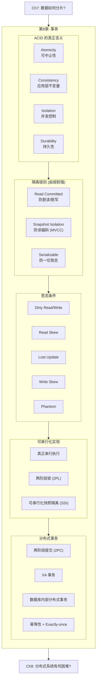
```mermaid
graph TB
    subgraph CH8["第8章: 事务"]
        direction TB

        subgraph ACID_BOX["ACID 的真正含义"]
            A_["Atomicity<br/>可中止性"]
            C_["Consistency<br/>应用层不变量"]
            I_["Isolation<br/>并发控制"]
            D_["Durability<br/>持久性"]
        end

        subgraph ISOLATION["隔离级别 (由弱到强)"]
            RC["Read Committed<br/>防脏读/脏写"]
            SI["Snapshot Isolation<br/>防读偏斜 (MVCC)"]
            SER["Serializable<br/>防一切竞态"]
        end

        subgraph RACE["竞态条件"]
            DR["Dirty Read/Write"]
            RS["Read Skew"]
            LU["Lost Update"]
            WS["Write Skew"]
            PH["Phantom"]
        end

        subgraph SERIAL_IMPL["可串行化实现"]
            ACTUAL["真正串行执行"]
            TPL["两阶段锁 (2PL)"]
            SSI["可串行化快照隔离 (SSI)"]
        end

        subgraph DIST["分布式事务"]
            TPC["两阶段提交 (2PC)"]
            XA["XA 事务"]
            INTERNAL["数据库内部分布式事务"]
            IDEMPOTENT["幂等性 + Exactly-once"]
        end

        ACID_BOX --> ISOLATION
        ISOLATION --> RACE
        RACE --> SERIAL_IMPL
        SERIAL_IMPL --> DIST
    end

    CH7["Ch7: 数据如何分片?"] --> CH8
    CH8 --> CH9["Ch9: 分布式系统有何困难?"]
```

### 本章结构一览

| 小节 | 主题 | 关键概念 |
|------|------|---------|
| 8.1 | ACID 的真正含义 | Atomicity ≠ 不可分割; Consistency 是应用层概念; "ACID" 已成营销术语 |
| 8.2 | 单对象与多对象操作 | CAS、multi-object 事务的必要性、错误处理与重试 |
| 8.3 | Read Committed | 防脏读（旧值保留）、防脏写（行锁）、实现方式 |
| 8.4 | Snapshot Isolation 与 MVCC | 读偏斜、一致性快照、MVCC 可见性规则、命名混乱 |
| 8.5 | 丢失更新 (Lost Update) | 原子操作、显式锁、自动检测、CAS |
| 8.6 | Write Skew 与 Phantom | 医生值班案例、会议室预订、用户名抢注、物化冲突 |
| 8.7 | 真正串行执行 | 存储过程、单线程、分片、VoltDB |
| 8.8 | 两阶段锁 (2PL) | 共享锁/排他锁、死锁、谓词锁、Index-range 锁 |
| 8.9 | 可串行化快照隔离 (SSI) | 乐观并发、过期前提检测、读写通知 |
| 8.10 | 分布式事务与 2PC | Coordinator、Prepare/Commit、In-doubt 状态、Coordinator 故障 |
| 8.11 | XA 事务、Exactly-once 与总结 | XA 的问题、幂等性替代方案、隔离级别总结表 |
## 8.1 ACID 的真正含义

### 事务：简化错误处理的编程模型

在现实系统中，随时可能出错：数据库崩溃、网络中断、多客户端并发写入。事务是数据库提供的一种**安全保障**——将多个读写操作打包为逻辑单元，要么全部成功（commit），要么全部失败（abort + rollback）。

**事务不是自然法则**——它是一个被有意创造的抽象，目的是让应用开发者不必亲自处理每种故障场景。

### ACID 四个字母的真正含义

**ACID** 这个术语由 Theo Härder 和 Andreas Reuter 于 1983 年创造 [9]。但在实践中，**不同数据库对 ACID 的实现千差万别**——"ACID compliant" 已经基本沦为营销术语。

> 不满足 ACID 的系统有时被称为 **BASE**（Basically Available, Soft state, Eventual consistency）[11]。但 BASE 的定义比 ACID 还要模糊——它唯一能确定的含义是"不是 ACID"。

#### A — Atomicity（原子性 → 更准确地说是 Abortability）

> **ACID 中的 Atomicity 与多线程编程中的 atomic 含义完全不同。**

- 多线程中 atomic = 其他线程看不到半完成状态（这其实是 ACID 中的 Isolation）
- ACID 中 Atomicity = **如果事务执行到一半出错，已经完成的写入全部撤销**

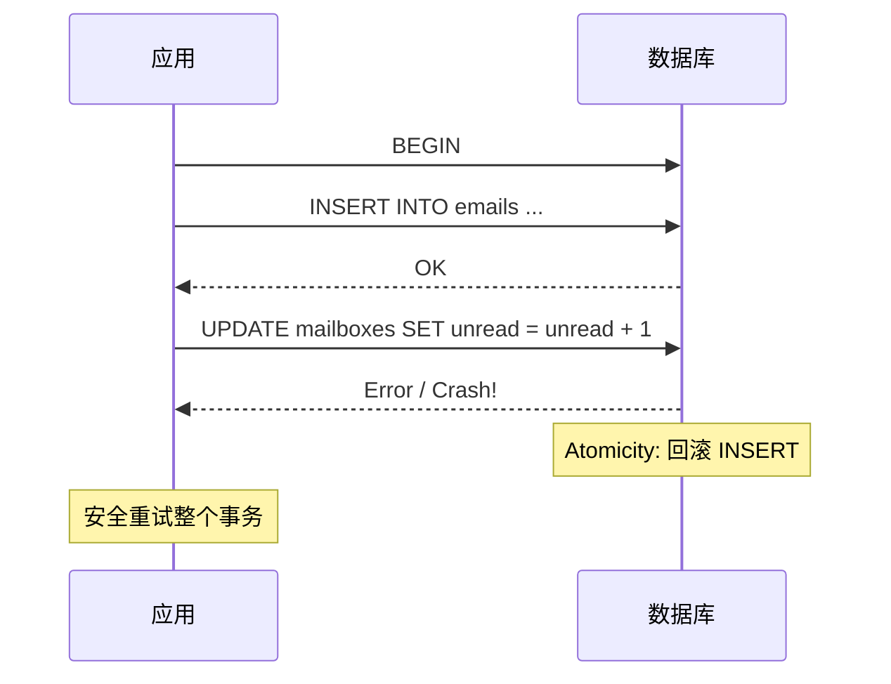
```mermaid
sequenceDiagram
    participant App as 应用
    participant DB as 数据库

    App->>DB: BEGIN
    App->>DB: INSERT INTO emails ...
    DB-->>App: OK
    App->>DB: UPDATE mailboxes SET unread = unread + 1
    DB-->>App: Error / Crash!
    Note over DB: Atomicity: 回滚 INSERT
    Note over App: 安全重试整个事务
```

**核心价值**：事务被中止后，应用可以确信数据库没有任何变化 → 可以安全重试。

#### C — Consistency（一致性 → 其实是应用层概念）

> **"consistency" 这个词在计算机科学中至少有 5 种完全不同的含义！**

| 语境 | 含义 |
|------|------|
| ACID 中的 C | 应用层不变量（invariants）始终成立 |
| CAP 定理中的 C | 线性一致性（linearizability, Ch10） |
| 复制中的 consistency | 副本最终一致（eventual consistency, Ch6） |
| 一致性快照 | 快照中的数据反映某一时刻的完整状态 |
| 一致性哈希 | key 尽量不迁移（Ch7） |

ACID 中的 C 指的是：应用定义了某些数据不变量（如"所有账户余额之和不变"），事务必须从一个合法状态转换到另一个合法状态。

**但这不是数据库的责任**——数据库只能通过约束（外键、唯一性、CHECK）验证部分不变量。复杂的业务不变量需要**应用代码保证**。所以严格来说，C 不属于数据库属性，而是应用属性。

#### I — Isolation（隔离性）

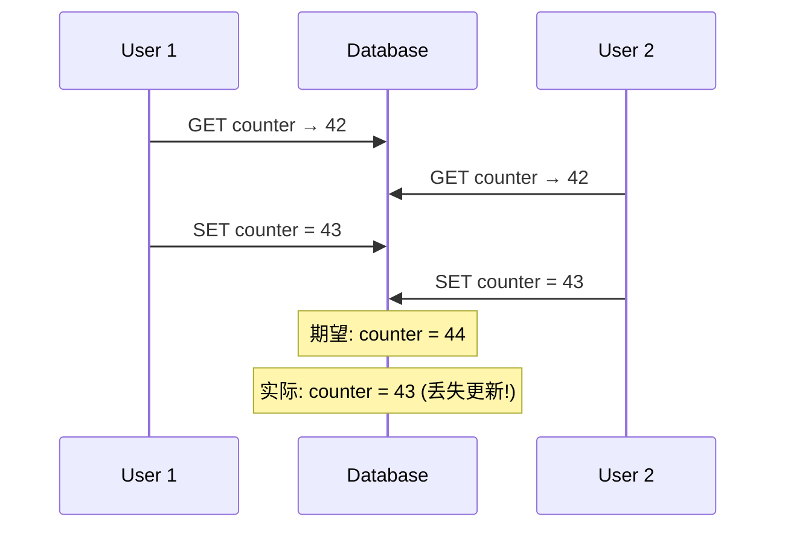
```mermaid
sequenceDiagram
    participant U1 as User 1
    participant DB as Database
    participant U2 as User 2

    U1->>DB: GET counter → 42
    U2->>DB: GET counter → 42
    U1->>DB: SET counter = 43
    U2->>DB: SET counter = 43
    Note over DB: 期望: counter = 44
    Note over DB: 实际: counter = 43 (丢失更新!)
```

**Isolation = 并发事务互不干扰**。经典定义是 **serializability**（可串行化）：并发执行的结果等同于某种串行执行的结果。

但可串行化有性能代价 → 实践中大多数数据库使用**弱隔离级别**（read committed, snapshot isolation）。**本章大部分内容都在讨论这些弱隔离级别及其带来的竞态条件**。

#### D — Durability（持久性）

已提交的数据不会丢失，即使发生崩溃。

| 实现方式 | 说明 |
|---------|------|
| **写盘 + fsync** | 单机最基本的持久性保证 |
| **WAL** | 崩溃后从日志恢复 |
| **复制** | 数据复制到多个节点 |

> **完美的持久性不存在**：所有硬盘同时损坏、备份也损坏 → 数据还是会丢。SSD 的 fsync 实现可能有 bug [15, 17]；SSD 磨损后可能在数周内逐渐丢数据 [28]。实践中，写盘 + 复制 + 备份需要组合使用。
## 8.2 单对象与多对象操作

### 单对象操作的原子性和隔离

即使只操作单个对象，也需要原子性和隔离：
- 写入 20 KB JSON 到一半断网 → 数据库里是半个 JSON 吗？
- 写入到一半断电 → 旧值和新值拼接在一起？
- 其他客户端在写入进行中读 → 读到半新半旧的值？

**单对象级别的保证**几乎所有存储引擎都提供：
- **原子性**：用 WAL 实现崩溃恢复
- **隔离**：用对象级锁实现（同一时刻只有一个线程操作该对象）
- **原子操作**：`UPDATE counters SET value = value + 1` 或 CAS（compare-and-set）

> ⚠️ 注意："atomic increment" 中的 "atomic" 用的是多线程意义上的原子（不可被打断），严格来说在 ACID 语境下应该叫 "isolated increment"。

### 为什么需要多对象事务？

单对象操作在某些场景不够用：

| 场景 | 为什么需要多对象事务 |
|------|-------------------|
| **外键引用** | 插入 order 和 order_items 必须同时成功，否则外键指向不存在的记录 |
| **反规范化** | 邮件 + 未读计数器必须同步更新（Figure 8-2 的例子） |
| **二级索引** | 更新一行时，对应的多个索引必须同步更新 |

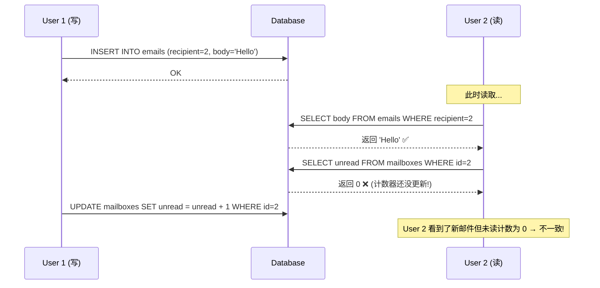
```mermaid
sequenceDiagram
    participant U1 as User 1 (写)
    participant DB as Database
    participant U2 as User 2 (读)

    U1->>DB: INSERT INTO emails (recipient=2, body='Hello')
    DB-->>U1: OK
    Note over U2: 此时读取...
    U2->>DB: SELECT body FROM emails WHERE recipient=2
    DB-->>U2: 返回 'Hello' ✅
    U2->>DB: SELECT unread FROM mailboxes WHERE id=2
    DB-->>U2: 返回 0 ❌ (计数器还没更新!)
    U1->>DB: UPDATE mailboxes SET unread = unread + 1 WHERE id=2
    Note over U2: User 2 看到了新邮件但未读计数为 0 → 不一致!
```

**没有隔离**，User 2 看到了邮件列表中有 'Hello'，但未读计数器却是 0——因为 User 1 的事务还没完成计数器更新。**这就是脏读**。

如果 User 1 的 UPDATE 失败，但 INSERT 已经成功 → 邮件在但计数器不对 → **需要 Atomicity 来回滚 INSERT**。

### 错误处理与事务重试

**事务的核心价值：失败了可以安全重试**。ACID 数据库会在违反原子性、隔离性或持久性时主动中止事务。

> 遗憾的是，很多 ORM（Rails ActiveRecord, Django）的默认行为是**不重试**被中止的事务——异常直接冒泡到用户，事务回滚的意义被浪费了。

**重试事务的陷阱**：

| 陷阱 | 说明 |
|------|------|
| **事务已成功但网络超时** | 客户端以为失败 → 重试 → 执行了两次（需要应用层去重 / 幂等性） |
| **过载导致的失败** | 重试会加剧过载 → 需要指数退避（exponential backoff） |
| **永久性错误** | 约束违反等 → 重试无意义，应直接报错 |
| **事务有副作用** | 发了邮件后事务中止 → 邮件已发出无法撤销（需用 2PC 协调外部系统） |
| **客户端崩溃** | 重试逻辑在客户端 → 客户端挂了数据丢失 |
## 8.3 Read Committed 隔离级别

### 最基础的隔离级别

Read Committed 提供两个保证：
1. **No dirty reads**：只能读到已提交的数据
2. **No dirty writes**：只能覆盖已提交的数据

它是 Oracle, PostgreSQL, SQL Server 等数据库的**默认**隔离级别。

### 脏读 (Dirty Reads)

**定义**：一个事务读到了另一个事务**尚未提交**的写入。

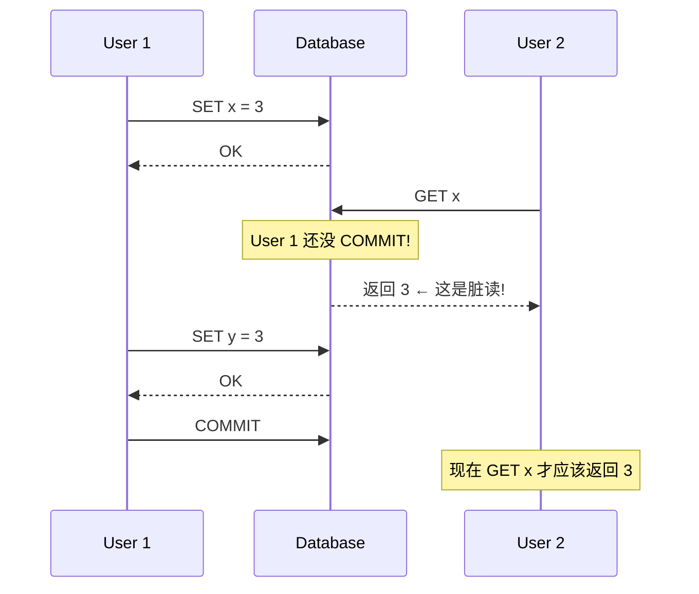
```mermaid
sequenceDiagram
    participant U1 as User 1
    participant DB as Database
    participant U2 as User 2

    U1->>DB: SET x = 3
    DB-->>U1: OK
    U2->>DB: GET x
    Note over DB: User 1 还没 COMMIT!
    DB-->>U2: 返回 3 ← 这是脏读!
    U1->>DB: SET y = 3
    DB-->>U1: OK
    U1->>DB: COMMIT
    Note over U2: 现在 GET x 才应该返回 3
```

**防止脏读的原因**：
- 用户看到**半更新**的状态（邮件在但计数器没更新）→ 困惑
- 如果事务被回滚，其他事务基于回滚前的脏数据做的决策是**错误的** → 级联中止（cascading aborts）

**实现方式**（大多数数据库）：
- 数据库为每个被修改的对象同时保存**旧值（已提交）**和**新值（未提交）**
- 其他事务在写事务提交前读到的是旧值
- 提交后才切换到新值
- **不使用读锁**——读锁会让长写事务阻塞所有读者

### 脏写 (Dirty Writes)

**定义**：两个事务并发写入同一行，后写的覆盖了前写的**未提交**的值。

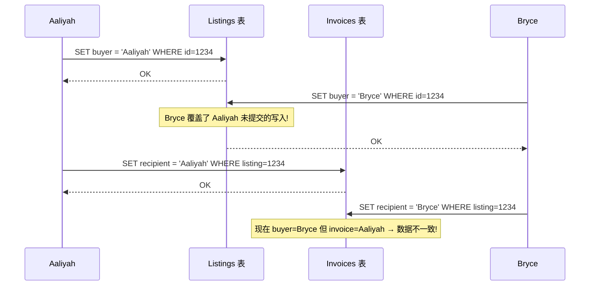
```mermaid
sequenceDiagram
    participant Aaliyah
    participant Listings as Listings 表
    participant Invoices as Invoices 表
    participant Bryce

    Aaliyah->>Listings: SET buyer = 'Aaliyah' WHERE id=1234
    Listings-->>Aaliyah: OK
    Bryce->>Listings: SET buyer = 'Bryce' WHERE id=1234
    Note over Listings: Bryce 覆盖了 Aaliyah 未提交的写入!
    Listings-->>Bryce: OK
    Aaliyah->>Invoices: SET recipient = 'Aaliyah' WHERE listing=1234
    Invoices-->>Aaliyah: OK
    Bryce->>Invoices: SET recipient = 'Bryce' WHERE listing=1234
    Note over Invoices: 现在 buyer=Bryce 但 invoice=Aaliyah → 数据不一致!
```

**后果**：Listings 表的 buyer 是 Bryce（他后写），但 Invoices 表的 recipient 是 Aaliyah（她先写）→ 数据不一致。

**实现方式**：**行级锁**——写入时持有锁直到事务提交或中止。另一个事务想写同一行必须等待。

### Read Committed 仍无法防止的问题

Read Committed **不能**防止：
- 丢失更新（Lost Updates）→ 见 8.5
- 读偏斜（Read Skew / Non-repeatable Read）→ 见 8.4
- Write Skew → 见 8.6
- Phantom → 见 8.6

这些需要更强的隔离级别。
## 8.4 Snapshot Isolation 与 MVCC

### 读偏斜 (Read Skew) 问题

Read Committed 允许这种异常：

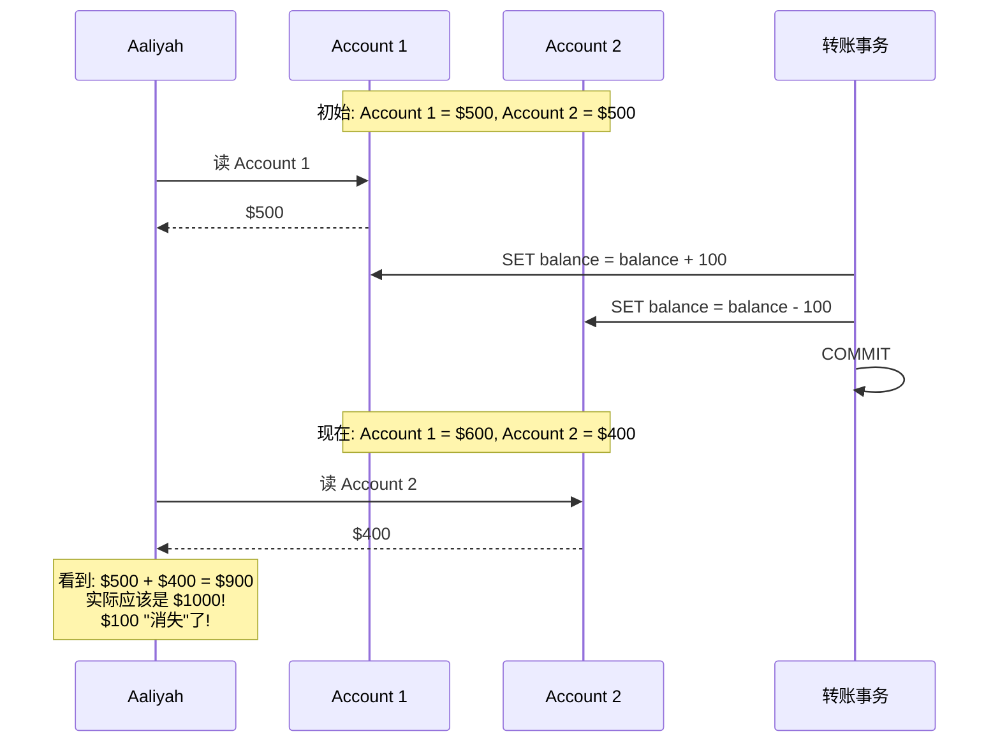
```mermaid
sequenceDiagram
    participant Aaliyah
    participant Acc1 as Account 1
    participant Acc2 as Account 2
    participant Transfer as 转账事务

    Note over Acc1,Acc2: 初始: Account 1 = $500, Account 2 = $500

    Aaliyah->>Acc1: 读 Account 1
    Acc1-->>Aaliyah: $500

    Transfer->>Acc1: SET balance = balance + 100
    Transfer->>Acc2: SET balance = balance - 100
    Transfer->>Transfer: COMMIT
    Note over Acc1,Acc2: 现在: Account 1 = $600, Account 2 = $400

    Aaliyah->>Acc2: 读 Account 2
    Acc2-->>Aaliyah: $400

    Note over Aaliyah: 看到: $500 + $400 = $900<br/>实际应该是 $1000!<br/>$100 "消失"了!
```

Aaliyah 看到了 Account 1 的旧值和 Account 2 的新值 → 两个账户的快照**不在同一时刻** → 出现了"$100 消失"的幻觉。这叫 **Read Skew**（也叫 nonrepeatable read）。

**Read Committed 认为这没问题**——Aaliyah 读到的每个值在读取时刻都是已提交的。但对以下场景不可接受：
- **数据库备份**：备份过程中新写入在继续 → 备份可能一部分是旧数据一部分是新数据
- **分析查询**：扫描大量数据，期间数据在变 → 结果可能自相矛盾

### 快照隔离 (Snapshot Isolation)

**核心思想**：每个事务从**一致性快照**读取——看到的是事务开始那一刻数据库的完整状态，即使数据随后被其他事务修改。

**关键性质**：**读操作永远不阻塞写操作，写操作永远不阻塞读操作** → 长时间运行的只读查询不会影响写入性能。

**使用者**：PostgreSQL, MySQL/InnoDB, Oracle, SQL Server, CockroachDB, TiDB, Aurora DSQL。BigQuery 等数据仓库也使用快照隔离做分析查询。

### MVCC (Multi-Version Concurrency Control) 实现

MVCC 为每行数据维护多个版本，每个版本标记了创建它的事务 ID 和删除它的事务 ID。

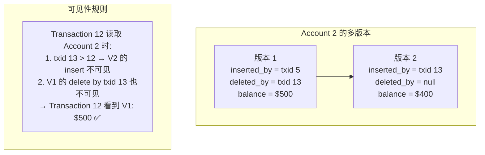
```mermaid
graph TD
    subgraph MVCC["Account 2 的多版本"]
        V1["版本 1<br/>inserted_by = txid 5<br/>deleted_by = txid 13<br/>balance = $500"]
        V2["版本 2<br/>inserted_by = txid 13<br/>deleted_by = null<br/>balance = $400"]
        V1 --> V2
    end
    subgraph RULES["可见性规则"]
        R["Transaction 12 读取 Account 2 时:<br/>1. txid 13 > 12 → V2 的 insert 不可见<br/>2. V1 的 delete by txid 13 也不可见<br/>→ Transaction 12 看到 V1: $500 ✅"]
    end
```

### MVCC 可见性规则（PostgreSQL 实现）

事务读取时，按以下规则决定哪个版本可见：

| 规则 | 说明 |
|------|------|
| 1. 开始时的 in-progress 列表 | 记录事务开始时所有未提交事务的 ID → 这些事务的写入全部不可见（即使它们后来提交了） |
| 2. 更大的 txid 不可见 | 在当前事务之后开始的事务的写入不可见 |
| 3. 已中止的事务不可见 | 被 abort 的事务的写入不可见 |
| 4. 其余写入可见 | 已提交且 txid < 当前事务 txid 的写入可见 |

**简化规则**：一行数据对事务 T 可见，当且仅当：
- 插入该行的事务在 T 开始前**已提交**
- 该行没有被删除，或删除它的事务在 T 开始前**尚未提交**

**UPDATE = DELETE 旧版本 + INSERT 新版本**。

### 索引与 MVCC

- **PostgreSQL**：索引指向行的所有版本，查询时过滤不可见的版本。同一页面内的不同版本可共享索引条目
- **CouchDB / Datomic / LMDB**：使用 copy-on-write B-Tree → 每个写事务创建新的树根 → 某个树根就是某个时间点的快照

### 命名混乱！

| 数据库 | 它叫什么 | 实际是什么 |
|--------|---------|---------|
| PostgreSQL | "repeatable read" | **Snapshot Isolation** |
| MySQL/InnoDB | "repeatable read" | 比 SI 弱的 MVCC（不检测 lost update） [30, 43] |
| Oracle | "serializable" | **Snapshot Isolation**（不是真正的 serializable！） |
| SQL Server | "snapshot" | Snapshot Isolation |
| SQL 标准 | 没有定义 "snapshot isolation" | 因为 SI 在 1975 年定标准时还没发明 |

> 你不能信任数据库声称的隔离级别名称——必须阅读文档或用工具（如 Jepsen [43]、Hermitage [30]）实测。
## 8.5 丢失更新问题 (Lost Updates)

### 问题描述

**丢失更新**发生在 read-modify-write 循环中：两个事务并发读取同一值，各自修改后写回，后写的覆盖了先写的修改。

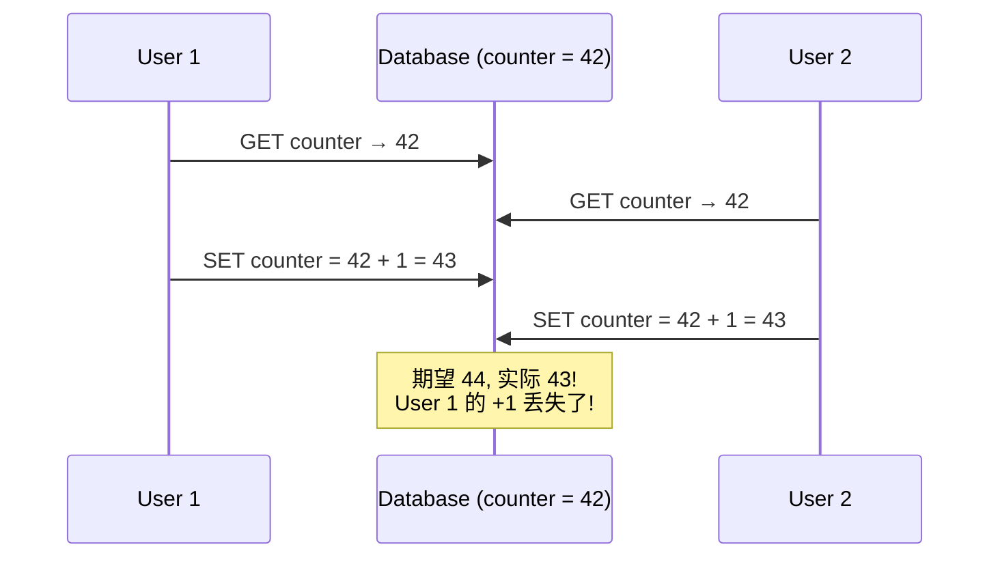
```mermaid
sequenceDiagram
    participant U1 as User 1
    participant DB as Database (counter = 42)
    participant U2 as User 2

    U1->>DB: GET counter → 42
    U2->>DB: GET counter → 42
    U1->>DB: SET counter = 42 + 1 = 43
    U2->>DB: SET counter = 42 + 1 = 43
    Note over DB: 期望 44, 实际 43!<br/>User 1 的 +1 丢失了!
```

**常见场景**：
- 银行余额更新
- 计数器递增
- JSON 文档中修改某个字段
- Wiki 编辑（两个用户同时编辑同一页面）

### 五种解决方案

#### 方案1：原子写操作 ⭐ 推荐

让数据库内部实现 read-modify-write，避免应用层的竞态：

```sql
-- 数据库内部保证原子性，不会丢失更新
UPDATE counters SET value = value + 1 WHERE key = 'foo';

-- MongoDB 也支持对 JSON 文档的局部原子更新
db.docs.updateOne({_id: 1}, {$push: {comments: newComment}})
```

**实现方式**：
- 排他锁（exclusive lock on object）—— 读取时锁定，更新完才释放
- 或强制所有原子操作在单线程执行

> ⚠️ **ORM 陷阱**：ORM 很容易生成不安全的 read-modify-write 代码（先 SELECT 再 UPDATE），而不是使用数据库的原子操作 [51, 52, 53]。

#### 方案2：显式锁 (SELECT ... FOR UPDATE)

当原子操作表达力不够时（需要应用逻辑判断），用 `FOR UPDATE` 显式锁定行：

```sql
-- 多人游戏：移动棋子前检查合法性
BEGIN TRANSACTION;

SELECT * FROM figures
  WHERE name = 'robot' AND game_id = 222
  FOR UPDATE;  -- 锁定这些行！

-- 应用层检查移动是否合法
-- 如果合法，更新位置
UPDATE figures SET position = 'c4' WHERE id = 1234;

COMMIT;
```

**FOR UPDATE 的含义**：告诉数据库"我要更新这些行，给我排他锁"。其他事务如果也 `SELECT FOR UPDATE` 同样的行，必须等待。

**风险**：忘了加 `FOR UPDATE` → 竞态条件。

#### 方案3：自动检测丢失更新

让事务并行执行，**数据库自动检测**丢失更新，发生时中止并重试：

| 数据库 | 自动检测丢失更新？ |
|--------|-----------------|
| PostgreSQL (repeatable read) | ✅ 自动检测并中止 |
| Oracle (serializable) | ✅ 自动检测并中止 |
| SQL Server (snapshot isolation) | ✅ 自动检测并中止 |
| **MySQL/InnoDB (repeatable read)** | ❌ **不检测**！[30, 43] |

> MySQL 不检测丢失更新是一个重要的实践陷阱。如果你用 MySQL 且需要防丢失更新，必须使用显式锁或原子操作。

**优势**：不需要应用代码做任何特殊处理——忘了加锁也没事。

#### 方案4：CAS (Compare-and-Set)

在不支持事务的数据库中，用条件写入防止丢失更新：

```sql
-- 只有当 content 没被其他人改过时才更新
UPDATE wiki_pages SET content = 'new content'
  WHERE id = 1234 AND content = 'old content';

-- 或使用版本号
UPDATE wiki_pages SET content = 'new', version = version + 1
  WHERE id = 1234 AND version = 42;
-- 如果 version 不再是 42 → UPDATE 影响 0 行 → 需要重试
```

#### 方案5：在多副本数据库中处理丢失更新

锁和 CAS 都假设**只有一个最新副本**——在多主或无主复制中不成立（多个节点可能并发接受写入）。

**解决方案**：
- **可交换操作**（如计数器递增、集合添加元素）→ CRDT 自动合并（Ch6）
- **LWW (Last Write Wins)** → 会丢失更新，不是解决方案！
- 需要真正防丢失更新 → 使用单主复制或带分布式锁的方案
## 8.6 Write Skew 与 Phantoms

### Write Skew：比丢失更新更隐蔽的竞态

**Write Skew** 是丢失更新的泛化版——两个事务读了相同的数据，然后各自更新了**不同的对象**，但组合效果违反了业务不变量。

#### 经典案例：医生值班 🏥

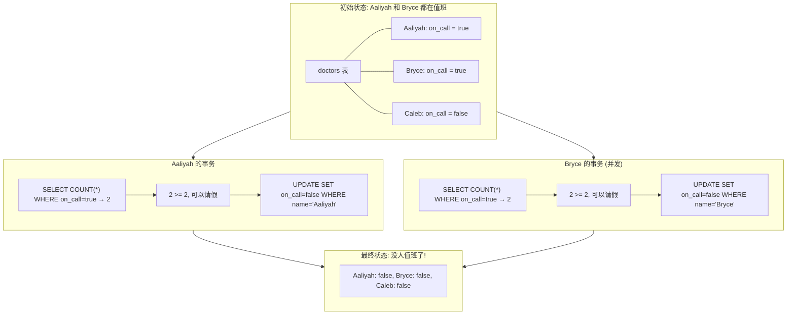
```mermaid
graph TD
    subgraph BEFORE["初始状态: Aaliyah 和 Bryce 都在值班"]
        TB["doctors 表"]
        TB --- R1["Aaliyah: on_call = true"]
        TB --- R2["Bryce: on_call = true"]
        TB --- R3["Caleb: on_call = false"]
    end

    subgraph TX_A["Aaliyah 的事务"]
        A1["SELECT COUNT(*) WHERE on_call=true → 2"]
        A2["2 >= 2, 可以请假"]
        A3["UPDATE SET on_call=false WHERE name='Aaliyah'"]
        A1 --> A2 --> A3
    end

    subgraph TX_B["Bryce 的事务 (并发)"]
        B1["SELECT COUNT(*) WHERE on_call=true → 2"]
        B2["2 >= 2, 可以请假"]
        B3["UPDATE SET on_call=false WHERE name='Bryce'"]
        B1 --> B2 --> B3
    end

    subgraph AFTER["最终状态: 没人值班了!"]
        AF["Aaliyah: false, Bryce: false, Caleb: false"]
    end

    BEFORE --> TX_A
    BEFORE --> TX_B
    TX_A --> AFTER
    TX_B --> AFTER
```

**两个事务各自检查"至少有 2 人值班" → 都得到 true → 各自请假 → 最后没人值班了！**

**为什么丢失更新的解决方案不适用？**
- 原子单对象操作？→ 不行，涉及多个对象
- 自动丢失更新检测？→ 不行，两个事务更新的是**不同行**
- **唯一约束？** → 不行，约束是"至少一人值班"，不能用唯一性表达

#### 更多 Write Skew 案例

| 场景 | 不变量 | Write Skew 如何违反 |
|------|--------|------------------|
| **会议室预订** | 同一时间同一会议室不能被两次预订 | 两个事务同时检查"无冲突预订" → 都通过 → 同时插入 → 双重预订 |
| **多人游戏** | 同一位置不能有两个棋子 | 两个玩家同时移动到同一位置 |
| **用户名抢注** | 用户名必须唯一 | 两个事务同时检查"用户名不存在" → 都通过 → 同时创建 → 重复 |
| **防超支** | 余额不能为负 | 两笔并发扣款各自检查"余额足够" → 都通过 → 总扣款超过余额 |

### Write Skew 的通用模式

所有 Write Skew 都遵循同一模式：

| 步骤 | 操作 |
|------|------|
| 1 | **SELECT** 检查某个条件是否成立（前提） |
| 2 | 应用代码根据查询结果做出决策 |
| 3 | **INSERT / UPDATE / DELETE** 改变了步骤 1 的查询结果（如果此时再查，条件不再成立） |

**核心问题**：步骤 1 的查询结果在步骤 3 执行后不再正确——但 Snapshot Isolation 下事务看不到其他事务的写入。

### Phantom（幻读）

> **Phantom** = 一个事务的写入改变了另一个事务的 SELECT 查询结果。

- 医生值班：UPDATE 减少了 `on_call=true` 的行数
- 会议室预订：INSERT 增加了冲突预订的行数
- 用户名：INSERT 创建了之前不存在的用户名

**Snapshot Isolation 防止只读查询中的 Phantom**，但在 read-write 事务中，Phantom 导致 Write Skew。

### 解决方案

| 方案 | 适用条件 | 局限 |
|------|---------|------|
| **唯一约束** | 不变量可以表达为唯一性（如用户名） | 只能表达简单不变量 |
| **SELECT ... FOR UPDATE** | 步骤 1 的 SELECT 能返回要锁的行 | 会议室预订中查的是"不存在的行" → FOR UPDATE 锁不了不存在的行！ |
| **物化冲突 (Materializing Conflicts)** | 将隐式冲突转化为显式的行 | 丑陋、容易出错、侵入数据模型 |
| **Serializable Isolation** ⭐ | 通用解决方案 | 有性能开销（见 8.7-8.9） |

#### 物化冲突的例子

```sql
-- 为会议室预订创建一个锁表：每个 (room, time_slot) 一行
CREATE TABLE room_time_slots (
    room_id INT, time_slot TIMESTAMP,
    PRIMARY KEY (room_id, time_slot)
);
-- 预先填充未来 6 个月所有 room × 15分钟 的组合

-- 预订时先锁定对应的时间段
BEGIN;
SELECT * FROM room_time_slots
  WHERE room_id = 123
    AND time_slot >= '2025-01-01 12:00'
    AND time_slot <  '2025-01-01 13:00'
  FOR UPDATE;  -- 现在可以锁了！

-- 检查无冲突后插入预订
INSERT INTO bookings (...) VALUES (...);
COMMIT;
```

> 物化冲突是**最后手段**——大多数情况下，直接使用 Serializable 隔离级别更简单安全。
## 8.7 可串行化之一：真正的串行执行 (Actual Serial Execution)

### 三种实现可串行化的方式

| 方式 | 思路 | 代表 |
|------|------|------|
| **真正串行执行** | 消除并发——一次只执行一个事务 | VoltDB, Redis, Datomic |
| **两阶段锁 (2PL)** | 悲观——用锁强制串行化 | MySQL/InnoDB, SQL Server |
| **SSI** | 乐观——允许并发，提交时检测冲突 | PostgreSQL, CockroachDB, FoundationDB |

### 串行执行：最简单的方案

> 完全去掉并发，在**单线程**上一次执行一个事务。

听起来疯狂，但两个发展使其可行（2000 年代才意识到）：
1. **RAM 便宜了**：整个活跃数据集放内存 → 事务不需要等磁盘 I/O
2. **OLTP 事务很短**：OLTP 事务通常只有少量读写 → 单线程也能跑很快

**关键前提**：每个事务必须极快完成——一个慢事务会阻塞所有其他事务。

### 存储过程：消除网络往返

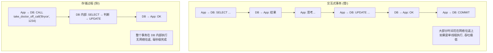
```mermaid
graph TD
    subgraph INTERACTIVE["交互式事务 (慢!)"]
        I1["App → DB: SELECT ..."]
        I2["DB → App: 结果"]
        I3["App: 思考..."]
        I4["App → DB: UPDATE ..."]
        I5["DB → App: OK"]
        I6["App → DB: COMMIT"]
        I1 --> I2 --> I3 --> I4 --> I5 --> I6
        NOTE1["大部分时间花在网络往返上<br/>如果是单线程执行, 吞吐极低"]
    end

    subgraph STORED_PROC["存储过程 (快!)"]
        SP1["App → DB: CALL take_doctor_off_call('Bryce', 1234)"]
        SP2["DB 内部: SELECT → 判断 → UPDATE"]
        SP3["DB → App: OK"]
        SP1 --> SP2 --> SP3
        NOTE2["整个事务在 DB 内部执行<br/>无网络往返, 毫秒级完成"]
    end
```

**单线程串行执行 + 存储过程** → 内存中的事务可以在几十微秒内完成 → 单线程也能达到可观的吞吐量。

**存储过程的演进**：
- 传统：PL/SQL (Oracle), T-SQL (SQL Server), PL/pgSQL (PostgreSQL) → 语言古老、调试困难
- 现代：VoltDB 用 Java/Groovy, Datomic 用 Java/Clojure, Redis 用 Lua, MongoDB 用 JavaScript → 正常编程语言

### 分片与串行执行

单线程限制了吞吐到一个 CPU 核心。扩展方式：

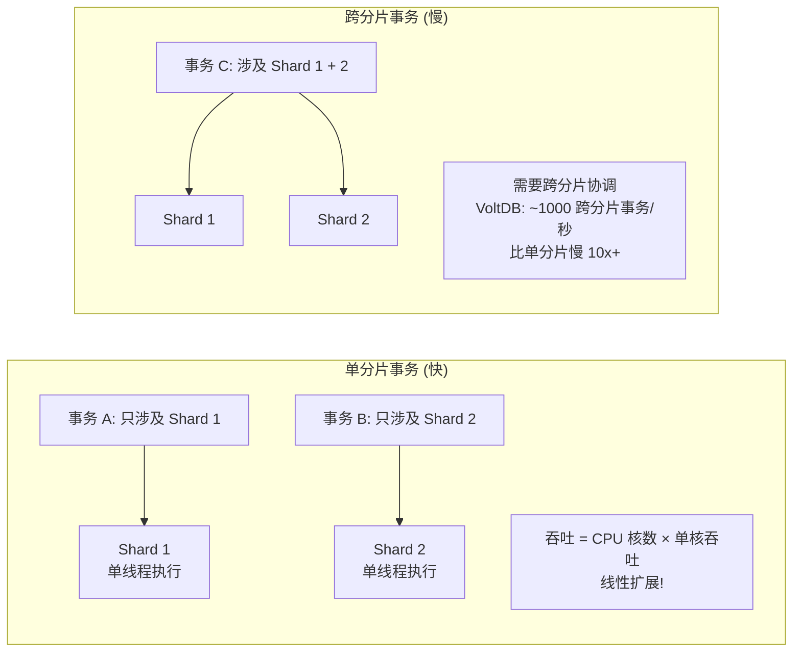
```mermaid
graph LR
    subgraph SINGLE_SHARD["单分片事务 (快)"]
        T1["事务 A: 只涉及 Shard 1"] --> S1["Shard 1<br/>单线程执行"]
        T2["事务 B: 只涉及 Shard 2"] --> S2["Shard 2<br/>单线程执行"]
        NOTE1["吞吐 = CPU 核数 × 单核吞吐<br/>线性扩展!"]
    end

    subgraph CROSS_SHARD["跨分片事务 (慢)"]
        T3["事务 C: 涉及 Shard 1 + 2"] --> S1B["Shard 1"]
        T3 --> S2B["Shard 2"]
        NOTE2["需要跨分片协调<br/>VoltDB: ~1000 跨分片事务/秒<br/>比单分片慢 10x+"]
    end
```

### 串行执行的适用条件

| 条件 | 要求 |
|------|------|
| 事务时长 | 每个事务必须极短（毫秒级） |
| 数据集 | 活跃数据集必须放得进内存 |
| 写吞吐 | 单 CPU 核心能处理的量（或可按分片扩展） |
| 跨分片事务 | 尽量避免；如果不可避免，吞吐受限 |
| 读密集？ | 长时间只读查询用 Snapshot Isolation 在串行执行循环之外运行 |
## 8.8 可串行化之二：两阶段锁 (2PL)

### 2PL ≠ 2PC ！

| 概念 | 全称 | 用途 |
|------|------|------|
| **2PL** | Two-Phase **Locking** | 单机可串行化**隔离** |
| **2PC** | Two-Phase **Commit** | 分布式**原子提交** |

> 它们是完全不同的东西，只是名字不巧相似。

### 2PL 的核心规则

| 对比 | Snapshot Isolation | 2PL |
|------|-------------------|-----|
| 读对写的影响 | 读不阻塞写 | **读阻塞写** |
| 写对读的影响 | 写不阻塞读 | **写阻塞读** |
| 写对写的影响 | 写阻塞写 | 写阻塞写 |

2PL 比快照隔离更强：**不仅写写互斥，读写也互斥**。

### 锁机制

每个对象有一个锁，两种模式：

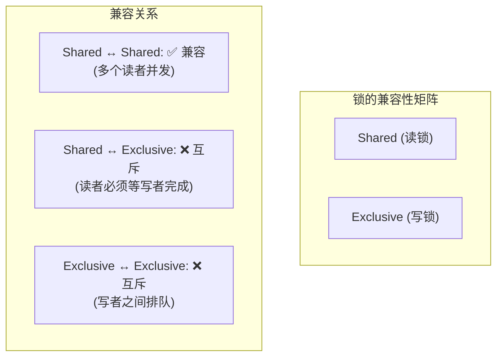
```mermaid
graph TD
    subgraph LOCK["锁的兼容性矩阵"]
        direction LR
        SH["Shared (读锁)"]
        EX["Exclusive (写锁)"]
    end
    subgraph COMPAT["兼容关系"]
        C1["Shared ↔ Shared: ✅ 兼容<br/>(多个读者并发)"]
        C2["Shared ↔ Exclusive: ❌ 互斥<br/>(读者必须等写者完成)"]
        C3["Exclusive ↔ Exclusive: ❌ 互斥<br/>(写者之间排队)"]
    end
```

**"两阶段"的含义**：
1. **Growing Phase**：事务执行期间不断获取锁
2. **Shrinking Phase**：事务结束时释放所有锁

> 锁只在 COMMIT 或 ABORT 时释放——所以持有的时间可能很长。

### 死锁 (Deadlock)

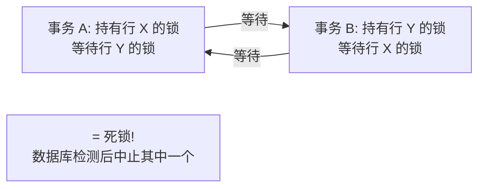
```mermaid
graph LR
    TX_A["事务 A: 持有行 X 的锁<br/>等待行 Y 的锁"]
    TX_B["事务 B: 持有行 Y 的锁<br/>等待行 X 的锁"]
    TX_A -->|"等待"| TX_B
    TX_B -->|"等待"| TX_A
    NOTE["= 死锁!<br/>数据库检测后中止其中一个"]
```

**处理**：数据库自动检测死锁环，中止其中一个事务 → 该事务需要应用层重试。

### 2PL 的性能问题

2PL 的性能显著差于弱隔离级别，原因：

1. **锁竞争**：任何读写冲突都导致等待 → 并发度大幅下降
2. **不稳定延迟**：一个慢事务可以阻塞大量其他事务 → P99 延迟极高
3. **死锁频率高**：相比 read-committed，2PL 下死锁更频繁 → 被中止的事务需要重做所有工作

> 这就是为什么 2PL 从 1970s 到 2000s 一直不受欢迎——大多数数据库选择了弱隔离级别。

### 谓词锁 (Predicate Locks)

**问题**：`FOR UPDATE` 只能锁**已存在**的行。但 Phantom 问题涉及**尚不存在的行**（如"某时间段没有预订" → 新插入打破了这个条件）。

**谓词锁**：锁定匹配某个查询条件的**所有行（包括未来可能插入的）**。

```sql
-- 谓词锁的概念（不是 SQL 语法）：
-- 锁定 "room_id = 123 AND time BETWEEN 12:00 AND 13:00" 的所有行
-- → 任何 INSERT/UPDATE/DELETE 匹配这个条件的操作都必须等待
```

**问题**：检查谓词匹配代价高（每次写入都要检查所有活跃的谓词锁）。

### Index-Range Locks（实际使用的方案）

谓词锁的简化近似——锁定索引中的一个**范围**而非精确谓词：


```mermaid
graph TD
    subgraph INDEX_LOCK["Index-Range Lock 示例"]
        PRED["精确谓词: room=123 AND time BETWEEN 12:00-13:00"]
        APPROX1["近似1: 锁定 room=123 的所有预订"]
        APPROX2["近似2: 锁定 12:00-13:00 的所有房间"]
        PRED --> APPROX1
        PRED --> APPROX2
    end
```

| 特性 | 谓词锁 | Index-Range 锁 |
|------|--------|--------------|
| 精确性 | 精确匹配条件 | 匹配更大范围（可能多锁一些） |
| 性能 | 慢（检查匹配代价高） | 快（利用索引） |
| 安全性 | ✅ 精确 | ✅ 安全（多锁不会漏锁） |

**如果没有合适的索引** → 退化为表级锁（锁整张表）→ 性能很差但仍然安全。
## 8.9 可串行化之三：可串行化快照隔离 (SSI)

### 动机：兼顾性能和安全

| 方式 | 性能 | 安全 | 问题 |
|------|------|------|------|
| 串行执行 | 取决于场景 | ✅ | 吞吐限于单 CPU；需要存储过程 |
| 2PL | ❌ 差 | ✅ | 锁竞争、死锁、不稳定延迟 |
| Snapshot Isolation | ✅ 好 | ❌ 有 write skew | — |
| **SSI** | ✅ 好 | ✅ | 高中止率场景需要短事务 |

SSI 在 Snapshot Isolation 之上**添加冲突检测** → 以极小的性能代价实现可串行化。2008 年首次描述 [55, 67]，现已用于 PostgreSQL [56]、CockroachDB [5]、FoundationDB [8] 等。

### 悲观 vs 乐观

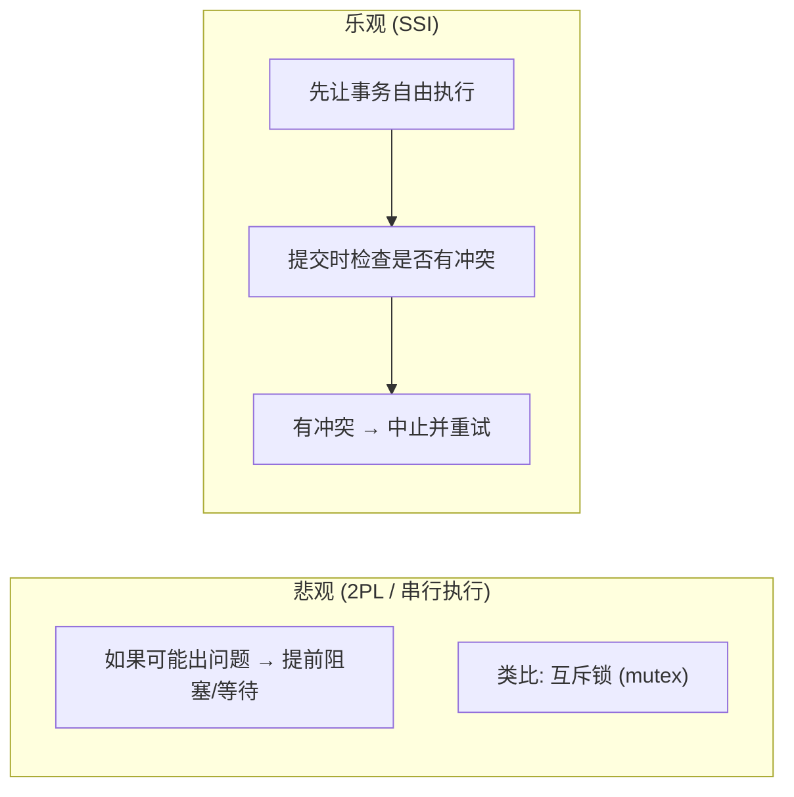
```mermaid
graph LR
    subgraph PESSIMISTIC["悲观 (2PL / 串行执行)"]
        P1["如果可能出问题 → 提前阻塞/等待"]
        P2["类比: 互斥锁 (mutex)"]
    end
    subgraph OPTIMISTIC["乐观 (SSI)"]
        O1["先让事务自由执行"]
        O2["提交时检查是否有冲突"]
        O3["有冲突 → 中止并重试"]
        O1 --> O2 --> O3
    end
```

**乐观的优势**：
- 低竞争时 → 很少有事务需要中止 → 性能好
- 读不阻塞写，写不阻塞读（和 Snapshot Isolation 一样）
- 只读事务永远不需要锁 → 对读密集负载非常友好

**乐观的劣势**：
- 高竞争时 → 大量事务被中止 → 重试的开销可能很高
- 长事务更容易与其他事务冲突 → 要求读写事务尽量短

### SSI 如何检测冲突？

SSI 检测的核心问题：**事务的决策是否基于过期的前提？**

即 Write Skew 的通用模式（8.6 节）：
1. SELECT 查询条件 → 得到结果（前提）
2. 基于结果做出决策
3. 写入改变了步骤 1 的查询结果 → **前提失效**

SSI 检测两种情况：

#### 检测1：读到了过期的 MVCC 版本

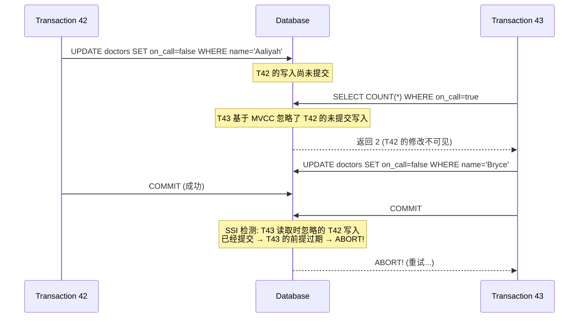
```mermaid
sequenceDiagram
    participant T42 as Transaction 42
    participant DB as Database
    participant T43 as Transaction 43

    T42->>DB: UPDATE doctors SET on_call=false WHERE name='Aaliyah'
    Note over DB: T42 的写入尚未提交

    T43->>DB: SELECT COUNT(*) WHERE on_call=true
    Note over DB: T43 基于 MVCC 忽略了 T42 的未提交写入
    DB-->>T43: 返回 2 (T42 的修改不可见)

    T43->>DB: UPDATE doctors SET on_call=false WHERE name='Bryce'
    T42->>DB: COMMIT (成功)

    T43->>DB: COMMIT
    Note over DB: SSI 检测: T43 读取时忽略的 T42 写入<br/>已经提交 → T43 的前提过期 → ABORT!
    DB-->>T43: ABORT! (重试...)
```

**原理**：当 T43 提交时，数据库检查"T43 因为 MVCC 规则忽略的那些写入，是否已经被提交了？" 如果是 → T43 基于过期数据做了决策 → 中止。

#### 检测2：写入影响了其他事务的读

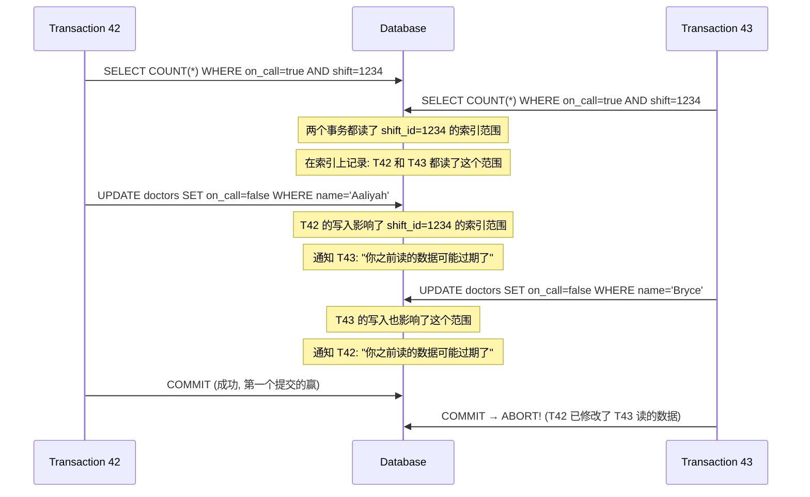
```mermaid
sequenceDiagram
    participant T42 as Transaction 42
    participant DB as Database
    participant T43 as Transaction 43

    T42->>DB: SELECT COUNT(*) WHERE on_call=true AND shift=1234
    T43->>DB: SELECT COUNT(*) WHERE on_call=true AND shift=1234
    Note over DB: 两个事务都读了 shift_id=1234 的索引范围
    Note over DB: 在索引上记录: T42 和 T43 都读了这个范围

    T42->>DB: UPDATE doctors SET on_call=false WHERE name='Aaliyah'
    Note over DB: T42 的写入影响了 shift_id=1234 的索引范围
    Note over DB: 通知 T43: "你之前读的数据可能过期了"

    T43->>DB: UPDATE doctors SET on_call=false WHERE name='Bryce'
    Note over DB: T43 的写入也影响了这个范围
    Note over DB: 通知 T42: "你之前读的数据可能过期了"

    T42->>DB: COMMIT (成功, 第一个提交的赢)
    T43->>DB: COMMIT → ABORT! (T42 已修改了 T43 读的数据)
```

**原理**：利用类似 index-range 锁的机制，但**不阻塞**——只是记录谁读了什么范围。当一个写入影响了其他事务读过的范围时，不是阻塞，而是**通知**那些事务"你的读可能过期了"。提交时再检查。

### SSI 的性能

| 维度 | SSI 表现 |
|------|---------|
| 读密集 | ✅ 极好（只读事务永远不被阻塞/中止） |
| 写密集 + 低竞争 | ✅ 好（很少中止） |
| 写密集 + 高竞争 | ⚠️ 中止率升高，需要短事务 |
| 跨分片 | ✅ 可行（FoundationDB 在多分片间检测冲突 [8]） |
| 延迟可预测性 | ✅ 比 2PL 好得多（不阻塞） |

### 三种可串行化方案总结

| 维度 | 串行执行 | 2PL | SSI |
|------|--------|-----|-----|
| **并发** | 无 | 悲观（锁） | 乐观（检测） |
| **读阻塞写？** | 是（单线程） | 是 | ❌ 不阻塞 |
| **写阻塞读？** | 是（单线程） | 是 | ❌ 不阻塞 |
| **死锁？** | 不可能 | 可能 | 不可能 |
| **中止？** | 不需要 | 死锁时中止 | 冲突检测时中止 |
| **事务要求** | 必须短 + 存储过程 | 无特殊要求 | 读写事务应短 |
| **适合场景** | 内存数据库、低吞吐写 | 传统 OLTP | 通用（现代首选） |
| **代表** | VoltDB, Redis | MySQL/InnoDB, SQL Server | PostgreSQL, CockroachDB |
## 8.10 分布式事务与两阶段提交 (2PC)

### 为什么分布式事务更难？

单机事务的原子性靠**一个设备**保证——磁盘控制器在写 commit 记录时，这个操作要么成功要么失败。

分布式事务涉及多个节点 → **不能简单地向所有节点发送 commit 请求**：

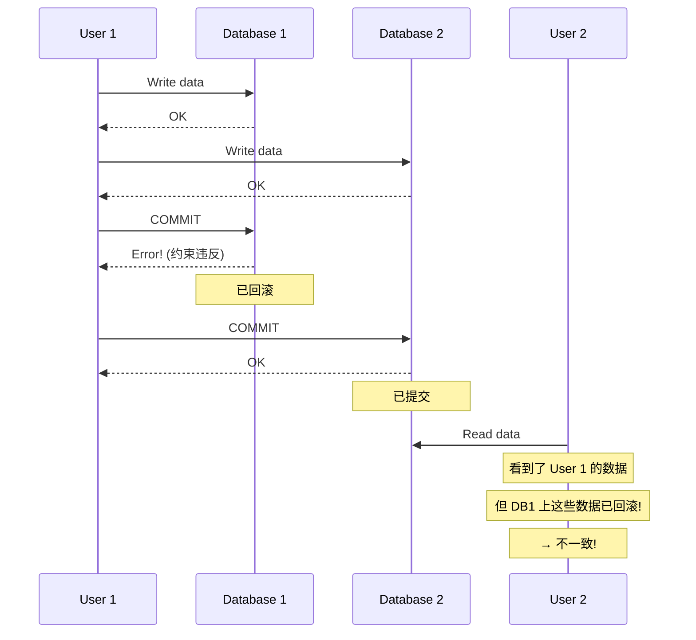
```mermaid
sequenceDiagram
    participant U1 as User 1
    participant DB1 as Database 1
    participant DB2 as Database 2
    participant U2 as User 2

    U1->>DB1: Write data
    DB1-->>U1: OK
    U1->>DB2: Write data
    DB2-->>U1: OK
    U1->>DB1: COMMIT
    DB1-->>U1: Error! (约束违反)
    Note over DB1: 已回滚
    U1->>DB2: COMMIT
    DB2-->>U1: OK
    Note over DB2: 已提交

    U2->>DB2: Read data
    Note over U2: 看到了 User 1 的数据
    Note over U2: 但 DB1 上这些数据已回滚!
    Note over U2: → 不一致!
```

**问题**：一些节点提交成功，另一些失败 → 节点间不一致。已提交的数据无法收回（其他事务可能已读到）。

### 2PC 协议详解

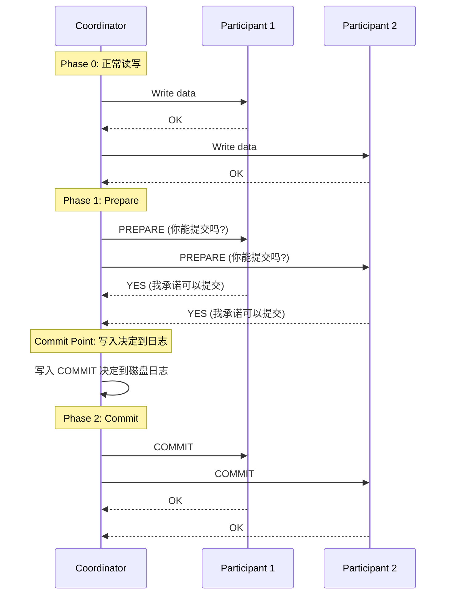
```mermaid
sequenceDiagram
    participant Coord as Coordinator
    participant DB1 as Participant 1
    participant DB2 as Participant 2

    Note over Coord: Phase 0: 正常读写
    Coord->>DB1: Write data
    DB1-->>Coord: OK
    Coord->>DB2: Write data
    DB2-->>Coord: OK

    Note over Coord: Phase 1: Prepare
    Coord->>DB1: PREPARE (你能提交吗?)
    Coord->>DB2: PREPARE (你能提交吗?)
    DB1-->>Coord: YES (我承诺可以提交)
    DB2-->>Coord: YES (我承诺可以提交)

    Note over Coord: Commit Point: 写入决定到日志
    Coord->>Coord: 写入 COMMIT 决定到磁盘日志

    Note over Coord: Phase 2: Commit
    Coord->>DB1: COMMIT
    Coord->>DB2: COMMIT
    DB1-->>Coord: OK
    DB2-->>Coord: OK
```

### 2PC 的六个关键步骤

| 步骤 | 操作 | 关键性质 |
|------|------|---------|
| 1 | 应用从 Coordinator 获取全局事务 ID | 唯一标识分布式事务 |
| 2 | 在各 Participant 上开始单节点事务 | 挂载全局事务 ID |
| 3 | Coordinator 发送 PREPARE | 如果任何一个失败 → 全部 ABORT |
| 4 | Participant 收到 PREPARE 后**承诺** | **不可撤销的承诺**：确保在任何情况下（崩溃、断电、磁盘满）都能完成提交 |
| 5 | Coordinator 收到所有 YES → **写 commit 决定到磁盘** | 这是 **Commit Point** → 不可逆 |
| 6 | Coordinator 发送 COMMIT/ABORT 给所有 Participant | 失败则无限重试，直到所有 Participant 确认 |

### 两个"不归路" (Points of No Return)

```mermaid
graph TD
    subgraph BEFORE["Prepare 之前"]
        B1["Participant 可以自由中止"]
        B2["Coordinator 可以自由中止"]
    end
    subgraph PONR1["Point of No Return 1: Participant 投票 YES"]
        P1["Participant 承诺: 无论如何都能提交<br/>(数据已 fsync, 约束已检查)"]
        P2["Participant 不能再单方面中止!<br/>必须等 Coordinator 的最终决定"]
    end
    subgraph PONR2["Point of No Return 2: Coordinator 写入 COMMIT"]
        C1["决定已持久化到 Coordinator 磁盘"]
        C2["即使 Coordinator 之后崩溃<br/>恢复后也必须执行 COMMIT"]
        C3["这个决定不可逆转"]
    end
    BEFORE --> PONR1 --> PONR2
```

> **婚礼比喻**：说"我愿意"之前可以反悔；说了"我愿意"之后不能反悔——即使你晕倒了，醒来后发现自己已经结婚了。

### Coordinator 故障：In-Doubt 状态

```mermaid
sequenceDiagram
    participant Coord as Coordinator
    participant DB1 as Participant 1
    participant DB2 as Participant 2

    Coord->>DB1: PREPARE
    Coord->>DB2: PREPARE
    DB1-->>Coord: YES
    DB2-->>Coord: YES

    Note over Coord: 写入 COMMIT 决定...
    Coord->>DB2: COMMIT
    DB2-->>Coord: OK

    Note over Coord: 崩溃! 还没来得及通知 DB1

    Note over DB1: 我投了 YES, 但没收到最终决定<br/>= IN DOUBT / UNCERTAIN 状态<br/>不能提交（也许 Coordinator 决定 abort）<br/>不能中止（也许 Coordinator 决定 commit）<br/>只能等...
```

**In-Doubt 事务的后果**：
- Participant 必须**持有锁**直到收到最终决定
- 锁阻塞所有其他事务访问这些行
- Coordinator 崩溃 20 分钟 → 锁被持有 20 分钟
- Coordinator 磁盘丢失 → **锁永远被持有**，只能手动介入

### 3PC 和共识

- **3PC** [79]：理论上的非阻塞原子提交协议，但假设网络延迟有上界 → 实际网络中不成立 → 不实用
- **更好的方案**：用 Raft/Paxos 等**共识协议**替换单点 Coordinator → 自动故障转移 → Ch10 详述
## 8.11 XA 事务、幂等性与总结

### 两类分布式事务

| 类型 | 说明 | 性能 | 使用者 |
|------|------|------|--------|
| **数据库内部** | 同一数据库软件的多个分片间 | ✅ 好（可优化） | CockroachDB, TiDB, Spanner, FoundationDB, Kafka |
| **异构 (XA)** | 不同数据库/消息队列之间 | ❌ 差 | 传统企业系统 |

### XA 事务的问题

**XA (eXtended Architecture)** [75]：1991 年定义的跨异构系统 2PC 标准。被 PostgreSQL, MySQL, Oracle, ActiveMQ 等广泛支持。

| 问题 | 说明 |
|------|------|
| **Coordinator 是单点故障** | Coordinator 通常运行在应用进程中 → 应用崩溃 = Coordinator 丢失 → in-doubt 事务永远卡住 |
| **Coordinator 日志在应用侧** | 不在数据库侧 → 应用服务器的磁盘也是关键状态 |
| **不能跨系统检测死锁** | 缺乏跨不同数据库交换锁信息的协议 |
| **不兼容 SSI** | 不能跨系统检测可串行化冲突 |
| **Heuristic decisions** | 最后手段：Participant 单方面决定提交或中止 → **可能违反原子性** |
| **Orphaned transactions** | Coordinator 日志丢失 → in-doubt 事务永远卡住，锁永远不释放 |

### 数据库内部分布式事务 ≠ XA

NewSQL 数据库（CockroachDB, TiDB, Spanner 等）的内部分布式事务**不使用 XA**：
- Coordinator 被 Raft 共识协议复制 → 自动故障转移
- Coordinator 和 Participant 直接通信 → 无需通过应用
- Participant 也被复制 → 单节点故障不影响事务
- 使用 SSI 或 SI → 支持现代并发控制

### Exactly-Once 不需要分布式事务

**场景**：从消息队列消费消息 → 处理 → 写入数据库。如何确保恰好处理一次？

**方案：幂等性 (Idempotence)**

```mermaid
graph TD
    subgraph EXACTLY_ONCE["Exactly-Once 通过幂等性实现"]
        M["消息 (ID=abc123)"]
        CHECK["在数据库中检查<br/>message ID abc123 是否已处理"]
        EXIST["已存在 → ACK 消息, 跳过"]
        NOT_EXIST["不存在 → 开始 DB 事务"]
        PROCESS["在事务内:<br/>a 插入 message ID<br/>b 执行业务逻辑写入"]
        COMMIT_STEP["COMMIT 事务"]
        ACK["ACK 消息给 broker"]
        DELETE["之后可删除 message ID<br/>(节省空间)"]

        M --> CHECK
        CHECK -->|"已处理"| EXIST
        CHECK -->|"未处理"| NOT_EXIST
        NOT_EXIST --> PROCESS --> COMMIT_STEP --> ACK --> DELETE
    end
```

**崩溃场景分析**：

| 崩溃时机 | 后果 | 恢复 |
|---------|------|------|
| COMMIT 前崩溃 | 事务回滚 → broker 重新投递 | 重试处理（幂等） |
| COMMIT 后、ACK 前崩溃 | 数据已写入 → broker 重新投递 | 检查 message ID → 已存在 → 跳过 |
| ACK 后、DELETE 前崩溃 | 正常，message ID 表里留个旧记录 | 无害 |

**关键洞察**：这种方案**只需要数据库内部的事务**——不需要跨消息队列和数据库的分布式事务。这就是 **Kafka Streams** 实现 exactly-once 的核心思路 [87]。

---

## 💻 代码示例与最佳实践

### 示例1：PostgreSQL 隔离级别实战

```sql
-- 查看当前隔离级别
SHOW default_transaction_isolation;  -- 通常是 "read committed"

-- 使用 Serializable 隔离级别 (PostgreSQL 的 SSI)
BEGIN TRANSACTION ISOLATION LEVEL SERIALIZABLE;

-- 医生值班示例：安全地请假
SELECT COUNT(*) FROM doctors
  WHERE on_call = true AND shift_id = 1234;
-- 如果 count >= 2:
UPDATE doctors SET on_call = false
  WHERE name = 'Aaliyah' AND shift_id = 1234;

COMMIT;
-- 如果 SSI 检测到 write skew → 自动 ABORT
-- 应用层捕获错误并重试
```

### 示例2：幂等性消息处理 (Python)

```python
import psycopg2

def process_message(msg_id: str, payload: dict, conn):
    """幂等地处理消息：重复调用安全"""
    with conn.cursor() as cur:
        try:
            cur.execute("BEGIN")

            # 1. 检查是否已处理（利用唯一约束）
            cur.execute(
                "INSERT INTO processed_messages (msg_id) VALUES (%s)",
                (msg_id,)
            )

            # 2. 执行业务逻辑
            cur.execute(
                "UPDATE accounts SET balance = balance + %s WHERE id = %s",
                (payload['amount'], payload['account_id'])
            )

            cur.execute("COMMIT")
            return True  # 处理成功

        except psycopg2.errors.UniqueViolation:
            cur.execute("ROLLBACK")
            return False  # 已处理过，跳过

        except Exception:
            cur.execute("ROLLBACK")
            raise  # 其他错误，让 broker 重新投递
```

### 示例3：FOR UPDATE 防止 Write Skew

```sql
-- 会议室预订：使用 FOR UPDATE 防止双重预订
BEGIN;

-- 锁定与目标时间段重叠的现有预订
SELECT id FROM bookings
  WHERE room_id = 123
    AND end_time > '2025-01-01 12:00'
    AND start_time < '2025-01-01 13:00'
  FOR UPDATE;

-- 如果 SELECT 返回 0 行，可以安全插入
-- 注意：FOR UPDATE 在无行匹配时不锁任何东西!
-- → 两个并发事务都可能看到 0 行 → 都插入 → 双重预订!
-- → 这就是 Phantom 问题，需要 Serializable 或物化冲突

INSERT INTO bookings (room_id, start_time, end_time, user_id)
VALUES (123, '2025-01-01 12:00', '2025-01-01 13:00', 666);

COMMIT;
```

### 最佳实践

| 场景 | 推荐隔离级别 | 原因 |
|------|----------|------|
| 简单 CRUD | Read Committed (默认) | 足够，性能好 |
| 财务/余额操作 | Serializable (SSI) | 必须防止丢失更新和 write skew |
| 计数器递增 | 原子操作 `SET x = x + 1` | 无需更高隔离级别 |
| 库存扣减 | Serializable 或 SELECT FOR UPDATE | 防止超卖 |
| 只读分析查询 | Snapshot Isolation | 一致性快照，不阻塞写入 |
| 跨分片写入 | 数据库内部分布式事务 | 避免 XA |
| 消息处理 | 幂等性 + 单库事务 | 避免分布式事务的复杂度 |

---

## 🎯 系统设计面试题

### 面试题1：如何防止电商系统的超卖？

**题目**: 商品库存 100 件，如何确保并发下单不会卖出 101 件？

| 方案 | 实现 | 优缺点 |
|------|------|--------|
| **原子操作** | `UPDATE products SET stock = stock - 1 WHERE id = ? AND stock > 0` | 最简单 ✅; 返回影响 0 行 = 库存不足 |
| **SELECT FOR UPDATE** | 先锁行 `SELECT stock FROM products WHERE id = ? FOR UPDATE`, 检查后再 UPDATE | 可加业务逻辑 ✅; 忘加锁就有 bug |
| **Serializable 隔离** | 数据库自动检测冲突 | 最安全 ✅; 高并发下中止率可能高 |
| **Redis 预扣减** | 在 Redis 中原子递减，成功后再写数据库 | 超高并发 ✅; 需处理 Redis 和 DB 的一致性 |

### 面试题2：解释 Snapshot Isolation 和 Serializable 的区别

**参考答案**:

| 维度 | Snapshot Isolation | Serializable |
|------|-------------------|--------------|
| 防脏读 | ✅ | ✅ |
| 防读偏斜 | ✅ | ✅ |
| 防丢失更新 | 取决于实现（MySQL 不防） | ✅ |
| 防 Write Skew | ❌ | ✅ |
| 防 Phantom | 只读查询中 ✅; read-write 中 ❌ | ✅ |
| 性能 | 好（读不阻塞写） | 取决于实现（SSI 好, 2PL 差） |

**关键**：Snapshot Isolation 在只读场景下和 Serializable 一样强，但在有 read-write 竞态的场景下，它不能防止 Write Skew。

### 面试题3：2PL 和 2PC 有什么区别？

**参考答案**:

| | 2PL (Two-Phase Locking) | 2PC (Two-Phase Commit) |
|--|------------------------|----------------------|
| 目的 | 实现可串行化**隔离** | 实现分布式**原子提交** |
| 场景 | 单机并发控制 | 多节点事务 |
| "两阶段" | Growing (获取锁) + Shrinking (释放锁) | Prepare (投票) + Commit (执行决定) |
| 失败处理 | 死锁检测 → 中止一个事务 | Coordinator 故障 → in-doubt 事务卡住 |

### 面试题4：如何实现跨服务的一致性？

**参考答案**（按推荐程度排序）:

1. **避免跨服务事务**：设计服务边界使相关数据在同一服务内 → 使用单库事务
2. **Saga 模式**：拆为多步操作，每步有补偿操作 → 失败时执行补偿（不保证隔离性）
3. **幂等性 + 消息队列**：消息处理中记录 message ID → 重试安全
4. **数据库内部分布式事务**：使用 CockroachDB/TiDB 等 → 分片间原子提交
5. **XA 分布式事务**：最后手段——Coordinator 单点、锁持有时间长

---

## 📝 本章要点总结

```mermaid
mindmap
  root((第8章<br/>事务))
    ACID
      A = 可中止性, 不是不可分割
      C = 应用层概念
      I = 隔离级别光谱
      D = 持久性, 但不完美
    隔离级别
      Read Committed
        防脏读/脏写
      Snapshot Isolation
        MVCC, 防读偏斜
        MySQL 不检测丢失更新!
      Serializable
        防一切竞态
    竞态条件
      丢失更新: 原子操作 / FOR UPDATE / CAS
      Write Skew: 医生值班, 会议室
      Phantom: 查询结果被写入改变
    可串行化实现
      串行执行: 单线程 + 存储过程
      2PL: 悲观锁, 死锁, 性能差
      SSI: 乐观, 冲突检测, 现代首选
    分布式事务
      2PC: Prepare/Commit, Coordinator 单点
      XA: 问题多, 避免使用
      幂等性: 替代分布式事务
    Saga
      补偿操作
      无隔离性
      Orchestrator vs Choreography
```

### 隔离级别全景图 ⭐

| 隔离级别 | 脏读 | 读偏斜 | Phantom(只读) | 丢失更新 | Write Skew |
|---------|------|--------|-------------|---------|------------|
| **Read Uncommitted** | ❌ 可能 | ❌ 可能 | ❌ 可能 | ❌ 可能 | ❌ 可能 |
| **Read Committed** | ✅ 防止 | ❌ 可能 | ❌ 可能 | ❌ 可能 | ❌ 可能 |
| **Snapshot Isolation** | ✅ 防止 | ✅ 防止 | ✅ 防止 | ?取决于实现 | ❌ 可能 |
| **Serializable** | ✅ 防止 | ✅ 防止 | ✅ 防止 | ✅ 防止 | ✅ 防止 |

### 十二大 Takeaways

1. **ACID 中的 A 不是"不可分割"**，而是"可中止"——事务失败时保证全部回滚

2. **ACID 中的 C 是应用层概念**——数据库只能通过约束验证部分不变量

3. **"ACID compliant" 是营销术语**——不同数据库对 ACID 的实现差异巨大

4. **Read Committed 是最基础的隔离**——防脏读/脏写，但不防读偏斜、丢失更新、write skew

5. **Snapshot Isolation 用 MVCC 实现**——每行多版本，按 txid 决定可见性。读不阻塞写。但不防 write skew

6. **丢失更新用原子操作最简单**——`SET x = x + 1`。MySQL 不自动检测丢失更新（PostgreSQL 和 Oracle 会）

7. **Write Skew 是最隐蔽的竞态**——读取条件 → 做决策 → 写入破坏了条件。只有 Serializable 能防止

8. **Phantom 是 Write Skew 的根源**——一个事务的写改变了另一个事务查询的结果集

9. **三种可串行化实现各有权衡**：串行执行（简单但受限单核），2PL（安全但慢），SSI（乐观、高性能，现代首选）

10. **2PC 保证分布式原子提交但有致命弱点**——Coordinator 故障导致 in-doubt 事务无限阻塞。用共识协议（Raft/Paxos）替代单点 Coordinator

11. **XA 分布式事务问题严重**——单点 Coordinator、锁持有时间长、不兼容 SSI。NewSQL 的内部分布式事务是更好的方案

12. **幂等性 + 单库事务可以替代分布式事务**实现 exactly-once 消息处理——记录 message ID 即可

---

## 📌 额外补充：Saga 模式（书中未专门讲述，但实战中非常重要）

> 本书第8章聚焦于**数据库层面的事务保证**（ACID、隔离级别、2PC），没有专门讨论 Saga。但 Saga 是微服务架构下处理跨服务一致性的主流方案，面试高频考点，因此补充于此。

### 为什么需要 Saga？

在微服务架构中，每个服务有自己独立的数据库。一个业务操作（如"下单"）可能涉及多个服务：

```mermaid
graph LR
    ORDER["订单服务<br/>(创建订单)"]
    STOCK["库存服务<br/>(扣减库存)"]
    PAY["支付服务<br/>(扣款)"]
    NOTIFY["通知服务<br/>(发送确认)"]
    ORDER --> STOCK --> PAY --> NOTIFY
```

**问题**：这 4 个服务不在同一个数据库里 → 无法用单库事务 → 2PC/XA 有严重的性能和可用性问题（见 8.11 节）。

**Saga 的解决方案**：将分布式长事务拆成一系列**本地事务**，每个本地事务有对应的**补偿操作**。如果某一步失败，按反序执行前面步骤的补偿操作。

### Saga 的核心机制

```mermaid
graph TD
    subgraph SUCCESS["正向流程 (Happy Path)"]
        T1["T1: 创建订单<br/>(状态=PENDING)"]
        T2["T2: 扣减库存"]
        T3["T3: 扣款"]
        T4["T4: 确认订单<br/>(状态=CONFIRMED)"]
        T1 --> T2 --> T3 --> T4
    end

    subgraph FAILURE["补偿流程 (T3 扣款失败)"]
        C3["T3 失败!"]
        C2["C2: 补偿 → 恢复库存"]
        C1["C1: 补偿 → 取消订单<br/>(状态=CANCELLED)"]
        C3 --> C2 --> C1
    end

    T3 -.->|"失败"| C3
```

| 正向操作 | 补偿操作 |
|---------|---------|
| T1: 创建订单 (PENDING) | C1: 取消订单 (CANCELLED) |
| T2: 扣减库存 | C2: 恢复库存 |
| T3: 扣款 | C3: 退款 |
| T4: 确认订单 | 无需补偿（最后一步） |

### 两种编排方式

```mermaid
graph TD
    subgraph CHOREO["编舞 (Choreography)"]
        S1["订单服务"] -->|"OrderCreated 事件"| S2["库存服务"]
        S2 -->|"StockReserved 事件"| S3["支付服务"]
        S3 -->|"PaymentCompleted 事件"| S1
        NOTE1["各服务监听事件, 自行决定下一步<br/>去中心化, 但流程难以追踪"]
    end

    subgraph ORCH["编排器 (Orchestrator)"]
        O["Saga Orchestrator"]
        O -->|"创建订单"| OS1["订单服务"]
        O -->|"扣减库存"| OS2["库存服务"]
        O -->|"扣款"| OS3["支付服务"]
        O -->|"确认订单"| OS1
        NOTE2["中心协调器管理流程<br/>清晰可控, 但 Orchestrator 是关键组件"]
    end
```

| 维度 | Choreography (编舞) | Orchestrator (编排器) |
|------|-------------------|-------------------|
| 耦合度 | 低（事件驱动） | 中（Orchestrator 知道所有服务） |
| 可观测性 | 差（流程分散在各服务） | 好（Orchestrator 记录完整状态） |
| 复杂度 | 服务少时简单 | 服务多时更可控 |
| 典型实现 | Kafka 事件 + 各服务消费者 | Temporal, Camunda, AWS Step Functions |

### Saga vs 2PC vs 幂等性：完整对比

| 维度 | 2PC (Ch8.10) | Saga | 幂等性 (Ch8.11) |
|------|------------|------|--------------|
| **原子性** | ✅ 全局原子（要么全提交要么全回滚） | ⚠️ 最终原子（通过补偿实现，中间有不一致窗口） | ⚠️ 单操作原子（不保证多操作原子） |
| **隔离性** | ✅ 由数据库提供 | ❌ **没有隔离**——中间状态对外可见 | ❌ 无隔离保证 |
| **性能** | ❌ 差（锁持有时间长，同步阻塞） | ✅ 好（每步是本地事务，异步执行） | ✅ 好（无协调开销） |
| **可用性** | ❌ Coordinator 故障 → 全局阻塞 | ✅ 好（单服务故障不影响其他） | ✅ 好 |
| **适用场景** | 同一数据库的多分片 | 跨微服务的业务流程 | 消息处理的精确一次语义 |
| **复杂度** | 中（数据库内置） | 高（需设计补偿逻辑） | 低（记录操作 ID） |
| **典型实现** | CockroachDB, Spanner | Temporal, Camunda, 自建 | Kafka Streams, 应用层 |

### Saga 没有隔离性的实际影响

Saga 最大的陷阱是**中间状态对外可见**（称为 "semantic isolation anomaly"）：

```mermaid
sequenceDiagram
    participant User as 用户查询
    participant Order as 订单服务
    participant Stock as 库存服务
    participant Pay as 支付服务

    Order->>Order: T1: 创建订单 (PENDING)
    Stock->>Stock: T2: 扣减库存 (库存 100→99)

    User->>Order: 查询订单状态
    Order-->>User: PENDING (中间状态!)
    User->>Stock: 查询库存
    Stock-->>User: 99 (已扣减!)

    Pay->>Pay: T3: 扣款失败!
    Stock->>Stock: C2: 补偿恢复库存 (99→100)
    Order->>Order: C1: 取消订单 (CANCELLED)

    Note over User: 用户刚才看到的 PENDING + 库存99<br/>是一个从未"真正存在"的状态
```

**缓解方案**：

| 策略 | 说明 |
|------|------|
| **语义锁 (Semantic Lock)** | 订单创建为 PENDING 状态 → 其他服务看到 PENDING 时知道这是"进行中" |
| **交换步骤顺序** | 先做可撤销的操作（如冻结库存而非直接扣减），最后做不可撤销的操作 |
| **读时重试** | 读到 PENDING 状态时，等待一小段时间后重试 |
| **版本号** | 每步操作带版本号 → 查询时可判断是否处于 Saga 中间态 |

### Saga 面试题

**面试题：设计一个电商下单的 Saga 流程**

**题目**: 用户下单涉及：创建订单、扣减库存、扣款、发货通知。如何用 Saga 实现？如果扣款失败怎么办？

**参考答案**:

| 步骤 | 正向操作 | 补偿操作 | 幂等性保证 |
|------|--------|--------|---------|
| 1 | 创建订单 (PENDING) | 取消订单 (CANCELLED) | order_id 唯一 |
| 2 | 冻结库存 (非直接扣减) | 解冻库存 | reservation_id 唯一 |
| 3 | 扣款 | 退款 | payment_id 唯一 |
| 4 | 确认订单 + 确认库存扣减 + 发通知 | 最后一步无需补偿 | — |

**关键设计决策**：
- 使用 **Orchestrator 模式**（如 Temporal）→ 流程清晰、补偿可靠
- 步骤 2 用"冻结"而非"直接扣减" → 失败时解冻即可，不会出现库存为负
- 每步操作都需要**幂等性** → 重试安全
- Orchestrator 自身用 **Durable Execution**（如 Temporal）保证故障恢复后能继续

---

### 连接下一章

```mermaid
graph LR
    CH8["Ch8: 如何保证数据正确性?"]
    CH8 -->|"但网络和时钟可靠吗?"| CH9["Ch9: 分布式系统的困难<br/>→ 网络不可靠, 时钟不可信, 部分故障"]
```