# 第8章：事务 (Transactions)

> *"Some authors have claimed that general two-phase commit is too expensive to support, because of the performance or availability problems that it brings. We believe it is better to have application programmers deal with performance problems due to overuse of transactions as bottlenecks arise, rather than always coding around the lack of transactions."*
> — James Corbett et al., "Spanner: Google's Globally-Distributed Database" (2012)

数据系统的现实很残酷：数据库软硬件随时可能崩、应用可能崩在网络中断中途、多个客户端并发写可能互相覆盖、客户端可能读到"只更新了一半"的没意义数据、竞态条件引发诡异 bug。事务（transaction）就是几十年来**简化这些问题**的机制：把若干读写打包成一个逻辑单元，要么全成功（commit），要么全失败（abort/rollback），失败可安全重试。

事务不是自然规律，是**为了简化应用编程模型**被发明出来的。理解它的代价和确切保证，才能判断"我的应用到底需不需要事务"。

---

## 🗺️ 章节导航

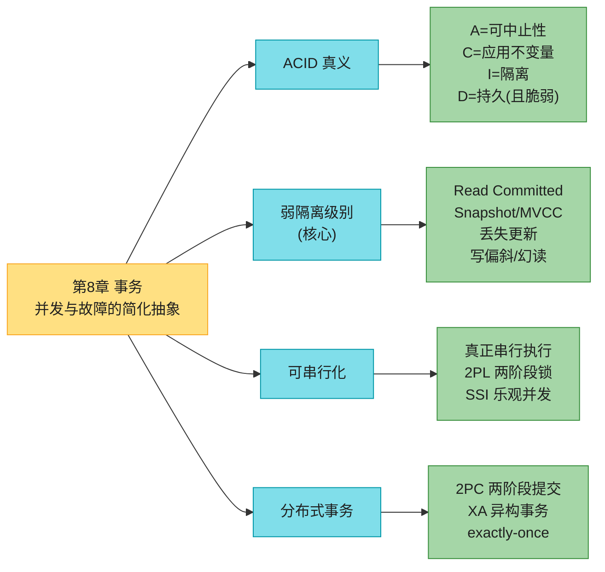

---

## 1. 事务究竟是什么 & ACID 的真正含义

事务把多个读写组织成逻辑单元。概念上，事务内的所有读写像一次操作一样执行：要么全成功（提交 commit），要么全失败（中止 abort / 回滚 rollback），失败可安全重试。有了事务，应用不用再操心"部分失败"（某些操作成功某些失败），错误处理简单得多。

> 💡 **事务不是自然规律**，是被有目的地创造出来简化编程模型的。它让应用可以忽略某些潜在错误场景和并发问题——数据库替你处理（这叫**安全保证 safety guarantees**）。
>
> 🏭 **真实教训**：英国 **Post Office Horizon 丑闻**（[[ch02]]提过）——底层会计系统很可能就是因为**缺少 ACID 事务**，导致账目错乱，数百名邮政局长被冤枉贪污、入狱。事务缺失不是小事。

### 1.1 ACID 四个字母（名字一样，含义各不同）

事务的安全保证常用 **ACID**（原子性、一致性、隔离性、持久性）概括，1983 年 Härder & Reuter 提出 [9]。但**各库的"ACID"实现并不等同**——尤其"隔离性"含义模糊 [10]。如今"ACID 兼容"基本成了营销词。逐个拆解：

#### A — Atomicity（原子性，更准确说是 Abortability 可中止性）

> 📝 **名词注释：atomic 的两种含义（极易混！）**
> - **多线程编程**里的 atomic：一个线程执行原子操作时，别的线程**看不到做了一半的中间结果**——状态要么是操作前、要么是操作后。
> - **ACID 的 atomicity**：**和并发无关**（并发是 I 隔离性管的事）。它描述的是：客户端要做若干写，**中途出故障**（进程崩、网络断、磁盘满、约束违反）会怎样。若这些写打包成原子事务且无法完成，事务**中止，已做的写全部回滚**。

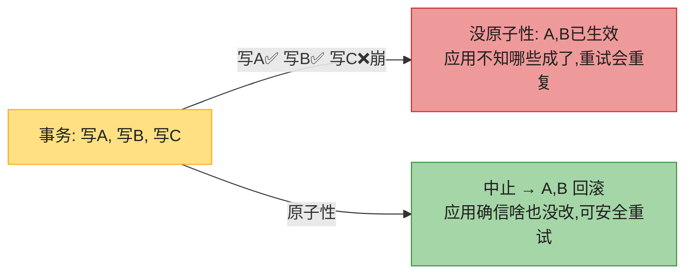

**核心**：能在出错时中止事务并丢弃其所有写。**abortability（可中止性）其实是比 atomicity 更准的词**，但约定俗成用 atomicity。

#### C — Consistency（一致性，其实是应用层概念）

> 📝 **名词注释：consistency 至少 5 个意思（最被滥用的词）**
> 1. **副本一致性**（第6章）：异步复制的最终一致。
> 2. **一致快照**：某时刻整个库的快照（与 happens-before 一致）。
> 3. **一致性哈希**（第7章）：分片再平衡算法。
> 4. **CAP 的 C**（第10章）：= 线性一致性。
> 5. **ACID 的 C**：**应用特定的"好状态"**——不变量（invariants）永远成立。

ACID 一致性的理念：你对数据有某些**不变量**必须恒成立（如会计系统借贷必平衡）。事务从不违反不变量的状态开始，事务内的写又保持有效性，那么不变量恒满足。（事务执行中可临时违反，但提交时应恢复。）

**关键认知**：复杂不变量库通常建模不了（外键/唯一/check 约束能建模简单的），得**应用自己保证事务正确**。你写了违反不变量的脏数据又没声明该不变量，库拦不住你。**所以 C 往往取决于应用怎么用库，不是库本身的属性。**

#### I — Isolation（隔离性）

多数库被多个客户端同时访问。读写的部分不重叠没问题，但访问**同一记录**就会并发竞态。

#### 深入：并发计数器竞态（Figure 8-1）——一切并发问题的起点

两个客户端同时给一个计数器 +1（假设库没有内置自增）。每个客户端：读当前值 → +1 → 写回。

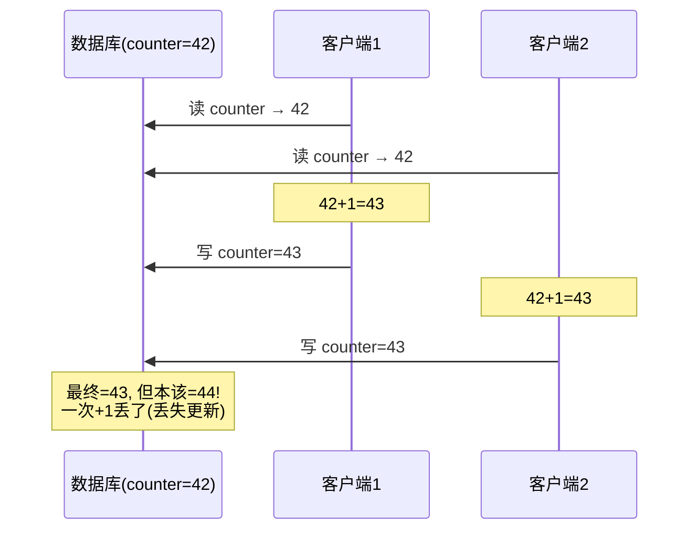

两个 +1，本应 42→44，实际只到 43——**一次增量丢了**。这就是**丢失更新（lost update）**，本章 §3.4 详谈。

**隔离性的承诺**：并发执行的事务互相隔离，互不踩脚。教科书把隔离形式化为**可串行化（serializability）**——每个事务可假装"整个库只有我在跑"。库保证：事务提交后的结果，**等同于它们串行执行（一个接一个）的结果**，哪怕实际是并发跑的 [13]。


> ⚠️ **可串行化有性能代价**。实践中很多库用**比可串行化更弱**的隔离（允许并发事务以有限方式互相干扰）。**Oracle 的"serializable"隔离级别其实实现的是快照隔离（比可串行化弱）**[10,14]——这就是为什么"ACID"是营销词。

#### D — Durability（持久性，且比你想的脆弱）

事务一旦提交，写的数据就**不会丢**，哪怕硬件故障/库崩溃。

> 📝 **名词注释：持久性的实现随时代变**
> - **单机库**：数据写到非易失存储（硬盘/SSD）。普通文件写通常先缓冲在内存、稍后落盘（断电可能丢），所以库用 **fsync** 系统调用强制落盘 + **预写日志 WAL**（[[ch04]]）崩溃恢复 + **校验和**检测损坏日志。
> - **复制库**：数据成功**复制到若干节点**才算持久。库须等这些写/复制完成才报告"提交成功"。

#### 深入：持久性没有完美的（fsync/SSD 的残酷真相）

[[ch02]]讲过"完美持久性不存在"。这章给了更扎心的细节：

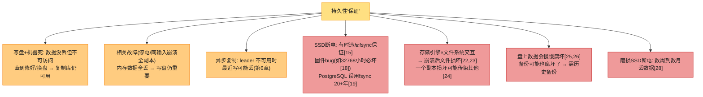

**结论**：没有任何单一技术能提供绝对保证。只有各种**风险降低技术**（写盘、远程复制、备份）**组合使用**。对任何理论"保证"保持健康怀疑。

---

## 2. 单对象 vs 多对象操作

### 2.1 单对象写也有原子性和隔离

ACID 的原子性和隔离假设你想一次改多个对象。但即便改**单个对象**（如写一个 20KB JSON 文档），也要保证：
- 网络传了 10KB 断了 → 不该存 10KB 半截 JSON。
- 写到一半断电 → 不该新旧值拼接。
- 别的客户端读到写一半的值 → 不该看到部分更新。

存储引擎**几乎都**在单对象（如一个 KV 对）层面提供原子性和隔离：原子性靠**日志**崩溃恢复，隔离靠**每个对象一把锁**（同时只允许一个线程访问）。

> 📝 **名词注释：原子写 / 条件写 (CAS)**
> - **原子写操作**：如自增 `value = value + 1`，免去 read-modify-write 循环。
> - **条件写 (compare-and-set, CAS)**：仅当值未被别人并发改过才允许写（[[ch05]]讲过）。类似 CPU 的 compare-and-swap 指令。
>
> ⚠️ 注意："原子自增"的 atomic 是**多线程编程**含义（非 ACID）。严格说 ACID 里该叫"隔离/可串行化自增"。这些单对象操作能防丢失更新，但**不是通常意义上的"事务"**。如 Cassandra/ScyllaDB 的"轻量事务"只给单对象的线性一致读和条件写，**跨对象无保证**。

### 2.2 为什么需要多对象事务？

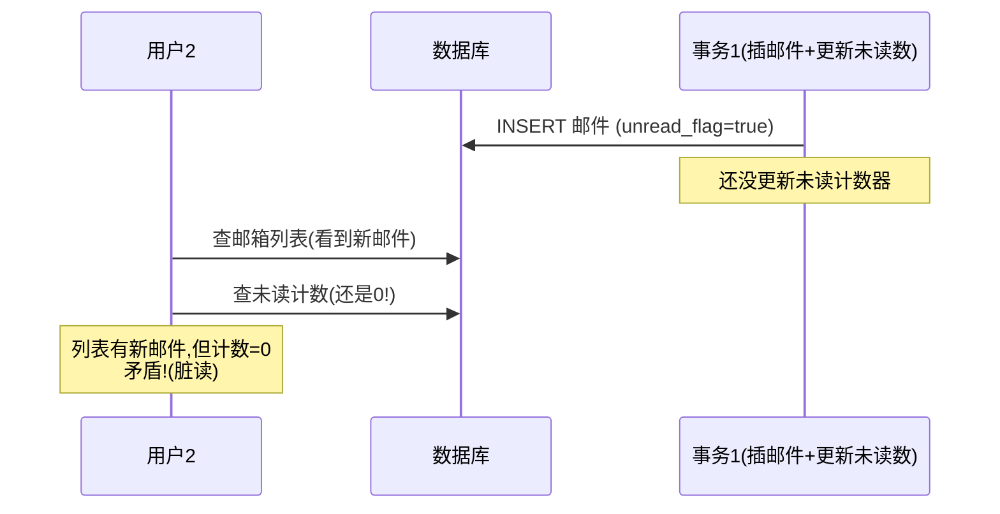

邮件应用把未读计数冗余存一个字段（反范式）。新邮件来了要**同时插邮件 + 计数+1**。Figure 8-2：用户2看到列表有新邮件、但计数还是 0——隔离性本可避免（要么都看到、要么都不见）。原子性保证：计数更新失败则邮件插入也回滚（Figure 8-3）。

**需要协调多个对象的常见场景**：
- **关系模型**：外键引用要随插入保持有效。
- **文档模型反范式**：冗余字段要同步更新。
- **二级索引**：改值时索引也要更新（否则记录可能"出现在一个索引却不在另一个"，[[ch07]]讲过分片二级索引）。

多对象事务需要办法判定哪些读写属同一事务。关系库靠**客户端 TCP 连接**：一条连接上 `BEGIN` 到 `COMMIT` 之间的一切算同一事务；连接断了事务中止。**很多非关系库没这种分组机制**——即便有 multi-put 操作，也可能部分 key 成功部分失败，留下半更新状态。

### 2.3 错误处理与重试（重试不是万能的）

事务的关键特性：出错可**中止并安全重试**。ACID 库的哲学：宁可整个放弃事务，也不让它半死不活。**但无主复制的库（第6章）走"尽力而为"路线**——出错不撤销已做的，留给应用自己恢复。

#### 深入：重试中止事务的 5 个陷阱

重试简单有效，但不完美：

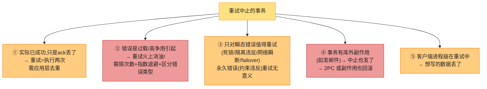

> 🏭 **ORM 框架的坑**：Rails ActiveRecord、Django 等 ORM **不重试**中止的事务——错误通常冒泡成异常、用户输入全扔、用户看到报错。这很可惜，因为**回滚的全部意义就是支持安全重试**。

---

## 3. 弱隔离级别（本章核心）

两个事务不碰同一数据、或都是只读 → 可安全并行。并发问题（竞态）只在**一个事务读的数据正被另一个改**、或**两个事务改同一数据**时出现。

> 📝 **为什么并发 bug 这么难搞**
> 测试很难发现——只在运气不好的时序才触发，罕见且难复现。大型应用里你未必知道还有哪些代码在并发访问库。研究者几十年的答案很简单：**用可串行化隔离！** 但可串行化有性能代价，很多库不愿付 [10]，于是普遍用**更弱的隔离**——防住部分问题但不全。这些弱级别**比可串行化难懂得多**，却到处在用 [30]。

> 🏧 **并发 bug 造成的真实损失**：让一个比特币交易所破产 [31-34]（Flexcoin）、引发金融审计 [35]、腐蚀客户数据 [36]。常见反驳"处理金融数据用 ACID 库就行"——**错过要点**：很多流行的关系库（算 ACID）也用弱隔离，未必防得住这些 bug。
>
> 🏭 **更阴险**：攻击者可**故意**往你的 API 发高并发请求，**利用并发 bug** [32]。所以并发 bug 必须系统性预防。

#### 深入：Flexcoin 比特币交易所破产——真实竞态代码

2014 年加拿大比特币交易所 **Flexcoin 因一个并发竞态被盗走 896 BTC 后破产** [31,34]。根因就是弱隔离下的丢失更新。简化版的漏洞代码：

```python
# ❌ Flexcoin 式转账漏洞(Ruby 伪代码, 真实事件同构)
def transfer(from_id, to_id, amount):
    from_acct = Account.find(from_id)        # 读: 余额 100
    to_acct   = Account.find(to_id)          # 读: 余额 0
    if from_acct.balance >= amount:           # 检查: 100 >= 50 ✅
        from_acct.balance -= amount           # 100-50=50
        to_acct.balance   += amount           # 0+50=50
        from_acct.save                       # 写 50
        to_acct.save                         # 写 50

# 攻击者并发发起两次 transfer(A→B, 50):
#   线程1: 读A=100, 读B=0, 算A=50,B=50, 存
#   线程2: 读A=100, 读B=0, 算A=50,B=50, 存  (读到的是旧A=100!)
# 结果: A 只扣了 50(本该扣100), B 得到 50(本该两次共100)
#       50 BTC 凭空多出来 = 被盗
```

**漏洞**：经典的 read-modify-write + 无隔离。两次并发转账都读到**旧余额**，各自算各自写，一次扣款被覆盖。

**修复**（任何一种）：
```ruby
# ✅ 方案1: 原子写 + 条件
Account.where(id: from_id, balance: amount..)
       .update_all("balance = balance - #{amount}")
Account.where(id: to_id).update_all("balance = balance + #{amount}")

# ✅ 方案2: SERIALIZABLE 隔离(PG SSI 自动检测)
Account.transaction(isolation: :serializable) do ... end

# ✅ 方案3: SELECT ... FOR UPDATE
acct = Account.find(from_id).lock!('FOR UPDATE')  # 锁行
```

> 🏧 **教训**：① **别假设"ACID 库"就安全**——默认 Read Committed 防不住这个；② 涉及钱的操作**永远用原子写或更高隔离**；③ 攻击者会**主动**并发探测这类漏洞（ACIDRain 论文 [32] 演示了自动化攻击）。

### 3.1 隔离级别全景 + 异常总矩阵


**Table 8-1（扩展版）——隔离级别 vs 并发异常矩阵**（背下来！）：

| 隔离级别 | 脏读 | 脏写 | 读偏斜(不可重复读) | 幻读 | 丢失更新 | 写偏斜 |
|---------|:---:|:---:|:---:|:---:|:---:|:---:|
| **Read Uncommitted** | ❌可能 | ✓防 | ❌ | ❌ | ❌ | ❌ |
| **Read Committed** | ✓防 | ✓防 | ❌可能 | ❌ | ❌ | ❌ |
| **Snapshot Isolation** | ✓防 | ✓防 | ✓防 | ✓防(只读) | ⚠️视实现 | ❌ |
| **Serializable** | ✓防 | ✓防 | ✓防 | ✓防 | ✓防 | ✓防 |

> 📝 **命名地狱**：SQL 标准基于 1975 System R [3]，那时快照隔离还没发明，标准只有"repeatable read"。结果：
> - **PostgreSQL** 把快照隔离叫 **"repeatable read"**（满足标准最低要求就敢叫）。
> - **Oracle** 把快照隔离叫 **"serializable"**（名不副实！）。
> - **MySQL** 的 "repeatable read" 是比快照隔离**更弱**的 MVCC [43]，且**不检测丢失更新**。
> - **Db2** 的 "repeatable read" = 可串行化 [10]。
>
> **没人真正知道"repeatable read"到底什么意思** [38,39,40]。所以别迷信名字，要看具体保证。

下面逐个级别 + 异常展开，**每个都配时序图**。

### 3.2 Read Committed（最基础的隔离）

两条保证：
1. **读**：只看到**已提交**的数据（**无脏读 no dirty reads**）。
2. **写**：只**覆盖已提交**的数据（**无脏写 no dirty writes**）。

#### 深入：脏读 + 脏写（Figure 8-4 / 8-5 时序图）

**脏读 (dirty read)**：事务 A 写了数据但还没提交/中止，事务 B 却看到了 A 的未提交数据。

```mermaid
sequenceDiagram
    participant U1 as 用户1(事务A)
    participant DB as 数据库(x=2)
    participant U2 as 用户2(事务B)
    U1->>DB: BEGIN; SET x=3 (未提交)
    U2->>DB: BEGIN; GET x
    Note over DB: Read Committed: 返回旧值 2(不返3)
    U2-->>U2: 看到 x=2 ✅(无脏读)
    U1->>DB: COMMIT (x=3生效)
    U2->>DB: GET x → 3 (现在才看到新值)
```

**为什么防脏读重要**：① 事务要改多行时，脏读会让别人看到"改了一半"；② 事务若中止，脏读到的数据会被回滚——读到"从未真正提交"的数据，读过这数据的也得中止（**级联中止 cascading aborts**）。

**脏写 (dirty write)**：事务 B 覆盖了事务 A **还没提交**的写。Figure 8-5 的二手车祸——Aaliyah 和 Bryce 同时买同一辆车，买车要写两处（listing 标买家 + 发票给买家）：

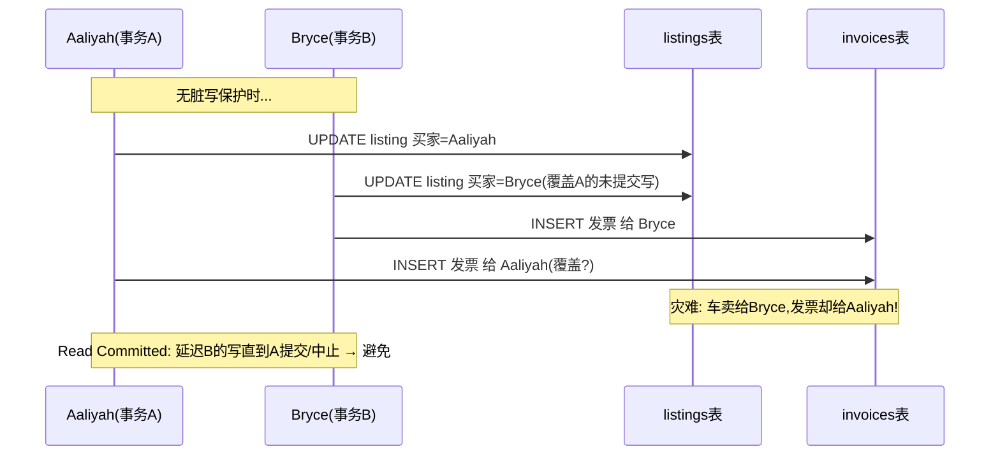

Read Committed 防脏写（延迟第二个写直到第一个事务提交/中止），但**防不了 Figure 8-1 的计数器竞态**（第二次写在第一次提交后才发生，不是脏写，但仍错——丢失更新，§3.4）。

#### Read Committed 怎么实现

> 📝 **防脏写**：**行级锁**。事务要改某行须先获该行锁，持有到提交/中止；别人想写同行须等。Read Committed（及更强级别）都自动这么做。

> 📝 **防脏读两种方式**：
> - **读也加锁**（IBM Db2、SQL Server `read_committed_snapshot=off` [30]）：读前短暂获锁、读完即释。**问题**：一个长写事务会逼很多只读事务等，伤响应时间，连锁拖垮应用别处。
> - **保留旧值**（**主流方式**，Figure 8-4）：每行被写时，库**同时记住旧提交值和新值**。写事务进行中，别的读事务拿到**旧值**；新值提交后才切到新值。这就是 **MVCC（多版本并发控制）** 的雏形，§3.3 详谈。

> 📝 **名词注释：Read Uncommitted（更弱）**
> 防**脏写**但不防**脏读**——直接返最新写的值，哪怕写事务没提交。性能更好（不用存两版本），也能降低（但不防）丢失更新概率。

### 3.3 Snapshot Isolation 与 MVCC（Repeatable Read）

Read Committed 看似够用（可中止、防脏读、防脏写），但仍有并发 bug。

#### 深入：读偏斜 / 不可重复读（Figure 8-6 消失的 100 块）

Aaliyah 有 1000 美元储蓄，分两个账户各 500。一个事务从账户1转 100 到账户2。她若不幸在转账进行中查余额，可能看到"账户1还没收到钱（500）+ 账户2已扣款（400）= 900"——**100 块凭空消失**！

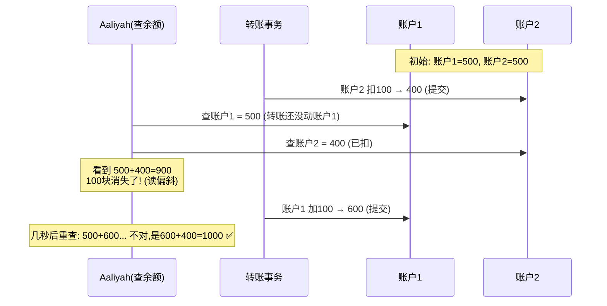

这叫**读偏斜 (read skew)**，是**不可重复读 (nonrepeatable read)** 的例子：Aaliyah 若事务末再读账户1，会看到 600（不同于之前的查询值）。**Read Committed 认为这可接受**——她读到的余额当时确实已提交。但有些场景**绝不能容忍**：

| 场景 | 为什么不能容忍临时不一致 |
|------|----------------------|
| **备份** | 大库备份要几小时，期间持续有写。备份里部分新部分旧 → 从备份恢复时"消失的钱"成**永久**的。 |
| **分析查询/完整性检查** | 扫大库的分析/监控查询，若观察到不同时刻的库状态，会返回**无意义**结果。 |

#### 快照隔离 (Snapshot Isolation) + MVCC

**快照隔离**：每个事务从库的**一致快照**读——看到事务开始时已提交的所有数据。即使之后被别的事务改了，每个事务只看到那个时刻的旧数据。**长跑只读查询（备份、分析）的福音**：数据冻结在某一刻，比"数据边查边变"好懂太多。

> 🏭 **谁用快照隔离**：PostgreSQL、MySQL InnoDB、Oracle、SQL Server 等都支持（细节各异 [30,42,43]）。**Oracle、TiDB、Aurora DSQL 甚至把它当最高隔离级别**。云数仓（BigQuery）也常用，给分析查询时间点视图。

#### 深入：MVCC 可见性规则手算（PostgreSQL 实现）

快照隔离靠 **MVCC（多版本并发控制）**：不止两版本（旧提交+被覆盖未提交），而是**多个提交版本**并存——各进行中的事务可能需要看不同时刻的库状态。

PostgreSQL 实现（Figure 8-7 [42,44,45]，其他类似）：
- 事务开始时拿一个**唯一递增的事务 ID (txid)**。
- 事务的每次写都**打上写者的 txid**。
- 每行有 `inserted_by`（插入它的 txid）和 `deleted_by`（初始空；删除时设为请求删除的 txid，**不真删**）。GC 确认无事务再访问时才清。
- **更新 = 删旧 + 插新**。

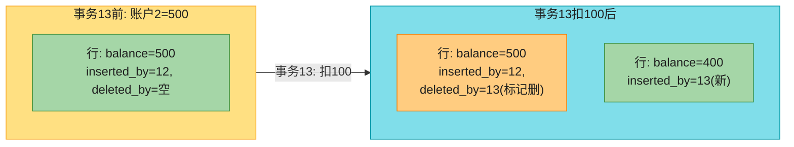

**可见性规则**（核心，决定一个事务能看到哪些版本）[45]：
1. 事务开始时，列出此刻**所有进行中（未提交）的事务**。这些事务的写**忽略**（哪怕它们后来提交了）——保证快照不被别的事务提交影响。
2. **txid 比当前事务大**（开始得更晚）的事务的写，**忽略**（不管提没提交）。
3. **已中止**事务的写，**忽略**。
4. **其余**写都可见。

**换个说法**，一行对某读事务可见 ⟺：
- 读事务开始时，**插入这行的事务已提交**；且
- 这行**未被标记删除**，或删除它的事务在读事务开始时**还没提交**。

> **手算（Figure 8-7）**：事务12 读账户2 → 看到 500。为什么？账户2 的 500 被**事务13 标记删除**（规则2：事务12 看不到事务13 的删除），而新的 400 是事务13 插的（规则2：事务12 看不到）→ 所以事务12 仍看到 500。事务13 提交后，新事务才会看到 400。

#### 深入：MVCC 多事务可见性完整推演（4 个事务交叉）

假设有 4 个事务交错执行，txid 分别 100/101/102/103，操作账户表 `accounts(id, balance)`，初始 `id=1, balance=100`（由事务 50 插入并早已提交）：

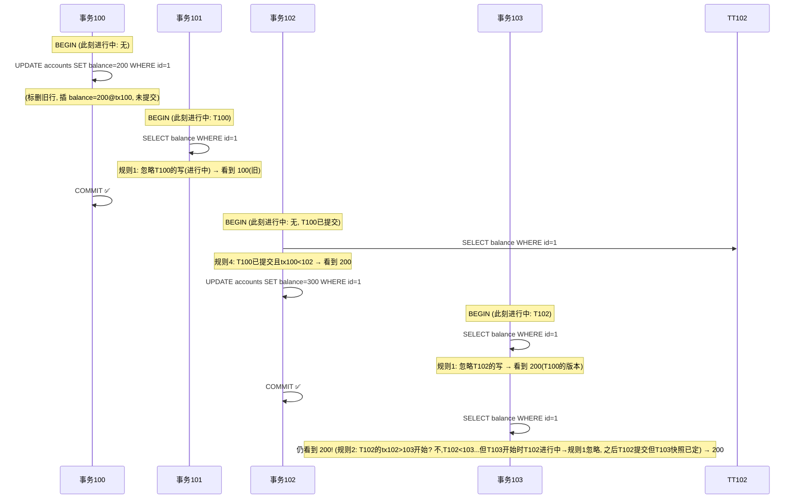

**关键洞察**：
- **T101 看到 100**（事务100 提交前开始，规则1 忽略未提交写）——这就是**读偏斜/不可重复读**的根源：同事务内若 T101 后续再读，仍是 100（快照固定），所以 PG 的 REPEATABLE READ 不会看到变化。
- **T102 看到 200**（事务100 提交后开始）——新事务看到最新提交。
- **T103 看到 200 而非 300**（开始时 T102 进行中 → 快照锁定，忽略 T102；T102 后续提交也不影响 T103 的快照）——**这就是"读者不阻塞写者、写者不阻塞读者"**：T102 能提交，T103 能读旧版本，互不干扰。

> 🏧 **可见性判断口诀（PostgreSQL）**：一行版本对事务 T 可见 ⟺ `xmin`（插入者）已提交且 `xmin < T的快照上限` 且不在 T 的进行中列表，且（`xmax`（删除者）为空 或 `xmax` 未提交 或 `xmax ≥ T的快照上限`）。记住这个，MVCC 就通了。

#### 深入：MVCC 的代价——表/索引膨胀与 vacuum

多版本并存不是免费的：

| 代价 | 说明 | 缓解 |
|------|------|------|
| **空间膨胀** | 每次更新都新增版本，旧版本要等无事务可见才清 | 后台 **vacuum**（PG）/compaction 回收 |
| **长事务危害** | 一个长事务持有旧快照 → 它能见的旧版本都不能清 → 膨胀累积 | **严禁长事务**；监控 `pg_stat_activity` 的长查询 |
| **事务 ID 回卷** | PG txid 是 32 位（~42 亿），用完会回卷导致数据可见性错乱 | **autovacuum** 必须 开，定期"冻结"老行 [44] |
| **索引膨胀** | 每个版本可能占索引项 | HOT update（同页更新免索引更新）[42]；定期 reindex |

> 🏧 **生产铁律**：① autovacuum 永远开着、参数调好；② 监控长事务（>1 分钟告警）；③ 监控表/索引膨胀率；④ 高更新表考虑分区便于单独 vacuum/reindex。**MVCC 的"读者不阻塞写者"是用空间换的，运维要还这笔债。**

> 📝 **名词注释：快照隔离的关键原则——读者不阻塞写者，写者不阻塞读者 (readers never block writers, writers never block readers)**。这让库能一边在一致快照上跑长读查询、一边正常处理写，两者无锁竞争。这是快照隔离相对 2PL 的核心优势。

#### 索引与 MVCC + 不可变 B-tree

多版本库里索引怎么搞？常见：每个索引项指向某行的一个版本，版本间链表相连，查询用索引时要遍历版本找可见且匹配的。GC 清旧版本时连索引项一起清。

> 🏭 **PostgreSQL 优化**：同页多版本可避免索引更新 [42]。有的库只存版本差异省空间。
>
> 🏭 **不可变 B-tree（copy-on-write）**：**CouchDB、Datomic、LMDB** 用不可变 B-tree——更新时不覆盖页，而是**复制每个改动的页**（父页直到根都复制指向新子页）。每次写事务创建**新 B-tree 根** = 该时刻的一致快照。无需按 txid 过滤（后续写改不了已存在的 B-tree，只能造新根）。

### 3.4 丢失更新问题 (Lost Updates) + 五种方案

最出名的写-写冲突。**read-modify-write 循环**（读值→改→写回）若两个事务并发做，一个修改会丢：

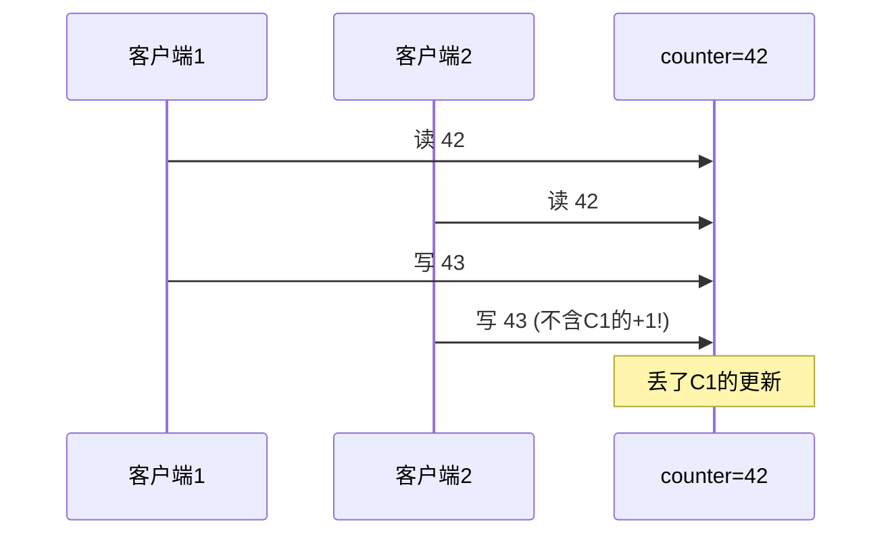

**常见场景**：计数器/余额自增、JSON 文档局部改（解析→改→写回）、两人同编 wiki 页（整页覆盖）。五种解法 [50]：

#### 方案 1：原子写操作 ⭐推荐

库提供原子更新，免去 read-modify-write。**多数关系库**下并发安全：

```sql
UPDATE counters SET value = value + 1 WHERE key = 'foo';
```

MongoDB 提供 JSON 文档局部改的原子操作；Redis 提供优先队列等结构的原子操作。**实现**：读时**独占锁**该对象，或强制所有原子操作在**单线程**执行。

> ⚠️ **ORM 框架的坑**：ORM 容易让你无意中写出**不安全的 read-modify-write**，而没用库的原子操作 [51,52,53]——隐蔽且难测的 bug 源头。

#### 方案 2：显式锁 (SELECT ... FOR UPDATE)

库的原子操作不够用时，应用**显式锁**要更新的对象，再做 read-modify-write。别人并发更新或锁同行须等。

```sql
BEGIN TRANSACTION;
SELECT * FROM figures
  WHERE name = 'robot' AND game_id = 222
  FOR UPDATE;          -- 锁住返回的所有行
-- 检查移动是否合规, 再更新
UPDATE figures SET position = 'c4' WHERE id = 1234;
COMMIT;
```

> 📝 **名词注释：FOR UPDATE**：告诉库锁住该查询返回的所有行。**风险**：多对象锁易**死锁**（两事务互相等对方释放锁）——库自动检测死锁、中止其一，应用重试。

#### 方案 3：自动检测丢失更新

不强制串行，而是**允许并行**，事务管理器检测到丢失更新就**中止并重试**。优势：可与快照隔离高效结合。**PostgreSQL repeatable read、Oracle serializable、SQL Server snapshot 都自动检测**；**MySQL InnoDB repeatable read 不检测** [30,43]（有人说这不够格叫快照隔离）。**优势**：不依赖应用用特殊特性，忘加锁/原子操作也自动防护。

#### 方案 4：条件写 (CAS / 乐观锁)

库不支持事务时，用条件写——仅当值未被并发改过才更新（CAS）：

```sql
-- wiki 页防并发覆盖: 仅当内容仍是旧的才更新
UPDATE wiki_pages SET content = 'new content'
  WHERE id = 1234 AND content = 'old content';
-- 若内容已变, 更新0行 → 重试
```

或用**版本号列**（每次更新自增，仅当版本号没变才更新）= **乐观锁 (optimistic locking)** [54]。

> ⚠️ **MVCC 可见性的例外**：MVCC 下别的事务的并发写对快照不可见，但很多库对 UPDATE/DELETE 的 WHERE 子句**破例**能看到别的事务的写，否则 CAS 失效。

#### 方案 5：多副本库中处理（CRDT / LWW）

锁和 CAS 假设**单一最新副本**。多主/无主复制库允许多节点并发写、异步复制，**没法保证单一最新副本** → 锁/CAS 不适用。改用：
- **CRDT**（[[ch06]]）：可交换操作（如计数器自增、集合加元素）合并不丢。
- **LWW**（最后写胜）：**默认会丢更新**（[[ch06]]讲过），慎用。

#### 五方案对比表

| 方案 | 原理 | 适用 | 缺点 |
|------|------|------|------|
| **原子写** | 库内置单对象原子操作 | 自增/局部改 | 表达力有限 |
| **FOR UPDATE** | 显式行锁 | 复杂 read-modify-write | 易死锁、易忘加锁 |
| **自动检测** | 快照隔离内置检测 | PG/Oracle/SQLServer | MySQL 无；需重试 |
| **CAS/乐观锁** | 条件写/版本号 | 无事务库、wiki | MVCC 可见性例外；高争用重试多 |
| **CRDT** | 可交换合并 | 多主/无主复制库 | 仅可交换操作；LWW 会丢 |

### 3.5 写偏斜与幻读 (Write Skew & Phantoms) ——比丢失更新更隐蔽

#### 深入：写偏斜经典案例——医生值班 🏥（Figure 8-8）

医院要求任何时刻**至少一名医生值班**。Aaliyah 和 Bryce 是某班次的两个值班医生，都病了，**同时**点"下线"。每个事务先查"当前≥2人值班"→ 是 → 安全下线。

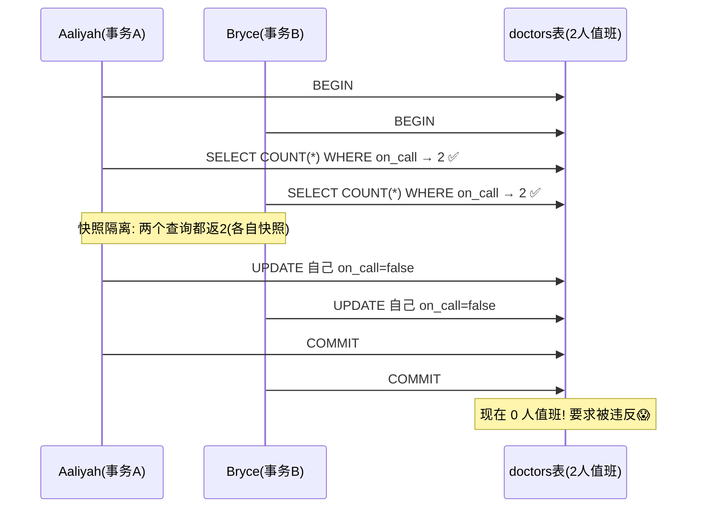

**写偏斜 (write skew)** [38]：既非脏写也非丢失更新（两事务改的是**不同对象**——各自的值班记录）。冲突不明显，但**确实是竞态**：若串行执行，第二个医生本会被阻止。

#### 写偏斜的通用模式


**更多写偏斜例子**：
- **会议室预订**（Example 8-2）：先查冲突预订→没有→插入。快照隔离**防不住**并发插入冲突会议。需可串行化。
- **多人游戏**：FOR UPDATE 防了两人移同一棋子（丢失更新），但**防不了**两人把不同棋子移到同一位置（写偏斜）。
- **抢用户名**：先查名是否被占→没占→建账号。快照隔离不安全，但**唯一约束**能解（第二个违反约束被中止）。
- **防双花**：插入消费项→列出账户所有项→检查和>0。两个消费项并发插入，合起来让余额为负，各自都没察觉。

#### 写偏斜怎么治（选择比丢失更新少）

| 手段 | 是否有效 |
|------|---------|
| 原子单对象操作 | ❌（涉及多对象） |
| 快照隔离的自动丢失更新检测 | ❌（PG/MySQL/Oracle/SQLServer 都不自动检测写偏斜 [30]）→ **需真正可串行化** |
| 约束（唯一/外键/check） | ⚠️大多库不支持"多对象约束"，可用触发器/物化视图模拟 [12] |
| **FOR UPDATE 锁住依赖的行** | ✅（医生例可用，见下） |

医生例的 FOR UPDATE 写法：
```sql
BEGIN TRANSACTION;
SELECT * FROM doctors
  WHERE on_call = true AND shift_id = 1234
  FOR UPDATE;             -- 锁住所有当班医生行!
UPDATE doctors SET on_call = false
  WHERE name = 'Aaliyah' AND shift_id = 1234;
COMMIT;
```

#### 幻读 (Phantom) 与物化冲突

**幻读 (phantom)** [4]：一个事务的写**改变了另一个事务查询的结果**。快照隔离在**只读**查询里避免幻读，但在上面这种读-写事务里，幻读会导致棘手的写偏斜。

**麻烦**：医生例中③改的是①查到的行 → 能 `FOR UPDATE` 锁。但会议室/用户名/双花例是"**查不存在的行**，写时**插入匹配行**"——①没返回行，`FOR UPDATE` **没东西可锁** [58]！

> 📝 **名词注释：物化冲突 (materializing conflicts)**
> 没对象可锁？**人为造一个锁对象**。会议室例：建一张"时段×房间"表，每个房间每 15 分钟一行（预生成未来 6 个月）。预订时 `FOR UPDATE` 锁对应房间+时段的行，再查冲突+插入预订。这表**不存预订信息，纯当锁集合**。把幻读变成"具体行的锁冲突" [14]。
>
> **缺点**：想清楚怎么物化很难且易错，让并发控制机制**泄漏进数据模型**很丑。**当最后手段**，多数情况还是用可串行化隔离更好。

#### 深入：会议室双重预订实战（各隔离级别逐个失效演示）

会议室预订是写偏斜/幻读最经典的例子，也是高频面试题。看各隔离级别逐个失效：

```sql
-- bookings 表: room_id, start_time, end_time, user_id
-- 约束: 同一 room 同时段不能有两个预订(应用层规则, 非库约束)
```

```mermaid
sequenceDiagram
    participant U1 as 用户1(订12-13点)
    participant U2 as 用户2(订12-13点)
    participant DB as bookings表
    Note over U1,U2: 任意弱隔离下...
    U1->>DB: BEGIN; SELECT 查冲突 → 0(无冲突)
    U2->>DB: BEGIN; SELECT 查冲突 → 0(无冲突)
    Note over U1,U2: 两个SELECT都没看到对方(对方还没插)
    U1->>DB: INSERT 预订(12-13点)
    U2->>DB: INSERT 预订(12-13点)
    U1->>DB: COMMIT ✅
    U2->>DB: COMMIT ✅
    Note over DB: 同房间同时段两个预订! 双重预订😱
```

**为什么每个级别都防不住**：
| 隔离级别 | 为什么失效 |
|---------|----------|
| Read Uncommitted / Read Committed | SELECT 时对方还没插，看到 0 → 都插 |
| Snapshot Isolation（快照隔离） | 两个事务的快照里都没有冲突预订 → 都插；**幻读型写偏斜，SI 防不住** |
| FOR UPDATE | SELECT 返回 0 行 → **没行可锁**（幻读的本质） |

**正确解法（任一）**：
```sql
-- ✅ 解法1: SERIALIZABLE(SSI) - 推荐, 最简单
BEGIN ISOLATION LEVEL SERIALIZABLE;
SELECT COUNT(*) FROM bookings WHERE room_id=123
  AND end_time > '12:00' AND start_time < '13:00';
-- 若0则插入
INSERT INTO bookings(...) VALUES(...);
COMMIT;  -- 并发时一个会报序列化冲突 → 重试

-- ✅ 解法2: 唯一约束 + 排他键(把房间+时段变成唯一)
-- 用 room_id + time_slot 做唯一键, 第二个插入直接违反约束被拒
INSERT INTO bookings(room_id, time_slot, ...) VALUES(123, '2026-01-01-12', ...);
-- 第二个并发插入 → 唯一约束冲突 → 自动失败

-- ✅ 解法3: 物化冲突(锁 room+slot 的预生成行)
BEGIN;
SELECT * FROM room_slots WHERE room_id=123 AND slot='2026-01-01-12' FOR UPDATE;
-- 查冲突 + 插入
COMMIT;

-- ✅ 解法4: 应用层分布式锁(Redis Redlock 锁 room+slot)
```

> 🏧 **生产首选**：能用**唯一约束**就用（解法2，最简单可靠，库原生强制）；业务规则复杂（如"重叠时段"非精确匹配）才上 SERIALIZABLE 或物化冲突。**永远别指望 Read Committed/快照隔离能防住这类"查不存在再插入"的并发**。

#### 深入：各库 MVCC 实现差异（PG / MySQL / Oracle）

MVCC 是快照隔离的基石，但各库实现细节差异大，影响性能和行为：

| 维度 | PostgreSQL | MySQL/InnoDB | Oracle | Datomic/LMDB |
|------|-----------|--------------|--------|--------------|
| **旧版本存哪** | 同一 heap 表（多版本链表） | **undo log**（回滚段） | undo 表空间 | **不可变 B-tree**（copy-on-write） |
| **更新** | 标删旧行 + 插新行 | **原地更新** + undo log 存旧值 | 原地更新 + undo | 复制修改页到新 B-tree 根 |
| **读旧版本** | 从堆里找可见版本 | 用 undo log **重构**旧版本 | 用 undo 重构 | 直接读对应 B-tree 根（=快照） |
| **回收** | vacuum 扫表清死版本 | purge 清 undo | 自动清 undo | 后台 compaction |
| **索引** | 每版本可能占索引项（HOT 优化） | 聚簇索引（主键）原地改，二级索引存主键值 | — | 不可变，写时复制 |
| **优势** | 实现清晰，旧版本直接在表里 | 写放大小（undo 紧凑） | 成熟 | 快照极快（根指针），无 txid 过滤 |
| **劣势** | 表膨胀，vacuum 重 | 重构旧版本可能慢（长 undo 链） | undo 管理复杂 | 写放大大（复制整页） |

> 🏧 **关键差异**：PG 把多版本**塞回原表**（膨胀表，靠 vacuum 清）；MySQL 把旧版本放 **undo log**（表不膨胀，但读旧版要回放 undo 链）。**长事务在两者都危险**：PG 让表膨胀难清，MySQL 让 undo 链变长拖慢读。**Datomic/LMDB 的不可变 B-tree** 最优雅——每个 B-tree 根就是一个快照，读旧版无需过滤，但写放大大。
>
> **运维启示**：理解你用的库的 MVCC 实现，才知道该监控什么（PG 监控膨胀/vacuum，MySQL 监控 undo/历史链长度）。

---

## 4. 可串行化 (Serializability)

隔离级别难懂且各库实现不一、看代码难判断是否安全、无好工具检测竞态——这破事从 1970s 就有 [3]。研究者答案一致：**用可串行化隔离！** 可串行化是最强隔离：保证事务虽并行执行，最终结果等同于**串行执行**，从而**防住所有竞态**。

既然这么好，为啥不都用？看实现和性能。今天提供可串行化的库大多用**三种技术之一**：

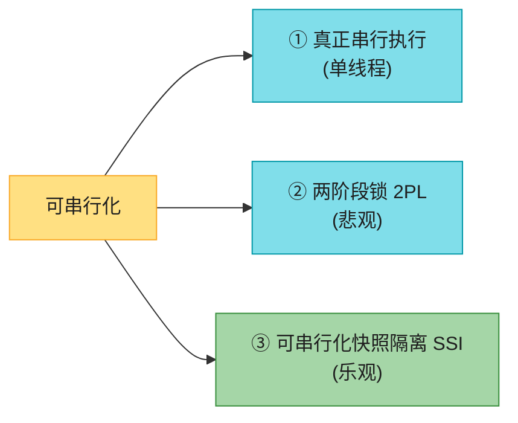

### 4.1 真正串行执行 (Actual Serial Execution)

最简单：**去掉并发**——单线程、串行、一次一个事务。隔离天然可串行化。

> 💡 **为何 2000s 才可行**（前 30 年都靠多线程）？两大变化：
> 1. **RAM 便宜**到能装下整个活跃数据集——事务全在内存跑，不用等磁盘。
> 2. **OLTP 事务通常短、读写少**（[[ch02]]）；长分析查询是只读的，可走快照隔离、不进串行循环。

> 🏭 **谁用**：**VoltDB/H-Store、Redis、Datomic** [60-62]。单线程有时**比支持并发的还快**（省了锁协调开销），但吞吐限在单 CPU 核。

#### 存储过程：消除网络往返

去掉并发后，传统"交互式"事务（应用发一句→等结果→再发一句）会因网络往返吞吐惨不忍睹。所以单线程串行库**不允许交互式多语句事务**——要么单语句，要么把整个事务代码**预先提交为存储过程 (stored procedure)**（Figure 8-9）。数据全在内存时，存储过程无网络无磁盘 I/O，极快。

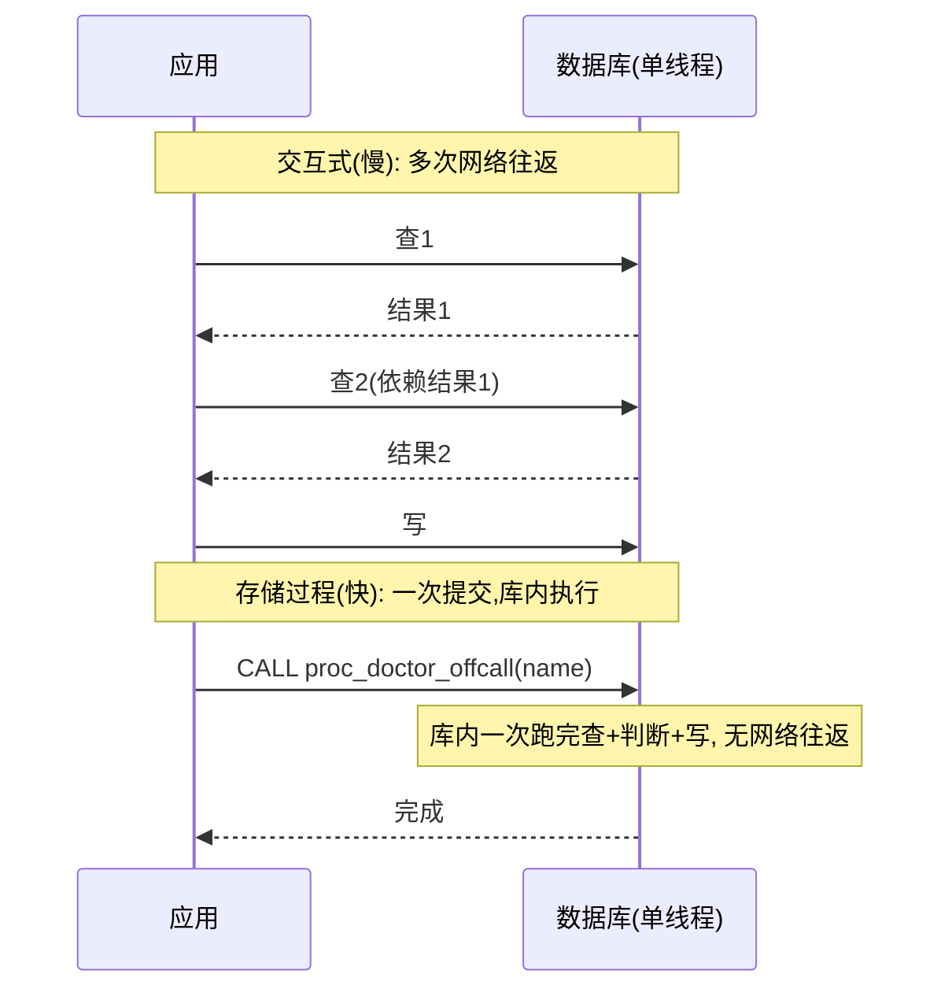

#### 深入：存储过程的优缺点

| 缺点 | 说明 |
|------|------|
| **语言割裂** | 各厂各有存储过程语言（Oracle PL/SQL、SQL Server T-SQL、PG PL/pgSQL），落后于通用语言、缺库生态。**现代库改用通用语言**：VoltDB 用 Java/Groovy、Datomic 用 Java/Clojure、Redis 用 Lua、MongoDB 用 JS。 |
| **难管理** | 比 app server 难调试/版本控制/部署/测试/监控。 |
| **性能敏感** | 单库实例常被多 app server 共享，一个烂存储过程（吃 CPU/内存/崩溃）危害远大于 app server 上的烂代码。 |
| **安全** | 多租户让租户写存储过程 → 在库内核进程跑不可信代码 [64]。 |

> 🏭 **VoltDB 用存储过程做复制**：不复制事务的写，而是在每个副本上**重放执行同一存储过程** → 要求存储过程**确定性**（各节点结果相同）。需要当前时间须走特殊确定性 API（[[ch05]]讲过确定性操作）。这叫**状态机复制**，第 10 章详谈。

#### 深入：VoltDB 存储过程示例（Java）

VoltDB 的存储过程是 Java 类，事务边界 = 一次 `run()` 调用，全程在单线程内存执行：

```java
@ProcInfo(singlePartition = true)   // 单分片 → 线性扩展
public class Transfer extends VoltProcedure {
    public long run(long fromId, long toId, long amount) {
        // 整个 run() 是一个原子事务, 单线程串行执行
        VoltTable[] results = voltExecuteSQL(
            "SELECT balance FROM accounts WHERE id = ?", fromId);
        long balance = results[0].fetchRow(0).getLong(0);
        if (balance < amount) {
            throw new VoltAbortException("insufficient funds");  // = 中止
        }
        voltExecuteSQL(
            "UPDATE accounts SET balance = balance - ? WHERE id = ?",
            amount, fromId,
            "UPDATE accounts SET balance = balance + ? WHERE id = ?",
            amount, toId);
        return voltExecuteSQL()[0].getLong(0);  // = 提交
    }
}
```

**特点**：① 无锁（单线程天然互斥）；② 无网络往返（过程在库内）；③ 确定性（同输入同输出，便于复制）；④ 极快（亚毫秒级）。**代价**：业务逻辑塞进库（难测试/部署），跨分片事务慢（~1000/s）。适合**低延迟金融交易、实时计费、广告竞价**等"小而快"场景。

#### 深入：如何验证你的库真防住了异常？（隔离级别实测）

"我的库说支持 SERIALIZABLE，真的吗？"用 **Jepsen/Hermitage** 思路实测。核心：开多个并发连接跑特定模式，看是否出现异常。

```sql
-- 测试脏读(PG Read Uncommitted vs Read Committed)
-- 连接1:                          -- 连接2:
BEGIN;                             BEGIN ISOLATION LEVEL READ UNCOMMITTED;
UPDATE accounts SET balance=999;
                                   SELECT balance FROM accounts WHERE id=1;
                                   -- READ UNCOMMITTED: 返999(脏读)
                                   -- READ COMMITTED: 阻塞/返旧值
ROLLBACK;

-- 测试写偏斜(REPEATABLE READ 是否防住? PG防不住, SERIALIZABLE防住)
-- 连接1:                                       -- 连接2:
BEGIN ISOLATION LEVEL REPEATABLE READ;         BEGIN ISOLATION LEVEL REPEATABLE READ;
SELECT COUNT(*) FROM doctors WHERE on_call;   SELECT COUNT(*) FROM doctors WHERE on_call;
-- 都返2
UPDATE doctors SET on_call=false WHERE name='A'; UPDATE doctors SET on_call=false WHERE name='B';
COMMIT;                                        COMMIT;
-- 结果: 0人值班! REPEATABLE READ 防不住写偏斜
-- 换 SERIALIZABLE: 其中一个 COMMIT 会报序列化冲突
```

> 🏧 **Hermitage** [30]（kleppmann 写的）是个开源工具，对各库跑这套测试，**直观展示"repeatable read"在不同库下的真实行为差异**。**强烈推荐在生产选型前跑一遍**——别信文档名字，信实测。Jepsen（Kyle Kingsbury）则用更暴力的网络分区/时钟跳变测试分布式库的真实一致性，**揭露过无数库的隐藏 bug**（如 MySQL [43]）。
>
> **生产自测清单**：① 你的隔离级别实际防住了哪些异常？② 死锁/序列化冲突的重试逻辑测过吗？③ 跨分片/分布式事务在节点故障下还正确吗？④ 高并发压测下还满足保证吗？

#### 分片 + 串行执行

单线程限吞吐在单核。要扩展 → **分片**（[[ch07]]）。若能让每个事务只读写**单个分片**的数据，每分片独立跑自己的事务线程 → 吞吐随 CPU 核**线性扩展** [61]。

> ⚠️ **跨分片事务**慢得多——须在所有涉及分片上**同步 (lockstep)** 执行存储过程保证可串行化。VoltDB 报告跨分片写约 **1000/秒**，比单分片低几个数量级，加机器也提不上去 [63]。**能否单分片取决于数据结构**——KV 易分片，多二级索引的数据要大量跨分片协调（[[ch07]]）。

#### 串行执行的适用条件

- 事务**小而快**（一个慢事务拖死全部）。
- 活跃数据集**装得进内存**。
- 写吞吐**单核能扛**，或能无跨分片协调地分片。
- 跨分片事务**可以但难扩展吞吐**。

### 4.2 两阶段锁 (Two-Phase Locking, 2PL)

> 📝 **2PL ≠ 2PC！（最容易混的两个缩写）**
> - **2PL**：提供**可串行化隔离**（本章）。
> - **2PC**：提供分布式库的**原子提交**（§5）。
> 当成完全不同的概念，忽略名字相似。

约 30 年里，2PL 是可串行化的**唯一**广泛算法（有时叫 SS2PL 强严格两阶段锁）。

#### 2PL 的锁规则（比 Read Committed 强得多）

Read Committed 用锁防脏写（两事务并发写同行，第二个等第一个完成）。2PL 类似但**要求强得多**：多人可并发读（没人写时），但**一旦有人要写，就要独占**：

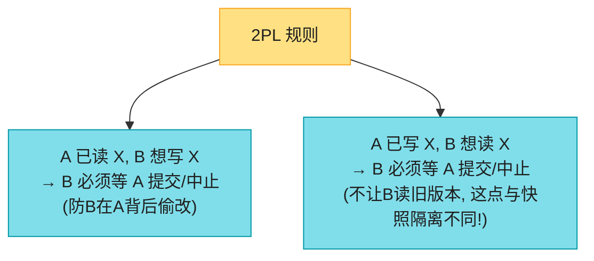

**关键差异**：2PL 里**写者不只阻塞写者，也阻塞读者**（反之亦然）。快照隔离的"读者不阻塞写者、写者不阻塞读者"在 2PL **不成立**——这正是 2PL 能可串行化（防住丢失更新+写偏斜等所有竞态）的原因。

#### 深入：2PL 的共享/排他锁 + 两阶段

每个对象一把锁，**共享 (shared)** 或**排他 (exclusive)** 模式（多读者单写者锁）：

| 操作 | 获锁 | 并发限制 |
|------|------|---------|
| 读对象 | **共享锁** | 多事务可同时持有；但若已有排他锁须等 |
| 写对象 | **排他锁** | 任何其他锁都不能并存，须等 |
| 先读后写 | 共享锁**升级**为排他锁 | 同获排他锁 |

> 📝 **"两阶段"的含义**：事务获锁后**持有到事务结束（提交/中止）才全释放**。两阶段 = ① **增长阶段**（执行中不断获锁）+ ② **收缩阶段**（事务末一次性释放所有锁）。两阶段**不可重叠**：一旦释放锁就不能再获新锁。

#### 深入：死锁检测——等待图 (wait-for graph)

库怎么"自动检测死锁"？构建一张**等待图**：节点=事务，边="A 在等 B 释放锁"。**图里有环 = 死锁**。库周期性检测，发现环就**中止环上一个事务**（通常选代价小的）打破死锁。

```mermaid
flowchart LR
    A["事务A: 持X, 等Y"] -->|"等Y"| B["事务B: 持Y, 等X"]
    B -->|"等X"| A
    CYCLE["环 A→B→A = 死锁!"]
    style A fill:#EF9A9A,stroke:#C62828,color:#1f1f1f
    style B fill:#EF9A9A,stroke:#C62828,color:#1f1f1f
    style CYCLE fill:#EF9A9A,stroke:#C62828,color:#1f1f1f
```

**典型死锁代码**（两事务以相反顺序锁两行）：
```sql
-- 事务A                    -- 事务B
BEGIN;                      BEGIN;
UPDATE accounts SET ...     UPDATE accounts SET ...
  WHERE id = 2;  -- 锁id=2    WHERE id = 1;  -- 锁id=1
UPDATE accounts SET ...     UPDATE accounts SET ...
  WHERE id = 1;  -- 等B!       WHERE id = 2;  -- 等A!
-- 💀 死锁, 库中止一个         -- (或这个被中止)
```

> 🏧 **防死锁实践**：**所有事务以固定顺序加锁**（如按 id 升序）→ 消除环的可能。这是应用层最有效的死锁预防。PG 还有 `lock_timeout` 让等锁超时主动失败而非无限等。
>
> ⚠️ **2PL 下死锁远比 Read Committed 频繁**（锁多、持有久），重试开销是 2PL 性能差的元凶之一。

#### 深入：死锁 + 2PL 的性能问题

```mermaid
flowchart LR
    A["事务A: 持锁X, 等锁Y"] -->|"等"| B["事务B: 持锁Y, 等锁X"]
    B -->|"等"| A
    Note["死锁! 库自动检测<br/>中止一个, 应用重试"]
    style A fill:#EF9A9A,stroke:#C62828,color:#1f1f1f
    style B fill:#EF9A9A,stroke:#C62828,color:#1f1f1f
    style Note fill:#FFCC80,stroke:#F57C00,color:#1f1f1f
```

锁多用，**死锁频发**（2PL 可串行化下比 Read Committed 频繁得多）。库自动检测、中止一个、应用重试——重试 = 白干的活重来，死锁多时浪费大。

**2PL 的致命伤是性能**——这是它自 1970s 起不是多数系统默认的原因：
- 获/释锁开销大。
- 更致命的是**并发度降低**：两个并发事务只要可能竞态就得一个等另一个。一个全表读事务（备份/分析/完整性检查）要先等所有在写的完成，读期间所有写又被阻塞 → **写长时间不可用**。
- 高争用下**尾延迟不稳且很差**——一个慢事务/大范围锁事务能让全系统停摆。靠事务超时 + 慢查询监控限制。

> 🏭 **谁用 2PL**：**MySQL/InnoDB 和 SQL Server 的 serializable**、**Db2 的 repeatable read** [30]。

#### 谓词锁 + 索引范围锁（防幻读）

普通对象锁防不住幻读（§3.5）。2PL 要可串行化**必须防幻读** → 需要**谓词锁 (predicate lock)** [4]：不属于特定对象，而属于**匹配某查询条件的所有对象**（含还不存在的、未来会加的——幻读）。

```sql
-- 给这个查询加谓词锁: 锁住所有匹配的预订(含未来插入的)
SELECT * FROM bookings
  WHERE room_id = 123 AND
    end_time   > '2026-01-01 12:00' AND
    start_time < '2026-01-01 13:00';
```

| 操作 | 谓词锁限制 |
|------|----------|
| 事务A 读匹配某条件的对象 | 获该条件的**共享谓词锁**；若B持匹配的排他锁，A等 |
| 事务A 插/改/删对象 | 检查新旧值是否匹配任何现有谓词锁；若B持有，A等B提交/中止 |

**问题**：谓词锁性能差（锁多时检查匹配耗时）。实际大多 2PL 库用**索引范围锁 (index-range locking / next-key locking)** [56,66]——谓词锁的**简化近似**。

> 📝 **名词注释：索引范围锁（next-key locking）**
> **安全地放宽谓词**——让它匹配**更大**的对象集。如"123 房间 12-13 点预订"的谓词锁，可近似成"123 房间**任意时段**"或"**任意房间** 12-13 点"。安全是因为：匹配原谓词的写**一定**也匹配近似。库用 `room_id` 或时间索引，把共享锁附在索引项/范围上。别人要插同房间/同时段预订会更新索引同一处 → 撞到锁 → 等。
>
> 比谓词锁不精确（可能锁更大范围），但开销低得多，是好折中。没合适索引时退化为**全表共享锁**（性能差但安全）。
>
> 🏧 **MySQL InnoDB 的 next-key lock** 就是这个，在 REPEATABLE READ 下防幻读。

### 4.3 可串行化快照隔离 (Serializable Snapshot Isolation, SSI)

```mermaid
flowchart LR
    Q["可串行化 vs 好性能<br/>鱼与熊掌?"] --> SSI["SSI: 全可串行化<br/>仅比快照隔离多一点性能损失✅"]
    style Q fill:#FFE082,stroke:#F9A825,color:#1f1f1f
    style SSI fill:#A5D6A7,stroke:#388E3C,color:#1f1f1f
```

SSI 较新（2008 首次描述 [55,67]）。今天用于：单节点（**PostgreSQL serializable** [56]、**SQL Server Hekaton** [68]、**HyPer** [69]）、分布式（**CockroachDB** [5]、**FoundationDB** [8]）、嵌入式（**BadgerDB**）。

#### 悲观 vs 乐观并发控制

```mermaid
flowchart LR
    CC["并发控制"] --> P["悲观(2PL/串行执行)"]
    CC --> O["乐观(SSI)"]
    P --> P1["可能出问题就先等<br/>= 互斥锁"]
    O --> O1["不阻塞, 先干, 提交时检查<br/>出问题才中止重试"]
    style CC fill:#FFE082,stroke:#F9A825,color:#1f1f1f
    style P fill:#80DEEA,stroke:#0097A7,color:#1f1f1f
    style O fill:#A5D6A7,stroke:#388E3C,color:#1f1f1f
    style P1 fill:#FFCC80,stroke:#F57C00,color:#1f1f1f
    style O1 fill:#A5D6A7,stroke:#388E3C,color:#1f1f1f
```

- **2PL 悲观**：可能出问题（别人持锁）就等。像多线程编程的互斥。
- **串行执行**：悲观到极致 ≈ 每事务对全库（或全分片）持排他锁。靠"事务极快"补偿。
- **SSI 乐观**：可能危险也不阻塞，继续干，赌一切顺利。提交时库检查是否真出问题；是则中止重试。只有可串行化执行的事务才允许提交。

> 📝 乐观并发是老想法 [70]。**高争用**（多事务抢同一对象）时表现差（大量中止重试，已近满载时重试负载雪上加霜）；**争用不高 + 有余量**时往往比悲观好。可用**可交换原子操作**降低争用（多事务并发自增计数器，顺序无所谓就不冲突）。

#### 深入：SSI 检测什么——基于过期前提的决策

SSI 建在快照隔离上（事务内全从一致快照读），再加一套**检测读写间串行化冲突**的算法。

回顾写偏斜模式：事务**读数据→基于查询结果决策→写**。但快照隔离下，**原始查询结果到提交时可能已过时**（期间数据被改）——事务基于一个**前提 (premise)** 行动（如"当前2人值班"），提交时前提可能已不成立。

库不知道应用逻辑怎么用查询结果，**为安全只能假设：查询结果的任何变化都意味着该事务的写可能无效**（查询与写之间可能有因果依赖）。要可串行化，库须**检测事务是否基于过期前提行动，是则中止**。

#### SSI 的两种检测

**检测1：读到过期的 MVCC 版本（读前有未提交写）**

Figure 8-10：事务43 看到 Aaliyah `on_call=true`（因为改它的事务42 未提交）。但事务43 想提交时，事务42 已提交 → 被43 忽略的写现在生效了，43 的前提不再成立 → **须中止43**。

```mermaid
sequenceDiagram
    participant T42 as 事务42(改Aaliyah on_call)
    participant T43 as 事务43(读到on_call=true)
    T43->>T43: 读 Aaliyah (T42未提交, 按MVCC读旧值true)
    Note over T43: 前提: Aaliyah在值班
    T42->>T42: COMMIT
    T43->>T43: 想提交...
    Note over T43: 检测: 之前忽略的T42写已提交<br/>→ 前提过期 → 中止T43!
```

为何等到提交才中止而不立即？若43是只读事务不用中止（无写偏斜风险）；读时库还不知43后续会不会写；42也可能中止。**延迟中止避免不必要的中断**，保留快照隔离对长读的支持。

**检测2：写影响了先前的读（读后有写）**

Figure 8-11：事务42 和43 都查了 shift 1234 的值班医生。若有 `shift_id` 索引，库用索引项 1234 **记录**42、43 读过这数据（无索引则在表级记）。事务写时查索引找最近读过受影响数据的事务——这像在受影响 key range 上获写锁，但**不阻塞**读者，而是当**绊线 (tripwire)**：通知那些事务"你读的数据可能过时了"。

```mermaid
sequenceDiagram
    participant T42 as 事务42
    participant T43 as 事务43
    participant IDX as shift_id索引[1234]
    T42->>IDX: 查值班医生 (索引记: T42读过1234)
    T43->>IDX: 查值班医生 (索引记: T43读过1234)
    T42->>IDX: 写(改自己on_call) → 通知T43: 你读的过期了
    T43->>IDX: 写(改自己on_call) → 通知T42: 你读的过期了
    T42->>T42: COMMIT (成功: T43还没提交, 影响未生效)
    T43->>T43: 想提交 → 冲突的T42已提交 → 中止T43!
```

#### SSI 性能

| 维度 | 说明 |
|------|------|
| 追踪粒度 | 太细→精确但记账开销大；太粗→快但多不必要中止。**PostgreSQL** 用理论减少不必要中止 [14,56]。 |
| vs 2PL | **不需等锁**；读写互不阻塞；延迟更可预测；只读查询无锁跑快照——读多负载香。 |
| vs 串行执行 | **不限单核**；FoundationDB 把冲突检测分布到多机，高吞吐；事务可跨分片读写且可串行化。 |
| vs 非可串行化快照 | 串行化检查有开销（值不值有争议 [72,69]）。 |
| 中止率 | 读-写事务要短（长跨时易冲突中止）；长只读事务 OK。比 2PL/串行执行**对慢事务更不敏感**。 |

#### 深入：SSI 双检测机制完整推演（医生值班例）

把医生值班例放到 SSI 下完整推演，看清两种检测如何协作。初始：Aaliyah、Bryce 都 on_call=true，shift 1234。事务 T1（Aaliyah 下线）、T2（Bryce 下线）并发：

```mermaid
sequenceDiagram
    participant T1 as T1(Aaliyah下线)
    participant T2 as T2(Bryce下线)
    participant IDX as shift_id索引[1234]
    Note over T1,T2: 都在 SERIALIZABLE(SSI) 下
    T1->>IDX: SELECT COUNT(*) WHERE on_call AND shift=1234
    Note over IDX: 记录: T1读过 shift=1234 的值(绊线)
    T2->>IDX: SELECT COUNT(*) WHERE on_call AND shift=1234
    Note over IDX: 记录: T2读过 shift=1234 的值(绊线)
    T1->>IDX: UPDATE Aaliyah on_call=false
    Note over IDX: T1写影响shift=1234 → 通知T2: "你读的可能过期了"(检测2)
    T2->>IDX: UPDATE Bryce on_call=false
    Note over IDX: T2写影响shift=1234 → 通知T1: "你读的可能过期了"(检测2)
    T1->>T1: COMMIT (成功: T2还没提交, 影响未生效)
    T2->>T2: COMMIT → 检测: T1已提交且T1的写影响了T2的读<br/>→ T2基于过期前提 → 中止! (报序列化冲突)
```

**两种检测如何协作**：
- **检测1（过期 MVCC 读）**：读时若有未提交写，记下"忽略了它"；提交时若该写已提交 → 中止。
- **检测2（写影响先前读）**：写时通过索引绊线找出"读过这数据的事务"，通知它们过期；被通知的事务提交时若对方已提交 → 中止。

本例主要触发**检测2**：T1、T2 都写了 shift=1234 的数据，互相触发对方的"读过期"标记。先提交的 T1 成功，后提交的 T2 因 T1 已提交且影响其读 → 中止。**结果等价于某种串行顺序（T1 先，T2 后）**，可串行化达成。

> 💡 **SSI 的智慧**：不阻止事务跑（乐观），只在"基于过期前提做决策"时才中止。**只读事务永不中止**（无写就无写偏斜风险）。读多写少时性能极佳。代价：高写争用下中止率上升——所以 SSI 要求**读-写事务短**。

#### 深入：悲观 vs 乐观并发控制——怎么选

```mermaid
flowchart TD
    Q{"工作负载特征"} --> W1["写争用高<br/>(热点行频繁改)"]
    Q --> W2["写争用低<br/>读多写少"]
    Q --> W3["事务可能较长"]
    W1 --> P["悲观(2PL)<br/>冲突时阻塞等待<br/>避免大量重试浪费"]
    W2 --> O["乐观(SSI)<br/>不阻塞, 高吞吐<br/>偶尔中止重试"]
    W3 --> P2["悲观(2PL)<br/>乐观下长事务易冲突中止"]
    style Q fill:#FFE082,stroke:#F9A825,color:#1f1f1f
    style W1 fill:#EF9A9A,stroke:#C62828,color:#1f1f1f
    style W2 fill:#A5D6A7,stroke:#388E3C,color:#1f1f1f
    style W3 fill:#FFCC80,stroke:#F57C00,color:#1f1f1f
    style P fill:#80DEEA,stroke:#0097A7,color:#1f1f1f
    style O fill:#A5D6A7,stroke:#388E3C,color:#1f1f1f
    style P2 fill:#80DEEA,stroke:#0097A7,color:#1f1f1f
```

| 维度 | 悲观（2PL / 串行执行） | 乐观（SSI） |
|------|---------------------|------------|
| 冲突时 | **阻塞等**（持锁者完成） | **继续跑**，提交时检查，冲突才中止 |
| 高争用 | ✅稳（等比反复重试省） | ❌中止风暴，重试雪上加霜 |
| 低争用 | ❌锁开销浪费 | ✅高吞吐、无阻塞 |
| 死锁 | 频繁（需检测+中止+重试） | 无（无锁等待） |
| 尾延迟 | 差（等锁、持锁者慢拖累） | 好（不阻塞） |
| 长事务 | 容忍度较好 | 读-写长事务易冲突中止 |
| 只读查询 | 2PL 下可能被写阻塞 | 永不中止，跑快照 |
| 典型 | MySQL/SQLServer serializable、Db2 RR | PostgreSQL serializable、CockroachDB、FoundationDB |

> 🏧 **实践直觉**：① 电商/社交（读多写少、争用低）→ **SSI（PG serializable）**；② 金融账户（热点账户高频改）→ **2PL 或悲观锁**；③ 极致低延迟 OLTP（计费/竞价）→ **VoltDB 串行执行**；④ 不确定就先 SSI，监控中止率，高就退到 2PL。

### 4.4 三种可串行化方案对比

| 方案 | 并发模型 | 性能 | 适用 | 典型产品 |
|------|---------|------|------|---------|
| **真正串行执行** | 极悲观（全库/分片一把锁） | 单核上限；存储过程快 | 小快事务、内存数据集、可分片 | VoltDB、Redis、Datomic |
| **2PL** | 悲观（锁） | 高争用下尾延迟差、死锁多 | 传统 OLTP、能容忍阻塞 | MySQL/SQLServer serializable、Db2 RR |
| **SSI** | 乐观（提交时检查） | 接近快照隔离、读写不互阻 | 读多、争用中等 | PostgreSQL serializable、CockroachDB、FoundationDB |

---

## 5. 分布式事务 (Distributed Transactions)

### 5.1 原子提交问题

单节点事务里，并发控制都在一台机器。单主复制下，事务只在 leader 执行，follower 只应用日志。

多节点呢？事务要碰多个分片、或全局二级索引（索引项在别的节点，[[ch07]]）→ **分布式事务**。并发控制算法和单机大同小异（分片上串行执行、分布式 2PL、分布式 SSI 检测器 [8]）。**新挑战是原子性**。

```mermaid
flowchart LR
    APP["应用"] -->|"事务碰多节点"| N1["节点1"]
    APP --> N2["节点2"]
    N1 --> Q1["提交? 可能部分成部分败"]
    N2 --> Q2["提交?"]
    Q1 --> BAD["节点间不一致😱<br/>且已提交不能撤"]
    style APP fill:#FFE082,stroke:#F9A825,color:#1f1f1f
    style N1 fill:#80DEEA,stroke:#0097A7,color:#1f1f1f
    style N2 fill:#80DEEA,stroke:#0097A7,color:#1f1f1f
    style Q1 fill:#FFCC80,stroke:#F57C00,color:#1f1f1f
    style Q2 fill:#FFCC80,stroke:#F57C00,color:#1f1f1f
    style BAD fill:#EF9A9A,stroke:#C62828,color:#1f1f1f
```

**为什么不能简单地"给所有节点发提交请求、各自提交"**？可能部分成部分败（约束冲突、网络丢、节点崩前没写完日志）。**一旦某节点提交就不能撤**（数据已对别的事务可见）——若之后发现别处中止了，已读这数据的事务也得回滚，连锁灾难。

**原子提交问题 (atomic commitment problem)**：让涉及节点**要么全提交要么全中止**，禁止混合。

> 📝 **单节点怎么做到的**：客户端提交时，库先把事务写**落盘**（WAL），再往日志**追加提交记录**。崩了重启时从日志恢复——提交记录写了就算提交，没写就回滚。**关键 = 数据落盘与提交记录落盘的顺序**：先数据后提交记录。提交原子性由**单个设备**（某节点的磁盘控制器）决定。

### 5.2 两阶段提交 (Two-Phase Commit, 2PC)

2PC 是跨节点原子提交的经典算法 [13,73,74]。库内部用，也以 **XA 事务** [75] 形式给应用用（Java Transaction API 支持）、或 SOAP 的 WS-AtomicTransaction [76,77]。

#### 2PC 完整流程（Figure 8-13）

引入新组件 **coordinator（协调者 / 事务管理器）**——常是应用进程内的库（如 Java EE 容器内），也可独立进程/服务（Narayana、JOTM、BTM、MSDTC）。

```mermaid
sequenceDiagram
    participant App as 应用
    participant CO as 协调者
    participant P1 as 参与者1(节点1)
    participant P2 as 参与者2(节点2)
    Note over App,P2: 阶段0: 应用在各参与者上读写(带全局事务ID)
    App->>CO: 准备提交
    Note over CO: 阶段1: 准备(PREPARE)
    CO->>P1: PREPARE?
    CO->>P2: PREPARE?
    P1->>P1: 确保一定能提交(写盘+查约束)
    P1-->>CO: YES(承诺: 放弃单方面中止权)
    P2-->>CO: YES
    Note over CO: 全YES → 写决定到磁盘(提交点!)
    Note over CO: 阶段2: 提交(COMMIT)
    CO->>P1: COMMIT
    CO->>P2: COMMIT
    P1-->>CO: ACK
    P2-->>CO: ACK
    Note over CO: 任一失败/超时 → 无限重试
```

#### 深入：2PC 的"承诺体系"——两个不归路 (Points of No Return)

为何 2PC 能保证原子性（一阶段跨节点提交不行）？拆解 [78]：

```mermaid
flowchart TD
    START["1. 应用向协调者要全局唯一事务ID"] --> RW["2. 应用在各参与者开单节点事务<br/>(带全局ID), 正常读写"]
    RW --> PREP["3. 应用要提交 → 协调者向所有参与者发 PREPARE"]
    PREP --> VOTE{"4. 参与者收到PREPARE"}
    VOTE -->|"确保必能提交(写盘/查约束)"| YES["回YES = 放弃单方面中止权<br/>(不归路①)"]
    VOTE -->|"无法保证"| NO["回NO → 协调者发ABORT给所有节点"]
    YES --> DECIDE["5. 协调者收齐所有响应<br/>→ 定最终决定(全YES才提交)<br/>→ 写决定到自己的事务日志(提交点)"]
    DECIDE --> COMMIT["6. 发COMMIT/ABORT给所有参与者<br/>失败就无限重试"]
    COMMIT --> FORCE["参与者投过YES → 恢复后也不能拒提交<br/>(不归路②)"]
    style START fill:#FFE082,stroke:#F9A825,color:#1f1f1f
    style RW fill:#80DEEA,stroke:#0097A7,color:#1f1f1f
    style PREP fill:#80DEEA,stroke:#0097A7,color:#1f1f1f
    style VOTE fill:#80DEEA,stroke:#0097A7,color:#1f1f1f
    style YES fill:#FFCC80,stroke:#F57C00,color:#1f1f1f
    style NO fill:#EF9A9A,stroke:#C62828,color:#1f1f1f
    style DECIDE fill:#CE93D8,stroke:#7B1FA2,color:#1f1f1f
    style COMMIT fill:#A5D6A7,stroke:#388E3C,color:#1f1f1f
    style FORCE fill:#FFCC80,stroke:#F57C00,color:#1f1f1f
```

**两个关键不归路**：
1. **参与者投 YES** → 承诺一定能提交（虽协调者仍可选中止）。参与者**交出单方面中止权**。
2. **协调者做出决定**（写盘）→ **不可撤销**。必须执行到底（不管重试多少次）。参与者投过 YES，恢复后也**不能拒提交**。

> 📝 **婚礼类比** [78]：牧师（协调者）分别问两人（参与者）是否愿意，都答"我愿意"（PREPARE→YES）后宣布结为夫妻（提交）。说"我愿意"前你可喊"没门！"（中止）；说之后**不能反悔**。说完昏倒了没听到宣布，不影响"已提交"事实——醒后可问牧师状态，或等牧师重试（你昏迷期间重试一直在继续）。

#### 深入：协调者崩溃 → in-doubt 状态（2PC 的阿喀琉斯之踵）

参与者/网络故障好处理（PREPARE 失败→中止；COMMIT/ABORT 失败→无限重试）。**但协调者崩溃呢？**

```mermaid
sequenceDiagram
    participant CO as 协调者
    participant D1 as 数据库1(参与者)
    participant D2 as 数据库2(参与者)
    CO->>D1: PREPARE
    CO->>D2: PREPARE
    D1-->>CO: YES
    D2-->>CO: YES
    Note over CO: 决定提交, 写盘
    CO->>D2: COMMIT
    D2-->>CO: ACK (D2已提交)
    Note over CO: 崩溃! 来不及给D1发COMMIT
    Note over D1: 收过PREPARE投了YES<br/>→ 不能单方面中止/提交<br/>→ 只能等! (in-doubt/uncertain)
    Note over D1: 超时也没用: 单方面中止→与D2不一致<br/>单方面提交→可能别处已中止
```

**参与者这时（已投YES、没收到决定）叫 in-doubt（存疑）/ uncertain**。它能干啥？**只能等协调者恢复**。这就是为什么协调者必须在发 COMMIT/ABORT 前**把决定写盘**——恢复时读日志决定每个存疑事务的命运；日志里没提交记录的就中止。**2PC 的提交点 = 协调者上的一次普通单节点原子提交。**

> 🏧 **灾难**：若协调者**磁盘也坏了、日志丢了** → 系统无法自动恢复，**只能管理员手动**决定每个存疑事务提交还是回滚。若只丢了日志最新部分，恢复的协调者可能误以为"已提交的事务还没提交"去中止它们——**违反原子性**。

#### 深入：in-doubt 事务持有锁 → 阻塞全系统

为何关心存疑事务？**因为它持着锁！** Read Committed 下事务对改过的行持排他锁；2PL 可串行化下对读过的行还持共享锁。事务提交/中止前**不能释放**。所以 **2PC 下存疑期间一直持锁**。协调者崩了 20 分钟才起来，锁就持 20 分钟；协调者日志丢了，锁可能**永久持有**直到管理员手动解决。锁持着，别的事务改不了那些行（甚至读不了）→ **大半个应用不可用**。

```mermaid
flowchart LR
    CO["协调者崩溃"] --> INDOUBT["参与者事务 in-doubt<br/>持锁等待"]
    INDOUBT --> BLOCK["锁不释放 → 别的事务阻塞<br/>→ 应用大面积不可用"]
    BLOCK --> MANUAL["只能: 等协调者恢复<br/>或管理员手动提交/回滚<br/>或'启发式决定'(heuristic, 可能破坏原子性)[75]"]
    style CO fill:#EF9A9A,stroke:#C62828,color:#1f1f1f
    style INDOUBT fill:#FFCC80,stroke:#F57C00,color:#1f1f1f
    style BLOCK fill:#EF9A9A,stroke:#C62828,color:#1f1f1f
    style MANUAL fill:#CE93D8,stroke:#7B1FA2,color:#1f1f1f
```

> 📝 **名词注释：启发式决定 (heuristic decision)**
> XA 实现的紧急逃生舱：允许参与者**单方面**决定提交/中止存疑事务（不经协调者）。"heuristic"是**"可能破坏原子性"的委婉说法**——它违反 2PC 的承诺体系。仅用于灾难逃生，绝不常规使用。

#### 深入：2PC 失败恢复完整时序（coordinator 崩溃 → 恢复）

```mermaid
sequenceDiagram
    participant A as 应用
    participant CO as 协调者
    participant P1 as 参与者1
    participant P2 as 参与者2
    A->>CO: 提交
    CO->>P1: PREPARE
    CO->>P2: PREPARE
    P1-->>CO: YES (写盘, 持锁, 等决定)
    P2-->>CO: YES (写盘, 持锁, 等决定)
    Note over CO: 决定 COMMIT, 写决定到日志盘
    Note over CO: 💥 协调者崩溃!
    Note over P1,P2: 都投了YES → in-doubt, 持锁死等
    Note over A: 请求超时, 应用也卡住(或报错)
    Note over CO: (20分钟后)协调者重启
    CO->>CO: 读日志 → 发现"事务T: COMMITTED"
    CO->>P1: COMMIT (重试)
    CO->>P2: COMMIT (重试)
    P1->>P1: 提交, 释放锁 ✅
    P2->>P2: 提交, 释放锁 ✅
    P1-->>CO: ACK
    P2-->>CO: ACK
    Note over CO: 从存疑表移除T
```

**关键**：参与者投 YES 后**写盘持久化**了"准备提交"状态——重启也不会忘。所以协调者恢复后重发 COMMIT，参与者能正确提交。**这就是为什么 2PC 要求参与者在 PREPARE 时 fsync**——否则参与者崩溃恢复后可能"忘了"投过 YES，破坏原子性。

> 🏧 **in-doubt 的运维噩梦**：协调者若**日志损坏/丢失**，恢复后无法决定 → 参与者**永久持锁**。管理员须手动：① 查每个参与者该事务的本地状态；② 若任一已提交/中止，把同结果应用到其他；③ 全都没决定则手动选一个（可能破坏一致性）。这往往发生在**高压生产事故中**（否则协调者为何这么糟）——煎熬。**这就是为什么很多团队拒绝 XA。**

#### 3PC 与共识

2PC 是**阻塞**原子提交协议（会卡住等协调者恢复）。可做成**非阻塞**（节点故障也不卡），但实践很难。**三阶段提交 (3PC)** [13,79] 假设**网络延迟有界、节点响应有界**——但真实系统延迟无界、有进程暂停（第9章），3PC 保不住原子性。**实践中更好的办法**：把单节点协调者换成**容错共识协议**（第10章）。

### 5.3 XA 异构事务及其问题

分布式事务/2PC 名声复杂：重要的安全保证 vs 运维麻烦/杀性能/承诺过头 [80-84]。很多云服务因运维问题不实现 [84]。性能代价主要来自崩溃恢复的**额外 fsync** + **额外网络往返**。

> 📝 **名词注释：两类分布式事务（常被混淆）**
> - **数据库内部分布式事务**：分布式库（复制+分片是标配）在自己节点间支持内部事务。所有参与者跑**同一库软件**（YugabyteDB、TiDB、FoundationDB、Spanner、VoltDB、Cassandra、MySQL Cluster NDB）。不用兼容别系统，可用任意协议+专属优化 → **往往工作得很好**。
> - **异构 (heterogeneous) 分布式事务**：参与者是**两种以上技术**（不同厂商的库、甚至消息 broker 这种非库系统）。跨它们要保证原子提交——**难得多**。

**XA (X/Open eXtended Architecture)** [75]：1991 年的**异构 2PC 标准**，广泛实现（PG、MySQL、Db2、SQL Server、Oracle；ActiveMQ、HornetQ、MSMQ、IBM MQ）。**不是网络协议，只是 C API**（Java 里叫 JTA）。

#### XA 的根本问题

```mermaid
flowchart TD
    XA["XA 事务问题"] --> P1["协调者=应用进程内库<br/>→ 单点故障"]
    XA --> P2["协调者日志在应用服务器本地盘<br/>→ 成了和库一样关键的持久状态"]
    XA --> P3["协调者/参与者无法直接通信<br/>只能经应用代码+驱动<br/>→ 应用代码本身成单点"]
    XA --> P4["最低公约数: 跨系统检测不了死锁<br/>不支持 SSI(需跨系统冲突协议)"]
    XA --> P5["存疑事务持锁阻塞 → 需管理员手动解<br/>高压生产事故中煎熬"]
    style XA fill:#FFE082,stroke:#F9A825,color:#1f1f1f
    style P1 fill:#EF9A9A,stroke:#C62828,color:#1f1f1f
    style P2 fill:#EF9A9A,stroke:#C62828,color:#1f1f1f
    style P3 fill:#EF9A9A,stroke:#C62828,color:#1f1f1f
    style P4 fill:#FFCC80,stroke:#F57C00,color:#1f1f1f
    style P5 fill:#EF9A9A,stroke:#C62828,color:#1f1f1f
```

> 💡 **解决方向**：要让应用代码也容错（复制/可重启）≈ **持久化执行 (durable execution)**（[[ch05]]讲过）。但实践中似乎没工具这么做。跨异构技术的一致性是真问题，第 12 章给别的解。

### 5.4 数据库内部分布式事务（NewSQL 的底气）

NewSQL（**CockroachDB [5]、TiDB [6]、Spanner [7]、FoundationDB [8]、YugabyteDB**）的**标志性特征**就是内部分布式事务；**Kafka** 也支持 [87]。它们用 2PC 保证跨分片原子性，但**不像 XA 那样遭罪**——因为不用对接别技术，避开了"最低公约数"陷阱，能用**更可靠更快的协议**。

XA 的最大问题可这样修：
- **复制协调者**，崩了自动 failover。
- 协调者与数据分片**直接通信**，不经应用代码。
- **复制参与分片**，降低单分片故障导致中止的风险。
- 原子提交协议**耦合分布式并发控制协议**（支持跨分片死锁检测、一致读）。

共识算法（第10章）常用来复制协调者和分片。隔离级别视系统：跨分片可有**快照隔离** [6] 或 **SSI** [5,8]。

### 5.5 exactly-once 不需要分布式事务（幂等表）

§5.3 提过：异构分布式事务的杀手级用例 = **exactly-once 消息处理**——把消息的确认和库写入原子提交（broker 和库是两种技术）。但**其实不用分布式事务也能做到 exactly-once**！只需**库内部事务**：

#### 深入：幂等消费者方案（4 步，纯单库事务）

```mermaid
flowchart TD
    S1["1. 每条消息有唯一ID<br/>库里有'已处理消息ID'表<br/>处理前开事务, 查ID是否已在"]
    S1 -->|"已在"| DROP["已处理过 → 确认broker, 丢弃"]
    S1 -->|"不在"| S2["2. 插入消息ID到表<br/>同事务内处理消息(产生其他写)"]
    S2 --> S3["3. 提交库事务"]
    S3 --> S4["4. 成功提交后 → 确认broker"]
    S4 --> DEL["确认后可删消息ID(另起事务)<br/>不删也无害, 只占点空间"]
    style S1 fill:#FFE082,stroke:#F9A825,color:#1f1f1f
    style DROP fill:#A5D6A7,stroke:#388E3C,color:#1f1f1f
    style S2 fill:#80DEEA,stroke:#0097A7,color:#1f1f1f
    style S3 fill:#80DEEA,stroke:#0097A7,color:#1f1f1f
    style S4 fill:#A5D6A7,stroke:#388E3C,color:#1f1f1f
    style DEL fill:#FFCC80,stroke:#F57C00,color:#1f1f1f
```

**各种崩溃场景都安全**：
- 库事务提交前崩 → 事务中止 → broker 重投。
- 提交后、确认 broker 前崩 → 重投 → 重试看到 ID 已在 → 丢弃。
- 确认后、删 ID 前崩 → 留个旧 ID，无害（占点空间）。
- 重投在库事务中止前发生（通信中断）→ 消息 ID 表的**唯一约束**防两个并发事务插同一 ID。

**结论**：exactly-once 只需库内部事务——**不需要**库和 broker 的原子提交。把消息 ID 记进库 = 让消息处理**幂等**，可安全重试不重复副作用。**Kafka Streams** 等流处理框架就是这思路（第12章）。但内部分布式事务仍有助于扩展（消息 ID 在一分片、主数据在别分片，跨分片原子提交）。

### 5.6 跨服务一致性的现代替代：Saga + Outbox（工业界主流）

XA/2PC 在微服务/云环境几乎被弃用（阻塞、运维噩梦）。业界用**最终一致**模式替代。两大主流：

#### 深入：Saga 模式（补偿事务链）

把一个跨服务"大事务"拆成一串**本地事务**，每个有对应的**补偿操作**。任一步失败，反向执行已完成步骤的补偿，达到"语义回滚"。

```mermaid
flowchart LR
    subgraph OK["正常流程(全部成功)"]
        S1["1. 订单服务<br/>创建订单(PENDING)"] --> S2["2. 支付服务<br/>扣款"]
        S2 --> S3["3. 库存服务<br>扣库存"]
        S3 --> S4["4. 订单服务<br>订单=SUCCESS"]
    end
    subgraph FAIL["第3步失败 → 反向补偿"]
        S2b["2. 支付服务<br>退款(补偿)"] --> S1b["1. 订单服务<br>订单=CANCELLED(补偿)"]
    end
    OK -.->|"3失败"| FAIL
    style S1 fill:#A5D6A7,stroke:#388E3C,color:#1f1f1f
    style S2 fill:#A5D6A7,stroke:#388E3C,color:#1f1f1f
    style S3 fill:#EF9A9A,stroke:#C62828,color:#1f1f1f
    style S4 fill:#A5D6A7,stroke:#388E3C,color:#1f1f1f
    style S2b fill:#FFCC80,stroke:#F57C00,color:#1f1f1f
    style S1b fill:#FFCC80,stroke:#F57C00,color:#1f1f1f
```

**编排式 Saga（orchestration，推荐）**：一个中心协调者驱动流程。
```python
# Saga 协调者(伪代码)
def create_order_saga(user, items, amount):
    # 步骤1: 创建订单
    order = order_service.create(user, items, status='PENDING')
    try:
        # 步骤2: 扣款
        payment = payment_service.charge(user, amount, idempotency_key=order.id)
        try:
            # 步骤3: 扣库存
            inventory_service.deduct(items, idempotency_key=order.id)
            order_service.update(order.id, status='SUCCESS')   # 全成功
        except Exception:
            # 补偿3: (库存没扣成功, 无需补偿)
            payment_service.refund(payment.id)                 # 补偿2: 退款
            raise
    except Exception:
        order_service.update(order.id, status='CANCELLED')     # 补偿1: 取消订单
        raise
```

> ⚠️ **Saga 不是 ACID**：中间状态对外可见（订单 PENDING、已扣款但库存没扣）。**不隔离**（isolation 弱）。补偿是"语义撤销"非"物理回滚"（退款 ≠ 没扣过款）。**适合可容忍中间状态的业务**（电商下单），**不适合**要求强隔离的（如账户余额不能瞬时为负）。

#### 深入：事务性 Outbox 模式（可靠发消息）

微服务里"写库 + 发消息"若分两步，可能写库成功消息没发。**Outbox**：把消息和业务数据**写同一个库事务**，再由独立进程（CDC/轮询）把消息发出。

```sql
-- 同一个本地事务里:
BEGIN;
INSERT INTO orders(user_id, amount) VALUES(123, 99);   -- 业务写
INSERT INTO outbox(aggregate_id, event_type, payload)   -- 消息写(同库)
  VALUES(123, 'OrderCreated', '{"amount":99}');
COMMIT;  -- 原子: 要么都在, 要么都不在

-- 独立的 Relayer 进程(或 Debezium CDC)读 outbox → 发到 MQ → 标记已发
-- 失败重试, 消息带唯一 ID, 消费端幂等
```

```mermaid
flowchart LR
    SVC["订单服务"] -->|"同事务"| DB["订单库 + outbox表"]
    DB -->|"CDC/轮询"| RELAY["Relayer<br/>(Debezium)"]
    RELAY -->|"发消息"| MQ["Kafka/RabbitMQ"]
    MQ -->|"消费"| INV["库存服务"]
    MQ -->|"消费"| PAY["支付服务"]
    style SVC fill:#80DEEA,stroke:#0097A7,color:#1f1f1f
    style DB fill:#FFE082,stroke:#F9A825,color:#1f1f1f
    style RELAY fill:#CE93D8,stroke:#7B1FA2,color:#1f1f1f
    style MQ fill:#80DEEA,stroke:#0097A7,color:#1f1f1f
    style INV fill:#A5D6A7,stroke:#388E3C,color:#1f1f1f
    style PAY fill:#A5D6A7,stroke:#388E3C,color:#1f1f1f
```

> 🏧 **Outbox 的精髓**：用**本地事务**保证"业务+消息"原子（无需 2PC）；用 **CDC（Debezium 读 binlog/WAL）** 保证消息至少一次发出；用**消费端幂等**保证 exactly-once 效果。这是现代微服务一致性的**事实标准**，远比 XA 可靠。第 12 章详谈 CDC。

#### 深入：Spanner 的外部一致性（NewSQL 强一致的底气）

**Spanner** [7] 是 Google 全球分布式库，支持跨数据中心的 ACID + 强一致（外部一致性）。怎么做到的？**2PL（并发）+ 2PC（提交）+ Paxos（复制）+ TrueTime（时钟）**。

```mermaid
flowchart LR
    TX["事务"] --> CC["并发控制: 2PL(锁)"]
    CC --> AC["原子提交: 2PC(跨分片)"]
    AC --> REP["复制: Paxos(每分片多副本)"]
    CLOCK["TrueTime API<br/>(原子钟+GPS, 误差<7ms)"]
    CLOCK --> CC
    CLOCK --> AC
    style TX fill:#FFE082,stroke:#F9A825,color:#1f1f1f
    style CC fill:#80DEEA,stroke:#0097A7,color:#1f1f1f
    style AC fill:#80DEEA,stroke:#0097A7,color:#1f1f1f
    style REP fill:#A5D6A7,stroke:#388E3C,color:#1f1f1f
    style CLOCK fill:#CE93D8,stroke:#7B1FA2,color:#1f1f1f
```

**TrueTime** 返回时间带**误差界限** `[earliest, latest]`，提交时**等误差窗口过去**再提交，保证事务顺序 = 真实时钟顺序 → **外部一致性**（最强的线性一致性）。代价：需要原子钟/GPS（Google 数据中心有），commit 等待增加延迟。第 10 章详谈线性一致性与共识。

---

## 🏭 生产级产品速查表（事务机制）

| 产品 | 默认隔离 | 可串行化实现 | MVCC | 分布式事务 | 特色/坑 |
|------|---------|------------|------|-----------|---------|
| **PostgreSQL** | Read Committed | **SSI**（serializable） | ✅(xmin/xmax) | 扩展(pg_partman等) | REPEATABLE READ=快照隔离；自动检测丢失更新 |
| **MySQL/InnoDB** | Read Committed (8.0+) | **2PL**（serializable） | ✅(但RR弱于SI) | **XA** | RR **不检测丢失更新**[43]；next-key lock 防幻读 |
| **Oracle** | Read Committed | "serializable"**其实是快照隔离** | ✅ | XA | 名不副实！[10,14] |
| **SQL Server** | Read Committed | 2PL(serializable)/Hekaton(SSI) | ✅(snapshot) | MSDTC(XA) | `read_committed_snapshot` 控制读是否走MVCC |
| **Spanner** | — | 外部一致性(2PL+2PC+Paxos) | ✅ | 内部(2PC+Paxos) | 全球分布式强一致；TrueTime |
| **CockroachDB** | — | **SSI** | ✅ | 内部 | NewSQL；跨分片 SSI |
| **TiDB** | — | 快照隔离/乐观+2PC | ✅ | 内部 | HTAP(TiKV+TiFlash) |
| **FoundationDB** | — | **SSI**(分布式检测) | ✅ | 内部 | 分层：事务层+存储层 |
| **VoltDB** | — | **真正串行执行** | — | 内部(存储过程) | 单线程+内存；存储过程确定性复制 |
| **Redis** | — | **真正串行执行**(单线程) | — | — | 单线程避险态；事务=MULTI/EXEC |
| **Datomic** | — | 不可变B-tree+串行 | ✅ | — | 写时复制B-tree |
| **Kafka** | — | — | — | 内部事务(producer事务) | exactly-once 语义；事务跨分区 |

### 🏭 深入：PostgreSQL 的隔离级别实战

```sql
-- 查看当前隔离级别
SHOW transaction_isolation;

-- 设置隔离级别(事务级)
BEGIN ISOLATION LEVEL READ COMMITTED;        -- 默认
BEGIN ISOLATION LEVEL REPEATABLE READ;      -- = 快照隔离(PG特有命名)
BEGIN ISOLATION LEVEL SERIALIZABLE;         -- SSI

-- 监控 SSI 中止率(序列化冲突)
SELECT * FROM pg_stat_database
  WHERE datname = current_database();
-- conflicts 列 = 序列化冲突中止数
```

PG 的 `REPEATABLE READ` 是真正的快照隔离（防丢失更新，自动检测）；`SERIALIZABLE` 是 SSI（乐观，提交时检查）。**生产建议**：能用 SERIALIZABLE 就用（PG 的 SSI 性能很好）；高争用写场景退到 REPEATABLE READ + 显式 FOR UPDATE。

### 🏧 深入：MySQL InnoDB 的 next-key lock（防幻读）

```sql
-- REPEATABLE READ 下, InnoDB 用 next-key lock 防幻读
BEGIN;
SELECT * FROM orders WHERE amount > 100 FOR UPDATE;
-- 锁住 amount>100 的所有行 + '间隙'(gap, 防止插入amount>100的新行)
-- → 别的事务插不进 amount>100 的新订单 → 防幻读
```

next-key lock = 行锁 + 间隙锁。代价：锁范围比 PG 大，高并发插入易死锁。**MySQL 的 RR 防幻读但不防丢失更新**（需显式 FOR UPDATE 或原子写）——这是它"弱于快照隔离"的体现 [43]。

### 🏭 各主流数据库隔离级别对照表（实战选型必备）

各库的"同名"隔离级别**含义天差地别**，这张表帮你避坑（基于 [30,43] 的实测）：

| 声称的隔离级别 | PostgreSQL | MySQL/InnoDB | Oracle | SQL Server | Db2 |
|--------------|-----------|--------------|--------|-----------|-----|
| **READ UNCOMMITTED** | 等同 RC（PG 不真支持脏读） | 真脏读 | 等同 RC | 真脏读 | 真脏读 |
| **READ COMMITTED** | RC（MVCC，默认） | RC（默认 8.0+） | RC（默认） | RC（可配 snapshot） | RC |
| **REPEATABLE READ** | **= 快照隔离**（防丢失更新） | MVCC，**弱于 SI，不防丢失更新** | — | — | **= 可串行化**！ |
| **SNAPSHOT** | （用 RR 代替） | — | （就是 SERIALIZABLE） | 快照隔离 | — |
| **SERIALIZABLE** | **SSI**（真可串行化） | **2PL**（真可串行化） | **= 快照隔离**（名不副实！） | 2PL（或 Hekaton SSI） | 2PL |

**关键认知（避坑）**：
- 🔴 **Oracle 的 SERIALIZABLE 不是真可串行化**——它实现的是快照隔离，**防不住写偏斜**！[10,14] 选 Oracle 还要防写偏斜？得加显式锁。
- 🔴 **MySQL 的 REPEATABLE READ 防不住丢失更新** [43]——别以为用了 RR 计数器就安全。
- 🟢 **PostgreSQL 的 REPEATABLE READ = 真快照隔离**（防丢失更新，自动检测），SERIALIZABLE = SSI（真可串行化）——**PG 是隔离级别语义最干净的**。
- 🟡 **Db2 的 REPEATABLE READ 居然 = 可串行化**——名字最迷惑。

> 🏧 **选型铁律**：**别看名字看实测**。生产前用 [Hermitage [30]](https://github.com/ept/hermitage) 或 Jepsen 思路验证你的库在目标隔离级别下到底防住了哪些异常。文档会骗人，行为不会。

---

## 💻 代码示例与最佳实践

### 示例 1：丢失更新的五种解法（PG）

```sql
-- ❌ 不安全: read-modify-write 竞态
BEGIN;
SELECT balance FROM accounts WHERE id = 1;   -- 读 100
-- (另一事务也读到100, 各自+10)
UPDATE accounts SET balance = 110 WHERE id = 1;  -- 覆盖!
COMMIT;

-- ✅ 方案1: 原子写(最佳)
UPDATE accounts SET balance = balance + 10 WHERE id = 1;

-- ✅ 方案2: FOR UPDATE 显式锁
BEGIN;
SELECT balance FROM accounts WHERE id = 1 FOR UPDATE;  -- 锁行
UPDATE accounts SET balance = balance + 10 WHERE id = 1;
COMMIT;

-- ✅ 方案3: REPEATABLE READ/SERIALIZABLE 自动检测(PG)
BEGIN ISOLATION LEVEL REPEATABLE READ;
SELECT balance FROM accounts WHERE id = 1;
UPDATE accounts SET balance = balance + 10 WHERE id = 1;
-- 若并发改了, 提交时报错 → 重试
COMMIT;

-- ✅ 方案4: CAS/乐观锁
BEGIN;
SELECT balance, version FROM accounts WHERE id = 1;  -- 读到 v=5
UPDATE accounts SET balance = 110, version = 6
  WHERE id = 1 AND version = 5;  -- 仅当版本没变才更新
-- 更新0行 → 有人改过 → 重试
COMMIT;
```

### 示例 2：写偏斜防御（医生值班）

```sql
-- ❌ 快照隔离下不安全(写偏斜)
BEGIN ISOLATION LEVEL REPEATABLE READ;
SELECT COUNT(*) FROM doctors WHERE on_call = true AND shift_id = 1234;
-- 返回2 → 以为安全
UPDATE doctors SET on_call = false WHERE name = 'Aaliyah' AND shift_id = 1234;
COMMIT;  -- 两个医生都这么干 → 0人值班!

-- ✅ 方案A: SERIALIZABLE(SSI 自动检测, PG推荐)
BEGIN ISOLATION LEVEL SERIALIZABLE;
SELECT COUNT(*) FROM doctors WHERE on_call = true AND shift_id = 1234;
UPDATE doctors SET on_call = false WHERE name = 'Aaliyah' AND shift_id = 1234;
COMMIT;  -- 冲突时报错, 应用重试

-- ✅ 方案B: FOR UPDATE 锁住依赖的行
BEGIN;
SELECT * FROM doctors WHERE on_call = true AND shift_id = 1234 FOR UPDATE;
UPDATE doctors SET on_call = false WHERE name = 'Aaliyah' AND shift_id = 1234;
COMMIT;
```

### 示例 3：幂等消息消费（Python，无需 2PC）

```python
import psycopg2

def process_message(msg):
    conn = psycopg2.connect(...)
    with conn:
        with conn.cursor() as cur:
            # 步骤1: 查消息ID是否已处理
            cur.execute(
                "SELECT 1 FROM processed_messages WHERE msg_id = %s",
                (msg.id,))
            if cur.fetchone():
                return  # 已处理, 丢弃(broker稍后确认)

            # 步骤2: 同事务内插ID + 业务写
            cur.execute(
                "INSERT INTO processed_messages(msg_id) VALUES(%s)",
                (msg.id,))
            cur.execute(
                "UPDATE accounts SET balance = balance + %s WHERE user_id=%s",
                (msg.amount, msg.user_id))
            # 步骤3: 提交(原子)
    # 步骤4: 提交成功后确认broker
    msg.ack()
    # 步骤(可选): 删除消息ID省空间
```

### 示例 4：2PC XA 事务（Java JTA，了解即可，慎用）

```java
// XA 事务: 跨数据库 + 消息队列原子提交
UserTransaction ut = ...;  // 协调者(Narayana等)
ut.begin();
try {
    // 操作数据库1
    xaConn1.createStatement().executeUpdate("INSERT ...");
    // 操作消息队列
    xaSession.createProducer(...).send(message);
    ut.commit();   // 触发2PC: PREPARE所有参与者 → 全YES则COMMIT
} catch (Exception e) {
    ut.rollback(); // 全部回滚
}
// ⚠️ 协调者崩溃 → 存疑事务持锁阻塞; 慎用于云环境
```

### 最佳实践

- **隔离级别**：能用 SERIALIZABLE 就用（PG 的 SSI 性能好）；否则至少快照隔离（PG RR），**别用 MySQL RR 假装它防丢失更新**。
- **防丢失更新**：优先**原子写**；复杂逻辑用 **FOR UPDATE**；忘加锁就用**自动检测**的库。
- **防写偏斜**：**SERIALIZABLE** 或 **FOR UPDATE 锁依赖行**；可用约束的加约束（如唯一约束防重用户名）。
- **重试**：限次数 + 指数退避；区分瞬态/永久错误；库外副作用要幂等或用 2PC/持久化执行。
- **分布式事务**：库内部用 NewSQL（好）；跨技术 XA 慎用（运维噩梦）；exactly-once 用幂等表替代。
- **监控**：死锁率、SSI 中止率、2PC 存疑事务数。

---

## 🎯 系统设计面试题

### 面试题 1：电商防超卖（高频）

**需求**：商品库存 10，1000 人秒杀，绝不能卖超。

**方案对比**：

| 方案 | 实现 | 优缺点 |
|------|------|--------|
| **悲观锁 FOR UPDATE** | `SELECT stock FOR UPDATE` → 判断 → `UPDATE` | 简单可靠；高并发时锁等待严重 |
| **原子写** | `UPDATE goods SET stock=stock-1 WHERE id=? AND stock>0` | 一行搞定，原子；最佳 ✅ |
| **乐观锁 CAS** | `UPDATE ... WHERE id=? AND stock=?` (查到的旧值) | 重试多；适合低争用 |
| **Redis 预扣 + 异步落库** | Lua 脚本原子扣 Redis，再 MQ 落库 | 极高并发；最终一致 |

```sql
-- 推荐原子写方案
UPDATE goods SET stock = stock - 1
  WHERE id = 123 AND stock > 0;
-- 返回影响行数=1 → 抢到; =0 → 售罄
```

### 面试题 2：快照隔离 vs 可串行化的区别？（高频概念题）

**答**：
- **快照隔离**：每事务读一致快照（MVCC），读者不阻塞写者；**防脏读/脏写/读偏斜**；**防丢失更新视实现**（PG 防住，MySQL 不防）；**不防写偏斜/幻读引起的写偏斜**。
- **可串行化**：结果等价于串行执行，**防所有竞态**（含写偏斜）。
- **实现**：快照隔离=MVCC；可串行化=2PL/SSI/真正串行。
- **性能**：快照隔离快（无锁争）；可串行化有开销（SSI 较小，2PL 较大）。
- **选型**：写偏斜风险高（会议室预订、值班、防双花）→ 可串行化；纯计数器/CRUD → 快照隔离+原子写够。

### 面试题 3：2PL 和 2PC 的区别？（易混题）

**答**：完全不同！
- **2PL（两阶段锁）**= **可串行化隔离**的实现。锁分共享/排他，事务获锁（增长）→ 末了全释放（收缩）。悲观，防所有竞态。写者阻塞读者（与快照隔离相反）。
- **2PC（两阶段提交）**= **分布式事务原子提交**的协议。协调者→PREPARE→参与者投票→协调者决定→COMMIT/ABORT。解决"跨节点全提交 or 全中止"。
- **共同点**：只有名字像。一个管并发隔离，一个管分布式原子性。一个库可同时用（如分布式可串行化库 = 2PL/SSI + 2PC）。

### 面试题 4：跨服务一致性怎么保证？（微服务高频）

**场景**：下单服务 + 库存服务 + 支付服务，要么全成要么全败。

**方案**：

| 方案 | 做法 | 评价 |
|------|------|------|
| **2PC/XA** | 跨服务原子提交 | 强一致；运维噩梦、阻塞性、云上不推荐 |
| **Saga（补偿事务）** | 每步有补偿操作，失败则反向补偿 | 最终一致；业界主流 ✅ |
| **本地消息表 + 幂等** | 业务库写本地消息表 → 异步发 MQ → 下游幂等消费 | 最终一致；解耦；推荐 ✅ |
| **事务al outbox** | 同事务写业务+outbox → CDC(Debezium)发出 | 最终一致；可靠；现代推荐 ✅ |

> **现代答案**：避免分布式事务（2PC），用**幂等 + 补偿 + outbox** 实现最终一致。exactly-once 靠幂等表，不靠 2PC。

### 面试题 5：什么场景用哪种隔离级别？

| 场景 | 推荐 | 理由 |
|------|------|------|
| 读多写少、简单 CRUD | Read Committed | 性能好，够用 |
| 备份/分析/长只读查询 | 快照隔离 | 一致快照，读不阻塞写 |
| 计数器/余额自增 | 快照隔离 + **原子写** | 防丢失更新 |
| 会议室预订/值班/防双花 | **SERIALIZABLE** 或 FOR UPDATE | 防写偏斜 |
| 金融账户强一致 | SERIALIZABLE(SSI) 或 2PL | 防所有竞态 |
| 跨分片强一致 | NewSQL(CockroachDB/Spanner) | 内部分布式事务+SSI |

---

## 📚 精选文献

> 原书本章引用 87 篇，这里只留最值得读的。

- **[30] Kleppmann. "Hermitage: Testing the 'I' in ACID" (2014).** 互动演示各库各隔离级别下实际发生的异常。**理解"repeatable read 各库含义不同"的最佳材料**，可在线玩。
- **[38] Berenson et al. "A Critique of ANSI SQL Isolation Levels" (SIGMOD 1995).** 经典论文，指出 SQL 标准隔离级别定义的缺陷，澄清各种异常。读它真正理解隔离级别。
- **[55] Cahill, Röhm, Fekete. "Serializable Isolation for Snapshot Databases" (SIGMOD 2008).** SSI 奠基论文。理解乐观可串行化的核心。
- **[56] Ports & Grittner. "Serializable Snapshot Isolation in PostgreSQL" (VLDB 2012).** SSI 在 PostgreSQL 的工程实现，讲清检测机制。
- **[31-34] Flexcoin 破产 / Poloniex 被盗 / ACIDRain 攻击。** 并发竞态导致真实资金损失/被攻击的案例集。**读它们理解"弱隔离不只是理论问题"**。
- **[81] Helland. "Life Beyond Distributed Transactions" (CIDR 2007).** 为什么不该用跨系统分布式事务，以及替代思路（幂等、补偿）。**微服务一致性的思想源头**。

---

## 📝 本章要点总结

```mermaid
flowchart LR
    ROOT["第8章 事务<br/>核心结论"] --> T1["ACID 真义"]
    ROOT --> T2["弱隔离级别"]
    ROOT --> T3["可串行化"]
    ROOT --> T4["分布式事务"]

    T1 --> T1a["A=可中止性<br/>C=应用不变量<br/>I=隔离(各库不一)<br/>D=持久且脆弱"]
    T2 --> T2a["Read Committed: 防脏读脏写"]
    T2 --> T2b["快照隔离/MVCC: 防读偏斜<br/>读者不阻塞写者"]
    T2 --> T2c["丢失更新5方案<br/>写偏斜需可串行化"]
    T3 --> T3a["真正串行(存储过程)"]
    T3 --> T3b["2PL(悲观,防幻读靠谓词/索引范围锁)"]
    T3 --> T3c["SSI(乐观,提交时检查)"]
    T4 --> T4a["2PC: 两阶段提交,两个不归路"]
    T4 --> T4b["coordinator崩溃→in-doubt持锁"]
    T4 --> T4c["exactly-once用幂等表,不必2PC"]

    style ROOT fill:#FFE082,stroke:#F9A825,color:#1f1f1f
    style T1 fill:#80DEEA,stroke:#0097A7,color:#1f1f1f
    style T2 fill:#80DEEA,stroke:#0097A7,color:#1f1f1f
    style T3 fill:#80DEEA,stroke:#0097A7,color:#1f1f1f
    style T4 fill:#80DEEA,stroke:#0097A7,color:#1f1f1f
    style T1a fill:#A5D6A7,stroke:#388E3C,color:#1f1f1f
    style T2a fill:#A5D6A7,stroke:#388E3C,color:#1f1f1f
    style T2b fill:#A5D6A7,stroke:#388E3C,color:#1f1f1f
    style T2c fill:#A5D6A7,stroke:#388E3C,color:#1f1f1f
    style T3a fill:#A5D6A7,stroke:#388E3C,color:#1f1f1f
    style T3b fill:#A5D6A7,stroke:#388E3C,color:#1f1f1f
    style T3c fill:#A5D6A7,stroke:#388E3C,color:#1f1f1f
    style T4a fill:#A5D6A7,stroke:#388E3C,color:#1f1f1f
    style T4b fill:#A5D6A7,stroke:#388E3C,color:#1f1f1f
    style T4c fill:#A5D6A7,stroke:#388E3C,color:#1f1f1f
```

### 十大 Takeaways

1. **事务是抽象层**：把并发问题和软硬件故障"假装不存在"，错误简化为"中止+重试"。
2. **ACID 名同实异**：A=可中止性（非并发）、C=应用不变量（非库属性）、I=各库实现不一、D=持久但无完美（fsync/SSD 都会骗你）。
3. **隔离级别命名地狱**：别信"repeatable read"/"serializable"的名字，要看具体保证（PG 的 RR=快照隔离，Oracle 的 serializable=快照隔离，MySQL 的 RR 弱于快照隔离）。
4. **Read Committed**（多数库默认）：防脏读脏写，但不防读偏斜/丢失更新/写偏斜。
5. **快照隔离/MVCC**：一致快照读，读者不阻塞写者；防读偏斜；丢失更新视实现（PG 防，MySQL 不防）。
6. **丢失更新 5 方案**：原子写（首选）/FOR UPDATE/自动检测/CAS/CRDT。
7. **写偏斜最隐蔽**：基于过期前提的决策，需**可串行化**或 FOR UPDATE 锁依赖行；幻读型写偏斜可物化冲突（最后手段）。
8. **可串行化 3 实现**：真正串行（存储过程，单核上限）、2PL（悲观，谓词锁/索引范围锁防幻读，性能差）、SSI（乐观，提交时检查，性能接近快照隔离）。
9. **2PC 两个不归路**：参与者投 YES 放弃中止权、协调者决定不可撤销；协调者崩溃→参与者 in-doubt 持锁阻塞，2PC 是阻塞协议。
10. **exactly-once 不必 2PC**：幂等表（消息 ID 入库）让重试安全，跨系统一致性优先用 outbox/补偿/Saga，避免 XA。

### 连接下一章

本章假设故障是"会发生的"（崩溃、网络中断），但把每个故障当**独立事件**处理。**第 9 章「分布式系统的困难」**会揭示：分布式系统里故障是**常态且组合发生**的——网络不可靠（延迟/丢包/分区）、时钟不可靠（时钟漂移/暂停），这些会让本章的事务/隔离/2PC 假设（如"超时=死了"、"时间戳定序"）**全部变得不可靠**。理解第 9 章的"残酷真相"，才能真正用好本章的工具。第 10 章再给终极解法：共识算法。
