# 第9章：分布式系统的困难 (The Trouble with Distributed Systems)

> *"They're funny things, Accidents. You never have them till you're having them."*
> — A.A. Milne, *The House at Pooh Corner* (1928)

---

## 📚 核心论文与参考文献

### 必读论文

| # | 论文/资料 | 作者 | 核心内容 | 链接 |
|---|---------|------|--------|------|
| [7] | "End-To-End Arguments in System Design" | Saltzer, Reed, Clark | 端到端原则（经典） | [doi:10.1145/357401.357402](https://doi.org/10.1145/357401.357402) |
| [8] | "The Network Is Reliable" | Bailis & Kingsbury | 网络故障案例集 | [doi:10.1145/2639988.2639988](https://doi.org/10.1145/2639988.2639988) |
| [66] | "Time, Clocks, and the Ordering of Events in a Distributed System" | Leslie Lamport | Lamport 时钟（经典中的经典） | [doi:10.1145/359545.359563](https://doi.org/10.1145/359545.359563) |
| [83] | "Knowledge and Common Knowledge in a Distributed Environment" | Halpern & Moses | 分布式系统中的知识理论 | [doi:10.1145/79147.79161](https://doi.org/10.1145/79147.79161) |
| [94] | "The Byzantine Generals Problem" | Lamport, Shostak, Pease | 拜占庭将军问题（经典） | [doi:10.1145/357172.357176](https://doi.org/10.1145/357172.357176) |

### 中文资源

- 分布式系统八大谬误：搜索「Fallacies of Distributed Computing 中文」
- NTP 时钟同步原理：搜索「NTP 时钟同步 原理 详解」
- Fencing Token 详解：搜索「分布式锁 Fencing Token 原理」
- Chaos Engineering 入门：搜索「混沌工程 Chaos Monkey Netflix」
- TLA+ 形式化验证入门：搜索「TLA+ 入门教程 分布式系统」

---

## 🗺️ 章节概览

本章是全书**最具哲学深度**的一章——不讨论解决方案，只讨论**问题本身**。理解这些问题，是设计正确的分布式系统的前提。

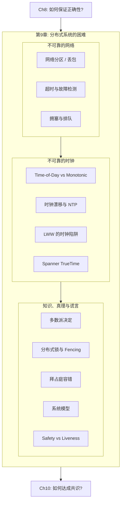

### 本章结构一览

| 小节 | 主题 | 关键概念 |
|------|------|---------|
| 9.1 | 部分故障与不确定性 | 单机确定 vs 分布式非确定、部分故障 |
| 9.2 | 不可靠的网络 | 丢包、延迟、TCP 局限、网络分区、故障检测、超时 |
| 9.3 | 不可靠的时钟 | Time-of-Day vs Monotonic、NTP 漂移、LWW 危险、TrueTime |
| 9.4 | 进程暂停 | GC、VM 迁移、磁盘 I/O、Lease 过期 |
| 9.5 | 知识与真理 | 多数派、Fencing Token、分布式锁正确用法 |
| 9.6 | 拜占庭容错 | 拜占庭将军问题、弱拜占庭防护 |
| 9.7 | 系统模型 | 同步/半同步/异步、crash-stop/crash-recovery、Safety vs Liveness |
## 9.1 部分故障与不确定性

### 单机 vs 分布式：确定性 vs 非确定性

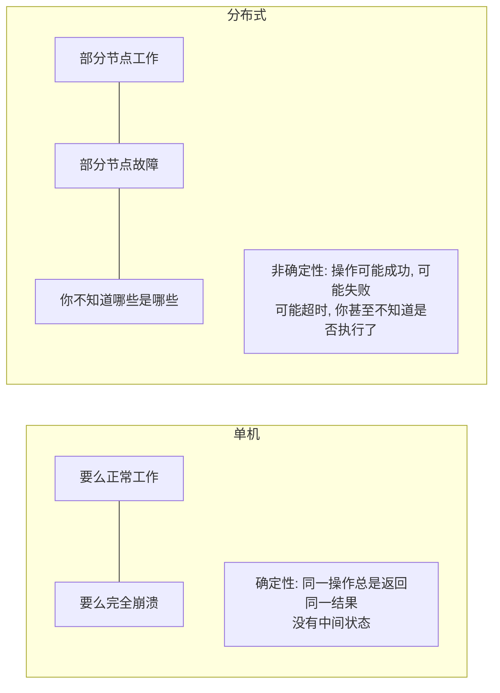

**部分故障 (Partial Failure)** 是分布式系统的本质特征：
- 系统的某些部分正常工作，某些部分以不可预测的方式故障
- 你可能**不知道**一个操作是成功还是失败——因为消息在网络中传输需要时间，无法瞬间知道远程节点的状态

### 为什么还要用分布式？

> 单机能做的事就用单机做——这是正确的默认选择。

但有三个理由必须使用分布式：
1. **可扩展性**：数据/负载超出单机能力
2. **容错/高可用**：单机故障 = 全局故障
3. **低延迟**：将数据放在离用户近的地方

**分布式的力量**：可以从不可靠的组件构建可靠的系统——就像 TCP 从不可靠的 IP 之上构建了可靠的传输一样。
## 9.2 不可靠的网络

### 六种可能出错的方式

当你发送请求并等待响应时：

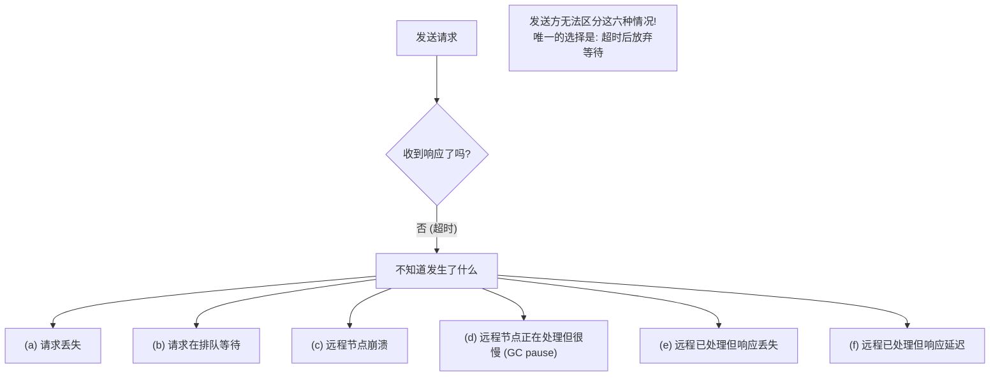

### TCP 也不能完全解决问题

TCP 提供"可靠传输"——重传丢失的包、保证顺序、检测损坏。但：
- TCP 连接关闭时，你不知道对方处理了多少数据 [6]
- TCP ACK 只说明内核收到了数据，不代表应用处理了
- 网线断了 → TCP 超时后才发现（可能几十秒）
- TCP 重连时，如果应用层也重试 → 可能重复执行操作

### 网络故障的真实案例

| 案例 | 说明 |
|------|------|
| 数据中心每月 ~12 次网络故障 [9] | 其中一半影响单机，一半影响整个机架 |
| 鲨鱼咬海底光缆 [13] | 现在有更好的屏蔽层了 |
| 奶牛踩光纤 [11] | 是的，这真的发生过 |
| 施工队挖断电缆 | 最常见的光纤中断原因 |
| 网络链路单向故障 [22] | A→B 通但 B→A 不通！ |
| 跨区域延迟达**数分钟** [18] | 不是毫秒，是分钟 |

### 故障检测与超时

**核心困境**：超时是检测故障的唯一可靠方式，但——

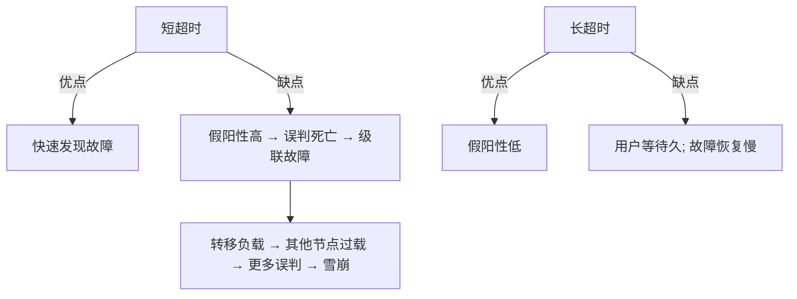

**误判节点死亡的后果**：
- 如果该节点正在执行操作 → 操作可能被**执行两次**（另一个节点接管后也执行一次）
- 如果该节点只是过载 → 转移其负载给其他节点 → 其他节点也过载 → **级联故障**

**自适应超时**：测量历史响应时间分布，动态调整超时阈值。Phi Accrual Failure Detector [32] 被 Akka 和 Cassandra [33] 使用。

### 网络拥塞与排队

网络延迟的变异性主要来自**排队**：


### 同步网络 vs 异步网络

| | 电话网络 (电路交换) | 互联网 (包交换) |
|--|---|---|
| 带宽分配 | **静态**：每个通话预留固定带宽 | **动态**：按需竞争 |
| 延迟 | 固定 (bounded delay) | 可变 (unbounded delay) |
| 资源利用率 | 低（空闲时也占用带宽） | 高（按需分配） |
| 适合 | 稳定带宽需求（语音） | 突发流量（Web、数据传输） |

> **网络延迟的不确定性不是自然法则，而是成本/收益的权衡**。我们选择了便宜且高利用率的包交换网络 → 代价是延迟不可预测。
## 9.3 不可靠的时钟

### 两种时钟

| | Time-of-Day Clock | Monotonic Clock |
|--|---|---|
| 用途 | 当前的日历时间 | 测量经过的时长 |
| API | `clock_gettime(CLOCK_REALTIME)`, `System.currentTimeMillis()` | `clock_gettime(CLOCK_MONOTONIC)`, `System.nanoTime()` |
| 同步 | NTP 同步（可能跳变） | 不需要同步 |
| 可比较? | 跨机器可比（如果同步良好） | 跨机器**不可比**（不同机器的值无关） |
| 会倒退? | **会**（NTP 强制重置、闰秒） | **不会**（保证单调递增） |
| 适合 | 事件时间戳（日志、审计） | 超时、性能测量 |

### 时钟为什么不可靠？

| 问题 | 影响 |
|------|------|
| **石英漂移** | 温度变化导致 ±200 ppm → 每 30 秒同步一次仍有 ~6ms 误差 [45] |
| **NTP 网络延迟** | NTP 精度受限于网络 RTT → 公网上误差可达 100ms+ |
| **NTP 服务器报错** | NTP 服务器本身时间错误 [47, 48] |
| **闰秒** | 一分钟可能是 59 秒或 61 秒 → 许多大系统曾因此崩溃 [40, 50] |
| **VM 时钟虚拟化** | VM 暂停时时钟也暂停 → 恢复后突然跳变 [54] |
| **NTP 防火墙** | NTP 被误封 → 时钟悄悄漂移，无人察觉 |

### LWW + 时钟偏斜 = 数据丢失

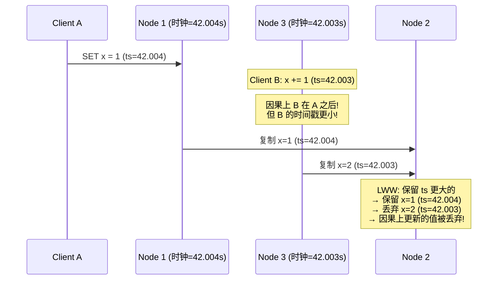

**结论**：**不要用物理时钟做因果排序**。用 Lamport 时钟或版本向量（逻辑时钟）替代。

### 时钟的置信区间

时钟读数不是一个精确的点，而是一个**置信区间**：

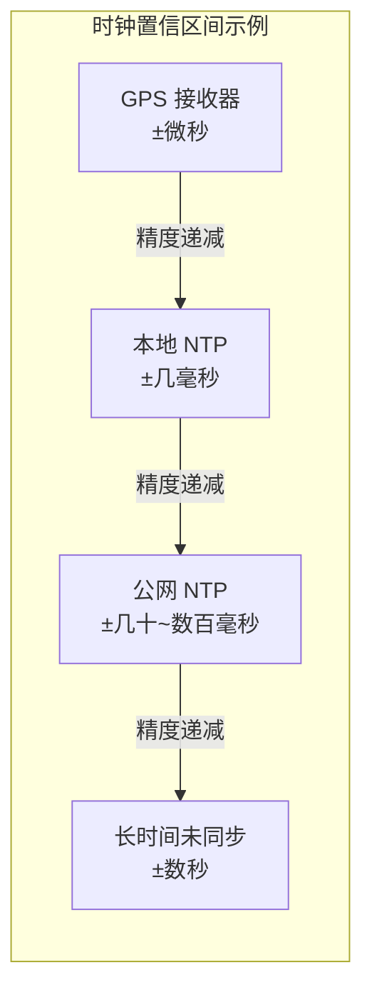

**Google Spanner 的 TrueTime** [45]：API 返回 `[earliest, latest]` 而非一个值。如果两个事务的置信区间不重叠 → 确定因果顺序。为缩短等待时间，Google 在每个数据中心部署 GPS 接收器 + 原子钟 → 置信区间 ~7ms。

Amazon ClockBound [61] 提供类似能力。YugabyteDB 可利用 ClockBound 在 AWS 上实现类 Spanner 的时钟保证 [70]。
## 9.4 进程暂停

### Lease 过期的危险

```java
// 看似正确的 Leader Lease 代码
while (true) {
    request = getIncomingRequest();
    // 确保 lease 至少还剩 10 秒
    if (lease.expiryTimeMillis - System.currentTimeMillis() < 10000) {
        lease = lease.renew();
    }
    if (lease.isValid()) {
        process(request);  // ← 如果这里暂停了 15 秒呢？
    }
}
```

**问题1**：`lease.expiryTimeMillis` 是远程机器设的，与本地时钟比较 → 时钟偏斜

**问题2**：即使用单调时钟，在 `isValid()` 返回 true 后、`process()` 之前，线程可能暂停 15 秒 → lease 已过期 → 另一个节点成为 Leader → 两个 Leader 同时写入 → **Split Brain！**

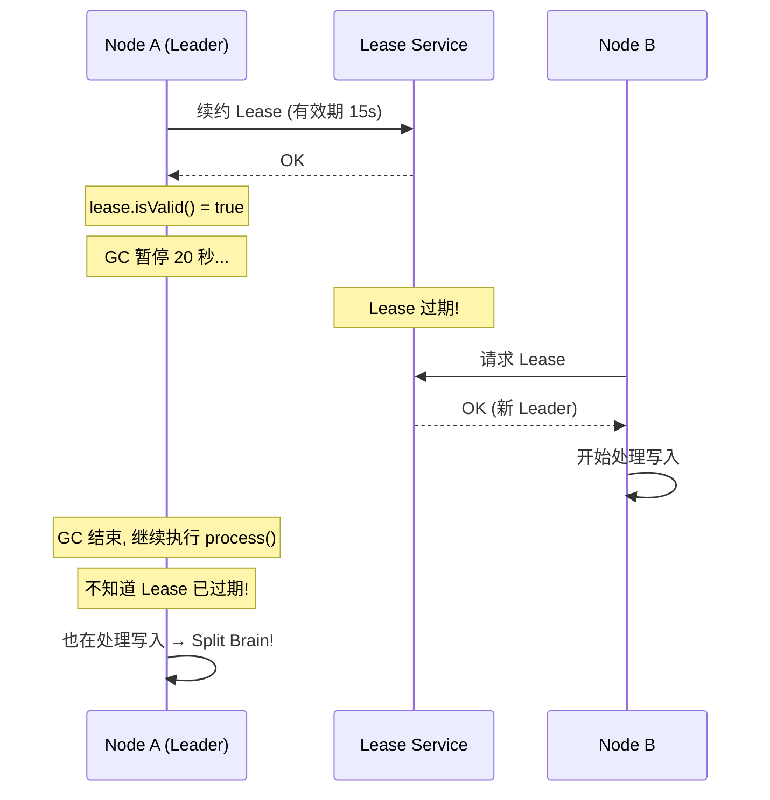

### 进程暂停的原因

| 原因 | 暂停时长 | 说明 |
|------|--------|------|
| **GC (Stop-the-world)** | 毫秒到分钟级 | JVM full GC 可暂停整个进程 [75] |
| **VM 暂停/迁移** | 秒到分钟级 | Live migration 保存内存到磁盘 → 恢复 |
| **磁盘 I/O** | 毫秒到秒级 | 同步 I/O、页面交换 (swap/thrashing) |
| **上下文切换** | 微秒级但积累 | VM steal time、CPU 过载 |
| **SIGSTOP 信号** | 任意时长 | 运维误操作 Ctrl-Z |
| **笔记本合盖** | 任意时长 | 移动设备休眠 |

> **核心结论**：线程可能在代码的**任意一行**被暂停任意时长，恢复后继续执行，完全不知道自己暂停过。这与多线程编程的并发问题类似，但分布式系统无法用 mutex 解决——因为没有共享内存。

### 缓解 GC 暂停的策略

| 策略 | 说明 |
|------|------|
| 使用无 GC 语言 | Rust (所有权)、Swift (引用计数)、C++ |
| 对象池复用 | 减少分配和回收频率 |
| **把 GC 暂停当作计划内停机** | GC 前通知其他节点停止发送请求 → GC 完成后恢复 [80, 81] |
| 只用短命对象 | 短命对象的 minor GC 很快；定期重启进程避免 full GC |
## 9.5 知识、真理与多数派

### 节点不能信任自己

> 一个节点**不能**仅凭自己的判断来做决定——因为它的判断可能是错的（时钟偏斜、GC 暂停后以为自己还是 Leader 等）。

**分布式系统的决定必须由多数派（quorum）做出**——即使某个节点自认为完全正常，如果多数派认为它死了，它就必须服从。

### 被"抬进棺材"的节点

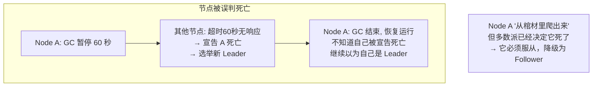

### 分布式锁的正确实现：Fencing Token

**错误实现**（无 Fencing）：

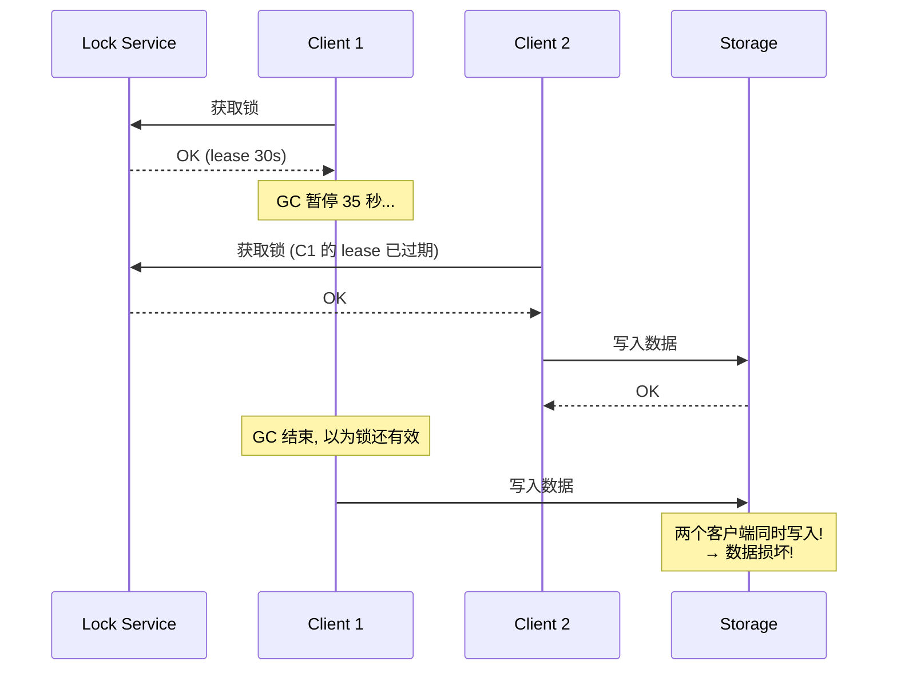

**正确实现**（Fencing Token）：

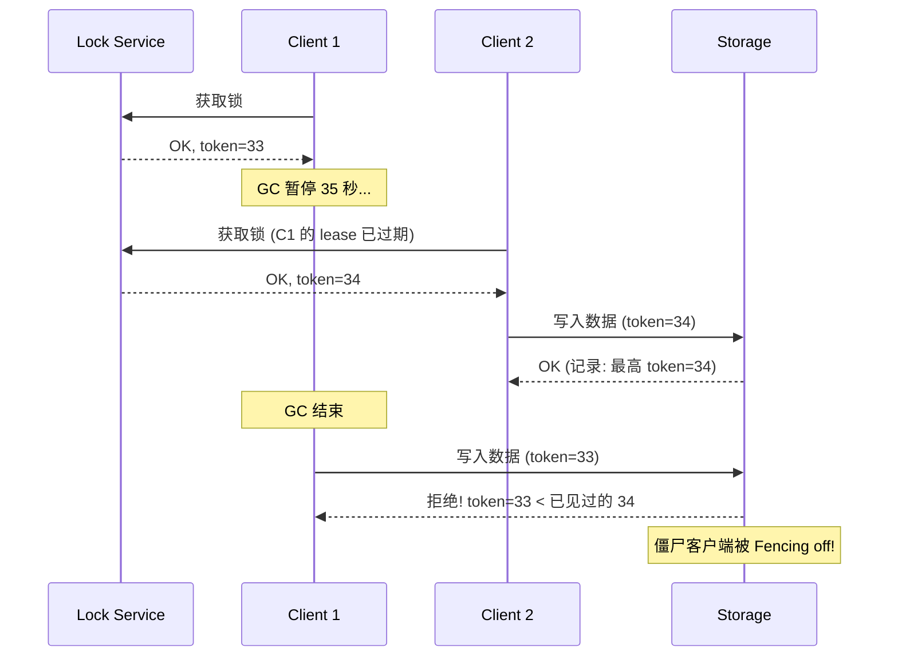

**Fencing Token 的要求**：
- Lock service 每次授予锁时返回一个**单调递增**的 token
- 存储服务必须检查 token：拒绝任何 token ≤ 已处理过的最大 token
- 也可利用 ZooKeeper 的 `zxid` 或 etcd 的 `revision` 作为 fencing token [89]
- 对象存储的 conditional write (S3 条件写入) 也能起类似作用 [93]

### Fencing with Multiple Replicas

如果存储服务本身是多副本的（如 leaderless 复制）→ 将 fencing token 嵌入写入时间戳的高位 → 所有带 token=34 的时间戳都大于 token=33 的 → 即使僵尸客户端写入了部分副本，quorum 读取也会选择 token=34 的更新值。
## 9.6 拜占庭容错

### 拜占庭故障 vs 非拜占庭故障

本书讨论的系统假设节点是**诚实但不可靠**的——可能崩溃、延迟，但不会故意说谎。

**拜占庭故障（Byzantine fault）**：节点可能发送虚假或矛盾的消息（恶意攻击或严重硬件故障）。

| 故障类型 | 行为 | 防御需求 |
|---------|------|---------|
| **Crash-stop** | 节点崩溃后永远不恢复 | 最简单的模型 |
| **Crash-recovery** | 节点崩溃后可能恢复 | 需要持久化状态 |
| **灰色故障 (Limping)** | 节点变慢但不崩溃 | 比崩溃更难检测 [110-114] |
| **拜占庭** | 节点可能做任何事（包括说谎） | 需要 ≥ 3f+1 个节点容忍 f 个拜占庭故障 |

### 何时需要拜占庭容错？

| 场景 | 是否需要 |
|------|---------|
| 航天/航空系统 [98, 99] | ✅ 辐射导致内存翻转 → CPU 返回错误结果 |
| 区块链 / 加密货币 [100] | ✅ 互不信任的参与方需要达成共识 |
| P2P 网络 | ✅ 无法信任其他节点 |
| **数据中心内部系统** | ❌ 节点由同一组织控制，可以信任（用传统安全机制：认证、防火墙、ACL） |

> 对于本书讨论的大多数系统（数据中心内的数据库、消息队列等），**不需要拜占庭容错**。

### 弱拜占庭防护（实用的"不完全信任"）

即使不做完整的拜占庭容错，也值得防范一些"弱说谎"：

| 措施 | 防范 |
|------|------|
| **网络校验和**（TCP/TLS） | 硬件故障导致的数据损坏 [105-107] |
| **输入验证** | SQL 注入、XSS、DoS |
| **NTP 多服务器** | 单个错误 NTP 服务器被检测为异常值并排除 [39] |
| **应用层校验和** | 即使 TCP 校验和通过，应用层再检查一次 |
## 9.7 系统模型、Safety vs Liveness、形式化验证与总结

### 系统模型

为了推理分布式算法的正确性，需要明确假设：

**时序模型**：

| 模型 | 假设 | 现实性 |
|------|------|--------|
| **同步 (Synchronous)** | 网络延迟、进程暂停、时钟漂移都有上界 | ❌ 不现实 |
| **半同步 (Partially synchronous)** | 大部分时间表现为同步，偶尔超出上界 | ✅ 最现实 |
| **异步 (Asynchronous)** | 无任何时序假设（甚至不能用超时） | 限制太强 |

**故障模型**：

| 模型 | 假设 | 说明 |
|------|------|------|
| **Crash-stop** | 节点崩溃后永不恢复 | 最简单 |
| **Crash-recovery** | 节点崩溃后可能恢复，内存丢失但磁盘保留 | ✅ 最常用 |
| **灰色故障 (Limping)** | 节点变慢但不崩溃 | 比崩溃更难处理 [110-114] |
| **拜占庭** | 节点可能做任何事 | 大多数系统不需要 |

> **最常用的组合**：半同步模型 + crash-recovery 故障。

### Safety vs Liveness

| | Safety | Liveness |
|--|--------|---------|
| **直觉** | "坏事永远不会发生" | "好事最终会发生" |
| **违反时** | 可以指向具体时刻 | 无法指向具体时刻（总是可以再等一等） |
| **例子** | 唯一性（fencing token 不重复）、一致性（不返回错误结果） | 可用性（请求最终收到响应）、最终一致性 |
| **在故障时** | **必须始终保持** | 可以暂时不满足（允许有条件地打折） |

> **分布式算法的目标**：在给定的系统模型中，始终保证 Safety 属性，尽可能保证 Liveness 属性。

### 形式化方法与混沌测试

| 方法 | 原理 | 代表工具 |
|------|------|--------|
| **TLA+ / 模型检查** | 用规范语言描述算法，穷举状态空间检查不变量 | TLA+, Gallina, FizzBee; 被 CockroachDB, TiDB, Kafka 使用 [124-126] |
| **确定性模拟测试 (DST)** | 替换 I/O、网络、时钟为确定性 mock → 大量随机执行 | FoundationDB (Flow), TigerBeetle; Antithesis [137] |
| **故障注入 (Chaos Engineering)** | 在真实环境中注入故障（网络、磁盘、进程） | Jepsen [131], Netflix Chaos Monkey [130] |

**确定性模拟测试 (DST)** 是第二版新增的重要话题——将所有非确定性（网络、时钟、线程调度）替换为可控的 mock → 可以重放失败场景、探索更多状态空间、速度远超真实时钟。

### 确定性的力量 (The Power of Determinism)

> 非确定性是所有分布式困难的根源——并发、网络延迟、进程暂停、时钟跳变，全都是非确定性的表现。如果能让系统确定性化，一切都简单了。

确定性在全书中反复出现：
- Event Sourcing (Ch3)：确定性地重放事件日志
- Durable Execution / Temporal (Ch5)：确定性地重放工作流
- State Machine Replication (Ch10)：确定性地在每个副本执行同一序列操作
- 串行执行事务 (Ch8)：确定性的存储过程

---

## 💻 代码示例与最佳实践

### 示例：正确使用分布式锁 (Redis + Fencing)

```python
import redis
import time

def acquire_lock_with_fencing(r: redis.Redis, lock_key: str, ttl_ms: int):
    """获取锁并返回 fencing token (使用 Redis INCR 实现单调递增)"""
    # 尝试获取锁
    token = r.incr("fencing_token_counter")  # 全局单调递增
    acquired = r.set(lock_key, token, nx=True, px=ttl_ms)
    if acquired:
        return token
    return None

def write_with_fencing(storage, key: str, value: str, token: int):
    """带 fencing token 的安全写入"""
    current_max = storage.get_max_token(key)
    if token <= current_max:
        raise Exception(f"Stale token {token} <= {current_max}, write rejected")
    storage.put(key, value, token)
```

### 最佳实践

| 场景 | 建议 |
|------|------|
| 测量时长（超时、性能） | 用 **monotonic clock**，不要用 time-of-day |
| 事件排序 | 用 **逻辑时钟**（Lamport / version vector），不要用物理时钟 |
| 分布式锁 | 必须配合 **fencing token** 使用 |
| 故障检测 | 使用自适应超时（Phi Accrual），不要用固定超时 |
| Leader 选举 | 使用共识协议（Raft/Paxos），不要自己实现 |
| 测试 | 结合模型检查 + DST + 故障注入（Jepsen/Chaos Engineering） |

---

## 🎯 系统设计面试题

### 面试题1：如何正确实现分布式锁？

**参考答案**：
1. 使用共识系统（ZooKeeper / etcd）获取锁，获得单调递增的 fencing token
2. 每次写操作携带 fencing token
3. 存储服务检查 token：拒绝 token ≤ 已见最大 token 的写入
4. **不要用 Redis SET NX 做分布式锁**除非配合 fencing — Redlock 的安全性存在争议 [91, 92]

### 面试题2：为什么不能用物理时钟做 LWW？

**参考答案**：
- 物理时钟有漂移（石英 ±200ppm）、NTP 跳变、闰秒等问题
- 时钟偏斜可能导致因果上更晚的写入反而时间戳更小 → 被 LWW 丢弃
- 替代方案：逻辑时钟（Lamport clock / version vector）保证因果正确性
- Google Spanner 用 TrueTime（GPS + 原子钟）+ 置信区间 → 但需要特殊硬件

---

## 📝 本章要点总结

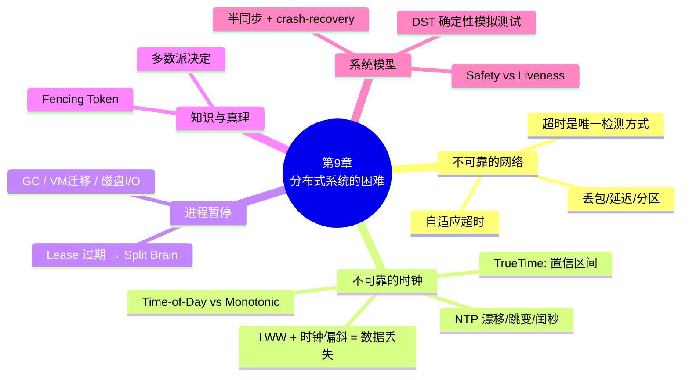

### 核心主线

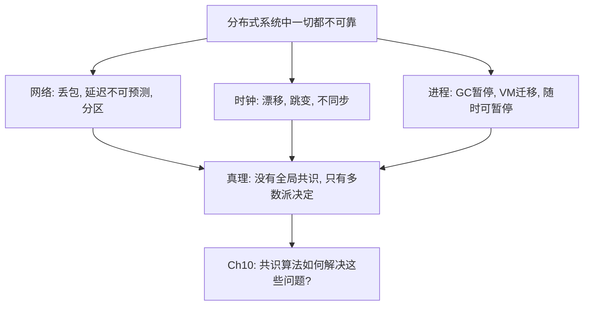

### 八大 Takeaways

1. **部分故障是分布式的本质**：不像单机的全有或全无，分布式系统的某些部分可能在你不知道的情况下故障

2. **超时是故障检测的唯一方式**，但太短导致假阳性（误判死亡 → 级联故障），太长导致恢复慢。使用自适应超时

3. **网络延迟没有上界**：异步网络中延迟可以任意长。TCP 提供顺序和重传，但不保证延迟

4. **物理时钟不可信**：NTP 漂移、跳变、闰秒。测量时长用单调时钟；事件排序用逻辑时钟

5. **Spanner TrueTime 是物理时钟的极限**：GPS + 原子钟 → 置信区间 ~7ms → 用置信区间不重叠来确定因果顺序

6. **进程可以在任意一行暂停任意时长**：GC、VM、磁盘 I/O、SIGSTOP → Lease 过期时你可能毫不知情

7. **分布式锁必须配合 Fencing Token**：否则 GC 暂停或网络延迟的僵尸客户端可以破坏数据

8. **半同步 + crash-recovery 是最实用的系统模型**；Safety 必须始终保证，Liveness 可以暂时打折

### 连接下一章

