# 第9章：分布式系统的困难 (The Trouble with Distributed Systems)

> *"They're funny things, Accidents. You never have them till you're having them."*
> — A.A. Milne, *The House at Pooh Corner* (1928)

[[ch02]] 讲过：让系统可靠 = 即使出了故障（fault），系统整体仍继续工作。但**预判所有可能的故障并处理**没那么容易。开发者很容易只关注"正常路径"（毕竟大多数时候好好的！），忽略故障带来的无数边界情况。**想做容错系统，必须彻底转变心态、把悲观主义调到最大**——专注"会出什么错"，哪怕概率只有百万分之一。足够大的系统里，百万分之一的事件每天都在发生。老练的运维会告诉你：**凡是可能出错的，终将出错。**

分布式系统和单机编程**根本不同**——主要区别在于"会以许多新奇的方式出错" [1,2]。本章把悲观主义拉满，探索分布式系统里各种可能出错的事（网络、时钟、时序），以及你能/不能依赖什么。第 10 章再讲如何在这些问题面前实现容错。

---

## 🗺️ 章节导航

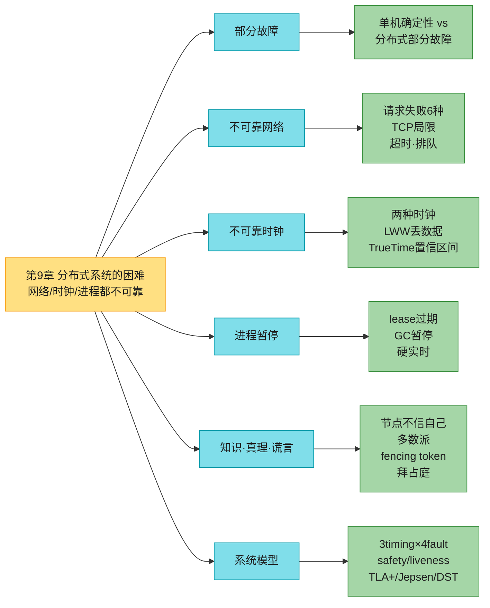

---

## 1. 部分故障与不确定性 (Faults and Partial Failures)

### 1.1 单机的"确定性幻觉" vs 分布式的"部分故障"

写单机程序时，它通常表现得很可预测：要么工作要么不工作。**单机软件本没有理由不稳定**——硬件正常时，同样操作永远产生同样结果（**确定性**）。硬件出问题（内存损坏、连接松动），后果通常是**整体故障**（内核恐慌、蓝屏、无法启动）。**一台软件良好的计算机，要么全好要么全坏，不会介于之间。**

> 📝 **这是计算机的刻意设计**：内部出故障时，**宁可彻底崩溃也不返回错误结果**（错误结果难处理又迷惑）。所以计算机隐藏了底层模糊的物理现实，呈现一个**数学般完美的理想模型**：CPU 指令永远做同一件事；写内存/磁盘的数据保持完好不腐化。（[[ch02]]讲过：现实中数据确实会静默腐化、CPU 偶尔返回错结果，只是足够罕见可以忽略。）

**一旦软件跑在多台联网的机器上，情况根本不同**：分布式系统里故障频繁得多，没法忽略——必须直面物理世界的混乱。混乱的范围惊人，看 Coda Hale 的亲身经历 [3]：

> *"在我有限的经历里，处理过：单数据中心内的长期网络分区、PDU（电源分配单元）故障、交换机故障、整机架意外断电、整个 DC 主干网故障、整个 DC 断电、还有一个低血糖司机开福特皮卡撞进 DC 的 HVAC（空调）系统。我甚至都不是运维。"*

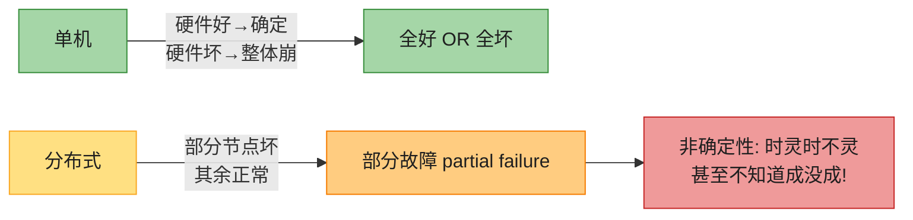

**部分故障 (partial failure)**：系统某些部分以不可预测的方式坏了，其他部分正常。难点在于**部分故障是非确定性的**——涉及多节点和网络的操作，可能有时成功、有时不可预测地失败，**甚至你可能不知道到底成没成！** 这种非确定性和部分故障的可能性，正是**分布式系统难搞的根源** [4]。

### 1.2 为什么还要用分布式？

部分故障反过来也是**机会**：能容忍部分故障 → 能**滚动升级**（一次重启一个节点装补丁，整体不中断）。**容错让我们用不可靠的组件搭出可靠的系统**——分布式系统可以比单机更可靠。但要先了解要容忍的故障。**分布式系统里，怀疑、悲观、偏执是有回报的。**

---

## 2. 不可靠的网络 (Unreliable Networks)

本书的分布式系统多是 **shared-nothing**：一堆机器靠网络连。网络是它们**唯一的通信方式**（每台机器有自己的内存/磁盘，不能直接访问别人的——除非通过网络请求服务；即便是共享对象存储，也是经网络通信）。

> 📝 **名词注释：异步分组网络 (asynchronous packet network)**
> 互联网和大多数数据中心网络（常为以太网）都是异步分组网络：一个节点可向另一个发消息（分组），但**网络不保证何时到达、甚至是否到达**。这和"打电话"式的同步网络完全不同（§2.6 详谈）。

### 2.1 请求失败的六种方式（Figure 9-1）

发请求等响应时，很多事会出错：

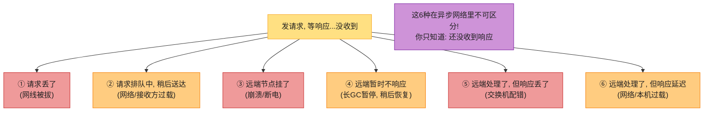

**发送方连包有没有送达都不知道**。唯一办法是接收方回个响应——而响应又可能丢/延迟。**这些情况在异步网络里不可区分**，你唯一的信息是"还没收到响应"。所以发请求没响应时，**不可能知道为什么**。

> 📝 **名词注释：超时 (timeout)**
> 处理上述问题的常规手段：**过一段时间就放弃等待，假定响应不会来了**。但超时时你**仍然不知道远端有没有收到请求**（请求可能还在队列里，稍后仍会送达）。超时是分布式系统里**唯一可靠**的故障检测手段——但它的"可靠性"也只是"我决定不等了"，不是"对方真死了"。

### 2.2 TCP 的局限（"可靠"的真相）

网络包有最大尺寸（一般几 KB），应用消息常太大装不下一个包，所以大多用 **TCP**：建连接、把大数据流拆成包、接收端拼回。

> 📝 本文关于 TCP 的论述大多也适用于 **QUIC**、WebRTC 的 SCTP、BitTorrent 的 uTP 等。UDP 的对比见 §2.5。

TCP 常被描述为提供"可靠"传输：检测并重传丢包、检测乱序并重排、用校验和检测损坏、**拥塞控制/流控/背压** [5]（自动调节发送速率，快但不压垮网络/接收方）。

**但"可靠"不代表网络从此无忧**：

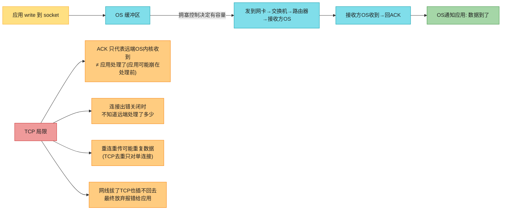

**关键**：即便收到包的 ACK，只代表**远端 OS 内核**收到了——**应用可能在处理前就崩了**。想确认请求成功，**必须从应用本身拿到正面响应** [7]。TCP 有用（方便收发大消息、连接复用），但不消除网络的不可靠。

### 2.3 网络故障的真实案例（比你想的常见得多）

我们建了几十年网络，还没搞定可靠性。系统研究和大量轶事表明：**即便在受控的数据中心，网络问题也惊人地常见** [8]：

- 一项中型 DC 研究发现**每月约 12 次网络故障**，一半断单机、一半断整机架 [9]。
- 另一项研究测交换机/负载均衡器故障率 [10]：**加冗余网络设备降故障不如预期**——挡不住**人为错误**（如交换机配错），这是宕机主因。
- **广域光纤中断**被归咎于**牛** [11]、**海狸** [12]、**鲨鱼** [13]（不过鲨鱼咬少了，因海底电缆屏蔽改进 [14]）。人也常是祸首：误配置 [15]、拾荒 [16]、蓄意破坏 [17]。
- 跨云 region 的高百分位**往返延迟可达数分钟** [18]；单 DC 内交换机软件升级触发拓扑重配时，**包延迟可超 1 分钟** [19]。**必须假设消息可能被任意延迟。**
- 通信可能**部分中断**：A↔B 通、B↔C 通，但 A↔C 不通 [20,21]；网卡可能**只发不收** [22]——**链路单向通不保证反向也通。**
- 短暂网络中断的**影响可能比原问题持续更久** [8,20,23]。

> 📝 **名词注释：网络分区 (network partition / netsplit)**
> 网络故障把网络的一部分和其余切断。这和其他网络中断**没有本质区别**。⚠️ **网络分区 ≠ 存储分片（第7章也叫 partitioning）**——两码事。
>
> 🏧 **如果不定义/不测试网络故障的错误处理，可能发生任意坏事**：集群死锁、永久无法服务 [24]、甚至**删光你的数据** [25]。软件被放进未预料的情况，会做任意未预料的事。

> **处理网络故障 ≠ 必须容忍它**。网络通常较可靠时，"出问题时给用户报错"也是合理策略。但你**必须知道软件对网络问题作何反应**，确保系统能恢复。值得**故意触发网络问题测试响应**（见 §6.3 故障注入）。

### 2.4 故障检测（Fault Detection）

很多系统需自动检测故障节点：负载均衡器要把死的剔除轮询；单主库 leader 挂了要提升 follower（[[ch06]]）。但网络的不确定性让"判断节点是否在工作"很难。

**少数情况下能拿到明确的"不工作"反馈**：
- 能连到机器但目标端口无进程监听（进程崩了）→ OS 回 RST/FIN 拒绝连接。
- 节点进程崩了但 OS 还活着 → 脚本通知别节点（如 HBase [26]），免等超时。
- 能访问交换机管理接口 → 查硬件链路故障（公网/共享 DC 不可用）。
- 路由器确定 IP 不可达 → 回 ICMP Destination Unreachable（但路由器也没魔法检测力）。

**但这些都靠不住**。出问题时可能在栈某层拿到错误响应，但**一般得假设完全无响应**。可重试几次、等超时、超时则判死。由于节点可能其实活着，要**在假阳性（误判活节点死）和假阴性（漏判死节点）间权衡**：超时太短→误判活节点死；太长→等死节点白等。

### 2.5 超时与无界延迟（超时到底设多长？）

长超时 → 判死等得久（用户等/看报错）；短超时 → 检测快但易把"临时慢"（负载尖峰）误判成死。

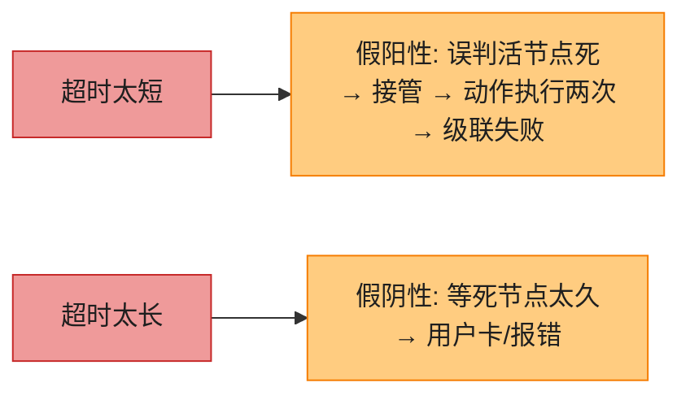

**过早判死的危害**：节点其实活着、正在做事（如发邮件），另一节点接管 → 动作可能做两次（§5 详谈）。把死节点的负载转给别的节点，若系统本就高负载，**误判会引发级联失败**（极端：所有节点互相判死，全停——[[ch02]] 亚稳态）。

> **理想情况**：若网络保证最大延迟 d、节点保证 r 内处理完 → 超时设 `2d + r`。但现实系统**没这些保证**：异步网络无界延迟，服务器也保证不了最大处理时间。**快"大多数时候"不够**——超时低的话，一次往返延迟尖峰就够搞乱系统。

#### 网络拥塞与排队

包延迟的变异性最常来自**排队** [27]：

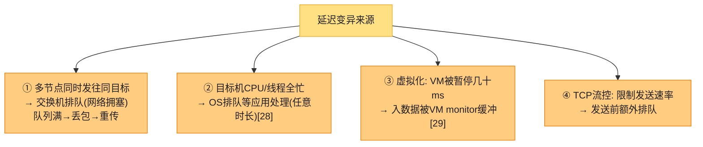

接近满载时排队延迟范围特别大。公有云/多租户 DC 里资源被多客户共享，**"吵闹邻居"** 用大量资源时你的网络延迟高度可变 [30,31]。

#### 深入：超时怎么设 + Phi Accrual 自适应故障检测

> **超时只能实验确定**：长期、跨多机测量往返延迟分布，结合应用特性权衡"检测延迟 vs 误判风险"。
>
> **更好的做法**：不用固定超时，而是**持续测量响应时间及其抖动，按观测分布自动调整超时**。**Phi Accrual 故障检测器** [32]（Akka、Cassandra 在用 [33]）就是这种思路——输出一个"怀疑度"（连续值）而非"死/活"二值，应用按阈值决策。TCP 重传超时也类似 [5]。

> 📝 **名词注释：TCP vs UDP**
> 视频会议/VoIP 等**延迟敏感**应用用 UDP 而非 TCP：UDP 不做流控、不重传丢包，**避免了部分延迟变异**（但仍受交换机排队/调度影响）。**延迟的数据没价值时 UDP 合适**：VoIP 里丢包没时间重传，用静音填充缺失时段，重试发生在"人类层"（"你刚说什么？信号断了"）。

### 2.6 同步网络 vs 异步网络（电话网为什么能保证延迟）

如果能靠网络保证固定最大延迟、不丢包，分布式系统会简单得多。为什么不在硬件层解决？对比**传统固定电话网**（非蜂窝、非 VoIP）——极其可靠，通话延迟恒定低、掉话罕见。

> **电话网靠"电路交换 (circuit switching)"**：打电话时建立一条**电路**——沿整条路由分配**固定保证的带宽**，直到挂机 [34]。如 ISDN 网固定 4000 帧/秒，通话建立时每帧分配 16 bit 空间（双向）→ 通话期间每侧保证每 250µs 能发 16 bit 音频 [35]。
>
> 这种网络是**同步的**：数据过多个路由器也**不排队**（下一跳的 16 bit 空间已预留）→ **端到端最大延迟固定（有界延迟 bounded delay）**。

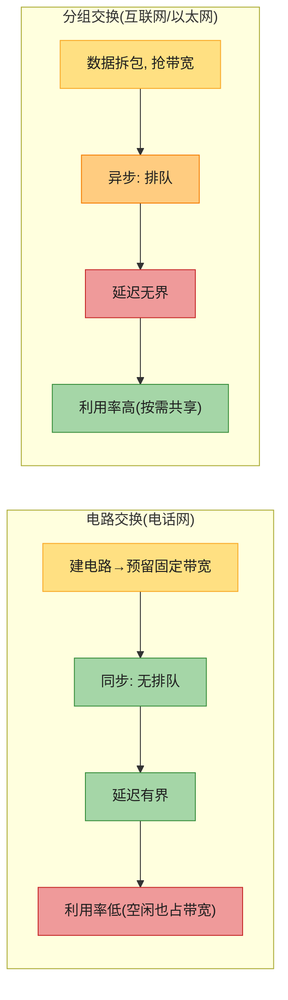

#### 深入：延迟与资源利用率的权衡（为什么互联网选了分组交换）

> **电路 ≠ TCP 连接**：电路是固定预留带宽（闲置也占）；TCP 连接 Opportunistic 地用可用带宽（闲置不占带宽）。
>
> **为什么数据中心和互联网用分组交换？优化突发流量 (bursty traffic)**：打电话/视频需恒定 bit/秒（电路合适）；但请求网页/发邮件/传文件**没特定带宽要求，只想尽快完成**。电路传文件得猜带宽——猜低则慢浪费容量，猜高则建不起来（带宽保不了）。TCP **动态适配**可用容量。
>
> **更一般地：可变延迟是动态资源分配的代价。** 静态分配（专用硬件、独占带宽）→ 延迟有保证但利用率低（贵）；动态分配（多租户）→ 利用率高（便宜）但延迟可变。**可变延迟不是自然规律，是成本/效益权衡。** CPU 线程调度、云平台多 VM 共享物理机同理 [36]。

> 🏭 **混合尝试**：ATM（1980s 以太网竞争对手）支持电路+分组，未普及；**InfiniBand** 链路层端到端流控减少排队 [37,38]；QoS（优先级/调度/准入控制）可在分组网上仿真电路或统计有界延迟 [27,34]；**L4S** 新算法缓解排队/拥塞。但这些在**多租户 DC 和公网未启用**——当前技术对网络延迟/可靠性无保证，必须假设拥塞、排队、无界延迟会发生。**所以超时没有"正确"值，只能实验定。**

---

## 3. 不可靠的时钟 (Unreliable Clocks)

时钟很重要。应用靠时钟回答：超时了吗？99 分位响应时间？最近5分钟QPS？用户在站点待了多久？文章何时发布？提醒邮件何时发？缓存何时过期？日志时间戳？

注意：**1-4 测量持续时间（间隔）**，**5-8 描述时间点**。分布式系统里时间是难题，因为**通信不瞬时**——消息穿越网络要时间，何时收到总晚于何时发出，但延迟可变，不知晚多少。这让我们难定多机事件的先后。而且**每台机器有自己的时钟**（石英晶体振荡器），不精确，各机时间略有快慢。

> 📝 **名词注释：NTP (Network Time Protocol)**
> 最常用的时钟同步机制：让计算机时钟按一组服务器报告的时间调整 [39]，服务器又从更准的源（如 GPS）获取时间。

### 3.1 两种时钟（千万别混用！）

现代计算机至少两种时钟，**用途不同，必须区分**：

| 时钟 | API | 特点 | 适用 |
|------|-----|------|------|
| **墙上时钟 time-of-day** | Linux `clock_gettime(CLOCK_REALTIME)`、Java `System.currentTimeMillis()` | 返回自 epoch（1970-01-01 UTC）以来的秒/毫秒；**可能被 NTP 重置、跳回（闰秒/DST）**；跨机（理想）含义一致 | 时间点（发布日期、过期、时间戳） |
| **单调时钟 monotonic** | Linux `CLOCK_MONOTONIC`、Java `System.nanoTime()` | **保证单调前进**（绝不后退）；绝对值无意义（如启动后纳秒）；NTP 只调速不跳变；**跨机不可比** | 测量持续时间（超时、响应时间） |

> ⚠️ **关键铁律**：① **测量耗时用单调时钟**（墙上时钟会跳，测出来可能是负数！）；② **跨机比较用墙上时钟**（但知道它不准）；③ **绝对不要混用**——单调时钟绝对值在不同机器上含义不同。

> 📝 **名词注释：NTP slewing vs jumping**
> - **slewing（微调）**：NTP 若发现本机石英偏快/慢，**调整走时频率**（默认最多 ±0.05%），单调时钟只会被 slew，**不跳变**。
> - **jumping（跳变）**：本机时钟偏离 NTP 太远时，**强行重置**——墙上时钟可能**跳回过去**或突跳未来。这种跳变让墙上时钟**不能测耗时** [40]。

### 3.2 时钟为什么不可靠（8 条残酷真相）

让时钟报准时间远没你想的可靠 [39-56]：

```mermaid
flowchart TD
    BAD["时钟不可靠的来源"] --> B1["① 石英漂移: 随温度变<br/>Google假设≤200ppm<br/>(每30s同步→6ms漂移; 每天→17s)[45]"]
    BAD --> B2["② 偏离NTP太多→拒绝同步或强制重置<br/>→ 看到时间倒退/突跳"]
    BAD --> B3["③ NTP被防火墙隔离→漂移累积成大偏差<br/>(常被忽视很久)"]
    BAD --> B4["④ NTP精度受网络延迟限<br/>(公网最好~35ms, 拥塞可超1s)[46]"]
    BAD --> B5["⑤ 部分NTP服务器本身错/配错<br/>(差几小时!)[47,48] 客户端查多服务器剔除异常"]
    BAD --> B6["⑥ 闰秒→某分钟59或61秒<br/>(已让大量系统崩溃)[40,50]<br/>2035起将停用闰秒"]
    BAD --> B7["⑦ VM: 硬件时钟虚拟化<br/>暂停→时钟突跳[29]; NTP客户端不知暂停→误报精度[55]"]
    BAD --> B8["⑧ 不可控设备(手机/嵌入式)<br/>用户故意调错时间(游戏作弊)[56]"]
    style BAD fill:#FFE082,stroke:#F9A825,color:#1f1f1f
    style B1 fill:#EF9A9A,stroke:#C62828,color:#1f1f1f
    style B2 fill:#EF9A9A,stroke:#C62828,color:#1f1f1f
    style B3 fill:#EF9A9A,stroke:#C62828,color:#1f1f1f
    style B4 fill:#FFCC80,stroke:#F57C00,color:#1f1f1f
    style B5 fill:#EF9A9A,stroke:#C62828,color:#1f1f1f
    style B6 fill:#EF9A9A,stroke:#C62828,color:#1f1f1f
    style B7 fill:#FFCC80,stroke:#F57C00,color:#1f1f1f
    style B8 fill:#FFCC80,stroke:#F57C00,color:#1f1f1f
```

> 🏧 **Cloudflare 闰秒事故 [40]**：2017 年闰秒让 Cloudflare DNS 的部分代码假设崩溃（duration 算出负数），导致全球 DNS 解析受影响。闰秒问题将在 2035 年消失，但在此之前必须处理（NTP 服务器"撒谎"——把闰秒摊到一天内 = smearing [51,52]）。
>
> 🏧 **想很准？得砸钱**：MiFID II 金融法规要求高频交易时钟同步到 UTC 100µs 内 [57]，靠 **GPS 接收器/原子钟 + PTP（精密时间协议）+ 精心部署监控** [58,59]。但 **GPS 可被干扰**（军事设施附近常发生）[60]。部分云厂商开始提供高精度时钟同步 VM [61]。

### 3.3 深入：LWW + 时钟偏斜 = 数据丢失（Figure 9-3 手算）

依赖时钟最诱人又最危险的场景：**跨节点事件排序**。多主库（[[ch06]]）里两个客户端谁先写？哪个更新？

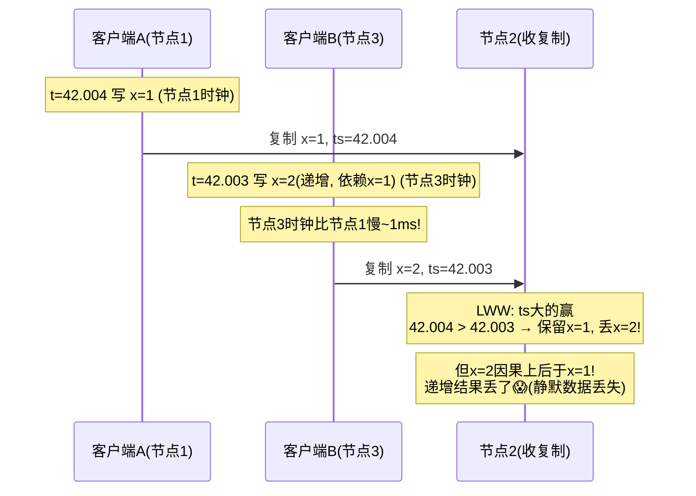

**问题**：B 的写在**因果上后于** A（B 递增的是 A 写的值），但 B 的**时间戳更小**（节点3时钟慢）。**LWW（最后写胜）会丢掉因果上更新的写**——而且**无任何错误上报，静默数据丢失** [62,63,65]。

**Cassandra/ScyllaDB 直接用客户端时钟时间戳 + LWW** [62]，有严重问题：
- **写神秘消失**：钟慢的节点写不进钟快节点之前写的值，直到偏斜时间过去——**任意量数据被静默丢**。
- **分不清"快速顺序写"和"真并发写"**——需版本向量等因果追踪（[[ch06]]）。
- **同时间戳**（毫秒精度）需额外 tiebreaker（大随机数），仍可能违反因果 [62]。

> 🏧 **结论**：NTP 再准也保证不了正确排序——**NTP 精度本身受网络往返限制**，而要正确排序需时钟误差远小于网络延迟，**不可能**。**逻辑时钟 [66]**（基于计数器而非石英）是排序事件的安全替代（[[ch06]] 版本向量、第10章）。逻辑时钟不测时刻/秒数，只测相对顺序。墙上/单调时钟叫**物理时钟**。

### 3.4 时钟置信区间 + TrueTime

你能以微秒/纳秒**分辨率**读时钟，但**精度 ≠ 准度**——很可能不准。石英漂移即便每分钟同步也可能差几毫秒；公网 NTP 最好几十毫秒，拥塞易超 100ms。

**所以时钟读数不该当"一个时间点"，而该当"一个置信区间内的范围"** [67]——如 95% 确信现在在 10.3–10.5 秒之间。若只知 ±100ms，时间戳的微秒位**毫无意义**。

> 📝 **名词注释：TrueTime / ClockBound（带置信区间的时钟 API）**
> 大多数系统不暴露时钟误差（`clock_gettime` 不告诉你置信区间）。**例外**：
> - **Google Spanner 的 TrueTime API** [45]：`TT.now()` 返回 `[earliest, latest]`——当前时间必在此区间。区间宽度取决于距上次与更准时钟源同步的时长。
> - **Amazon ClockBound**：类似，报告本地钟置信区间。
> - **YugabyteDB 在 AWS 上用 ClockBound** [70]；多个系统开始不同程度依赖时钟同步 [71,72]。

### 3.5 深入：Spanner 用同步时钟做全球快照

[[ch08]] 讲过快照隔离需要**单调递增的事务 ID**。单节点用简单计数器即可；**分布式下跨所有分片的全局单调递增 ID 难产**（要协调，成瓶颈）。能用墙上时钟时间戳当 ID 吗？后发生的事务时间戳更大——理想。**问题在时钟不准。**

**Spanner 跨 DC 实现快照隔离** [68,69]，靠 TrueTime 的置信区间：

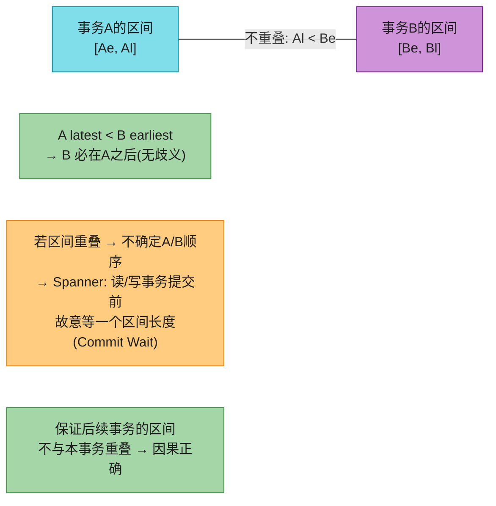

**核心观察**：两个置信区间**不重叠**（`A_latest < B_earliest`）→ B 必在 A 之后；**重叠**则顺序不明。Spanner 在提交读/写事务前**故意等一个区间长度**（Commit Wait），确保任何可能读到该数据的事务都在足够晚的时间、区间不重叠。为缩短等待，Google **每个 DC 部署 GPS/原子钟**，把时钟同步到约 **7ms** 内 [45]。

> 🏧 **原子钟不是必须的**——重要的是**有置信区间**，准的时钟源只是让区间小。**CockroachDB 没有原子钟** [71]，靠更大的不确定性窗口和不同的机制（HLC 混合逻辑时钟）；**Spanner 用 TrueTime 是为了更短的等待、更高的性能**。

---

## 4. 进程暂停 (Process Pauses)

另一个危险的时钟用例。单主分片库：只有 leader 能接写。节点怎么知道自己**还是** leader（没被别人判死）、可以安全接写？

**办法**：leader 从其他节点获取**租约 (lease)**——类似带超时的锁 [73]。任一时刻只有一个节点持租约。持租约 = 一段时间内是 leader，到期前须续约；节点挂了停止续约，到期后别人接管。请求处理循环像这样：

```java
while (true) {
    request = getIncomingRequest();
    // 确保租约至少还有10秒
    if (lease.expiryTimeMillis - System.currentTimeMillis() < 10000) {
        lease = lease.renew();
    }
    if (lease.isValid()) {
        process(request);   // ⚠️ 危险!
    }
}
```

### 4.1 这段代码错在哪？

**错1**：依赖同步时钟——过期时间由**另一台机器**算（当前时间+30s），却和**本地钟**比较，钟差几秒就出怪事。

**错2**：即便改用本地单调钟，仍假设"检查时间到 `process(request)` 之间几乎不耗时"。通常很快，10秒缓冲绰绰有余。**但若发生意外的暂停呢？**

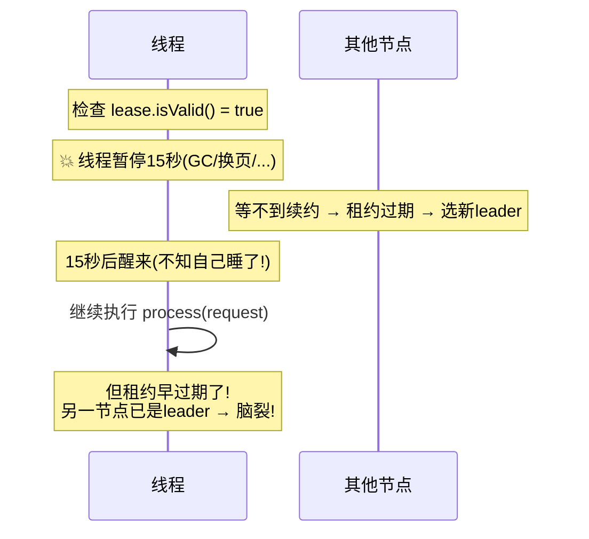

线程在 `lease.isValid()` 附近停了 15 秒，醒来时租约早过期、别人已接管 leader——**但线程不知道自己暂停过**，继续处理请求，**做出不安全的事**。

### 4.2 深入：进程暂停的 8 个原因

线程被任意抢占、稍后恢复而不自知，原因很多：

| 原因 | 说明 |
|------|------|
| **① 锁/队列争用** | 等共享资源，多核机更糟、难诊断 [74] |
| **② GC 停顿** | JVM 等 GC 偶尔 stop-the-world，过去可达**几分钟** [75]！现代 GC 改善但仍明显 |
| **③ VM 挂起/恢复** | 虚拟化下 VM 可 suspend（内存存盘）后 resume，任意时刻、任意时长；用于**热迁移** [76] |
| **④ 端设备挂起** | 笔记本合盖、手机息屏 |
| **⑤ 上下文切换** | OS 切别的线程，或 hypervisor 切别的 VM（**steal time**）；高负载下被切走的线程要等很久才再跑 |
| **⑥ 同步磁盘 I/O** | 等慢盘；Java 类加载器首次用类时隐式读盘；I/O 暂停 + GC 暂停可能叠加 [78]；网络盘（EBS）还受网络延迟变异性影响 [31] |
| **⑦ 换页 (paging/thrashing)** | 内存访问触发缺页→从盘加载；内存压力大可能**疯狂换页 (thrashing)**；服务器常禁用换页 |
| **⑧ SIGSTOP 信号** | `Ctrl-Z` 或运维误发，立即停给 CPU 直到 SIGCONT |

> **节点必须假设自己执行可能任意时刻长时间暂停**。暂停期间外部世界照转、甚至因它不响应而判它死。最终它醒来，**直到某刻查钟才知自己睡过**。

### 4.3 响应时间保证（硬实时）与 GC 缓解

暂停原因**若努力消除是可以避免的**。**硬实时系统 (hard real-time)**——控制飞机/火箭/机器人/汽车——必须在截止期内响应，否则灾难（安全气囊不能因 GC 暂停延迟）。

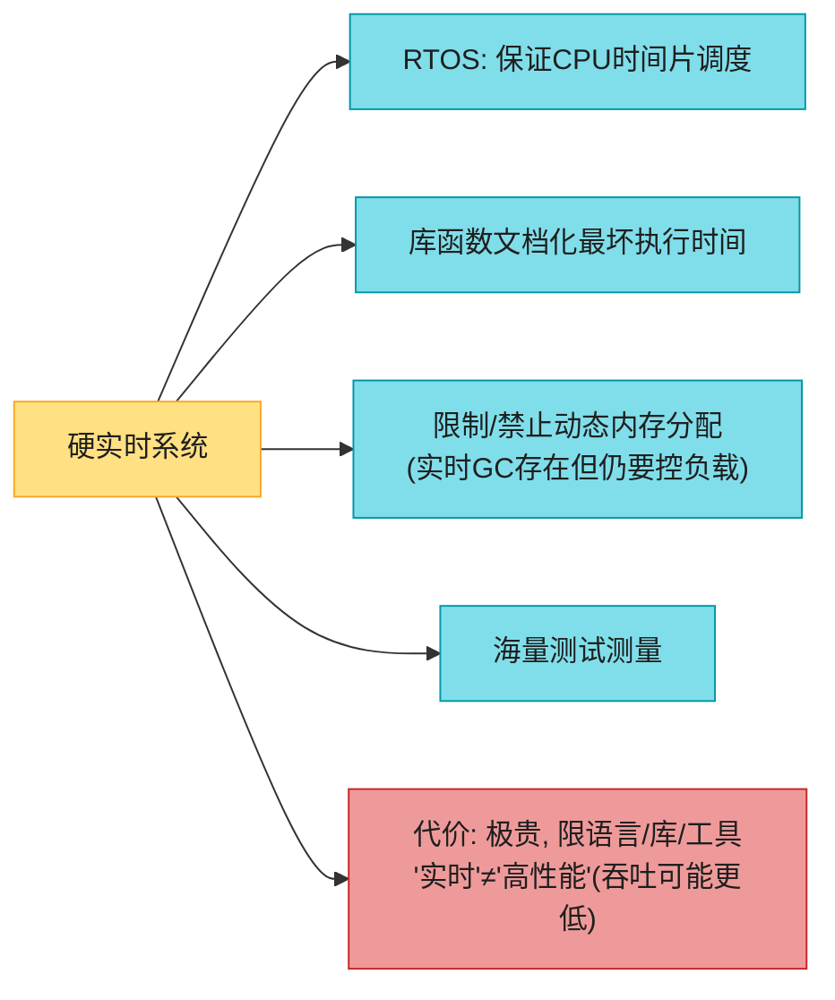

**大多数服务端数据处理系统，实时保证既不经济也不合适** → 只能忍受暂停和时钟不稳。

#### 缓解 GC 暂停影响

GC 曾是暂停主因 [79]，现代算法（CMS、G1、ZGC、Epsilon、Shenandoah）调好后通常只暂停几毫秒。Go 用更简单的并发标记清除。**完全避免 GC**：用 **Swift（ARC）/ Rust（类型系统追踪生命周期）/ Mojo** 等无 GC 语言。

> 🏧 **在 GC 语言里减影响**：
> - **对象池化复用**、**堆外分配**。
> - **把 GC 暂停当"计划内节点短暂下线"**：GC 前让其他节点接管请求。运行时若能在 GC 前**警告应用**，应用就停止发新请求给它、等它处理完在途请求、再 GC——**对客户端隐藏 GC 暂停** [80,81]。
> - **只让 GC 管短命对象**，定期重启进程（在长命对象积满触发全 GC 前），像滚动升级一样逐节点重启 [79,82]。
> - **Roblox 宕机案例 [74]**：线程争用导致系统雪崩式暂停，是真实大规模事故。

---

## 5. 知识、真理与谎言 (Knowledge, Truth, and Lies)

到此，分布式系统的后果极其让人迷失：**节点对其他节点无法确知任何事**——只能基于收到（或没收到）的消息猜测；只能靠交换消息了解远端状态；远端不响应时，**无法区分网络问题还是节点问题**。这些讨论近乎哲学：系统里什么是真什么是假？我们多确信？软件系统该遵守物理世界的因果律吗 [83]？

好在不用追究人生意义——我们可以**声明系统假设（系统模型）**，设计系统满足这些假设，算法可证明在该模型下正确。

### 5.1 节点不能信任自己（三个噩梦场景）

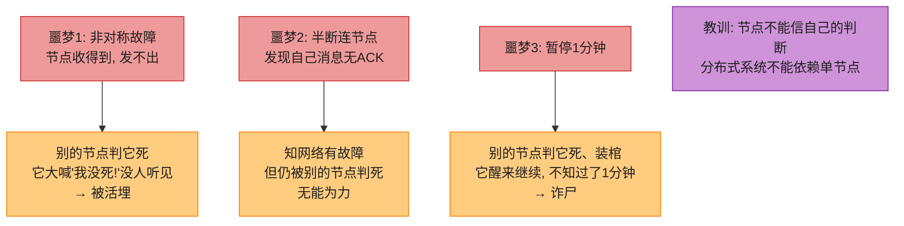

### 5.2 多数派规则 (The Majority Rules)

分布式算法不靠单节点，而靠 **quorum（法定人数投票）**（[[ch06]]）：决策需**多个节点的最少票数**，降低对单节点的依赖。**包括"判某节点死"的决策**——多数判它死，它就必须当自己死（哪怕它自觉活着）。节点必须服从 quorum 决定、让位。

最常见是**绝对多数（过半）**：3 节点容忍1故障、5 节点容忍2故障。**安全**因为系统里只能有一个多数——不可能同时有两个相互冲突的多数。第 10 章共识算法详谈。

### 5.3 分布式锁与租约（极易用错）

锁和租约是分布式应用的常见 bug 源 [84]。租约 = 带超时的锁，老持有者失联（崩溃/暂停/断网）后可分配给新持有者。用于保证"只有一个 X"：只一个 leader（防脑裂）、只一个事务改某资源、只一个节点处理某输入文件。

**若多个节点同时以为持有租约**（因暂停），后果视场景：浪费算力（可忍）；**丢失/损坏数据（严重）**。

#### 深入：Fencing Token 完整工作原理（防僵尸 + 防延迟请求）

> 📝 **名词注释：僵尸 (zombie)**
> 曾持有租约、还没发现自己丢了租约、仍像当前持有者一样行动的节点。没法完全排除僵尸，但能确保它**造不成脑裂的损害** = **fencing off the zombie（围栏挡僵尸）**。

Figure 9-4：客户端1 获租约写文件，长暂停→租约过期→客户端2 获租约写同文件→客户端1 醒来以为还有效继续写→**文件损坏**（HBase 曾有此 bug [85,86]）。

**解法 = Fencing Token（围栏令牌）**（Figure 9-6）：锁服务每次授权返回一个**单调递增的 fencing token**。客户端写给存储服务时**必须带当前 token**。存储服务记住已处理的**最大 token**，拒绝更小的。

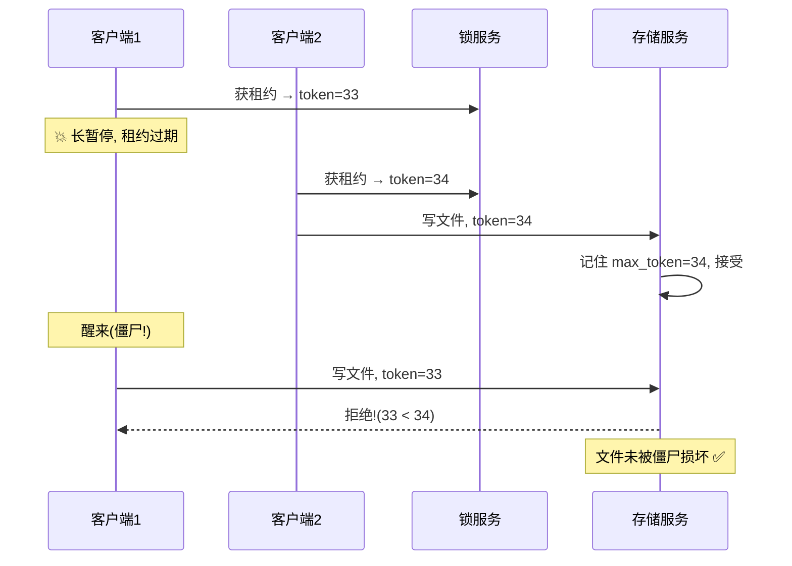

> 📝 **名词注释：fencing token 的别名**
> **Chubby** 叫 sequencer [88]、**Kafka** 叫 epoch number、共识算法里 **Paxos 的 ballot number / Raft 的 term number** 起同样作用。
>
> 🏧 **实际产品**：**ZooKeeper** 用 `zxid` 或 `cversion` 当 fencing token [85]；**etcd** 用 revision + lease ID [89]；**Hazelcast** 的 FencedLock API 显式生成 fencing token [90]。**Amazon S3 conditional writes / Azure Blob conditional headers / GCS request preconditions** 支持类似 CAS 检查——可作为 fencing 的底层。

#### Figure 9-5：延迟请求也能造成腐败（fencing 同样防护）

不只暂停——**客户端1 崩溃前发的写请求被网络延迟很久**（包可能延迟 1 分钟+），到达时租约已过期、客户端2 已接管。同样腐败。**Fencing token 对延迟请求同样有效**（token=33 < 34 被拒）。

#### 用 fencing token 保护多副本（Figure 9-7）

若客户端只需写一个支持条件写的存储服务，**锁服务其实是多余的** [91,92]——租约分配可直接基于该存储（如 S3 条件写选主 [93]）。但有了 fencing token，就能跨**多个服务/副本**防僵尸。

> 无主 LWW 库（[[ch06]]）里，把 fencing token 放时间戳**高位**：新持有者的所有时间戳（34…）必大于老持有者的（33…），即便老持有者写更晚。少数副本被僵尸写过也不怕——quorum 读会偏好新时间戳，read repair / 反熵最终覆盖。

#### 深入：Redlock 论战（Kleppmann vs antirez）

> 🏧 **Redlock**（Redis 分布式锁算法 [92]）2016 年引发著名论战：
> - **Martin Kleppmann 批 [91]**：Redlock 依赖时钟同步，但 §3 证明时钟不可靠；进程暂停（§4）会让持有者以为还有效；Redlock **没有 fencing token**，无法防僵尸损坏。**Redlock 在需要正确性的场景不安全**。
> - **antirez（Salvatore Sanfilippo）反驳 [92]**：实际部署时钟够准；可加 fencing；Redlock 设计目标是性能非绝对正确。
>
> **结论**：**效率型锁**（避免重复工作）Redlock 够用；**正确性型锁**（防数据损坏，如 leader 写、金融）**必须用基于共识的（ZooKeeper/etcd）+ fencing token**，Redlock 不够。这是 §3/§4 知识的实战检验。

### 5.4 拜占庭故障 (Byzantine Faults)

Fencing token 能挡**无心之失**的节点（不知租约过期）。但若节点**故意**想破坏（发假 fencing token），就挡不住了。

> 📝 **本书假设：节点不可靠但诚实**——可能慢/不响应（故障）、状态过时（GC/网络延迟），但**一旦响应就说真话**、按规矩办事。若节点可能"说谎"（发任意错误/腐败响应）——如选举投多张矛盾票——问题难得多。这叫**拜占庭故障 (Byzantine fault)**，在此环境下达成共识叫**拜占庭将军问题** [94]。

#### 拜占庭将军问题

**两将军问题** [95]：两将军靠信使通信定作战计划，信使会延迟/丢失（像网络包）。**拜占庭版**：n 个将军，多数忠诚说真话，**少数是叛徒**会发假消息迷惑别人，事先不知谁是叛徒。（"拜占庭"取"过度复杂、诡计多端"之意，Lamport 为不冒犯任何民族而选 [96,97]。）

#### 何时需要拜占庭容错 (BFT)？

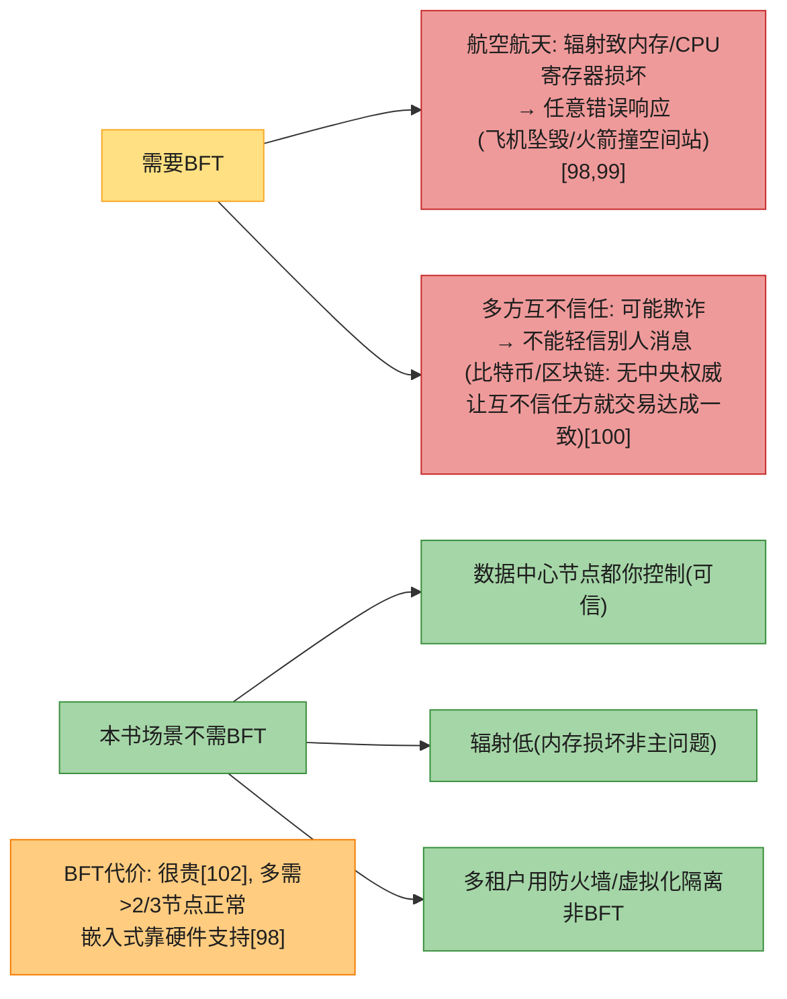

> ⚠️ **Web 应用要对客户端（浏览器）预期任意恶意行为**——所以输入校验/转义/转义输出至关重要（防 SQL 注入/XSS）。但这里不用 BFT 协议，而是**让服务器当权威**决定客户端能/不能做什么。**P2P 网络**（无中央权威）BFT 更相关 [103,104]。
>
> ⚠️ **软件 bug ≠ 拜占庭**：同软件部署所有节点，BFT 救不了你（同 bug 各节点都有）。BFT 算法多需 >2/3 节点正常——用它防 bug 得有**4 套独立实现**且期望 bug 只在 1 套。安全漏洞/攻击同理（攻陷一个节点大概率能攻陷全部，因同软件）——**传统手段（认证/访问控制/加密/防火墙）仍是主力**。

#### 弱形式的"说谎"防护

虽假设节点诚实，但加些防**弱"说谎"**（硬件/bug/误配置导致的无效消息）的机制仍值得——非完整 BFT 但简单实用：
- **包损坏**：偶逃过 TCP/UDP 校验和 [105-107]。应用层校验和、TLS 加密防护。
- **输入校验**：公网应用须严格净化用户输入（防注入/范围检查/限大小）；内部服务也建议协议解析层基本检查 [105]。
- **NTP 多服务器**：客户端配多 NTP 服务器，同步时全查、估误差、查多数服务器时间范围一致——误配置的服务器被当异常值剔除 [39]，比单服务器鲁棒。

---

## 6. 系统模型与现实 (System Model and Reality)

算法要不依赖硬件/软件细节，需**形式化预期故障** = 定义**系统模型**。

### 6.1 三种 timing 模型 × 节点故障模型

**timing 假设（3 种）**：

| 模型 | 假设 | 现实性 |
|------|------|--------|
| **同步 (synchronous)** | 网络延迟有界、进程暂停有界、时钟误差有界 | ❌ 不现实（无界延迟/暂停确实发生） |
| **部分同步 (partially synchronous)** | 大多数时候像同步，偶尔超界 [108] | ✅ **最实用** |
| **异步 (asynchronous)** | 不做任何 timing 假设（甚至没时钟、不能用超时） | 很受限 |

**节点故障模型（4 种）**：

| 模型 | 假设 |
|------|------|
| **崩溃-停止 (crash-stop)** | 节点只能崩溃，崩了永不回来 |
| **崩溃-恢复 (crash-recovery)** | 可崩、未知时间后恢复；磁盘（稳定存储）跨崩溃保留，内存状态丢 |
| **降级/跛行 (limping/gray failure/fail-slow)** [110-113] | 不崩但慢/部分功能失效（网卡驱动 bug 掉到 1Kb/s、内存压力狂 GC、SSD 磨损、高温/松动/振动/电源/固件 bug）；**比干净崩溃更难处理** |
| **拜占庭 (arbitrary)** | 节点可做任何事，包括欺骗 |

> **建模式系统，"部分同步 + 崩溃-恢复"最实用**——允许无界网络延迟、进程暂停、慢节点。

### 6.2 算法正确性：Safety vs Liveness

定义算法正确性 = 写下它的**属性 (properties)**。如生成 fencing token 的算法应有：

| 属性 | 含义 | 类型 |
|------|------|------|
| **唯一性 (uniqueness)** | 没两个 token 请求返回同值 | **Safety** |
| **单调序列 (monotonic)** | 若请求 x 先于 y 完成，则 `tx < ty` | **Safety** |
| **可用性 (availability)** | 请求 token 且不崩的节点最终收到响应 | **Liveness** |

#### 深入：Safety vs Liveness（含 "eventually" 彩蛋）

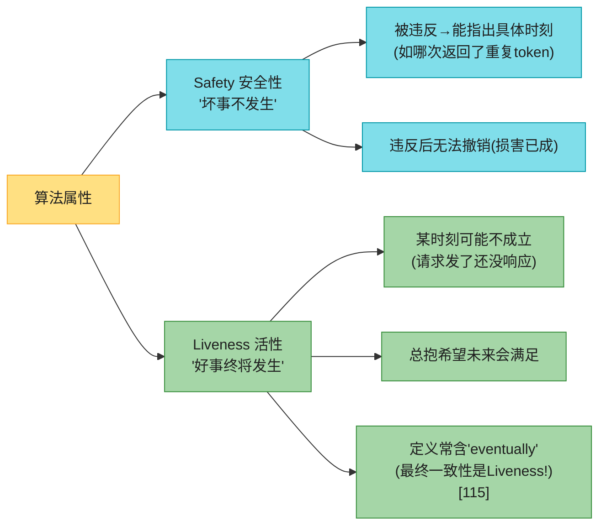

**区分的价值**：应对困难系统模型。分布式算法**Safety 必须**所有情况成立 [108]——即便所有节点崩溃、全网瘫痪，也**绝不返回错误结果**。**Liveness 允许附加条件**——如"只有多数节点没崩、网络最终恢复时"才需响应。部分同步模型要求系统**最终**回到同步态（网络中断持续有限时长后修复）。

#### 系统模型 vs 现实

理论模型是现实的简化抽象。实现时现实会咬人：崩溃-恢复模型假设磁盘数据跨崩溃幸存——但磁盘损坏/误配置擦除怎么办 [117]？固件 bug 重启后认不出硬盘 [118]？Quorum 算法靠节点记住声称存过的数据——**失忆**（忘了存过的）就破坏 quorum 正确性。可能需新模型："稳定存储大多数情况幸存、偶尔丢失"——但更难推理。

> 📝 **理论与实践**：理论可声明某些事"假设不发生"；非拜占庭系统确实要区分能/不能发生的故障。但**现实实现仍可能要处理"假设不可能"的事**，哪怕处理就是 `printf("算你倒霉"); exit(666)` 让人收拾 [119]——**这是计算机科学和软件工程的区别之一**。抽象系统模型**并非无用**——恰恰相反，它把现实复杂性蒸馏成可管理的故障集，让我们系统理解和解决问题。

### 6.3 深入：形式化方法与随机化测试

怎么知道算法满足属性？并发/部分故障/延迟让状态空间巨大，要保证所有状态都满足、无遗漏边角。

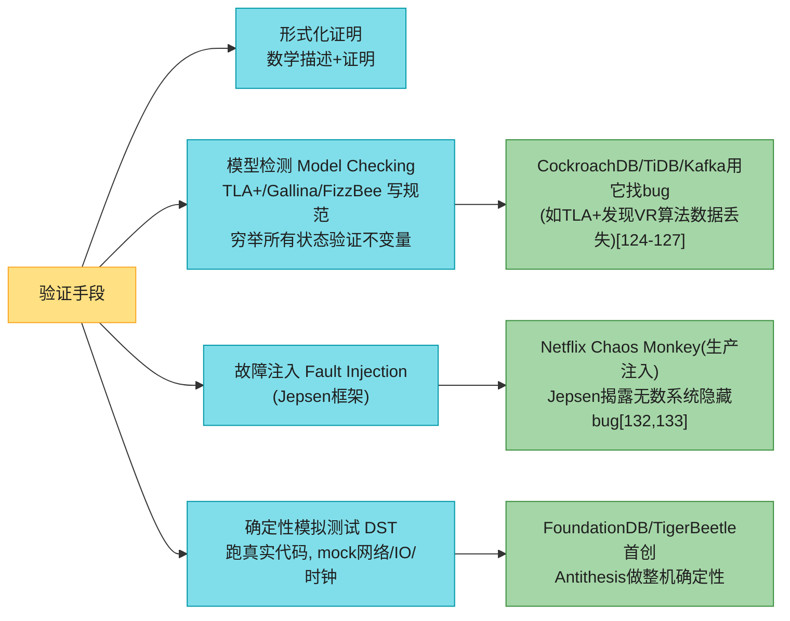

**模型检测 (Model Checking)**：用 TLA+/Gallina/FizzBee 写算法规范，工具系统探索状态空间验证不变量。不能证明无限状态空间，但鼓励降为可全验证的近似或设上限。**CockroachDB、TiDB、Kafka 等用它找修 bug** [124-126]——如 TLA+ 发现 viewstamped replication (VR) 算法散文描述的歧义可能导致数据丢失 [127]。局限：检测的是**模型**非真实代码，可能和实现脱节 [128]。

**故障注入 (Fault Injection)**：往运行系统注入故障（网络/机器/磁盘/暂停）看反应。**Netflix Chaos Monkey** 在**生产环境**注入 [130]，开创**混沌工程 (chaos engineering)**。**Jepsen** 框架 [131] 简化故障注入测试，**揭露过无数流行系统的严重 bug** [132,133]。

#### 深入：确定性模拟测试 (DST) 与确定性的力量

**DST (Deterministic Simulation Testing)**：用类似模型检测的状态空间探索，但**跑真实代码**。模拟时网络通信/I/O/时钟全换成 mock，模拟器控制确切发生顺序（含各种时序/故障），探索比手写测试/故障注入多得多的场景。测试失败可重跑（模拟器知道确切触发顺序）。

让代码确定性的三种策略：

| 策略 | 做法 | 代表 |
|------|------|------|
| **应用层** | 从头按可确定性执行设计 | **FoundationDB**（Flow 异步库，DST 先驱 [134]）、**TigerBeetle**（状态机 + 单事件循环 [135]） |
| **运行时层** | 单线程运行时强制异步代码串行；换确定性库 | FrostDB patch Go 运行时 [136]；Rust **MadSim**（Tokio/S3/Kafka 的确定性实现） |
| **机器层** | 整机确定性（自定义 hypervisor） | **Antithesis**（时钟/网络/存储全确定性，容器跑整个分布式系统） |

> 📝 **名词注释：确定性的力量 (The Power of Determinism)**
> **非确定性是本章所有挑战的核心**——并发、网络延迟、暂停、时钟跳、崩溃都以不可预测方式发生。**反过来，让系统确定性能极大简化问题。** 确定性是分布式设计中反复出现的强思想：
> - **Event Sourcing**（[[ch03]]）：确定重放事件日志重建物化视图。
> - **工作流引擎**（[[ch05]] 持久化执行）：靠工作流定义的确定性提供持久执行语义。
> - **状态机复制**（第10章）：每个副本独立执行同一序列的确定性事务来复制数据——本章已见两变体：语句级复制（[[ch06]]）、串行执行存储过程（[[ch08]]）。
>
> ⚠️ **完全确定性要小心**：即便去掉了并发、I/O/网络/时钟/随机数，仍有残留非确定性——如某些语言哈希表遍历顺序不定、是否撞资源限制（内存分配失败/栈溢出）也不定。

---

## 🏭 生产级产品速查表（时钟/故障检测/锁）

| 产品 | 时钟方案 | 故障检测 | 分布式锁/选主 | 特色/坑 |
|------|---------|---------|-------------|---------|
| **Spanner** | **TrueTime**（GPS+原子钟，误差<7ms）+ Commit Wait | Paxos 心跳 | Paxos lease | 外部一致性；原子钟非必须但提升性能 |
| **CockroachDB** | 无原子钟，靠 HLC（混合逻辑时钟）+ 不确定性窗口 | Raft 心跳 | Raft lease + epoch | 牺牲延迟换无需特殊硬件 [71] |
| **YugabyteDB** | AWS 上用 **ClockBound** | Raft | Raft | [70] |
| **Cassandra** | 客户端时钟时间戳 + LWW | Phi Accrual [33] | 无（无主） | 时钟漂移→静默丢写 [62] |
| **ZooKeeper** | zxid（事务ID） | 心跳 + session | 临时节点 + zxid 当 fencing | 工业级锁服务标杆 |
| **etcd** | revision + lease | Raft 心跳 | lease + revision fencing | K8s 用它 |
| **Redis Sentinel/Redlock** | 时钟同步假设 | 主观/客观下线 | Redlock（无 fencing） | 正确性场景不安全 [91] |
| **Hazelcast** | — | — | **FencedLock**（显式 fencing）[90] | — |
| **FoundationDB** | — | — | — | **DST 先驱**（Flow 模拟）[134] |
| **TigerBeetle** | — | — | — | 金融 DB，**一等 DST 支持** [135] |

### 🏧 真实事故速查

- **Cloudflare 闰秒 [40]**：2017，闰秒让 DNS 代码 duration 算负，全球解析受影响。
- **GitHub 宕机 [19]**：交换机升级触发拓扑重配，包延迟超 1 分钟。
- **HBase 文件损坏 [85,86]**：分布式锁无 fencing，僵尸客户端写坏文件。
- **Roblox 大宕机 [74]**：线程争用导致系统雪崩式暂停，长时间服务中断。
- **Cassandra 静默丢写 [62]**：客户端时钟漂移 + LWW，写无错误地消失。
- **Cloudflare 拜占庭故障 [20]**：真实世界的非对称/部分网络分区。

---

## 💻 代码示例与最佳实践

### 示例 1：正确的分布式锁（fencing token，伪代码）

```python
# ❌ 错误: 无 fencing, 僵尸客户端会损坏数据
def write_with_lock_bad(key, value):
    lock = acquire_lock(key)        # 获锁
    # 💥 此处若长暂停/GC, 锁过期, 别人获锁
    write_to_storage(key, value)    # 醒来继续写 → 脑裂损坏!
    release_lock(lock)

# ✅ 正确: 带 fencing token
def write_with_lock_good(key, value):
    token = acquire_lock_with_fencing(key)   # 返回单调递增 token
    # 即便暂停醒来, storage 会拒绝过期 token
    ok = write_to_storage(key, value, fencing_token=token)
    if not ok:
        raise LockLostException("租约已过期, 重试")  # 别硬写
    release_lock(lock)
```

```python
# 存储服务侧(如 S3 conditional write / 自建)
def write_to_storage(key, value, fencing_token):
    last_token = get_last_token(key)
    if fencing_token <= last_token:
        return False   # 拒绝僵尸/延迟请求
    write(key, value)
    set_last_token(key, fencing_token)
    return True
```

### 示例 2：测量耗时必须用单调时钟

```java
// ❌ 错误: 用墙上时钟测耗时(NTP跳变/闰秒 → 可能负数!)
long start = System.currentTimeMillis();
doWork();
long elapsed = System.currentTimeMillis() - start;   // 可能 < 0!

// ✅ 正确: 单调时钟
long start = System.nanoTime();    // 单调, 不受NTP跳变影响
doWork();
long elapsedMs = (System.nanoTime() - start) / 1_000_000;
```

### 示例 3：监控时钟偏移（NTP 健康）

```bash
# 检查本机与NTP服务器的偏移
ntpq -p
#   remote  refid   st t when poll reach delay offset jitter
#   *ntp1   .GPS.    1 u  64  128  377  0.5  +0.2  0.1
# offset = 本机与服务器偏差(ms), 应在几十ms内
# 若 offset 超过几百ms → 告警! 偏离太大应把节点判死[62]

# Prometheus 监控时钟偏移(各节点Exporter暴露)
# clock_offset_seconds > 0.05 持续5分钟 → 告警
```

### 最佳实践

- **网络**：超时只能实验定；用 Phi Accrual 自适应；处理网络故障≠容忍，但必须知道软件如何反应；故障注入测试。
- **时钟**：测耗时用单调钟；跨机排序别依赖墙上钟（用逻辑钟/版本向量）；监控各机时钟偏移，偏太大判死；闰秒用 smearing NTP。
- **进程暂停**：假设任意时刻可能长暂停；GC 用低暂停收集器（ZGC/Shenandoah），或 GC 前转移流量；关键路径避免同步磁盘 I/O；禁用换页。
- **锁/租约**：正确性场景用共识锁（ZK/etcd）+ **fencing token**；效率场景 Redlock 够；别假设"只一个节点持锁"。
- **故障**：用混沌工程/Jepsen 测；监控跛行节点（gray failure）；Safety 属性必须始终成立，Liveness 可带条件。

---

## 🎯 系统设计面试题

### 面试题 1：如何正确实现分布式锁？（高频）

**答**：见 §5.3。核心：
1. **效率型**（避免重复工作）：Redis Redlock 够，容忍偶尔双持。
2. **正确性型**（防数据损坏）：① 用共识服务（ZooKeeper/etcd）保证锁互斥；② **必须带 fencing token**——存储服务拒绝过期 token 的写，防僵尸客户端和延迟请求；③ 租约（带超时）防持有者永久持有；④ 客户端写前必须确认仍持锁，写失败（锁丢失）必须停止。
3. **别依赖时钟**：Redlock 依赖时钟同步，暂停会让持有者误判——正确性场景不安全（Kleppmann 论证 [91]）。
4. **甚至不需要锁**：若只写一个支持条件写（CAS）的存储（如 S3 conditional write），锁服务多余 [91-93]。

### 面试题 2：为什么不能用物理时钟做事件排序（LWW）？

**答**：见 §3.3。① 时钟漂移（Google 假设 200ppm，每天 17 秒）；② NTP 精度受网络延迟限，公网最好几十 ms；③ 节点间偏斜可能让"因果上后"的写时间戳更小 → LWW 静默丢数据（Figure 9-3 手算）；④ 闰秒/跳变。**正确做法**：用**逻辑时钟**（Lamport 时钟、版本向量、HLC）追踪因果，不依赖物理时间。Spanner 用 TrueTime 置信区间 + Commit Wait 是少数例外（靠 GPS/原子钟把误差压到 7ms）。

### 面试题 3：超时设多少合适？

**答**：见 §2.5。① **没有"正确"值**——异步网络延迟无界。② **实验定**：长期、跨多机测往返延迟分布（P99/P99.9），权衡"检测延迟 vs 误判风险"。③ **更好：自适应**——Phi Accrual 持续测响应时间/抖动，按分布动态调整怀疑度。④ **权衡**：太短→误判活节点死→接管→动作执行两次/级联失败；太长→用户等/报错。⑤ 高负载时宁可保守（更长），避免火上浇油。

### 面试题 4：Safety 和 Liveness 的区别？为什么重要？

**答**：见 §6.2。**Safety**：坏事不发生；被违反能指出具体时刻、不可撤销（如唯一性、单调性）。**Liveness**：好事终将发生；某刻可能不成立但总有希望（常含 "eventually"，如最终一致性、可用性）。
**重要性**：分布式算法要求 **Safety 必须所有情况成立**（即便全网瘫也不返回错结果），**Liveness 可附条件**（如"多数节点没崩+网络最终恢复时"）。这让算法在最坏情况下仍保证不损坏数据，只是可能暂时不可用。这是设计容错算法的核心框架。

### 面试题 5：如何保证分布式系统的正确性（测试）？

**答**：见 §6.3。四层：
1. **形式化证明**：数学证明算法正确。
2. **模型检测**（TLA+）：写规范，穷举状态空间找 bug（CockroachDB/TiDB/Kafka 用）。
3. **故障注入/混沌工程**（Jepsen/Chaos Monkey）：往运行系统注入网络/节点/磁盘故障，看反应（Jepsen 揭露无数 bug）。
4. **确定性模拟测试 DST**（FoundationDB/TigerBeetle/Antithesis）：mock 网络/IO/时钟，跑真实代码，可控可重放。
**组合使用**：理论分析 + 经验测试。生产前都过一遍。

---

## 📚 精选文献

> 原书本章引用 136 篇，这里只留最值得读的。

- **[3] Coda Hale. "You Can't Sacrifice Partition Tolerance" (2010).** 短文，分布式系统故障不可避免的经典论述（含皮卡撞 HVAC 轶事）。必读入门。
- **[8] Bailis & Kingsbury. "The Network Is Reliable" (ACM Queue 2014).** 系统梳理网络故障的真实数据和研究——"网络很可靠"是错觉。
- **[45] Corbett et al. "Spanner" (OSDI 2012).** TrueTime API、Commit Wait、外部一致性的源头。[[ch08]] 也引过，本章看时钟部分。
- **[66] Lamport. "Time, Clocks, and the Ordering of Events in a Distributed System" (1978).** 分布式系统最著名论文。逻辑时钟、happens-before。**必读**。
- **[91] Kleppmann. "How to Do Distributed Locking" (2016).** 对 Redlock 的著名批评，论证为何时钟+Redlock 不能用于正确性。和 [92] antirez 的反驳对照读。
- **[94] Lamport, Shostak, Pease. "The Byzantine Generals Problem" (1982).** 拜占庭容错奠基。
- **[108] Dwork, Lynch, Stockmeyer. "Consensus in the Presence of Partial Synchrony" (1988).** 部分同步模型 + Safety/Liveness 的理论根基。
- **[134] FoundationDB / [135] TigerBeetle.** 确定性模拟测试（DST）的工程典范，看真实系统如何用 DST 保证正确性。

---

## 📝 本章要点总结

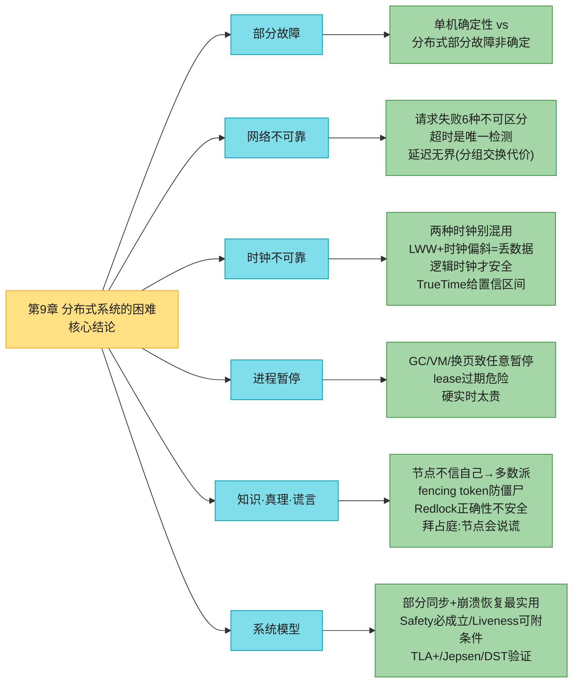

### 十大 Takeaways

1. **分布式系统 = 部分故障 + 非确定性**：单机"全好或全坏"，分布式"部分坏、时灵时不灵、甚至不知成没成"。这是难搞的根源。
2. **网络请求失败有 6 种、不可区分**：请求丢/排队/远端挂/远端暂停/响应丢/响应延迟——只能靠超时，且超时仍不知对方收到没。
3. **TCP "可靠"是相对的**：重传/重排/校验，但 ACK 只代表远端 OS 收到≠应用处理；连接断不知处理了多少；重连可重复。
4. **超时无"正确"值**：异步网络延迟无界（分组交换换利用率的代价）；实验定或用 Phi Accrual 自适应；过短会级联失败。
5. **两种时钟别混用**：测耗时用单调钟（不跳变、跨机不可比）；跨机排序用墙上钟（但不准）；墙上钟会因 NTP/闰秒/DST 跳变。
6. **时钟不可靠（8 条）+ LWW 丢数据**：石英漂移/NTP 限/闰秒/VM…… LWW 靠墙上钟排序会静默丢数据；用逻辑时钟或 TrueTime 置信区间。
7. **进程暂停随时发生**：GC/VM 挂起/换页/SIGSTOP——节点醒来不知睡过，lease 可能已过期→脑裂。硬实时太贵，只能缓解。
8. **节点不能信自己**：非对称故障/暂停让节点被误判死；靠**多数派**决策（过半 quorum 安全）；判死的节点必须服从。
9. **Fencing token 是防僵尸/延迟请求的正解**：单调递增 token，存储服务拒绝过期 token；Redlock 无 fencing，正确性场景不安全；拜占庭（节点说谎）需 BFT，数据中心一般不需。
10. **系统模型 + Safety/Liveness + 形式化验证**：部分同步+崩溃恢复最实用；Safety 必须始终成立、Liveness 可附条件；用 TLA+/Jepsen/DST 验证算法正确。

### 连接下一章

本章把悲观主义拉满——网络/时钟/进程都不可靠、节点不能信自己、故障检测靠超时（不准）、正确性难保证。**第 10 章「一致性与共识」**给出解法：在这些不可靠之上，如何用算法实现**容错**——线性一致性、因果一致性、共识协议（Raft/Paxos）、复制状态机、分布式锁的正确实现。本章的 fencing token、多数派、quorum、系统模型都是第 10 章共识算法的基石。
