# 第10章：一致性与共识 (Consistency and Consensus)

> *"Never go to sea with two chronometers; take one or three."*
> — Frederick P. Brooks Jr., *The Mythical Man-Month* (1995)

---

## 📚 核心论文与参考文献

### 必读论文

| # | 论文/资料 | 作者 | 核心内容 | 链接 |
|---|---------|------|--------|------|
| [1] | "Linearizability: A Correctness Condition for Concurrent Objects" | Herlihy & Wing | 线性一致性定义（经典） | [doi:10.1145/78969.78972](https://doi.org/10.1145/78969.78972) |
| [25] | "In Search of an Understandable Consensus Algorithm" | Ongaro & Ousterhout | **Raft 论文**（面试必读） | [USENIX ATC 2014](https://raft.github.io/raft.pdf) |
| [32] | "Brewer's Conjecture and the Feasibility of Consistent, Available, Partition-Tolerant Web Services" | Gilbert & Lynch | **CAP 定理**形式化证明 | [doi:10.1145/564585.564601](https://doi.org/10.1145/564585.564601) |
| [56] | "Time, Clocks, and the Ordering of Events in a Distributed System" | Leslie Lamport | Lamport 时钟 + 逻辑时钟 | [doi:10.1145/359545.359563](https://doi.org/10.1145/359545.359563) |
| [64] | "The Part-Time Parliament" | Leslie Lamport | **Paxos 原始论文** | [doi:10.1145/279227.279229](https://doi.org/10.1145/279227.279229) |
| [65] | "Paxos Made Simple" | Leslie Lamport | Paxos 简化版 | [perma.cc/82HP-MNKE](https://perma.cc/82HP-MNKE) |
| [74] | "Impossibility of Distributed Consensus with One Faulty Process" | Fischer, Lynch, Paterson | **FLP 不可能定理** | [doi:10.1145/3149.214121](https://doi.org/10.1145/3149.214121) |
| [82] | "Implementing Fault-Tolerant Services Using the State Machine Approach: A Tutorial" | Schneider | 状态机复制（经典教程） | [doi:10.1145/98163.98167](https://doi.org/10.1145/98163.98167) |

### 中文资源

- Raft 可视化：[raft.github.io](https://raft.github.io/) （强烈推荐！）
- Raft 论文中文翻译：搜索「Raft 论文 中文翻译」
- Paxos Made Simple 中文解读：搜索「Paxos Made Simple 中文」
- 线性一致性入门：搜索「Linearizability 线性一致性 入门」
- etcd Raft 源码解析：搜索「etcd raft 源码 解析」

---

## 🗺️ 章节概览

本章是分布式篇的终章，将 Ch6-Ch9 的所有问题汇总，给出终极解决方案：**共识算法**。

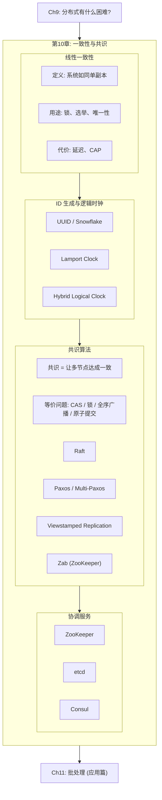

### 本章结构一览

| 小节 | 主题 | 关键概念 |
|------|------|---------|
| 10.1 | 线性一致性定义 | Recency guarantee、操作标记时间线、Linearizability vs Serializability |
| 10.2 | 线性一致性的用途与代价 | Leader 选举、唯一性约束、CAP 定理 |
| 10.3 | 实现线性一致性 | 各复制模式的线性一致性能力 |
| 10.4 | ID 生成器与逻辑时钟 | UUID、Snowflake、Lamport Clock、HLC、Vector Clock |
| 10.5 | 共识问题的本质 | 四大属性、FLP 不可能定理、等价问题 |
| 10.6 | Raft 算法详解 | Leader 选举、日志复制、安全性、成员变更 |
| 10.7 | Paxos 算法详解 | Proposer/Acceptor/Learner、Multi-Paxos、与 Raft 对比 |
| 10.8 | 协调服务与实战 | ZooKeeper、etcd、Consul、开源框架对比 |
## 10.1 线性一致性 (Linearizability)

### 核心定义

> 线性一致性 = 系统表现得**如同只有一个数据副本**，所有操作都是**原子**的。

即使背后有多个副本，客户端永远看到最新的已写入的值——不会读到旧值。

**另一种理解**：线性一致性是一种 **recency guarantee（时效保证）**——如果客户端 A 完成了写入，之后客户端 B 读取，B 必须看到 A 的写入（或更新的值）。

### 什么是线性一致的？


**关键约束**：一旦某个读操作返回了新值，所有后续读操作（无论来自哪个客户端）都必须返回新值或更新的值。**时间线不能倒退。**

### Linearizability vs Serializability ⭐ 面试高频

| | Linearizability | Serializability |
|--|----------------|-----------------|
| **对象** | 单个对象（一个寄存器/key） | 多个对象（事务中的多行） |
| **保证** | **Recency**：读到最新值 | **Isolation**：事务如同串行执行 |
| **时间要求** | 实时：操作 A 完成在 B 开始前 → B 看到 A 的效果 | 无实时要求：串行顺序可以和实际顺序不同 |
| **不能防止** | Write skew（涉及多个对象） | 不能保证 recency（允许读旧值） |
| **组合** | **Strict Serializability (Strong-1SR)** = 两者结合 | |

**Strict Serializability**：既保证事务如同串行执行，又保证这个串行顺序与实际时间顺序一致。Spanner 和 FoundationDB 提供这个最强保证。

> CockroachDB 提供 serializability + 部分 recency 保证，但不是严格的 strict serializability [13, 14]。
## 10.2 线性一致性的用途、代价与 CAP

### 什么场景需要线性一致性？

| 场景 | 为什么需要 | 后果 |
|------|---------|------|
| **Leader 选举** | 必须保证只有一个 Leader | Split brain → 数据损坏 |
| **分布式锁** | 必须保证同一时刻只有一个持有者 | 两个持有者 → 数据损坏 |
| **唯一性约束** | 用户名/文件名不能重复 | 两人注册同一用户名 → 冲突 |
| **Fencing Token** | Token 必须单调递增 | 旧 token 写入 → 数据损坏 |
| **跨 Channel 一致性** | 文件存储 + 消息队列需要一致 | 转码器读到旧版本视频 |

### 实现线性一致性

| 复制模式 | 线性一致？ | 说明 |
|---------|---------|------|
| **单主 (读写都走 Leader)** | ✅ 可能 | 前提：你确定谁是 Leader（Raft/Paxos 保证） |
| **单主 (读走 Follower)** | ❌ | Follower 可能落后 |
| **共识算法 (Raft/Zab)** | ✅ 可能 | 前提：读时需要确认自己还是 Leader |
| **多主** | ❌ | 并发写入不同 Leader → 冲突 |
| **无主 (Dynamo-style)** | ❌ | 即使 w+r>n，网络延迟仍可能读到旧值 (Figure 10-6) |

### CAP 定理

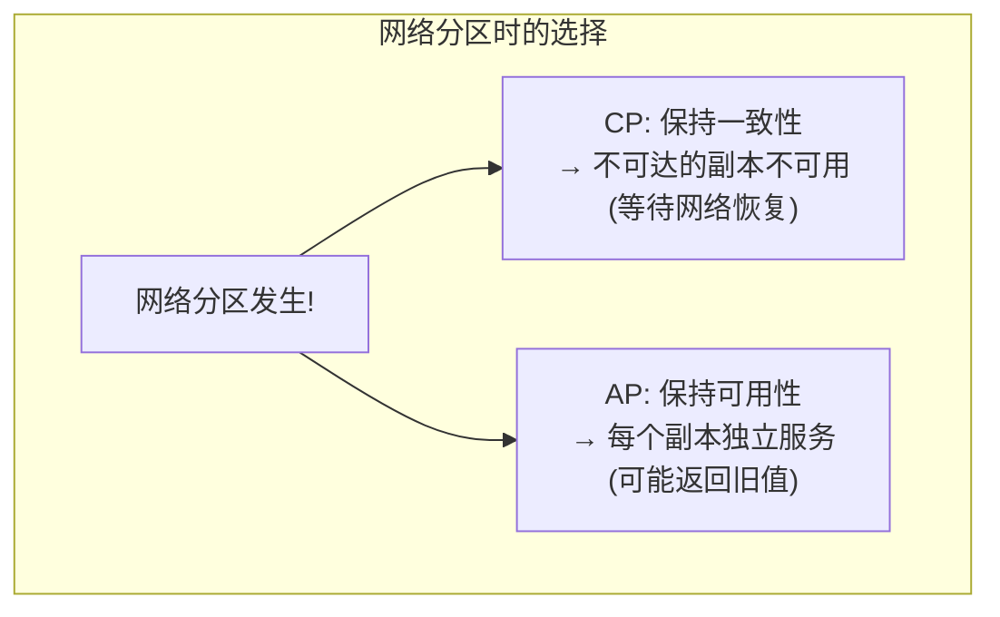

**CAP 的正确理解**：
- P（Partition Tolerance）不是一个"选项"——网络分区会不可避免地发生
- 真正的选择是：**分区发生时，选 C（一致）还是 A（可用）？**
- 正常运行时两者可以兼得；分区时必须二选一

**CAP 的局限**：
- "一致性" 只指线性一致性，不涵盖其他一致性模型
- "可用性" 的定义与直觉不同
- 不涉及网络延迟、节点故障等其他 trade-off
- 已被更精确的理论取代 [42, 43]——主要是**历史价值**

> **实践建议**：不要用 CAP 来指导系统设计。直接问："我需要线性一致性吗？如果需要，我愿意付出多少延迟/可用性的代价？"

### 线性一致性的延迟代价

即使没有网络分区，线性一致性也有延迟代价：
- 线性一致的读写延迟**至少**与网络延迟成正比 [51]
- 更快的算法不存在（已被证明）
- 这就是为什么现代 CPU 的多核内存模型也不是线性一致的——性能代价太高 [48, 49]

> 大多数分布式数据库放弃线性一致性的原因是**性能**，不是容错。
## 10.3 ID 生成器与逻辑时钟

### 分布式 ID 生成方案对比

| 方案 | 唯一性 | 排序性 | 线性一致？ | 容错 | 大小 |
|------|--------|--------|---------|------|------|
| **单机自增** | ✅ | ✅ 全序 | ✅ | ❌ 单点故障 | 32/64 bit |
| **分片 ID (奇偶/预分配块)** | ✅ | ❌ 跨分片无序 | ❌ | ✅ | 64 bit |
| **UUID v4 (随机)** | ✅ (概率) | ❌ 无序 | ❌ | ✅ | 128 bit |
| **UUID v7 / Snowflake / ULID** | ✅ | ⚠️ 近似有序 (基于物理时钟) | ❌ | ✅ | 64-128 bit |
| **Lamport Clock** | ✅ | ✅ 全序，因果一致 | ❌ | ✅ | counter + node_id |
| **Hybrid Logical Clock** | ✅ | ✅ 全序，因果一致 + 近似物理时间 | ❌ | ✅ | 64 bit |
| **共识系统 (Raft log index)** | ✅ | ✅ 全序 | ✅ | ✅ | 64 bit |

### Lamport Clock 算法

| 步骤 | 规则 |
|------|------|
| 1 | 每个节点维护一个 `counter` |
| 2 | 本地操作时：`counter++` |
| 3 | 发送消息时：附带 `(counter, node_id)` |
| 4 | 收到消息时：`counter = max(local, received) + 1` |

**Lamport Clock 保证因果一致**：如果 A happens-before B，则 A 的时间戳 < B 的时间戳。

**Lamport Clock 不保证线性一致**：两个并发操作可能被任意排序——你无法通过 Lamport 时间戳判断"谁先到达系统"（见 Figure 10-10 的隐私泄露例子）。

### Hybrid Logical Clock (HLC)

HLC [57] 结合了物理时钟和逻辑时钟的优点：
- 像物理时钟：时间戳接近真实时间（可以按日期查询）
- 像 Lamport Clock：保证因果一致性
- 即使物理时钟回退（NTP 调整），HLC 也不会回退

**使用者**：CockroachDB [71]

### 为什么逻辑时钟不够？

逻辑时钟提供全序且因果一致的时间戳，但**不能实现线性一致**：
- 节点 A 获取时间戳 5，节点 B 获取时间戳 3
- 如果 A 和 B 没有通信，A 不知道 B 的时间戳更小
- A 无法确定自己的时间戳 5 是否"赢了"——它需要等所有节点报告，但有些节点可能已故障

**结论**：要实现线性一致性的 ID 生成器、锁、唯一性约束 → **需要共识算法**。
## 10.4 共识问题的本质

### 共识的形式化定义

**共识 = 让多个节点就某个值达成一致。** 必须满足四个属性：

| 属性 | 含义 | 类型 |
|------|------|------|
| **Uniform Agreement** | 没有两个节点做出不同的决定 | Safety |
| **Integrity** | 一旦决定了，不能改变主意 | Safety |
| **Validity** | 决定的值必须是某个节点提议的（不能凭空造） | Safety |
| **Termination** | 每个未崩溃的节点最终都会做出决定 | Liveness |

### FLP 不可能定理

> Fischer, Lynch, Paterson (1985) [74] 证明：在**异步系统模型**中，即使只有**一个**节点可能崩溃，也不存在总能达成共识的确定性算法。

**但实践中共识仍然可行**——因为：
1. FLP 假设**异步模型**（不能用超时）→ 实际系统是**半同步**的（可以用超时检测故障）
2. FLP 要求**确定性**算法 → 允许随机性即可绕过 [76]
3. FLP 说的是"不能保证总是终止" → Safety 属性仍然可以始终保持

### 共识的等价问题

**以下问题全部等价**——解决其中任何一个，就能解决所有其他的：

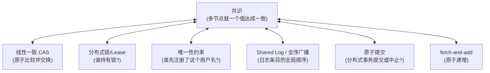

> **深刻洞察**：Leader 选举、分布式锁、唯一性约束、全序广播、原子提交——这些看似不同的问题，底层都是同一个问题：**共识**。

### Shared Log / 全序广播 (Total Order Broadcast)

共识在实践中最常用的形式不是"单值共识"，而是 **Shared Log（共享日志）**：

| 属性 | 含义 |
|------|------|
| **Eventual Append** | 如果请求添加值且节点不崩溃 → 值最终出现在日志中 |
| **Reliable Delivery** | 如果一个节点读到某条日志 → 所有未崩溃的节点最终也读到 |
| **Append-Only** | 已读的日志条目不可变 |
| **Agreement** | 任意两节点看到同一条目前的日志序列完全相同 |

**Shared Log = 全序广播 = 原子广播**——Raft、Multi-Paxos、Zab 都提供这个抽象。

### 从共识到状态机复制

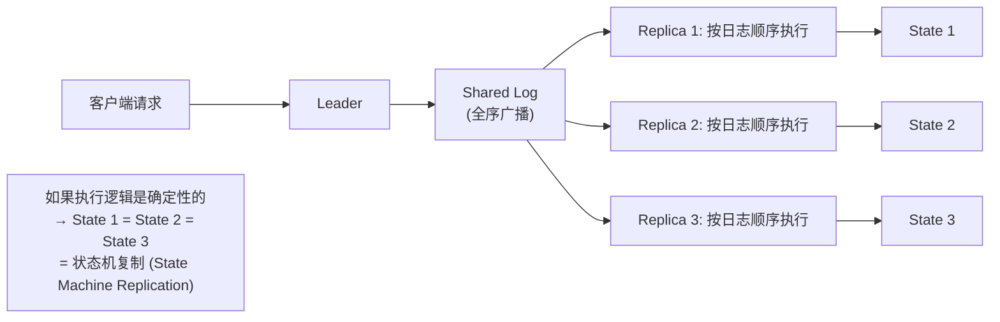

所有副本按**相同顺序**执行**相同操作** → 所有副本达到**相同状态**。这就是 **State Machine Replication (SMR)** [82]——分布式数据库（CockroachDB, TiDB 等）的核心架构。
## 10.5 Raft 算法详解 ⭐

> Raft [25] 由 Diego Ongaro 于 2014 年发表，设计目标是**可理解性**——解决了 Paxos 难以理解和实现的问题。目前是工业界最广泛采用的共识算法。

### Raft 的三个子问题

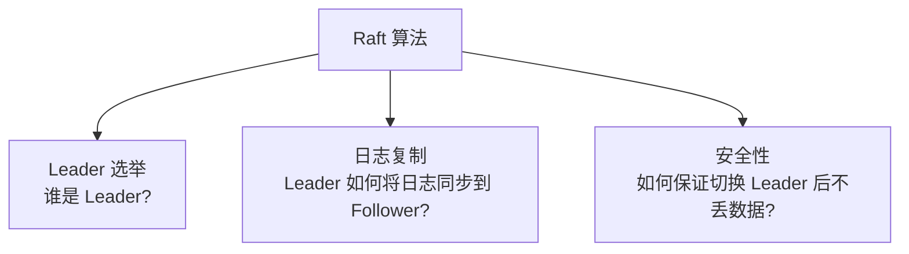

### 角色与 Term

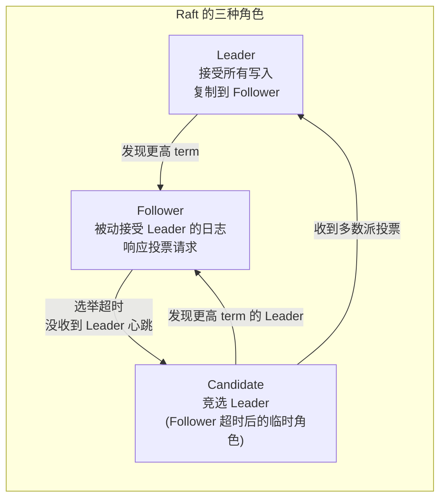

**Term（任期）**= 逻辑时钟，单调递增的整数。每个 term 最多有一个 Leader。

| Term 规则 | 说明 |
|---------|------|
| 每个节点跟踪当前 term | 随消息传播 |
| 收到更高 term 的消息 → 更新自己的 term | 旧 Leader 发现更高 term → 自动降级为 Follower |
| 收到更低 term 的消息 → 拒绝 | 过期的 Leader 的请求被忽略 |

### Leader 选举详解

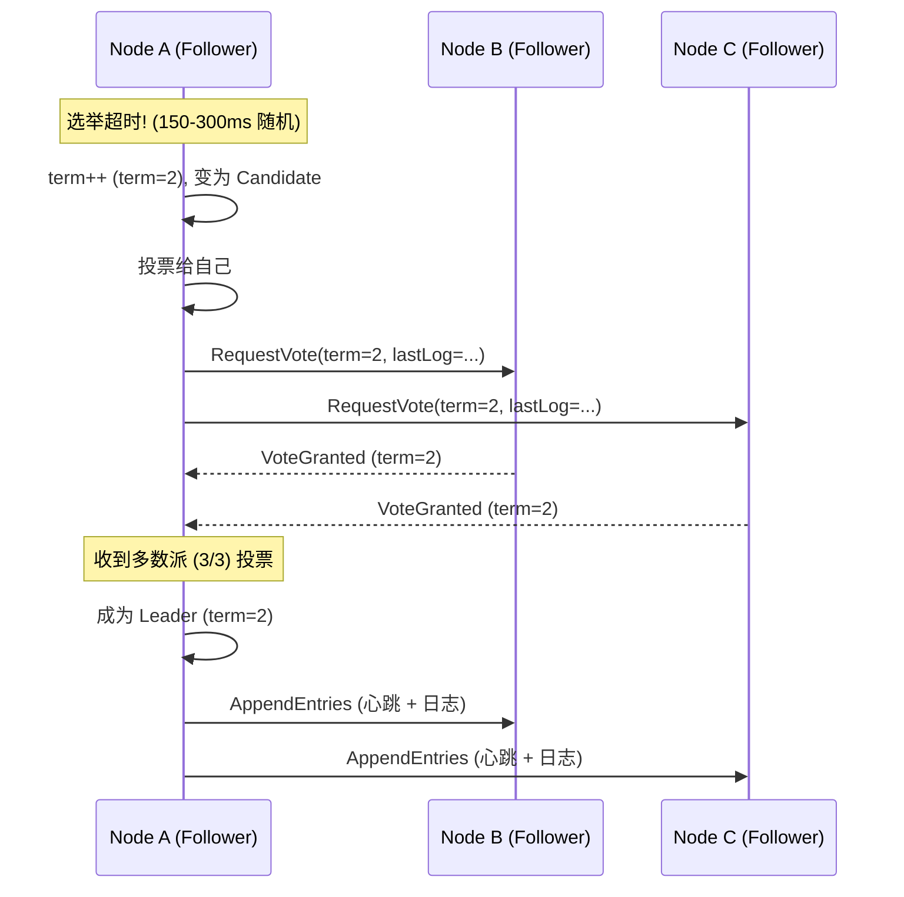

**选举的关键细节**：

| 规则 | 目的 |
|------|------|
| 每个节点在同一 term 只能投一票 | 保证同一 term 最多一个 Leader |
| 选举超时是**随机的** (150-300ms) | 避免多个 Candidate 同时发起选举（split vote） |
| Candidate 的日志必须**至少和投票者一样新** | 保证新 Leader 拥有所有已提交的日志 |

### 日志复制详解

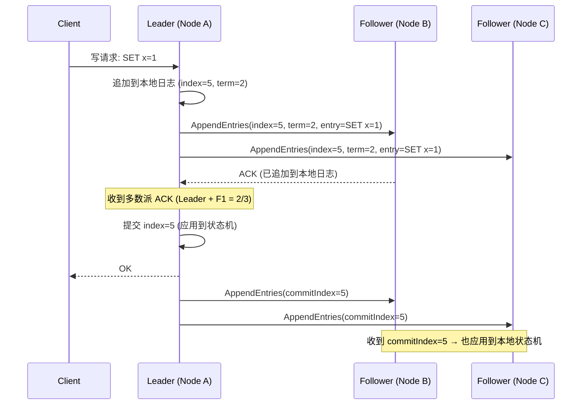

**日志的两个关键属性**：

| 属性 | 含义 |
|------|------|
| **Log Matching** | 如果两个节点的日志在某 index 有相同的 term → 从开头到该 index 的所有条目都相同 |
| **Leader Completeness** | 如果某条目在某 term 被提交 → 该条目出现在所有后续 term 的 Leader 日志中 |

### 安全性：Leader 切换不丢数据

**关键保证**：只有日志**至少和多数派一样新**的节点才能成为 Leader。

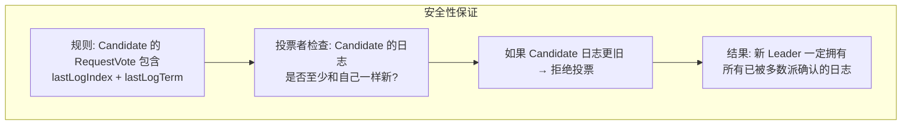

### Raft 线性一致读

仅靠 Raft 日志复制还不能保证线性一致读——Leader 可能已被取代但自己不知道（网络分区）。

| 读策略 | 线性一致？ | 性能 |
|--------|---------|------|
| 读走 Leader，无额外措施 | ❌ 可能读旧值 | 快 |
| **ReadIndex**：Leader 先确认自己还是 Leader（向多数派发心跳） | ✅ | 一次额外 RTT |
| **LeaseRead**：Leader 在 lease 有效期内不需要确认 | ⚠️ 依赖时钟 | 快 |
| 读走 Follower + ReadIndex | ✅ 但延迟更高 | 分散读负载 |
## 10.6 Paxos 算法详解与 Raft 对比 ⭐

### Paxos 简史

Paxos 由 Leslie Lamport 在 1990 年提出 [64]，用一个虚构的希腊城邦议会的故事描述。论文被认为过于隐晦，直到 2001 年 Lamport 写了 "Paxos Made Simple" [65] 才被广泛理解（但仍然不简单）。

### Basic Paxos：单值共识

Basic Paxos 解决的是让多个节点就**一个值**达成一致。

**三种角色**：

| 角色 | 职责 |
|------|------|
| **Proposer** | 提议一个值（类似 Raft 的 Candidate） |
| **Acceptor** | 接受或拒绝提议（类似 Raft 的 Voter） |
| **Learner** | 学习最终决定的值（类似 Raft 的 Follower） |

一个节点可以同时扮演多种角色。

### Basic Paxos 两阶段

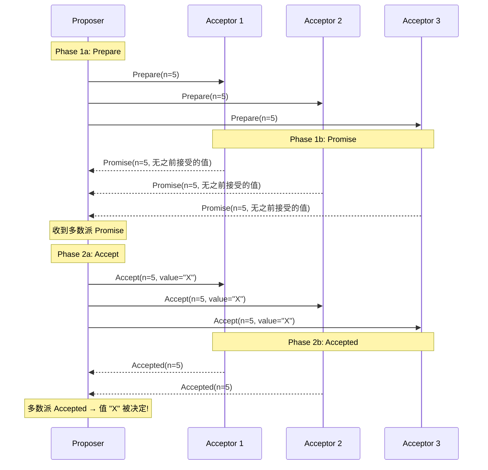

**关键规则**：

| 阶段 | Proposer | Acceptor |
|------|----------|----------|
| Prepare(n) | 发送全局唯一的提案号 n | 如果 n > 已 promise 的最大号 → Promise；否则拒绝 |
| Promise 响应 | 收到多数派 Promise | 承诺不再接受 < n 的提案；返回之前已接受的最高提案号的值 |
| Accept(n, v) | 如果 Promise 中有已接受的值 → 必须用那个值；否则用自己的值 | 如果没有 promise 过更高的 n → 接受 |

**为什么 Proposer 必须采用 Promise 中已有的值？** 这保证了即使 Proposer 挂了一半，新的 Proposer 也能"继承"已经部分接受的值 → 最终所有人同意同一个值。

### Multi-Paxos：从单值到日志

Basic Paxos 只决定**一个值**。要实现连续的日志（Shared Log），需要对每个日志槽位（slot）运行一次 Paxos → **Multi-Paxos**。

**Multi-Paxos 的关键优化**：选举一个稳定的 Leader → Phase 1 只做一次 → 后续日志条目直接 Phase 2（大幅减少通信轮次）。

→ 这和 Raft 几乎等价：稳定 Leader + 日志复制。

### Raft vs Paxos 详细对比 ⭐⭐⭐

| 维度 | Raft | Paxos (Multi-Paxos) |
|------|------|-------------------|
| **设计目标** | 可理解性 | 正确性证明 |
| **Leader** | 严格单 Leader（必须有最新日志） | 任何节点都可成为 Leader（追赶日志后） |
| **日志间隙** | 不允许（日志连续） | 允许间隙（不同 slot 可能被不同 Proposer 填充） |
| **Leader 选举限制** | 只有日志最新的节点能当选 | 任何节点都能当选，但需补全缺失日志 |
| **通信轮次 (稳态)** | 1 RTT (AppendEntries + ACK) | 1 RTT (Accept + Accepted)，相同 |
| **Leader 选举** | 1 RTT (RequestVote) | 1 RTT (Prepare)，相同 |
| **理解难度** | ✅ 容易 | ❌ 困难 [60, 61] |
| **工业实现** | 极广泛 | 较少直接用 Basic Paxos |
| **变体** | Pre-vote (防止断网节点扰乱) [68] | EPaxos (无 Leader) [86]、Flexible Paxos [88] |

### 共识算法家族

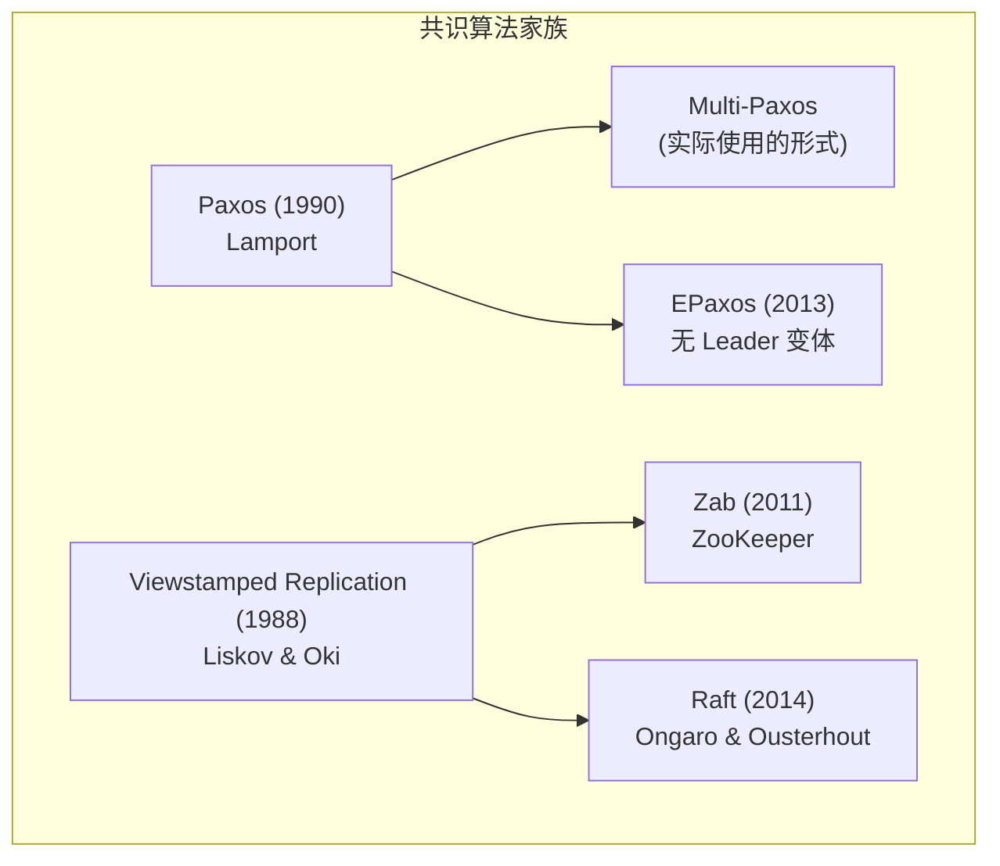

> Raft 和 Multi-Paxos 的核心思想相似，但细节不同 [70, 71]。选择 Raft 还是 Paxos 更多取决于实现而非算法本身。

### 共识的代价与局限

| 代价 | 说明 |
|------|------|
| **多数派要求** | 3 节点容忍 1 故障，5 节点容忍 2 故障。不能通过加节点提高吞吐 |
| **Leader 瓶颈** | 所有写入经过 Leader → 单点吞吐限制 |
| **对网络敏感** | 不稳定网络 → 频繁选举 → 系统实际不可用（"活锁"） [91, 92] |
| **跨区域延迟** | 跨区域多数派确认 → 写延迟 = 跨区域 RTT |
| **固定成员** | 标准算法假设固定节点集，成员变更需额外协议 |
## 10.7 协调服务与开源框架实战

### 协调服务 (Coordination Services)

协调服务不是通用数据库——它们专门用于存储**少量、关键的元数据**（分片映射、Leader 信息、配置）并提供强一致性保证。

### 三大协调服务对比 ⭐

| 维度 | ZooKeeper | etcd | Consul |
|------|-----------|------|--------|
| **共识算法** | Zab (类 Paxos) | **Raft** | **Raft** |
| **数据模型** | 层级树（类文件系统） | 扁平 KV + Prefix range | KV + Service Catalog |
| **语言** | Java | **Go** | **Go** |
| **典型用户** | Kafka (旧版)、HBase、Hadoop、Flink | **Kubernetes**、CoreDNS | HashiCorp 生态 |
| **Watch/通知** | ✅ Watcher (一次性触发) | ✅ Watch (流式) | ✅ Blocking Queries |
| **线性一致读** | ❌ 默认不保证（读可能走 Follower） | ✅ (v3+ 支持) | ⚠️ 取决于配置 |
| **锁/选举** | ✅ 临时节点 + 顺序节点 | ✅ Lease + CAS | ✅ Session + Lock API |
| **Fencing** | ✅ zxid / cversion | ✅ revision | ⚠️ 需手动 |
| **服务发现** | 可以但不是主要用途 | 可以 | ✅ 核心功能 |
| **社区活跃度** | 成熟但较慢 | 非常活跃 (CNCF) | 活跃 (HashiCorp) |

### 协调服务提供的能力

| 能力 | 说明 | 实现方式 |
|------|------|--------|
| **Locks / Leases** | 分布式互斥锁 | 原子 CAS（共识保证） |
| **Fencing support** | 防止僵尸客户端 | zxid / revision 单调递增 |
| **Failure detection** | 客户端心跳 + session | 超时释放临时节点/lease |
| **Change notification** | 数据变更推送 | Watch / Watcher 机制 |
| **Leader election** | 选出唯一 Leader | 临时顺序节点 / CAS |
| **Service discovery** | 服务注册与发现 | 临时节点 + Watch |

### 使用共识的开源数据库/框架 ⭐⭐

| 系统 | 共识算法 | 使用方式 | 语言 |
|------|--------|---------|------|
| **CockroachDB** | Raft (每个 Range 一个 Raft Group) | 内置：数据复制 + 分布式事务 | Go |
| **TiDB / TiKV** | Raft (每个 Region 一个 Raft Group) | 内置：存储层 Raft + 分布式事务 (Percolator) | Go/Rust |
| **etcd** | Raft | 内置：KV 存储 | Go |
| **Kafka (KRaft)** | Raft (自实现) | 内置：元数据管理（取代 ZooKeeper） | Java |
| **Consul** | Raft (HashiCorp Raft 库) | 内置：KV + 服务目录 | Go |
| **YugabyteDB** | Raft | 内置：Tablet 复制 | C++ |
| **FoundationDB** | 类 Paxos (Active Disk Paxos) | 内置：Coordinator 选举 + 日志 | C++ |
| **Google Spanner** | Paxos (每个 split 一个 Paxos Group) | 内置：数据复制 | C++ |
| **ScyllaDB** | Raft (替代 Gossip for schema changes) | 内置：Schema 变更 + Topology | C++ |

### 常用开源 Raft 库

| 库 | 语言 | 使用者 | 特点 |
|---|------|--------|------|
| **etcd/raft** | Go | etcd, CockroachDB, TiKV (via raft-rs) | 最成熟的 Go Raft 实现 |
| **raft-rs** | Rust | TiKV | Rust 生态首选 |
| **HashiCorp Raft** | Go | Consul, Nomad, Vault | 简单易用，自带 FSM 抽象 |
| **Apache Ratis** | Java | Apache Ozone, Alluxio | Java 生态 |
| **Dragonboat** | Go | — | 高性能 Multi-Group Raft |
| **lraft (braft)** | C++ | 百度 | 百度内部广泛使用 |
| **SOFAJRaft** | Java | 蚂蚁金服 SOFAStack | 蚂蚁金服生产验证 |

### ZooKeeper 用法示例

```bash
# 创建临时顺序节点（用于 Leader 选举）
zkCli.sh create -e -s /election/candidate_ ""
# 结果: /election/candidate_0000000001 (临时+顺序)
# 序号最小的节点成为 Leader
# 如果 Leader 的 session 超时 → 临时节点自动删除 → 下一个序号的成为 Leader

# Watch 某个节点（变更通知）
zkCli.sh get -w /config/db_host
# 当 /config/db_host 的值变化时收到通知
```

### etcd 用法示例

```bash
# 写入 KV
etcdctl put /services/web/node1 "192.168.1.10:8080"

# 线性一致读
etcdctl get /services/web/node1 --consistency=l

# 分布式锁 (CAS)
etcdctl lock my-lock --ttl 30

# Watch (流式监听变更)
etcdctl watch /services/web/ --prefix
# 当任何 /services/web/* 变化时实时推送

# Leader 选举
etcdctl elect my-election "node-1"
```

---

## 💻 代码示例与最佳实践

### 示例：使用 etcd 实现 Leader 选举 (Python)

```python
import etcd3

client = etcd3.client(host='localhost', port=2379)

# 创建一个 lease (TTL=15s，需定期续约)
lease = client.lease(ttl=15)

# 竞选 Leader
# 如果 key 不存在 → CAS 成功 → 成为 Leader
# 如果 key 已存在 → CAS 失败 → 不是 Leader
success, _ = client.transaction(
    compare=[client.transactions.create('/leader') == 0],
    success=[client.transactions.put('/leader', 'node-1', lease)],
    failure=[]
)

if success:
    print("I am the Leader!")
    # 定期续约 lease (否则 15s 后自动释放)
    while True:
        lease.refresh()
        # 做 Leader 该做的事...
        time.sleep(5)
else:
    print("I am a Follower, watching for Leader changes...")
    # Watch /leader 的变化
    events_iter, cancel = client.watch('/leader')
    for event in events_iter:
        if isinstance(event, etcd3.events.DeleteEvent):
            print("Leader gone! Trying to become Leader...")
            # 重新竞选...
```

### 最佳实践

| 场景 | 建议 |
|------|------|
| 需要强一致性 KV | etcd (Kubernetes 生态) 或 ZooKeeper (Hadoop 生态) |
| 分布式数据库 | 选择内置 Raft 的数据库 (CockroachDB / TiDB) |
| 自建共识系统 | **不要从零实现 Raft/Paxos** → 使用成熟的库 (etcd/raft, HashiCorp Raft) |
| 服务发现 | Consul 或 etcd + CoreDNS |
| 配置管理 | etcd / ZooKeeper + Watch |
| 分布式锁 | etcd Lease + CAS + Fencing token |

---

## 🎯 系统设计面试题

### 面试题1：解释 Raft 的 Leader 选举过程

**参考答案**：
1. Follower 超时未收到 Leader 心跳 → term++，变为 Candidate
2. Candidate 给自己投票，向所有节点发 RequestVote
3. 每个节点在同一 term 只能投一票；只投给日志**至少和自己一样新**的 Candidate
4. 获得多数派投票 → 成为 Leader，立即发心跳
5. 选举超时是随机的（避免 split vote）
6. 如果 Candidate 收到来自更高 term 的 Leader → 降为 Follower

### 面试题2：Raft 和 Paxos 的核心区别是什么？

**参考答案**：

| 关键区别 | Raft | Paxos |
|---------|------|-------|
| Leader 要求 | 必须拥有最新日志 | 任何节点可当选，选后补日志 |
| 日志连续性 | 不允许间隙 | 允许间隙 |
| 可理解性 | ✅ 设计目标就是可理解 | ❌ 出了名的难懂 |
| 核心差别 | 日志流是"Leader → Follower"单向 | 提案可从任何节点发起 |
| 稳态性能 | 相同（1 RTT） | 相同（1 RTT） |

本质上两者解决的是同一个问题，稳态行为非常相似。**Raft 可以看作 Multi-Paxos 的一种特化和简化版**。

### 面试题3：Linearizability 和 Serializability 的区别？

**参考答案**：
- **Linearizability**：单对象保证，recency（最新值），实时约束
- **Serializability**：多对象事务保证，等同于某种串行顺序，无实时约束
- 两者可以独立选择；**Strict Serializability** = 两者结合（最强保证）
- Spanner / FoundationDB 提供 Strict Serializability
- CockroachDB 提供 Serializability + 部分 recency

---

## 📝 本章要点总结

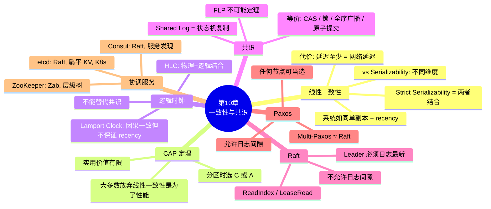

### 核心主线

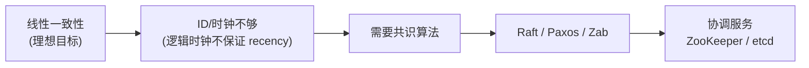

### 十大 Takeaways

1. **线性一致性 = 系统如同单副本** + recency guarantee。和 Serializability 是不同维度的概念

2. **线性一致性有延迟代价**——即使没有故障，延迟也至少与网络延迟成正比。大多数系统放弃它是为了性能

3. **CAP 定理的实用价值有限**——网络分区时选 C 或 A，但不涉及延迟、节点故障等更常见的 trade-off

4. **逻辑时钟保证因果一致但不保证线性一致**——Lamport Clock 无法判断"谁先到达"

5. **共识、CAS、锁、全序广播、原子提交——都是等价问题**。解决一个就能解决所有

6. **Raft 是 Multi-Paxos 的可理解特化**——强制 Leader 拥有最新日志、不允许日志间隙

7. **Raft 选举的安全性靠"只有日志最新的节点能当选"保证**——新 Leader 一定拥有所有已提交日志

8. **共识的代价**：多数派要求、Leader 单点瓶颈、网络敏感（频繁选举 = 活锁）

9. **不要自己实现 Raft/Paxos**——使用 etcd/raft、HashiCorp Raft 等成熟库，或直接用内置共识的数据库

10. **协调服务（ZooKeeper/etcd）是共识的"外包"**——3-5 个节点的小集群提供锁、选举、配置、Fencing，数千节点的大系统都可以依赖它

### 连接下一章

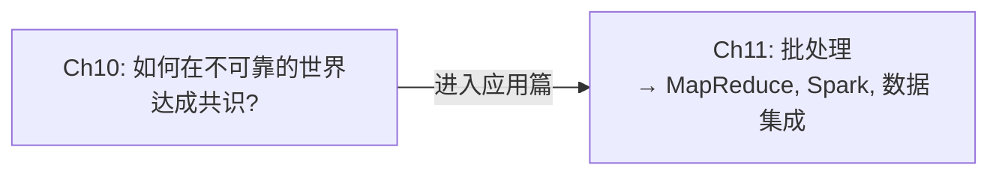