# 第10章：一致性与共识 (Consistency and Consensus)

> *"Never go to sea with two chronometers; take one or three."*
> — Frederick P. Brooks Jr., *The Mythical Man-Month* (1995)

> 带一个钟表上船,你不知道准不准;带两个,如果它们不一致,你仍然不知道哪个准;只有带**三个**(或一个),你才能靠**多数派**判断真实时间。这句话一语道破本章的核心——**共识**就是用多数派在不可靠的世界里逼近真相。Raft / Paxos 要求 `2f+1` 个节点容忍 `f` 个故障,本质和"带三个钟表"是同一回事。

---

## 📚 精选文献

原版笔记堆了二十多篇论文。本章只留**真正改变你认知**的几篇,其余挪到「延伸阅读」。

| # | 文献 | 为什么值得读 |
|---|------|------------|
| [1] | Herlihy & Wing, *Linearizability* (TOPLAS 1990) | 线性一致性的**原始定义**。读它能理解"为什么读到旧值是 bug"。形式化但不难懂。 |
| [25] | Ongaro & Ousterhout, *In Search of an Understandable Consensus Algorithm* (USENIX ATC 2014) | **Raft 论文**。面试/6.824 必读,图 2 是 Raft 的全部精华。作者同时写了博士论文 [67],工程细节极全。 |
| [56] | Lamport, *Time, Clocks, and the Ordering of Events* (CACM 1978) | 分布式系统**史上被引最多**的论文之一。Lamport 时钟 + happens-before 关系,思想深刻而算法简单。 |
| [64][65] | Lamport, *The Part-Time Parliament* (1998) / *Paxos Made Simple* (2001) | Paxos 原始论文(故事版) + 简化版。读 *Paxos Made Simple* 即可,但仍出名地难懂 [60][61]。 |
| [67] | Ongaro, *Consensus: Bridging Theory and Practice* (Stanford 博士论文, 2014) | Raft 的**工程圣经**。Pre-vote、成员变更、线性一致读、Snapshot 全在这里。想真正实现 Raft 必读。 |
| [72] | Castro & Liskov, *Practical Byzantine Fault Tolerance* (TOCS 2002) | **PBFT**,拜占庭容错的工程突破。把"理论可行"变成"实际能跑"。区块链共识的祖宗。 |
| [74] | Fischer, Lynch, Paterson, *Impossibility of Distributed Consensus with One Faulty Process* (JACM 1985) | **FLP 不可能定理**。3 页纸证明"异步系统+一个崩溃节点=共识无解",震撼了整个领域。 |
| [82] | Schneider, *Implementing Fault-Tolerant Services Using the State Machine Approach* (CSUR 1990) | **状态机复制 (SMR)** 经典教程。理解"为什么按相同顺序执行相同操作=复制"必读。 |

**延伸阅读**(按主题):一致性模型综述 [8] · CAP 批判 [4][45] · Attiya-Welch 线性一致性延迟下界 [51] · HLC [57] · Paxos vs Raft 对比 [70][71] · Flexible Paxos [88] · EPaxos 无 Leader [86] · 区块链共识综述 [73] · Jepsen 测试报告 [90]。

---

## 🗺️ 章节概览

第 9 章告诉我们"分布式世界有多不可靠"(网络、时钟、进程都会背叛你)。本章给出**终极解决方案**:在所有这些不可靠之上,如何让一群节点对同一件事达成一致。答案就是**共识算法**。

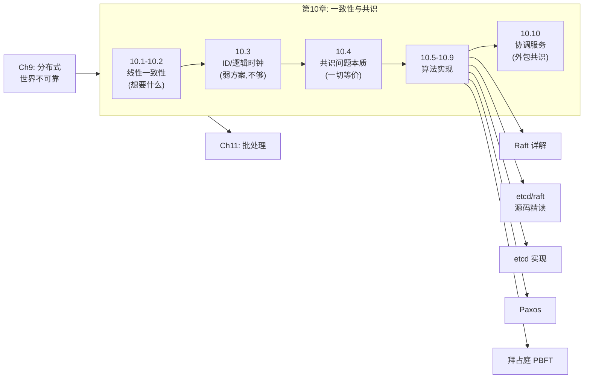
```mermaid
flowchart LR
    CH9["Ch9: 分布式<br/>世界不可靠"] --> CH10

    subgraph CH10["第10章: 一致性与共识"]
        direction TB
        LIN["10.1-10.2<br/>线性一致性<br/>(想要什么)"]
        CLK["10.3<br/>ID/逻辑时钟<br/>(弱方案,不够)"]
        CON["10.4<br/>共识问题本质<br/>(一切等价)"]
        ALG["10.5-10.9<br/>算法实现"]
        SVC["10.10<br/>协调服务<br/>(外包共识)"]

        LIN --> CLK --> CON --> ALG --> SVC
    end

    ALG --> RAFT["Raft 详解"]
    ALG --> SRC["etcd/raft<br/>源码精读"]
    ALG --> ETCD["etcd 实现"]
    ALG --> PAX["Paxos"]
    ALG --> BFT["拜占庭 PBFT"]

    CH10 --> CH11["Ch11: 批处理"]
```

### 本章结构一览

| 小节 | 主题 | 关键概念 |
|------|------|---------|
| 10.1 | 线性一致性 | recency guarantee、操作时间点图、Linearizability vs Serializability |
| 10.2 | 用途、代价、CAP | 锁/选举/唯一性、跨通道竞态、quorum 也不够、CAP 局限、延迟下界 |
| 10.3 | ID 生成器与逻辑时钟 | Snowflake/UUID7、Lamport Clock、Vector Clock、HLC、Timestamp Oracle |
| 10.4 | 共识问题的本质 | 四属性、FLP、等价问题、共识数、Shared Log、SMR |
| 10.5 | **Raft 算法详解** ⭐⭐⭐ | 选举、日志复制、安全性、Pre-vote、成员变更、快照、线性一致读 |
| 10.6 | **Raft 源码精读: etcd/raft** ⭐⭐⭐ | 纯状态机设计、`raft`/`raftLog`/`Progress`、`MessageType`、`Ready`、主循环 |
| 10.7 | **etcd 实现精读** ⭐⭐⭐ | etcdserver/raft/wal/backend 分层、mvcc revision、Watch、Lease、ReadIndex |
| 10.8 | Paxos 详解与对比 | Proposer/Acceptor/Learner、两阶段、Multi-Paxos、Raft vs Paxos |
| 10.9 | **拜占庭容错 PBFT** ⭐⭐⭐ | 3f+1 推导、三阶段、数字签名、Go 代码、HotStuff、区块链 |
| 10.10 | 协调服务实战 | ZooKeeper/etcd/Consul、开源 Raft 库、分布式锁+Fencing 代码 |

> **本章与 MIT 6.824 的关系**:6.824 的 Lab 2(Raft)和 Lab 3(KV over Raft)就是本章 10.5-10.7 的实战。读完本章的源码精读再去写 Lab,会顺畅很多——你已经知道 `Ready` 结构为什么这么设计、为什么消息必须在 WAL 持久化之后才能发出。

## 10.1 线性一致性 (Linearizability)

### 核心定义

> 线性一致性 = 系统表现得**如同只有一个数据副本**,所有操作都是**原子**的。

即使背后有多个副本,客户端永远看到最新的已写入的值——不会读到旧值。

**另一种等价表述**:线性一致性是一种 **recency guarantee(时效保证)**——如果客户端 A 完成了写入,之后客户端 B 读取,B 必须看到 A 的写入(或更新的值)。

> 📝 **名词注释:寄存器 (register)**
> 分布式理论里,被并发读写的基本单位叫**寄存器**。实践中它可以是 KV store 的一个 key、关系库的一行、文档库的一个文档。本章所有"读写 x"都是在读写一个寄存器。

### 什么是线性一致的?

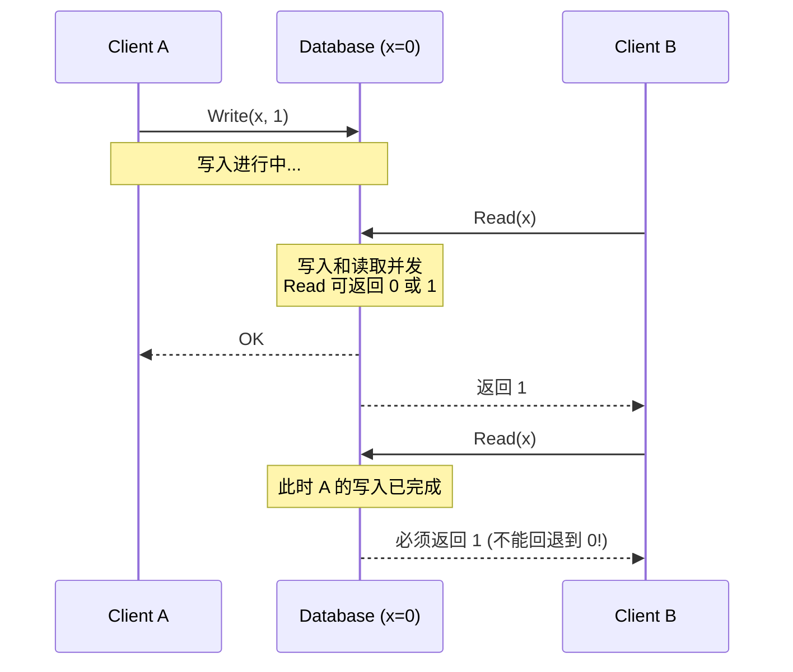
```mermaid
sequenceDiagram
    participant A as Client A
    participant DB as Database (x=0)
    participant B as Client B

    A->>DB: Write(x, 1)
    Note over A,DB: 写入进行中...
    B->>DB: Read(x)
    Note over DB: 写入和读取并发<br/>Read 可返回 0 或 1
    DB-->>A: OK
    DB-->>B: 返回 1

    B->>DB: Read(x)
    Note over DB: 此时 A 的写入已完成
    DB-->>B: 必须返回 1 (不能回退到 0!)
```

**关键约束**:一旦某个读操作返回了新值,**所有后续读操作**(无论来自哪个客户端)都必须返回新值或更新的值。**时间线不能倒退。**

#### 深入:用"操作时间点"画图判断线性一致性

这是理解线性一致性最强的方法(论文 [5] 的可视化)。把每个客户端请求画成一根横条(开始→结束),因为网络延迟,客户端不知道服务器在条内的哪个**瞬间**真正执行了操作。**我们想象**每个操作在其横条内某处有一个执行时间点(竖线),把这些竖线按时间串成一条只前进不后退的序列,且每条都是"读到最近一次写入的值"——如果能画出这样一条线,系统就是线性一致的;如果怎么画都不行,就违反了。

下面这个经典反例(Figure 10-4 的简化),证明**最后一个读不线性一致**:

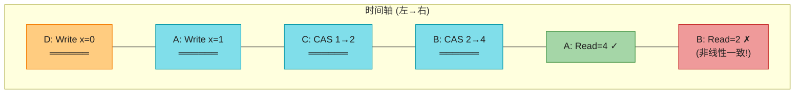
```mermaid
flowchart LR
    subgraph Timeline["时间轴 (左→右)"]
        direction LR
        D["D: Write x=0<br/>══════"]
        A["A: Write x=1<br/>══════"]
        C1["C: CAS 1→2<br/>══════"]
        B1["B: CAS 2→4<br/>══════"]
        A2["A: Read=4 ✓"]
        B2["B: Read=2 ✗<br/>(非线性一致!)"]
        D --- A --- C1 --- B1 --- A2 --- B2
    end

    style D fill:#FFCC80,stroke:#F57C00,color:#1f1f1f
    style A fill:#80DEEA,stroke:#0097A7,color:#1f1f1f
    style C1 fill:#80DEEA,stroke:#0097A7,color:#1f1f1f
    style B1 fill:#80DEEA,stroke:#0097A7,color:#1f1f1f
    style A2 fill:#A5D6A7,stroke:#388E3C,color:#1f1f1f
    style B2 fill:#EF9A9A,stroke:#C62828,color:#1f1f1f
```

**为什么 B 的最后那个读 Read=2 不合法?** 因为 A 已经读到了 4(说明 x=4 已经"生效"),而 B 的读在 A 的读**之后**开始,却读到了更旧的 2——时间倒退了。这就是 Aaliyah/Bryce 看球赛那个例子的本质:**额外的通信渠道(A 的嘴 / A 的读)暴露了旧值的存在**。

> **可判定性**:线性一致性是**可判定的**(虽然计算昂贵)——记录所有请求的起止时间,检查是否存在一个合法的串行化顺序 [6][7]。Jepsen 用的 **Knossos** / **Elle** 就是干这个的,它们会喂给数据库随机并发操作,再用这套方法判断是否违反线性一致性。

### Linearizability vs Serializability ⭐ 面试高频

这两个词都像"能排成某种顺序",但保证的东西**完全不同**,是两个正交维度:

| | Linearizability 线性一致性 | Serializability 可串行化 |
|--|----------------|-----------------|
| **保证的对象** | **单个**对象(一个寄存器/key) | **多个**对象(一个事务里的多行) |
| **保证什么** | **Recency**:读到最新值 | **Isolation**:事务如同串行执行 |
| **有时间约束?** | ✅ 有实时约束:A 完成在 B 开始前 → B 必须看到 A | ❌ 无实时约束:串行顺序可与实际时间不同;**允许读旧值** [10] |
| **不能防止** | write skew(跨多对象的写偏斜) | 不能保证 recency |
| **组合** | **Strict Serializability (强 1SR)** = 两者结合,最强 | |

> 📝 **名词注释:Strict Serializability(严格可串行化)**
> = Serializability + Linearizability。事务既要"像串行执行",这个串行顺序又要"和真实时间一致"。**Spanner 和 FoundationDB 提供这个最强保证** [15][16]。CockroachDB 提供可串行化 + 部分 recency,但**不是**严格的 strict serializability [13][14]——因为它要避免昂贵的跨副本协调。

一个易错的点:**单机数据库几乎都是线性一致的**(只有一个副本)。但分布式数据库用乐观并发(如 SSI)时就不一定了——CockroachDB 就是个例子。一致性模型和隔离级别其实可以**独立选择** [17][18]。

## 10.2 线性一致性的用途、代价与 CAP

### 什么场景需要线性一致性?

| 场景 | 为什么需要 | 没有会怎样 |
|------|---------|------|
| **Leader 选举** | 必须保证只有一个 Leader | 脑裂(split brain)→ 两个 Leader 同时写 → 数据损坏 |
| **分布式锁** | 同一时刻只有一个持有者 | 两个持有者 → 数据损坏 |
| **唯一性约束** | 用户名/文件名不能重复 | 两人注册同一用户名 → 冲突 |
| **Fencing Token** | Token 必须单调递增 | 旧 token 的僵尸请求写入 → 覆盖新数据 |
| **跨通道一致性** | 文件存储 + 消息队列要一致 | 转码器读到旧版本视频(见下) |

#### 深入:跨通道竞态(视频转码例子)

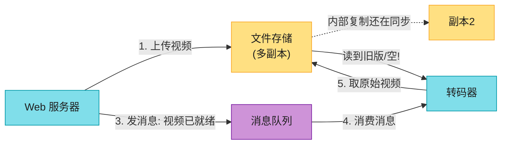
```mermaid
flowchart LR
    WEB["Web 服务器"] -->|"1. 上传视频"| FS["文件存储<br/>(多副本)"]
    WEB -->|"3. 发消息: 视频已就绪"| MQ["消息队列"]
    FS -.->|"内部复制还在同步"| FS2["副本2"]
    MQ -->|"4. 消费消息"| TC["转码器"]
    TC -->|"5. 取原始视频"| FS
    FS -->|"读到旧版/空!"| TC

    style WEB fill:#80DEEA,stroke:#0097A7,color:#1f1f1f
    style FS fill:#FFE082,stroke:#F9A825,color:#1f1f1f
    style MQ fill:#CE93D8,stroke:#7B1FA2,color:#1f1f1f
    style TC fill:#80DEEA,stroke:#0097A7,color:#1f1f1f
    style FS2 fill:#FFE082,stroke:#F9A825,color:#1f1f1f
```

Web 服务器和转码器之间有**两条通信渠道**:文件存储 + 消息队列。如果文件存储**不是线性一致**,消息队列(渠道3-4)可能比文件存储的内部复制(渠道虚线)更快,转码器取视频(步骤5)时复制还没完成 → 读到旧版或空 → 转码出错误视频并覆盖,**永久不一致**。

**根因**:没有线性一致性的 recency 保证,两条渠道之间会产生竞态。这和 Aaliyah 用嘴告诉 Bryce 比分(另一条渠道)暴露了旧值,是同一个问题。

**解法**:要么文件存储线性一致;要么你自己控制额外渠道(如在消息里带上版本号,转码器按版本号等),代价是复杂度。

### 实现线性一致性

回到第 6 章的复制方式,看它们能不能给线性一致:

| 复制模式 | 线性一致? | 说明 |
|---------|---------|------|
| **单主(读写都走 Leader)** | ✅ 可能 | 前提:你**确定**谁是 Leader(这正是共识要解决的) |
| **单主(读走 Follower)** | ❌ | Follower 可能落后 |
| **共识算法(Raft/Zab)** | ✅ 可能 | 前提:读时确认自己还是 Leader(ReadIndex) |
| **多主** | ❌ | 并发写不同 Leader → 冲突 |
| **无主(Dynamo-style)** | ❌ | 即使 `w+r>n`,仍可能非线性一致(见下) |

#### 深入:为什么 quorum `w+r>n` 也不保证线性一致

直觉上,`w+r>n`(写法定人数 + 读法定人数有交集)应该总能读到最新写。但**网络延迟变化**时会出问题。下面手算 Figure 10-6 的反例:

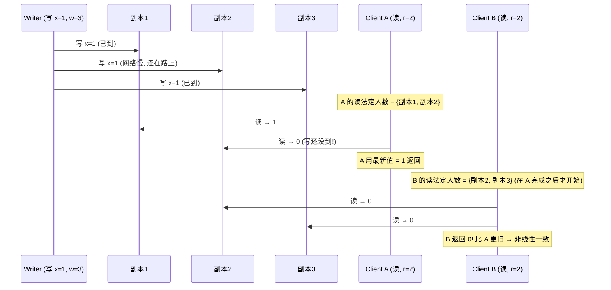
```mermaid
sequenceDiagram
    participant W as Writer (写 x=1, w=3)
    participant R1 as 副本1
    participant R2 as 副本2
    participant R3 as 副本3
    participant A as Client A (读, r=2)
    participant B as Client B (读, r=2)

    W->>R1: 写 x=1 (已到)
    W->>R2: 写 x=1 (网络慢, 还在路上)
    W->>R3: 写 x=1 (已到)

    Note over A: A 的读法定人数 = {副本1, 副本2}
    A->>R1: 读 → 1
    A->>R2: 读 → 0 (写还没到!)
    Note over A: A 用最新值 = 1 返回

    Note over B: B 的读法定人数 = {副本2, 副本3} (在 A 完成之后才开始)
    B->>R2: 读 → 0
    B->>R3: 读 → 0
    Note over B: B 返回 0! 比 A 更旧 → 非线性一致
```

`n=3, w=3, r=2`,**quorum 条件满足**(`2+2>3`),但 B 的请求在 A 完成之后才开始,却返回了更旧的值。`w+r>n` **保证的是读过到最新已确认的写**,但不保证**线性一致的实时顺序**——因为法定人数可以是**不同的子集**,副本2在两次读之间状态变了(0→1),而 B 正好踩在它还是 0 的时候。

**补救**:让 reader **同步做 read repair** [26] 再返回,且 writer 写前先读法定人数拿到最新时间戳 [27][28]。但 Riak 因性能不做同步 read repair;Cassandra 做了同步 read repair 却因用 wall-clock 时间戳而失去线性一致 [29]。**结论:无主 + Dynamo 复制,默认当作不提供线性一致。** 即便如此,线性一致的 **CAS** 仍做不出来——那需要共识算法 [30]。

### CAP 定理

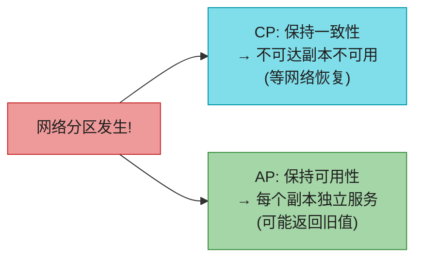
```mermaid
flowchart LR
    PART["网络分区发生!"] --> CP["CP: 保持一致性<br/>→ 不可达副本不可用<br/>(等网络恢复)"]
    PART --> AP["AP: 保持可用性<br/>→ 每个副本独立服务<br/>(可能返回旧值)"]

    style PART fill:#EF9A9A,stroke:#C62828,color:#1f1f1f
    style CP fill:#80DEEA,stroke:#0097A7,color:#1f1f1f
    style AP fill:#A5D6A7,stroke:#388E3C,color:#1f1f1f
```

#### 深入:CAP 的正确理解(以及它为什么"没用")

**正确表述**:不是"三选二"。P(分区容错)不是选项——网络分区**不可避免**会发生(唯一保证不分区的办法是只有一副本,但那就没有高可用)。**真正的选择是:分区发生时,选 C(一致)还是 A(可用)?** 即 Brewer 自己后来纠正的:"**either consistent or available when partitioned**" [44]。

**为什么 CAP 实用价值有限** [4][45]:
- "一致性"特指**线性一致性**一种,不涵盖其他一致性模型;
- "可用性"的形式定义 [32] 与直觉不符(很多高可用系统并不满足 CAP 的那个古怪定义);
- 它**只考虑网络分区一种故障**(Google 数据显示分区只占事故的 <8% [39]),不涉及延迟、节点宕机等更常见的 trade-off;
- 已被 PACELC [40][46] 和更精确的不可能结果 [42][43] 取代。

> 📝 **名词注释:PACELC**
> PACELC 扩展了 CAP:**P**artition 时选 **A** vs **C**;**E**lse(无分区时)选 **L**(延迟)vs **C**。即:分区时在可用和一致间选;平时在低延迟和一致间选。这才是真实系统的常态——大多数系统**没分区时**也为了延迟而牺牲线性一致。比如 Cassandra = PA/EL(总是选 A 和 L);Spanner = PC/EC(总是选 C,代价是跨区域延迟)。

> **实践建议**:别用 CAP 指导设计。直接问:"我需要线性一致吗?需要的话,我愿意付多少延迟/可用性代价?"

### 线性一致性的延迟代价

即使**没有**网络分区,线性一致性也有延迟代价——这是被**证明**的下界 [51]:

> **Attiya-Welch 定理**:线性一致读写的响应时间,**至少**与网络延迟的**不确定性**成正比。在网络延迟高度可变的真实环境里,线性一致读写**必然**慢。更快的算法**不存在**。

#### 深入:为什么连多核 CPU 的内存都不是线性一致的

这是最反直觉的一点。现代 CPU 每个 core 有自己的 **cache 和 store buffer**,读写默认走 cache,变更异步写回主存。多核之间因此存在"多份数据"(主存 + 各 cache),异步更新 → **丢失线性一致**。一个 core 写了内存地址,另一个 core 紧接着读,**不保证**读到新值(除非显式插入**内存屏障/fence** [49])。

**为什么放弃线性一致?为了性能**——cache 比主存快得多 [50]。这和 CAP 无关:单机内部我们假定通信可靠,不会有一个 core "断网"。**许多分布式数据库放弃线性一致也是同样原因:为了性能,不是为了容错** [40][46]。线性一致系统总是更高延迟——**一直如此,不只是故障时**。第 13 章会讨论"如何在不牺牲正确性的前提下避免线性一致"。

## 10.3 ID 生成器与逻辑时钟

### 分布式 ID 生成方案对比

单机自增 ID 完美:唯一、有序、线性一致(一次 `fetch-and-add`)。但它**单点故障**、**跨区域慢**(为拿个 ID 要绕地球一圈)、**高吞吐瓶颈**。各种替代方案:

| 方案 | 唯一性 | 排序性 | 线性一致? | 容错 | 大小 |
|------|--------|--------|---------|------|------|
| **单机自增** | ✅ | ✅ 全序 | ✅ | ❌ 单点 | 32/64 bit |
| **分片 ID(奇偶/预分配块)** | ✅ | ❌ 跨分片无序 | ❌ | ✅ | 64 bit |
| **UUID v4(随机)** | ✅(概率) | ❌ 无序 | ❌ | ✅ | 128 bit |
| **UUID v7 / Snowflake / ULID** | ✅ | ⚠️ 近似有序(基于物理钟) | ❌ | ✅ | 64-128 bit |
| **Lamport Clock** | ✅ | ✅ 全序,因果一致 | ❌ | ✅ | counter+node_id |
| **Hybrid Logical Clock** | ✅ | ✅ 全序,因果一致+近似物理时间 | ❌ | ✅ | 64 bit |
| **共识系统(Raft log index)** | ✅ | ✅ 全序 | ✅ | ✅ | 64 bit |

> 📝 **名词注释:Snowflake / UUID v7 / ULID**
> 这类 ID 把**毫秒级时间戳放高位** + 机器号 + 序列号放低位。优点:本地生成、近似有序(可按 ID 排序做时间范围查询)、紧凑。缺点:依赖物理钟,**NTP 跳变或时钟回退会破坏有序性**,所以不线性一致。Twitter/X 的 Snowflake [53]、ULID [54]、UUID v7 [52]、MongoDB ObjectID 都是这一类。

### Lamport Clock 算法

| 步骤 | 规则 |
|------|------|
| 1 | 每个节点维护一个 `counter` |
| 2 | 本地操作:`counter++` |
| 3 | 发送消息时:附带 `(counter, node_id)` |
| 4 | 收到消息时:`counter = max(local, received) + 1` |

时间戳就是 `(counter, node_id)` 对。两个节点 counter 可能相同,但加上 node_id 就唯一了。

#### 深入:Lamport 时钟手算(聊天室例子)

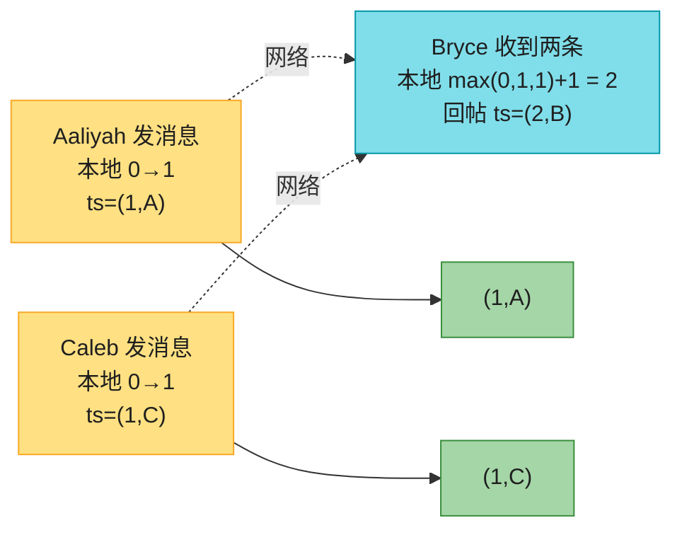
```mermaid
flowchart LR
    A1["Aaliyah 发消息<br/>本地 0→1<br/>ts=(1,A)"] -.->|"网络"| B
    C1["Caleb 发消息<br/>本地 0→1<br/>ts=(1,C)"] -.->|"网络"| B
    B["Bryce 收到两条<br/>本地 max(0,1,1)+1 = 2<br/>回帖 ts=(2,B)"]

    A1 --> A1b["(1,A)"]
    C1 --> C1b["(1,C)"]

    style A1 fill:#FFE082,stroke:#F9A825,color:#1f1f1f
    style C1 fill:#FFE082,stroke:#F9A825,color:#1f1f1f
    style B fill:#80DEEA,stroke:#0097A7,color:#1f1f1f
    style A1b fill:#A5D6A7,stroke:#388E3C,color:#1f1f1f
    style C1b fill:#A5D6A7,stroke:#388E3C,color:#1f1f1f
```

排序结果:`(1,"Aaliyah") < (1,"Caleb") < (2,"Bryce")`(counter 相同时按 node id 字典序)。Bryce 的回帖排在两个提问之后 ✓。

**Lamport Clock 保证**:若 A happens-before B,则 `ts(A) < ts(B)`(**因果一致**)。

**Lamport Clock 不保证**:反过来不成立——`ts(A) < ts(B)` **不一定**意味着 A happens-before B(它们可能并发)。看时间戳你**无法**判断两个事件是因果有序还是并发。要判断并发,得用 Vector Clock。

### Vector Clock(向量时钟)

Vector Clock 为**每个节点**各存一个 counter,写时把整个向量带上。如果写 A 在某节点 counter 比 B 高,而 B 在另一节点 counter 比 A 高 → A、B **并发**。

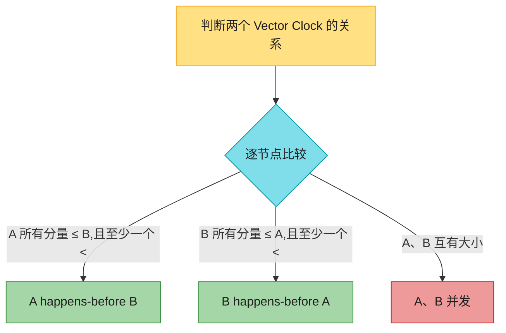
```mermaid
flowchart TD
    Q["判断两个 Vector Clock 的关系"] --> CMP{"逐节点比较"}
    CMP -->|"A 所有分量 ≤ B,且至少一个 <"| AHB["A happens-before B"]
    CMP -->|"B 所有分量 ≤ A,且至少一个 <"| BHA["B happens-before A"]
    CMP -->|"A、B 互有大小"| CONC["A、B 并发"]

    style Q fill:#FFE082,stroke:#F9A825,color:#1f1f1f
    style CMP fill:#80DEEA,stroke:#0097A7,color:#1f1f1f
    style AHB fill:#A5D6A7,stroke:#388E3C,color:#1f1f1f
    style BHA fill:#A5D6A7,stroke:#388E3C,color:#1f1f1f
    style CONC fill:#EF9A9A,stroke:#C62828,color:#1f1f1f
```

**代价**:时间戳大小 = 节点数(每个节点一个整数),节点多时空间膨胀。第 6 章检测并发写冲突用的就是它。

### Hybrid Logical Clock (HLC)

HLC [57] 结合物理钟和逻辑钟:
- 像物理钟:时间戳接近真实时间(可按日期查询);
- 像 Lamport Clock:保证因果一致(看到更大的时间戳就向前推);
- 物理钟回退(NTP 调整)时 HLC **不回退**(靠逻辑部分兜底)。

**使用者**:CockroachDB [71]。HLC 让 CockroachDB 能在没有原子钟/GPS 的情况下生成因果一致的时间戳。

#### 深入:HLC 算法详解

HLC 时间戳 = `(physical_ms, logical)`。三个规则:

| 事件 | 规则 |
|------|------|
| **本地新事件** | `physical_ms = max(本地物理钟, 上次 physical_ms)`;若物理钟没前进 → `logical++`,否则 `logical=0` |
| **发送消息** | 附带当前 HLC |
| **收到消息 m** | `physical_ms = max(本地物理钟, m.physical_ms, 上次 physical_ms)`;若三者最大值有并列 → `logical = max(本地 logical, m.logical) + 1` |

关键:**HLC 永不回退**,且和 Lamport 一样保证 `A→B ⇒ ts(A)<ts(B)`。它"略微领先"物理钟,但偏差被算法控制在最小。

### 线性一致 ID 生成器

逻辑时钟保证因果序,但**比单机自增 ID 弱**——线性一致要求"如果 A 完成在 B 开始前,B 的 ID 必须更大,**哪怕 A、B 从不通信**"。Lamport/HLC 只能保证"节点生成的时间戳大于它**见过**的任何时间戳",对**没见过**的毫无保证。

#### 深入:Figure 10-10 隐私泄露反例(手算)

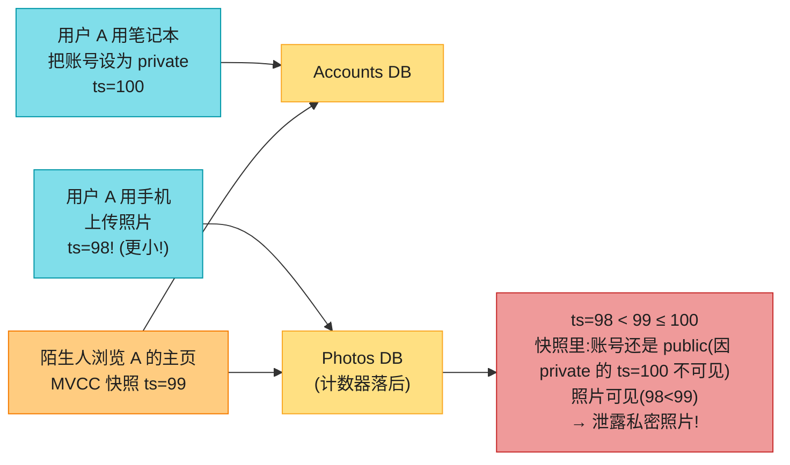
```mermaid
flowchart LR
    LAP["用户 A 用笔记本<br/>把账号设为 private<br/>ts=100"] --> ACC["Accounts DB"]
    PHONE["用户 A 用手机<br/>上传照片<br/>ts=98! (更小!)"] --> PHOTO["Photos DB<br/>(计数器落后)"]
    VIEWER["陌生人浏览 A 的主页<br/>MVCC 快照 ts=99"] --> ACC
    VIEWER --> PHOTO

    PHOTO --> SHOW["ts=98 < 99 ≤ 100<br/>快照里:账号还是 public(因 private 的 ts=100 不可见)<br/>照片可见(98<99)<br/>→ 泄露私密照片!"]

    style LAP fill:#80DEEA,stroke:#0097A7,color:#1f1f1f
    style PHONE fill:#80DEEA,stroke:#0097A7,color:#1f1f1f
    style ACC fill:#FFE082,stroke:#F9A825,color:#1f1f1f
    style PHOTO fill:#FFE082,stroke:#F9A825,color:#1f1f1f
    style VIEWER fill:#FFCC80,stroke:#F57C00,color:#1f1f1f
    style SHOW fill:#EF9A9A,stroke:#C62828,color:#1f1f1f
```

A 先把账号设 private(ts=100),再传照片(ts=98,因为 Photos DB 的计数器落后)。陌生人用 MVCC 快照隔离读,快照时间戳=99:99<100 看不到"设 private",98<99 看得到照片 → 系统判定账号还是 public → **私密照片泄露**。

**根因**:Lamport/HLC 没法跨两个不通信的数据库保证"设 private 的 ts < 传照片的 ts"。**最简单的修复:用线性一致 ID 生成器**,保证照片的 ID 一定大于设权限的 ID。

**实现线性一致 ID 生成器的两种工业做法**:

| 方案 | 做法 | 用谁 |
|------|------|------|
| **Timestamp Oracle(单点 TSO)** | 一个专门节点原子自增 counter 并复制持久化;批量发号(一次持久化一个 ID 块) | **TiDB/TiKV 的 TSO**(灵感来自 Google Percolator [59]) |
| **TrueTime + Commit Wait** | 用原子钟/GPS 拿到带**不确定区间**的时间戳,等不确定区间过去再返回 | **Google Spanner** |

Timestamp Oracle 的批量优化:不是每次请求都落盘 + 复制,而是持久化"一个 ID 块"(如 1~1000),块确认后连续发号,快用完再持久化下一块。崩溃/切换会**跳号**(浪费一部分),但绝不重复或乱序。单点 TSO 因任务简单,单节点吞吐极高;代价是**不能跨区域分散**(所有要 ID 的请求都涌向单区域)。

> 📝 **名词注释:Timestamp Oracle (TSO)**<br>Percolator/TiDB 里的全局授时中心。PD (Placement Driver) 节点上的 TSO 模块用一个单点(经 Raft 复制保证可用)批量发号。TiDB 事务的 `start_ts` / `commit_ts` 都来自它。这是 TiDB 牺牲了"跨区域就近取号"换取"线性一致 + 批量高性能"的权衡。

### 为什么逻辑时钟不能替代共识?

把锁/唯一性约束的实现拆开看:用逻辑时钟给竞争请求盖时间戳,挑**最小**的当赢家。如果时钟线性一致,你知道将来任何请求时间戳都更大,可以确信没有后来的请求能反超。**但问题在于:一个节点怎么知道自己的时间戳是最小的?** 它得听到**所有其他**节点都说"我的更大"才行 [56]。如果其中某个节点故障或断网,系统就**卡死**了——这不抗错。

> **结论**:要在线性一致、抗错的条件下实现锁、租约、唯一性 → 逻辑时钟和 ID 生成器都**不够强** → 需要**共识**。

## 10.4 共识问题的本质

单机上,这些都是一条 CPU 指令的事:`fetch-and-add` 发号、`CAS` 抢锁、单 Leader 写日志。**难的全在抗错**:Leader 挂了怎么换、计数器节点挂了怎么办。这些**全是同一个问题——共识**。

> 📝 **名词注释:共识 (Consensus)**<br>让**多个节点对同一个值达成一致**。这是分布式计算里**最基本也最困难**的问题之一 [60][61],历史上无数系统在这里栽过跟头(Jepsen 报告里一长串)。本章前 9 章铺垫的一切(复制、事务、系统模型、线性一致),都是为了这一刻。

### 共识的形式化定义

一个共识算法必须满足四个属性 [28]:

| 属性 | 含义 | 类型 |
|------|------|------|
| **Uniform Agreement**(一致同意) | 没有两个节点做出不同的决定 | Safety |
| **Integrity**(完整性) | 一旦决定了,不能改主意(不能决定第二个值) | Safety |
| **Validity**(有效性) | 决定的值必须是某节点**提议过**的(不能凭空造 null) | Safety |
| **Termination**(终止性) | 每个未崩溃的节点最终都做出决定 | Liveness |

前三个是 **safety**(坏事不发生),Termination 是 **liveness**(好事终会发生)。不要抗错的话,safety 很容易——硬编码一个"独裁者"节点做所有决定。但独裁者一挂,系统就停摆。**所有困难都来自抗错**。

> **Termination 的前提**:必须**过半数**节点正常工作 [75]——这是被证明的下界。所以 Raft 要 `2f+1` 容忍 `f` 个故障:3 节点容 1 故障,5 节点容 2 故障。安全属性(agreement/integrity/validity)则**无论多少节点挂都成立** [77]——大故障能让系统停摆,但**绝不让系统做出不一致的决定**。

### FLP 不可能定理

> **FLP (Fischer-Lynch-Paterson, 1985) [74]**:在**异步系统模型**中(不能用超时/时钟),即使只有**一个**节点可能崩溃,也不存在**总能达成共识的确定性算法**。

异步 + 确定性 + 可能崩溃 → 共识**不可能总是终止**。

#### 深入:FLP 的直觉解释 + 工程如何绕过

**直觉**(不严谨):考虑两个状态——系统可能进入一个"二义"状态(bivalent),即最终可能决定 0 也可能决定 1;FLP 证明总存在一种**消息延迟调度**,让算法永远卡在这个二义状态无法前进,而调度器( adversary)又看不出任何节点崩溃。所以没法保证终止。

**但实践中共识能跑**——因为三个绕过手段:

| FLP 的假设 | 现实 | 绕过方式 |
|-----------|------|---------|
| **异步模型**(禁用超时) | 实际是**半同步**(可用超时怀疑节点) | 用超时检测故障 → 共识可解 [75] |
| 要求**确定性**算法 | 允许随机性即可 | 引入随机 → Ben-Or [76] 概率终止 |
| 要求"**总是**终止" | 接受"极少数情况卡一下" | Safety **始终**保证,Liveness 偶尔不满足也能接受 |

> **关键洞察**:FLP 说的是"不能保证**总是**终止",不是说"永远不能终止"。真实网络的瞬时不可解调度极罕见,Raft/Paxos 实际几乎总能终止。**Safety 永远成立**(绝不会做出不一致决定),这才是更重要的。

### 共识的等价问题 ⭐⭐⭐

下面这些看似不同的问题,**全部等价**——解决任何一个,就能解决所有:

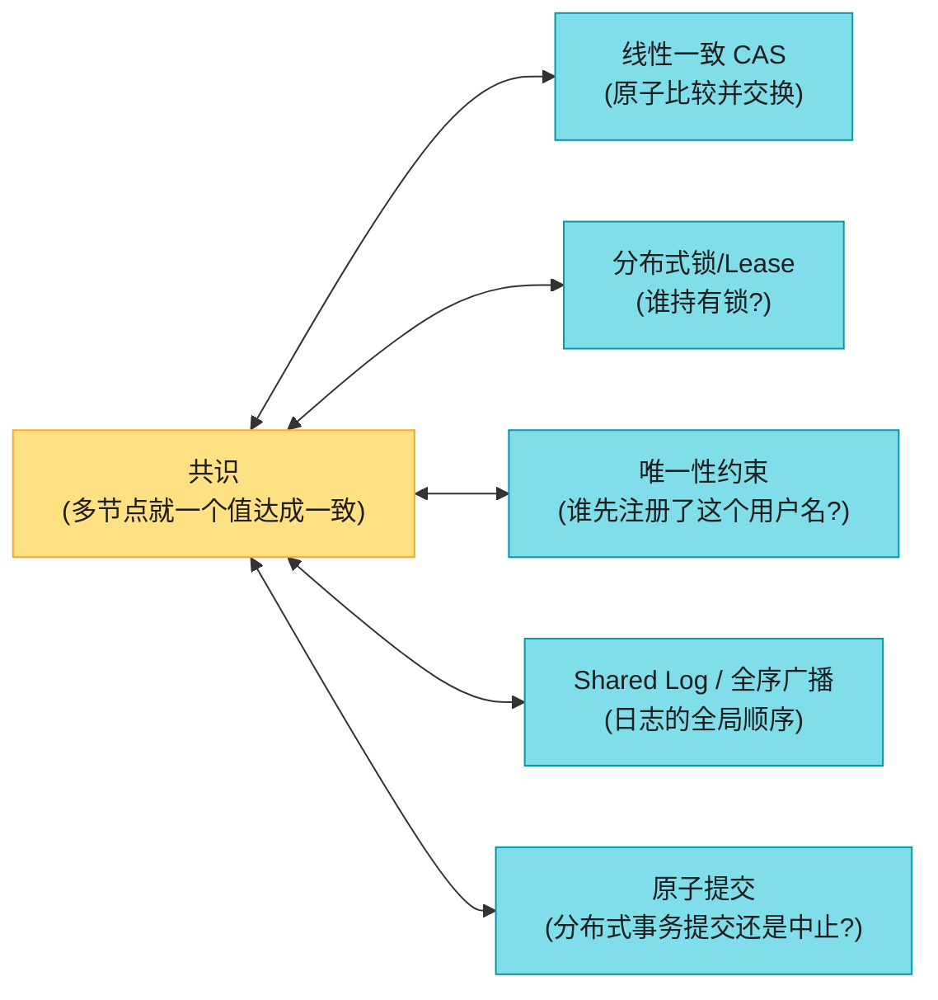
```mermaid
flowchart LR
    C["共识<br/>(多节点就一个值达成一致)"]
    CAS["线性一致 CAS<br/>(原子比较并交换)"]
    LOCK["分布式锁/Lease<br/>(谁持有锁?)"]
    UNIQUE["唯一性约束<br/>(谁先注册了这个用户名?)"]
    LOG["Shared Log / 全序广播<br/>(日志的全局顺序)"]
    ATOMIC["原子提交<br/>(分布式事务提交还是中止?)"]

    C <--> CAS
    C <--> LOCK
    C <--> UNIQUE
    C <--> LOG
    C <--> ATOMIC

    style C fill:#FFE082,stroke:#F9A825,color:#1f1f1f
    style CAS fill:#80DEEA,stroke:#0097A7,color:#1f1f1f
    style LOCK fill:#80DEEA,stroke:#0097A7,color:#1f1f1f
    style UNIQUE fill:#80DEEA,stroke:#0097A7,color:#1f1f1f
    style LOG fill:#80DEEA,stroke:#0097A7,color:#1f1f1f
    style ATOMIC fill:#80DEEA,stroke:#0097A7,color:#1f1f1f
```

#### 深入:为什么这些全等价(reduction 论证)

每个等价性都给出**双向归约**(我有 A 就能造 B,有 B 就能造 A):

- **CAS ⟺ 共识**:有线性一致 CAS,初始化寄存器为 null,每个想提议的节点做 `CAS(null, 我的值)`,赢的那个值就是决定值;反过来,有共识就能实现 CAS(多个节点想做同一 CAS,用共识决定用谁的新值)。**CAS 的共识数 = ∞**(任意多节点)[30]。
- **Shared Log ⟺ 共识**:有 Shared Log,把每个提议值 append 进去,**第一条日志**就是决定值;反过来,有共识,对日志**每个槽位**跑一次共识(slot by slot)就拼出 Shared Log。
- **原子提交 ⟺ 共识**:相似但不完全一样——原子提交要求"**只要有一个节点投 abort 就必须 abort**"(共识不要求这点)。但用共识可实现原子提交:每个节点把 commit/abort 票广播给所有人,收到全 commit 才提议"commit",否则提议"abort"[80][81]。
- **fetch-and-add ⟺ 共识**:用 CAS 可实现 fetch-and-add(读后 CAS+1,失败重试)。但反过来,fetch-and-add 的**共识数只有 2**——只够两个节点达成共识!>2 个节点时,读到 0 的赢家若在通知别人前崩溃,其他人就卡死(不知道谁赢了)。这是 Herlihy **共识数层级** [30] 的精髓:不同原子原语能解决的共识规模不同。

> **深刻洞察**:Leader 选举、分布式锁、唯一性约束、全序广播、原子提交——这些面试常考的"不同问题",底层都是**同一个**问题。所以学会一个共识算法(Raft),你就拿到了解决这一整类的钥匙。

### Shared Log / 全序广播 (Total Order Broadcast)

实践中共识最常用的形态不是"单值共识",而是 **Shared Log(共享日志)**:

| 属性 | 含义 |
|------|------|
| **Eventual Append** | 节点请求加值且不崩溃 → 该值最终出现在日志中 |
| **Reliable Delivery** | 一个节点读到某条 → 所有未崩溃节点最终也读到 |
| **Append-Only** | 已读条目不可变,新条目只能加在后面 |
| **Agreement** | 任意两节点看到同一条目前的日志序列**完全相同** |

> 📝 **名词注释:全序广播 / 原子广播 (Total Order Broadcast / Atomic Broadcast)**<br>Shared Log 的协议层别名 [78][79]。要"加值"就"广播",协议"投递"时该值就成了日志条目。Raft、Multi-Paxos、Zab **开箱即提供**这个抽象。**共识系统在实践中 = Shared Log。**

### 从共识到状态机复制 (SMR)

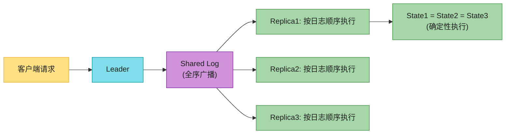
```mermaid
flowchart LR
    CLIENT["客户端请求"] --> LEADER["Leader"]
    LEADER --> LOG["Shared Log<br/>(全序广播)"]
    LOG --> R1["Replica1: 按日志顺序执行"]
    LOG --> R2["Replica2: 按日志顺序执行"]
    LOG --> R3["Replica3: 按日志顺序执行"]
    R1 --> STATE["State1 = State2 = State3<br/>(确定性执行)"]

    style CLIENT fill:#FFE082,stroke:#F9A825,color:#1f1f1f
    style LEADER fill:#80DEEA,stroke:#0097A7,color:#1f1f1f
    style LOG fill:#CE93D8,stroke:#7B1FA2,color:#1f1f1f
    style R1 fill:#A5D6A7,stroke:#388E3C,color:#1f1f1f
    style R2 fill:#A5D6A7,stroke:#388E3C,color:#1f1f1f
    style R3 fill:#A5D6A7,stroke:#388E3C,color:#1f1f1f
    style STATE fill:#A5D6A7,stroke:#388E3C,color:#1f1f1f
```

所有副本按**相同顺序**执行**相同操作** → 所有副本达到**相同状态**。这就是 **State Machine Replication (SMR)** [82]——CockroachDB、TiDB、etcd 等的核心架构。**前提**:执行逻辑是**确定性**的(同样的输入永远同样的输出,不能 `time.Now()`/`rand()`),否则副本会分叉。第 8 章讲的 VoltDB 串行执行、事件溯源(Event Sourcing + CQRS)都是 SMR 的应用。

### 从单主复制到共识:两轮投票

单主复制 = 一个"独裁者" Leader 独占写日志。问题是 Leader 挂了怎么办——**手动 failover 太慢**(违反 Termination),需要**自动选新 Leader**。这就陷入循环怪圈:**选 Leader 需要共识,而共识又需要 Leader**。怎么破?

共识算法的破法:不要求"任意时刻只有一个 Leader",而是更弱的保证——**每个 epoch(任期)内 Leader 唯一**。Raft 叫 term,Paxos 叫 ballot,VR 叫 view。

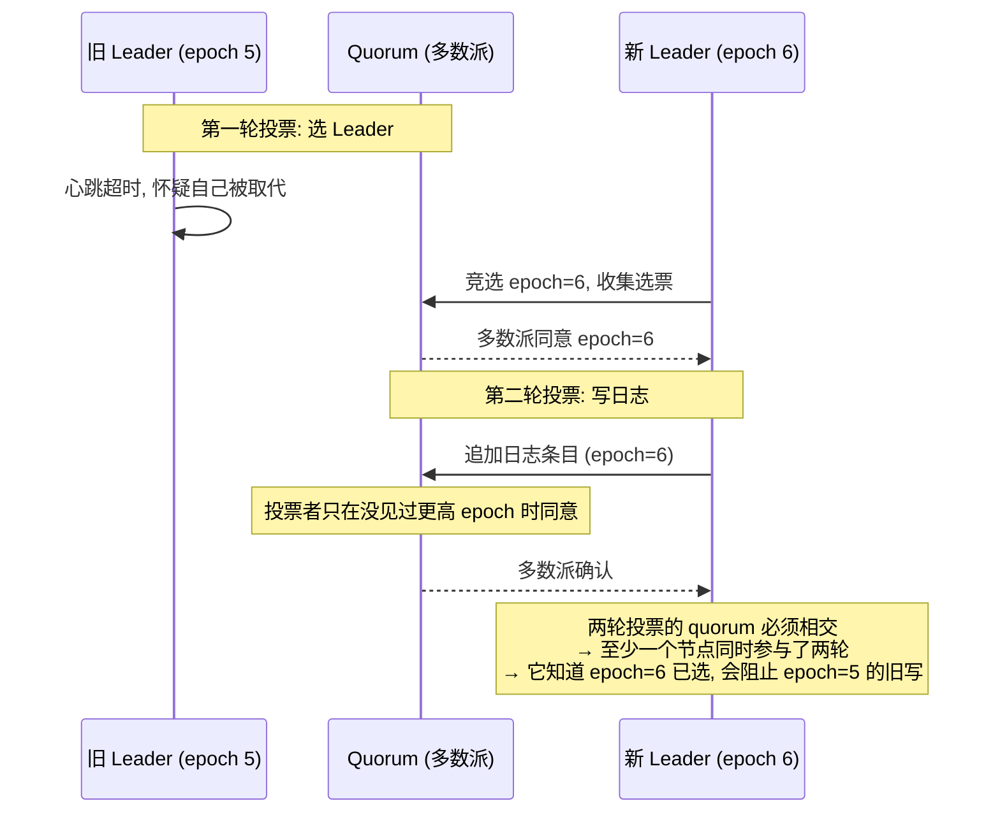
```mermaid
sequenceDiagram
    participant L1 as 旧 Leader (epoch 5)
    participant Q as Quorum (多数派)
    participant L2 as 新 Leader (epoch 6)

    Note over L1,Q: 第一轮投票: 选 Leader
    L1->>L1: 心跳超时, 怀疑自己被取代
    L2->>Q: 竞选 epoch=6, 收集选票
    Q-->>L2: 多数派同意 epoch=6

    Note over L2,Q: 第二轮投票: 写日志
    L2->>Q: 追加日志条目 (epoch=6)
    Note over Q: 投票者只在没见过更高 epoch 时同意
    Q-->>L2: 多数派确认

    Note over L2: 两轮投票的 quorum 必须相交<br/>→ 至少一个节点同时参与了两轮<br/>→ 它知道 epoch=6 已选, 会阻止 epoch=5 的旧写
```

#### 深入:两轮投票 vs 2PC 的本质区别

它们长得像(都是"收集投票→确认"),但**完全不同**:

| | 共识的两轮投票 | 2PC 两阶段提交 |
|--|--------------|--------------|
| **谁能发起** | **任意**节点都能发起选举 | **只有** coordinator 能请求投票 |
| **需要多少同意** | 只需 **quorum**(多数派) | 需要**每个** participant 都 yes(全部) |
| **目的** | 选出唯一 Leader + 确认日志条目 | 让所有参与者一致提交/中止 |
| **抗错** | quorum 相交保证安全 | coordinator 单点故障会阻塞 |

> 📝 **名词注释:Flexible Paxos [88]**<br>经典共识假设两轮投票用**同一个多数派**。Howard 等人证明:其实只要**两个 quorum 相交**即可,**不必都是多数派**!比如选举用 quorum、日志确认只需 1 个节点(只要它参与了那次选举)。这大幅降低延迟——日志写入只需 Leader + 1 个副本(而非多数派)就能安全。工业界开始采用这种思想优化。

**Raft 和 Paxos 的核心差异**就在这第二步的细节——Leader 挂了怎么保证新 Leader 不丢已提交日志:

- **Raft**:只有日志**至少和多数派一样新**的节点能当选 → 新 Leader 天生拥有所有已提交日志,不用补;
- **Paxos**:任何节点都能当选,但选后必须先把日志补全到最新,才能开始追加新条目。

## 10.5 Raft 算法详解 ⭐⭐⭐

> Raft [25] 由 Diego Ongaro 于 2014 年发表(同年的博士论文 [67] 是工程细节宝库),设计目标只有两个字:**可理解性 (understandability)**。Paxos 出了名地难懂难实现 [60][61],Raft 通过**强制单 Leader + 不允许日志间隙 + 问题分解**把共识讲明白了,如今是工业界**最广泛采用**的共识算法(etcd、TiKV、CockroachDB、Consul、Kafka KRaft、Nebula、几乎所有自研 KV……)。

### Raft 的三个子问题

Raft 把共识拆成三个相对独立、可单独理解的子问题:

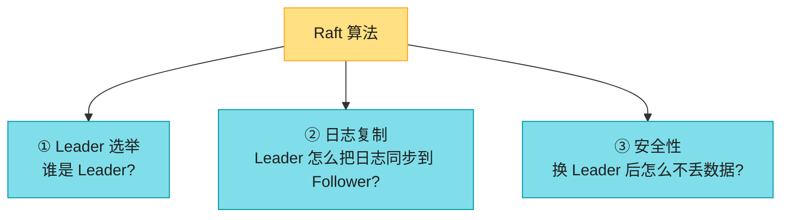
```mermaid
flowchart TD
    RAFT["Raft 算法"]
    RAFT --> LE["① Leader 选举<br/>谁是 Leader?"]
    RAFT --> LR["② 日志复制<br/>Leader 怎么把日志同步到 Follower?"]
    RAFT --> SAFE["③ 安全性<br/>换 Leader 后怎么不丢数据?"]

    style RAFT fill:#FFE082,stroke:#F9A825,color:#1f1f1f
    style LE fill:#80DEEA,stroke:#0097A7,color:#1f1f1f
    style LR fill:#80DEEA,stroke:#0097A7,color:#1f1f1f
    style SAFE fill:#80DEEA,stroke:#0097A7,color:#1f1f1f
```

### 角色与 Term

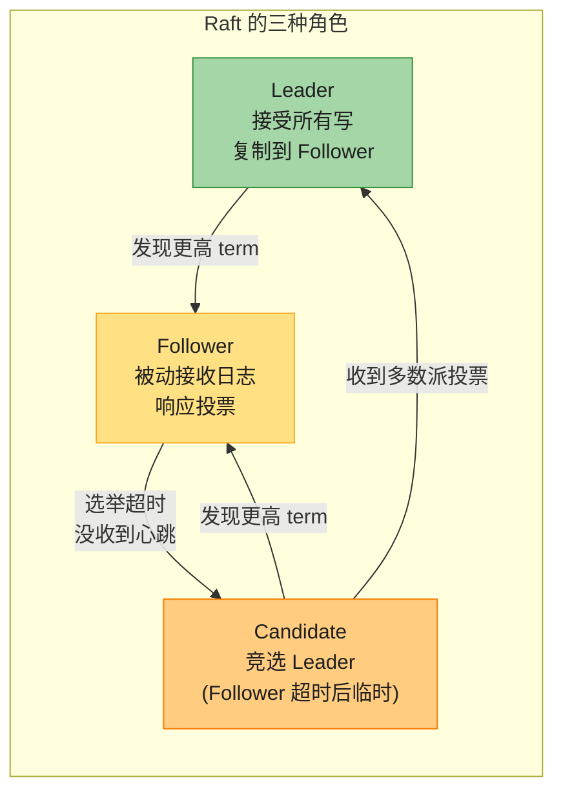
```mermaid
flowchart LR
    subgraph ROLES["Raft 的三种角色"]
        L["Leader<br/>接受所有写<br/>复制到 Follower"]
        F["Follower<br/>被动接收日志<br/>响应投票"]
        C["Candidate<br/>竞选 Leader<br/>(Follower 超时后临时)"]
    end
    F -->|"选举超时<br/>没收到心跳"| C
    C -->|"收到多数派投票"| L
    C -->|"发现更高 term"| F
    L -->|"发现更高 term"| F

    style L fill:#A5D6A7,stroke:#388E3C,color:#1f1f1f
    style F fill:#FFE082,stroke:#F9A825,color:#1f1f1f
    style C fill:#FFCC80,stroke:#F57C00,color:#1f1f1f
```

**Term(任期)** = Raft 的逻辑时钟,单调递增的整数。**每个 term 最多一个 Leader。**

| Term 规则 | 说明 |
|---------|------|
| 每个节点跟踪当前 term | term 随消息传播 |
| 收到**更高** term → 更新自己 term | 旧 Leader 发现更高 term → 自动降级 Follower |
| 收到**更低** term → 拒绝 | 过期 Leader 的请求被无视 |

#### 深入:为什么用 Term 而不用物理时钟?

这正是第 9 章"不可靠时钟"的延续。物理钟会漂移、跳变、NTP 回退,用它编号任期会乱。Term 是**逻辑时钟**——只在节点通信时推进,**单调可靠**。Raft 的安全性证明完全建立在 term 之上,不依赖任何时钟同步假设。这也是为什么 Raft 在网络抖动下仍安全(只是可能性能差)。

### ① Leader 选举详解

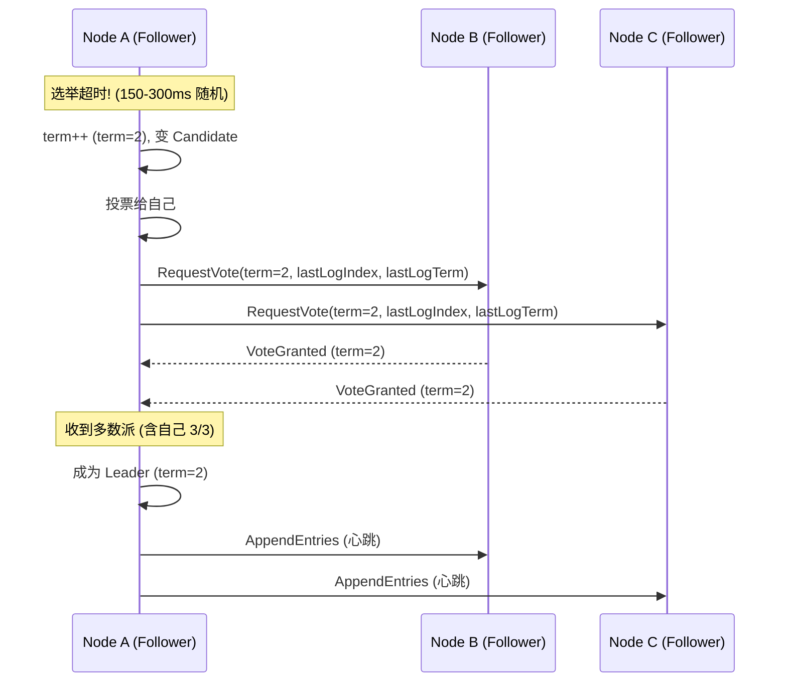
```mermaid
sequenceDiagram
    participant F1 as Node A (Follower)
    participant F2 as Node B (Follower)
    participant F3 as Node C (Follower)

    Note over F1: 选举超时! (150-300ms 随机)
    F1->>F1: term++ (term=2), 变 Candidate
    F1->>F1: 投票给自己
    F1->>F2: RequestVote(term=2, lastLogIndex, lastLogTerm)
    F1->>F3: RequestVote(term=2, lastLogIndex, lastLogTerm)

    F2-->>F1: VoteGranted (term=2)
    F3-->>F1: VoteGranted (term=2)

    Note over F1: 收到多数派 (含自己 3/3)
    F1->>F1: 成为 Leader (term=2)
    F1->>F2: AppendEntries (心跳)
    F1->>F3: AppendEntries (心跳)
```

**选举关键规则**:

| 规则 | 目的 |
|------|------|
| 每个节点在同一 term **只能投一票** | 保证同一 term 最多一个 Leader |
| 选举超时是**随机**的(如 150-300ms) | 错开多个 Candidate 同时竞选,避免 split vote |
| Candidate 的日志必须**至少和投票者一样新** | 保证新 Leader 拥有所有已提交日志(安全性!) |

#### 深入:选举安全性证明(为什么"只投日志最新的")

这是 Raft 安全性的根基。投票者比较 `(lastLogTerm, lastLogIndex)`:

- 若 Candidate 的 `lastLogTerm` 更大 → Candidate 更新;
- 若 term 相同,`lastLogIndex` 更大 → Candidate 更新;
- 否则 → 拒绝投票。

**为什么这样能保证新 Leader 有所有已提交日志?** 一条日志被提交 ⟺ 它被**多数派**复制。新 Leader 必须获**多数派**投票。这两个多数派**至少有一个节点重叠**——那个重叠节点如果**没有**那条已提交日志,就不会投票给一个更旧的 Candidate(它自己都比 Candidate 新)。所以能拿到多数派票的 Candidate,日志一定**至少和那个重叠节点一样新**,即**包含所有已提交日志**。这是 Raft 比 Paxos 简洁的地方——安全性靠选举投票规则一步到位。

#### 深入:Pre-vote 优化(防止断网节点扰乱)

原始 Raft 有个坑:一个节点因网络分区和其他节点断开,反复超时 → term 不停 `++`(涨到天上去)。网络恢复后,它带着超高 term 回来发起选举,虽然它日志旧、选不上,但它的超高 term 会**迫使真正在工作的 Leader 降级**,触发新一轮选举,**扰乱整个集群**——这就是论文 [67][68] 说的 Raft 边角案例。

**Pre-vote 解法**:正式 `RequestVote` 前先发一轮 **PreVote**(不增加 term),只问"如果我现在竞选,你们会投我吗?"。只有拿到多数派 PreVote 同意,才真正 `term++` 发起选举。断网节点回来时,PreVote 拿不到多数派(别人还在跟随 Leader),就不会涨 term、不会扰乱。**几乎所有生产 Raft 实现都启用了 Pre-vote**(etcd/raft、HashiCorp Raft 等)。

### ② 日志复制详解

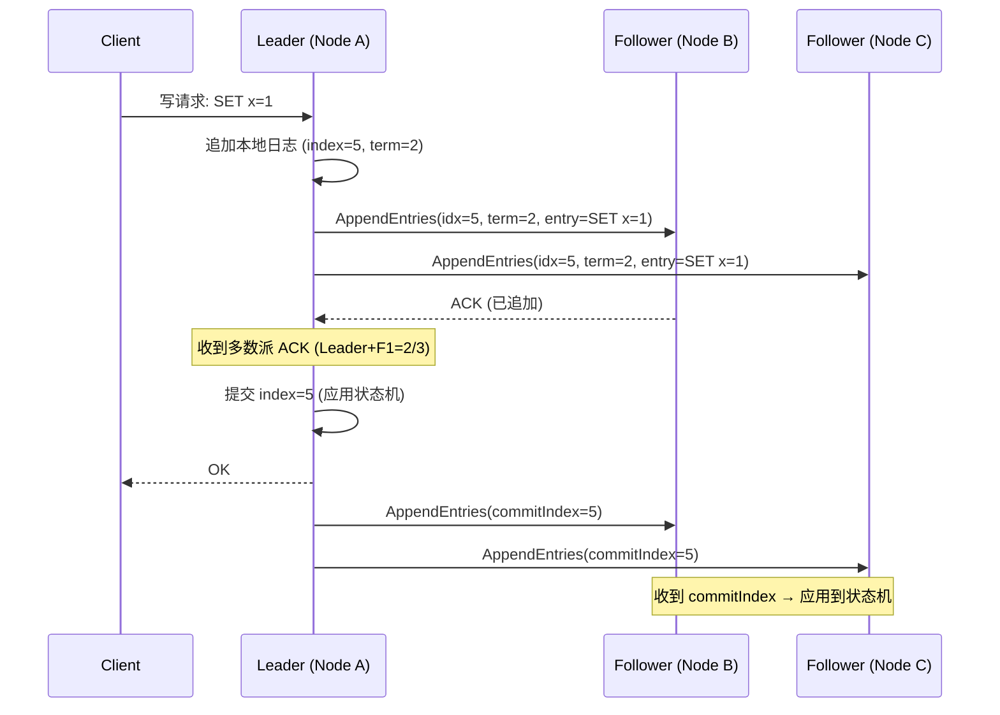
```mermaid
sequenceDiagram
    participant Client
    participant Leader as Leader (Node A)
    participant F1 as Follower (Node B)
    participant F2 as Follower (Node C)

    Client->>Leader: 写请求: SET x=1
    Leader->>Leader: 追加本地日志 (index=5, term=2)
    Leader->>F1: AppendEntries(idx=5, term=2, entry=SET x=1)
    Leader->>F2: AppendEntries(idx=5, term=2, entry=SET x=1)
    F1-->>Leader: ACK (已追加)
    Note over Leader: 收到多数派 ACK (Leader+F1=2/3)
    Leader->>Leader: 提交 index=5 (应用状态机)
    Leader-->>Client: OK
    Leader->>F1: AppendEntries(commitIndex=5)
    Leader->>F2: AppendEntries(commitIndex=5)
    Note over F1,F2: 收到 commitIndex → 应用到状态机
```

**日志两个关键属性**:

| 属性 | 含义 |
|------|------|
| **Log Matching**(日志匹配) | 若两节点在某 index 有**相同 term**的条目 → 从开头到该 index **完全相同**。(靠 AppendEntries 带前一条的 index+term 保证) |
| **Leader Completeness**(Leader 完整性) | 某条目在某 term 被提交 → 出现在**所有后续 term** 的 Leader 日志中。(靠选举规则保证) |

#### 深入:日志冲突处理(nextIndex 回退)

Leader 给每个 Follower 维护 `nextIndex`(下次发的日志位置)。正常情况下 Follower 追加成功。但如果 Follower 落后/有冲突条目,会拒绝 AppendEntries,Leader 把 `nextIndex--` **回退**重试,直到找到两边日志一致的位置,然后**用 Leader 的日志覆盖** Follower 的冲突部分。

朴素实现每次回退一条 → 一条条试,慢。**优化**:Follower 拒绝时返回**冲突的起始 index 和 term**,Leader 一次跳过整段冲突 term → 批量回退。这对"落后很多的 Follower"恢复速度提升巨大。

#### 深入:committed vs applied——两个不同的概念

新手最容易混淆。Raft 日志有两条进度线:

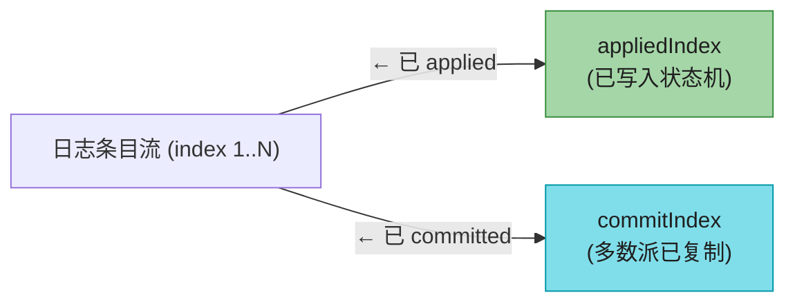
```mermaid
flowchart LR
    LOG["日志条目流 (index 1..N)"] -->|"← 已 applied"| AP["appliedIndex<br/>(已写入状态机)"]
    LOG -->|"← 已 committed"| CM["commitIndex<br/>(多数派已复制)"]

    style AP fill:#A5D6A7,stroke:#388E3C,color:#1f1f1f
    style CM fill:#80DEEA,stroke:#0097A7,color:#1f1f1f
```

- **committed(已提交)**:日志条目被**多数派**复制 → **不会丢**,即使 Leader 崩溃。这是持久性保证。
- **applied(已应用)**:条目被执行到状态机(如真正写入 KV)。applied **一定 ≤** committed。

**只有 Leader 才能决定 commit**,且只能 commit **当前 term** 的条目(不能直接提交旧 term 的条目——这是 Raft Figure 8 那个著名坑:旧 term 条目虽被多数派复制,但可能被覆盖,直接提交会违反安全性)。Leader 通过提交**自己当前 term** 的一条新条目,顺带把之前所有条目都提交了。

### ③ 安全性:Leader 切换不丢数据

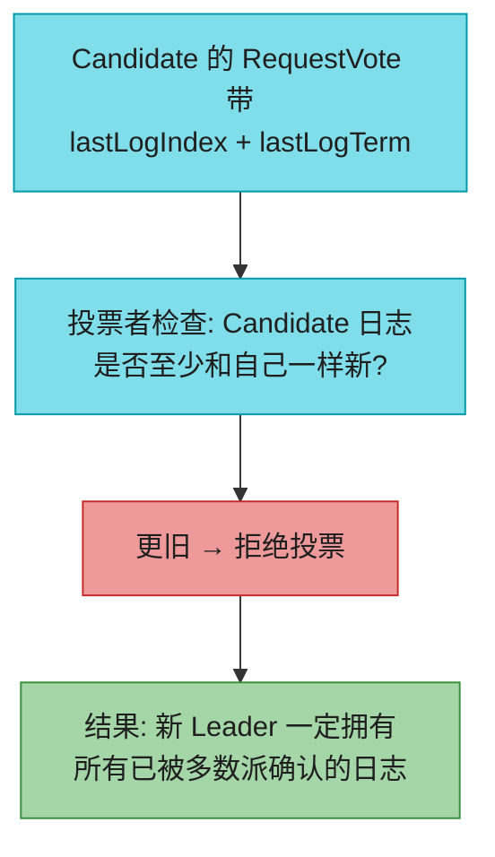
```mermaid
flowchart TD
    S1["Candidate 的 RequestVote 带<br/>lastLogIndex + lastLogTerm"]
    S2["投票者检查: Candidate 日志<br/>是否至少和自己一样新?"]
    S3["更旧 → 拒绝投票"]
    S4["结果: 新 Leader 一定拥有<br/>所有已被多数派确认的日志"]
    S1 --> S2 --> S3 --> S4

    style S1 fill:#80DEEA,stroke:#0097A7,color:#1f1f1f
    style S2 fill:#80DEEA,stroke:#0097A7,color:#1f1f1f
    style S3 fill:#EF9A9A,stroke:#C62828,color:#1f1f1f
    style S4 fill:#A5D6A7,stroke:#388E3C,color:#1f1f1f
```

### 成员变更(Reconfiguration)

标准 Raft 假设**固定节点集**。实际常需加减节点(扩容、换机器、加区域)。难点:**新旧配置切换的瞬间**,可能同时出现两个不相交的多数派 → 脑裂。

两种方案:

| 方案 | 做法 |
|------|------|
| **Joint Consensus(联合共识)** | 论文 [25] 的两阶段:先写入"联合配置"(旧+新两集群,任何决定要**各自多数派**都同意)→ 联合配置提交后,再切到"纯新配置"。绝对安全但复杂。 |
| **单节点变更(Single-Server Change)** | **每次只加/减一个节点**。数学上:从 `2f+1` 变 `2f+1 ±1`(奇偶交替),旧多数派和新多数派**必然相交**,不会脑裂。**实现简单**,etcd/HashiCorp 都默认用这个。 |

> ⚠️ **单节点变更的陷阱**:一次只能进行一个变更。如果两个并发变更(各加减一个节点),可能同时存在不相交多数派。所以实现里要用一个"配置变更进行中"的标志,**串行化**所有变更。

### 快照(Snapshot / Log Compaction)

日志无限增长会撑爆磁盘,重启重放也慢。**快照**:把当前状态机序列化存盘,**丢弃**快照点之前的日志条目。

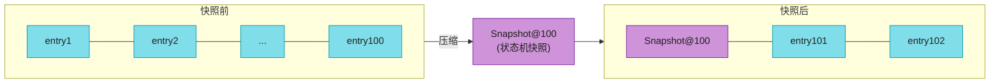
```mermaid
flowchart LR
    subgraph Before["快照前"]
        direction LR
        E1["entry1"] --- E2["entry2"] --- E3["..."] --- E100["entry100"]
    end
    Before -->|"压缩"| SNAP["Snapshot@100<br/>(状态机快照)"]
    SNAP --> AFTER
    subgraph AFTER["快照后"]
        direction LR
        SNAP2["Snapshot@100"] --- E101["entry101"] --- E102["entry102"]
    end

    style SNAP fill:#CE93D8,stroke:#7B1FA2,color:#1f1f1f
    style SNAP2 fill:#CE93D8,stroke:#7B1FA2,color:#1f1f1f
    style E1 fill:#80DEEA,stroke:#0097A7,color:#1f1f1f
    style E2 fill:#80DEEA,stroke:#0097A7,color:#1f1f1f
    style E3 fill:#80DEEA,stroke:#0097A7,color:#1f1f1f
    style E100 fill:#80DEEA,stroke:#0097A7,color:#1f1f1f
    style E101 fill:#80DEEA,stroke:#0097A7,color:#1f1f1f
    style E102 fill:#80DEEA,stroke:#0097A7,color:#1f1f1f
```

**Leader 用 `InstallSnapshot` RPC 把快照发给严重落后的 Follower**(它需要的日志已经被压缩掉了)。etcd 的快照用 boltdb,HashiCorp 用 FSM 抽象让用户自定义。这是 6.824 Lab 3 必做。

### Raft 线性一致读

**坑**:光有日志复制还不能保证线性一致读——Leader 可能已被取代但自己不知道(网络分区导致),它还以为自己是 Leader,直接读就会返回旧值。四种读策略:

| 读策略 | 线性一致? | 性能 | 说明 |
|--------|---------|------|------|
| 读走 Leader,无额外措施 | ❌ 可能读旧值 | 最快 | Leader 可能是过期的 |
| **走日志(Read as Write)** | ✅ | 慢 | 把读也当一条日志条目走共识,杀鸡用牛刀 |
| **ReadIndex** | ✅ | 一次额外 RTT | Leader 先发心跳确认自己还是 Leader,再读 |
| **LeaseRead(租约读)** | ⚠️ 依赖时钟 | 快 | Leader 靠租约期内不确认直接读,依赖时钟 |
| 读走 Follower + ReadIndex | ✅ 但更慢 | 分散读负载 | Follower 向 Leader 要 ReadIndex |

#### 深入:ReadIndex 完整时序

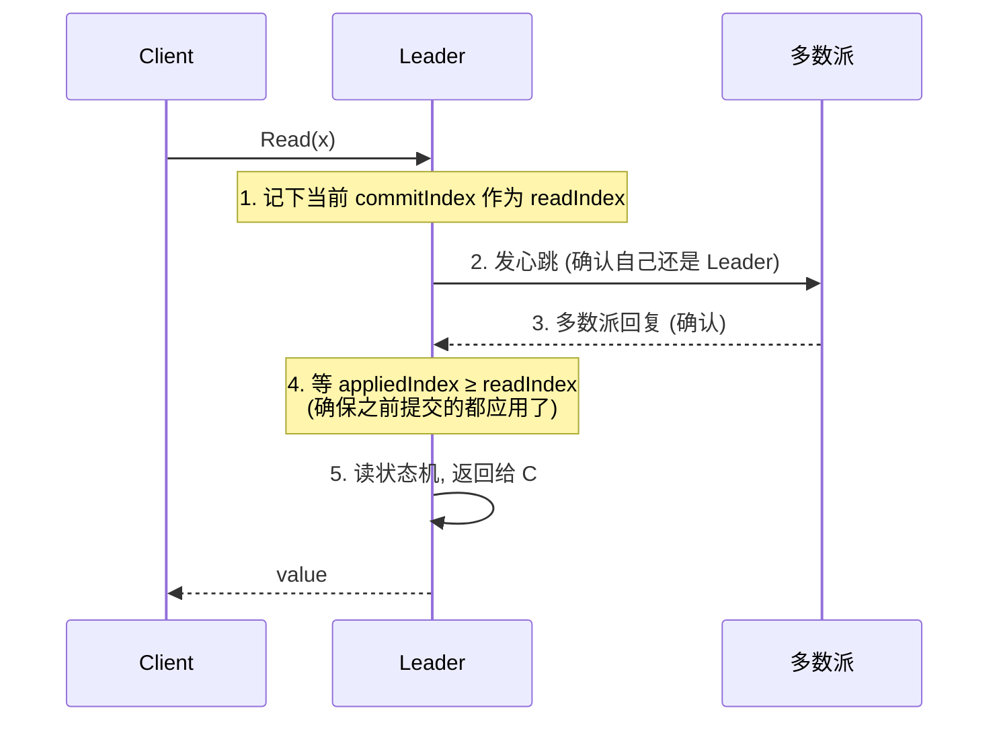
```mermaid
sequenceDiagram
    participant C as Client
    participant L as Leader
    participant Q as 多数派

    C->>L: Read(x)
    Note over L: 1. 记下当前 commitIndex 作为 readIndex
    L->>Q: 2. 发心跳 (确认自己还是 Leader)
    Q-->>L: 3. 多数派回复 (确认)
    Note over L: 4. 等 appliedIndex ≥ readIndex<br/>(确保之前提交的都应用了)
    L->>L: 5. 读状态机, 返回给 C
    L-->>C: value
```

第 2-3 步的"心跳确认"防止过期 Leader 返回旧值;第 4 步的"等 appliedIndex"确保读到的是最新已提交状态。etcd v3 的线性一致读默认走 ReadIndex。

## 10.6 Raft 源码精读:etcd/raft ⭐⭐⭐

> 你做 MIT 6.824 Lab 2 时实现的是"教学版 Raft"——网络、磁盘、状态机都耦合在一起。但**生产级**的 etcd/raft(`go.etcd.io/raft` / `github.com/etcd-io/raft`)设计哲学完全不同:它把 Raft 抽象成一个**纯状态机库**,把网络、磁盘、线程全部踢到库外。理解这个设计,你才能看懂 TiKV、CockroachDB、etcd 怎么用同一个 Raft 库构建完全不同的系统。

### etcd/raft 的设计哲学:库 vs 服务

教学版 Raft 的问题:网络层(gRPC/RPC)、持久化(WAL/Snapshot)、状态机应用(KV/配置)全部和共识逻辑缠在一起,不可复用,也几乎无法单测。etcd/raft 的破法:

```mermaid
flowchart LR
    APP["你的应用<br/>(etcd server / TiKV / ...)"] -->|"Propose(entry)"| LIB
    LIB["etcd/raft 库<br/>(纯状态机)"]
    APP <-.->|"Ready{HardState, Entries,<br/>CommittedEntries, Messages, Snapshot}"| LIB
    APP -->|"Advance()"| LIB
    APP -->|"Step(Message)"| LIB

    APP -->|"自己处理"| NET["网络发送"]
    APP -->|"自己处理"| WAL["WAL 持久化"]
    APP -->|"自己处理"| SM["状态机 Apply"]

    style LIB fill:#80DEEA,stroke:#0097A7,color:#1f1f1f
    style APP fill:#FFE082,stroke:#F9A825,color:#1f1f1f
    style NET fill:#90CAF9,stroke:#1976D2,color:#1f1f1f
    style WAL fill:#90CAF9,stroke:#1976D2,color:#1f1f1f
    style SM fill:#90CAF9,stroke:#1976D2,color:#1f1f1f
```

**核心约定**:
- 库**不碰**网络、磁盘、时钟、线程;
- 库通过 `Ready` 结构**告诉应用**该做什么(持久化哪些 entry、发哪些消息、apply 哪些已提交 entry);
- 应用做完后调 `Advance()` 告诉库"我处理完了,继续"。

#### 深入:为什么把 IO 踢出核心?

三个理由:
1. **可测试性**——纯状态机可单测(喂确定的输入,断言确定的输出),无需 mock 网络/磁盘。etcd/raft 有 12000+ 行测试,这是基石。
2. **可移植**——同一个库,TiKV 用 Rust FFI 调,etcd 用原生 Go 调,HashiCorp 自己另写了一套但思路相同。应用层自由选择 boltdb/RocksDB/任意存储。
3. **解耦故障域**——网络慢、磁盘满是 IO 层的事,不该让共识核心阻塞或崩溃。

> 📝 **名词注释:Ready(就绪快照)**<br>etcd/raft 最关键的数据结构。它是一次性的"待办清单":`SoftState`(Leader/状态,无需持久化)、`HardState`(term/vote/commit,**必须**持久化)、`Entries`(新日志条目,**必须**先持久化再发消息)、`CommittedEntries`(可应用到状态机)、`Messages`(可发送的消息)、`Snapshot`(可保存的快照)。应用处理完整个 Ready 才能 `Advance()`。

### 核心数据结构

```go
// raft.go —— 共识核心状态机
type raft struct {
    id                uint64              // 本节点 id
    Term, Vote        uint64              // 当前任期 / 投票对象
    lead              uint64              // 当前 Leader id
    state             StateType           // StateFollower/StateCandidate/StateLeader/StatePreCandidate
    raftLog           *raftLog            // 日志(含 unstable + storage)
    prs               tracker.ProgressTracker // 各 peer 的复制进度(Match/Next)
    msgs              []pb.Message        // 本轮要发出的消息
    leadTransferee    uint64              // Leader 转移目标
    pendingConfIndex  uint64
    readStates        []ReadState         // ReadIndex 用
    step              stepFunc            // 状态相关:stepLeader/stepCandidate/stepFollower
    tick              tickFunc            // 计时:tickHeartbeat / tickElection
    electionElapsed, heartbeatElapsed int
    // ...
}

// raftLog.go —— 日志管理
type raftLog struct {
    storage    Storage              // 已持久化的(由应用提供,通常 WAL + snapshot)
    committed  uint64               // 已提交 index
    applied    uint64               // 已应用 index
    unstable   unstable             // 尚未持久化的 entry
}

// tracker/inflights.go —— 每个 peer 的进度
type Progress struct {
    Match, Next uint64              // Match=已确认复制的最高 index; Next=下次要发的 index
    State       ProgressStateType   // ProgressStateProbe/Replicate/Snapshot
    ins         *Inflights          // 在途消息(用于流控/滑动窗口)
}
```

> **关键**:`Match` 是 Leader **确认** Follower 已有的最高 index(收到 ACK 后更新);`Next` 是 Leader **打算**下次发的 index。`Next = Match + 1` 是正常态;日志冲突时 `Next` 回退。

### 消息类型(MessageType)

```go
// raftpb/raft.proto
enum MessageType {
    MsgHup         = 0;   // 内部:选举超时触发(→ campaign)
    MsgBeat        = 1;   // 内部:心跳触发
    MsgProp        = 2;   // 应用提议新 entry
    MsgApp         = 3;   // Leader → Follower:发日志(AppendEntries)
    MsgAppResp     = 4;   // Follower → Leader:ACK/Reject
    MsgVote        = 5;   // Candidate → all:请求投票
    MsgVoteResp    = 6;   // 投票响应
    MsgPreVote     = 16;  // Pre-vote 阶段
    MsgPreVoteResp = 17;
    MsgSnap        = 7;   // 发送快照(InstallSnapshot)
    MsgHeartbeat   = 8;   // 心跳(空 AppendEntries)
    MsgHeartbeatResp = 9;
    MsgUnreachable = 10;  // 应用告知:某节点不可达(Leader 应把它的 Next 回退)
    MsgSnapStatus  = 11;  // 快照发送成功/失败
    MsgCheckQuorum = 12;  // Leader 主动检查 quorum(防过期 Leader)
    MsgTransferLeader = 13; // Leader 转移
    MsgTimeoutNow  = 14;  // Leader 允许某节点立即竞选(Leader transfer)
    MsgReadIndex   / MsgReadIndexResp // ReadIndex 读
}
```

**设计亮点**:内部事件(超时、提议)和外部消息(网络 RPC)**统一**成 `Message`。`tick` 触发超时时,本质也是往自己 `Step` 一条 `MsgHup`;应用提议是 `Step` 一条 `MsgProp`。**整个状态机的驱动入口只有一个:`Step(m Message)`**。

### 主循环:Step + tick + Ready

```go
// node.go —— 应用侧的事件循环
func (n *node) run() {
    var propc chan string
    for {
        rd := n.rn.Ready()        // 1. 先取当前 Ready
        select {
        case <-n.tickc:
            n.rn.Tick()           // 2. 定时驱动(选举超时 / 心跳)
        case m := <-n.recvc:
            n.rn.Step(m)          // 3. 收到网络消息,喂给状态机
        default:
            if propc != nil {
                select {
                case p := <-propc:
                    n.rn.Step(pb.Message{Type: MsgProp, Entries: ...}) // 4. 提议
                }
            }
        }
        // 5. 把新的 Ready 投递给应用处理(异步)
        if rd.SoftState != nil || ... {
            n.ready <- rd
        }
    }
}
```

应用的消费侧(这是**你写 6.824 / 用 etcd/raft 时真正要写的代码**):

```go
// 应用主循环 —— 模板,etcd/CockroachDB/TiKV 都是这个骨架
for {
    select {
    case <-ticker.C:
        node.Tick()                       // 驱动时钟

    case rd := <-node.Ready():
        // ⚠️ 顺序至关重要:
        // (a) 先持久化 HardState + Entries 到 WAL
        wal.Save(rd.HardState, rd.Entries)
        // (b) 保存快照(如果有)
        if !raft.IsEmptySnap(rd.Snapshot) {
            wal.SaveSnapshot(rd.Snapshot)
            sm.ApplySnapshot(rd.Snapshot)
        }
        // (c) 再发消息!(必须等 WAL 落盘,否则消息先到、本地没存,崩溃就丢)
        for _, m := range rd.Messages {
            transport.Send(m)
        }
        // (d) 应用已提交 entry 到状态机
        for _, entry := range rd.CommittedEntries {
            sm.Apply(entry)
        }
        // (e) 通知库:处理完了
        node.Advance()

    case <-node.Tick():
        node.Tick()
    }
}
```

> ⚠️ **顺序铁律**:`Save WAL → Send Messages`。消息**必须**在 WAL 持久化后发——否则消息先到 Follower、Leader 本地还没落盘就崩溃,这条 entry 就丢了。这是 etcd/raft 论文级别的正确性细节,6.824 Lab 扣分大户。

### 写路径源码走读

```mermaid
sequenceDiagram
    participant App as 应用
    participant N as node
    participant R as raft 状态机
    participant RL as raftLog

    App->>N: Propose(data)
    N->>R: Step(MsgProp{Entries:[data]})
    R->>RL: append 到 unstable
    R->>R: bcastAppend (生成 MsgApp 给所有 peer)
    R-->>N: msgs 里多了 N 条 MsgApp
    N-->>App: Ready{Entries:[data], Messages:[MsgApp...]}
    Note over App: 持久化 entry, 发出 MsgApp

    Note over R: ...收到多数派 MsgAppResp...
    App->>N: Step(MsgAppResp{Index:5})
    R->>RL: 更新该 peer 的 Match=5
    R->>RL: maybeAdvanceCommit (多数派 Match 推进 commitIndex)
    R-->>N: Ready{CommittedEntries:[entry@5]}
    App->>App: sm.Apply(entry@5) → 返回客户端 OK
```

**`bcastAppend`** 遍历所有 peer 的 `Progress`,对每个发一条 `MsgApp`(带上 `prevIndex/prevTerm/entries/commitIndex`)。Follower 收到后,`handleAppendEntries` 检查 `prevIndex/prevTerm` 是否匹配本地日志 → 匹配则追加、回 `MsgAppResp{Index: lastIndex}`;不匹配则回 `Reject` + 冲突信息。Leader 收到 Reject → `decrNext` 回退 → 重发。

### 选举路径源码走读

```go
// tickElection —— 每个 tick 调用,Follower/Candidate 走这里
func (r *raft) tickElection() {
    r.electionElapsed++
    if r.checkQuorum && r.state == StateLeader {
        r.checkQuorumActive()    // Leader 主动确认 quorum 还活着
    }
    if r.pasableElectionTimeout() {  // 到了随机超时
        r.electionElapsed = 0
        r.Step(pb.Message{Type: MsgHup})  // → campaign
    }
}

// campaign —— 发起选举
func (r *raft) campaign(campaignType) {
    r.becomeCandidate()          // term++, 投票给自己, votes=1
    if r.quorum() == 1 { r.becomeLeader(); return } // 单节点直接当选
    r.bcastVote() / r.bcastPreVote()  // 给所有 peer 发 MsgVote/MsgPreVote
}

// stepCandidate 处理投票响应
func stepCandidate(r *raft, m) {
    switch m.Type {
    case MsgVoteResp:
        if m.Reject == false { r.votes[m.From] = true }
        if r.quorum() == len(r.votes) {
            r.becomeLeader()     // 拿到多数派 → 当选!
        }
    case MsgVoteResp && m.Reject: ... // 没到多数派,继续等或降级
    }
}
```

投票方(`stepFollower`)的拒绝逻辑(安全性核心):

```go
// 收到 MsgVote/MsgPreVote 时
func (r *raft) isUpToDateDate(lastIndex, lastTerm uint64) bool {
    return r.raftLog.lastTerm() < lastTerm ||
           (r.raftLog.lastTerm() == lastTerm && r.raftLog.lastIndex() <= lastIndex)
}
// 只有 Candidate 日志"至少和我一样新" + (本 term 还没投过票) → 才投票
```

这正是 10.5 节"选举安全性"的代码落地。

### etcd/raft 伪代码全景(简化自真实库)

```go
// 一个能跑的最小 Raft 节点骨架
type RaftNode struct {
    rn     *raft.Raft          // 库核心
    wal    *WAL                // 应用提供
    sm     *StateMachine       // 应用提供
    trans  Transport           // 应用提供
    applyC chan ApplyResult    // 通知应用层 apply 结果
}

func (n *RaftNode) run() {
    t := time.NewTicker(100 * time.Millisecond)
    for {
        select {
        case <-t.C:
            n.rn.Tick()

        case rd := <-n.rn.Ready():
            n.wal.Save(rd.HardState, rd.Entries)        // ① 持久化
            if !raft.IsEmptySnap(rd.Snapshot) {
                n.wal.SaveSnap(rd.Snapshot)
                n.sm.ApplySnapshot(rd.Snapshot)
            }
            n.sm.Apply(rd.CommittedEntries)             // ② 应用
            for _, m := range rd.Messages {
                n.trans.Send(m)                         // ③ 发消息(最后!)
            }
            n.rn.Advance()                              // ④ 推进

        case m := <-n.trans.RecvC():   // 收到网络消息
            n.rn.Step(m)                               // 喂给状态机
        }
    }
}

// 应用层提议写
func (n *RaftNode) Propose(data []byte) error {
    return n.rn.Step(raftpb.Message{Type: MsgProp, Entries: []raftpb.Entry{{Data: data}}})
}
```

> **6.824 Lab 2 提示**:你的 `raft.go` 不用做成 etcd 这种库形态(教学版把网络/持久化集成更直观)。但理解 etcd/raft 的 `Ready` 抽象后,你会发现 Lab 的 `Start()` / `ApplyMsg` / `persist()` 其实就是 `Propose` / `CommittedEntries` / `Save WAL` 的简化版。

## 10.7 etcd 实现精读 ⭐⭐⭐

> 上一节是"Raft 库怎么设计",本节是"在 Raft 库之上,一个真实的协调服务(etcd)长什么样"。这是 6.824 Lab 3(KV over Raft)和 Lab 4(Sharded KV)的工业级对照。etcd 是 Kubernetes 的元数据大脑——每一个 Pod、Service、Deployment 定义都存在 etcd 里,它的线性一致性直接关乎 K8s 集群正确性。

### etcd 整体架构

```mermaid
flowchart TD
    CLI["clientv3 (Go SDK) / etcdctl"] --> GRPC["gRPC 接口<br/>(KV/Watch/Lease/Cluster/Auth)"]
    GRPC --> SERVER["EtcdServer<br/>(请求协调、线性一致读、Quota)"]
    SERVER -->|"Propose"| RAFT["raft.Node<br/>(共识核心, 10.6 节的库)"]
    RAFT --> READY["Ready"]
    SERVER --> WAL["WAL<br/>(预写日志, 持久化)"]
    SERVER --> SNAP["Snapshot<br/>(boltdb 快照)"]
    READY --> APPLY["Apply 模块<br/>(把 entry 应用到 KV)"]
    APPLY --> MVCC["mvcc<br/>(多版本 KV: treeindex + boltDB)"]
    SERVER --> WATCH["Watch 模块<br/>(监听变更推送)"]
    SERVER --> LEASE["Lessor<br/>(租约管理)"]

    style CLI fill:#FFE082,stroke:#F9A825,color:#1f1f1f
    style SERVER fill:#80DEEA,stroke:#0097A7,color:#1f1f1f
    style RAFT fill:#80DEEA,stroke:#0097A7,color:#1f1f1f
    style WAL fill:#90CAF9,stroke:#1976D2,color:#1f1f1f
    style SNAP fill:#90CAF9,stroke:#1976D2,color:#1f1f1f
    style MVCC fill:#CE93D8,stroke:#7B1FA2,color:#1f1f1f
    style WATCH fill:#CE93D8,stroke:#7B1FA2,color:#1f1f1f
    style LEASE fill:#CE93D8,stroke:#7B1FA2,color:#1f1f1f
```

### 写路径完整走读

```mermaid
sequenceDiagram
    participant C as Client
    participant S as EtcdServer
    participant R as raft.Node
    participant W as WAL
    participant A as Apply
    participant M as mvcc (boltDB)

    C->>S: Put(key, value) [+lease?]
    S->>S: 1. 序列化为 raftpb.Entry
    S->>R: 2. Propose(entry)
    R->>R: 3. append 到 unstable, bcastAppend
    R-->>S: 4. Ready{Entries:[entry], Messages:[MsgApp...]}
    S->>W: 5. Save(HardState, Entries) 落盘
    S->>R: 6. Send(MsgApp) 给 Followers
    Note over R: ...多数派 ACK...
    R->>R: 7. advance commitIndex
    R-->>S: 8. Ready{CommittedEntries:[entry]}
    S->>A: 9. Apply(entry)
    A->>M: 10. treeindex.Put(key) → 写一个新 revision
    M->>M: 11. boltDB 写 (revision → value)
    S-->>C: 12. Response{revision, ...}
```

**注意**:`Put` **不是直接写 boltDB**,而是先变成一条 raft entry 走共识,提交并 apply 后才真正写 mvcc。这就是"所有写都过共识"——保证所有副本以相同顺序执行,最终状态一致(SMR)。客户端是**同步等待** apply 完成才收到 response 的。

### mvcc:多版本 KV(核心数据结构)

etcd 不是普通 KV——它**保留每个 key 的所有历史版本**(multiversion)。这是支持 Watch(变更流)和乐观事务(MVCC 快照)的基础。

> 📝 **名词注释:revision(etcd 全局递增版本号)**<br>etcd 用一个**全局单调递增**的 `revision` 作为版本号。主 revision = Raft log index 的一个映射。一次事务(可能改多个 key)= 一个 main revision;事务里每个 key 的改动 = (main, sub)。例如 Put a=1, Put b=2 在一个 txn 里 → `a@rev(5,0)`, `b@rev(5,1)`。**这个 revision 就是天然的 fencing token**(单调递增、共识保证)。TiKV 也用类似设计。

```mermaid
flowchart LR
    subgraph TI["treeindex (内存 btree)"]
        direction LR
        KA["key a → [rev5, rev3, rev1]"]
        KB["key b → [rev5, rev2]"]
    end
    subgraph BD["boltDB (磁盘, append-only)"]
        direction LR
        R5["rev5 → {a=1, b=2}"]
        R3["rev3 → {a=9}"]
        R2["rev2 → {b=8}"]
        R1["rev1 → {a=0}"]
    end
    TI -.->|"按 revision 取值"| BD

    style TI fill:#80DEEA,stroke:#0097A7,color:#1f1f1f
    style BD fill:#CE93D8,stroke:#7B1FA2,color:#1f1f1f
    style KA fill:#A5D6A7,stroke:#388E3C,color:#1f1f1f
    style KB fill:#A5D6A7,stroke:#388E3C,color:#1f1f1f
    style R5 fill:#FFCC80,stroke:#F57C00,color:#1f1f1f
    style R3 fill:#FFCC80,stroke:#F57C00,color:#1f1f1f
    style R2 fill:#FFCC80,stroke:#F57C00,color:#1f1f1f
    style R1 fill:#FFCC80,stroke:#F57C00,color:#1f1f1f
```

- **treeindex**:内存 btree,key → 该 key 的所有 revision 列表。按 key 查很快。
- **boltDB**:磁盘,append-only,key=revision,value=该 revision 的实际 KV 数据。旧版本定期被 **compaction**(压缩)删除。

**读旧版本**:`Get(key, WithRev(3))` → treeindex 查 key 的 revision 列表 → 找 ≤3 的最大 → boltDB 取值。这就是 MVCC 快照读的基础。

### Watch 实现(变更流)

Watch 是 etcd 的招牌功能:客户端订阅某 key 的变更,服务端**推送**(不是轮询)。

```mermaid
flowchart LR
    W1["Watcher: 监听 /services/web/*"] --> GROUP{当前进度}
    GROUP -->|"rev < compactRev (落后太多, 已被压缩)"| UNS["unsynced 组<br/>(需从 boltdb 历史重放)"]
    GROUP -->|"rev ≥ 当前"| SYN["synced 组<br/>(等新事件实时推送)"]
    UNS -->|"重放完成"| SYN
    SYN --> EVT["新 Put 进来 → mvcc 产生 event<br/>→ 推给 synced 组的 watcher"]

    style W1 fill:#FFE082,stroke:#F9A825,color:#1f1f1f
    style GROUP fill:#80DEEA,stroke:#0097A7,color:#1f1f1f
    style UNS fill:#EF9A9A,stroke:#C62828,color:#1f1f1f
    style SYN fill:#A5D6A7,stroke:#388E3C,color:#1f1f1f
    style EVT fill:#CE93D8,stroke:#7B1FA2,color:#1f1f1f
```

`WatchableStore` 维护两个 watcher 集合:**synced**(已追上,等新事件)和 **unsynced**(落后,后台 goroutine 从 boltDB 历史重放)。新写入产生 event,推给所有 synced 中匹配的 watcher。这就是 6.824 Lab 4 和很多"配置中心""服务发现"的底层机制。

### Lease 实现(租约)

Lease 给 key 一个 **TTL**,到期自动删除。这是"临时节点"(服务发现/Leader 选举)的基础。

```mermaid
sequenceDiagram
    participant C as Client
    participant L as Lessor
    participant R as raft
    participant DB as mvcc

    C->>L: Grant(ttl=15s) → leaseID
    C->>R: Put(key, val, lease=leaseID)
    Note over L: lease 绑定 key
    loop 每 TTL/3
        C->>L: KeepAlive (续约)
        Note over L: 重置到期时间
    end
    Note over C: Client 崩溃! 停止 KeepAlive
    Note over L: 15s 后到期...
    L->>DB: Revoke(leaseID) → 删除所有绑定的 key
```

`Lessor` 维护一个最小堆按到期时间排序,后台 goroutine 扫描过期 lease → revoke → 生成删除 entry 走 raft → mvcc 删除。**Revoke 也是过共识的**,保证所有副本一致。

### 线性一致读实现(ReadIndex)

etcd v3 默认线性一致读走 **ReadIndex**(10.5 节讲过原理)。简化实现:

```go
func (s *EtcdServer) linearizableRead(ctx, req) (resp, error) {
    // 1. 向 raft 提交一个内部读请求,拿到当前 commitIndex 作为 readIndex
    result := s.r.Read(ctx)
    readIndex := result.Index

    // 2. 等 appliedIndex >= readIndex (确保已 apply 到此点)
    s.applyWait.Wait(readIndex)

    // 3. 从本地 mvcc 读(boltdb 此时已是最新一致状态)
    return s.KV.Read(req)
}

// raft 库侧的 Read(简化):Leader 发心跳确认自己还是 Leader
func (r *raft) Read(ctx) ReadState {
    rs := ReadState{Index: r.commitIndex, RequestCtx: ctx}
    r.readStates = append(r.readStates, rs)
    r.bcastHeartbeat()       // 发心跳确认自己还是 Leader
    // ... 收到多数派 HeartbeatResp → 确认, readIndex 有效
    return rs
}
```

**关键**:`ReadIndex` 让读**不用走完整日志共识**(避免一次写入 RTT),只需一次心跳确认 + 等本地 apply。延迟从"写级别"降到"读级别 + 心跳 RTT"。K8s 的 List 请求默认就是线性一致读,这是 etcd 性能调优的重点。

#### 深入:etcd vs ZooKeeper 实现差异

| 维度 | etcd v3 | ZooKeeper |
|------|---------|-----------|
| 共识 | Raft | Zab(类 Paxos) |
| 存储 | boltdb (B+ tree) + 内存 treeindex | 内存 + snapshot + 事务日志 |
| 数据模型 | 扁平 KV + prefix range | 层级树(znode, 类文件系统) |
| 版本 | 全局 revision(MVCC, 保留历史) | zxid(事务 id, 不保留历史版本) |
| Watch | **流式**(持续推送, 支持 range) | Watcher **一次性**(要重新注册) |
| 线性一致读 | v3 默认支持 | ❌ 默认不保证(读可能走 follower) |
| 租约 | Lease + TTL | Session + 临时节点 |
| 语言 | Go | Java |

> **设计启示**:etcd 的 MVCC + 流式 Watch 让它特别适合"配置/服务发现"——客户端一次 Watch 就能持续收到增量,不用反复重连。ZooKeeper 的一次性 Watcher 是历史包袱,实际用 Apache Curator 库封装成持续 watch。

## 10.8 Paxos 算法详解与 Raft 对比

### Paxos 简史

Paxos 由 Lamport 1990 提出 [64],用虚构的希腊城邦"Part-Time Parliament"故事描述,被认为过于隐晦。直到 2001 年的 *Paxos Made Simple* [65] 才被广泛理解(但**仍不简单**——Google 的工程师写了 *Paxos Made Live* [60] 讲实现的血泪史)。

### Basic Paxos:单值共识

让多个节点就**一个值**达成一致。三种角色:

| 角色 | 职责 | Raft 对应 |
|------|------|---------|
| **Proposer** | 提议一个值 | Candidate / Leader |
| **Acceptor** | 接受/拒绝提议 | Voter / Follower |
| **Learner** | 学习最终决定的值 | Follower(只读) |

一个节点可同时扮多角。

### Basic Paxos 两阶段

```mermaid
sequenceDiagram
    participant P as Proposer
    participant A1 as Acceptor 1
    participant A2 as Acceptor 2
    participant A3 as Acceptor 3

    Note over P: Phase 1a: Prepare
    P->>A1: Prepare(n=5)
    P->>A2: Prepare(n=5)
    P->>A3: Prepare(n=5)

    Note over A1,A3: Phase 1b: Promise
    A1-->>P: Promise(n=5, 无历史)
    A2-->>P: Promise(n=5, 无历史)
    A3-->>P: Promise(n=5, 无历史)

    Note over P: 收到多数派 Promise
    Note over P: Phase 2a: Accept
    P->>A1: Accept(n=5, value=X)
    P->>A2: Accept(n=5, value=X)
    P->>A3: Accept(n=5, value=X)

    Note over A1,A3: Phase 2b: Accepted
    A1-->>P: Accepted(n=5)
    A2-->>P: Accepted(n=5)
    Note over P: 多数派 Accepted → 值 X 被决定!
```

| 阶段 | Proposer | Acceptor |
|------|----------|----------|
| **Prepare(n)** | 发全局唯一提案号 n | 若 n > 已 promise 最大号 → Promise(承诺不再接受 < n 的提案;返回之前已接受的最高号值) |
| **Accept(n, v)** | 若 Promise 含已接受值 → **必须用那个值**;否则用自己的值 | 若没 promise 过更高 n → 接受 |

#### 深入:为什么 Proposer 必须采用 Promise 中已有的值?

这是 Paxos 正确性的核心。假设 Proposer P1 提议 X,在少数派 Acceptor 上被接受后挂了。P2 接手提议 Y,它在 Phase 1 会从某个 Acceptor **看到 X 已被接受** → 必须改提议 X。这样最终大家同意的是 **X**(已经"半决定"的值),不是 Y。这条规则保证:**一旦某值被多数派接受,任何后续 Proposer 都只能继承它,无法改值**——这就是 Integrity(不改主意)的来源。

### Multi-Paxos:从单值到日志

Basic Paxos 只决定**一个值**。要实现连续日志(Shared Log),对每个槽位(slot)跑一次 Paxos → **Multi-Paxos**。

**关键优化**:选一个**稳定 Leader** → Phase 1 只做**一次** → 后续每个日志条目直接 Phase 2(省一半通信)。这和 Raft 几乎等价:**稳定 Leader + 日志复制**。

### Raft vs Paxos 详细对比 ⭐⭐⭐

| 维度 | Raft | Paxos (Multi-Paxos) |
|------|------|-------------------|
| **设计目标** | 可理解性 | 正确性证明 |
| **Leader 要求** | 必须**有最新日志** | 任何节点可当选(选后补全日志) |
| **日志间隙** | **不允许**(日志连续) | **允许**(不同 slot 可能被不同 Proposer 填,有空洞) |
| **Leader 选举限制** | 只有日志最新的节点能当选 | 任何节点都能当选,需补全缺失 |
| **稳态通信** | 1 RTT(AppendEntries + ACK) | 1 RTT(Accept + Accepted),相同 |
| **选举** | 1 RTT(RequestVote) | 1 RTT(Prepare),相同 |
| **理解难度** | ✅ 容易(论文图 2 = 全部) | ❌ 困难 [60][61] |
| **工业实现** | 极广泛 | 较少直接用 Basic Paxos |
| **变体** | Pre-vote [68] | EPaxos(无 Leader)[86]、Flexible Paxos [88] |

### 共识算法家族

```mermaid
flowchart TD
    PAXOS["Paxos (1990)<br/>Lamport"]
    VR["Viewstamped Replication (1988)<br/>Liskov & Oki"]
    MULTI["Multi-Paxos<br/>(实际使用的形式)"]
    ZAB["Zab (2011)<br/>ZooKeeper"]
    RAFT["Raft (2014)<br/>Ongaro & Ousterhout"]
    EPAXOS["EPaxos (2013)<br/>无 Leader"]
    PAXOS --> MULTI
    PAXOS --> EPAXOS
    VR --> ZAB
    VR --> RAFT

    style PAXOS fill:#FFE082,stroke:#F9A825,color:#1f1f1f
    style VR fill:#FFE082,stroke:#F9A825,color:#1f1f1f
    style RAFT fill:#A5D6A7,stroke:#388E3C,color:#1f1f1f
    style ZAB fill:#80DEEA,stroke:#0097A7,color:#1f1f1f
    style MULTI fill:#80DEEA,stroke:#0097A7,color:#1f1f1f
    style EPAXOS fill:#CE93D8,stroke:#7B1FA2,color:#1f1f1f
```

> Raft 和 Multi-Paxos **核心思想几乎相同**,差异在 Leader 选谁、日志是否允许间隙等细节 [70][71]。**选 Raft 还是 Paxos,更多取决于实现生态而非算法本身**——Raft 因为好理解,实现多、库成熟。

### 共识的代价与局限

| 代价 | 说明 |
|------|------|
| **多数派要求** | 3 节点容 1 故障,5 节点容 2 故障。**加节点不能提高吞吐**(每个节点都拖慢算法) |
| **Leader 瓶颈** | 所有写经 Leader → 单点吞吐上限 |
| **网络敏感** | 不稳定网络 → 频繁选举 → 实际不可用("活锁") [91][92] |
| **跨区域延迟** | 跨区域多数派确认 → 写延迟 = 跨区域 RTT |
| **固定成员** | 标准算法假设固定节点集,加减成员需额外协议(见 10.5 节) |

> Cloudflare 真实事故 [92]:一条不可靠的网络链路让 Raft 的 Leader 不断在两节点间弹来弹去,系统**几乎不前进**。Pre-vote 是缓解之一,但根本上是"共识对网络质量敏感"的体现。这也是 Spanner 为什么宁可上原子钟也要保证低延迟稳定——共识性能 100% 取决于网络。

## 10.9 拜占庭容错 (BFT) 与 PBFT ⭐⭐⭐

> **DDIA 明确说拜占庭容错"超出本书范围"** [72]。但你在做 MIT 6.824、看 Raft 源码、又关心区块链,这一块绕不开。本节是**本书之外**的补充——从代码层面讲清楚:当节点**不只是崩溃,而是会撒谎**时,Raft/Paxos 为什么不够,以及 PBFT / HotStuff 怎么解决。所有示例用 **Go**(和 etcd/6.824 一致),末尾给一段 Java 对照。

### 拜占庭问题:为什么 Raft/Paxos 不够

Raft/Paxos 是 **crash-fault(崩溃故障)** 共识:假设节点**要么正常工作,要么彻底崩溃**——它们不会**主动作恶**。但现实中节点可能:

- **软件 bug** 返回错误数据(非恶意,但效果等同于拜占庭);
- **磁盘静默损坏**(bit rot)读了就错;
- **被入侵/被篡改** 的节点主动发矛盾消息给不同人;
- **配置错误** 让节点行为异常。

> 📝 **名词注释:拜占庭将军问题 (Byzantine Generals Problem)**<br>Lamport 1982 的经典隐喻:几个将军围攻一座城,只能靠信使传令攻/退。其中有的将军是**叛徒**,可能给不同的人发**互相矛盾**的命令(告诉 A"进攻"、告诉 B"撤退")。忠诚将军们要在一个共识算法下,**即使有叛徒,最终也能达成一致且一致正确**。这就是拜占庭容错。区块链(比特币、以太坊)的本质就是**无准入**网络里的拜占庭共识。

**Raft 在拜占庭下会怎样崩溃?** 想象一个作恶的 Follower:

```mermaid
sequenceDiagram
    participant L as Leader (诚实)
    participant B as 坏 Follower (拜占庭)
    participant G as 好 Follower

    L->>B: AppendEntries(x=1)
    L->>G: AppendEntries(x=1)
    Note over B: 撒谎! 给 Leader 回 ACK
    B-->>L: ACK(x=1) ✓
    G-->>L: ACK(x=1) ✓
    Note over B: 但本地根本没存! 或者给 G 发假消息
    B->>G: "Leader 让你删数据"(伪造)
    Note over G: Raft 不验证消息来源/内容 → 可能被忽悠
```

Raft **不签名、不验证消息真实性**,一个能伪造消息的节点可以破坏一切。crash 模型下这不是问题(节点要么照做要么不响应);拜占庭模型下**致命**。

### 系统模型差异:crash vs byzantine

| | Crash-Fault (Raft/Paxos) | Byzantine-Fault (PBFT/HotStuff) |
|--|------------------------|------------------------------|
| 故障假设 | 节点崩溃/重启,**遵守协议** | 节点可**任意行为**(撒谎/伪造/双签) |
| 节点数要求 | `n ≥ 2f+1`(容 f 崩溃) | `n ≥ 3f+1`(容 f 拜占庭) |
| 消息认证 | 不需要(信任消息内容) | **必须**签名/MAC(验证来源与内容) |
| 典型应用 | 数据库复制、协调服务 | 区块链、跨组织系统、需要不信任的场景 |
| 通信复杂度 | O(n)(Leader 广播) | O(n²)(PBFT 全对全)~ O(n)(HotStuff) |

### 为什么需要 `n ≥ 3f+1`?

这是拜占庭共识的**数学根基**,值得手算一遍。

**设定**:n 个节点,其中最多 f 个拜占庭。决策需要 **quorum**(法定人数)。

**两条要求必须同时满足**:
1. **活性(Liveness)**:至少能收到 `n - f` 个响应(其余 f 个可能不响应)。所以 quorum 上限 = `n - f`。要能前进,需要 `n - f` 个节点能形成决策。
2. **安全性(Safety)**:任意**两个** quorum 必须**相交**(否则可能产生两个不同决定)。两个大小为 `n - f` 的集合相交的最小元素数 = `2(n-f) - n = n - 2f`。相交部分**不能全是拜占庭节点**(否则它们能在两边说不同的话),所以 `n - 2f > f`,即 **`n > 3f`**,**`n ≥ 3f+1`**。

**手算验证**(f=1, n=4):
- 任一 quorum = n-f = 3 个节点;
- 两个 quorum 相交 = `2×3 - 4 = 2` 个节点;
- 这 2 个里至多 1 个拜占庭(f=1),所以**至少 1 个诚实节点**在交集中 → 它会保证两边决定一致 ✓。

**对比 Raft 的 2f+1**:crash 模型不需要"交集里有诚实节点"(节点不撒谎),只要相交即可。两个多数派(各 `f+1` 个,共 `2f+1` 中)相交至少 1 个,**那 1 个节点说的是真话**,所以安全。拜占庭相交的那 1 个可能撒谎,不够,得让相交 ≥ f+1 → 推出 3f+1。

### PBFT:实用拜占庭容错

PBFT [72] 是第一个**实用**(通信轮数可控、性能可接受)的拜占庭共识算法,1999 提出,区块链共识的祖宗。

**三阶段**:`pre-prepare` → `prepare` → `commit`,每个阶段都收集 2f+1 个签名确认。

```mermaid
sequenceDiagram
    participant C as Client
    participant P as Primary (主节点)
    participant R1 as Replica 1
    participant R2 as Replica 2
    participant R3 as Replica 3 (可能拜占庭)

    C->>P: 发请求 request
    Note over P: Phase 1: pre-prepare (主节点广播)
    P->>R1: pre-prepare(seq, request, 签名)
    P->>R2: pre-prepare(seq, request, 签名)
    P->>R3: pre-prepare(seq, request, 签名)

    Note over R1,R2: Phase 2: prepare (副本互广播, 各自收集 2f+1)
    R1->>R2: prepare(seq)
    R1->>R3: prepare(seq)
    R2->>R1: prepare(seq)
    R2->>R3: prepare(seq)
    Note over R1,R2: 收到 2f+1 prepare (含自己) → "prepared"<br/>= 该请求被全网锁定顺序

    Note over R1,R2: Phase 3: commit (再互广播, 收集 2f+1)
    R1->>R2: commit(seq)
    R2->>R1: commit(seq)
    Note over R1,R2: 收到 2f+1 commit → "committed"<br/>= 可以安全执行了

    R1-->>C: reply (执行结果)
    R2-->>C: reply
    Note over C: 收到 f+1 个相同 reply → 确认
```

**为什么需要 prepare + commit 两层?**
- **prepare**:让所有副本对"请求的顺序(seq)"达成一致(防止主节点给不同人发不同 pre-prepare);
- **commit**:让所有副本确认"大家都已经 prepared"(这样即使换主节点,已 committed 的请求也不会丢)。
- 这是 PBFT 比 Paxos 多一阶段的原因——拜占庭下要多一道防伪造/防主节点作恶的保险。

#### 深入:PBFT vs Raft 通信复杂度

| | Raft(稳态写) | PBFT(一次请求) |
|--|-------------|--------------|
| 通信次数 | O(n):Leader→各副本 + 各副本→Leader | **O(n²)**:prepare 和 commit 阶段**副本全对全互发** |
| 带宽(n=100) | ~200 条消息 | ~20000 条消息 |
| 签名 | 无 | **每条都要签名/MAC** |

这就是 PBFT 在**节点多**(如比特币全球节点)时不可用的原因——O(n²) 爆炸。区块链用 Nakamoto 共识(工作量证明)或 HotStuff(线性通信)绕过。

### 认证:数字签名 vs MAC

拜占庭共识的核心武器是**消息认证**——验证消息确实来自声称的发送者、且未被篡改。

| 方式 | 做法 | 优缺点 |
|------|------|--------|
| **数字签名(公钥)** | 发送方用私钥签名,接收方用公钥验签 | ✅ 可向**第三方**证明("非交互式");❌ 慢(慢 100~1000x) |
| **MAC(消息认证码)** | 每对节点共享密钥,用 HMAC | ✅ 快;❌ 不能向第三方证明(只有约定双方能验) |

PBFT 原始论文用 MAC(性能)。现代区块链用**数字签名**(因为要在公开网络向所有人证明)。下面代码用 Ed25519 签名(Go 的 `crypto/ed25519`),清晰且快。

### PBFT Go 代码实现(核心结构 + 三阶段 handler)

下面是一个**忠实于 PBFT 论文**、可编译运行的简化实现(f=1, n=4),展示三阶段的握手逻辑:

```go
package pbft

import (
	"crypto/ed25519"
	"encoding/json"
	"fmt"
	"sync"
)

// ---------- 消息 ----------

type MsgType int

const (
	PrePrepare MsgType = iota
	Prepare
	Commit
)

type Message struct {
	Type    MsgType `json:"type"`
	View    int     `json:"view"`     // 视图号 (主节点 = view % n)
	Seq     int     `json:"seq"`      // 序列号
	Digest  string  `json:"digest"`   // 请求内容的哈希
	From    int     `json:"from"`     // 发送者 id
	Payload []byte  `json:"-"`        // 原始请求 (仅 pre-prepare 带)
	Sig     []byte  `json:"sig"`      // 发送者对该消息的签名
}

// ---------- 节点 ----------

type Replica struct {
	id        int
	n, f      int                       // n=3f+1
	priv      ed25519.PrivateKey
	pubKeys   map[int]ed25519.PublicKey // 所有节点的公钥 (验证签名用)

	mu        sync.Mutex
	view      int
	isPrimary bool                       // primary = view % n

	// 每个请求(seq)的投票收集
	prepares  map[string]map[int]bool   // digest → {voterID: true}
	commits   map[string]map[int]bool
	prepared  map[string]bool           // 已进入 prepared 状态
	committed map[string]bool           // 已进入 committed 状态
	executed  map[int]bool              // 已执行的 seq

	deliverCh chan string               // 执行结果
}

func NewReplica(id, f int, priv ed25519.PrivateKey, pubs map[int]ed25519.PublicKey) *Replica {
	n := 3*f + 1
	r := &Replica{
		id: id, n: n, f: f, priv: priv, pubKeys: pubs,
		view: 0, isPrimary: id == 0,
		prepares: map[string]map[int]bool{}, commits: map[string]map[int]bool{},
		prepared: map[string]bool{}, committed: map[string]bool{}, executed: map[int]bool{},
		deliverCh: make(chan string, 100),
	}
	return r
}

func (r *Replica) signAndBuild(t MsgType, view, seq int, digest string, payload []byte) Message {
	m := Message{Type: t, View: view, Seq: seq, Digest: digest, From: r.id, Payload: payload}
	b, _ := json.Marshal(struct {
		Type MsgType; View, Seq int; Digest string; From int
	}{t, view, seq, digest, r.id})
	m.Sig = ed25519.Sign(r.priv, b)
	return m
}

// 验证收到的消息签名 (拜占庭核心防线)
func (r *Replica) verify(m Message) bool {
	pub, ok := r.pubKeys[m.From]
	if !ok {
		return false
	}
	b, _ := json.Marshal(struct {
		Type MsgType; View, Seq int; Digest string; From int
	}{m.Type, m.View, m.Seq, m.Digest, m.From})
	return ed25519.Verify(pub, b, m.Sig)
}

// ---------- 主节点:收客户端请求 → 发 pre-prepare ----------

func (r *Replica) OnClientRequest(seq int, request []byte, broadcast func(Message)) {
	if !r.isPrimary {
		return // 只有主节点处理客户端请求
	}
	digest := hash(request)
	msg := r.signAndBuild(PrePrepare, r.view, seq, digest, request)
	broadcast(msg) // 发给所有副本 (含自己)
}

// ---------- 副本:消息处理器 (三阶段状态机) ----------

func (r *Replica) HandleMessage(m Message, broadcast func(Message)) {
	if !r.verify(m) {
		return // ❌ 签名无效, 丢弃 (拜占庭节点伪造的消息在这里被挡下)
	}
	if m.View != r.view {
		return // 不是当前视图, 丢弃 (视图变更协议略)
	}

	switch m.Type {
	case PrePrepare:
		// 收到 pre-prepare → 进入 prepare 阶段, 广播 prepare
		pm := r.signAndBuild(Prepare, m.View, m.Seq, m.Digest, nil)
		r.recordVote(r.prepares, m.Digest, m.From) // 记下主节点的"票"
		broadcast(pm)

	case Prepare:
		// 收到 prepare → 收集 2f+1 个 → prepared
		if r.recordVote(r.prepares, m.Digest, m.From) {
			if len(r.prepares[m.Digest]) >= 2*r.f+1 && !r.prepared[m.Digest] {
				r.prepared[m.Digest] = true
				cm := r.signAndBuild(Commit, m.View, m.Seq, m.Digest, nil)
				broadcast(cm) // 进入 commit 阶段
			}
		}

	case Commit:
		// 收到 commit → 收集 2f+1 个 → committed → 执行
		if r.recordVote(r.commits, m.Digest, m.From) {
			if len(r.commits[m.Digest]) >= 2*r.f+1 && !r.committed[m.Digest] {
				r.committed[m.Digest] = true
				r.deliverCh <- fmt.Sprintf("executed seq=%d digest=%s", m.Seq, m.Digest)
			}
		}
	}
}

func (r *Replica) recordVote(store map[string]map[int]bool, digest string, from int) bool {
	if _, ok := store[digest]; !ok {
		store[digest] = map[int]bool{}
	}
	store[digest][from] = true
	return true
}
```

**阅读重点**:
1. **`verify()` 是命门**——每条消息先验签,拜占庭节点伪造/篡改的消息一律丢弃。Raft 根本没有这一步。
2. **`2f+1` 阈值**贯穿 prepare 和 commit——这是 `n=3f+1` 下"诚实节点占绝对多数"的体现。
3. **全对全广播**(`broadcast`)——prepare/commit 每个副本都发给其他所有副本,这是 O(n²) 的来源。
4. **视图变更(view change)** 略去了:主节点作恶或崩溃时,副本超时未收到 pre-prepare → 涨 view → 换主。逻辑类似 Raft 选举,但要带上已 prepared 的请求(防丢)。

> 📝 **名词注释:Digest(摘要)**<br>请求内容的哈希(SHA-256)。PBFT 用 digest 标识一个请求,所有阶段的投票都针对 digest 而非原始数据——省带宽、防篡改。两个不同请求几乎不可能有相同 digest。

#### Java 对照(关键差异)

同样的三阶段,Java 版用 `java.security.Signature`(EdDSA):

```java
// Java 21+ Ed25519 签名/验签
KeyPairGenerator kpg = KeyPairGenerator.getInstance("Ed25519");
KeyPair kp = kpg.generateKeyPair();

// 签名
Signature sig = Signature.getInstance("Ed25519");
sig.initSign(kp.getPrivate());
sig.update(canonicalBytes);          // 规范化后的消息字节
byte[] signature = sig.sign();

// 验签 (拜占庭防线)
Signature verifier = Signature.getInstance("Ed25519");
verifier.initVerify(peerPublicKey);  // 用对方公钥
verifier.update(canonicalBytes);
boolean ok = verifier.verify(signature);  // 失败 → 丢弃该消息
```

**Go vs Java 的关键**:语义一致(都是 Ed25519),但 Go 的 `ed25519.Sign/Verify` 是**函数式**(无状态、快),Java 的 `Signature` 是**有状态对象**(要先 init 再 update 再 sign)。**拜占庭代码里务必对消息做规范序列化**(`canonicalBytes`)——所有节点必须用完全相同的字节序列算签名,否则一个节点签的有效,到另一个节点验不过。这是新手最常踩的坑。

### BFT 在区块链:从 PBFT 到 Nakamoto / HotStuff

PBFT 是**许可链**(联盟链,节点已知)的选择。公链(比特币/以太坊)节点成千上万,O(n²) 完全不可行,走了不同路线:

| 共识 | 模型 | 通信 | 容错 | 用在哪 |
|------|------|------|------|--------|
| **PBFT** | 许可、Leader | O(n²) | 33% 拜占庭 | Hyperledger Fabric、联盟链 |
| **Nakamoto(PoW)** | 无许可、无 Leader | O(n)(广播) | **50%** 算力 | 比特币 |
| **Tendermint PBFT** | 许可、Leader + PoS | O(n²) | 33% | Cosmos 链 |
| **HotStuff** | 许可、Leader | **O(n)**(线性!) | 33% | Libra/Diem、Aptos、现代链 |

#### 深入:HotStuff——把 PBFT 的 O(n²) 降到 O(n)

HotStuff(2018,Meta/Facebook)是 PBFT 的现代化重设计,核心创新:**线性通信** + **门限签名 (threshold signature)**:

```mermaid
flowchart LR
    L["Leader"] -->|"prepare"(收集 n 个签名)| Q1["副本们"]
    Q1 -->|"聚合成一个门限签名"| L
    L -->|"pre-commit (1 个签名)"| Q1
    Q1 -->|"门限签名"| L
    L -->|"commit"| Q1
    Q1 -->|"门限签名"| L
    L -->|"decide"| Q1

    style L fill:#80DEEA,stroke:#0097A7,color:#1f1f1f
    style Q1 fill:#FFE082,stroke:#F9A825,color:#1f1f1f
```

- **副本不再全对全**,只跟 Leader 通信;副本之间用**门限签名**(n 个签名可聚合成 1 个,验证一次即可)→ Leader 收集后广播 1 个聚合签名给所有人;
- 四阶段(prepare/pre-commit/commit/decide)但每阶段都是 O(n);
- **Responsiveness**(响应性):只要 Leader 诚实且网络好,就能在固定网络延迟内前进,不像 PoW 要等概率。

> **为什么门限签名重要**:BFT 里验证"我收到了 2f+1 个确认"通常要展示 2f+1 个签名(带宽 O(n))。门限签名让 f+1 个节点合作生成**一个**签名,任何人验一次就知道"确实有 f+1 个同意"。PBFT 没用这个,所以每阶段广播一堆签名;HotStuff 用了,所以线性。这是现代 BFT 性能飞跃的关键。

### Crash-Fault vs Byzantine:什么时候选哪个?

```mermaid
flowchart TD
    Q["节点会恶意作恶<br/>或来自不同组织吗?"]
    Q -->|"不会(自己机房, 可信)"| CRASH["Crash-Fault 共识<br/>Raft / Paxos<br/>2f+1 节点, 无签名, O(n)"]
    Q -->|"会(跨组织/公网)"| BYZ["Byzantine 共识<br/>PBFT / HotStuff<br/>3f+1 节点, 签名, O(n)~O(n²)"]

    style Q fill:#FFE082,stroke:#F9A825,color:#1f1f1f
    style CRASH fill:#A5D6A7,stroke:#388E3C,color:#1f1f1f
    style BYZ fill:#EF9A9A,stroke:#C62828,color:#1f1f1f
```

**经验法则**:
- **同一公司、同一机房、可信运维** → Raft/Paxos(简单、快、省 1/3 节点)。这是 99% 的内部数据库/协调服务。
- **跨组织、节点不可信、需要审计抗篡改** → BFT(联盟链用 PBFT/HotStuff,公链用 PoS/PoW)。代价是 3f+1 节点 + 签名开销。
- **Cloudflare 那个"现实中的拜占庭故障" [92]** 很有意思:一条负载均衡器因固件 bug,**对不同后端返回不一致的响应**(像拜占庭节点),导致了真实事故。说明即使在可信内部网络,硬件/软件 bug 也能制造"事实上的拜占庭行为"——所以关键系统即使不上 BFT,也要做**端到端校验和(checksum)**这种轻量级防御。

## 10.10 协调服务与实战

> 共识算法不只用在数据库复制。有一类系统是共识的"重度用户":**协调服务 (coordination service)**——ZooKeeper、etcd、Consul。它们长得像 KV store,但**不是**通用数据库;专门存**少量关键元数据**(分片映射、Leader 信息、配置),用共识保证强一致。

### 三大协调服务对比 ⭐

| 维度 | ZooKeeper | etcd | Consul |
|------|-----------|------|--------|
| **共识算法** | Zab(类 Paxos) | **Raft** | **Raft** |
| **数据模型** | 层级树(类文件系统) | 扁平 KV + prefix range | KV + Service Catalog |
| **语言** | Java | **Go** | **Go** |
| **典型用户** | Kafka(旧)、HBase、Hadoop、Flink | **Kubernetes**、CoreDNS | HashiCorp 生态 |
| **Watch** | ✅ Watcher(**一次性**触发) | ✅ Watch(**流式**) | ✅ Blocking Queries |
| **线性一致读** | ❌ 默认不保证(读可能走 follower) | ✅ v3+ 默认 | ⚠️ 取决于配置 |
| **锁/选举** | ✅ 临时节点 + 顺序节点 | ✅ Lease + CAS | ✅ Session + Lock API |
| **Fencing** | ✅ zxid / cversion | ✅ revision | ⚠️ 需手动 |
| **社区** | 成熟但较慢 | 非常活跃(CNCF) | 活跃(HashiCorp) |

### 协调服务提供的能力

| 能力 | 需要共识? | 实现方式 |
|------|---------|--------|
| **Locks / Leases** | ✅ | 原子 CAS(共识保证唯一持有者) |
| **Fencing support** | ✅ | zxid/revision 单调递增,天然 fencing token |
| **Failure detection** | ❌(不需共识) | 客户端心跳 + session 超时 |
| **Change notification** | ❌(不需共识) | Watch / Watcher 推送 |
| **Leader election** | ✅ | 临时顺序节点 / CAS |
| **Service discovery** | ❌(不需共识) | 临时节点 + Watch |

> **设计哲学**:协调服务把"需要共识的少量关键操作"(锁、选举、唯一性)集中到 3-5 个节点的小集群,让**数千节点的大系统**都依赖它——这比"每个节点都跑共识"高效得多。这就是 Kubernetes 把所有状态交给 etcd(3-5 节点)、而 K8s 自己上万节点的原因。**外包共识**是协调服务的核心价值。

### 使用共识的开源数据库/框架 ⭐⭐

| 系统 | 共识算法 | 用法 | 语言 |
|------|--------|------|------|
| **CockroachDB** | Raft(每个 Range 一个 Raft Group) | 内置:数据复制 + 分布式事务 | Go |
| **TiDB / TiKV** | Raft(每个 Region 一个 Raft Group) | 内置:存储层 Raft + Percolator 事务 | Go/Rust |
| **etcd** | Raft | 内置:KV | Go |
| **Kafka (KRaft)** | Raft(自实现) | 内置:元数据管理(取代 ZK) | Java |
| **Consul** | Raft(HashiCorp Raft 库) | 内置:KV + 服务目录 | Go |
| **YugabyteDB** | Raft | 内置:Tablet 复制 | C++ |
| **FoundationDB** | 类 Paxos(Active Disk Paxos) | 内置:Coordinator 选举 + 日志 | C++ |
| **Google Spanner** | Paxos(每个 split 一个 Paxos Group) | 内置:数据复制 | C++ |
| **ScyllaDB** | Raft(替代 Gossip 管 schema/topology) | 内置:Schema 变更 + 拓扑 | C++ |

### 常用开源 Raft 库

| 库 | 语言 | 使用者 | 特点 |
|---|------|--------|------|
| **etcd/raft** | Go | etcd、CockroachDB、TiKV(经 raft-rs) | 最成熟的 Go Raft,纯库设计(见 10.6) |
| **raft-rs** | Rust | TiKV | Rust 生态首选(部分移植自 etcd/raft) |
| **HashiCorp Raft** | Go | Consul、Nomad、Vault | 简单易用,自带 FSM 抽象 |
| **Apache Ratis** | Java | Apache Ozone、Alluxio | Java 生态 |
| **Dragonboat** | Go | — | 高性能 Multi-Group Raft |
| **braft** | C++ | 百度 | 百度内部广泛使用 |
| **SOFAJRaft** | Java | 蚂蚁金服 SOFAStack | 蚂蚁生产验证 |

### etcd CLI 速查

```bash
# 写入 KV
etcdctl put /services/web/node1 "192.168.1.10:8080"

# 线性一致读 (l = linearizable)
etcdctl get /services/web/node1 --consistency=l

# 分布式锁
etcdctl lock my-lock --ttl 30

# 流式 Watch
etcdctl watch /services/web/ --prefix

# Leader 选举
etcdctl elect my-election "node-1"
```

### etcd 实现分布式锁 + Fencing(完整代码)

这是面试高频:怎么用 etcd 做一个**正确**的分布式锁。关键:**Lease(防持有者崩溃后死锁)+ CAS(原子抢)+ revision(做 fencing token,防僵尸进程)**。

```go
// 正确的 etcd 分布式锁 (含 fencing token)
package main

import (
	"context"
	"fmt"
	"time"

	clientv3 "go.etcd.io/etcd/client/v3"
)

type EtcdLock struct {
	client *clientv3.Client
	key    string
	lease  clientv3.Lease
	leaseID clientv3.LeaseID
	rev    int64          // ★ 这就是 fencing token (revision, 单调递增)
}

func (l *EtcdLock) Acquire(ctx context.Context, ttl int64) error {
	// 1. 申请 lease (TTL), 持有者崩溃后自动释放
	lease, err := l.client.Grant(ctx, ttl)
	if err != nil {
		return err
	}
	l.leaseID = lease.ID

	// 2. CAS 抢锁: key 必须不存在 (create_revision == 0)
	//    成功后 l.rev = 该 key 的 revision, 即 fencing token
	txn := l.client.Txn(ctx).
		If(clientv3.Compare(clientv3.CreateRevision(l.key), "=", 0)).
		Then(clientv3.OpPut(l.key, "locked", clientv3.WithLease(l.leaseID))).
		Else(clientv3.OpGet(l.key))

	resp, err := txn.Commit()
	if err != nil {
		return err
	}
	if !resp.Succeeded {
		return fmt.Errorf("lock held by rev=%d", resp.Responses[0].GetResponseRange().Kvs[0].CreateRevision)
	}
	l.rev = resp.Header.Revision

	// 3. 后台续约 (持有期间保持 lease)
	ch, _ := l.client.KeepAlive(ctx, l.leaseID)
	go func() { for range ch {} }()

	return nil
}

// 受保护资源写入时, 必须带上 fencing token!
func (l *EtcdLock) WriteProtectedResource(store *DataStore, data []byte) error {
	// ★ 关键: 把 l.rev 作为 fencing token 传给存储
	// 存储只接受 token 比当前记录值更大的写 (拒绝旧 token 的僵尸请求)
	return store.WriteWithToken(data, l.rev)
}

func (l *EtcdLock) Release(ctx context.Context) error {
	_, err := l.client.Revoke(ctx, l.leaseID) // 主动释放 (删除 key)
	return err
}
```

> ⚠️ **为什么必须 Fencing?** 回顾第 9 章:持有锁的进程可能**长时间 GC pause**(Stop-The-World),期间 lease 超时被别人抢走锁。pause 结束后,旧进程"醒来"以为自己还持锁,继续写 → 数据损坏。**revision 这个 fencing token** 让存储能拒绝旧 token 的写——存储只认更大的 token,旧进程的 rev 更小,写被拒。这是 Redlock 论战的核心教训:**光有锁不够,必须有 fencing**。

### etcd 实现 Leader 选举(Python)

```python
import etcd3, time

client = etcd3.client(host='localhost', port=2379)
lease = client.lease(ttl=15)  # TTL=15s, 需定期续约

# CAS 竞选: /leader 不存在则成为 Leader
success, _ = client.transaction(
    compare=[client.transactions.create('/leader') == 0],
    success=[client.transactions.put('/leader', 'node-1', lease)],
    failure=[]
)

if success:
    print("I am the Leader!")
    while True:
        lease.refresh()           # 续约, 否则 15s 后释放 → 被别人抢
        do_leader_work()
        time.sleep(5)
else:
    print("I am a Follower, watching /leader...")
    events_iter, _ = client.watch('/leader')
    for event in events_iter:
        if isinstance(event, etcd3.events.DeleteEvent):
            print("Leader gone! Re-electing...")
            # 重新竞选...
```

---

## 🎯 系统设计面试题

### 面试题1:详细解释 Raft 的 Leader 选举过程

**参考答案**(按 6.824 标准答):
1. **触发**:Follower 在**选举超时**(随机 150-300ms)内没收到 Leader 心跳 → 怀疑 Leader 挂了。
2. **升级**:Follower `term++`,变 Candidate,**先投自己一票**(Pre-vote 优化下,先发 PreVote 探测)。
3. **拉票**:向所有节点发 `RequestVote(term, lastLogIndex, lastLogTerm)`。
4. **投票规则**:每个节点同 term 只投一票;**只投给日志至少和自己一样新**的 Candidate(`isUpToDateDate`)。
5. **当选**:拿到**多数派**票 → 成为 Leader,立即发心跳"立威"(阻止新选举)。
6. **失败**:超时未拿到多数派 → `term++` 重选(随机超时避免活锁)。
7. **降级**:任何角色收到**更高 term** 的消息 → 立即降为 Follower。

**加分点**:提到 Pre-vote 防断网节点扰乱;提到随机超时防 split vote;提到"只投日志最新的"是安全性的根基(多数派相交论证)。

### 面试题2:Raft 和 Paxos 的核心区别?

**参考答案**:

| 区别 | Raft | Paxos |
|------|------|-------|
| Leader 要求 | 必须**拥有最新日志** | 任何节点可当选,选后补日志 |
| 日志连续性 | **不允许间隙** | 允许间隙 |
| 可理解性 | ✅ 设计目标 | ❌ 出了名难懂 |
| 日志流 | Leader→Follower 单向 | 提案可从任何节点发起 |
| 稳态性能 | 相同(1 RTT) | 相同(1 RTT) |

**本质**:两者解决同一问题,稳态行为几乎一致。**Raft 是 Multi-Paxos 的可理解特化**——用"强制 Leader 有最新日志 + 日志无间隙"换来了清晰性。选型更多看实现生态(Raft 库多、成熟)。

### 面试题3:Linearizability 和 Serializability 的区别?

**参考答案**:
- **Linearizability**:**单对象**保证,**recency**(读到最新值),有实时约束。关心"读写一个寄存器像在单机上"。
- **Serializability**:**多对象事务**保证,等同某种串行顺序,**无实时约束**(允许读旧值)。关心"事务并发执行的结果像串行"。
- 两者**正交可独立选**。**Strict Serializability** = 两者结合(最强):Spanner、FoundationDB 提供;CockroachDB 提供可串行化 + 部分 recency,但不是 strict。

### 面试题4:设计一个支持 1 亿用户的服务注册与发现系统

**需求澄清**:节点数(1 万服务实例?动态增减?)· 一致性要求(服务发现可最终一致,但 Leader 选举要强一致)· 延迟(发现要快,ms 级)。

**架构**:
```mermaid
flowchart LR
    SVC["服务实例<br/>(注册自己)"] -->|"Put + Lease"| ETCD["etcd 集群<br/>(3-5 节点 Raft)"]
    CLI["客户端"] -->|"1. 查 /services/web/*"| LOCAL["本地缓存<br/>(DNS / 进程内)"]
    ETCD -->|"Watch 推送变更"| LOCAL
    LOCAL -->|"2. 命中缓存, 直连"| SVC

    style ETCD fill:#80DEEA,stroke:#0097A7,color:#1f1f1f
    style LOCAL fill:#CE93D8,stroke:#7B1FA2,color:#1f1f1f
    style SVC fill:#FFE082,stroke:#F9A825,color:#1f1f1f
    style CLI fill:#FFE082,stroke:#F9A825,color:#1f1f1f
```

**关键决策**:
- **etcd 存注册信息** + Lease(实例崩溃 lease 到期自动注销)。
- **客户端本地缓存 + Watch 增量推送**(降低 etcd 读压力;1 亿用户不能都打 etcd)。
- **服务发现不需要线性一致**(最终一致够用,所以走缓存);**Leader 选举/配置变更需要**(走 etcd 线性一致读)。
- **容量**:1 万实例 × 几个 key = 几十 KB,etcd 3 节点轻松扛;瓶颈是 Watch 推送的 fan-out,可加 observer 缓解。

### 面试题5:解释为什么 Raft 写延迟 = 一个 RTT,而读要额外的心跳?

**参考答案**:
- **写**:Leader 收请求 → 追加日志 → 复制到多数派(一次 RTT)→ 多数派 ACK → 提交。这一个 RTT 是不可避免的(共识下界)。
- **读**(线性一致):Leader 不能直接读——它可能已被网络分区剥夺 Leader 身份但自己不知道。所以要先**发心跳确认自己还是 Leader**(ReadIndex,一次额外 RTT),再读。LeaseRead 可省这次心跳,但依赖时钟。
- **优化**:对延迟敏感、可接受弱一致的场景,读走 follower(就近),代价是可能读到旧值。

### 面试题6:为什么拜占庭容错需要 3f+1 而 Raft 只需 2f+1?

**参考答案**:见 10.9 节手算。crash 模型节点不撒谎,两个多数派相交的 1 个节点**说的是真话**即可保证安全 → `2f+1` 够。拜占庭模型相交的那 1 个可能撒谎,不够 → 需要相交 ≥ f+1(保证至少 1 个诚实),推出 `3f+1`。活性要求 `n-f` 能响应,安全性要求 `n-2f > f` → `n≥3f+1`。

---

## 📝 本章要点总结

```mermaid
flowchart LR
    ROOT["第10章<br/>一致性与共识"] --- LIN["线性一致性<br/>系统如同单副本 + recency"]
    ROOT --- CAP["CAP/PACELC<br/>分区时选C或A<br/>实用价值有限"]
    ROOT --- CLK["逻辑时钟<br/>Lamport/HLC 因果一致<br/>但不保证 recency<br/>不能替代共识"]
    ROOT --- CON["共识本质<br/>CAS/锁/全序广播/<br/>原子提交 全等价<br/>FLP 不可能"]
    ROOT --- RAFT["Raft<br/>强制Leader有最新日志<br/>日志无间隙<br/>Pre-vote/ReadIndex"]
    ROOT --- SRC["etcd/raft 源码<br/>纯状态机库<br/>Ready 抽象<br/>WAL先于消息"]
    ROOT --- ETCD["etcd 实现<br/>mvcc revision<br/>流式 Watch<br/>Lease/ReadIndex"]
    ROOT --- PAX["Paxos<br/>任何节点可当选<br/>允许日志间隙<br/>Multi-Paxos≈Raft"]
    ROOT --- BFT["拜占庭 PBFT<br/>3f+1 + 签名<br/>三阶段 O(n²)<br/>HotStuff O(n)"]
    ROOT --- SVC["协调服务<br/>ZK/etcd/Consul<br/>外包共识<br/>3-5节点服务上千节点"]

    style ROOT fill:#FFE082,stroke:#F9A825,color:#1f1f1f
    style LIN fill:#80DEEA,stroke:#0097A7,color:#1f1f1f
    style CAP fill:#80DEEA,stroke:#0097A7,color:#1f1f1f
    style CLK fill:#80DEEA,stroke:#0097A7,color:#1f1f1f
    style CON fill:#80DEEA,stroke:#0097A7,color:#1f1f1f
    style RAFT fill:#A5D6A7,stroke:#388E3C,color:#1f1f1f
    style SRC fill:#A5D6A7,stroke:#388E3C,color:#1f1f1f
    style ETCD fill:#A5D6A7,stroke:#388E3C,color:#1f1f1f
    style PAX fill:#CE93D8,stroke:#7B1FA2,color:#1f1f1f
    style BFT fill:#EF9A9A,stroke:#C62828,color:#1f1f1f
    style SVC fill:#FFCC80,stroke:#F57C00,color:#1f1f1f
```

### 核心主线

```mermaid
flowchart LR
    LIN["线性一致性<br/>(理想目标)"] --> CLK["逻辑时钟<br/>(弱方案, 不够)"]
    CLK --> CONS["需要共识算法"]
    CONS --> IMPL["Raft / Paxos / Zab"]
    IMPL --> SRC["etcd/raft 源码<br/>+ etcd 实现"]
    SRC --> SVC["协调服务<br/>ZooKeeper / etcd"]
    IMPL -.->|"节点会撒谎?"| BFT["拜占庭 PBFT/HotStuff"]

    style LIN fill:#FFE082,stroke:#F9A825,color:#1f1f1f
    style CLK fill:#80DEEA,stroke:#0097A7,color:#1f1f1f
    style CONS fill:#80DEEA,stroke:#0097A7,color:#1f1f1f
    style IMPL fill:#A5D6A7,stroke:#388E3C,color:#1f1f1f
    style SRC fill:#A5D6A7,stroke:#388E3C,color:#1f1f1f
    style SVC fill:#FFCC80,stroke:#F57C00,color:#1f1f1f
    style BFT fill:#EF9A9A,stroke:#C62828,color:#1f1f1f
```

### 十二大 Takeaways

1. **线性一致性 = 系统如同单副本** + recency guarantee。和 Serializability 是**正交**两个维度,Strict Serializability 才是两者结合。

2. **线性一致性有延迟代价**——Attiya-Welch 证明延迟至少正比于网络延迟不确定性,**更快的算法不存在**。连多核 CPU 内存都为此放弃线性一致(性能)。

3. **CAP 定理实用价值有限**——只管分区一种故障(占事故 <8%),且已被 PACELC 和更精确结果取代。别用它指导设计。

4. **逻辑时钟保证因果一致但不保证线性一致**——Lamport/HLC 无法判断"谁先到达",更不能抗错。

5. **共识、CAS、锁、唯一性、全序广播、原子提交——全等价**。解决一个就能解决所有。fetch-and-add 共识数=2,CAS/Shared Log=∞。

6. **FLP 不可能定理**说异步系统+确定性+可能崩溃→共识无法保证终止。实践靠超时(半同步)/随机/接受偶发不终止绕过,**Safety 始终成立**。

7. **Raft 是 Multi-Paxos 的可理解特化**——强制 Leader 有最新日志、日志无间隙,用清晰换正确性证明的简洁。

8. **Raft 安全性靠"只有日志最新的节点能当选"**——多数派相交论证保证新 Leader 一定拥有所有已提交日志。

9. **etcd/raft 是纯状态机库**——通过 `Ready` 结构把网络/磁盘/线程踢出核心,换可测试性和可移植性。**铁律:WAL 持久化必须先于消息发出**。

10. **etcd 的核心是 mvcc**——全局单调 revision 既是 fencing token 又支持 MVCC 快照和流式 Watch。所有写过共识、过 apply 才落 boltDB。

11. **拜占庭需要 3f+1 + 签名**——相交 quorum 里要有诚实节点(f+1);每条消息验签防伪造。PBFT 三阶段 O(n²),HotStuff 门限签名降到 O(n)。

12. **协调服务是共识的"外包"**——3-5 节点小集群提供锁、选举、配置、Fencing,数千节点的大系统都可依赖它。**不要从零实现 Raft/Paxos/BFT**,用成熟库或内置共识的数据库。

### 连接下一章

```mermaid
flowchart LR
    CH10["Ch10: 如何在不可靠的<br/>世界达成共识?"] -->|"进入应用篇"| CH11["Ch11: 批处理<br/>→ MapReduce, Spark,<br/>数据集成"]
    CH10 -.->|"共识提供强一致"| NOTE["但强一致有代价<br/>→ 第13章探讨如何<br/>在正确性与性能间平衡"]

    style CH10 fill:#80DEEA,stroke:#0097A7,color:#1f1f1f
    style CH11 fill:#A5D6A7,stroke:#388E3C,color:#1f1f1f
    style NOTE fill:#FFCC80,stroke:#F57C00,color:#1f1f1f
```

第 10-13 章是全书"分布式数据"的内核:本章解决了"强一致怎么做到",接下来第 11 章批处理、第 12-13 章流处理会回到**最终一致**的世界——用逻辑时钟、确定性计算、异步流水线在**放弃线性一致**的同时仍保证正确。共识不是万能药,它是"当你确实需要强一致时,唯一正确的做法"。
