# 第11章：批处理 (Batch Processing)

> *"A system cannot be successful if it is too strongly influenced by a single person. Once the initial design is complete and fairly robust, the real test begins as people with many different viewpoints undertake their own experiments."*
> — Donald Knuth, "The Errors of TeX" (1989)

---

## 📚 核心论文与参考文献

### 必读论文

| # | 论文/资料 | 作者 | 核心内容 | 链接 |
|---|---------|------|--------|------|
| [3] | "MapReduce: Simplified Data Processing on Large Clusters" | Dean & Ghemawat (Google) | MapReduce 原始论文（经典） | [OSDI 2004](https://research.google/pubs/pub62/) |
| [18] | "Resilient Distributed Datasets: A Fault-Tolerant Abstraction for In-Memory Cluster Computing" | Zaharia et al. | Spark RDD 论文 | [NSDI 2012](https://www.usenix.org/conference/nsdi12) |
| [19] | "Apache Flink: Stream and Batch Processing in a Single Engine" | Carbone et al. | Flink 统一批流引擎 | [perma.cc/G3N3-BKX5](https://perma.cc/G3N3-BKX5) |
| [39] | "Lakehouse: A New Generation of Open Platforms That Unify Data Warehousing and Advanced Analytics" | Armbrust et al. | Lakehouse 架构 | [CIDR 2021](https://doi.org/10.1145/3448016) |

### 中文资源

- MapReduce 论文中文翻译：搜索「MapReduce 论文 中文」
- Spark 入门教程：搜索「Spark 入门 RDD DataFrame」
- Flink 入门教程：搜索「Flink 入门 DataStream」
- Airflow DAG 入门：搜索「Airflow DAG 教程」

---

## 🗺️ 章节概览

本章从 Unix 管道的哲学出发，推导出分布式批处理的核心思想。

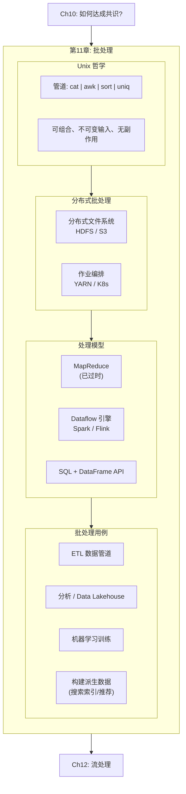

### 本章结构一览

| 小节 | 主题 | 关键概念 |
|------|------|---------|
| 11.1 | Unix 哲学与批处理 | 管道、排序 vs 内存聚合、可组合性 |
| 11.2 | 分布式批处理基础 | DFS/对象存储、作业编排、容错 |
| 11.3 | MapReduce 与 Dataflow 引擎 | Map/Reduce/Shuffle、Spark RDD、Flink |
| 11.4 | Join 与 Grouping | Sort-merge join、Broadcast join、Shuffle |
| 11.5 | 批处理用例 | ETL、Analytics、ML、Serving derived data |
## 11.1 Unix 哲学与批处理的起源

### 从 Unix 管道到大数据

书中用一个经典例子引入批处理思想——分析 Nginx 日志找出最热门的 5 个 URL：

```bash
cat /var/log/nginx/access.log |
  awk '{print $7}' |     # 提取 URL 字段
  sort |                 # 按 URL 排序
  uniq -c |              # 去重并计数
  sort -r -n |           # 按计数倒序
  head -n 5              # 取前 5
```

**这条管道体现了批处理的核心哲学：**

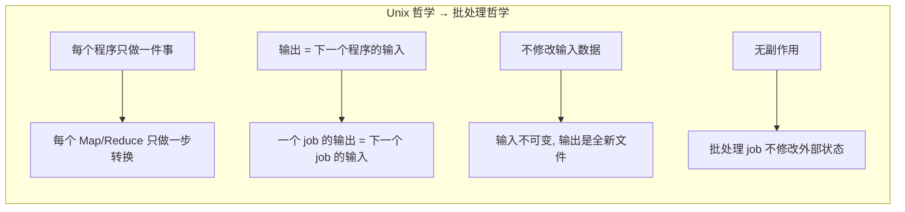

### 排序 vs 内存聚合

同样的分析用 Python 的 defaultdict 也能做——用内存哈希表计数。**哪种更好？**

| 方案 | 内存需求 | 数据量限制 | 性能 |
|------|--------|---------|------|
| **内存聚合** (Python dict) | O(distinct keys) | 受限于内存 | 小数据集更快 |
| **排序** (sort + uniq) | O(1) 工作内存 | 无限（自动 spill 到磁盘） | 大数据集更好（顺序 I/O） |

> **排序是批处理的基础算法**——GNU sort 自动处理超出内存的数据（spill + 外部归并排序），且顺序 I/O 性能极好。MapReduce 的 Shuffle 本质上也是分布式排序。

### 为什么批处理的"不可变输入 + 无副作用"很重要？

1. **Human Fault Tolerance** [1]：代码有 bug？回滚到旧代码，删除输出，重跑即可。OLTP 数据库做不到这一点（bug 写入的坏数据无法简单撤销）
2. **可重复执行**：输入不变 → 同样的代码永远产生同样的输出
3. **可组合**：同一份输入文件可以被多个不同的 job 处理
4. **容错**：task 失败 → 删除部分输出 → 在另一台机器重跑该 task
## 11.2 分布式批处理基础设施

### 类比：分布式批处理 = 分布式操作系统

| 单机 Unix | 分布式批处理 |
|---------|---------|
| 本地文件系统 (ext4, XFS) | **分布式文件系统 (HDFS)** 或对象存储 (S3) |
| 内核调度器 (CPU/内存) | **作业编排器** (YARN / Kubernetes) |
| 管道连接的程序 (awk, sort) | **Map/Reduce 任务** 或 Dataflow 算子 |
| stdin/stdout | 文件/对象 或网络传输 |

### 存储层：DFS vs 对象存储

| 维度 | HDFS | 对象存储 (S3/GCS) |
|------|------|-----------------|
| 块大小 | 128 MB | 4 MB（S3 Express One Zone 更小） |
| 元数据 | NameNode (单点) | 全托管 |
| 本地性 | ✅ 可调度 task 到数据所在节点 | ❌ 数据和计算分离 |
| 成本 | 高（长期运行集群） | 低（按存储量计费） |
| 运维 | 复杂（自建集群） | 简单（托管） |
| 趋势 | 逐渐被取代 | **主流**（存算分离） |

> 现代趋势：**存算分离**。数据存在 S3，计算用 Spark on K8s 或 Serverless（BigQuery、Snowflake）。

### 作业编排

| 组件 | 职责 | 代表 |
|------|------|------|
| **Task Executor** | 在每个节点运行任务 | YARN NodeManager, K8s kubelet |
| **Resource Manager** | 管理集群资源、分配 | YARN, K8s scheduler |
| **Workflow Scheduler** | 管理 DAG 依赖、定时调度 | **Airflow**, Dagster, Prefect |

### 容错

**批处理的容错很简单**——因为输出是 derived data（派生数据）：

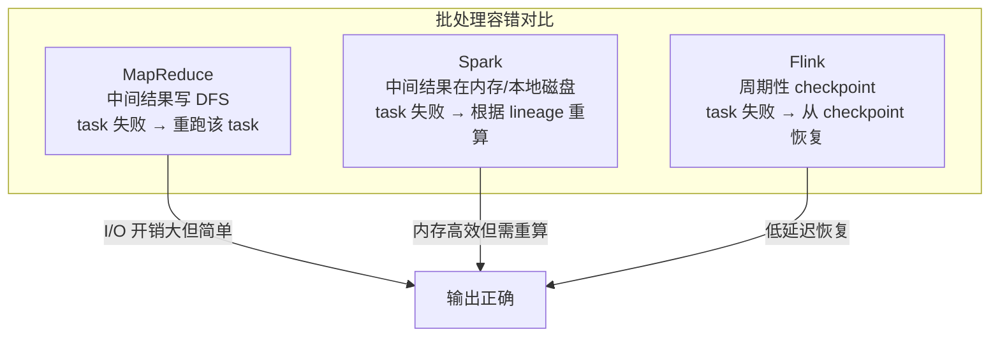

> 与 OLTP 不同，批处理 task 失败只需删除部分输出并重跑——不需要复杂的事务回滚。Spot/Preemptible 实例特别适合批处理（便宜但随时可能被杀）。
## 11.3 MapReduce 与 Dataflow 引擎

### MapReduce 四步流程

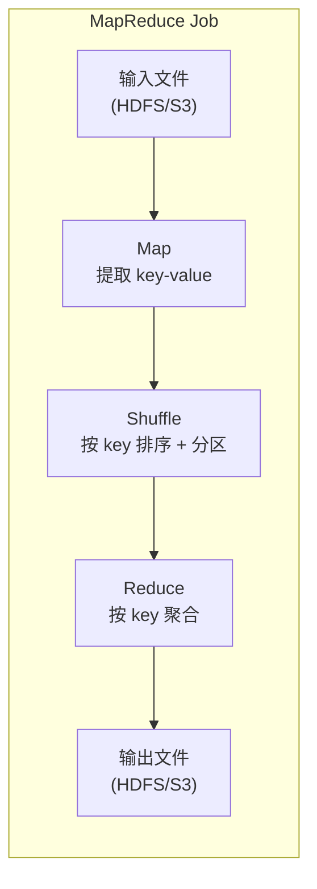

| 步骤 | 操作 | 对应 Unix 命令 |
|------|------|-------------|
| 1. Map | 从每条记录提取 key-value | `awk '{print $7}'` |
| 2. Sort | 框架自动按 key 排序 | `sort` |
| 3. Shuffle | 相同 key 发送到同一 Reducer | （网络传输） |
| 4. Reduce | 遍历同一 key 的所有 value，输出结果 | `uniq -c` |

> Google 在 2019 年正式宣布 MapReduce 从内部代码库中移除 [7]——已被更现代的框架取代。

### MapReduce 的问题

| 问题 | 说明 |
|------|------|
| **强制写磁盘** | 每个 MR job 的中间结果必须写 DFS → I/O 开销大 |
| **不支持管道** | Job 2 必须等 Job 1 完全写完才能开始 → 无法流水线并行 |
| **只有 Map + Reduce** | 复杂操作（如 Join）需要手动组合多个 MR job → 代码冗长 |
| **每个 task 新启 JVM** | 启动开销大 |

### Dataflow 引擎：Spark 与 Flink

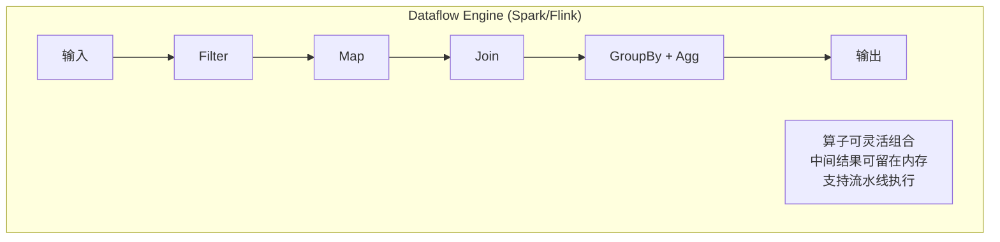

| 维度 | MapReduce | Spark | Flink |
|------|-----------|-------|-------|
| **中间数据** | 写 DFS | 写本地磁盘/内存 | 内存 + checkpoint |
| **流水线** | ❌ | ✅ | ✅ |
| **算子模型** | 只有 Map + Reduce | 灵活（map, filter, join, groupBy...） | 灵活 + 原生流处理 |
| **容错** | 中间写 DFS | Lineage 重算 | Checkpoint |
| **API** | 低级 Java API | RDD / DataFrame / SQL | DataStream / Table / SQL |
| **批流统一** | ❌ 仅批 | ⚠️ Structured Streaming | ✅ 流优先，批是流的特例 |

### Shuffle：分布式排序

Shuffle 是所有批处理框架中最昂贵的操作——将数据按 key 重新分区并排序，涉及大量网络传输和磁盘 I/O。

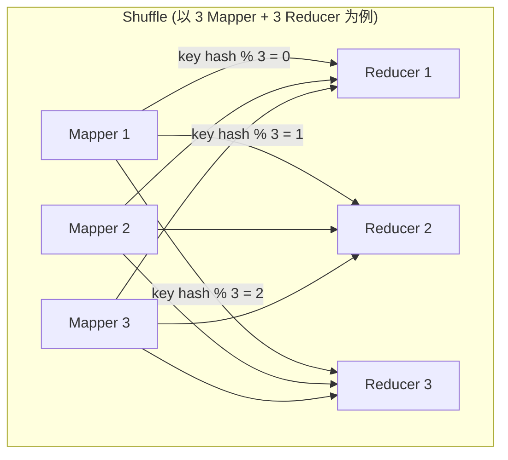

每个 Mapper 为每个 Reducer 产生一个本地排序的文件 → Reducer 从所有 Mapper 拉取属于自己的文件 → 归并排序 → 按 key 顺序处理。

### 编程模型演进

| 代际 | API 风格 | 代表 |
|------|--------|------|
| 1. 低级 API | 手写 Map/Reduce 函数 | Hadoop MapReduce |
| 2. Dataflow API | join(), groupBy(), filter() | Spark RDD, Flink DataStream |
| 3. SQL | 标准 SQL | Hive, Spark SQL, Flink SQL, Trino |
| 4. DataFrame | Pandas-like API | Spark DataFrame, Flink Table, Daft |

> 现代批处理的主流是 **SQL + DataFrame API**，配合查询优化器自动选择 join 策略和执行计划。低级 MapReduce 基本只在教科书里出现了。
## 11.4 Join 与 Grouping

### 批处理中的 Join

批处理的 Join 与 OLTP 数据库的 Join 原理类似，但规模大得多（TB 级），且不能用索引（全表扫描）。

### Sort-Merge Join（Reduce-Side Join）

最基础的分布式 Join 策略：

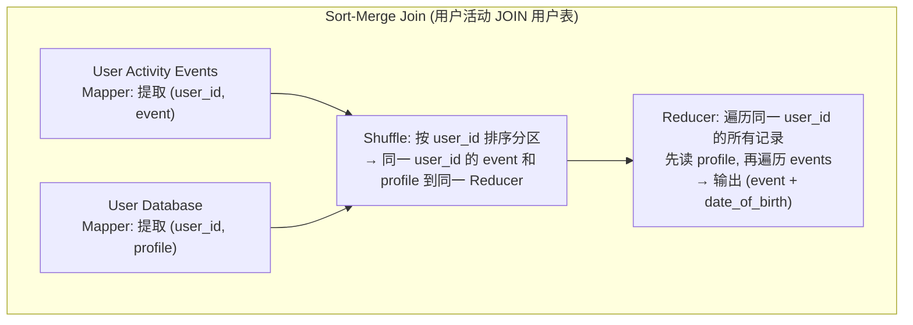

**优势**：通用，可处理任意大的数据集
**劣势**：需要 Shuffle 两张表的全部数据——网络 I/O 大

### Broadcast Join（Map-Side Join）

当一张表足够小（放得进每个 Mapper 的内存）时：

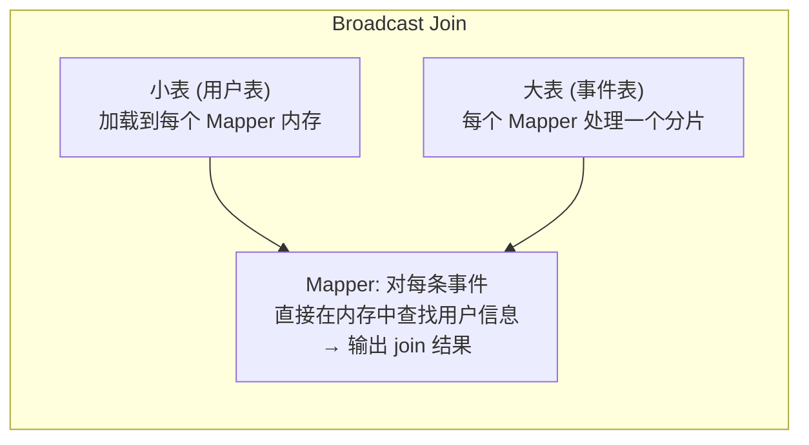

**优势**：无需 Shuffle！极快
**劣势**：小表必须放得进内存
**使用者**：Spark BroadcastHashJoin, Hive MapJoin

### Partition Join（Bucket Join）

如果两张表**按同一 key 分片**：

| 条件 | 说明 |
|------|------|
| 两张表按同一 key (如 user_id) 分为相同数量的分片 | 又称 co-partitioned |
| user_id=123 的事件和 user_id=123 的 profile 在同一个分片 | 只需本地 Join，无需 Shuffle |

**优势**：无 Shuffle + 无需内存装全表
**劣势**：要求两张表提前 co-partitioned

### 查询优化器

现代 SQL-on-batch 引擎（Spark SQL, Flink SQL, Trino）有**查询优化器**自动选择 Join 策略：
- 分析两张表的大小 → 小表自动 Broadcast
- 分析分片情况 → co-partitioned 自动 Partition Join
- 否则退回 Sort-Merge Join

## 11.5 批处理用例与总结

### 四大批处理用例

| 用例 | 描述 | 代表工具 |
|------|------|--------|
| **ETL 数据管道** | 从生产数据库提取 → 转换 → 加载到数仓 | Airflow + Spark, dbt, Dagster |
| **分析 (Analytics)** | 数仓上运行 SQL 聚合查询 | Spark SQL, Trino, BigQuery, Snowflake |
| **机器学习** | 特征工程、模型训练、批量推理 | Spark MLlib, Ray, Kubeflow, Flyte |
| **Serving Derived Data** | 构建搜索索引、推荐结果、特征存储 | 输出到 Kafka → 下游消费 |

### Serving Derived Data 的最佳实践

**不要**让批处理 job 直接写 OLTP 数据库：
- 网络请求慢（逐条写 vs 批量文件）
- 并发写入可能压垮生产数据库
- 失去批处理的"全有或全无"原子性保证

**应该**：
1. 批处理 job 将结果写为文件（Parquet / SSTable）
2. 通过**流式管道**（Kafka）推送到下游系统
3. 下游系统（ES, Pinot, ClickHouse）从 Kafka 消费并 bulk load

### Data Lakehouse

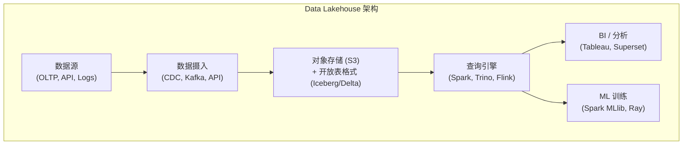

Lakehouse = Data Lake 的开放存储 + Data Warehouse 的 ACID 和 SQL 能力 [39]。

---

## 💻 代码示例

### PySpark 批处理示例

```python
from pyspark.sql import SparkSession
from pyspark.sql import functions as F

spark = SparkSession.builder.appName("TopURLs").getOrCreate()

# 读取日志文件 (Parquet 格式)
logs = spark.read.parquet("s3://my-bucket/logs/2024/01/")

# ETL: 提取 URL, 按 URL 分组计数, 取 Top 10
top_urls = (
    logs
    .select("url", "timestamp")
    .groupBy("url")
    .agg(F.count("*").alias("cnt"))
    .orderBy(F.desc("cnt"))
    .limit(10)
)

# 写入结果 (Parquet)
top_urls.write.mode("overwrite").parquet("s3://my-bucket/output/top-urls/")
```

---

## 🎯 面试题

### 面试题：MapReduce 的 Shuffle 是怎么工作的？

**参考答案**：
1. Mapper 将输出按 key 的 hash 分成 R 个文件（R = Reducer 数量）
2. 每个文件内部按 key 排序
3. Reducer 从所有 Mapper 拉取属于自己的文件（网络传输）
4. Reducer 将拉取到的多个有序文件做归并排序
5. 按 key 顺序调用 reduce 函数

**Shuffle 是最昂贵的操作**——涉及磁盘排序 + 网络传输。优化方向：减少 Shuffle（Broadcast Join）、本地性调度、压缩中间数据。

---

## 📝 本章要点总结

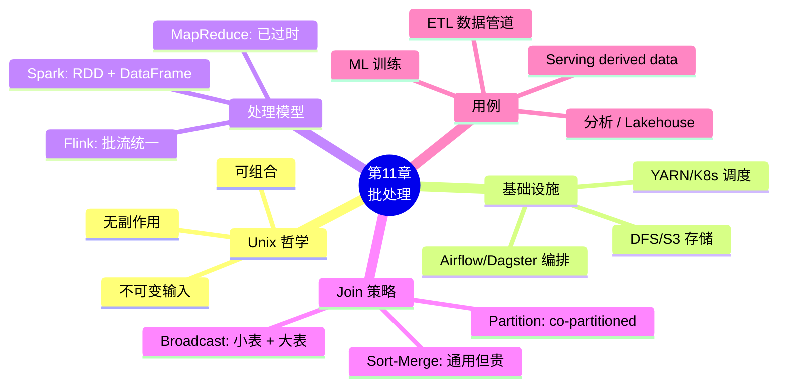

### 六大 Takeaways

1. **批处理的核心哲学来自 Unix**：不可变输入、无副作用、可组合——这让容错和调试变得简单

2. **排序是批处理的基础算法**——超出内存自动 spill 到磁盘，顺序 I/O 性能好，是 Shuffle/Join/Grouping 的基础

3. **MapReduce 已过时**，被 Spark/Flink 等 Dataflow 引擎取代——后者支持内存缓存、流水线执行、灵活算子组合

4. **三种 Join 策略**：Sort-Merge（通用但贵）、Broadcast（小表 + 大表）、Partition/Bucket（co-partitioned）

5. **批处理 job 不应直接写 OLTP 数据库**——应写文件或推送到 Kafka → 下游 bulk load

6. **Lakehouse 是现代数据架构的趋势**——开放存储格式 (Parquet/Iceberg) + SQL 引擎 + ACID

### 连接下一章

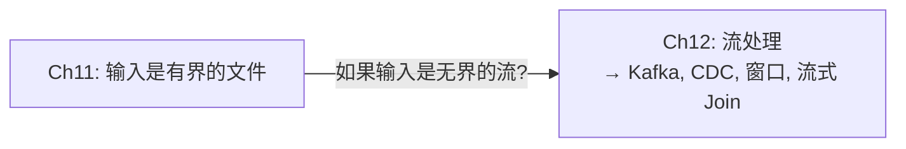