# 第11章：批处理 (Batch Processing)

> *"A system cannot be successful if it is too strongly influenced by a single person. Once the initial design is complete and fairly robust, the real test begins as people with many different viewpoints undertake their own experiments."*
> — Donald Knuth, "The Errors of TeX" (1989)

> 这句话挂在批处理这一章很巧妙:批处理的哲学正是**把数据处理的逻辑写成一个个独立、可组合的小程序**,让不同的人、不同的视角都能在其上做实验。MapReduce 当年能让"非数据库专家"也能处理 TB 级数据,靠的就是这种 Unix 式的开放组合——这正是本章的精神底色。

---

## 📚 精选文献

| # | 文献 | 为什么值得读 |
|---|------|------------|
| [3] | Dean & Ghemawat, *MapReduce: Simplified Data Processing on Large Clusters* (OSDI 2004) | **MapReduce 原始论文**。仅 13 页,把分布式排序、容错、数据本地性讲得清清楚楚。理解所有后续框架(Spark/Flink)的基石。Google 2019 已把它从内部代码库移除 [7],但思想永存。 |
| [18] | Zaharia et al., *Resilient Distributed Datasets* (NSDI 2012) | **Spark RDD 论文**。核心创新:**lineage(血统)容错**——不复制中间数据,记录如何算出来的,丢了就重算。这是 Spark 比 MapReduce 快一个数量级的根本原因。 |
| [19] | Carbone et al., *Apache Flink: Stream and Batch Processing in a Single Engine* (2015) | Flink 论文。提出**流优先、批是流的有界特例**,用周期 checkpoint 做容错。是第 12-13 章的引子。 |
| [39] | Armbrust et al., *Lakehouse* (CIDR 2021) | **Lakehouse 架构**论文。Databricks 出品,讲清楚"如何在对象存储 + 开放表格式(Iceberg/Delta)上同时获得数仓的 ACID/SQL 和数据湖的开放/廉价"。现代数据架构的事实标准。 |
| [42] | Malewicz et al., *Pregel: A System for Large-Scale Graph Processing* (SIGMOD 2010) | **图批处理**经典。BSP(整体同步并行)模型,PageRank/最短路等迭代图算法的基础。Spark GraphX、Flink Gelly、Giraph 都源于此。 |

**延伸阅读**:命令行比 Hadoop 快 235x [8] · GNU sort 并行外排 [9] · HDFS 纠删码 [10][11] · S3 内部架构(Warfield)[12] · YARN [13] · 调度是 NP-hard [14][15] · Borg 调度 [17] · Dryad(dataflow 鼻祖)[22] · Venice 派生数据平台 [45]。

---

## 🗺️ 章节概览

前 10 章几乎都在讲**在线系统 (online systems)**——你发一个请求,系统尽快返回结果,延迟是首要指标。本章转向**离线系统 (offline systems / 批处理)**:输入是一堆**只读**文件,输出是从头算出来的**派生数据 (derived data)**,首要指标是**吞吐量 (throughput)**。

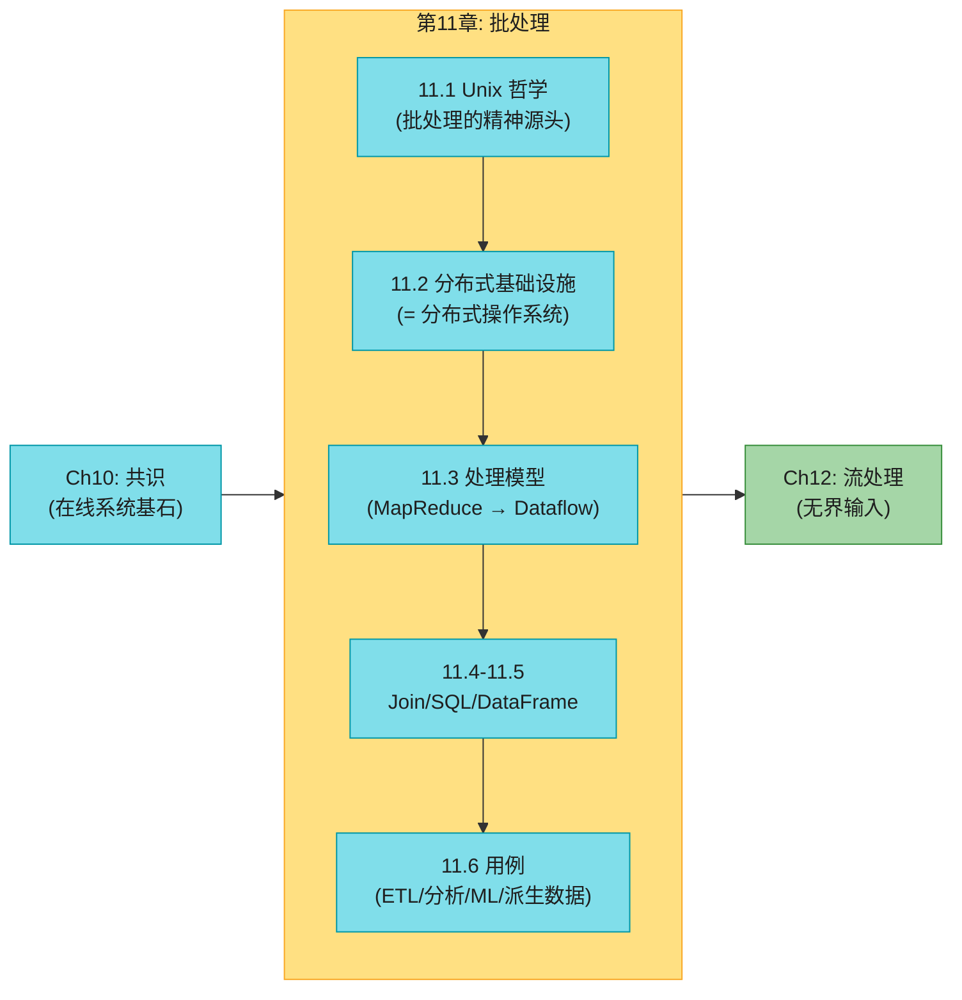

### 在线 vs 批处理 vs 流处理

| | 在线系统 (Online) | 批处理 (Batch) | 流处理 (Stream, Ch12) |
|--|--------------|------------|----------------|
| **输入** | 一个请求 | **有界**文件集(已知大小) | **无界**数据流(永不结束) |
| **延迟要求** | 毫秒~秒 | 分钟~天(不敏感) | 毫秒~秒 |
| **首要指标** | 响应时间、可用性 | **吞吐量**(单位时间处理量) | 延迟 + 吞吐 |
| **典型** | Web 服务、DB、缓存 | ETL、模型训练、报表 | 实时监控、CDC |
| **输出** | 实时响应 | 全新文件(从头算) | 持续更新下游 |

### 本章结构一览

| 小节 | 主题 | 关键概念 |
|------|------|---------|
| 11.1 | Unix 工具与批处理起源 | 管道、排序 vs 内存聚合、working set、不可变输入 |
| 11.2 | 分布式基础设施 | DFS 分层/纠删码、对象存储语义、编排器、调度 NP-hard、容错 |
| 11.3 | 处理模型 | MapReduce 四步、Shuffle 的 m1r2 机制、Dataflow 引擎、lineage |
| 11.4 | Join 与 Grouping | Sort-merge(+secondary sort)、Broadcast、Partition、CBO |
| 11.5 | 查询语言与 DataFrame | SQL 统一、批与数仓融合、Spark lazy vs Pandas eager |
| 11.6 | 批处理用例 | ETL/Data mesh、分析/Lakehouse、ML/LLM 数据预处理、Serving derived data |

> 📝 **名词注释:派生数据 (Derived Data)**
> 批处理不修改输入,而是**从输入从头算出**一份新数据。这份新数据就叫派生数据——**可以随时删掉重算出来**。搜索索引、推荐结果、物化视图、ML 模型权重都是派生数据。这和 OLTP 数据库的"记录原始事实"(system of record)相反:派生数据丢了不心疼,重跑 job 就回来了。这个区分贯穿全书第 III 部分。

## 11.1 用 Unix 工具做批处理(批处理的精神源头)

理解分布式批处理最快的方法,是先看单机上用 50 年前的 Unix 工具怎么干同样的事。书中用一个经典例子引入:分析 Nginx 访问日志,找出最热门的 5 个 URL。

### 日志分析的 Unix 管道

一行 Nginx 日志长这样:

```
216.58.210.78 - - [27/Jun/2025:17:55:11 +0000] "GET /css/typography.css HTTP/1.1" 200 3377 "https://martin.kleppmann.com/" "Mozilla/5.0 ... Chrome/137.0.0.0 ..."
```

要找最热门的 5 个 URL,一行 shell 搞定:

```bash
cat /var/log/nginx/access.log |
  awk '{print $7}' |     # 提取第 7 字段 = URL
  sort |                 # 按 URL 字母序排序 (相同 URL 排到相邻)
  uniq -c |              # 去重并计数 (相邻相同行合并)
  sort -r -n |           # 按计数数字倒序
  head -n 5              # 取前 5
```

输出:

```
4189 /favicon.ico
3631 /2016/02/08/how-to-do-distributed-locking.html
2124 /2020/11/18/distributed-systems-and-elliptic-curves.html
1369 /
 915 /css/typography.css
```

**这条管道几秒就能处理 GB 级日志**。它的每个命令都对应批处理的一个原语,这正是 MapReduce 的雏形:

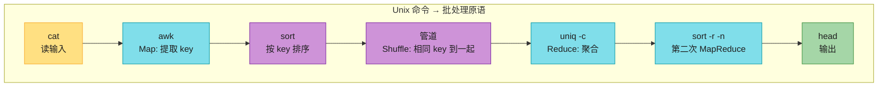

注意最后那一步 `sort -r -n | head` 其实是**第二个 MapReduce job**(用计数做 key 再排一次)。这正是后面要讲的"复杂分析 = 链式多个 job"。

### 命令链 vs 自定义程序(Python 版)

同样的事用 Python 写:

```python
from collections import defaultdict
counts = defaultdict(int)              # 内存哈希表: URL → 计数
with open('/var/log/nginx/access.log') as f:
    for line in f:
        url = line.split()[6]          # 第 7 字段 (0-indexed)
        counts[url] += 1
top5 = sorted(((c, u) for u, c in counts.items()), reverse=True)[:5]
for c, u in top5:
    print(f"{c} {u}")
```

哪个更好?语法是个人喜好,但**执行模型**天差地别——这恰恰是批处理的核心权衡。

### 排序 vs 内存聚合(working set 概念)

| | Unix 管道(sort 派) | Python(defaultdict 派) |
|--|----------------|------------------|
| **内存需求** | O(1)(几乎不占) | **O(distinct keys)** |
| **超内存怎么办** | 自动 spill 到磁盘 + 外部归并 | **OOM 崩溃** |
| **I/O 模式** | 顺序 I/O(磁盘友好) | 随机访问哈希表 |
| **小数据** | 启动进程开销 | 更快 |
| **大数据** | **稳**(spill 到磁盘照样跑) | 撑不住 |

> 📝 **名词注释:working set(工作集)**
> 一个 job 需要随机访问的内存量。这里 working set = distinct URL 数。**关键洞察**:working set 只取决于 distinct key 数,与总记录数无关——一百万条日志都访问同一个 URL,哈希表里仍只有一个条目。**判断一个分析该用内存聚合还是排序,先估 working set**:装得下用哈希表(快),装不下用排序(spill 到磁盘,稳)。

#### 深入:为什么排序能处理超内存数据(外部归并排序)

这是批处理最基础的算法,值得讲透。GNU `sort` 处理大于内存的文件:

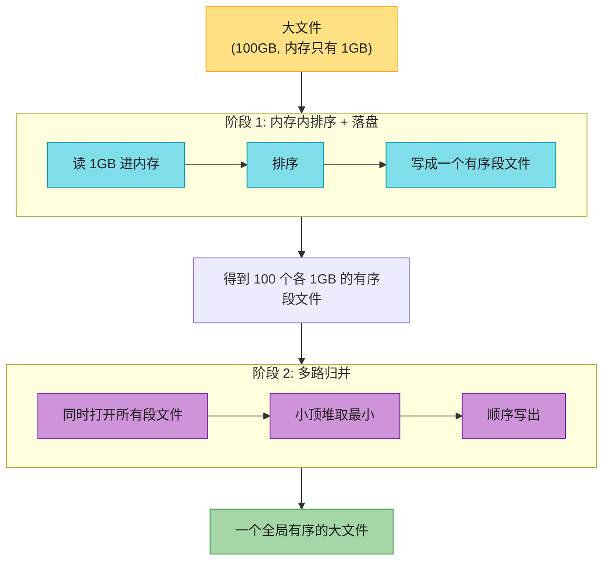

归并阶段是**顺序 I/O**(从头到尾流式读多个文件),SSD/HDD 上顺序 I/O 比随机快一两个数量级(见第 4 章)。GNU `sort` 还自动**多核并行**排序 [9]。这就是为什么"简单的一行命令"能扛住大数据——它骨子里是教科书级的并行外部归并排序。

> **排序是批处理的基础算法**。MapReduce 的 Shuffle、所有分布式 join、group by,底层都是分布式排序。理解了外部归并,就理解了批处理一半的工程难点。

### 为什么"不可变输入 + 无副作用"很重要?

这是批处理哲学的精髓,带来四大利好:

| 好处 | 说明 |
|------|------|
| **Human Fault Tolerance** [1] | 代码有 bug 输出错了?回滚旧代码、删掉输出、**重跑**就行。OLTP 数据库做不到——bug 写进去的脏数据没法简单撤销。 |
| **Time Travel(时间旅行)** | 大多数对象存储和开放表格式(Iceberg/Delta)支持保留旧版本快照,出问题切回旧版本目录即可。 |
| **可组合** | 同一份输入文件能被**多个不同 job**消费(分析、监控、校验同时读同一份日志)。 |
| **容错简单** | task 失败 → 删部分输出 → 在另一台机器重跑该 task。不需事务回滚。 |

> 📝 **名词注释:Human Fault Tolerance(容人错)**
> Marz(Storm/Lambda 作者)提出 [1]:系统不仅要容忍硬件故障,还要容忍**人写的 bug**。批处理因"输入不可变 + 输出可重算",天然具备这种能力——这也让团队能**快速迭代**(改错了重跑即可,无不可逆损害),符合敏捷"最小化不可逆性"原则 [2]。这是 OLTP 系统很难做到的。

## 11.2 分布式批处理基础设施

Unix 工具的限制:只能单机。数据大到单机内存/磁盘放不下时,就要分布式批处理。书中一个绝妙的类比:**分布式批处理框架 = 分布式操作系统**。

### 类比:分布式批处理 = 分布式操作系统

| 单机 OS | 分布式批处理 |
|---------|---------|
| 本地文件系统(ext4/XFS) | **分布式文件系统(HDFS)** 或对象存储(S3) |
| 内核调度器(CPU/内存) | **作业编排器**(YARN/K8s) |
| 管道连接的程序(awk, sort) | **Map/Reduce 任务** 或 Dataflow 算子 |
| stdin/stdout 管道 | 文件/对象 或网络 shuffle |
| 页缓存 | 数据节点的 OS 页缓存 |

### 分布式文件系统(DFS)

#### DFS 的分层架构(与本地 fs 一一对应)

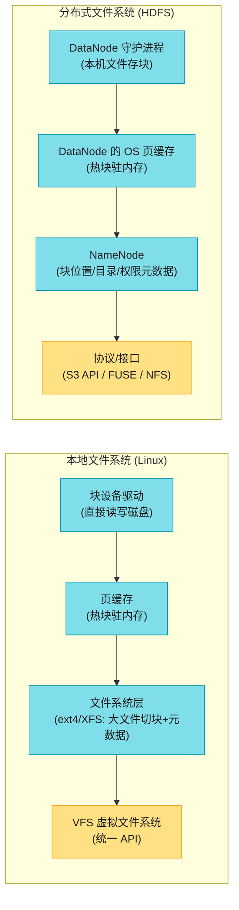

**关键差异:块大小**。本地 fs 块 = 4KB,DFS 块 = **128MB(HDFS)** 或 4MB(JuiceFS/对象存储)。为什么这么大的块?在 PB 级数据上,**小块会让元数据爆炸**(1PB / 4KB = 2500 亿个块的元数据,NameNode 扛不住)。大块 = 少元数据 + 寻道开销占比小。

#### 复制 vs 纠删码(Erasure Coding)

DFS 在普通硬件上跑(便宜但易坏),要靠冗余抗故障。两种冗余方式:

| | 全复制 (Replication) | 纠删码 (Erasure Coding / Reed-Solomon) |
|--|----------------|----------------------|
| **做法** | 存 3 份副本(HDFS 默认) | 把数据切成 k 块,算出 m 个校验块,存 k+m 块 |
| **存储开销** | **3x** | **~1.5x**(如 RS(10,4) = 1.4x) |
| **恢复** | 直接读另一副本 | 任意 k 个块即可重建 |
| **读写** | 快(直接副本) | 慢(校验计算,随机读要算) |
| **适用** | 热数据、随机读 | **冷数据、归档**(S3 Glacier、HDFS EC) |

#### 深入:Reed-Solomon 纠删码为什么省存储

以 HDFS 常用的 **RS(10,4)** 为例:把 10 个数据块 + 算出 4 个校验块,共 14 块分散存储。**任意 4 块丢失都能从剩下 10 块完整重建**——容错能力等同 4 副本,但存储开销只有 14/10 = **1.4x**(4 副本要 4x)。对 PB 级冷数据,这是**省一半以上存储**的巨大利好。

代价:重建时要读多个块做矩阵运算(CPU + 网络),所以纠删码**不适合频繁随机写的热数据**,只适合写一次读多次的归档/批处理输入。S3、HDFS EC、Ceph 都对冷数据用纠删码、热数据用复制。

### 对象存储(S3 等)

对象存储(S3 / GCS / Azure Blob / MinIO / R2)正成为批处理的主流存储,但它的语义和文件系统**很不一样**,踩坑无数:

| 维度 | 文件系统(HDFS) | 对象存储(S3) |
|------|--------------|-------------|
| **可变性** | 可追加、可改 | **不可变**(写一次,改要整体重写) |
| **目录** | 真目录 | **无目录**!`/2025/04/01/x` 只是 key 里的斜杠约定 |
| **列举** | 目录 ls | **前缀列举**(像 `ls -R`,递归) |
| **空目录** | 支持 | 不可能(常用 0 字节对象假装) |
| **重命名** | 原子 `rename` | **非原子**(复制到新 key + 删旧 key) |
| **硬链接/锁** | 支持 | ❌ 不支持 |
| **本地性** | ✅ task 可调度到数据所在节点 | ❌ 存算分离 |
| **元数据** | NameNode(单点) | 全托管 |

> ⚠️ **非原子重命名是最大的坑**:很多 ETL job 习惯"写到临时目录 → 原子 rename 成正式目录"来做原子提交。在 S3 上 rename 不原子,中途失败会留下半成品。**开放表格式(Iceberg/Delta)专门解决这个问题**——用元数据日志做原子快照切换,而不是靠 rename。这就是 Lakehouse 的核心动机之一。

**存算分离**是现代趋势:数据存 S3(便宜、无限、按量),计算用 Spark on K8s 弹性扩缩。代价是失去数据本地性(每个 task 都要从 S3 拉数据过网络),但现代数据中心网络极快(100Gbps),往往可接受。

### 作业编排(Job Orchestration)

对应单机 OS 的内核调度器,分布式编排器有三个核心组件:

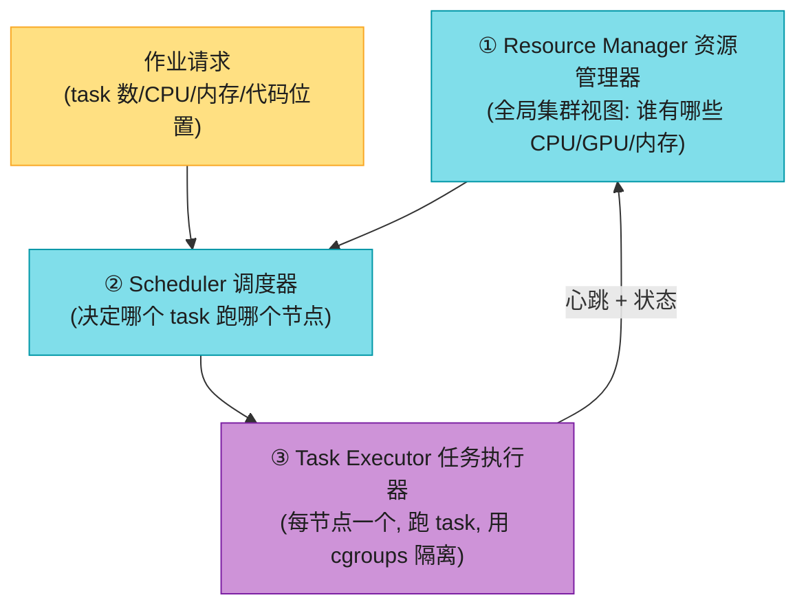

| 组件 | 职责 | 代表 |
|------|------|------|
| **Task Executor** | 每节点一个守护进程,跑 task、发心跳、隔离资源 | YARN NodeManager、K8s kubelet |
| **Resource Manager** | 全局集群状态(硬件/任务状态/网络位置) | YARN RM、K8s(状态存 etcd) |
| **Scheduler** | 决定 task 跑哪,平衡公平与效率 | YARN 调度器、K8s scheduler |

**资源隔离**用 Linux **cgroups**(YARN、K8s 都用),防止 task 越权访问数据或吃光节点资源影响他人。

#### 深入:资源分配为什么是 NP-hard

调度的核心难题:把有限资源(CPU/GPU/内存)分给互相竞争的 job,平衡**公平 vs 效率**。书中例子:5 节点共 160 核,来两个各要 100 核的 job,怎么排?

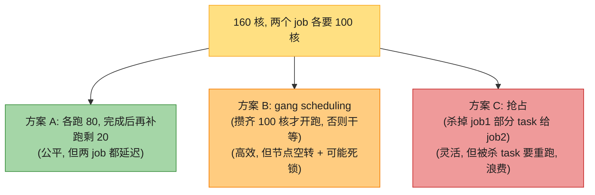

这还只是 2 个 job。真实集群有**数百万** task,找最优解是 **NP-hard** [14][15]——穷举不可行。所以实际调度器都用**启发式**:

| 启发式算法 | 思路 |
|----------|------|
| **FIFO** | 先来先服务(简单,但大 job 饿死小 job) |
| **公平调度 (Fair)** | 按 job 数平分资源 |
| **DRF (主导资源公平)** | 多维资源(CPU+内存+GPU)下,按"主导资源"公平分配 |
| **Capacity / Quota** | 按队列/团队分配容量配额(YARN Capacity Scheduler) |
| **Bin-packing** | 尽量把 task 塞满节点,减少碎片 |
| **Gang scheduling** | 所有 task 同时启动(适合需要全部就绪才能跑的 job,如分布式训练) |

> 📝 **名词注释:Gang Scheduling(群组调度)**
> 一个 job 的所有 task 必须**同时**获得资源才能启动(典型:分布式 ML 训练,所有 worker 要同步)。调度器要么攒齐全部资源一起给,要么不给——这容易导致**死锁**(多个 gang 互相占着部分资源等对方释放)和**资源空转**。K8s 的 `pod` + `SchedulerGates`、Borg 都有专门支持。

### 工作流调度(Workflow Scheduling)

一个数据管道通常由**几十个 job** 组成,job 之间有依赖(前一个的输出是后一个的输入)。这构成一个 **DAG(有向无环图)**。

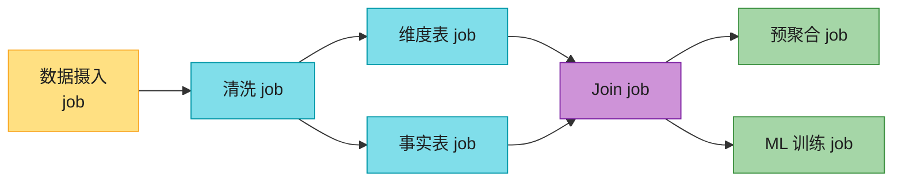

**两种 job 间数据传递方式**:
- **物化(materialize)**:job1 把输出写到 DFS/对象存储,job2 从那里读。**解耦**(可不同时跑、可独立重跑),但多一次 DFS 写。MapReduce 默认这种。
- **流水线(pipeline)**:job1 的输出**直接**经网络/共享内存喂给 job2,不落 DFS。像 Unix 管道,有**背压(backpressure)**——下游慢了上游得等。Spark/Flink 支持。

**工作流调度器**(管 DAG 级依赖,不是单 job 内调度):

| 调度器 | 特点 |
|--------|------|
| **Airflow** | 最流行,Python 写 DAG,大量内置 operator(MySQL/PG/Snowflake/Spark…) |
| **Dagster** | 资产导向(asset-based),data asset 一等公民 |
| **Prefect** | Pythonic,动态 DAG |
| (过时)Oozie / Azkaban | Hadoop 时代,已被上面取代 |

### 容错

批处理容错**比在线系统简单**——因为输出是派生数据,task 失败只需删部分输出重跑,不需事务回滚。三个引擎的做法:

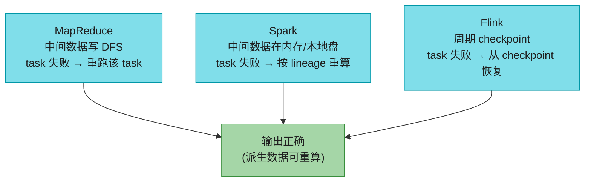

**Spot/抢占式实例**特别适合批处理:便宜 60-90%,但随时可能被杀。批处理 task 被杀只是重跑,无伤大雅——所以批处理是吃掉云上**闲置算力**的主力(提高集群利用率)。注意:**抢占比硬件故障更频繁** [17],容错设计要按"频繁被杀"而非"偶尔宕机"来考虑。

## 11.3 批处理模型(MapReduce → Dataflow)

### MapReduce 四步流程

MapReduce [3] 把 Unix 管道的思想搬到分布式:一个 job = Map + 排序 + Shuffle + Reduce。

```mermaid
flowchart LR
    INPUT["输入文件<br/>(HDFS/S3 分片)"] --> MAP
    subgraph MAP["Map 阶段"]
        M1["Mapper 1"]
        M2["Mapper 2"]
        M3["Mapper 3"]
    end
    MAP --> SHUFFLE["Shuffle<br/>(按 key 排序 + 分区到 Reducer)"]
    SHUFFLE --> REDUCE
    subgraph REDUCE["Reduce 阶段"]
        R1["Reducer 1"]
        R2["Reducer 2"]
        R3["Reducer 3"]
    end
    REDUCE --> OUTPUT["输出文件<br/>(HDFS/S3)"]

    style INPUT fill:#FFE082,stroke:#F9A825,color:#1f1f1f
    style M1 fill:#80DEEA,stroke:#0097A7,color:#1f1f1f
    style M2 fill:#80DEEA,stroke:#0097A7,color:#1f1f1f
    style M3 fill:#80DEEA,stroke:#0097A7,color:#1f1f1f
    style SHUFFLE fill:#CE93D8,stroke:#7B1FA2,color:#1f1f1f
    style R1 fill:#80DEEA,stroke:#0097A7,color:#1f1f1f
    style R2 fill:#80DEEA,stroke:#0097A7,color:#1f1f1f
    style R3 fill:#80DEEA,stroke:#0097A7,color:#1f1f1f
    style OUTPUT fill:#A5D6A7,stroke:#388E3C,color:#1f1f1f
```

| 步骤 | 操作 | Unix 对应 | 谁写代码 |
|------|------|---------|---------|
| 1. 读记录 | 输入文件切成记录(行/Parquet行组) | `cat` | 框架(输入格式解析器) |
| 2. Map | 每条记录调 mapper,提取 key-value | `awk '{print $7}'` | **你** |
| 3. Sort | 框架自动按 key 排序 | `sort` | 框架(隐式,你不用写) |
| 4. Shuffle | 相同 key 的 KV 发到同一 Reducer | (网络传输) | 框架 |
| 5. Reduce | 遍历同 key 所有 value 聚合 | `uniq -c` | **你** |

**关键设计**:Map 和 Reduce 是**纯函数**(无状态、确定性)——这让框架能自由并行、失败重试(换个节点再调一次同样的 mapper/reducer 即可)。这是借鉴自函数式编程(Lisp 的 map/fold):**避免可变状态 = 可并行 + 可容错**。

> 💡 **Mapper 的角色是"为排序做准备"**:它把每条记录转成 `(key, value)`,key 决定排序和分区。**Reducer 的角色是"处理排好序的数据"**。理解这一点,就看懂了 MapReduce 的全部——排序是隐式的、默认发生的、不可省略的。

### MapReduce 的问题(为什么被淘汰)

| 问题 | 说明 |
|------|------|
| **强制写磁盘** | 每个 job 的中间结果**必须**写 DFS → 大量 I/O |
| **不支持流水线** | job2 必须等 job1 **完全写完**才能开始,无法边写边读 |
| **只有 Map + Reduce** | 复杂操作(如多表 join)要手搓多个串联 job,代码冗长 |
| **每 task 新启 JVM** | 启动开销大(秒级) |
| **排序总发生** | 即使你不需要排序(如纯 filter),Map 和 Reduce 之间也会强制 sort |

Google 在 **2019 年正式宣布**把 MapReduce 从内部代码库移除 [7]——被更现代的框架完全取代。但理解 MapReduce 仍必要,因为 Spark/Flink 都站在它肩膀上。

#### 深入:为什么 MapReduce 不支持流水线

根因:MapReduce 用**物化中间数据到 DFS** 来做容错——job1 的输出落到 HDFS(3 副本持久化)后,job1 的 task 死了无所谓(数据在 HDFS),job2 直接读 HDFS 即可。这换来了**最简单的容错**,但代价是:

1. 每一步都一次完整 DFS 写 + 下一步 DFS 读 = 巨大 I/O;
2. job2 必须等 job1 全部 task 写完才能读——**无法重叠执行**(pipeline)。

Spark/Flink 的破法:**中间数据不落 DFS**(放内存/本地盘),靠 **lineage / checkpoint** 而非物化来容错。这样算子间可以边产出边消费(流水线),省掉海量 DFS I/O。这就是 Dataflow 引擎快一个数量级的根本原因。

### Dataflow 引擎(Spark / Flink)

Dataflow 引擎把**整个工作流当一个 job**处理(不像 MapReduce 拆成多个独立 subjob),显式建模数据流过多个处理阶段。相对 MapReduce 的 6 大优势:

| 优势 | 说明 |
|------|------|
| **排序按需** | 只在该排序的地方排序(不像 MR 总是 map 后强制 sort) |
| **算子融合** | 连续的不改分片的算子(filter/map)合并成一个 task,减少数据拷贝 |
| **全局调度优化** | 所有 join/依赖显式声明,调度器能做本地性优化(产消放同机,走共享内存) |
| **中间态少落 DFS** | 中间数据放内存/本地盘,不复制到多机(MR 只对 mapper 输出这么做,Dataflow 推广到全部) |
| **流水线执行** | 算子输入就绪即可启动,不等上阶段全完成 |
| **进程复用** | 复用已有进程跑新算子,省 JVM 启动开销 |

#### 深入:Spark 的 RDD 与 lineage 容错

Spark 的核心抽象是 **RDD(Resilient Distributed Dataset,弹性分布式数据集)** [18]:

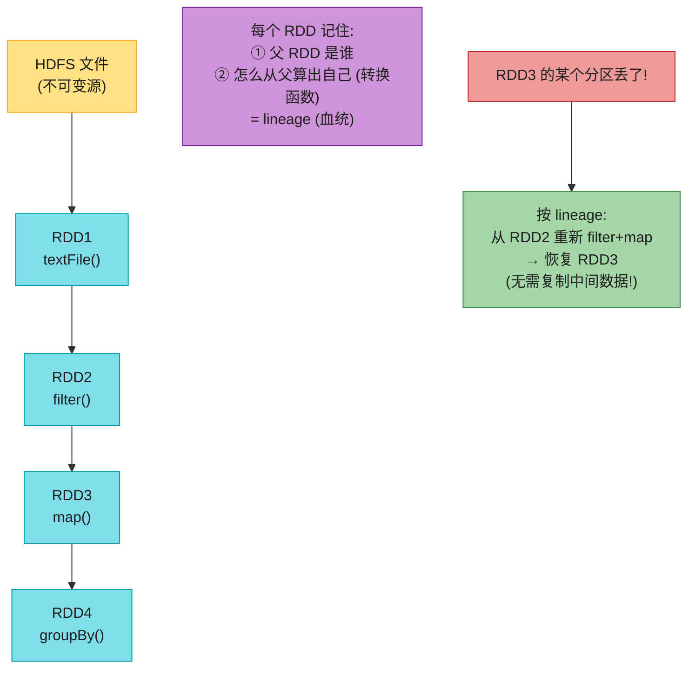

**RDD 的精髓**:不物化中间数据,而是**记住"我是怎么算出来的"**(lineage/血统)。分区丢了就**沿血统重算**——这比 MapReduce 的"写 DFS 持久化"省一个数量级的 I/O。代价:血统太长时重算开销大,所以 Spark 也支持 `checkpoint()` 主动截断血统。

> 📝 **名词注释:RDD(Resilient Distributed Dataset)**
> Spark 的核心数据抽象:一个**只读、分区的、可容错的**记录集合。"弹性"指它靠 lineage 重算而非复制来容错。现代 Spark 主要用 DataFrame/SQL API(底层还是 RDD),但理解 RDD 的 lineage 思想就理解了 Spark 的全部。

Flink 的容错不同——用周期性 **checkpoint**(异步快照任务状态,基于 Chandy-Lamport 算法,见第 12 章)。这让 Flink 既适合流也适合批,且恢复快。

### Shuffle:分布式排序(批处理最贵的操作)

Shuffle 是所有批处理框架里**最昂贵**的操作:把数据按 key 重新分区并排序,涉及大量网络 + 磁盘 I/O。

> ⚠️ **"Shuffle"不是随机!** 扑克洗牌是随机顺序,但 MapReduce 的 shuffle 产出的是**有序**结果,毫无随机性。这个名字容易误导。Shuffle = 分布式排序 + 重分区。

#### Shuffle 的完整数据流(m1,r2 文件机制)

以 3 个 Mapper、3 个 Reducer 为例:

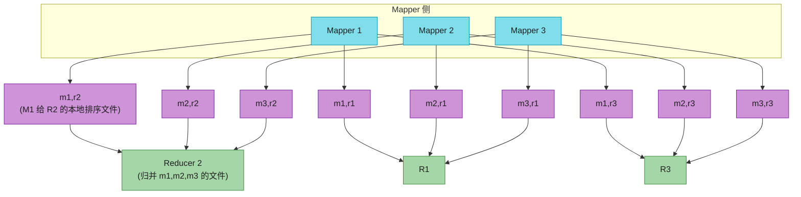

**精确步骤**:
1. **每个 Mapper 为每个 Reducer 建一个本地文件**(3 Mapper × 3 Reducer = 9 个文件)。文件名约定 `m{i},r{j}` = Mapper i 给 Reducer j 的数据。
2. Mapper 输出 KV 时,按 **key 的 hash % Reducer数** 决定写进哪个文件(同第 7 章 hash 分片)。
3. **每个文件内部按 key 排序**(内存里攒一批排好,溢写成有序段文件,再归并成大有序文件——正是前面讲的外部归并)。
4. Mapper 完成后,**Reducer 主动从所有 Mapper 拉取**属于自己的文件(`m1,r2` + `m2,r2` + `m3,r2` → Reducer 2)。
5. Reducer 把拉来的多个有序文件做**归并排序**,合并成一个全局有序流。
6. 同 key 的 KV 现在相邻了 → 按顺序调用 reduce 函数,一次一个 key。

#### 深入:Shuffle 为什么这么贵 + 优化

Shuffle 的开销 = **M×R 个文件的写 + 网络传输全部数据 + 归并**。1000 Mapper × 1000 Reducer = **100 万个文件**,磁盘 inode 都吃紧。优化方向:

| 优化 | 做法 |
|------|------|
| **减少 Reducer 数** | Reducer 太多 → 文件爆炸;太少 → 单点瓶颈 |
| **避免 Shuffle** | 用 Broadcast Join(小表广播,下节)直接绕过 shuffle |
| **Combiner** | Map 端先局部聚合(如局部计数),减少传给 Reducer 的数据量 |
| **压缩** | 中间文件压缩(Snappy/LZ4),减网络/磁盘 |
| **本地性调度** | 优先让 Reducer 跑在持有 Mapper 输出的节点 |
| **外部 shuffle 服务** | 把 shuffle 文件服务从 task 进程剥离(ShuffleService),task 死了 shuffle 数据还在 |

BigQuery 把 shuffle 优化到**内存里 + 外部排序服务** [24],shuffle 数据复制做容错——这是云数仓的工程红利。

## 11.4 Join 与 Grouping

批处理的 join 和 OLTP 数据库 join 原理类似,但规模是 TB 级、且**没有索引**(全表扫描)。三种核心策略:

### ① Sort-Merge Join(Reduce 侧 Join,最通用)

把两张表(如用户活动事件 + 用户档案)都按 join key(user_id)shuffle 到同一批 Reducer,排好序后归并。

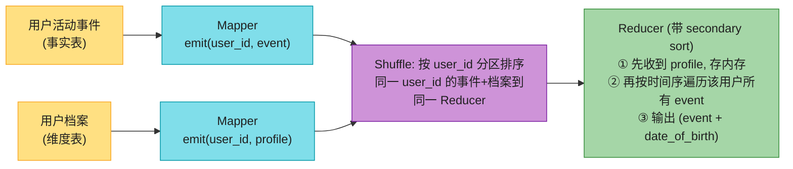

#### 深入:Secondary Sort(二级排序)的妙用

朴素 sort-merge join 里,Reducer 收到某 user_id 的记录顺序是乱的(事件和档案混在一起)。但 MapReduce 允许**控制记录到达 Reducer 的顺序**——这就是 **secondary sort(二级排序)** [25]:

- **主排序键** = user_id(决定分区)
- **次排序键** = 记录类型(让档案排在事件前)或事件时间戳

这样 Reducer 处理每个 user_id 时:**第一条永远是档案**(存进内存变量),**后续都是该用户按时间排好序的事件**。Reducer 任何时刻内存里只放**一个用户档案**,且**全程零网络请求**——所有数据 shuffle 时就到位了。这是分布式 join 性能的关键技巧。

| 策略 | 优势 | 劣势 |
|------|------|------|
| Sort-Merge Join | **通用**,扛任意大数据 | shuffle 两张表全部数据,网络 I/O 大 |

### ② Broadcast Join(Map 侧 Join,小表 + 大表)

当一张表小到能装进每个 Mapper 内存:

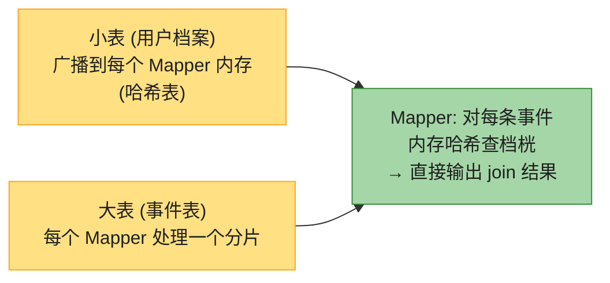

**零 shuffle**!小表广播(走网络一次),大表本地处理。**最快的 join**。Spark `BroadcastHashJoin`、Hive `MapJoin` 都用它。代价:小表必须装得进内存(Spark 默认 10MB 阈值,可调)。

### ③ Partition Join(Bucket Join,co-partitioned)

如果两张表**预先按同一 key、同样分片数**切好(co-partitioned),那 user_id=123 的事件和档案天然在同一个分片 → **本地 join,无 shuffle,且不需小表装内存**。

**代价**:要求两张表提前 co-partitioned(写时就按同 key 分桶)。适合频繁 join 的固定表对(如事实表 + 它最常用的维度表)。

### 三种 Join 决策表

| 场景 | 推荐 join | 为什么 |
|------|---------|--------|
| 两张都很大,无预分桶 | **Sort-Merge** | 唯一通用选择 |
| 一大一小(小表装得下内存) | **Broadcast** | 零 shuffle,最快 |
| 两表已按同 key 分桶 | **Partition** | 零 shuffle + 不受内存限 |
| 两表都大,且 join 后还要按同 key 分组 | Sort-Merge + 复用排序 | 排序一次,join 和 group 共用 |

### 查询优化器(CBO)自动选 join

现代 SQL-on-batch 引擎(Spark SQL、Flink SQL、Trino、Hive)有**基于代价的优化器(Cost-Based Optimizer)**自动选策略:

```mermaid
flowchart TD
    SQL["SELECT ... FROM 事件 JOIN 档案"] --> PARSE["解析成逻辑计划"]
    PARSE --> CBO{"CBO 分析"}
    CBO -->|"档案 < 阈值"| BC["选 Broadcast Join"]
    CBO -->"两表已 co-partition" --> PJ["选 Partition Join"]
    CBO -->|"否则"| SMJ["选 Sort-Merge Join"]
    CBO -->|"还能调换 join 顺序"| REORD["重排 join, 最小化中间态"]

    style SQL fill:#FFE082,stroke:#F9A825,color:#1f1f1f
    style PARSE fill:#80DEEA,stroke:#0097A7,color:#1f1f1f
    style CBO fill:#80DEEA,stroke:#0097A7,color:#1f1f1f
    style BC fill:#A5D6A7,stroke:#388E3C,color:#1f1f1f
    style PJ fill:#A5D6A7,stroke:#388E3C,color:#1f1f1f
    style SMJ fill:#A5D6A7,stroke:#388E3C,color:#1f1f1f
    style REORD fill:#CE93D8,stroke:#7B1FA2,color:#1f1f1f
```

CBO 基于表的**统计信息**(行数、基数、分布)估算各种执行计划的代价,选最优——甚至会**重排多表 join 的顺序**让中间结果最小。这是写 SQL 比手写 MapReduce 快的深层原因:优化器替你做了资深数据工程师才会的调优。

## 11.5 查询语言与 DataFrame(易用性的演进)

随着执行引擎成熟(万台机器跑 PB 数据的运维问题基本解决),焦点转向**编程模型 / 易用性**。API 经历了四代演进:

| 代际 | 风格 | 代表 | 谁用 |
|------|------|------|------|
| 1. 低级 | 手写 Map/Reduce 函数 | Hadoop MapReduce | 早期数据工程师 |
| 2. Dataflow | `join()`, `groupBy()`, `filter()` | Spark RDD、Flink DataStream | 数据工程师 |
| 3. SQL | 标准 SQL | Hive、Spark SQL、Flink SQL、Trino | **所有人**(分析师/PM/财务都能写) |
| 4. DataFrame | Pandas 风格 API | Spark DataFrame、Flink Table、Daft | 数据科学家 |

> 现代批处理的主流是 **SQL + DataFrame API** + 查询优化器。低级 MapReduce 基本只在教科书和遗留系统里了。

### SQL 成为批处理的通用语

SQL 能统一天下,因为:遗留数仓用 SQL、ETL/分析工具都支持 SQL、所有开发者分析师都懂 SQL。而且**高层语言不仅让人更高效,还让机器更高效**——优化器能把 SQL 转成最优的物理执行计划(自动选 join、向量化执行、列存格式)。

### 批处理与云数仓的融合

历史上,数仓跑在专用硬件上做关系分析;MapReduce 追求用通用编程语言 + 任意格式做更大规模处理。两者越来越像:

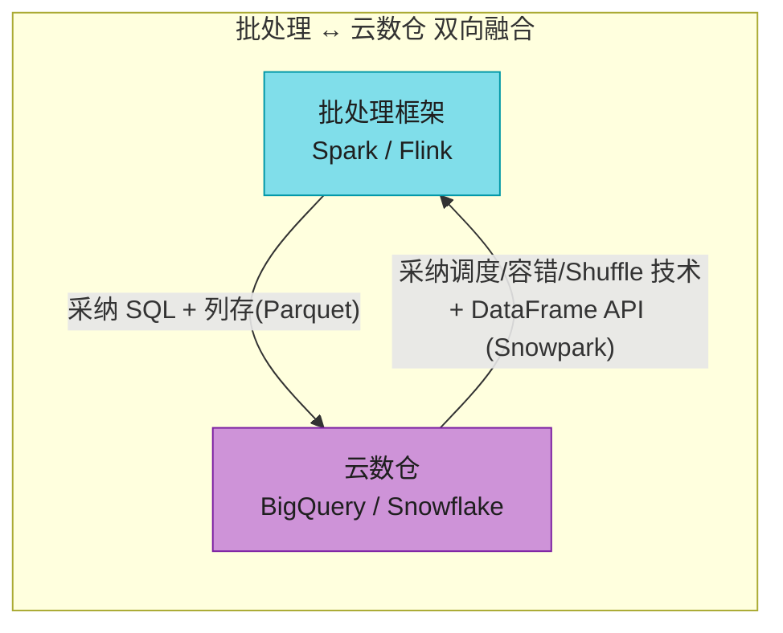

界限已模糊:BigQuery 提供 DataFrame 库,Snowflake 有 Snowpark 接 Pandas;反过来批框架用了数仓的列存 + 向量化。**怎么选?** 看成本/便利/工作负载:云数仓方便但贵(按查询计费),大 job 跑 Spark/Flink 自建集群更省。

### DataFrame:Spark lazy vs Pandas eager

DataFrame(来自 R/Pandas)是"像表"的数据结构,但用函数式 API 调 filter/join/sort/agg,而非一坨 SQL。

> ⚠️ **迁移陷阱**:本地 DataFrame(Pandas)**有索引、有序**;分布式 DataFrame(Spark)**一般无索引、无序** [29]。从 Pandas 迁到 Spark 可能遇到性能意外(失去索引加速)。

**关键差异:执行模型**

| | Pandas | Spark DataFrame |
|--|--------|----------------|
| **执行时机** | **立即执行**(eager):调一个方法就立刻算 | **惰性(lazy)**:先攒成查询计划,触发 action(`collect`/`write`)才执行 |
| **优化** | 无 | 先经查询优化器(Catalyst),再在 Dataflow 引擎上跑 |
| **规模** | 单机内存 | 分布式 PB |

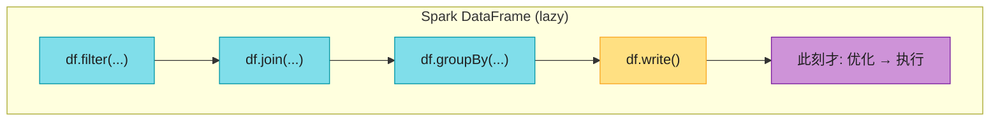

惰性求值让 Spark 能看到**整个**计算图再做全局优化(融合算子、重排 join、谓词下推),这是 Pandas 做不到的。Daft 等新框架甚至支持 client/server 混合执行(小操作本地跑、大数据集上服务器),用 **Apache Arrow** 做统一列式内存格式。

## 11.6 批处理用例

批处理擅长"**数据量大 + 对新鲜度不敏感**"的场景。听起来局限,实则覆盖大量业务:

- **对账**:支付系统核对交易与银行/库存账目 [30]
- **需求预测**:制造业周期性预测 [31]
- **推荐训练**:电商/媒体/社交用批 job 训推荐模型 [32][33]
- **金融清算**:美国银行网络**几乎全跑在批 job 上** [34](ACH 系统)

### 用例 1:ETL 数据管道

ETL(Extract-Transform-Load,或 ELT)从生产库抽数据 → 转换 → 装入下游(数仓)。批 job 天生适合——转换多是"令人尴尬的并行"(filter/project 各记录独立)。


**现代实践:Data Mesh / Data Contract / Data Fabric** [35][36][37][38]——过去一条数据管道由专门数据团队维护;现在工具和元数据管理成熟,让各业务团队**自治管理自己的数据产品**,通过"数据契约"约定 schema/质量对外发布。这让数据从"中心化瓶颈"变成"网格化协作"。

### 用例 2:分析(Analytics)与 Lakehouse

分析查询(OLAP)扫大量记录做分组聚合。两种风格:

| 风格 | 做法 | 典型 |
|------|------|------|
| **预聚合 (Pre-aggregation)** | 提前 roll up 成 OLAP cube / 数据集市,查询直接查预算结果 | Druid、Pinot、Kylin |
| **即席查询 (Ad hoc)** | 用户随时写 SQL 探索数据,响应时间重要 | Spark SQL、Trino、BigQuery |

预聚合靠工作流调度器定期跑;即席查询靠快的执行引擎让分析师少等待。SQL 让批框架能接 BI 工具(Tableau/Power BI/Superset)。

**Data Lakehouse** = 数据湖的开放存储(对象存储 + Parquet) + 数仓的 ACID/SQL 能力 [39]:

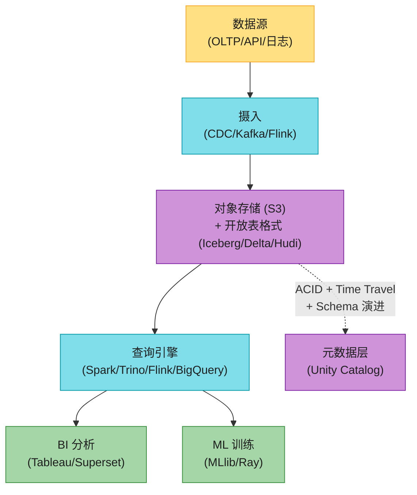

> 📝 **名词注释:开放表格式 (Open Table Format)**
> Iceberg / Delta Lake / Apache Hudi 这类格式,给对象存储上的 Parquet 文件加上**表语义**:ACID 事务、时间旅行(查历史快照)、schema 演进、分区演进。它们靠一个**元数据日志**(记录每次提交改了哪些文件)实现原子性,绕过 S3 非原子 rename 的坑。这是 Lakehouse 的技术基石。

### 用例 3:机器学习(含 LLM 数据预处理)

ML 重度依赖批处理,三个环节:

| 环节 | 输入 → 输出 |
|------|----------|
| **特征工程** | 原始数据 → 模型可用的数值特征 |
| **模型训练** | 训练数据 → 模型权重 |
| **批量推理** | 测试集/大批数据 → 预测结果 |

工具:Spark MLlib、Flink ML、Ray、Kubeflow、Flyte。**图算法**(PageRank、最短路)用 **BSP / Pregel 模型** [42]——每轮遍历一遍边、交换顶点信息、全局同步、重复到收敛。Spark GraphX、Flink Gelly、Giraph 实现。

#### 深入:LLM 训练数据预处理流水线

大语言模型(ChatGPT 类)训练数据是海量网页文本,预处理是典型的批处理工作负载:

```mermaid
flowchart LR
    WEB["原始网页爬取<br/>(Common Crawl, 数 TB)"] --> A["① HTML → 纯文本<br/>(去标签/修坏文本)"]
    A --> B["② 质量过滤<br/>(去低质/无关/垃圾)"]
    B --> C["③ 去重<br/>(MinHash/SimHash 找近似重复)"]
    C --> D["④ 分词 Tokenize<br/>(BPE → token id)"]
    D --> E["⑤ 向量化 Embedding<br/>(可选, 预训练阶段)"]
    E --> CORPUS["干净语料<br/>(喂给 GPU 训练)"]

    style WEB fill:#FFE082,stroke:#F9A825,color:#1f1f1f
    style A fill:#80DEEA,stroke:#0097A7,color:#1f1f1f
    style B fill:#80DEEA,stroke:#0097A7,color:#1f1f1f
    style C fill:#CE93D8,stroke:#7B1FA2,color:#1f1f1f
    style D fill:#80DEEA,stroke:#0097A7,color:#1f1f1f
    style E fill:#80DEEA,stroke:#0097A7,color:#1f1f1f
    style CORPUS fill:#A5D6A7,stroke:#388E3C,color:#1f1f1f
```

其中**去重**(③)是关键且昂贵的一步——网页大量重复(转载/镜像),训练数据重复会让模型过拟合。MinHash + LSH 是分布式去重的经典批处理算法(本质是一次 shuffle + 相似度聚类)。OpenAI 用 **Ray** 做这类大规模预处理 [43],Ray 专为 ML 的弹性分布式 Python 设计,和 Spark 互补(Spark 偏 SQL/数据工程,Ray 偏 ML/Python)。

### 用例 4:服务派生数据(Serving Derived Data)

批 job 常用来构建**预计算/派生数据集**(推荐结果、搜索索引、ML 特征),这些最终要喂给**在线生产系统**(ES、KV store、实时 OLAP)服务真实流量。

#### 反模式:批 job 直接写生产数据库

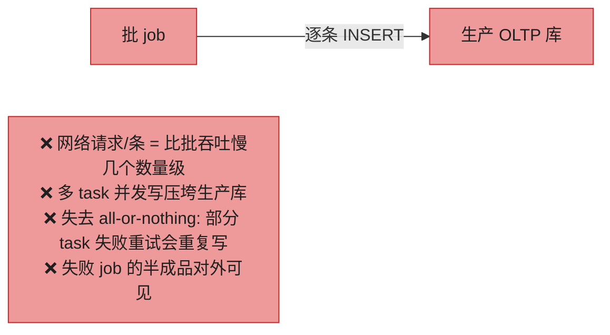

#### 正模式:走 Kafka 流 + 下游 bulk load

```mermaid
flowchart LR
    JOB["批 job"] -->|"输出文件"| DFS["DFS/对象存储"]
    DFS --> KAFKA["Kafka topic<br/>(顺序写友好)"]
    KAFKA --> ES["ES<br/>(bulk ingest)"]
    KAFKA --> PINOT["Pinot/Druid<br/>(实时 OLAP)"]
    KAFKA --> CH["ClickHouse"]
    NOTE2["✅ Kafka 顺序写优化 = 适合批写入<br/>✅ Kafka 当缓冲: 下游限速, 不压垮生产<br/>✅ 一份输出多下游消费<br/>✅ Kafka 当 DMZ 安全边界"]

    style JOB fill:#A5D6A7,stroke:#388E3C,color:#1f1f1f
    style DFS fill:#A5D6A7,stroke:#388E3C,color:#1f1f1f
    style KAFKA fill:#CE93D8,stroke:#7B1FA2,color:#1f1f1f
    style ES fill:#A5D6A7,stroke:#388E3C,color:#1f1f1f
    style PINOT fill:#A5D6A7,stroke:#388E3C,color:#1f1f1f
    style CH fill:#A5D6A7,stroke:#388E3C,color:#1f1f1f
    style NOTE2 fill:#A5D6A7,stroke:#388E3C,color:#1f1f1f
```

#### 深入:all-or-nothing 在 serving 的实现

批 job 本身有干净的 all-or-nothing(job 成功 = 所有 task 各跑一次;失败 = 无输出)。但推到 Kafka 后,**下游怎么知道"job 完成了,数据可以对外可见了"?**

解法:批 job 完成时发一个**完成通知**,下游消费者把收到的数据**先藏起来**(像未提交事务,read-committed 隔离,见第 8 章),**收到通知后才对查询可见**。这样 job 失败/重跑时,半成品不会泄露给线上。

另一个常见模式:**整库重建 + bulk load**(bootstrap 场景)。批 job 直接**造一个全新数据库**,用 bulk import 工具一次性灌进去:

| 系统 | bulk import 工具 |
|------|----------------|
| TiDB | Lightning |
| Pinot | Hadoop import job |
| RocksDB | SST 文件直接 ingest |
| Venice | hybrid store(批行更新 + 全量切换) [45] |

整库重建 + bulk load **极快**,且原子切换数据集版本容易;缺点是**增量更新难**(每次重建太贵),所以常用混合:首次 bootstrap 用 bulk load,之后增量用 Kafka 流。

---

## 🏭 生产级产品速查表

| 类别 | 产品 | 定位 |
|------|------|------|
| **DFS** | HDFS、CephFS、JuiceFS、GlusterFS、**DeepSeek 3FS** | 仿本地 fs 的分布式文件系统 |
| **对象存储** | S3、GCS、Azure Blob、MinIO、Cloudflare R2、Tigris、B2 | 不可变对象,存算分离,主流 |
| **编排器** | YARN、Kubernetes、Borg(Google)、Mesos | 资源 + 任务调度 |
| **工作流调度** | **Airflow**、Dagster、Prefect、(过时)Oozie/Azkaban | DAG 级 job 依赖 |
| **批处理引擎** | **Spark**、**Flink**、Daft、Dataflow(GCP)、BigQuery | 执行 MapReduce/Dataflow |
| **SQL-on-batch** | Hive、Spark SQL、Flink SQL、**Trino**、DuckDB | SQL 接口跑批 |
| **开放表格式** | **Iceberg**、Delta Lake、Hudi | 给对象存储加 ACID/表语义 |
| **实时 OLAP(下游)** | Pinot、Druid、ClickHouse | 消费批/流输出服务查询 |
| **ML 批处理** | Spark MLlib、Ray、Kubeflow、Flyte、Flink ML | 特征/训练/推理 |
| **图批处理** | GraphX、Flink Gelly、Giraph、Pregel | BSP/Pregel 模型 |
| **派生数据平台** | **Venice**(LinkedIn)、Batch Serving | 批输出服务到 KV |

## 💻 代码示例

### PySpark 批处理(Top URL 分析)

```python
from pyspark.sql import SparkSession, functions as F

spark = SparkSession.builder.appName("TopURLs").getOrCreate()

# 读 Parquet (列存, 适合分析)
logs = spark.read.parquet("s3://my-bucket/logs/2024/01/")

# DataFrame API (惰性: 下面三行此时都不执行, 只建查询计划)
top_urls = (
    logs
    .select("url")                              # project (窄变换, 不 shuffle)
    .groupBy("url")                             # groupBy → 触发 shuffle!
    .agg(F.count("*").alias("cnt"))             # reduce 端聚合
    .orderBy(F.desc("cnt"))                     # 第二次 shuffle 排序
    .limit(10)
)

# action: 此刻才触发 CBO 优化 + 物理执行
top_urls.write.mode("overwrite").parquet("s3://my-bucket/output/top-urls/")
```

**等价 SQL**(Spark SQL 会经同一个 Catalyst 优化器):

```sql
SELECT url, COUNT(*) AS cnt
FROM parquet.`s3://my-bucket/logs/2024/01/`
GROUP BY url                      -- shuffle 1
ORDER BY cnt DESC                 -- shuffle 2
LIMIT 10;
```

### Airflow 工作流 DAG(ETL 管道)

```python
from airflow import DAG
from airflow.providers.apache.spark.operators.spark_submit import SparkSubmitOperator
from datetime import datetime

with DAG("daily_etl", schedule="0 2 * * *",        # 每天凌晨 2 点
         start_date=datetime(2025, 1, 1), catchup=False) as dag:

    extract = SparkSubmitOperator(
        task_id="extract", application="extract_from_mysql.py")  # 从生产库抽数

    transform = SparkSubmitOperator(
        task_id="transform", application="clean_and_join.py")    # 清洗 + join

    load = SparkSubmitOperator(
        task_id="load", application="write_to_iceberg.py")       # 写入 Iceberg 表

    notify = ...  # 通知下游"数据就绪, 可见"

    extract >> transform >> load >> notify   # DAG 依赖: 上游成功才跑下游
```

Airflow 自动处理:依赖编排、失败重试、定时调度、可视化 DAG 执行状态。task 失败会重跑(幂等很重要——这正是"不可变输入 + 派生输出"哲学的红利)。

---

## 🎯 系统设计面试题

### 面试题1:详细解释 MapReduce 的 Shuffle

**参考答案**:
1. 每个 Mapper 为每个 Reducer 建一个本地输出文件(`m{i},r{j}`),共 M×R 个;
2. Mapper 输出 KV 时,按 `hash(key) % R` 决定写哪个文件;
3. 每个文件内部**按 key 排序**(内存攒批排序 → 溢写有序段 → 归并);
4. Mapper 完成后,**Reducer 主动从所有 Mapper 拉取**属于自己的 R 个文件;
5. Reducer 把拉来的 M 个有序文件做**归并排序**,合并成全局有序流;
6. 同 key 相邻 → 按 key 顺序调 reduce 函数。

**Shuffle 是最贵的操作**(M×R 文件 + 全量数据过网络 + 归并)。优化:Combiner(Map 端预聚合)、压缩中间数据、Broadcast Join 绕过 shuffle、外部 Shuffle Service 剥离。

### 面试题2:Spark 为什么比 MapReduce 快一个数量级?

**参考答案**:六个原因——① 排序按需(不像 MR 强制 map 后排序);② 算子融合(连续窄变换合并);③ 中间数据在内存/本地盘(不落 DFS);④ 流水线执行(不等上阶段完成);⑤ 进程复用(省 JVM 启动);⑥ 全局调度优化(产消同机走共享内存)。**根本是 RDD 的 lineage 容错**——不物化中间数据,靠血统重算,省掉了 MR 每次 job 间写 DFS 的开销。

### 面试题3:分布式 Join 有哪几种策略?怎么选?

**参考答案**:三种——**Sort-Merge**(通用,shuffle 两表,扛任意大,带 secondary sort 让档案先于事件到达)、**Broadcast**(小表广播到 Mapper 内存,零 shuffle,最快)、**Partition**(两表预 co-partitioned,本地 join,零 shuffle 且不受内存限)。**选型**:看表大小和是否预分桶。现代引擎用 **CBO** 基于统计自动选,甚至重排多表 join 顺序最小化中间态。

### 面试题4:为什么批 job 不应该直接写生产数据库?正确做法?

**参考答案**:直接写有四宗罪——① 逐条网络请求比批吞吐慢几个数量级;② 并发写压垮生产库;③ 失去 all-or-nothing(task 重试重复写);④ 半成品对外可见。**正确做法**:批 job 输出到 DFS/Kafka → 下游系统(ES/Pinot/ClickHouse)从 Kafka bulk ingest,用 Kafka 做缓冲 + 限速 + 安全边界(DMZ);job 完成时发通知,下游把数据从"未提交"切到"可见"。或整库重建 + bulk load(TiDB Lightning / RocksDB SST ingest)。

### 面试题5:DFS 和对象存储有什么本质区别?Lakehouse 怎么补齐对象存储的短板?

**参考答案**:对象存储不可变、无真目录、前缀列举、非原子 rename、无硬链接/锁、存算分离。这些(尤其非原子 rename)让"写临时目录→原子 rename 提交"的传统模式失效。**Lakehouse** 用开放表格式(Iceberg/Delta/Hudi)补齐:在对象存储的 Parquet 文件上加一层**元数据日志**,每次提交记录改了哪些文件,靠日志做原子快照切换(而非 rename),从而获得 ACID + 时间旅行 + schema 演进——兼得数据湖的开放廉价和数仓的事务能力。

---

## 📝 本章要点总结

```mermaid
flowchart LR
    ROOT["第11章<br/>批处理"] --- PHILO["哲学<br/>不可变输入 + 无副作用<br/>= 容错 + 可重算 + 可组合"]
    ROOT --- ALGO["基础算法<br/>外部归并排序<br/>(working set 超内存自动 spill)"]
    ROOT --- INFRA["基础设施<br/>DFS(分层+纠删码)<br/>对象存储(语义差异)<br/>编排器(调度NP-hard)"]
    ROOT --- SHUF["Shuffle<br/>分布式排序<br/>m1r2 文件机制<br/>最贵的操作"]
    ROOT --- MODEL["处理模型<br/>MapReduce(已淘汰)<br/>→ Dataflow(Spark/Flink)<br/>lineage 容错"]
    ROOT --- JOIN["Join 三策略<br/>Sort-Merge/Broadcast/Partition<br/>CBO 自动选"]
    ROOT --- API["API 演进<br/>低级→Dataflow→SQL→DataFrame<br/>Spark lazy vs Pandas eager"]
    ROOT --- USE["用例<br/>ETL/分析(Lakehouse)/<br/>ML(LLM预处理)/<br/>Serving(走Kafka不直写DB)"]

    style ROOT fill:#FFE082,stroke:#F9A825,color:#1f1f1f
    style PHILO fill:#80DEEA,stroke:#0097A7,color:#1f1f1f
    style ALGO fill:#80DEEA,stroke:#0097A7,color:#1f1f1f
    style INFRA fill:#80DEEA,stroke:#0097A7,color:#1f1f1f
    style SHUF fill:#CE93D8,stroke:#7B1FA2,color:#1f1f1f
    style MODEL fill:#A5D6A7,stroke:#388E3C,color:#1f1f1f
    style JOIN fill:#A5D6A7,stroke:#388E3C,color:#1f1f1f
    style API fill:#FFCC80,stroke:#F57C00,color:#1f1f1f
    style USE fill:#A5D6A7,stroke:#388E3C,color:#1f1f1f
```

### 核心主线

```mermaid
flowchart LR
    UNIX["Unix 管道哲学<br/>(不可变+无副作用+排序)"] --> DIST["分布式=分布式OS<br/>(DFS+编排器)"]
    DIST --> MR["MapReduce<br/>(淘汰: 强制落盘+无pipeline)"]
    MR --> DF["Dataflow 引擎<br/>(Spark/Flink: lineage)"]
    DF --> SHUF["核心算法<br/>= Shuffle(分布式排序)"]
    SHUF --> JOIN["Join/Grouping<br/>(Sort-Merge/Broadcast)"]
    DF --> SQL["SQL + DataFrame<br/>(易用性 + CBO)"]
    SQL --> USE["用例<br/>(ETL/分析/ML/派生数据)"]

    style UNIX fill:#FFE082,stroke:#F9A825,color:#1f1f1f
    style DIST fill:#80DEEA,stroke:#0097A7,color:#1f1f1f
    style MR fill:#EF9A9A,stroke:#C62828,color:#1f1f1f
    style DF fill:#A5D6A7,stroke:#388E3C,color:#1f1f1f
    style SHUF fill:#CE93D8,stroke:#7B1FA2,color:#1f1f1f
    style JOIN fill:#80DEEA,stroke:#0097A7,color:#1f1f1f
    style SQL fill:#FFCC80,stroke:#F57C00,color:#1f1f1f
    style USE fill:#A5D6A7,stroke:#388E3C,color:#1f1f1f
```

### 十大 Takeaways

1. **批处理哲学来自 Unix**:不可变输入、无副作用、可组合——这让容错和调试极简(human fault tolerance),也支撑快速迭代。

2. **排序是批处理的基础算法**:外部归并排序让单机 `sort` 也能扛超内存数据(顺序 I/O + 自动 spill)。Shuffle 本质就是分布式排序。

3. **working set 决定选型**:distinct key 数装得下内存 → 哈希聚合(快);装不下 → 排序(spill 到磁盘,稳)。

4. **分布式批处理 = 分布式操作系统**:DFS(=文件系统)+ 编排器(=内核调度器)+ Map/Reduce(=管道程序)。

5. **对象存储语义和文件系统很不一样**:不可变、无目录、前缀列举、**非原子 rename**——这是 Lakehouse 用开放表格式补齐 ACID 的根本动机。

6. **调度是 NP-hard**:真实集群用 DRF/公平/capacity/bin-packing/gang 等**启发式**,平衡公平与效率。Spot 实例适合批处理(被杀只重跑)。

7. **MapReduce 已淘汰**(Google 2019 移除):强制落盘 + 无 pipeline + 每次新 JVM。被 **Spark/Flink** 等 Dataflow 引擎取代。

8. **Spark 快一个数量级的根本是 lineage**:不物化中间数据,靠 RDD 血统重算容错——省掉 MR 的 job 间 DFS 写。

9. **Shuffle 是最贵的操作**(M×R 文件 + 全量过网络)。三种 Join 策略(Broadcast/Sort-Merge/Partition)的核心区别就是**shuffle 多少**。现代引擎用 CBO 自动选。

10. **批 job 别直接写生产库**:走 Kafka(缓冲+限速+安全边界)+ 下游 bulk load,或整库重建 + bulk import。这是 serving derived data 的铁律。

### 连接下一章

```mermaid
flowchart LR
    CH11["Ch11: 输入是有界文件<br/>(批处理)"] -->|"如果输入是无界流?"| CH12["Ch12: 流处理<br/>→ Kafka, CDC, 窗口,<br/>流式 Join, exactly-once"]

    style CH11 fill:#80DEEA,stroke:#0097A7,color:#1f1f1f
    style CH12 fill:#A5D6A7,stroke:#388E3C,color:#1f1f1f
```

批处理假设输入**有界**(已知大小、会结束)。但现实大量数据**无界**——用户昨天今天明天都在产生数据,除非倒闭永不"完成"。批处理只能人为按天/小时切块,导致输出延迟一天/一小时。**流处理**把这块延迟从"天/小时"压到"秒/毫秒":数据一到就处理。第 12 章会看到,流和批其实**同源**(都是数据流过算子),区别只在"如何处理永不结束的输入"——窗口、时间语义、状态、exactly-once。Flink 那句"**批是流的有界特例**"将贯穿接下来两章。
