# 第12章：流处理 (Stream Processing)

> *"A complex system that works is invariably found to have evolved from a simple system that works. The inverse proposition also appears to be true: A complex system designed from scratch never works and cannot be made to work."*
> — John Gall, *Systemantics* (1975)

> 这句话放在流处理这章意味深长:**没有一个复杂的流处理系统是从零设计成功的**,它们都是从批处理(Ch11)一步步演进来的。Kafka 从 LinkedIn 的日志系统长出来,Flink 从批处理演进到"批是流的特例"。理解流处理的最好方式,就是把它看作**批处理的连续版**——很多概念你已经在第 11 章见过了,只是输入从"有界文件"变成了"永不结束的事件流"。

---

## 📚 精选文献

| # | 文献 | 为什么值得读 |
|---|------|------------|
| [1] | Akidau et al., *The Dataflow Model* (VLDB 2015) | **Google Dataflow 论文**,Google 内部流处理的统一模型。提出 event time/process time、watermark、trigger、accumulation 四个维度,是 **Apache Beam** 的理论基础。读完它你才真正"懂"流处理的时间语义。 |
| [20] | Kreps/Narkhede/Rao, *Kafka: A Distributed Messaging System for Log Processing* (NetDB 2011) | **Kafka 原始论文**。把"日志"(append-only,第 4/6/10 章都见过)用作消息系统——这就是 log-based broker 的源头。Jay Kreps 后来写的 *The Log* 博客 [27] 更通俗。 |
| [37] | Kleppmann, *Turning the Database Inside-Out* (2015) | 提出 **state = ∫stream, stream = d(state)/dt** 的深刻对偶——数据库的内部机制(日志、索引、物化视图、CDC)其实是构建任何数据系统的通用积木。本章思想高度。 |
| [76] | Carbone et al., *Lightweight Asynchronous Snapshots for Distributed Dataflows* (arXiv 2015) | **Flink 容错**论文。基于 **Chandy-Lamport 算法**的 barrier snapshot,让流处理实现 exactly-once。Flink 比 Spark 快的低层原因。 |
| [27] | Kreps, *The Log: What Every Software Engineer Should Know...* | Jay Kreps(Kafka 作者)的名篇。把"日志"讲成实时数据的统一抽象,连接了数据库复制、批处理、流处理。强烈推荐。 |

**延伸阅读**:Kafka vs RabbitMQ 对比 [23] · 消息队列历史 [24] · CDC 为何正当红 [28] · DBLog 增量快照 [30] · 不可变性改变一切(Helland)[41] · Differential Dataflow(IVM 数学基础)[60] · Kafka exactly-once [78][79] · 批是流的特例(Flink)[84]。

---

## 🗺️ 章节概览

第 11 章批处理有个大假设:**输入有界**(已知大小、会结束)。但现实大量数据**无界**——用户昨天今天明天都在产生数据,除非倒闭永不"完成"。批处理只能人为按天/小时切块,导致**输出延迟一天/一小时**。流处理把这块延迟从"天/小时"压到"秒/毫秒":**数据一到就处理**。

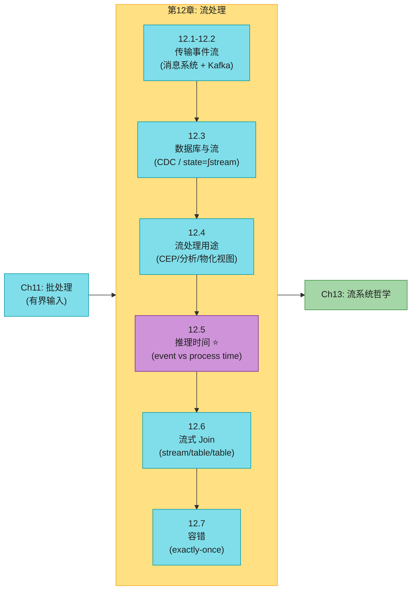

### 什么是事件 (Event)?

> 📝 **名词注释:事件 (Event) / 主题 (Topic)**<br>**事件** = 一个小而自足、不可变、带时间戳的对象,描述"某时某刻发生了什么"(用户点击、传感器读数、一笔交易)。**主题 (Topic/Stream)** = 相关事件的集合,类似文件系统里"一个文件 = 一组相关记录"。事件可编码成 JSON/Avro/Protobuf(第 5 章)。**生产者 (producer)** 产生事件,**消费者 (consumer)** 处理事件。

### 在线 vs 批处理 vs 流处理(承接第 11 章)

| | 在线系统 | 批处理 (Ch11) | **流处理 (本章)** |
|--|---------|------------|--------------|
| **输入** | 一个请求 | 有界文件 | **无界**事件流(永不结束) |
| **延迟** | 毫秒 | 分钟~天 | **毫秒~秒** |
| **首要指标** | 响应时间 | 吞吐 | 延迟 + 吞吐 |
| **排序能用?** | — | ✅(排序是基础) | ❌ 无界数据**不能排序** |
| **容错** | 重试请求 | 重跑整个 task | **不能从头重跑**(已跑几年) |
| **代表** | Web/DB | ETL/训练 | 实时监控/CDC |

> **核心洞察**:流处理 = 批处理的连续版。消息 broker = 流世界的文件系统(Ch11);流式 join/聚合 = 批的 join/聚合 但要处理"永不结束 + 时间语义"。Flink 那句**"批是流的有界特例"** [84] 贯穿本章。

### 本章结构一览

| 小节 | 主题 | 关键概念 |
|------|------|---------|
| 12.1 | 消息系统 | drop/buffer/backpressure、ACK 重投递乱序、DLQ |
| 12.2 | Log-based broker | Kafka 分区/offset、22h 缓冲、对象存储分层、回放 |
| 12.3 | CDC 与 state/stream | 双写问题、CDC、Log compaction、outbox、state=∫stream |
| 12.4 | 流处理用途 | CEP、流分析(概率算法)、IVM 物化视图、流上搜索 |
| 12.5 | 推理时间 ⭐ | event vs process time、straggler、3 时间戳、四窗口 |
| 12.6 | 流式 Join ⭐ | stream-stream / stream-table / table-table、SCD |
| 12.7 | 容错 ⭐ | microbatch、checkpoint、原子提交、幂等、重建状态 |

> 💡 **给"不太懂流处理"的你**:本章主线很清晰——先讲"流怎么传"(12.1-12.2 消息系统/Kafka),再讲"流从哪来/和数据库啥关系"(12.3 CDC),然后"流能干嘛"(12.4),最后三个**真正的难点**:时间(12.5)、Join(12.6)、容错(12.7)。如果赶时间,12.5 和 12.7 是面试和实战的核心,务必精读。

## 12.1 传输事件流:消息系统

事件产生了,怎么从生产者传到消费者?最原始的办法:生产者直接把事件写文件/数据库,消费者**轮询**(poll)看有没有新事件。但轮询低效——轮询越频繁,空查询(没新事件)占比越高。更好的办法是:**新事件出现时,主动通知消费者**。这就是**消息系统 (messaging system)** 的职责。

### 设计消息系统的两个核心问题

所有消息系统都要回答两个问题,答案的不同造就了不同产品:

#### 问题 1:生产者比消费者快怎么办?

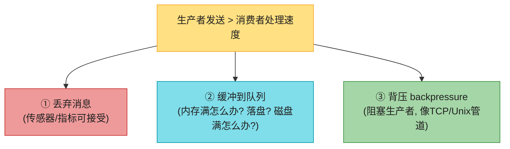

- **丢弃**:周期性传感器/指标可接受(很快又来新值);但**计数**场景绝不能丢(每丢一条 = 计数错误)。
- **缓冲**:要问"队列满到内存外怎么办"(崩溃还是落盘)、"磁盘满了怎么办" [5][6]。
- **背压 (backpressure)**:Unix 管道、TCP 用这个——固定小缓冲,满了就阻塞发送方(见第 9 章网络拥塞)。优雅但会拖慢整条链路。

#### 问题 2:节点崩溃,消息会丢吗?

持久性要靠"落盘 + 复制"(第 6 章),有成本。能接受偶尔丢消息 → 同样硬件能换更高吞吐/更低延迟。

### 直接消息 vs 消息 Broker

**直接消息**(生产者消费者直连,无中间节点):
- **UDP 多播**:金融行情用(低延迟,应用层重传补丢包)[8];
- **ZeroMQ / nanomsg**:无 broker 的发布订阅库;
- **StatsD**:用不可靠 UDP 收集指标(计数可能不准)[9];
- **Webhook**:生产者直接 HTTP/RPC 调消费者的回调 URL [11]。

缺点:都假设生产者消费者**始终在线**,消费者离线就丢消息;应用代码要自己处理"可能丢消息"。

**消息 Broker (Message Broker / Queue)**:一个专门的服务器当中间人,生产者写给它,它推给消费者。broker 集中存储,能容忍客户端来去/崩溃,把"持久性"问题集中到自己身上。**broker 本质是一种"为消息流优化的数据库"** [12]。

### 消息 Broker vs 数据库

| | 数据库 | 消息 broker (传统 AMQP/JMS) |
|--|------|------------------------|
| **数据保留** | 显式删除前一直在 | **投递成功后自动删除** |
| **工作集** | 大 | **小**(队列短) |
| **查询** | 二级索引 + SQL | 订阅主题子集(模式匹配) |
| **快照 vs 通知** | 查询基于时间点快照 | **数据一变就通知**(不支持任意查询) |

传统 broker(JMS [13]/AMQP [14] 标准):RabbitMQ、ActiveMQ、IBM MQ、Azure Service Bus、Google Cloud Pub/Sub [15]。

### 多消费者:负载均衡 vs 扇出

多个消费者读同一主题时,两种模式:

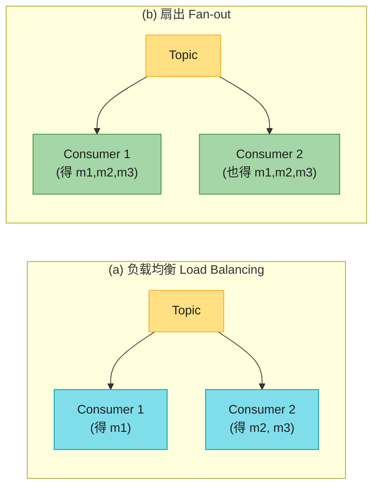

- **负载均衡**:每条消息只给**一个**消费者(并行处理昂贵消息);
- **扇出**:每条消息给**所有**消费者(各自独立订阅,互不影响)——流版"多个批 job 读同一输入文件"。

两者可结合(Kafka 的 **Consumer Group**:组内负载均衡,组间扇出)。

### ACK 与重投递 → 乱序问题 ⭐

消费者可能崩溃,broker 用 **ACK(确认)** 保证不丢:消费者处理完一条,显式告诉 broker,broker 才删消息。没收到 ACK(连接断/超时)→ 重投递。

> ⚠️ **ACK + 负载均衡 = 不可避免地乱序**。这是传统 broker 的固有缺陷:

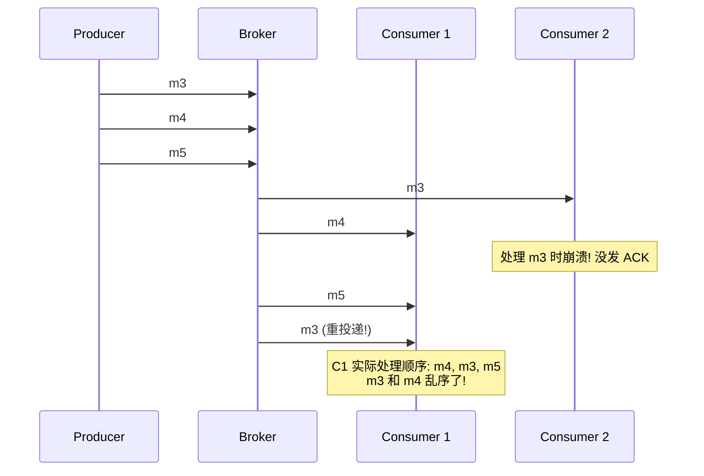

消费者 2 处理 m3 时崩溃,m3 重投递给消费者 1,导致消费者 1 的处理顺序变成 `m4, m3, m5`——**m3、m4 不再按发送顺序**。即使 broker 想保序(JMS/AMQP 都要求),负载均衡 + 重投递的组合**必然**破坏顺序。**想严格保序,只能给每个消费者独立队列(放弃负载均衡)**,或者用 log-based broker(下节)。

#### 深入:DLQ(死信队列)——毒消息的解药

重投递会制造另一种灾难:**毒消息 (poison message)**。一条格式错误的消息(比如缺 key 的 JSON)会让消费者崩溃→重投递→又崩溃→无限循环。如果 broker 强保序,整条流**永久阻塞**。

**死信队列 (DLQ)**:重试 N 次还失败的消息,移到一个专门的"死信队列",让流继续前进 [17][18]。DLQ 里有消息 = 有错误,需监控 + 人工处理(丢弃/修复重发/改代码)。AMQP 系早有 DLQ,如今 log-based 的 Pulsar、Kafka Streams 也支持 [19]。

## 12.2 Log-Based 消息 Broker (Kafka)

传统 broker(AMQP/JMS)继承"消息是瞬态"的思维:落盘了但**投递后立刻删**。数据库/文件系统相反:写了就**永久**保留,直到显式删。这种心态差异影响巨大——批处理能反复跑同一输入(输入只读),但传统 broker 消费是**破坏性**的(ACK 即删),没法重跑同一消费者得到同样结果。

**能不能把数据库的"持久存储"和消息的"低延迟通知"结合?** 这就是 **log-based message broker**(Kafka 是代表)。

### 用日志存消息

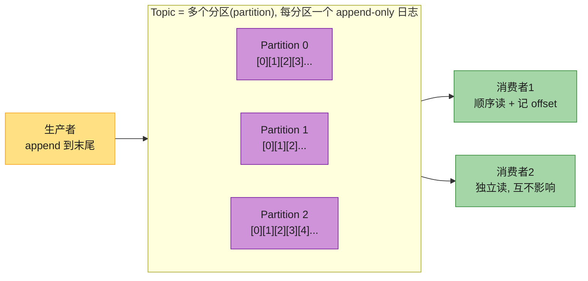

- **生产者** = 往日志末尾 append;
- **消费者** = 顺序读日志,读到末尾就等新消息通知(像 `tail -f`);
- **分片(分区)扩展吞吐**:不同分区在不同机器,每分区独立读写(第 7 章分片思想);
- **offset(偏移量)**:每条消息在分区内有个单调递增的序号,**分区内全序**(跨分区无序保证)。

> 📝 **名词注释:Offset(偏移量)**<br>Kafka 给分区里每条消息的单调递增序号。它和单主数据库复制的 **LSN(log sequence number)** 是一回事(第 6 章):消费者像 follower,broker 像 leader,offset 就是 follower 重连时的"我已经复制到这了"的标记。**关键**:broker 不用为每条消息记 ACK,只记消费者 offset,记账开销大减 → 高吞吐。

### 日志 vs 传统消息(对比)

| | 传统 AMQP/JMS | Log-based (Kafka) |
|--|--------------|------------------|
| **消息分发** | 逐条分配给 consumer | 整个分区分配给 consumer |
| **消息删除** | ACK 后删 | **不删**(保留配置时间/永久) |
| **顺序** | 弱(重投递乱序) | **分区内严格有序** |
| **负载均衡粒度** | 细(逐条) | 粗(整分区) |
| **并行度上限** | consumer 数不限 | **≤ 分区数** |
| **回放** | ❌ 消费即破坏 | ✅ offset 可任意重置 |
| **慢消费者** | 队列堆积占内存(要小心) | 落盘,**只该消费者受影响** |

**粗粒度负载均衡的代价**:
- 并行度受分区数限制(同分区消息只能给一个 consumer);
- 一条消息慢 → 阻塞同分区后续消息(**队头阻塞**,第 2 章)。

> **什么时候选哪个?** 消息**处理慢 + 不在乎顺序 + 要逐条并行** → 传统 broker(RabbitMQ)。**高吞吐 + 处理快 + 顺序重要 + 要回放** → log-based(Kafka)。如今界限在模糊——Kafka 也支持 JMS/AMQP 风格 consumer group [25][26]。

### Consumer Offset:省心的进度跟踪

顺序消费分区,进度一目了然:**offset 之前的都处理了,之后的还没看**。broker 只需**周期性记录 offset**,不用为每条消息记账。批量化、流水线化 → 吞吐飙升。消费者崩溃 → 从最后记录的 offset 恢复(可能重处理几条,见 12.7 exactly-once)。

### 磁盘空间:22 小时缓冲(手算)

日志只追加,迟早写满磁盘。Kafka 把日志分段,定期删/归档旧段。这意味着 log-based broker 本质是个**有界大小的环形缓冲 (ring buffer)**——但因为在磁盘上,可以很大。

> **手算**(2025 年典型硬盘):容量 20TB,顺序写吞吐 250MB/s。满速写入,**约 22 小时写满**。即"磁盘日志至少能缓冲 22 小时的消息",实际很少满速写,通常能缓冲**几天到几周**。慢消费者只要在缓冲窗内追上就不丢消息——这给运维**足够时间**修故障。

**对象存储分层**:现代 Kafka/Redpanda 把旧消息存对象存储(分层存储)扩容量;**WarpStream、Confluent Freight、Bufstream** 干脆把**全部**消息存对象存储。额外好处:消息存成 **Iceberg 表**,批 job/数仓能直接查,不用复制(数据集成更简单,呼应第 11 章 Lakehouse)。

#### 深入:为什么 log-based broker ≈ 分布式文件系统

这是本章最重要的类比。传统 broker 消费是**破坏性**的(ACK 即删),像"用完即弃的消息"。Log-based broker 消费是**只读**的(读日志不动它,唯一副作用是 offset 前移),而 offset 在消费者掌控下——可以重置到昨天重新处理,可以新开消费者从 offset 0 读完整历史,可以 bug 修复后重跑。

**这让 log-based broker 更像第 11 章的分布式文件系统**(派生数据与输入数据通过可重复变换分离),而非传统消息队列。你能拿生产日志做开发/测试/调试而不怕影响线上。这是 Kafka 成为"现代数据栈事实标准"的根本原因——它把**消息队列 + 数据湖 + 复制日志**三合一了。

### Consumer Group:负载均衡 + 扇出的结合

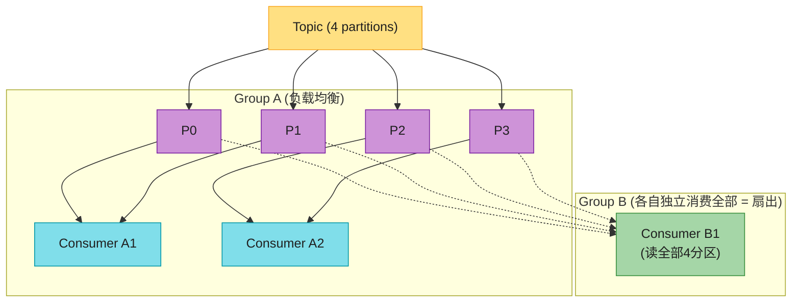

- **同一 Group** 订阅 Topic:每条消息只给组内**一个** consumer(组内负载均衡);
- **不同 Group** 订阅同一 Topic:每条消息给每组**各一个** consumer(组间扇出)。

**分区 key 路由**:需要保序的相关事件(如同一用户的事件)要用**用户 ID 做 partition key**,确保它们进同一分区、同一 consumer 顺序处理。这是流式 join 正确性的前提。

> 📝 **名词注释:Head-of-Line Blocking(队头阻塞)**<br>Log-based broker 里,同一分区的一条消息处理慢,会卡住后面所有消息(它们必须排队)。这是粗粒度负载均衡的代价。缓解:用更多分区提高并行度;或把慢消息异步化(但要小心保序)。

## 12.3 数据库与流:CDC 与 state/stream 对偶

上一节讲"流怎么传"。本节讲"流从哪来、和数据库什么关系"——这是本章思想最深刻的部分,把消息系统和数据库统一了起来。

### 问题:保持多个系统同步

现实里几乎没有单一系统能满足所有需求:OLTP 库服务用户请求、缓存加速、全文索引做搜索、数仓做分析。**同一份数据出现在多处,必须保持同步**。数仓靠 ETL(批处理全量同步,第 11 章);要更快,常见的是 **dual write(双写)**——应用代码改数据时,显式地"先写库,再更新搜索索引,再失效缓存"。

#### 深入:Dual Write 为什么是错的(两个致命问题)

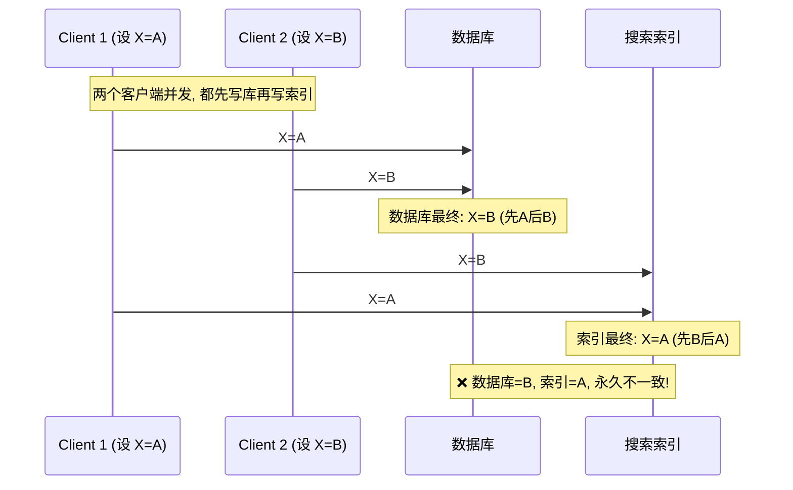

**问题 1:竞态条件**。两个客户端并发改同一项,数据库和索引看到的写入**顺序不同** → 永久不一致,且**无报错**(没有版本向量根本察觉不到,第 6 章)。

**问题 2:原子性**。一个写成功一个失败 → 不一致。要保证"要么都成功要么都失败"= 原子提交问题,2PC 很贵(第 8 章)。

**根因**:没有"单一 leader"决定顺序。数据库有 leader、索引也有 leader,互不跟随 → 冲突(多主复制的毛病,第 6 章)。**如果只有一个 leader(比如数据库),让搜索索引做它的 follower,就好了**——这正是 CDC。

### Change Data Capture (CDC)

> 📝 **名词注释:CDC (Change Data Capture, 变更数据捕获)**<br>观察写入数据库的所有变更,提取成事件流,供下游系统(搜索索引、缓存、数仓)消费并保持同步。**CDC 让一个数据库当 leader,把其他系统变成 follower**。下游是派生数据系统(第 11 章),它们只是变更流的消费者。

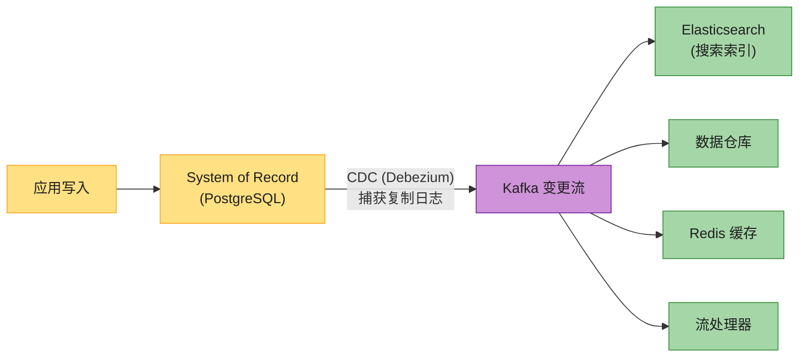

**为什么 CDC 解决了 Dual Write 的问题?**
- **顺序由数据库决定**——两个并发写,A、B 在数据库里有个确定的顺序(比如先 A 后 B),复制日志按这个顺序记录,下游按同样顺序应用 → 下游永远是 B,和数据库一致(消除竞态)。
- **只写一个系统**——应用只写数据库,CDC 异步捕获 → 没有一个写成功一个失败的原子性问题。
- **单 Leader**——数据库是唯一 leader,变更流是确定的。

### CDC 的实现

| 工具 | 支持的库 | 特点 |
|------|---------|------|
| **Debezium** | MySQL/PG/MongoDB/Oracle/SQL Server/Cassandra/Db2 | 开源,Kafka Connect 生态,事实标准 |
| **Maxwell** | MySQL | 解析 binlog,轻量 [29] |
| **GoldenGate** | Oracle | Oracle 商用 |
| **pgcapture** | PostgreSQL | PG 专用 |
| **Google Datastream** | MySQL/PG/Oracle/SQL Server/AlloyDB | 托管 |

CDC 通常基于**逻辑日志(行级复制日志)**(第 6 章),挑战是 schema 变更和 update 建模——Debezium 专门解决这些。CDC 一般**异步**:库不等消费者应用就提交(慢消费者不影响源库),代价是复制延迟问题都适用(第 6 章)。

### 初始快照 (Initial Snapshot)

要重建一个派生系统(如全新搜索索引),只有近期变更日志不够(老数据没在最近日志里)。需要:
1. 先做一个**一致快照**(对应变更日志的某个已知 offset);
2. 从快照后开始应用变更。

Debezium 用 Netflix 的 **DBLog 水印算法**做增量快照 [30][31]——不用锁表就能边读边捕获变更。

### Log Compaction(日志压缩)⭐

如果只保留有限日志历史,每次加新派生系统都要重做快照。**Log compaction** 提供了更好的办法(第 4 章 LSM 见过):

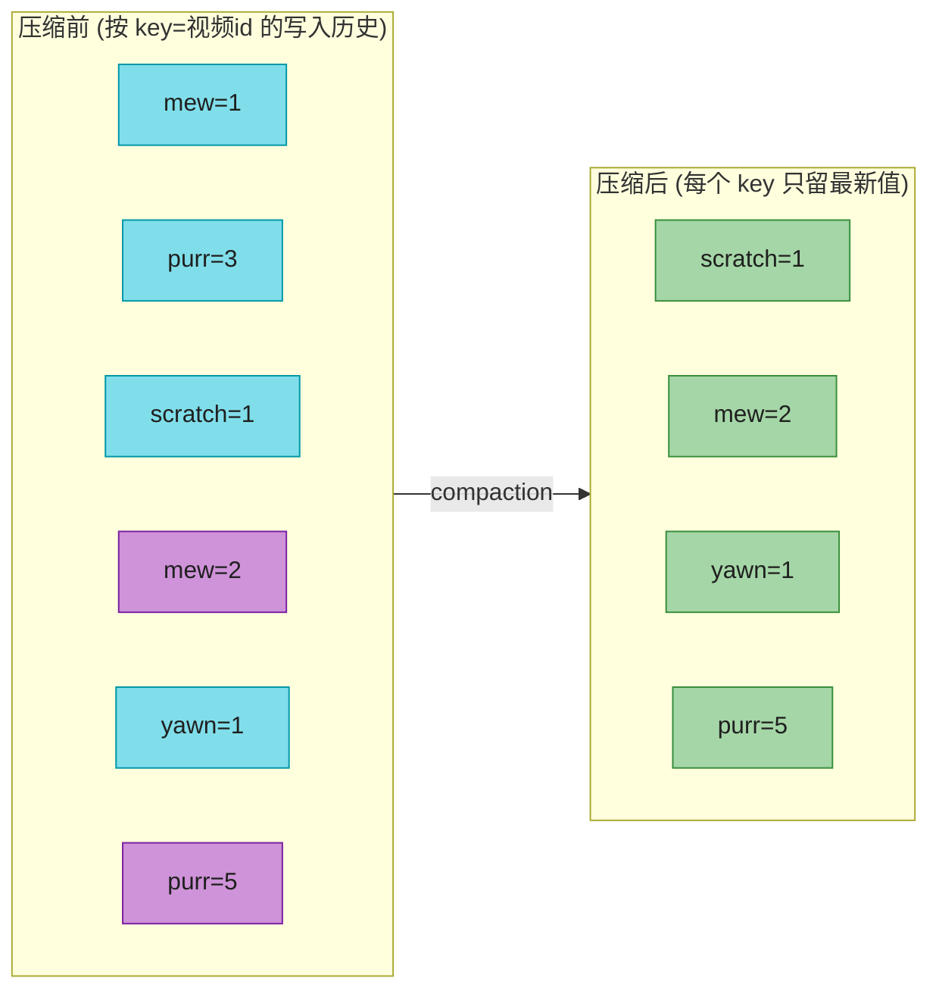

#### 深入:Log Compaction 手算

**规则**:周期性扫描日志,同 key 的多条记录只留**最新**一条(类似 LSM 的压实,第 4 章 Figure 4-3)。删除用 **tombstone(墓碑)**——值为 null 的特殊记录,compaction 时移除该 key。

**结果**:压缩后的日志磁盘占用**只取决于当前数据库内容,不取决于历史写过多少**。频繁覆盖的 key,旧值会被 GC;没被覆盖/删除的 key 永久保留。

**威力**:要重建派生系统,直接从压缩日志的 offset 0 顺序扫描——里面保证有每个 key 的最新值(可能还有点旧值),**等于拿到了数据库全量副本,不用再做快照**!Kafka 原生支持 log compaction,这让 Kafka 能当**持久存储**(不只是瞬态消息)。

### CDC vs Event Sourcing

| 维度 | CDC | Event Sourcing |
|------|-----|---------------|
| **抽象层次** | 低层(数据库行级变更) | 高层(业务领域事件) |
| **数据模型** | 可变(正常 CRUD) | 不可变(append-only 事件日志) |
| **日志来源** | 数据库复制日志(自动) | 应用显式写事件(设计决定) |
| **采纳成本** | 低(对现有系统无侵入) | 高(重新设计应用) |
| **Log compaction** | ✅(每 key 留最新值即可) | ❌(事件表达意图,后者不覆盖前者,需完整历史) |

**怎么选?** 现有系统想低成本接入流 → CDC。新建系统、想要彻底的不可变审计 → Event Sourcing(第 3 章详谈过)。

### CDC 与数据库 Schema:Outbox Pattern

微服务里,数据库是一个服务的内部实现细节,其他服务通过公开 API 访问,不直接读库。但 **CDC 通常用源库的 schema 复制**,等于把内部 schema 变成了公开 API——删一列可能破坏下游消费者,**甚至造成线上故障** [34]。**数据契约 (data contract)** 用来约束这种破坏。

**Outbox Pattern** 解耦内外 schema [35][36]:服务维护一张独立的 **outbox 表**(自己的 schema),CDC 只捕获 outbox 变更,不碰内部领域模型。开发者可自由改内部 schema,保持 outbox 不变。

> 这看起来像 dual write——但不是!outbox 和业务表在**同一个数据库**,可以放在**同一个事务**里写,避免了 12.3 开头的 dual write 问题。代价:要维护内部→outbox 的转换,outbox 增加数据库写入量。

### State = ∫Stream(本章最深刻的洞察)⭐⭐

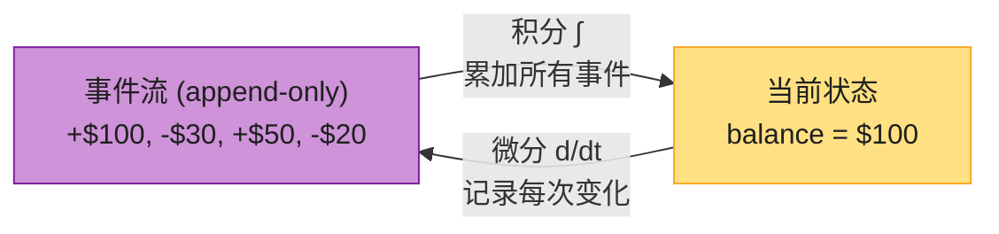

> **state(now) = ∫ stream(t) dt**(对事件流积分 = 累加所有事件 → 当前状态)
> **stream(t) = d state(t) / dt**(对状态微分 = 观察每次变化 → 事件流)

**可变状态和不可变事件日志不矛盾——它们是同一枚硬币的两面**。Jim Gray(图灵奖)说:"**根本没有必要保留数据库;日志包含了所有信息。存数据库(当前日志末尾)唯一理由是查询性能**" [39]。

#### 深入:state/stream 对偶 + 会计类比

这个数学类比极美:**会计记账几百年来就用 append-only 账本** [40]。每笔交易记一笔(事件),账户余额(状态)= 所有交易的累加(积分)。记错了**不擦改**,而是补一笔**纠正交易**(退款)——错误记录永远留在账本里供审计。

**不可变事件日志比可变状态多保留了信息**:
- **可审计**:出问题能查清发生了什么;
- **可恢复**:bug 写了坏数据 → 从不可变事件重算出正确状态(可变库做不到,坏数据已覆盖);
- **多视图**:同一事件流 → 派生搜索索引 + 分析 + 缓存(CQRS,第 3 章);
- **更多信息**:购物车"加入→移除"——状态视角只看到"空",事件视角知道"用户考虑过又放弃了"(分析价值);
- **并发简化**:事件日志定义了分片内的串行顺序,**消除了并发的不确定性**(第 8 章 actual serial execution)——单线程消费一个分片,无需并发控制。

**Log compaction 正是连接"日志"和"数据库状态"的桥**——压缩后只留每个 key 最新值,日志≈数据库。

### 不可变的局限

不可变不是万能:
- **高频更新小数据集** → 不可变历史无限膨胀 → compaction/GC 性能成关键 [45][46];
- **GDPR / 隐私法规**要求真正删除个人数据 → append-only 日志做不到"假装没写过"。

**真删数据极难**(Kreps:"分布式系统丢数据很容易,删数据出奇难" [49])。三招:
| 方法 | 做法 |
|------|------|
| **Excision(切除)** | Datomic 的特性,真删历史 [47] |
| **Shunning** | Fossil 版本控制的类似概念 [48] |
| **Crypto-shredding(加密粉碎)** | 数据加密存储,要删时**丢弃密钥**——密文还在但无人能解 [50] |

crypto-shredding 只是把问题转移(密钥存储变成可变的);且要**提前**决定哪些数据共用一把密钥。更精细的 **puncturable encryption(可穿刺加密)** [51] 能选择性撤销密钥能力,但未普及。**总体而言,"删除"更像"让数据更难获取",而非"不可能获取"**(第 14 章继续讨论法律层面)。

## 12.4 流处理的用途

有了流(消息系统传)+ 知道流和数据库的关系(CDC),现在问:**流能拿来干嘛?** 大致三类:

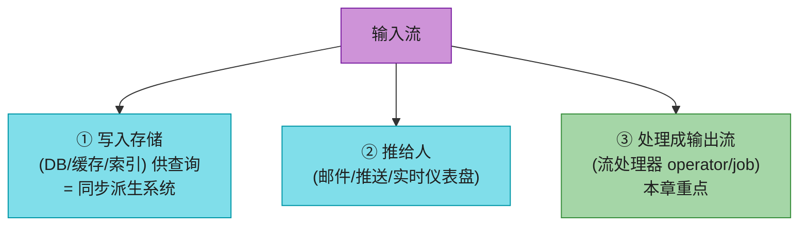

本节聚焦第 ③ 类(处理流产生派生流),它和第 11 章批处理最像——只是输入永无止境。分四个常见用途:

### 用途 1:复杂事件处理 (CEP)

> 📝 **名词注释:CEP (Complex Event Processing, 复杂事件处理)**<br>在事件流里**搜索匹配某种模式的事件序列**。像正则匹配字符串,CEP 用规则匹配事件流里的模式。典型:信用卡欺诈检测、金融交易规则触发、工厂故障告警。

CEP 的精髓是**角色反转**——普通数据库存数据、查询瞬态;**CEP 引擎存查询(长期 standing query)、数据瞬态**——每来一个事件,引擎检查它是否匹配某条常驻查询,匹配就发"复杂事件" [54]。实现:Esper、Apama、TIBCO StreamBase;Flink/Spark Streaming 的流 SQL 也能做。

### 用途 2:流分析 (Stream Analytics)

不像 CEP 找特定序列,流分析做**大量事件的聚合统计**:
- 某类事件的发生率(每秒多少次);
- 某值在时间窗内的滚动平均;
- 当前统计 vs 上周同期(趋势/异常告警)。

**概率算法**常用(Bloom filter 集合成员、**HyperLogLog** 基数估计、百分位估计算法,第 2 章)——近似但省内存。

> ⚠️ **别误以为流处理=近似/有损**!流处理本身**没有**任何内在的近似性,概率算法只是优化 [56]。框架:Storm、Spark Streaming、**Flink**、Samza、Beam、Kafka Streams;托管:Google Dataflow、Azure Stream Analytics。

### 用途 3:维护物化视图 (Materialized View)

12.3 讲过:CDC 让搜索索引/缓存/数仓这些**物化视图**与源库同步。这是流处理的王牌用途——**派生一个查询优化的视图,源数据一变就更新** [37]。Event Sourcing 里,应用状态就是事件日志的物化视图。

物化视图维护**可能需要从时间起点开始的所有事件**(不像分析只要时间窗),所以**窗口要一直延伸到"时间起点"**。Kafka Streams / ksqlDB 基于 Kafka log compaction 支持这种用法 [58]。

#### 深入:IVM(增量视图维护)

数据库本来适合维护物化视图(支持物化视图特性),但传统数据库用**周期批 job / 按需 `REFRESH MATERIALIZED VIEW`** 刷新——两个致命问题:
- **低效**:每次刷新**全量重算**(大部分数据没变);
- **不新鲜**:源数据变了,视图要等下次刷新才更新。

**增量视图维护 (IVM)** 把 SQL/其他查询转成**能增量计算的算子**——只重算变化的部分 [38][59][60]。视图计算变得极高效 → 能高频更新 → 数据新鲜度大增。

| 系统 | IVM 用法 |
|------|---------|
| **Materialize** | 基于 differential dataflow [60],实时物化视图 |
| **RisingWave** | 流式物化视图引擎 |
| **ClickHouse** | 增量物化视图 |
| **Feldera** | DBSP 增量计算 [38] |

这些系统:近期事件缓存内存 + 周期更新磁盘物化视图 + 读时合并 → 实时视图。读用 SQL、存 OLAP 格式 → 兼容数仓式大查询(第 11 章)。

### 用途 4:流上搜索

CEP 找多事件模式;有时要按复杂条件找**单个事件**(全文搜索)。如媒体监控订阅新闻流,搜索提及某公司/产品/话题的报道;房产站用户新房源符合条件时通知。

**Elasticsearch 的 Percolator** [62] 实现:传统搜索引擎先索引文档再查询;**流上搜索反过来——存查询,文档来了评估**。优化:查询也建索引,缩小可能匹配的查询集 [63]。

### 事件驱动架构 / Actor vs 流处理

Actor 模型(Akka 等)也基于消息,但通常**不算**流处理器:
- Actor 管**并发和分布式执行**,流处理管**数据管理**;
- Actor 通信**瞬态、一对一**,事件日志**持久、多订阅**;
- Actor 可任意通信(含环),流处理器是**无环管道**。

边界有交叉(Storm 的 distributed RPC、用 actor 框架处理流),但 actor 框架大多不保证崩溃时消息投递,需自实现重试 → 不抗错。

## 12.5 推理时间 ⭐⭐⭐(本章最难)

**这是流处理最棘手的部分**,也是和批处理最大的区别。流分析常要"最近 5 分钟的平均"——"最近 5 分钟"听起来明确,实则极微妙。

### Event Time vs Processing Time

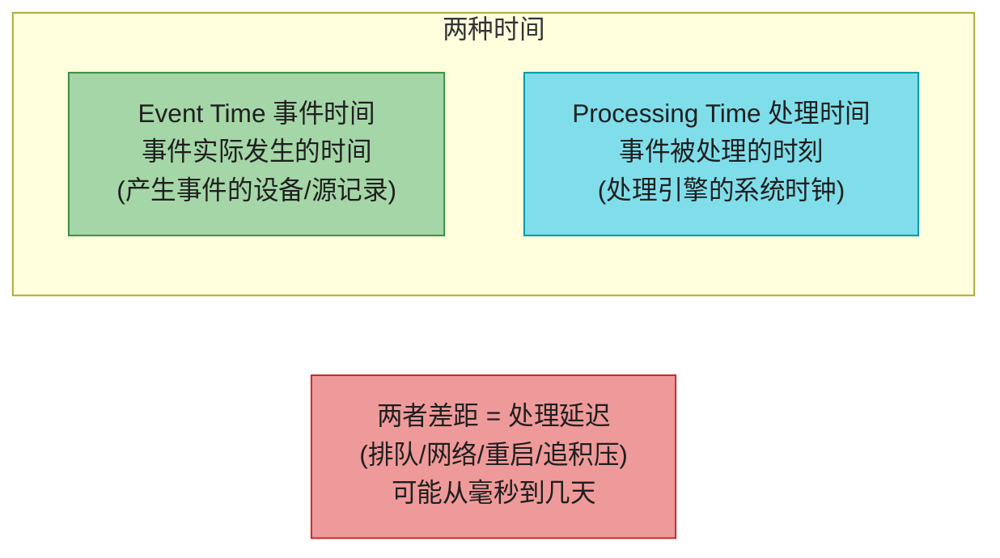

#### 深入:Star Wars 类比 + 重启追积压手算

**Star Wars 类比** [65]:Episode IV(1977)、V(1980)、VI(1983),然后 I(1999)、II、III,再 VII、VIII、IX。**按上映顺序看**(processing time)和**按剧情顺序看**(event time = episode 号)不一致。人类能 cope,流处理算法要专门写来应对。

**手算(为什么不能用 Processing Time)**:

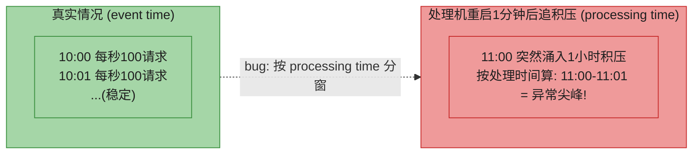

流处理器重启追积压:1 小时的稳定流量在 10 秒内处理完。**按 processing time 分窗** → "最近 5 分钟"实际塞进了 1 小时的数据 → 统计**完全失真**(看起来像异常尖峰,其实真实速率一直平稳,Figure 12-8)。

**结论**:**统计分析必须用 Event Time**。而且用 event time 让处理**确定性**——同样输入同样结果(批处理的优势,流处理也要)。很多早期框架默认用 processing time [64],这是坑。

### 处理 Straggler(迟到事件)

用 event time 分窗有个无解难题:**你永远不知道某窗口是否"收齐了"**——可能还有迟到事件在别的机器缓冲、被网络延迟。

比如按 1 分钟分窗计数,37 分钟的窗口,时间已经走到 39 分钟了,什么时候宣布 37 分钟窗口完成并输出计数?两种选择 [1]:

| 策略 | 做法 |
|------|------|
| **忽略 straggler** | 超时即关闭窗口,丢弃后续迟到事件;监控丢弃比例,超阈值告警 |
| **发布修正值** | 迟到事件到达后,更新之前窗口结果(可能要 **retract 撤回**之前的输出) |

### 用谁的时钟?(3 时间戳)

移动 App 离线时,事件可能在设备本地缓冲几小时/几天后才上报 → 极端 straggler。事件时间戳该用哪个时钟?

- **设备时钟**(事件发生时):最贴切用户行为,但**用户设备时钟不可信**(可被故意/无意设错,第 9 章);
- **服务器时钟**(收到时):受你控制更可信,但不描述用户行为。

**折中:记录三个时间戳** [67],用以估算时钟偏移:

| 时间戳 | 来源 |
|--------|------|
| ① 事件发生时间 | 设备时钟 |
| ② 事件发送时间 | 设备时钟 |
| ③ 服务器收到时间 | 服务器时钟 |

**②−③ ≈ 设备时钟与服务器时钟的偏移**(假设网络延迟可忽略)。把这个偏移加到①上 → 估算真实事件发生时间(假设偏移在①②之间没变)。

> 📝 **名词注释:Watermark(水位线)**<br>框架对"event time 已经推进到 T"的**估计**——声明"T 之前的数据应该都到了,可以关窗" [1][66]。Watermark 太激进 → 丢迟到数据;太保守 → 输出延迟。这是个权衡,没有完美答案。Beam/Dataflow/Flink 都用 watermark 触发窗口。

### 四种窗口类型 ⭐

定好时间戳,下一步定**窗口怎么划**。四种:

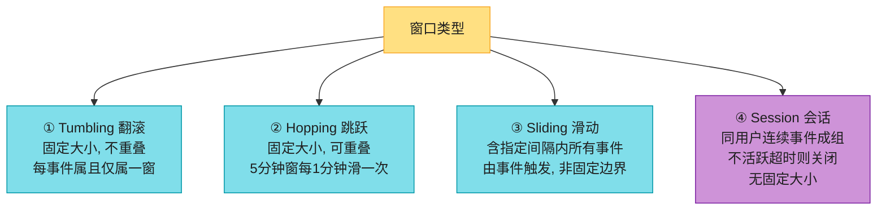

| 类型 | 例子 | 实现 |
|------|------|------|
| **Tumbling** | 每分钟一窗(10:03:00-10:03:59 一窗) | 时间戳向下取整到最近分钟 |
| **Hopping** | 5 分钟窗、1 分钟跳一次(10:03-10:07, 然后 10:04-10:08…) | 先算 1 分钟 tumbling,再聚合相邻几个 |
| **Sliding** | 5 分钟内的事件都算(10:03:39 和 10:08:12 相差<5分钟 → 同窗) | 按时间排序的事件缓冲 + 过期淘汰 |
| **Session** | 同用户 30 分钟内的事件归一组 | 用户级状态,超时关闭 |

#### 深入:窗口的状态大小(为什么流处理吃内存)

窗口操作要维护**临时状态**:
- **固定大小状态**:如计数,不管窗口多大/事件多少,就一个 counter;
- **缓冲型状态**:sliding window、stream join 要**缓冲事件直到窗口结束** → 大窗口/高吞吐 = 流处理器要存**大量临时状态**。

**这直接决定你要给流处理任务配多少内存/磁盘**。状态管理(state backend)是 Flink/Kafka Streams 的核心工程难点(见 12.7 重建状态)。

## 12.6 流式 Join ⭐⭐

第 11 章批处理有 join;流处理同样需要 join——但**新事件随时来**让流 join 比批 join 难得多。分三种,逐一用例子讲透:

### ① Stream-Stream Join(窗口 Join)

**场景**:网站搜索,想算每个搜索结果的**点击率**。用户搜索时记一条"搜索事件"(query + 返回结果),点击结果时记一条"点击事件"(点了哪个 URL)。两者用 **session ID** 关联。点击可能永不来(用户放弃),也可能几秒/几天后才来,甚至因网络延迟**比搜索事件先到**。

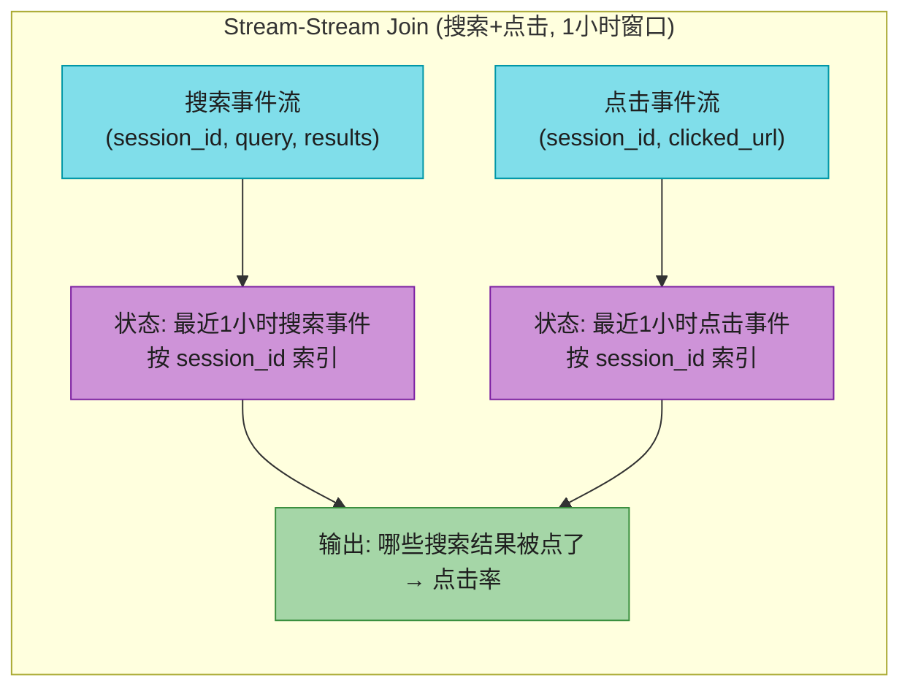

**实现**:流处理器维护**两个状态**——最近 1 小时的搜索事件(按 session_id 索引)+ 最近 1 小时的点击事件。每来一条搜索/点击事件,先加进对应索引,再去另一边索引查同 session_id 有没有匹配。匹配上 → 发"某搜索结果被点了";搜索事件过期还没等到点击 → 发"某结果没被点"。

> ⚠️ **不能把搜索详情嵌进点击事件来"省掉"join**!那样只能看到"被点的搜索",看不到"没被点的搜索"——而**没被点的搜索正是衡量搜索质量的关键**(点击率分母)。这种统计偏倚是产品分析的陷阱。

### ② Stream-Table Join(流 enrichment / 丰富)

**场景**:用户活动事件(含 user_id)要 join 用户档案表(姓名、生日等),输出"丰富后的活动事件"。这正是第 11 章批 join 的例子,但现在要**连续**做。

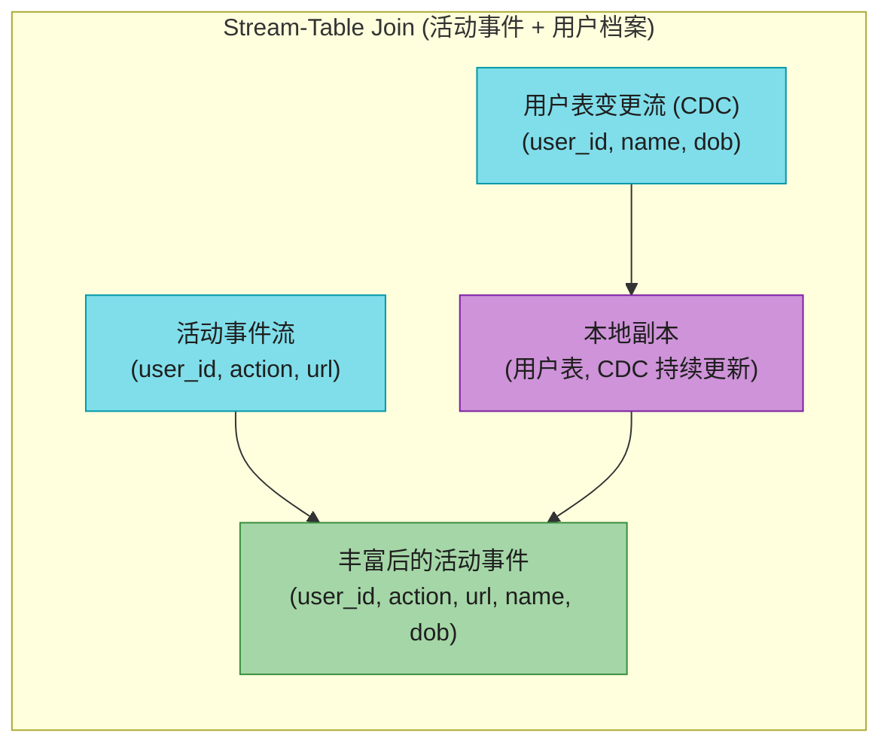

**两种实现**:
- **远程查库**:每条活动事件去远程 DB 查 user_id → **慢、压垮 DB**(第 11 章批 join 同样的坑);
- **本地副本(Hash Join)**:把用户表副本装进流处理器(小则内存哈希表,大则本地磁盘索引),活动事件本地查 → 快。

**和批 join 的关键区别**:批用**时间点快照**,流处理器是**长期运行**——用户表会变!所以流处理器要**同时订阅用户表的 CDC changelog**,档案一变就更新本地副本。**这其实是两个流的 join**(活动事件流 + 档案变更流)。

> 档案变更流这边用的是**延伸到"时间起点"的窗口**(概念上无限),新版本覆盖旧版本;活动事件这边可能根本不维护窗口。

### ③ Table-Table Join(物化视图维护)

**场景**:Twitter 主页时间线。用户看时间线时,实时遍历所有关注的人、找他们最近的帖子、合并 → 太贵。解法:维护**每用户一个"收件箱"缓存**,帖子发出时就 fan-out 写进所有粉丝的时间线。

```sql
-- 时间线本质 = 这个物化视图
SELECT follows.follower_id AS timeline_id,
       array_agg(posts.* ORDER BY posts.timestamp DESC)
FROM posts
JOIN follows ON follows.followee_id = posts.sender_id
GROUP BY follows.follower_id;
```

流处理器维护 **posts** 和 **follows** 两张表的状态,任一方变化就增量更新时间线:
- 用户 u 发帖 → 加到所有关注 u 的人的时间线;
- 删帖/销号 → 从所有相关时间线移除;
- u1 关注 u2 → u2 近期帖加到 u1 时间线;
- u1 取关 u2 → u2 帖从 u1 时间线移除。

#### 深入:(u·v)' = u'v + uv'(乘法法则)⭐

这是 Table-Table join 最优雅的洞察。把**流看作表的导数**(12.3 的 state=∫stream 反过来),把 join 看作两表的**乘积 u·v**。那么**物化 join 的变更流遵循乘积求导法则**:

> **(u·v)' = u'v + uv'**

- **u'v**:posts 任意变化(u'),join 当前的 follows(v) → 新帖 fan-out 给当前粉丝;
- **uv'**:follows 任意变化(v'),join 当前的 posts(u) → 新关注关系拉取当前帖子。

任一边变,都和另一边的**当前快照** join。**这就是流式物化视图维护的数学本质** [37]。Materialize、RisingWave 等 IVM 系统内部就是这个原理(配合 differential dataflow 做增量)。

### Join 的时间依赖(SCD 缓慢变化维)⭐

三种 join 都要维护状态,而**维护状态的事件顺序很重要**(先关注后取关 vs 先取关后关注,结果不同)。Kafka 分区内保序,但**跨流/跨分区无序保证**。

这引出棘手问题:**跨流时间相近的事件,按什么顺序处理?** 比如 stream-table join 里,用户刚改了档案,**哪些活动事件 join 旧档案、哪些 join 新档案?**——join 用哪个时间点的状态?

这种时间依赖无处不在。例:卖东西要按**销售当时**的税率开发票(税率会变),不是当前税率。**如果跨流顺序不确定,join 就不确定** [70]——重跑同一 job 可能得到不同结果(事件交错方式变了)。

数仓里这叫 **Slowly Changing Dimension (SCD, 缓慢变化维)** [71][72]。解法:
- **给每个版本唯一 ID**:税率一变就给新 ID,发票记录"销售时那个税率的 ID" → join 确定。代价:**log compaction 做不了**(所有历史版本都要留);
- **反规范化**:把适用税率直接塞进每条销售事件 → 也确定,但冗余。

> 📝 **名词注释:SCD (Slowly Changing Dimension)**<br>数仓术语,指会随时间缓慢变化的维度表(如税率表、部门归属)。流式 join 这类表时,必须明确"用哪个时间点的版本"——否则结果不确定。这是流处理比批处理多出来的复杂性(批用快照,天然确定)。

## 12.7 容错与 exactly-once ⭐⭐

流处理比批处理难的最后一个点:**容错**。批处理 task 失败,重跑即可(输入不可变,输出写独立文件,完成才可见)。流处理不行——**流永不结束**,已跑几年的任务崩溃后"从头重跑"不现实。

### exactly-once 实为 effectively-once

批处理保证:即使有 task 失败重试,**输出看起来像每个输入记录被处理了恰好一次**——没跳过、没重复。这叫 **exactly-once 语义**。注意:**实际可能处理多次**(重试),但**可见效果**像一次。所以 **effectively-once(有效一次)** 是更准确的叫法 [73]。

流处理要追求一样的保证,但"等任务完成才让输出可见"行不通(流无限)。四种技术:

| 技术 | 原理 | 代表 |
|------|------|------|
| **Microbatching** | 流切成小批,每批当迷你批处理 | **Spark Streaming** [74] |
| **Checkpointing** | 周期快照算子状态到持久存储 | **Flink** [75][76] |
| **原子提交** | 输出+状态+ACK 在框架内原子 | Dataflow/VoltDB/Kafka [78] |
| **幂等性** | 重复处理无副作用(靠元数据) | Kafka Streams/Storm Trident |

### ① Microbatching(Spark Streaming)

把流切成 ~1 秒的小块,每块当一个微型批处理(复用第 11 章批容错:task 失败重跑该块)。1 秒是性能折中(更小 → 调度开销大;更大 → 延迟高)。

**副作用**:隐式产生一个等于批大小的 **tumbling 窗口**(按 processing time!),需要更大窗口的 job 要跨 microbatch 显式带状态。

### ② Checkpointing(Flink)⭐

Flink 周期生成**滚动 checkpoint**(算子状态快照)写持久存储 [75][76]。崩溃 → 从最近 checkpoint 恢复,丢弃 checkpoint 到崩溃之间的输出。checkpoint 由消息流里的 **barrier(屏障)** 触发——像 microbatch 的边界,但**不强制特定窗口大小**(更灵活、更低延迟)。

#### 深入:Flink Barrier Checkpoint 原理(Chandy-Lamport)

Flink 的 checkpoint 基于 **Chandy-Lamport 分布式快照算法**(1985 经典):

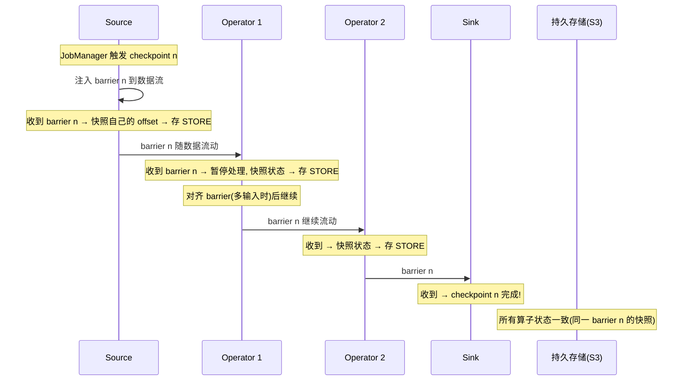

**关键**:
- **barrier 随数据流传播**,把流切成"barrier 之前"和"barrier 之后"两段;
- 每个算子收到 barrier 就**快照自己的状态**——所有算子对**同一个 barrier n** 的快照组合起来 = 一份**全局一致**的状态快照(不需要暂停整个 job);
- 多输入算子要 **barrier 对齐**(等所有输入的 barrier 都到再继续),避免数据 race;
- 崩溃恢复:从 checkpoint n 重置所有状态 + 让 source 从 checkpoint 的 offset 重放 → barrier n 之后处理过的会重处理,但靠"丢弃 checkpoint 后输出"保证 exactly-once。

**这是 Flink 比 Spark 低延迟 + 强一致的底层原因**——不需要切固定 microbatch,barrier 想多频繁就多频繁。

### ③ 原子提交(受限环境)

要"处理一个事件的所有输出和副作用,要么全做要么全不做"——消息发下游/外部 broker、DB 写、状态变更、ACK/move offset,**都要原子**。听着像第 8 章的分布式事务/2PC。

传统 XA 事务的毛病(第 8 章)让人望而却步,但**在受限环境能高效实现**——不跨异构技术,而是把状态变更和消息都**留在流处理框架内部**管理。Google Dataflow [66]、VoltDB [77]、**Kafka 事务** [78][79] 都这么做。开销可通过"一个事务处理多条消息"摊薄。

### ④ 幂等性(Idempotence)

> 📝 **名词注释:幂等 (Idempotent)**<br>操作执行多次和执行一次效果相同。删 key 幂等(再删一次无影响);**计数器自增不幂等**(再算一次多加一)。第 8 章见过。

**非幂等操作可加元数据变幂等**。如消费 Kafka 消息时,每条消息有单调 offset。写外部 DB 时,把"触发这次写的消息 offset"一起存。重投递时先查这个 offset——已应用就跳过 → 不重复写 [80][81]。Storm Trident 的状态处理同理。

**幂等方案的假设**:① 重启必须**按相同顺序重放同样消息**(log-based broker 满足);② 处理**确定性**;③ 无其他节点并发改同一值。故障切换时可能要 **fencing**(第 9 章)防"以为死了其实活着"的节点干扰。

### 故障后重建状态

有状态的流处理(窗口聚合、join 表/索引)崩溃后要能恢复状态。三招:

| 方法 | 做法 | 代表 |
|------|------|------|
| **远程存储+复制** | 状态放远程 DB | (慢,逐条查远程) |
| **本地状态+周期复制** | 状态存本地,周期快照/复制 | **Flink**(快照到 DFS)、**Kafka Streams**(状态变更发到 log-compacted Kafka topic,类似 CDC)[83]、VoltDB(多节点冗余处理) |
| **从输入流重建** | 状态可由输入重算(短窗口重放/CDC log-compacted 重建) | 窗口小或本地副本靠 CDC 维护时 |

**没有万能方案**——取决于网络 vs 磁盘延迟/带宽的权衡,且随存储/网络技术演进而变。

### 端到端 exactly-once(关键提醒)

> ⚠️ Microbatch/Checkpoint 只在**框架内部**保证 exactly-once。**输出一离开流处理器**(写外部 DB、发外部 broker、发邮件),框架就管不住了——重启会让外部副作用发生**两次**。

要端到端 exactly-once,外部副作用必须满足:
- **幂等写入**(重复写无影响),或
- **框架内原子提交**(输出+ACK 一起原子,如 Kafka 事务 sink)。

这是面试和实战的高频考点:**"框架 exactly-once ≠ 端到端 exactly-once"**。

### 容错对比小结

| 维度 | Microbatching (Spark) | Checkpointing (Flink) | 幂等性 |
|------|----------------------|---------------------|--------|
| **延迟** | ~秒级(批大小) | **毫秒~秒**(barrier 频率) | 低 |
| **窗口** | 隐式 tumbling(批大小) | 任意 | 任意 |
| **开销** | 调度开销 | checkpoint I/O | 元数据存储 |
| **复杂度** | 简单(复用批) | 中(barrier 对齐) | 简单(但要确定性+fencing) |
| **典型** | Spark Structured Streaming | **Flink** | Kafka Streams |

---

## 🏭 生产级产品速查表

| 类别 | 产品 | 定位 |
|------|------|------|
| **传统消息 broker** | RabbitMQ、ActiveMQ、IBM MQ、Azure Service Bus、GCP Pub/Sub | AMQP/JMS,逐条分配,ACK 删,任务队列 |
| **Log-based broker** | **Kafka**、Kinesis、**Redpanda**、Pulsar、WarpStream、Confluent Freight、Bufstream | 分区日志,高吞吐,可回放 |
| **CDC 工具** | **Debezium**(事实标准)、Maxwell、GoldenGate、pgcapture、Google Datastream | 捕获 DB 变更流 |
| **流处理引擎** | **Flink**(流优先)、Spark Streaming、Storm、Samza、Beam、Kafka Streams、ksqlDB | 处理流产生派生流 |
| **实时物化视图(IVM)** | **Materialize**、**RisingWave**、ClickHouse、Feldera | 增量维护物化视图 |
| **CEP** | Esper、Apama、TIBCO StreamBase | 事件模式匹配 |
| **托管流处理** | Google Dataflow、Azure Stream Analytics | 云上托管 |
| **流上搜索** | Elasticsearch Percolator | 存查询,文档来评估 |
| **Kafka 生态** | Kafka Connect(集成)、Schema Registry(schema 演进)、Kafka Streams(库) | 围绕 Kafka 的工具链 |

---

## 💻 代码示例

### Flink SQL:5 分钟窗口的 URL 访问量(event time + watermark)

```sql
-- 1. 定义 Kafka source, 声明 event time 和 watermark
CREATE TABLE page_views (
    user_id     STRING,
    url         STRING,
    event_time  TIMESTAMP(3),               -- 事件时间(用事件里的, 不是处理时间!)
    WATERMARK FOR event_time AS event_time - INTERVAL '5' SECOND
                                                   -- watermark = event_time - 5s
                                                   -- (允许 5 秒迟到)
) WITH (
    'connector' = 'kafka',
    'topic' = 'page_views',
    'properties.bootstrap.servers' = 'kafka:9092',
    'format' = 'json',
    'scan.startup.mode' = 'latest-offset'
);

-- 2. 5 分钟 tumbling 窗口: 每个 URL 的访问量
SELECT
    url,
    TUMBLE_START(event_time, INTERVAL '5' MINUTE) AS window_start,
    COUNT(*) AS visit_count
FROM page_views
GROUP BY url, TUMBLE(event_time, INTERVAL '5' MINUTE);
-- watermark 推过窗口末尾时触发输出; 5 秒内的迟到事件会更新结果
```

### PyFlink DataStream:搜索-点击 stream-stream join

```python
from pyflink.datastream import StreamExecutionEnvironment
from pyflink.datastream.functions import KeyedProcessFunction

env = StreamExecutionEnvironment.get_execution_environment()

# 两个流: 搜索事件 + 点击事件, 都按 session_id 分区(同 session 进同分区, 保序)
searches = env.from_source(kafka_source("searches"), watermark, "searches") \
              .key_by(lambda e: e.session_id)
clicks   = env.from_source(kafka_source("clicks"),   watermark, "clicks")   \
              .key_by(lambda e: e.session_id)

# 状态: 最近1小时的搜索 + 点击 (按 session_id 索引), connect 两流做 join
joined = searches.connect(clicks) \
    .key_by(lambda s: s.session_id, lambda c: c.session_id) \
    .process(SearchClickJoin())   # 自定义 CoProcessFunction: 维护两侧状态, 匹配则输出

joined.sink_to(kafka_sink("click_through_rates"))
env.execute("search-click-join")
```

### Kafka CLI 速查

```bash
# 生产
kafka-console-producer --bootstrap-server kafka:9092 --topic page_views

# 消费(从最早开始, 可回放)
kafka-console-consumer --bootstrap-server kafka:9092 --topic page_views --from-beginning

# 消费者组进度(看 lag)
kafka-consumer-groups --bootstrap-server kafka:9092 --describe --group analytics

# 创建 log-compaction topic(可当持久 KV 存储)
kafka-topics --create --bootstrap-server kafka:9092 \
  --topic user_profiles --config cleanup.policy=compact \
  --config segment.ms=86400000
```

---

## 🎯 系统设计面试题

### 面试题1:Kafka 和 RabbitMQ 怎么选?

**参考答案**:

| 选 Kafka | 选 RabbitMQ |
|---------|------------|
| 高吞吐(百万 msg/s) | 单条消息处理耗时长 |
| 需要分区内严格顺序 | 不需要严格顺序 |
| 需要**回放**(重置 offset) | 消费即删 OK |
| 多消费者组独立消费同数据(fan-out) | 任务队列(一条消息一个处理者) |
| 事件流 / CDC / 日志 | RPC 替代、任务分发 |

**本质**:Kafka = 持久 log-based broker(分区有序、可回放、并行度≤分区数);RabbitMQ = 传统 AMQP broker(逐条分配、ACK 删、无回放、并行度不限)。Kafka 像"分布式文件系统",RabbitMQ 像"异步 RPC"。

### 面试题2:为什么流处理必须用 Event Time 而不是 Processing Time?

**参考答案**:Event Time = 事件实际发生时间;Processing Time = 被处理时间。两者差距正常时很小,但流处理器**重启追积压**时巨大——1 小时积压在 10 秒内处理。**按 processing time 分窗**会把这 1 小时数据塞进"最近 5 分钟"窗口 → 统计严重失真(看着像尖峰,其实真实速率平稳)。而且用 event time 让处理**确定性**(同样输入同样结果)。**代价**:event time 无法确定窗口何时"收齐"(可能有 straggler),要用 watermark 估计 + 处理迟到(忽略或发修正值)。

### 面试题3:解释 state = ∫stream 这个对偶,它怎么指导系统设计?

**参考答案**:**可变状态 = 对事件流积分;事件流 = 对状态微分**。两者是同一枚硬币的两面。Jim Gray 说"数据库其实是当前日志末尾,存它只为查询性能"。这指导设计:
- 把**事件日志当 system of record**,可变状态当派生(可重算);
- 同一事件流派生**多个读优化视图**(搜索索引+缓存+数仓),CQRS;
- bug 写坏数据 → 从不可变事件重算恢复(可变库做不到);
- log compaction 连接两者(每 key 留最新值 → 日志≈数据库)。
局限:高频更新小数据集 → 历史膨胀;GDPR 要真删 → crypto-shredding。

### 面试题4:解释三种流式 Join 的区别。

**参考答案**:
- **Stream-Stream(窗口 join)**:两输入都是事件流,在时间窗内缓冲两侧事件按 key 匹配(如搜索事件 JOIN 点击事件)。要维护窗口状态。
- **Stream-Table(enrichment)**:事件流 + 数据库 changelog。流处理器订阅 CDC 维护**本地表副本**,活动事件本地查(免远程 DB 调用)。表的窗口延伸到"时间起点"。
- **Table-Table(物化视图)**:两输入都是 changelog。任一边变化都和另一边**当前状态** join,产出物化视图的变更流。数学本质 `(u·v)'=u'v+uv'`。Twitter 时间线是典型。
三者都要维护状态,且**事件顺序重要**(跨流无序保证会导致 join 不确定 → SCD 问题)。

### 面试题5:怎么实现流处理的 exactly-once?端到端要注意什么?

**参考答案**:四种技术——① **Microbatching**(Spark,流切小批复用批容错);② **Checkpointing**(Flink,Chandy-Lamport barrier 周期快照状态,崩溃从 checkpoint 恢复);③ **原子提交**(Dataflow/VoltDB/Kafka,输出+状态+ACK 框架内原子);④ **幂等性**(Kafka Streams,带 offset 元数据,重复写能识别跳过)。**关键提醒**:前两者只在**框架内部**保证 exactly-once。**端到端**要外部副作用也幂等或走框架内原子 sink(如 Kafka 事务)。否则重启会让外部副作用(写外部 DB/发邮件)发生两次。"exactly-once"实为"effectively-once"——可能重处理,但可见效果像一次。

### 面试题6:设计一个实时欺诈检测系统(信用卡异常交易告警)

**参考答案**:
- **需求**:每笔交易事件流,检测"短时间内异地/异常金额"模式,秒级告警冻结卡。
- **架构**:交易事件 → Kafka(partition key = 卡号,保证同卡顺序)→ Flink CEP/SQL(滑动窗口 + 模式匹配:5 分钟内>3 次异地、或金额突增 10x)→ 告警流 → 推送风控/邮件。
- **时间**:用 event time(交易发生时间),watermark 容忍网络延迟。
- **状态**:每卡的近期交易窗口状态,用 Flink RocksDB state backend + checkpoint 容错。
- **exactly-once**:Flink checkpoint + 幂等写告警库(告警带交易 ID)。
- **CDC**:用户档案/风控规则表用 CDC 流式 join 进来(Stream-Table)。

---

## 📝 本章要点总结

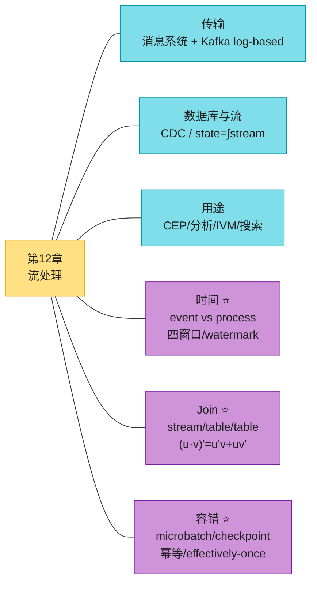

### 核心主线

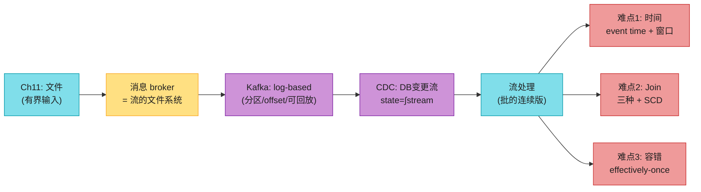

### 十二大 Takeaways

1. **流处理 = 批处理的连续版**:输入从"有界文件"变"无界事件流"。Flink:"批是流的有界特例"。

2. **两类 broker**:传统 AMQP/JMS(逐条分配、ACK 删、无回放)vs log-based(Kafka:分区日志、offset 进度、**可回放**)。选型看吞吐/顺序/回放需求。

3. **ACK + 负载均衡 = 不可避免乱序**:传统 broker 重投递会破坏顺序。要严格保序用 log-based(分区内全序)。

4. **Log-based broker ≈ 分布式文件系统**:消费非破坏性,offset 可重置 → 能回放、多消费者独立消费、bug 修复后重跑。这是 Kafka 统一数据栈的根本。

5. **Dual Write 是错的**:竞态(顺序不同→永久不一致)+ 原子性(一个成功一个失败)。**用 CDC**——数据库当 leader,下游当 follower,顺序由库决定。

6. **CDC 让 log compaction 成为可能**:每 key 留最新值 → 日志≈数据库全量副本,重建派生系统不用快照。

7. **state = ∫stream, stream = d(state)/dt**:可变状态和不可变事件是同一枚硬币两面。事件日志当 system of record,状态是派生 → 可审计、可恢复、多视图。

8. **流分析必须用 Event Time**:Processing Time 在追积压时严重失真。代价:straggler 难处理,靠 watermark 估计 + 忽略/修正。

9. **四种窗口**:Tumbling(不重叠)、Hopping(重叠)、Sliding(事件触发)、Session(用户行为分组)。缓冲型窗口吃内存。

10. **三种 Join**:Stream-Stream(窗口匹配)、Stream-Table(本地副本+CDC)、Table-Table(物化视图,`(u·v)'=u'v+uv'`)。跨流无序 → SCD 不确定性。

11. **exactly-once 实为 effectively-once**:Microbatch(Spark)/Checkpoint(Flink Chandy-Lamport barrier)/原子提交/幂等。**框架内部 ≠ 端到端**——外部副作用要幂等或框架内原子 sink。

12. **Flink 的 barrier checkpoint 是低延迟强一致的底层**:Chandy-Lamport 算法,barrier 随数据流快照,不需固定 microbatch 大小。

### 连接下一章

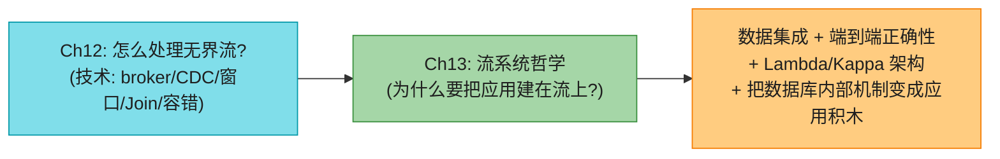

第 12 章是**技术**:怎么传输、捕获、处理事件流。第 13 章是**哲学**:为什么应该把**整个应用**建立在事件流/不可变日志之上?它把第 12 章的 CDC、物化视图、state=∫stream 升华为一种应用开发哲学——**数据集成**(用单一事件日志统一组织内的数据流)、**端到端正确性**(把数据库内部的事务/快照机制提升到应用层)、**流式优先**(Kappa 架构取代 Lambda)。读完第 13 章,你会理解为什么 Materialize、Flink、Kafka 这套"流式数据栈"被视为下一代数据系统的方向。
