# 第12章：流处理 (Stream Processing)

> *"A complex system that works is invariably found to have evolved from a simple system that works. The inverse proposition also appears to be true: A complex system designed from scratch never works and cannot be made to work."*
> — John Gall, *Systemantics* (1975)

---

## 📚 核心论文与参考文献

### 必读论文

| # | 论文/资料 | 作者 | 核心内容 | 链接 |
|---|---------|------|--------|------|
| [20] | "Kafka: A Distributed Messaging System for Log Processing" | Kreps et al. (LinkedIn) | Kafka 原始论文 | [perma.cc/52CF-4M4D](https://perma.cc/52CF-4M4D) |
| [37] | "The Database as a Stream and the Stream as a Database" | Kleppmann | state = ∫stream, stream = d(state)/dt | [perma.cc/QZ9J-FVP6](https://perma.cc/QZ9J-FVP6) |
| [57] | "The Dataflow Model" | Akidau et al. (Google) | Google Dataflow 模型（Beam 基础） | [doi:10.14778/2824032.2824076](https://doi.org/10.14778/2824032.2824076) |

### 中文资源

- Kafka 入门教程：搜索「Kafka 入门 Consumer Group Partition」
- Flink 窗口详解：搜索「Flink Window 窗口 详解」
- CDC / Debezium 入门：搜索「Debezium CDC 入门」
- Event Sourcing 入门：搜索「Event Sourcing CQRS 入门」

---

## 🗺️ 章节概览

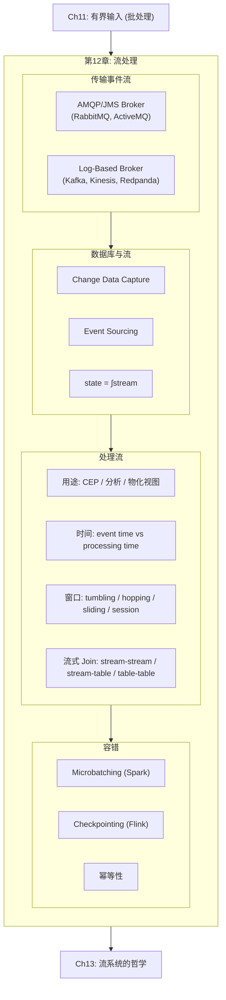

### 本章结构一览

| 小节 | 主题 | 关键概念 |
|------|------|---------|
| 12.1 | 消息系统 | AMQP vs Log-based、Consumer Group、ACK/Redelivery |
| 12.2 | Log-Based Message Broker | Kafka 分区模型、Consumer Offset、回放 |
| 12.3 | CDC 与 Event Sourcing | CDC 实现、Outbox Pattern、state = ∫stream |
| 12.4 | 流处理用途与时间 | CEP、流分析、Event Time vs Processing Time |
| 12.5 | 窗口与流式 Join | 四种窗口、三种 Join |
| 12.6 | 容错 | Microbatching、Checkpointing、幂等性 |
## 12.1 消息系统：AMQP vs Log-Based

### 两类消息 Broker

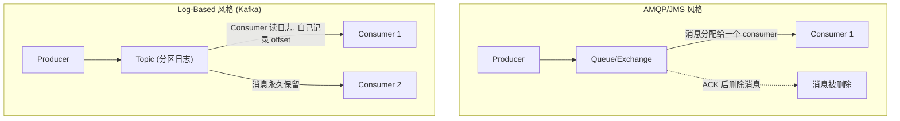

### 详细对比

| 维度 | AMQP/JMS (RabbitMQ) | Log-Based (Kafka) |
|------|---------------------|------------------|
| **消息分发** | 逐条分配给 consumer | 按分区分配 |
| **消息删除** | ACK 后删除 | 不删除（保留配置时间或永久） |
| **顺序保证** | 弱（redelivery 导致乱序） | 分区内严格有序 |
| **负载均衡** | 细粒度（逐条消息） | 粗粒度（整个分区） |
| **回放** | ❌ 消费是破坏性的 | ✅ 可随时回放（调整 offset） |
| **并行度** | consumer 数量不受限 | 受限于分区数 |
| **适用场景** | 每条消息处理代价高、顺序不重要 | 高吞吐、顺序重要、需要回放 |

### Consumer Group (Kafka)

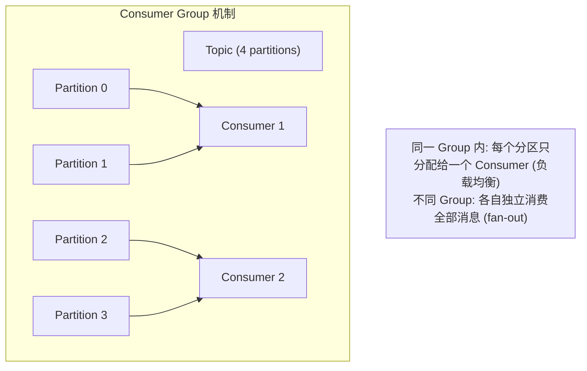

### ACK 与 Redelivery 问题

AMQP 风格的消息 broker 中，如果 Consumer 2 处理 m3 时崩溃：
- Broker 将 m3 重新投递给 Consumer 1
- Consumer 1 的处理顺序变成 m4, m3, m5 → **乱序！**

**Dead Letter Queue (DLQ)**：消息反复投递失败 → 移到 DLQ → 人工处理。Log-based 系统（Kafka）也开始支持 DLQ [19]。

### Log-based 的优势：回放

Log-based broker 的消费是**非破坏性**的——offset 只是一个指针：
- 重置 offset 到昨天 → 重新处理昨天的消息
- 新增 consumer → 从 offset 0 开始读完整日志
- bug 修复后 → 重新处理受影响的消息

这使得 log-based broker 更像**分布式文件系统**（Ch11），而非传统消息队列。
## 12.2 CDC、Event Sourcing 与 State/Stream 对偶

### Change Data Capture (CDC)

**核心思想**：将数据库的变更日志（replication log）暴露为事件流，让下游系统（搜索引擎、缓存、数仓）消费并保持同步。

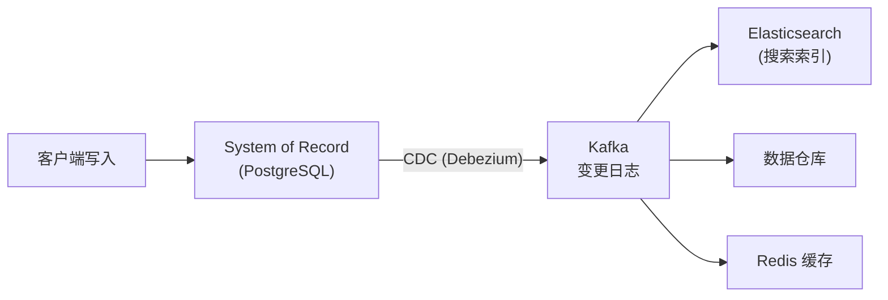

**为什么 CDC 比 Dual Write 好？**

| 问题 | Dual Write | CDC |
|------|-----------|-----|
| 竞态条件 | 两个客户端并发写 DB + 搜索引擎 → 顺序不同 → 永久不一致 | 数据库决定写入顺序 → 下游按同一顺序应用 |
| 原子性 | 一个写成功另一个失败 → 不一致 | 只写数据库 → CDC 保证最终一致 |
| 单 Leader | 无 → 可能冲突 | 数据库是 Leader → 变更流是确定的 |

**CDC 工具**：

| 工具 | 支持的数据库 | 特点 |
|------|----------|------|
| **Debezium** | MySQL, PostgreSQL, MongoDB, Oracle, SQL Server, Cassandra, Db2 | 开源，Kafka Connect 生态 |
| **Maxwell** | MySQL | 轻量 |
| **pgcapture** | PostgreSQL | PostgreSQL 专用 |
| **Google Datastream** | MySQL, PostgreSQL, Oracle, SQL Server, AlloyDB | 托管服务 |

**Outbox Pattern**：微服务中不直接暴露内部数据库 schema 给 CDC，而是维护一张 `outbox` 表 → CDC 只捕获 outbox 的变更 → 解耦内部 schema 和外部契约。

### CDC vs Event Sourcing

| 维度 | CDC | Event Sourcing |
|------|-----|---------------|
| 抽象层次 | 低层（数据库行级变更） | 高层（业务领域事件） |
| 数据模型 | 可变（正常 CRUD） | 不可变（append-only 事件日志） |
| 日志来源 | 数据库复制日志（自动） | 应用显式写入事件（设计时决定） |
| 采纳成本 | 低（对现有系统无侵入） | 高（需重新设计应用） |
| Log compaction | ✅ 可以（保留每个 key 的最新值） | ❌ 困难（事件不可覆盖，需完整历史） |

### State = ∫Stream（最深刻的洞察）

> **state(now) = ∫ stream(t) dt**
> **stream(t) = d state(t) / dt**

- 对事件流做**积分**（累加所有事件）→ 得到当前状态
- 对状态做**微分**（观察每次变化）→ 得到事件流

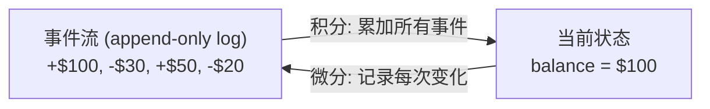

**不可变事件的优势**：
- **可审计**：会计记账数百年来就用 append-only 账本
- **可恢复**：bug 写入坏数据 → 从不可变事件重建正确状态
- **可派生多视图**：同一事件流 → 不同读优化视图（搜索索引 + 分析 + 缓存）
- **更多信息**：购物车 "加入→移除" 保留了 "用户考虑过但放弃" 的信息

**不可变的局限**：
- 高频更新小数据集 → 不可变历史无限增长 → 需要 compaction / GC
- GDPR 要求真正删除数据 → 不可变日志需要 **crypto-shredding**（加密数据，删除密钥）
## 12.3 流处理用途与时间

### 流处理的三大用途

| 用途 | 描述 | 代表 |
|------|------|------|
| **CEP (Complex Event Processing)** | 在事件流中搜索匹配某种模式的事件序列 | Esper, Flink SQL |
| **流分析 (Stream Analytics)** | 在时间窗口内做统计聚合（计数、平均、百分位） | Flink, Spark Streaming, ksqlDB |
| **物化视图维护 (Materialized View)** | 将事件流实时转化为可查询的视图 | Materialize, RisingWave, ClickHouse |

**IVM (Incremental View Maintenance)**：增量更新物化视图——不重算全部数据，只根据新变更增量更新。Materialize [61] 和 RisingWave 用此技术实现实时物化视图。

### Event Time vs Processing Time ⭐

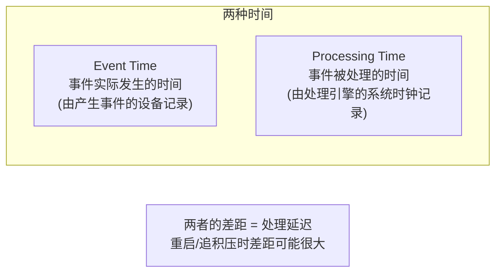

**为什么不能用 Processing Time？**

流处理器重启后追积压——1 小时的积压在 10 秒内处理完。如果用 processing time 做窗口，"最近 5 分钟" 实际上包含了 1 小时的数据 → 统计结果完全错误。

**解决方案**：使用 **Event Time** 做窗口。但设备时钟不可靠（Ch9）→ 记录三个时间戳来估算时钟偏移 [67]。

### Straggler（迟到事件）处理

用 event time 做窗口时，永远不知道窗口是否"关闭了"——可能还有迟到事件：

| 策略 | 说明 |
|------|------|
| **忽略迟到** | 小比例迟到可接受；监控丢弃比例 |
| **发布修正值** | 迟到事件到达后更新之前的窗口结果 |
| **Watermark** | 框架估计"event time 已经推进到 T" → T 之前的窗口关闭 [66] |

### 四种窗口类型 ⭐

| 类型 | 描述 | 特点 |
|------|------|------|
| **Tumbling** | 固定大小，不重叠。如每分钟一个窗口 | 每个事件属于且仅属于一个窗口 |
| **Hopping** | 固定大小，可重叠。如 5 分钟窗口，每 1 分钟滑动一次 | 事件可能属于多个窗口；用于平滑统计 |
| **Sliding** | 包含指定时间间隔内的所有事件 | 由事件触发，不是固定边界 |
| **Session** | 同一用户的连续事件归为一组，不活跃超时则关闭 | 无固定大小；用于用户行为分析 |
## 12.4 流式 Join 与容错

### 三种流式 Join ⭐⭐

| 类型 | 输入 | 状态需求 | 示例 |
|------|------|--------|------|
| **Stream-Stream** (Window Join) | 两个事件流 | 在窗口内缓存两侧事件 | 搜索事件 JOIN 点击事件（按 session ID） |
| **Stream-Table** (Enrichment) | 事件流 + 数据库快照 | 本地缓存数据库副本 (CDC 更新) | 用户活动事件 JOIN 用户 profile 表 |
| **Table-Table** (Materialized View) | 两个变更流 | 维护两张表的完整状态 | posts 表 JOIN follows 表 → 构建时间线 |

### Stream-Stream Join 详解

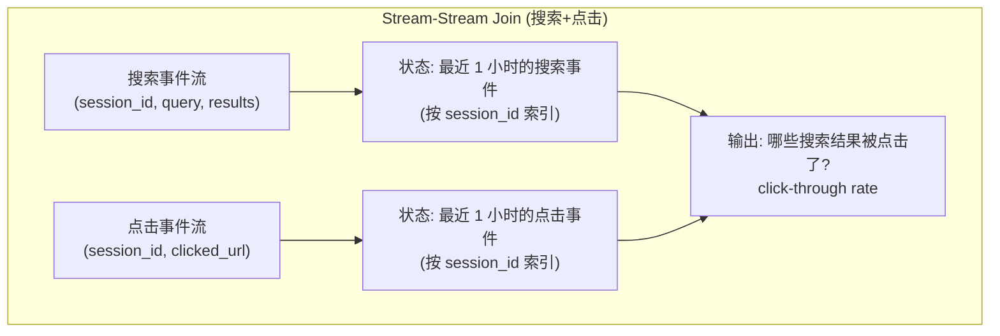

### Stream-Table Join 详解

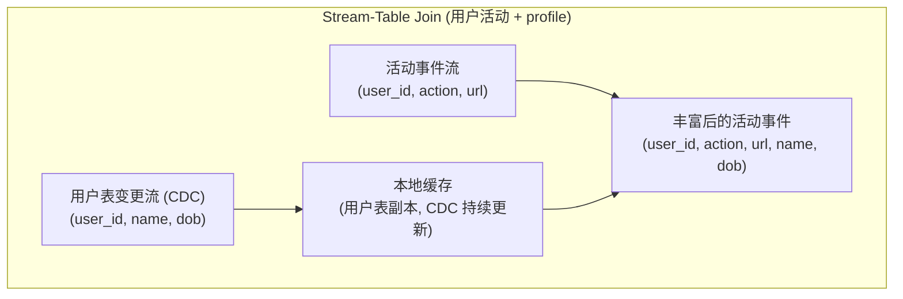

与批处理的 Join 类似，但关键区别：**数据库在变化** → Stream processor 通过 CDC 订阅用户表变更，保持本地副本最新。

### Table-Table Join (物化视图维护)

Twitter 时间线的本质：`SELECT posts.* FROM posts JOIN follows ON posts.sender_id = follows.followee_id WHERE follows.follower_id = ?`

流处理器维护 follows 和 posts 两张表的状态 → 任何一方变化时增量更新时间线缓存。这本质上是乘法法则：(u·v)' = u'v + uv'。

### 容错：三种方案

| 方案 | 原理 | 优点 | 缺点 | 代表 |
|------|------|------|------|------|
| **Microbatching** | 流切成小批，每个小批按批处理方式处理 | 简单，复用批处理容错 | 延迟 = 小批大小 (~1s) | Spark Structured Streaming |
| **Checkpointing** | 周期性快照算子状态到持久存储 | 低延迟，精确 | checkpoint 开销 | **Apache Flink** |
| **幂等性** | 每条消息带唯一 ID → 重复处理无副作用 | 简单，低开销 | 需要消息有唯一 ID + 确定性处理 | Kafka Streams, 自建 |

**Flink Checkpointing 详解**：

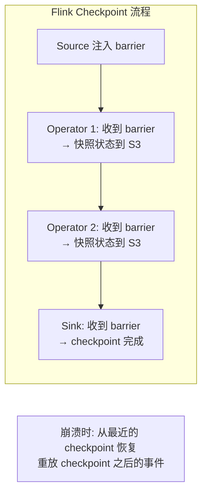

**外部副作用的 exactly-once**：Microbatching 和 Checkpointing 只在框架**内部**保证 exactly-once。如果输出写到外部数据库、发邮件等 → 需要额外措施（幂等写入 或 内部原子提交）。

---

## 💻 代码示例

### Flink SQL 流处理

```sql
-- 创建 Kafka Source
CREATE TABLE page_views (
    user_id STRING,
    url STRING,
    event_time TIMESTAMP(3),
    WATERMARK FOR event_time AS event_time - INTERVAL '5' SECOND
) WITH (
    'connector' = 'kafka',
    'topic' = 'page_views',
    'properties.bootstrap.servers' = 'kafka:9092',
    'format' = 'json'
);

-- 5 分钟 tumbling 窗口：每个 URL 的访问量
SELECT
    url,
    TUMBLE_START(event_time, INTERVAL '5' MINUTE) AS window_start,
    COUNT(*) AS visit_count
FROM page_views
GROUP BY url, TUMBLE(event_time, INTERVAL '5' MINUTE);
```

---

## 🎯 面试题

### 面试题1：Kafka 和 RabbitMQ 什么时候用哪个？

| 选 Kafka | 选 RabbitMQ |
|---------|------------|
| 高吞吐 (百万 msg/s) | 单条消息处理耗时长 |
| 需要消息顺序 | 不需要严格顺序 |
| 需要回放 | 消费即删 OK |
| 多消费者独立消费同一数据 | 任务队列（一条消息一个处理者） |
| 事件流 / CDC / 日志 | RPC 替代、任务分发 |

### 面试题2：Event Time 和 Processing Time 的区别是什么？

Event Time = 事件实际发生的时间；Processing Time = 事件被处理的时间。两者差距在正常时很小，但在流处理器重启/追积压时可能很大。统计分析必须用 Event Time，否则重启后的统计结果会严重失真。Watermark 机制用于估计 Event Time 的推进并触发窗口关闭。

---

## 📝 本章要点总结

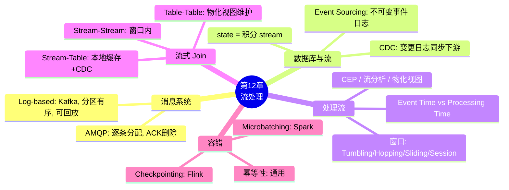

### 八大 Takeaways

1. **两类 Broker**：AMQP 风格（逐条分配、ACK 删除、无回放）vs Log-based（按分区分配、保留消息、可回放）

2. **Log-based broker ≈ 分布式文件系统**——消费是非破坏性的，可以回放、多消费者独立消费

3. **CDC 是保持多系统同步的最佳方案**——数据库是 Leader，下游系统是 Follower，通过 CDC 事件流保持一致

4. **state = ∫stream 是最深刻的洞察**——不可变事件流和可变状态是同一枚硬币的两面

5. **Event Time 必须用于窗口计算**——Processing Time 在追积压时会产生严重失真

6. **三种流式 Join**：Stream-Stream（窗口内）、Stream-Table（本地缓存 + CDC）、Table-Table（物化视图维护）

7. **容错三种方案**：Microbatching（Spark）、Checkpointing（Flink）、幂等性（通用）

8. **框架内部的 exactly-once 不等于端到端的 exactly-once**——外部副作用需要幂等写入或内部原子提交

### 连接下一章

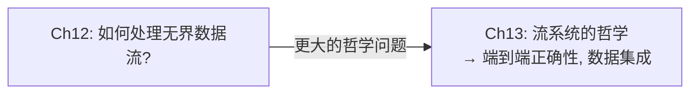