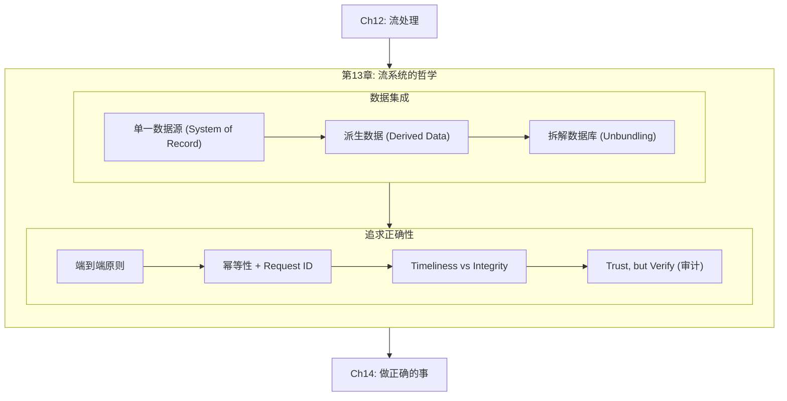
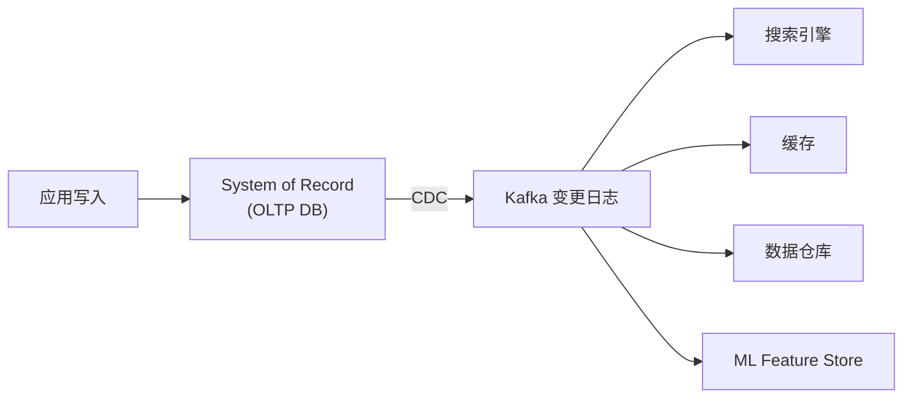
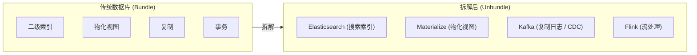
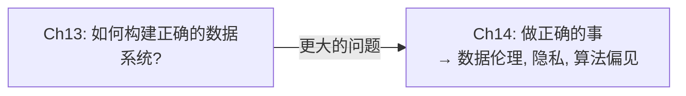

# 第13章：流系统的哲学 (A Philosophy of Streaming Systems)

> *"If a thing be ordained to another as to its end, its last end cannot consist in the preservation of its being."*
> — St. Thomas Aquinas, *Summa Theologica* (1265–1274)

---

## 📚 核心论文与参考文献

### 必读论文

| # | 论文/资料 | 作者 | 核心内容 | 链接 |
|---|---------|------|--------|------|
| [3] | "Designing Data-Intensive Applications" | Martin Kleppmann | 全书基础（"道歉比请求许可更容易"） | 本书 |
| [5] | "Turning the Database Inside-Out with Apache Samza" | Martin Kleppmann | 把数据库"翻过来"——核心思想 | [perma.cc/4B4B-NJLM](https://perma.cc/4B4B-NJLM) |
| [44] | "End-To-End Arguments in System Design" | Saltzer, Reed, Clark | 端到端原则（经典） | [doi:10.1145/357401.357402](https://doi.org/10.1145/357401.357402) |

---

## 🗺️ 章节概览

本章是全书的**思想总结**——将 Ch1-Ch12 的所有线索编织在一起，提出一种比传统事务更灵活、更可扩展的正确性保障方式。



---

## 📖 详细内容

### 13.1 数据集成：派生数据 vs 分布式事务

**核心问题**：多个系统存储同一份数据的不同表示（OLTP、搜索引擎、缓存、数仓）——如何保持一致？

| 方案 | 原理 | 优点 | 缺点 |
|------|------|------|------|
| **分布式事务 (2PC/XA)** | 原子提交确保所有系统同时更新 | 强一致 | 性能差、可用性低、跨异构系统难以实现 |
| **派生数据 (CDC + 日志)** | 一个 System of Record → CDC 日志 → 下游系统消费 | 松耦合、容错好、可扩展 | 异步 → 暂时不一致（最终一致） |



**Kleppmann 的核心论点**：在异构系统之间，**日志 + 确定性派生 + 幂等性** 比分布式事务更实际、更健壮。

### 13.2 全序的局限与因果顺序

全序广播（Ch10）需要共识 → 需要 Leader → 是吞吐瓶颈。实际中很多场景不需要全序：

| 场景 | 是否需要全序 |
|------|---------|
| 同一对象的多次更新 | ✅ 需要（路由到同一分片即可） |
| 跨分片的因果依赖 | ⚠️ 需要因果序但不一定需要全序 |
| 完全独立的事件 | ❌ 不需要（并发即可） |

**捕获因果依赖的方法**：
- 同一对象的事件路由到同一日志分片 → 自然有序
- 记录"用户看到了什么状态后做的决策" → 后续事件引用该状态 ID
- 逻辑时间戳辅助乱序事件的处理

### 13.3 批处理 + 流处理 = 统一数据架构

| | 批处理 | 流处理 | 统一 |
|--|------|--------|------|
| 输入 | 有界（文件） | 无界（流） | 流可以回放（Kafka）→ 也能当批输入 |
| 确定性 | ✅（同一输入 → 同一输出） | ✅（如果处理逻辑确定性） | 确定性是两者共同的力量 |
| 容错 | 删除输出重跑 | Checkpoint / 幂等重试 | 不可变输入 + 确定性 = 可安全重试 |
| 演化 | 新代码 → 重跑历史数据 → 生成新视图 | 新代码 → 消费新事件 → 逐步替换旧视图 | 新旧视图并行运行 → 渐进迁移 |

**Lambda 架构** [11]（批 + 流分别跑）已被 **Kappa 架构** [13]（统一用流）取代。Flink、Beam 支持批流统一。

### 13.4 拆解数据库 (Unbundling Databases)

**核心比喻**：数据库内部的功能（二级索引、物化视图、复制日志）被"拆"到外部独立组件中：



| 数据库内部功能 | 拆解后的外部实现 |
|-------------|--------------|
| 二级索引 | Elasticsearch, Algolia |
| 物化视图 | Materialize, RisingWave, ClickHouse |
| 复制日志 | Kafka CDC |
| 事务 | 流处理器 + 幂等性 |

**Federated (读统一)** vs **Unbundled (写统一)**：
- Federated：统一查询接口读多个存储（Trino, PostgreSQL FDW）
- Unbundled：统一写入路径保持多个存储同步（CDC + Kafka + Stream Processor）

### 13.5 端到端正确性 (The End-to-End Argument)

> **"The function in question can completely and correctly be implemented only with the knowledge and help of the application standing at the endpoints."** — Saltzer, Reed, Clark (1984)

**端到端原则在数据系统中的应用**：

| 低层保证 | 为什么不够 | 需要端到端措施 |
|--------|---------|-----------|
| TCP 去重 | 只在单连接内有效；TCP 断开重连 = 新连接 | 客户端生成 request ID → 数据库去重 |
| 数据库事务 | 事务原子性只在 DB 内有效；客户端超时不知道是否提交 | request ID 穿透客户端 → DB |
| 流处理 exactly-once | 只在框架内部有效；写外部系统时可能重复 | 幂等写入 + fencing token |
| Ethernet/TLS 校验 | 只检查传输层；磁盘/内存可能损坏 | 端到端应用层校验和 |

**幂等性 + Request ID = 端到端 Exactly-once**：

```sql
-- 客户端生成 request_id (UUID)，穿透全链路
ALTER TABLE requests ADD UNIQUE (request_id);

BEGIN TRANSACTION;
-- 利用唯一约束实现幂等——重复插入会失败
INSERT INTO requests (request_id, from_account, to_account, amount)
  VALUES ('0286FDB8-D7E1-...', 4321, 1234, 11.00);
UPDATE accounts SET balance = balance + 11.00 WHERE account_id = 1234;
UPDATE accounts SET balance = balance - 11.00 WHERE account_id = 4321;
COMMIT;
```

### 13.6 Timeliness vs Integrity ⭐

**Kleppmann 将"一致性"拆分为两个独立概念**：

| | Timeliness (时效性) | Integrity (完整性) |
|--|---|---|
| **含义** | 用户看到的是最新状态 | 数据没有丢失、损坏或矛盾 |
| **违反后果** | 暂时看到旧数据（annoying） | 永久数据损坏（catastrophic） |
| **修复方式** | 等一等就好了（最终一致） | 需要显式修复/回滚 |
| **重要性** | 大多数场景可以容忍延迟 | 几乎所有场景都不能容忍损坏 |
| **实现代价** | 需要同步协调（线性一致性）→ 贵 | 可通过异步日志 + 幂等性 → 便宜 |

> **核心洞察**：ACID 事务同时提供 timeliness + integrity，但代价高。如果分开看，**integrity 可以通过异步 dataflow + 幂等性低成本实现**，而 timeliness 只在真正需要时才引入同步协调。

### 13.7 宽松约束与补偿事务

很多"硬约束"在业务上其实是"软约束"——可以违反后补偿：

| 场景 | 约束 | 违反后的补偿 |
|------|------|---------|
| 库存超卖 | 不能卖超过库存量 | 致歉 + 补货 + 折扣 |
| 航班超售 | 一个座位一个人 | 升舱 / 改签 / 赔偿 |
| 银行透支 | 余额 ≥ 0 | 透支费 + 限制每日取款额 |

> **"道歉比请求许可更容易"**——如果违反约束的代价可控，可以乐观地先执行，事后检查并补偿。这比同步检查所有约束（需要分布式事务/共识）便宜得多。

### 13.8 Trust, but Verify（审计与自验证）

**不要盲目信任任何组件**——硬件会坏、软件有 bug、磁盘会静默损坏。

| 层 | 可能出错 | 检测方式 |
|---|--------|--------|
| 磁盘 | 静默损坏 (bit rot) | 后台校验和对比 (HDFS/S3 内置) |
| 数据库 | 软件 bug 导致数据损坏 | 定期审计（重放事件日志 → 对比当前状态） |
| 应用代码 | 逻辑错误 | 端到端校验和；事件溯源 → 可重放验证 |
| 整个管道 | 中间任何环节出错 | 端到端 integrity check（从源到目标的一致性验证） |

**Event Sourcing 的审计优势**：传统数据库只存最终状态 → 无法追溯"为什么变成这样"。事件日志记录每个决策 → 确定性重放 → 可验证当前状态是否正确 → "时光旅行调试"。

---

## 📝 本章要点总结

### 八大 Takeaways

1. **派生数据 + 日志 > 分布式事务**：异构系统之间用 CDC + 幂等性保持同步，比 2PC/XA 更实际

2. **拆解数据库 (Unbundling)**：数据库的内置功能（索引、物化视图、复制）可以用外部组件（ES、Materialize、Kafka）实现，通过 CDC 松耦合

3. **端到端原则**：低层的 TCP 去重、DB 事务、流处理 exactly-once 都不够——需要客户端生成 request ID 穿透全链路

4. **Timeliness vs Integrity 是不同的东西**：Integrity 可以用异步 dataflow + 幂等性低成本保证；Timeliness 需要同步协调才能保证

5. **很多"硬约束"其实是"软约束"**：库存超卖、银行透支可以先执行后补偿——"道歉比请求许可更容易"

6. **确定性是万能工具**：确定性处理 + 不可变输入 = 可重试、可审计、可重放、可验证

7. **Trust, but Verify**：不要盲目信任硬件/软件/数据库——端到端校验和 + 定期审计 + 事件溯源重放验证

8. **批流统一是趋势**：Kappa 架构取代 Lambda；Flink/Beam 支持同一代码批流两用

### 连接下一章

