# 第13章：流系统的哲学 (A Philosophy of Streaming Systems)

> *"If a thing be ordained to another as to its end, its last end cannot consist in the preservation of its being."*
> (常被引为:If the highest aim of a captain was to preserve his ship, he would keep it in port forever.)
> — St. Thomas Aquinas, *Summa Theologica* (1265–1274)

> 船停在港口最安全,但那不是造船的目的。数据系统也一样——为了可靠就把它锁在单机事务里最"安全",但那不是建数据系统的目的。本章是**全书的哲学总结**:把 Ch1-Ch12 的所有线索(可靠性、可扩展、可维护 + 流式/事件驱动)编织成一套**应用开发的哲学**。它比前面各章更"有主张",深挖一条路线,而非罗列多种方案。

---

## 📚 精选文献

| # | 文献 | 为什么值得读 |
|---|------|------------|
| [5] | Kreps, *The Log: What Every Software Engineer Should Know About Real-Time Data's Unifying Abstraction* (2013) | Jay Kreps(Kafka 作者)名篇。把"日志"讲成实时数据的**统一抽象**,连接数据库复制、批处理、流处理。本章"万物元数据库"思想的源头。 |
| [31] | Kleppmann, *Turning the Database Inside-out with Apache Samza* (Strange Loop 2014) | Kleppmann 的标志性演讲。把数据库的内部机制(日志、索引、物化视图、触发器)**翻出来**变成构建任何数据系统的通用积木。本章 "Unbundling the Database" 的核心。 |
| [44] | Saltzer, Reed, Clark, *End-to-End Arguments in System Design* (TOCS 1984) | **端到端原则**经典论文。本章正确性讨论的根基:某些功能只能在端点(应用)正确实现,不能靠底层通信系统代劳。 |
| [47] | Kleppmann/Beresford/Svingen, *Online Event Processing* (CACM 2019) | 用事件日志 + 流处理器实现**跨系统一致性**,无需分布式事务。Figure 13-2 多分片支付的完整论证。 |
| [6] | Helland, *Life Beyond Distributed Transactions* (CIDR 2007) | Pat Helland 的经典。论证"分布式事务不是唯一选择",提出分区(partition)自治 + 消息传递。coordination-avoiding 的先驱。 |

**延伸阅读**:Lambda 架构 [11] 及其批判 [12] · Unix 哲学与 Kafka/Samza [20] · 微服务与流 [27][28] · coordination-avoiding [45] · Saga 补偿事务 [49] · Certificate Transparency [58][59]。

---

## 🗺️ 章节概览

第 2 章定下目标:构建**可靠、可扩展、可维护**的应用。本章把这些目标与前 12 章的技术(尤其第 12 章的流式/事件驱动)结合,提出一套**应用开发的哲学**。三大支柱:

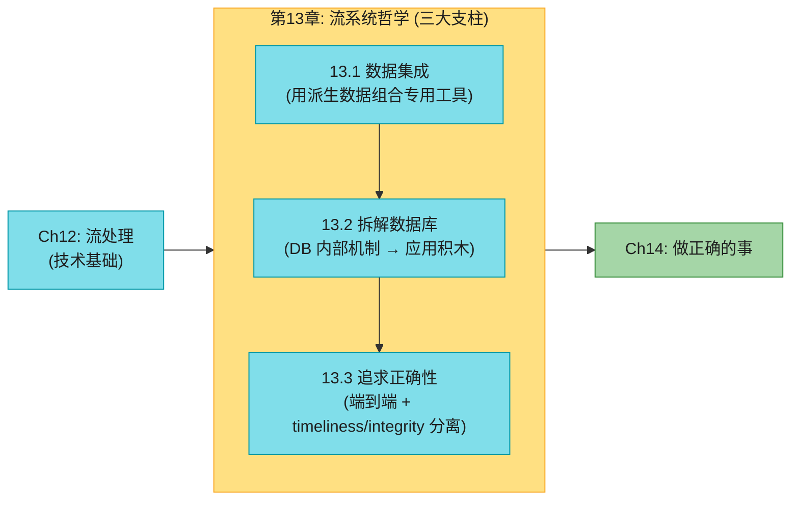

### 本章结构一览

| 小节 | 主题 | 关键概念 |
|------|------|---------|
| 13.1 | 数据集成 | 单一 SoR 定顺序、全序局限、捕获因果、铁路轨距类比、批流统一(Lambda→Kappa) |
| 13.2 | 拆解数据库 | CREATE INDEX≈建follower、Federated 统一读 vs Unbundled 统一写、Church and state、货币转换、write/read path |
| 13.3 | 追求正确性 | 端到端论证、request_id 幂等、多分片支付、Timeliness vs Integrity、补偿事务、Trust but verify |

> 💡 **本章为何重要**:它是全书的"大统一理论"。前面 12 章你学了存储/复制/分片/事务/共识/批/流这些**零件**;本章告诉你**怎么用它们拼出一座真正可靠、可扩展、还能随业务演化的数据大厦**——而秘诀是把数据库的内部智慧(日志、索引、物化视图、触发器)**提升到应用层**。

## 13.1 数据集成 (Data Integration)

本书反复出现一个主题:**任何问题都有多种解,各有利弊**。存储引擎有 LSM/B-tree/列存;复制有单主/多主/无主。没有"通用最优"——每个软件都是为特定用法设计的。

复杂应用里,数据要被**多种方式**使用,一个软件不可能全包:OLTP 库服务请求 + 全文索引做搜索 + 数仓做分析 + 缓存 + ML 推荐 + 通知……你**不可避免**地要拼凑多个软件。**怎么让它们保持同步?**

### 用派生数据组合专用工具

最经典的组合:OLTP 数据库 + 全文搜索引擎(PostgreSQL 内置全文索引够简单场景用 [1],但专业搜索要 ES)。问题来了:**两者都存同一份数据,怎么同步?**

#### 推理数据流:让一个系统当"源头"

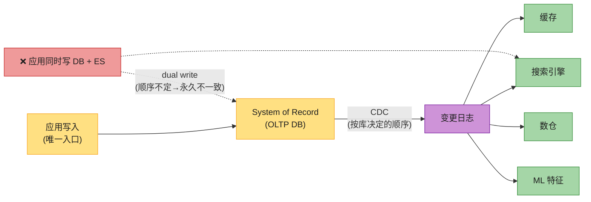

**核心原则**:**所有用户输入汇聚到一个系统(system of record),由它决定写入的全序**。然后用 CDC 把变更按同样顺序应用到所有派生系统(第 12 章讲过)。这样每个派生系统都**完全由 SoR 派生**,因此与它一致(除了软件 bug)。

这就是第 10 章的**状态机复制 (SMR)**:同一份事件日志、同样的确定性处理 → 所有副本达到同样状态。用 CDC 还是 event sourcing 不重要,**重要的是"决定一个全序"**这个原则。

> ⚠️ **允许应用同时写 DB 和 ES** = 第 12 章的 dual write 灾难(图 12-4):两个客户端并发冲突写,DB 和索引处理顺序不同 → 永久不一致,且谁都不"in charge"。

### 派生数据 vs 分布式事务

两种保持多系统一致的方法:

| | 分布式事务 (2PC/XA) | 派生数据 (CDC + 日志) |
|--|------------------|-------------------|
| **机制** | 原子提交协议 | 确定性重试 + 幂等 |
| **时效性** | 写后立即可读(强) | 异步更新(最终一致) |
| **故障行为** | 任一参与者失败 → 中止,**放大故障** | 故障被局部隔离,日志缓冲 |
| **跨异构系统** | XA 性能/容错差,难 | 日志 + 幂等消费,**简单可行** |
| **采纳** | 受限环境用 | **最 promising 的集成方式** |

XA 的毛病(第 8 章)严重限制了它的可用性。在没有好的跨异构分布式事务协议的现实下,**基于日志的派生数据是最有希望的系统集成方法**。reading-your-own-writes 这种保证仍有用,本章后面会给"在异步派生系统上构建更强保证"的折中方案。

### 全序的局限

足够小的系统,构建全序事件日志完全可行(单主库就是这么干的)。但系统变大,全序开始力不从心:

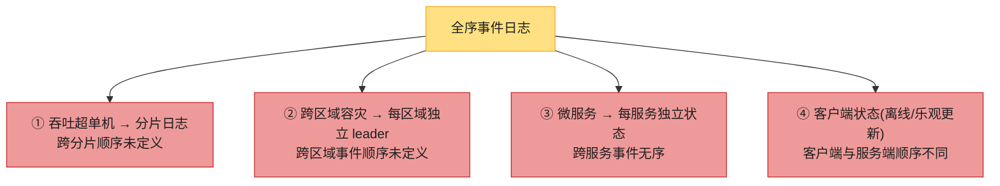

形式上,**决定事件全序 = 全序广播 = 共识**(第 10 章)。大多数共识算法假设单节点吞吐够用整个事件流,**不提供多节点分担排序的机制**。所以大规模下,全局全序不可得。

### 捕获因果顺序

好在:**没有因果联系的事件,顺序无所谓**(并发事件可任意排)。有些情况好处理——同一对象的多次更新,把该对象 ID 路由到同一日志分片就自然有序。但因果依赖有时很微妙:

> **分手与取消关注**:社交网络里,A 和 B 分手。A 先**取消关注 B**,然后给还在关注的人发一条吐槽 B 的消息。A 的意图:B 看不到这条消息(因为消息发出时已取消关注)。
>
> 但如果友谊状态存在一处、消息存在另一处,**取消关注事件和发消息事件之间的因果依赖可能丢失**。通知服务若先处理"发消息"再处理"取消关注",就会**错误地把通知发给前任**。

通知本质是"消息表 JOIN 好友表",这又回到了第 12 章流式 join 的**时间依赖**问题。可惜没有简单答案 [2][3],起点包括:

| 方法 | 做法 |
|------|------|
| **逻辑时间戳** | 不协调地提供全序(第 10 章 Lamport/HLC),但要处理乱序事件 + 带额外元数据 |
| **记录"决策前看到的状态"** | 记录用户做决策时系统状态的快照,给唯一 ID,后续事件引用它 [4]——明确表达因果 |
| **冲突解决算法** | 帮助处理乱序到达的事件维护状态(第 6 章),但对**有外部副作用**的操作(发通知)无能为力 |

未来可能出现高效捕获因果依赖、正确维护派生状态、又不强迫所有事件过全序广播瓶颈的应用模式——这是开放的研究方向。

### 批 + 流 = 统一数据架构

数据集成的目标是让数据以正确形式出现在正确位置。批/流处理器是达成这目标的工具——产出派生数据集(搜索索引、物化视图、推荐、聚合指标)。

**维护派生状态**:批处理有强烈的函数式风味(确定性、纯函数、不可变输入、append-only 输出);流处理类似但加了受管理的容错状态。这种"确定性函数 + 明确输入输出"不仅利于容错,也简化了**组织内数据流的推理** [5]。无论派生数据是索引、模型还是缓存,都可以想成"数据管道:从一个东西派生出另一个"。**派生数据本可以同步维护**(像数据库同事务更新二级索引),但**异步性正是基于事件日志的系统强健的根源**——一处故障被局部隔离,而分布式事务任一参与者失败就中止,**放大故障**。

#### 深入:铁路轨距——用重处理做应用演化(schema migration) ⭐

这是本章最美的类比。重处理已有数据是**系统演化、支持新功能**的利器:

> 19 世纪英国铁路早期,铁轨**轨距**(两根铁轨的距离)标准林立。一种轨距的火车不能在另一种轨道上跑,限制了铁路网互联。1846 年终于定了标准轨距,但**怎么在不停运数月/数年的情况下改造旧轨道?**
>
> 解法:先把轨道改成**双轨距/混合轨距**(加第三根轨)。改造可逐步进行,改完后两种轨距的火车都能跑(用三根轨中的两根)。等所有火车都换成标准轨,非标准轨那根就可以拆掉。

**这和派生数据演化一模一样**:要重构数据集到全新模型服务新需求,**不用一次性硬切**——把新旧 schema 作为同一底层事件的**两个独立派生视图**并行维护,先把少量用户切到新视图测试性能/找 bug,逐步扩大,最后丢掉旧视图 [8][9]。

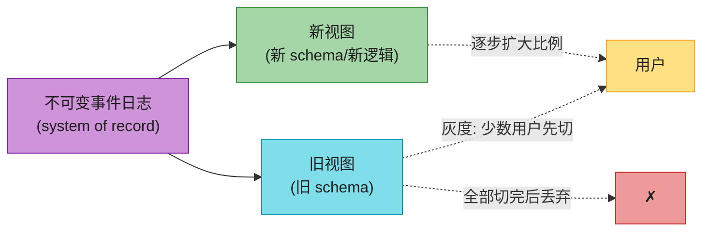

**渐进迁移的妙处**:每一步都**易回滚**(总有一个能用的旧系统兜底)——降低不可逆风险,让你敢于更快改进系统 [10]。Stripe 的 online migration [8]、Spotify 的事件投递迁移 [9] 都是这套。

### 统一批与流:Lambda → Kappa

早期统一批流的提案是 **Lambda 架构** [11](批 + 流分别跑,各有缺点 [12],已弃用)。现代系统让批计算(重处理历史)和流计算(处理新到事件)在**同一系统**实现 [13]——即 **Kappa 架构** [12]。统一需要三个特性:

| 要求 | 说明 |
|------|------|
| **能回放历史** | 同一处理引擎既能处理实时流,又能重放历史(log-based broker 可回放 / 流处理器能从 DFS 读) |
| **exactly-once** | 输出像没故障一样,要丢弃失败 task 的部分输出 |
| **按 event time 分窗** | 重处理历史时 processing time 无意义(第 12 章);Beam API 表达,Flink/Dataflow 执行 |

## 13.2 拆解数据库 (Unbundling the Database)

抽象层面,**数据库、批/流处理器、操作系统都在做同一件事**:存数据 + 处理/查询数据 [14][15]。数据库用记录(行/文档/图的顶点),OS 文件系统用文件——本质都是"信息管理"系统 [16]。第 11 章讲过,批处理器就像分布式版 Unix。

Unix 和关系数据库用了**截然不同的哲学**面对信息管理:

| | Unix | 关系数据库 |
|--|------|---------|
| **抽象层次** | 低层(硬件抽象:字节流、管道) | 高层(隐藏磁盘/并发/恢复细节) |
| **核心抽象** | 管道 + 文件(字节序列) | SQL + 事务 |
| **"简单"的含义** | 硬件的薄包装 | 一句声明式查询调用大量基础设施(优化/索引/并发/复制) |

这股张力持续了数十年(Unix 和关系模型都诞生于 1970 年代初)。**NoSQL 运动**可看作想把 Unix 式的低层抽象应用到分布式 OLTP。本节试图调和两者,取长补短。

### 组合数据存储技术

数据库内部有这些功能(本书前文都讨论过):**二级索引、物化视图、复制日志、全文索引**。第 11-12 章我们用批/流处理器做了**外部版**的同样事情(建搜索索引、维护物化视图、CDC 复制)。**数据库内置功能 与 派生数据系统 之间有平行关系**——这就是"拆解数据库"的起点。

#### 深入:CREATE INDEX ≈ 建新 follower ≈ CDC bootstrap

想清楚这点,理解全章:

> 在关系库里跑 `CREATE INDEX`,数据库要做:**①** 扫描表的一致快照;**②** 提取被索引字段;**③** 排序;**④** 写出索引;**⑤** 处理快照之后的写入积压(建索引时表没锁,写入继续);**⑥** 此后每次写都更新索引。

**这和"建新 follower 副本"(第 6 章)惊人相似**,也和"流式系统里启动 CDC"(第 12 章 initial snapshot)几乎一样。**每次 `CREATE INDEX`,数据库其实是在重处理已有数据集,把索引派生为新视图**。源数据可能是状态快照而非全历史日志,但两者紧密相关。

### 万物元数据库 (The Meta-Database of Everything)

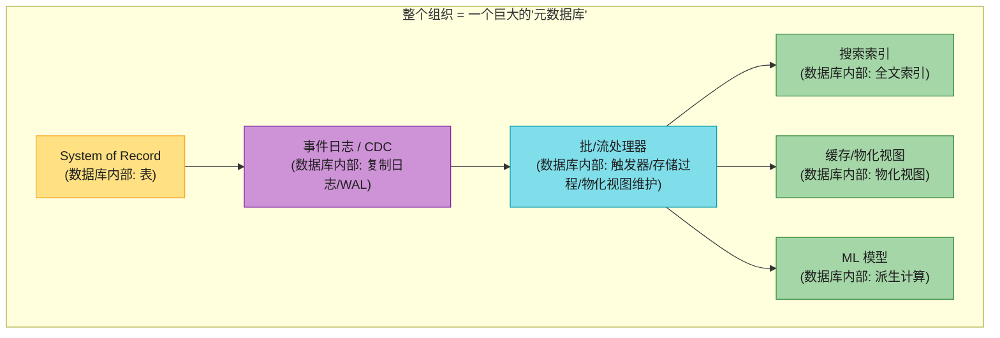

从这个视角,**整个组织的数据流看起来像一个巨型数据库** [5]。每个批/流/ETL 进程把数据从一处运到另一处,就像数据库内部维护索引/物化视图的子系统。批/流处理器 = 精巧版的触发器/存储过程/物化视图维护;派生数据系统 = 不同的索引类型(B-tree/哈希/空间索引…)。

**新兴的派生数据架构里**,这些设施不再是单个集成数据库产品的功能,而是**由不同团队、在不同机器上、用不同软件提供**。

### Federated(统一读) vs Unbundled(统一写)

如果承认没有单一数据模型/存储格式适合所有访问模式,那组合不同工具成连贯系统有两条路:

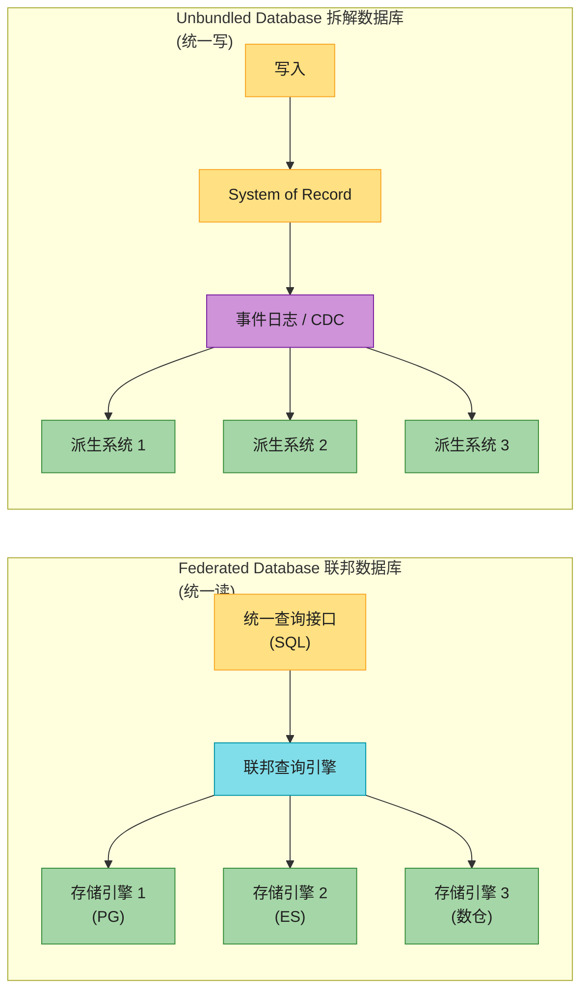

| | Federated(统一读) | Unbundled(统一写) |
|--|----------------|-----------------|
| **哲学** | 关系传统:单一集成系统 + 高层查询语言 | Unix 传统:小工具各做一件事,低层统一 API(管道)组合 [20] |
| **统一什么** | **只读查询**跨多存储 | **写入**跨多存储保持同步 |
| **实现** | 联邦查询引擎(Trino、PostgreSQL FDW、Hoptimator、Xorq) | CDC + 事件日志 + 幂等消费 |
| **难题** | 数据模型映射(可控) | **写同步**(更难) |

联邦只解决读,**没有写同步的好答案**。传统写同步要跨异构分布式事务(有问题)。**单个存储/流系统内部的事务可行;数据跨越技术边界时,异步事件日志 + 幂等写是更鲁棒、更可行的办法。**

#### 深入:让 Unbundling 生效(松耦合的两层)

基于日志集成的最大优势是**松耦合**,体现在两层:

| 层 | 好处 |
|---|------|
| **系统层** | 异步事件流让整体更抗个别组件故障/性能退化——消费者慢/挂,日志缓冲,生产者和其他消费者不受影响,故障被隔离。对比:分布式事务的同步交互**把局部故障升级成大规模失败** |
| **人层** | 不同团队可独立开发/改进/维护各组件,各专一事,接口清晰。事件日志足够强大(捕获强一致性:持久+有序),又足够通用(几乎任何数据都适用) |

> 📝 **名词注释:Unbundling(拆解)**<br>把数据库**内置**的功能(索引、物化视图、复制)**拆**成独立的外部组件,通过 CDC/事件日志松耦合地协同。这是把"数据库的内部智慧"提升到"整个应用/组织"层面。对应概念 **Federated**(联邦)是统一**读**;**Unbundled** 是统一**写**。

**Unbundled ≠ 取代数据库**:数据库仍不可少(流处理器状态、批/流输出查询)。Unbundling 的目标不是和单库比特定负载性能,而是**组合多个库覆盖单库做不到的更宽负载范围**——求**广度,非深度**。若单一技术够用,直接用那产品比从低层组件重造强 [21]。**为不需要的规模过度设计 = 浪费 + 锁死设计 = 过早优化。**

工具在变好:Debezium 提取多库变更流、Kafka 协议成事件流事实标准、IVM 引擎(Materialize/RisingWave)预计算复杂查询缓存。

### 围绕 Dataflow 设计应用

派生数据的"源数据变了就更新派生"思想不新——**电子表格**早就有 [22]:一个格子放公式(另一列求和),输入一变,结果自动重算。这正是我们要的数据系统级能力:**一条记录变了,它的所有索引、缓存视图、聚合自动刷新**。我们应该不用关心刷新的技术细节,只需相信它正确。

> 大多数数据系统仍要向 1979 年的 **VisiCalc** [23] 学。差别是今天的数据系统还要**容错、可扩展、持久**,还要集成不同人/不同时期写的异构技术。

#### 应用代码 = 派生函数

一个数据集从另一个派生时,经过某种**转换函数**:

| 派生数据 | 转换函数 |
|---------|---------|
| 二级索引 | 提取被索引列值 + 排序(B-tree/SSTable) |
| 全文索引 | 语言检测 → 分词 → 词干化 → 拼写纠正 → 同义词 → 倒排索引 |
| ML 模型 | 特征提取 + 统计分析(从训练数据派生) |
| 缓存 | 按要显示的 UI 形式聚合(UI 变了缓存定义要改、要重建) |

二级索引的派生函数太常用,内置进数据库(`CREATE INDEX`)。全文索引基础语言学也内置,高级功能要领域调优。ML 特征工程出了名地应用特定。**当派生函数不是标准套路,就要自定义代码**——这正是数据库的软肋(触发器/存储过程/UDF 是事后补丁)。

#### 深入:"Separation of Church and State"(Church 与 state 分离)笑话 ⭐

> 函数式编程社区爱开玩笑:**"We believe in the separation of Church and state"**(我们信仰 Church 与 state 的分离)[26]。
>
> (讲笑话就毁了,但还是解释下没人掉队:**Church** 指数学家 Alonzo Church,他创造了 lambda 演算(多数函数式语言的基础)。lambda 演算**没有可变状态**(没有可覆盖的变量),所以可以说"可变 state 与 Church 的工作是分离的"。)

这笑话点出的是现代 Web 应用的核心架构:**应用逻辑(Church)与持久状态(state)分离**——不在数据库里放应用逻辑,也不在应用里放持久状态 [25]。典型 Web 应用:无状态服务(任意请求路由到任意服务器,响应后忘掉一切)+ 数据库存状态。

**但数据库继承了可变数据的被动方式**:你只能**轮询**(反复查询)看变没变,不像电子表格能"订阅"变化(多数语言没有内置 observer 模式)。订阅变化才刚开始作为数据库特性出现(CDC,第 12 章)。

#### Dataflow:状态变化与应用代码的互动

用 dataflow 思考应用,要重新谈判**应用代码与状态管理**的关系——不再把数据库当被动变量被应用操作,而是**状态、状态变化、处理它们的代码三者协同**:一处状态变化,触发另一处的状态变化(CDC、actor 模型、触发器、IVM 都是这思想)。Unbundling 就是把它应用到主库之外的派生数据集(缓存、全文索引、ML、分析系统)——用流处理 + 消息系统实现。

维护派生数据需要日志型消息 broker 提供两点:**① 状态变化顺序重要**(多视图要同序处理才一致);**② 容错关键**(丢一条消息就让派生数据永久偏离源)。这两点要求苛刻,但比分布式事务**便宜得多、运维鲁棒得多**。现代流处理器能在规模上提供这些保证,且让**应用代码作为流算子**运行——像 Unix 工具用管道串联,流算子可组合成大型 dataflow 系统。

#### 深入:货币转换——微服务 vs Dataflow("最快的网络请求是不发网络请求")⭐

顾客用一种货币买、用另一种付,要知道当前汇率。两种实现 [27][29]:

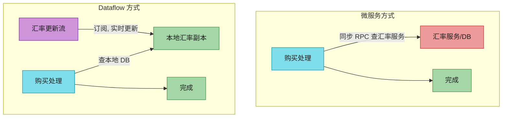

Dataflow 方式把"对另一服务的同步网络请求"换成"查本地 DB"(可能同机甚至同进程)。微服务里你也可以本地缓存汇率,但要保持新鲜就得**周期轮询或订阅变更流**——这正是 dataflow 方式。

**Dataflow 更快也更抗故障**:**最快最可靠的网络请求 = 不发网络请求**!原来 RPC 变成了"购买事件 JOIN 汇率更新事件"的流式 join(第 12 章)。注意这 join 是**时间依赖**的:重处理历史购买时汇率已变,要拿购买当时的汇率(第 12 章 SCD 问题)。订阅变更流而非查当前态,让我们更接近电子表格式的计算模型。

### 观察派生状态

dataflow 系统给你一个**创建派生数据集并保持更新**的过程——叫**写路径 (write path)**:信息写入后,经多级批/流处理,最终每个派生数据集都更新。但你建派生数据集是为了**之后查询**——这是**读路径 (read path)**:服务用户请求时,从派生数据集读,可能再处理一下,构造响应。

#### 深入:Write Path(eager)vs Read Path(lazy)⭐——本章最美的框架

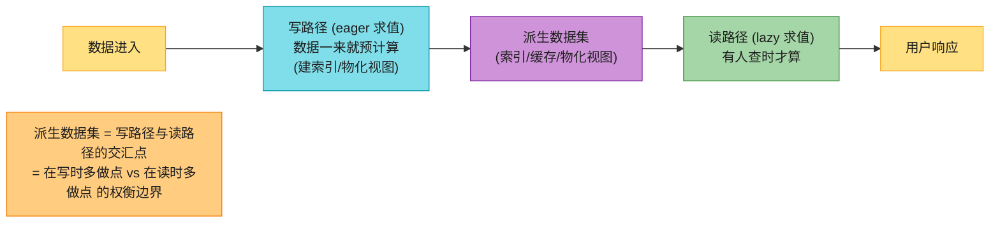

如果你熟悉函数式编程:**写路径像 eager evaluation(急切求值),读路径像 lazy evaluation(惰性求值)**。派生数据集是两者交汇点——它代表**写时多做 vs 读时多做**的权衡。

以全文搜索为例:
- **没索引** = 写路径零工作,读路径要 `grep` 扫所有文档(贵);
- **有索引** = 写路径更新所有词的索引项,读路径搜每个查询词 + 布尔逻辑;
- **预算所有可能查询的结果** = 写路径爆炸(查询空间无限),读路径零工作(直接返回);
- **缓存常见查询结果** = 折中(本质是物化视图,新文档出现时更新)。

> **索引、缓存、物化视图的本质:它们在移动读写路径的边界**——通过预计算,把读路径的工作挪到写路径。

这其实呼应了第 1 章社交网络时间线的案例(名人 vs 普通用户的读写边界画得不同)——500 页后我们**回到了原点**!

### 有状态、离线可用的客户端 (Local-First)

把"读写边界"换个语境:过去浏览器是无状态客户端(断网只能滚动已加载页面)。现在单页 JS 应用 + 移动 App 有大量**有状态**能力(客户端 UI 交互 + 持久本地存储)。

**第 5 章的 sync engine / local-first** [30] 让用户能**离线工作**,联网时后台同步。移动设备网络慢且不稳,UI 不必等同步请求、大多离线工作 = 巨大用户体验优势。

把设备上的状态看成**服务端状态的缓存**:屏幕像素 = 客户端 model 对象的物化视图;model 对象 = 远程数据中心状态的本地副本 [31]。

#### 把状态变化推到客户端

传统网页:数据变了,浏览器不知道(要重载)。浏览器只在某时刻读一次,假设静态——是**过时缓存**,除非显式轮询。HTTP feed(RSS)本质是轮询。

新协议超越请求/响应:**Server-Sent Events (EventSource) 和 WebSockets** 保持与服务器的开放 TCP,服务器能**主动推送**。在读写路径模型里,这等于**把写路径一路延伸到终端用户**——客户端初始化时用读路径拿初始状态,之后靠服务器推送的状态变化流。


即时通讯、在线游戏早就是这种"实时"架构(低延迟交互,不是响应时间保证)。**为什么不是所有应用都这样?** 因为"无状态客户端 + 请求/响应"深深植根于数据库/库/框架/协议——大多数据存储支持"请求返回单响应",很少支持"请求返回随时间的响应流"(订阅变化)。要延伸写路径到终端,得**根本性重思**这些系统,从请求/响应转向发布/订阅 dataflow [31]——费力,但能让 UI 更响应、离线支持更好。

### 读也是事件 (Reads Are Events Too)

迄今:写经事件日志,读是直达存储节点的瞬态网络请求。这是合理设计,但**不是唯一**。**读请求也可表示为事件流**,和写事件一起过流处理器——处理器把读结果发到输出流 [35]。

当读写都是事件、路由到同一流算子时,我们其实在**读查询流 JOIN 数据库**(stream-table join)。每个读事件要发到持有相关数据的分片(像 join 按 key copartition)。**"服务请求"和"做 join"的对应关系是根本性的** [36]:
- **一次性读** = 过 join 算子后立即忘掉请求;
- **订阅 (subscribe)** = 与另一侧过去和未来事件的**持久 join**。

记录读事件日志还有个好处:**追踪因果依赖和数据血统 (provenance)**——能重建"用户做某决策前看到了什么状态"(如电商里,预测发货日期和库存状态影响是否购买 [4])。代价是额外存储/I/O,是开放研究问题 [2]。但如果你本来就在记读请求日志(运维需要),让它成为请求源不是大改动。

### 多分片数据处理

单分片查询走流可能杀鸡用牛刀。但这思路开启了**跨多分片复杂查询的分布式执行**——复用流处理器已有的消息路由/分片/join 基础设施。Storm 的 distributed RPC 支持这模式(如计算社交网络上某 URL 被多少人看过 = 所有关注者集合的并集,跨分片) [37]。**反欺诈**也是:评估某笔交易是否欺诈,要查 IP/邮箱/账单地址/收货地址的信誉分,每个信誉库都分片 → 一系列与不同分片数据集的 join [38]。

数仓查询引擎内部执行图有类似特性。需要多分片 join 时,用现成数据库比用流处理器实现简单;但**把查询当流**,给了超大规模应用一个突破现成方案极限的选项。

## 13.3 追求正确性 (Aiming for Correctness)

无状态服务出问题好办:修 bug、重启,一切恢复。**有状态系统**(数据库)不是这么回事——它被设计成**永久记住**,所以一旦出错,影响也永久 [39]。这需要更谨慎的思考。

我们想要**可靠且正确**的应用(语义明确,即使面对各种故障)。约四十年来,**事务的原子性/隔离性/持久性**是构建正确应用的主力工具。但这根基比看起来弱:第 8 章弱隔离级别的混乱就是证据。有人主张"拥抱弱一致"换取可用性,却说不清那在实践中意味着什么。

更糟:判断"某应用用某隔离级别/复制配置是否安全"**极其困难** [40][41]。低并发无故障时看着对的方案,高要求下常有微妙 bug。Kyle Kingsbury 的 **Jepsen 实验** [42] 揭示了诸多产品**宣称的安全保证**与**网络故障/崩溃下的实际行为**之间的巨大鸿沟。即使基础设施没 bug,**应用代码要正确使用**这些特性——而弱隔离/quorum 配置难懂,容易用错。

如果你的应用能容忍偶发的数据损坏/丢失,生活会简单很多(祈祷就好)。要更强保证,**可串行化 + 原子提交**是成熟方案但有代价:通常只在单数据中心(排除跨地域),限制规模和容错。传统事务不会消失,但也不是正确性的终点。本节探索 dataflow 架构下的其他正确性思路。

### 数据库的端到端论证 (The End-to-End Argument)

> ⚠️ **应用用了强安全的数据系统(如可串行化事务),不等于保证不丢数据/不损坏**。应用有 bug 写错数据/删数据,可串行化救不了你——这论证了**不可变 + append-only** 的价值(去掉错误代码破坏好数据的能力)。

但光有不可变不够。看一个微妙的数据损坏例子。

#### Exactly-once 操作执行

第 8/12 章讲过 exactly-once(effectively-once):处理消息出问题时,放弃(丢消息)或重试;重试有风险——第一次其实成功了只是没收到确认 → 消息被处理两次。**处理两次是数据损坏**:重复收费、重复计数。最有效的办法是**让操作幂等**(执行一次或多次效果相同)。但非天然幂等的操作要费力——维护额外元数据(已处理的操作 ID 集合)+ failover 时 fencing(第 9 章)。

#### 重复抑制:TCP 只在单连接内

同样的重复抑制模式出现在很多地方。**TCP 用序列号**给包排序、检测丢包/重复,丢失重传、重复在交给应用前移除。**但这只在一个 TCP 连接内有效**。

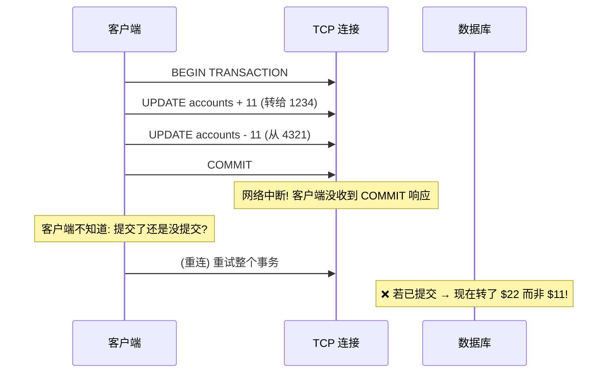

例 13-1 的转账**不幂等**,$11 可能变 $22。所以"事务原子性"的经典例子**其实不正确,真实银行不这样运作** [3]。

2PC 打破了"TCP 连接↔事务"的一一映射(协调者可重连告诉 DB 是提交还是中止 in-doubt 事务)。**但这够保证事务只执行一次吗?不够**——还要担心**终端用户设备与应用服务器之间**的网络:浏览器 HTTP POST 提交,弱蜂窝信号下发出去了但收不到响应 → 用户看到错误 → 手动重试 → 浏览器警告"确定再次提交?" → 用户点确定。从 web 服务器看是**新请求**,从数据库看是**新事务**——常规去重机制无能为力。

#### 深入:唯一标识请求——Example 13-2 端到端幂等 ⭐

要让请求经过多跳网络通信都幂等,**不能只靠数据库事务机制,要考虑端到端请求流**:

```sql
-- 例 13-2: 用唯一 ID 抑制重复请求
ALTER TABLE requests ADD UNIQUE (request_id);

BEGIN TRANSACTION;
INSERT INTO requests
  (request_id, from_account, to_account, amount)
  VALUES('0286FDB8-D7E1-423F-B40B-792B3608036C', 4321, 1234, 11.00);
UPDATE accounts SET balance = balance + 11.00 WHERE account_id = 1234;
UPDATE accounts SET balance = balance - 11.00 WHERE account_id = 4321;
COMMIT;
```

**机制**:
- 客户端为每个请求生成**唯一 ID(UUID)**,作为隐藏表单字段;或对所有表单字段算 hash 派生 request ID [3];
- 浏览器重复提交 POST → 两个请求**同 request ID**;
- request ID 一路传到数据库,靠 `requests` 表的**唯一约束**保证只执行一次——重复 INSERT 失败 → 事务中止 → 不会生效两次。

**关键**:关系库即使在弱隔离级别也能正确维护唯一约束(而应用层的 check-then-insert 在非可串行化下会失败,第 8 章写偏斜)。`requests` 表还兼作**事件日志**(event sourcing/CDC 用),账户余额更新不必和事件插入同事务——可由下游消费者从 request 事件派生(只要事件处理 exactly-once,又靠 request ID 保证)。

#### 端到端论证 (Saltzer/Reed/Clark 1984)

> *"The function in question can completely and correctly be implemented only with the knowledge and help of the application standing at the endpoints of the communication system."*
> ——所讨论的功能,只能凭借**通信系统端点的应用**的知识和帮助,才能完整正确地实现。把它作为通信系统自身的特性提供是不可能的。(有时通信系统提供的不完整版本可作为性能优化有用。)

在我们的例子里,这功能是**重复抑制**。TCP 在连接级抑制重复包,某些流处理器在消息处理级提供 "exactly-once",但这都**不够**阻止用户在第一次超时后重复提交请求。**单靠 TCP、数据库事务、流处理器,无法完全排除这些重复**——解决需要**端到端方案**:从终端用户客户端一路传到数据库的事务标识符。

端到端论证也适用于**数据完整性**:Ethernet/TCP/TLS 的校验和能检测网络包损坏,但检测不到两端软件 bug 或磁盘损坏。要抓住所有损坏源,需**端到端校验和**。加密同理:家里 WiFi 密码防偷听 WiFi,防不了互联网别处的攻击者;客户端-服务器 TLS 防网络攻击者,防不了服务器被入侵——只有**端到端加密认证**才能全防。

> ⚠️ **低层特性(TCP 去重、Ethernet 校验和、WiFi 加密)不能单独提供端到端特性,但仍有用**——降低高层出问题概率(HTTP 没 TCP 排序会经常乱)。只是要记住:**低层可靠性特性不足以保证端到端正确性。**

应用到数据系统:**应用用了强安全的数据系统(可串行化事务),不等于保证不丢数据/不损坏**——应用自己要采取端到端措施(如重复抑制)。可惜容错机制难做对,低层(TCP)工作良好所以高层故障少见,我们一直没找到把高层容错包装成好抽象的方法。事务是不错的抽象(把并发写/约束违反/崩溃/网络中断/磁盘故障收敛成 commit/abort 两结果),但还不够——尤其跨异构存储时太贵。拒绝分布式事务就要在应用代码里重造容错机制,而推理并发和部分失败**困难且反直觉**,大多应用级机制都不正确 → 丢数据/损坏。**值得探索既易用、性能/运维又好的应用级端到端正确性抽象。**

### 强制约束 (Enforcing Constraints)

端到端重复抑制靠 request ID 一路传到 DB。其他约束呢?聚焦**唯一性约束**(用户名/邮箱唯一、文件名唯一、航班座位唯一)。账户余额非负、库存不超卖、会议室不重叠也类似。

#### 唯一性需要共识

第 10 章讲过:**分布式下强制唯一性约束需要共识**——几个并发请求同值,系统要决定接受哪个、拒绝其余。最常见:单节点 leader 决定一切(只要不介意所有请求过单节点、节点不挂)。Raft 解决安全选主和防脑裂。

唯一性检查可**按需唯一值分片扩展**:按 request ID 分片、按用户名 hash 分片。但**异步多主复制出局**(不同 leader 可并发接受冲突写 → 不再唯一)。要立即拒绝违反约束的写,**同步协调不可避免** [45]。

#### 基于日志消息的唯一性

共享日志保证所有消费者看到同序消息(全序广播 = 共识,第 10 章)。Unbundled + 日志消息可用极相似的方式强制唯一性:

> **用户名抢占**:几个用户抢同一用户名。
> 1. 每个用户名请求编码成消息,追加到按用户名 hash 决定的分片;
> 2. 流处理器**单线程顺序**读该分片日志,用本地 DB 记录哪些用户名被占。每个可用用户名请求 → 记录占用 + 发"成功"到输出流;已占 → 发"拒绝";
> 3. 客户端 watch 输出流,等自己请求的成功/拒绝消息。

**这算法 = 第 10 章用共享日志实现共识**。增分片即可扩展吞吐(每分片独立处理)。不仅唯一性,**任何可能冲突的写都路由到同分片顺序处理**——冲突定义可应用自定义,流处理器用任意逻辑验证。

#### 深入:多分片请求处理——Figure 13-2 完整支付流 ⭐

跨多分片时,原子执行 + 满足约束变得有趣。例 13-2 涉及三分片:request ID、收款账户、付款账户——它们相互独立,没理由在同分片。传统 DB 要跨三分片**原子提交**→ 强制全序 → 跨分片协调 → 吞吐受损。

**用分片日志 + 流处理器,无需跨分片事务即可达到等价正确性** [47]:

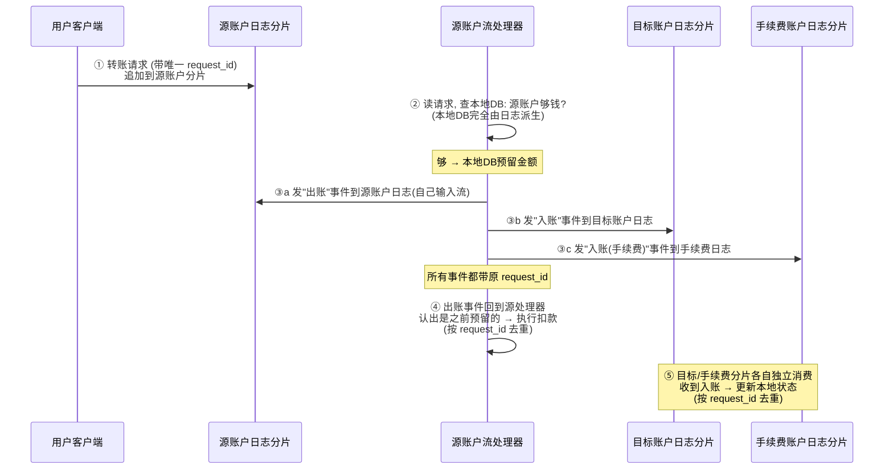

**精髓**:
- 每个账户的事件**严格按日志顺序、at-least-once 处理**,流处理器**确定性**;
- 源处理器崩溃 → 重处理同请求 → 因确定性做同样决定 → 发同样输出(带同 request_id)→ 下游按 request_id 去重忽略;
- **原子性不来自事务,而来自"写初始请求事件到源账户日志"这个原子动作**——一旦这事件进日志,所有下游事件终将出现(可能经崩溃恢复、可能重复,但终将出现);
- 有 exactly-once 更简单(崩溃重处理时本地状态也回滚)。

用户想知道转账是否批准?**订阅源账户日志分片**,等"出账"或"余额不足拒绝"事件。**把多分片事务拆成多个不同分片的阶段 + 端到端 request ID,无需原子提交协议,即使有故障也能达到"每个请求对付款方和收款方各恰好应用一次"的正确性。** 这是 Online Event Processing [47] 的核心。

### Timeliness vs Integrity ⭐⭐

事务系统有个方便特性:事务一提交,写入立即可见(**严格可串行化**,第 10 章)。Unbundling 跨多级流处理器不是这样——日志消费者**异步**,生产者不等消费者处理。

但客户端**可以**等消息出现在输出流(像用户等出账/拒绝事件)。注意:源账户余额检查的**正确性不依赖**用户是否等结果——等待只为**同步告知用户**支付是否成功,通知与请求处理的效果**解耦**。

更一般地,"一致性 (consistency)" 这个词**混淆了两个值得分开看的要求**:

| | Timeliness 时效性 | Integrity 完整性 |
|--|----------------|----------------|
| **含义** | 用户看到**最新**状态 | 数据**没丢、没损坏、没矛盾** |
| **违反后果** | 暂时看到旧值(烦人) | **永久数据损坏**(灾难性) |
| **修复** | 等一等重试就好(最终一致) | 需显式检查/修复/回滚 |
| **重要性** | 多数场景可容忍延迟 | 几乎所有场景都不能容忍损坏 |
| **实现代价** | 需同步协调(线性一致)→ 贵 | 可异步日志 + 幂等 → 便宜 |

> **口号**:违反 timeliness 在最终一致下允许;违反 integrity 导致永久不一致。

**信用卡账单例子**:24 小时内的交易还没出现 → 正常(银行异步清算,timeliness 不重要 [3]);但**账单余额 ≠ 交易之和 + 上期余额**(算错),或**扣了你的钱没付给商家**(钱消失)→ integrity 违反,灾难。

#### 深入:Dataflow 系统的正确性——解耦 timeliness/integrity ⭐

ACID 事务**同时**提供 timeliness(线性一致)和 integrity(原子提交)。从 ACID 视角,两者区别不大。

**事件 dataflow 系统的有趣特性:它解耦了 timeliness 和 integrity**。异步处理事件流**不保证 timeliness**(除非显式让消费者等消息到达再返回——用户可能请求支付后、流处理器执行前读账户,看不到刚请求的支付)。**但 integrity 恰恰是流系统的核心**——exactly-once/effectively-once 就是保 integrity 的机制(事件丢失或生效两次,integrity 被破坏)。容错消息投递 + 重复抑制(幂等)对在故障下保 integrity 至关重要。

可靠流处理**无需分布式事务/原子提交**就能保 integrity → 可比性正确性 + 更好性能/运维鲁棒性。我们靠四招组合实现 integrity:
1. **写操作内容表示为单条消息**(易原子写,契合 event sourcing);
2. **从该消息确定性派生所有其他状态更新**(类似存储过程);
3. **客户端 request ID 贯穿各级处理**(端到端重复抑制 + 幂等);
4. **消息不可变 + 派生数据可定期重处理**(易从 bug 恢复)。

### 宽松解释的约束

强制严格唯一性需要共识(把某分片所有事件过单节点)。stream 处理绕不过这限制。**但很多真实业务,允许违反"看似硬"的约束**:

| 场景 | 约束 | 违反后的补偿 |
|------|------|---------|
| **库存超卖** | 不能卖超库存 | 致歉 + 补货 + 折扣(反正叉车压坏货物也要这套) |
| **航班/酒店超售** | 一人一座 | 升舱/改签/赔偿(航空公司故意超售,预期有人误机) |
| **银行透支** | 余额 ≥ 0 | 透支费 + 限制每日取款(风险有界) |
| **跨组织数据** | 各方一致 | 结算/对账机制(银行间结算本就有不一致) |

> **"道歉比请求许可更容易"**(It's easier to ask forgiveness than permission)。如果违反约束的代价可控,**可以乐观先执行、事后检查补偿**——比同步检查所有约束(需分布式事务/共识)便宜得多。补偿成本(钱/声誉)往往很低:邮件发错了补发更正;信用卡重复扣款退一笔(代价=手续费 + 客诉);ATM 钱付出去了原则上要不回(可派催收)。

这些应用**仍需要 integrity**(不能丢预订、不能钱消失),但**不需要约束强制的 timeliness**——超卖了事后补救即可。这类似第 6 章"冲突写处理"。

#### 深入:Coordination-Avoiding Data Systems ⭐

两个观察合起来很有威力:
1. dataflow 系统**无需原子提交/线性一致/同步跨分片协调**就能在派生数据上保 integrity;
2. 虽然严格唯一性需要 timeliness + 协调,**很多应用能接受宽松约束(暂时违反、事后修复)**,只要全程保 integrity。

合起来:**dataflow 系统可为很多应用提供数据管理,无需协调,仍给强 integrity 保证** [45]。这种 **coordination-avoiding data system** 很有吸引力——比需同步协调的系统性能/容错更好。

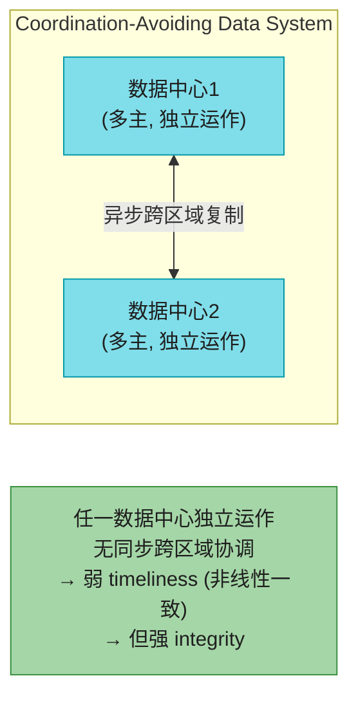

这种系统可跨多数据中心多主配置,区域间异步复制——任一数据中心独立运作(无需同步跨区域协调)。它 timeliness 弱(引入协调才能线性一致),但 **integrity 强**。可串行化事务仍可用于维护派生状态,但只在它工作良好的**小范围内** [6] 用;XA 类异构分布式事务不需要。需要的地方(从不可恢复的操作前)仍可引入同步协调,但不必让一切付协调代价 [32]。

> **换个角度看协调与约束**:它们**减少因不一致要道的歉**,但也**降低性能/可用性 → 增加因宕机要道的歉**。歉道不到零,但能找到"既没太多不一致、也没太多可用性问题"的甜点。

### Trust, but Verify(信任,但要核实)

至此讨论的正确性/integrity/容错都基于:**某些事可能出错,但另一些不会**——这是我们的**系统模型**(第 9 章)。假设进程会崩、机器断电、网络任意延迟/丢包;也假设 fsync 后磁盘数据不丢、内存数据不损坏、CPU 乘法永远正确。这些假设大多时候成立(否则啥也干不了),但传统系统模型对故障是**二元的**——某些会发生、某些永不发生。**现实是概率问题**:有些更可能、有些更少。问题是假设违反的频率是否高到实践中会遇到。

我们见过数据在内存(第 1 章硬件故障)、磁盘(第 6 章复制与持久)、网络(第 9 章"弱形式撒谎")都可能损坏。**足够大规模下,极不可能的事也会发生**。

#### 软件bug也会破坏完整性

硬件之外,总有**软件 bug** 风险——低层网络/内存/文件系统校验和抓不到。**连广泛使用的数据库都有 bug**:MySQL 过去版本未能正确维护唯一约束 [50];PostgreSQL 可串行化隔离曾出现写偏斜 [51]——而它们都是久经考验的成熟库。应用代码 bug 更多(应用没数据库那样的评审/测试),很多应用甚至没用对数据库保 integrity 的特性(外键/唯一约束)[25]。

ACID 的"一致性"假设事务无 bug:从一致态转到一致态。但若应用误用数据库(如不安全地用弱隔离),integrity 无法保证。

#### 不要盲信承诺——审计

硬件软件都不总能达到理想,数据损坏迟早发生。所以**至少要有办法发现数据是否损坏**,以便修复、追查源头。检查数据完整性 = **审计 (auditing)**。

> 📝 **名词注释:审计 (Auditing)**<br>不只金融应用需要审计(第 12 章讲过)。金融尤其重视审计,正因为**人人都知道会犯错,都承认要能检测和修复问题**。成熟系统同样会考虑极不可能的事出错的**风险**并管理它。

**HDFS 和 S3 不完全信任磁盘**——跑后台进程持续回读文件、与其他副本比对、在磁盘间搬文件,缓解静默损坏 [52][53]。**想确定数据还在,就得读它检查**——大多时候还在,但不在时你想**早发现**而非太晚(已丢数据)。同理要定期**试着从备份恢复**——否则可能备份早坏了,真出事才发现。**别盲信一切正常。**

目前不多系统有这种 "trust, but verify" 的持续自审计。未来可能出现更多**自验证/自审计系统**——持续检查自身完整性,而非盲信 [54]。

#### 为可审计性设计

事务改动多对象,事后难说**为什么**。即使抓事务日志,各表的增改删未必清晰反映**为什么做这些改动**——决定这些改动的应用逻辑是瞬态的、无法重现。

**事件系统能提供更好的可审计性**:event sourcing 里,用户输入表示为单一不可变事件,后续状态更新从它派生。派生可做成**确定性可重复**——同样事件日志过同样版本派生代码 → 同样状态更新。明确数据流让数据**血统 (provenance)** 清晰,integrity 检查更可行:
- 事件日志用 hash 检查存储没损坏;
- 派生状态重跑批/流处理器看是否同样结果,甚至并行跑冗余派生;
- 确定性数据流让调试/追踪"系统为什么做了某事"更容易 [4][55]——出意外时能**重现导致意外的精确情境**(time-travel debugging)。

#### 端到端论证(再次)

若不能完全信任每个组件(每片硬件无故障、每段软件无 bug),就要**至少周期性检查数据完整性**。不查的话,损坏到造成下游损害才发现,追查更难更贵。**检查数据系统完整性最好端到端做**——纳入检查的系统越多,损坏在某阶段蒙混过关的机会越少。能检查整条派生数据管道端到端正确,就隐含检查了沿途所有磁盘/网络/服务/算法。

持续端到端 integrity 检查给你对系统正确性的信心 → **让你敢于更快迭代** [56](像自动化测试,审计让 bug 更快被发现,降低改系统/换存储技术的风险)。不怕改,才能更好地让应用演化。

#### 深入:区块链、Merkle 树、证书透明度 ⭐

目前不多数据系统把可审计性当顶级关注。区块链(比特币/以太坊)= 带加密一致性检查的共享 append-only 日志;交易是事件,智能合约是流处理器;共识协议(第 10 章)保证所有节点同意同样事件序列。区别于第 10 章的是区块链**拜占庭容错**——节点数据损坏也能工作,因为副本互相持续检查完整性。**对大多应用,区块链开销太高;但它的密码学工具可在更轻量场景用:**

| 工具 | 用法 |
|------|------|
| **Merkle 树** [57] | 哈希的树,高效证明某记录在数据集中(及其他) |
| **证书透明度 (Certificate Transparency)** [58][59] | 加密验证的 append-only 日志 + Merkle 树,检查 TLS/SSL 证书有效性;靠每日志单主避开共识协议 |

这类完整性检查/审计算法未来可能在数据系统普及——还需工作让它们和无加密审计的系统一样可扩展、保持低性能损耗,但很有意思。

---

## 🏭 生产级产品速查表

| 类别 | 产品 | 在 Ch13 哲学里的角色 |
|------|------|------------------|
| **System of Record** | PostgreSQL/MySQL/Oracle/SQL Server | 数据源头,决定写入全序 |
| **事件日志/CDC** | **Kafka**、Pulsar、Redpanda、**Debezium** | "拆解"后的复制日志/WAL |
| **派生:搜索索引** | Elasticsearch、Algolia、Meilisearch | "拆解"后的二级/全文索引 |
| **派生:物化视图(IVM)** | **Materialize**、**RisingWave**、ClickHouse、Feldera | "拆解"后的物化视图维护 |
| **派生:缓存** | Redis、Memcached | 读写边界往写路径移 |
| **流处理器(派生函数)** | **Flink**、Spark Streaming、Kafka Streams、ksqlDB、Beam | "拆解"后的触发器/存储过程 |
| **联邦查询(统一读)** | **Trino**、PostgreSQL FDW、Hoptimator、Xorq、DuckDB | Federated database |
| **local-first / sync engine** | CRDT 库(Yjs/Automerge)、Replicache、ElectricSQL | 写路径延伸到终端 |
| **多区域 coordination-avoiding** | CockroachDB(可选一致性)、多主 DB | 弱 timeliness + 强 integrity |
| **可审计/加密日志** | Certificate Transparency、Merkle 树应用 | Trust but verify |

## 🎯 系统设计面试题

### 面试题1:解释 "Unbundling the Database" 是什么意思,它和微服务什么关系?

**参考答案**:**Unbundling** = 把数据库**内置**功能(二级索引、物化视图、复制日志、触发器)**拆**成独立外部组件,通过 CDC/事件日志松耦合协同——把数据库的内部智慧提升到整个应用层面。本质是"整个组织像一个巨型数据库":SoR=表、Kafka=复制日志、Flink=触发器/物化视图维护、ES=全文索引。和微服务的关系:unbundling 是**统一写**(CDC+日志让多存储同步),微服务通常**统一读**(各服务暴露 API);但 dataflow 思想让微服务也能异步消息通信(事件驱动微服务),比同步 RPC 更鲁棒("最快网络请求=不发网络请求")。**Federated 统一读,Unbundled 统一写,两者是同一枚硬币两面。**

### 面试题2:为什么 TCP 的去重和数据库事务不足以保证 exactly-once?怎么解决?

**参考答案**:**端到端论证**。TCP 只在**单连接**内去重——连接断了重连就是新连接,去重失效;数据库事务只在**单事务**内原子,客户端超时不知道是否提交。真实场景:用户 POST 提交,弱信号收不到响应,手动重试——浏览器/服务器/数据库都看作**新请求/新事务**,常规去重无能为力。**解决:端到端 request ID**——客户端为每个请求生成唯一 ID(UUID 或表单 hash),一路传到数据库,靠 `requests` 表的**唯一约束**保证只执行一次(重复 INSERT 失败→事务中止)。这是"端到端"而非"低层"的正确性保证。低层特性(TCP/事务)仍有用(降高出错率),但**不足以**保证端到端正确。

### 面试题3:Timeliness 和 Integrity 有什么区别?为什么这个区分重要?

**参考答案**:**Timeliness** = 用户看到最新状态(违反=暂时旧值,烦人可修复,靠同步协调保证,贵);**Integrity** = 数据没丢没损坏没矛盾(违反=永久损坏,灾难性,靠异步日志+幂等低成本保证)。ACID 事务同时提供两者(所以混在一起);**事件 dataflow 系统解耦了它们**——异步处理不保 timeliness,但 exactly-once/幂等保 integrity。重要性:① 大多应用 integrity 远比 timeliness 重要(信用卡晚 24 小时显示 OK,算错账不行);② 于是可用 coordination-avoiding 系统(弱 timeliness + 强 integrity)——多区域多主独立运作,性能/容错更好;③ 很多"硬约束"其实可宽松(库存超卖事后道歉),只要保 integrity——"道歉比请求许可更容易"。

### 面试题4:不用分布式事务,怎么实现跨多账户的原子转账?

**参考答案**:Figure 13-2 的 **Online Event Processing** [47]。把多分片事务拆成多个不同分片阶段 + 端到端 request ID:① 转账请求(带唯一 request_id)追加到**源账户分片**日志(这步原子);② 源账户流处理器单线程顺序读,查本地 DB(完全由日志派生)够不够钱,够则预留并发"出账"事件回源分片 +"入账"到目标分片 +"入账手续费"到手续费分片(都带 request_id);③ 出账事件回到源处理器,认出是预留的→执行扣款(按 request_id 去重);④ 目标/手续费分片各自消费入账事件更新状态(按 request_id 去重)。**原子性来自"写初始请求事件"这个原子动作**——一旦进日志,所有下游事件终将出现(可能重复但去重)。每个账户严格按日志序 at-least-once + 确定性处理 + request_id 去重 = 无需原子提交协议的正确性。

### 面试题5:write path 和 read path 是什么?缓存/索引/物化视图的本质是什么?

**参考答案**:**write path** = 数据进入时预计算的部分(eager 求值,建索引/物化视图);**read path** = 有人查时才算的部分(lazy 求值)。派生数据集是两者交汇点。**缓存/索引/物化视图的本质:它们在移动读写路径的边界**——通过预计算,把读路径的工作挪到写路径。没索引=写零工作、读要 grep 全扫;预算所有查询=写爆炸、读零工作;索引=折中。这是第 1 章社交时间线(名人 vs 普通用户读写边界不同)的理论框架。把写路径延伸到终端用户(WebSockets/SSE 推送)= local-first / 实时 UI;把读表示为事件流并和写一起 join = "读也是事件",服务请求 = stream-table join。

### 面试题6:怎么用"重处理已有数据"来安全地演化应用(如改 schema)?

**参考答案**:**铁路轨距类比**。把数据演化想成"改铁路轨距":不能停运数月硬切,而是先加第三根轨成**双轨距**(新旧并行),逐步迁移,最后拆旧轨。数据系统:把**新旧 schema 作为同一底层事件日志的两个独立派生视图**并行维护——先灰度切少量用户到新视图测性能/找 bug,逐步扩大比例,全部切完后丢旧视图。**每步易回滚**(总有旧系统兜底)→ 降低不可逆风险 → 敢于更快迭代。这需要:不可变事件日志(system of record)+ 确定性派生函数 + 可回放(Kafka)。Stripe 的 online migration、Spotify 事件投递迁移都是这套。

---

## 📝 本章要点总结

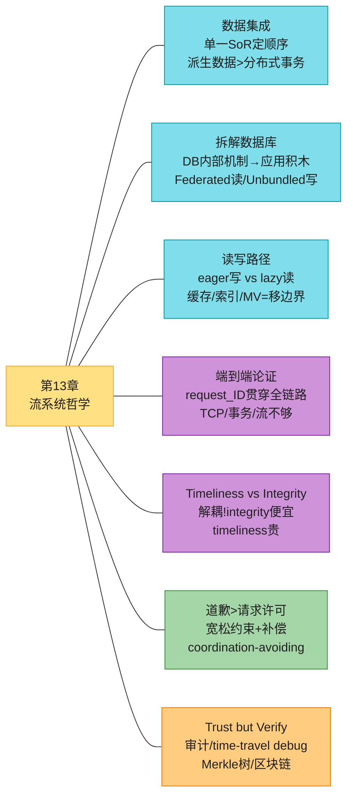

### 核心主线

```mermaid
flowchart LR
    PROB["问题: 单一工具<br/>满足不了所有需求"] --> INTEG["数据集成:<br/>单一SoR定全序"]
    INTEG --> DERIVE["派生数据 + CDC<br/>> 分布式事务"]
    DERIVE --> UNB["拆解数据库:<br/>DB内部→应用层"]
    UNB --> DFLOW["dataflow 应用:<br/>代码=派生函数"]
    DFLOW --> WR["write/read path<br/>移动边界"]
    WR --> CORR["追求正确性:<br/>端到端 + 解耦TI"]
    CORR --> CA["coordination-avoiding<br/>+ trust but verify"]

    style PROB fill:#FFE082,stroke:#F9A825,color:#1f1f1f
    style INTEG fill:#80DEEA,stroke:#0097A7,color:#1f1f1f
    style DERIVE fill:#80DEEA,stroke:#0097A7,color:#1f1f1f
    style UNB fill:#80DEEA,stroke:#0097A7,color:#1f1f1f
    style DFLOW fill:#80DEEA,stroke:#0097A7,color:#1f1f1f
    style WR fill:#80DEEA,stroke:#0097A7,color:#1f1f1f
    style CORR fill:#CE93D8,stroke:#7B1FA2,color:#1f1f1f
    style CA fill:#A5D6A7,stroke:#388E3C,color:#1f1f1f
```

### 十大 Takeaways

1. **没有单一工具能满足所有需求** → 必须组合多个软件。组合的钥匙是**数据集成**:单一 SoR 决定写入全序,CDC 派生其他表示。

2. **派生数据(CDC+日志)比分布式事务更实际**——XA 性能/容错差;日志+确定性+幂等更鲁棒,故障被局部隔离而非放大。

3. **全序有局限**——分片/跨区域/微服务/客户端状态都让全局全序不可得。要捕获因果,用逻辑时间戳或"记录决策前状态"。

4. **重处理已有数据是应用演化的利器**——铁路轨距类比:新旧视图并行,灰度切换,易回滚。Kappa 架构(批流统一)是其基础。

5. **拆解数据库**:数据库内部功能(索引/物化视图/复制/触发器)= 外部组件(ES/Materialize/Kafka/Flink)。整个组织像一个巨型数据库。

6. **Federated 统一读,Unbundled 统一写**——联邦查询引擎(Trino)统一读;CDC+事件日志统一写。写同步更难,靠异步日志+幂等。

7. **write path(eager)vs read path(lazy)**——缓存/索引/物化视图的本质是**移动读写边界**。把写路径延伸到终端=local-first 实时 UI。

8. **端到端论证**:TCP 去重/DB 事务/流 exactly-once 都**不够**——要 request ID 从客户端一路传到 DB 的端到端方案。低层特性有用但不足够。

9. **Timeliness vs Integrity 必须分开**——ACID 混淆两者;dataflow 解耦:integrity 便宜(异步+幂等),timeliness 贵(同步协调)。大多应用 integrity 远更重要 → coordination-avoiding 系统可行。

10. **道歉比请求许可更容易**——很多"硬约束"可宽松违反后补偿(库存超卖/航班超售),只要保 integrity。配合 **trust but verify**(审计/time-travel debug/加密日志)持续检查完整性。

### 连接下一章

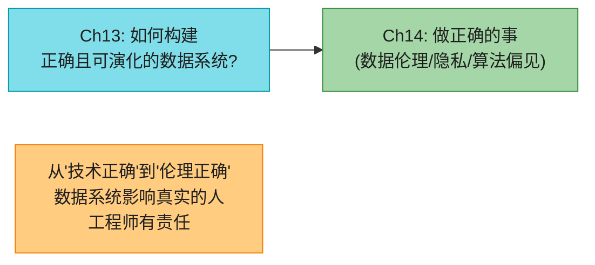

第 13 章讲的是**技术正确性**(数据不丢不损坏、系统可靠可演化)。但"正确"还有更深一层:**这些系统对真实的人有什么影响?** 我们建的监控/预测/推荐系统,决定着谁能贷款、能坐飞机、能看到什么信息。第 14 章从技术转向伦理——算法偏见、监控资本主义、隐私即权力、工程师的责任。技术不是中性工具,它塑造世界;**我们造它的人,要为它塑造出的世界负责。**
