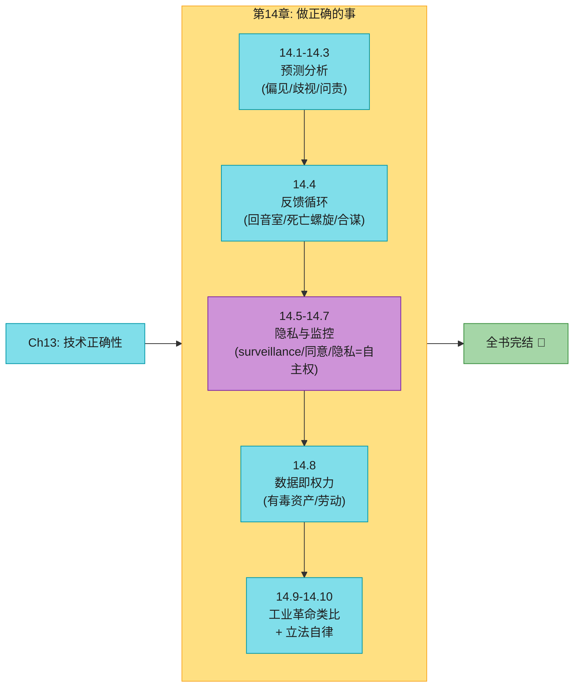
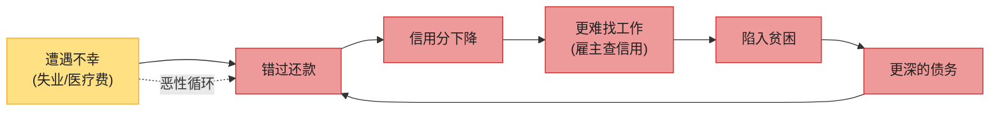
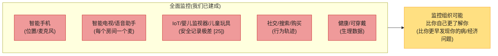
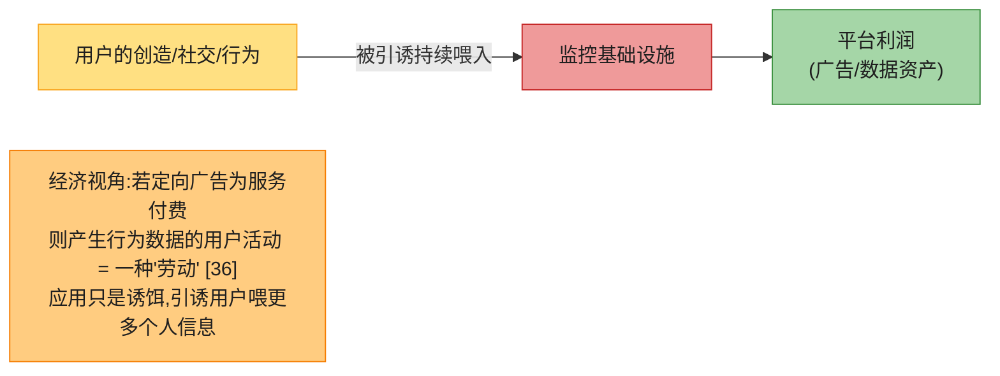
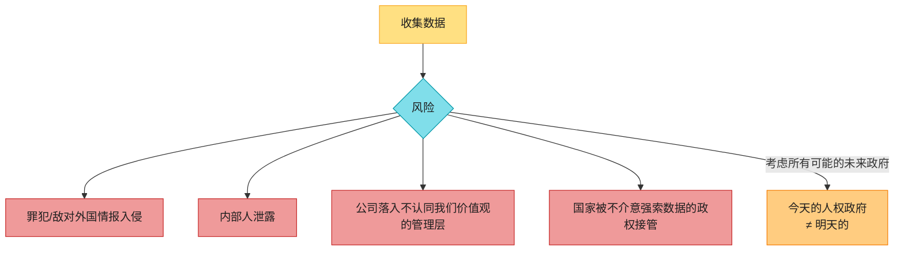
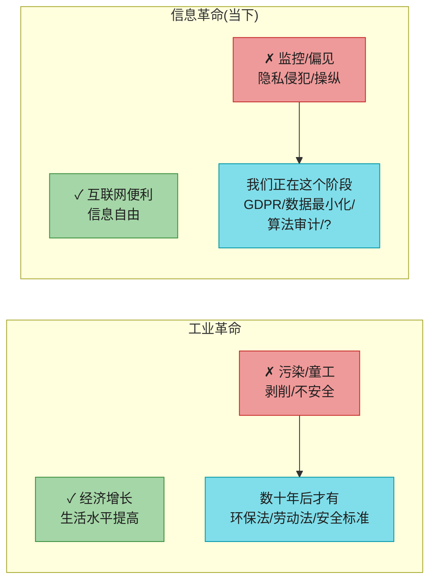
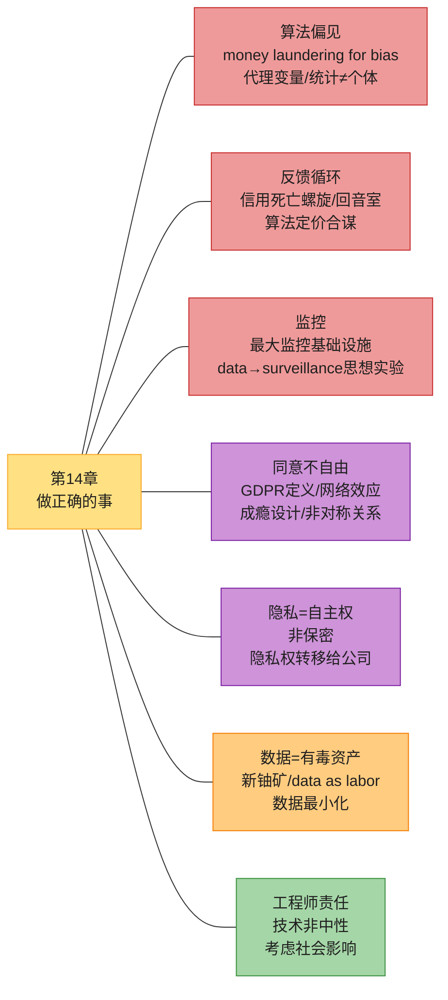
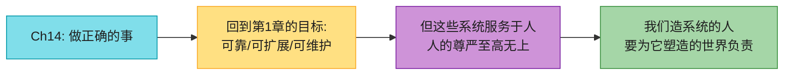
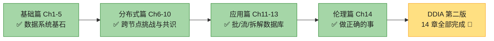

# 第14章：做正确的事 (Doing the Right Thing)

> *"Feeding AI systems on the world's beauty, ugliness, and cruelty, but expecting it to reflect only the beauty is a fantasy."*
> (用世界的美好、丑陋和残酷去喂养 AI,却指望它只反映美好——这是幻想。)
> — Vinay Uday Prabhu and Abeba Birhane, "Large Datasets: A Pyrrhic Win for Computer Vision?" (2020)

> 最后一章,跳出技术。前 13 章我们埋头钻研存储/复制/分片/事务/共识/批/流的**技术正确性**。但"正确"还有更深一层:**这些系统对真实的人有什么影响?** 我们建的预测系统决定谁能贷款、能坐飞机;推荐系统塑造几十亿人看到的信息;监控基础设施记录每个人的位置、社交、消费、健康。**技术不是中性工具,它塑造世界;造它的人,要为它塑造出的世界负责。**

---

## 📚 精选文献

| # | 文献 | 为什么值得读 |
|---|------|------------|
| [17] | Cathy O'Neil, *Weapons of Math Destruction* (2016) | **《数学杀伤性武器》**。前量化分析师揭露预测算法如何**加剧不平等、威胁民主**——信用评分、教师评估、犯罪预测中的真实灾难案例。本章"反馈循环""代理变量"的素材来源。 |
| [26] | Bruce Schneier, *Data and Goliath* (2015) | 安全专家写的数据监控全景。"数据是信息时代的污染问题"出自此书。讲清企业和政府的监控如何运作、如何危害。 |
| [30] | Shoshana Zuboff, *Big Other: Surveillance Capitalism* (2015) | **"监控资本主义"**概念提出者。论证行为数据提取如何把隐私权从个人转移到公司、用户行为如何沦为"劳动"、监控如何成新型权力。本章"非对称关系""隐私权转移"的根基。 |
| [15] | Maciej Cegłowski, *The Moral Economy of Tech* / *Haunted by Data* (2015-16) | "machine learning is like money laundering for bias"、"data 是有毒资产"等本章金句的来源。极其生动的科技伦理批判。 |
| [2] | ACM, *Code of Ethics and Professional Conduct* (2018) | 软件工程师的伦理准则。**很少被真正讨论、应用、执行**——这正是问题所在。 |

**延伸阅读**:algorithmic prison [10] · 算法定价合谋(德国加油站)[21] · 系统思维 [22] · "data"→"surveillance"思想实验 [23] · IoT 安全悲剧 [25] · data as labor [36] · GDPR 全文 [32]。

---

## 🗺️ 章节概览

### 本章为何重要

每个系统都为目的而建;我们的每个行动都有**预期和未预期**的后果。目的是赚钱也好,后果可能深远。**我们这些造系统的工程师,有责任仔细考量这些后果,确保决策不造成伤害。**

我们谈"数据"像谈抽象物,但记住:**很多数据集是关于人的**——他们的行为、兴趣、身份。必须用人性和尊重对待。**用户也是人,人的尊严至高无上** [1]。

软件开发越来越多地涉及**重要的伦理选择**。有指南(ACM 伦理准则 [2]),但**很少被真正讨论、应用、执行**——结果工程师和产品经理对隐私和负面后果常持**轻率态度** [3][4]。

> 📝 **名词注释:伦理不是 checklist**
> 与计算不同,伦理的核心概念**没有固定精确的含义**,需要解释(可能主观)[5]。什么算"好""坏"定义不清,计算专业圈缺乏严肃讨论 [6]。**推理伦理很难,但太重要不能忽视**。伦理不是过 checklist 确认合规;它是**参与的、迭代的反思过程**,与相关人对话,对结果负责 [7]。

技术本身无好坏——关键在**怎么用、影响谁**。搜索引擎如此,枪也是如此。伦理责任在我们,不能只盯技术忽略后果。

### 本章结构一览

| 小节 | 主题 | 关键概念 |
|------|------|---------|
| 14.1 | 预测分析 | algorithmic prison、信用分 vs ML 预测 |
| 14.2 | 偏见与歧视 | money laundering for bias、代理变量、统计≠个体 |
| 14.3 | 责任与问责 | 自动驾驶/算法拒贷谁负责、可解释性 |
| 14.4 | 反馈循环 | 信用死亡螺旋、回音室、算法定价合谋 |
| 14.5 | 监控 | surveillance 思想实验、最大监控基础设施 |
| 14.6 | 同意与选择 | GDPR 同意定义、网络效应、成瘾设计 |
| 14.7 | 隐私=自主权 | 不是保密、隐私权转移到公司 |
| 14.8 | 数据即权力 | data as labor、有毒资产、新铀矿 |
| 14.9-10 | 工业革命 + 立法 | 数据=污染、数据最小化、tragedy of commons |

## 14.1 预测分析的伦理困境

预测分析是大数据/AI 令人兴奋的主因,也充满伦理两难。

| 用数据预测... | 伦理问题 |
|------------|--------|
| 天气、疾病传播 | 无争议 ✅ |
| 罪犯是否会再犯、贷款是否违约、保险是否高额索赔 | **直接影响个人命运** ⚠️ |

后者直接作用于个人生活。支付网络想防欺诈、银行想避坏账、航空公司想防劫机、公司想避不靠谱员工——从他们角度,错失机会成本低,坏账/问题员工代价高,所以"宁可错杀"。但**随着算法决策普及,被(准确或错误地)标记为"有风险"的人,会遭遇大量"no"**——被系统性地排除在工作、航空、保险、租房、金融服务之外。这种对个人自由的极大限制,被称为 **"algorithmic prison"(算法监狱)** [10]。

> 📝 **名词注释:Algorithmic Prison(算法监狱)** 被算法(准确或错误地)标记为高风险的人,在生活的方方面面遭遇算法的"no"——拒贷、拒保、拒租、拒雇、禁飞……且**几乎无法申诉**。在尊重人权的国家,刑事司法**无罪推定**;而自动化系统却能**无任何罪证、系统性任意地**把人排除在社会参与之外,几乎没有申诉机会。

#### 深入:信用分 vs ML 预测("你过去怎样" vs "像你的人怎样")

信用评级机构是"收集数据做关于人的决策"的经典。信用分低让生活艰难,但至少它通常基于**本人实际借贷历史**的相关事实,记录有错可纠正(虽然机构通常不让你容易地纠正)。

**基于 ML 的评分算法则完全不同**——用**远更广的输入**且**远更不透明**,难理解某决策如何产生、是否被不公对待 [19]。本质区别:

| | 传统信用分 | ML 预测分析 |
|--|----------|----------|
| **问的问题** | "**你**过去表现怎样?" | "**像你这样的人**过去怎样?" |
| **本质** | 基于本人事实 | **刻板印象化**(stereotyping)——按住址等(种族/阶层的近邻代理)归类 |
| **出错时** | 记录有错可改 | **几乎无救济**——数据错→决策错→无法纠正 [17] |

## 14.2 偏见与歧视

> **"Machine learning is like money laundering for bias."**(机器学习像是偏见的洗钱)[15]

算法决策未必比人更好或更坏——人人有偏见,歧视性能制度化。有人希望基于数据(而非主观本能)决策能更公平,给传统系统里被忽视的人更好机会 [11]。但开发预测分析时,我们**不是用软件固化"何时说 yes/no"的规则**——而是**让规则本身从数据中推断**。而这些系统学到的模式是**不透明的**:即使数据表明相关,我们可能不知为什么。**若输入带系统性偏见,系统很可能学习并放大该偏见** [12]。

### 代理变量 (Proxy Variables)

很多国家的反歧视法禁止按受保护特征(种族/年龄/性别/性取向/残疾/信仰)差别对待。可以分析其他特征——**但如果它们与受保护特征相关呢?**

> 在种族隔离的社区,**邮编甚至 IP 地址都是种族的强预测器**。算法用邮编做特征 → 间接按种族歧视。

这么看,相信算法能拿带偏见的数据产出公正输出,荒谬得可笑 [13][14]。但这正是数据驱动决策支持者常暗含的态度——被讽刺为"**机器学习是偏见的洗钱**" [15]。

### 统计 ≠ 个体

预测分析只是**外推过去**;若过去是歧视性的,它就**编入并放大**歧视 [16]。而且数据多是**统计性**的:整体概率分布正确,**个体情况可能完全错**。

> 平均寿命 80 岁,不意味着你 80 岁那天会死。从均值和分布,**你说不清某个具体人能活多久**。同样,预测系统输出是概率的,**对个体可能完全错**。

### 预测过去 ≠ 改善未来

> 若想让未来比过去更好,需要**道德想象力 (moral imagination)**——这是只有人能提供的 [17]。**数据和模型应该是我们的工具,而非我们的主人。**

| 偏见问题 | 说明 |
|---------|------|
| **代理变量** | 反歧视法禁种族 → 邮编/IP 是种族强相关 → 算法间接歧视 |
| **统计≠个体** | 平均寿命 80 ≠ 你 80 岁死 → 预测对个体可能全错 |
| **预测过去≠改善未来** | 外推过去的歧视模式 → 未来也是歧视性的 |
| **不可解释** | ML 不透明 → 被拒者不知原因 → 无法申诉 |

## 14.3 责任与问责 (Responsibility and Accountability)

自动化决策引出**责任与问责**问题 [17]。

| | 人类决策 | 算法决策 |
|--|--------|--------|
| **可追责** | 决策者可被追究 | 谁负责?开发者?PM?CEO? |
| **可申诉** | 能解释原因 | ML 常无法解释"为什么拒绝" |
| **有道德感** | 能识别不公 | 算法无道德感,只优化目标函数 |

自动驾驶车出事故,谁负责?自动信用评分系统性歧视某种族/宗教,有救济吗?ML 决策受司法审查时,你能向法官解释算法怎么决策的吗?**人不能靠怪算法来逃避责任。**

> 对数据的盲目信仰不仅是妄想,还很危险。数据驱动决策普及后,我们要弄清:如何避免强化现有偏见、如何让算法可问责透明、出错时如何修复。还要弄清如何实现数据的正面潜力、防止它被用来伤害人——比如分析能揭示人的财务/社会特征,可用于**精准援助最需要的人**,也可被掠夺性商家用来**识别脆弱人群推销高风险产品**(高息贷款、无价值学历)[17][20]。

## 14.4 反馈循环 (Feedback Loops)

即使对个人影响没那么立竿见影的预测应用(如推荐系统),也有棘手问题。服务擅长预测用户想看什么时,可能**只给用户看他们已认同的观点** → **回音室 (echo chambers)**——刻板印象、错误信息、两极化的温床。社交媒体回音室对选举的影响我们已看到。

当预测分析影响人的生活,**自我强化的反馈循环**尤其有害:

#### 深入:信用评分的死亡螺旋 ⭐

雇主用信用分评估求职者:你本来是个信用分不错的好员工,突遭不可控不幸 → 错过账单 → 信用分下降 → 更难找工作 → 失业推向贫困 → 分数更差 → 更难就业 [17]。**这是恶性循环,源头是有毒的假设,躲在数学严谨和数据的伪装后。**

#### 深入:算法定价合谋(德国加油站)⭐

反馈循环的另一个例子:经济学家发现,德国加油站引入**算法定价**后,**竞争减少、消费者价格上涨**——因为算法**学会了合谋** [21](不需要人类密谋,算法各自优化却发现"涨价对方也涨"是最优策略)。**我们无法总是预测反馈循环何时出现。**

### 系统思维 (Systems Thinking)

很多后果可以通过**思考整个系统**(不只是计算机化的部分,还有与之互动的人)来预测——这叫**系统思维** [22]。试着理解数据分析系统如何响应不同行为/结构/特征:**它是在强化和放大人与人之间现有差异(让富的更富、穷的更穷),还是在努力对抗不公?** 即便出于好意,也要警惕**未预期后果**。

> **推荐系统的回音室**:算法预测"用户想看什么" → 只推已有观点 → 用户更极端 → 算法学到"用户喜欢极端" → 推更多极端 → **偏见的正反馈循环**。

## 14.5 隐私与监控 (Privacy and Tracking)

除预测分析(用数据做关于人的自动决策)的伦理问题,**数据收集本身**也有伦理问题:收集数据的组织与被收集数据的人,是什么关系?

### 服务关系 vs 监控关系

| | 服务关系 | 监控关系 |
|--|--------|--------|
| **数据来源** | 用户**显式输入**(想让系统存/处理) | 用户行为的**副产品**(做别的事时被记录) |
| **谁是客户** | **用户** | **广告商**(若靠广告盈利) |
| **系统目的** | 为用户服务 | 有了**自己的利益**,可能与用户冲突 |

当系统只存用户显式输入,它在为用户服务。但当用户行为被作为**副作用**跟踪记录,关系就模糊了——系统不再只做用户让做的事,它**有了自己的利益**。广告资助的服务里,**广告商才是真客户,用户利益退居其次**——跟踪更详细、分析更深远、数据保留更久,为给每人建详细营销画像。这时关系可以用一个更阴险的词描述:**监控 (surveillance)**。

### 思想实验:把 "data" 换成 "surveillance" ⭐

> 试试把"data"换成"surveillance",看常见话术还那么好听吗 [23]:
>
> *"In our **surveillance**-driven organization we collect real-time **surveillance** streams and store them in our **surveillance** warehouse. Our **surveillance** scientists use advanced analytics and **surveillance** processing to derive new insights."*
>
> (在我们**监控**驱动的组织里,我们收集实时**监控**流,存入**监控**仓库。我们的**监控**科学家用高级分析和**监控**处理来得出新洞见。)

这个思想实验对本书来说异常尖锐(Kleppmann 自嘲本书该叫《*Designing Surveillance-Intensive Applications*》),但**需要强烈的措辞来强调这点**。在软件"吃掉世界" [24] 的过程中,**我们建了人类历史上最大的监控基础设施**。

我们正快速接近一个**每个有人居住的空间都至少有一个联网麦克风**的世界(智能手机、智能电视、语音助手、婴儿监视器、云端语音识别的儿童玩具),其中很多安全记录糟糕 [25]。**新的是数字化让大规模收集人的数据变得容易**——位置、社交、消费、健康数据的监控几乎不可避免。**监控组织最终可能比本人更了解本人**(如在人意识到前发现其疾病或经济问题)。

> **历史上最极权的政权也只能幻想在每个房间放麦克风、强迫每人随身携带追踪设备。** 而我们因为数字技术的好处太大,**自愿接受这种全面监控**——差别只是数据由企业收集(提供服务)而非政府(寻求控制)[26]。

### "我没什么要隐藏的"

为什么我们看似乐于接受企业监控?也许你觉得**没什么要隐藏**——即你完全顺应当前权力结构,不是边缘化少数,不怕迫害 [27]。**但不是每个人都这么幸运。** 或者目的看似良性——不是公然胁迫,只是更好的推荐和更个性化的营销。但结合上节的预测分析,这区别就没那么清楚了。

我们已经看到:**无司机同意的汽车驾驶行为跟踪影响保险费率** [28];**健康保险覆盖取决于是否戴健身追踪器**;**智能手表/手环的运动传感器能相当准确地推断你在打什么字(如密码)** [29]。传感器精度和分析算法只会越来越好。

## 14.6 同意与选择自由 (Consent and Freedom of Choice)

我们或许主张:用户**自愿选择**用跟踪活动的服务,同意服务条款和隐私政策,同意数据收集。甚至声称用户用数据换宝贵服务,跟踪是提供服务所必需。**社交网络、搜索引擎等免费服务确实有价值——但这论证有问题。**

### 跟踪是否真有必要?

| 跟踪类型 | 是否真为用户? |
|---------|------------|
| 搜索结果点击率 → 改进排名相关性 | ✅ 直接服务用户 |
| 买过 X 的人也买 Y → 相关商品推荐 | ✅ 直接服务用户 |
| 内容推荐追踪 / 广告用户画像 | ⚠️ 不清楚是否真为用户利益——**只是因为广告付钱?** |

### 用户无法做有意义的同意

大多用户**几乎不知道**自己喂进数据库什么数据、如何保留处理——**大多隐私政策更多是混淆而非照亮**。不理解数据去向,**用户无法做有意义的同意**。而且一个用户的数据往往也**说了关于其他非用户的事**(他们没同意任何条款)。前几章讲的派生数据集(全用户行为 + 外部数据源)正是用户**无法有意义理解**的数据。

> 📝 **名词注释:GDPR 对"同意"的定义** 欧盟 GDPR 规定同意必须**"自由给出、具体、知情、明确"**,且用户必须能**"无损害地拒绝或撤回同意"**——否则不算"自由给出"。同意请求必须**"易懂、易获取、清晰平实的语言"**;"沉默、预勾选框、不行动**不构成**同意" [32]。同意之外,GDPR 还有其他法律基础(履约/救人命/合法利益如反欺诈 [33]),但同意是互联网服务最常用的基础。

### 非对称的单向关系

数据从用户**单向提取**,没有真正互惠或公平价值交换。**没有对话、没有让用户谈判"提供多少数据换什么服务"的选项。** 服务与用户的关系**非对称、单向**——条款由服务定,不是用户 [30][31]。

你或许争辩:不同意的用户可以不用。**但这选择不自由**——如果某服务流行到"被大多数人视为基本社会参与所必需" [30],就不能合理期待人们弃用,使用实质上是**强制**的。西方社会带智能手机、用社交网络社交、用 Google 找信息已成常态。**尤其当服务有网络效应**,弃用有社会成本。

弃用因为用户追踪政策的服务,**说起来容易做起来难**。这些平台专门为**吸引用户**设计,很多用**游戏机制和赌博常见策略**让用户不断回来 [34]。即使过了这关,弃用也只对**少数有时间和知识读懂隐私政策、能承担错过社交/职业机会代价的特权人群**是选项。**对不那么特权的人,没有有意义的选择自由——监控无可逃避。**

## 14.7 隐私 ≠ 保密 (Privacy and Use of Data)

有时人们以"有些用户愿在社交媒体公开一切"为由说"**隐私已死**"。**这是错的,基于对"隐私"的误解。**

> 📝 **名词注释:隐私 = 自主选择权(不是保密)** 有隐私**不等于**把一切保密;它意味着**自由选择向谁透露什么、公开什么、保密什么**。隐私权是一种**决定权**:让每个人决定在每种情境下,想在"保密—透明"光谱上的哪个位置 [30]。它是人的自由和自主的重要方面。

例:患罕见病的人可能很乐意把私人医疗数据给研究者(若有助于治疗开发),但**必须有选择权**决定谁能访问、为何目的——若这些信息妨碍医保或就业,他会谨慎得多。

### 隐私权从个人转移到公司

当数据通过监控基础设施从人提取,**隐私权未必被侵蚀,而是被转移给了数据收集者**。获得数据的公司本质在说"**信任我们正确使用你的数据**"——决定透露什么、保密什么的权利,**从个人转移到了公司**。

公司反过来选择**对监控结果大多保密**——公开会被觉得毛骨悚然(creepy)、损害商业模式(依赖比别人更了解人)。关于用户的私密信息只**间接**透露——如"给特定人群(如患某病者)定向投广告的工具"。即使特定用户无法从广告目标人群被重新识别,**他们已失去了对某些私密信息披露的自主权**——不是用户基于个人偏好决定透露什么,而是公司以利润最大化为目标行使隐私权。

> **公司想避免被觉得 creepy,于是回避"数据收集到底多侵入"的问题,转而管理用户感知。** 而感知管理也常做得很差——比如某事事实正确,但触发痛苦记忆,用户不想被提醒 [35]。**对任何数据,都要预期它可能错、不合意或不适当,要建处理这些失败的机制。**"不合意""不适当"靠人的判断;算法对这些无感,除非我们显式编程让它尊重人的需求。**作为这些系统的工程师,我们要谦逊,接受并规划这些失败。**

隐私设置(让用户控制其他用户能看到数据的哪些方面)是把一些控制权还给用户的起点。但**无论设置如何,服务本身对数据有无限制访问,可在隐私政策允许范围内任意用**——即使承诺不卖数据给第三方,通常也给自己无限制的内部处理分析权,远超用户可见。

> **这种大规模隐私权从个人到企业的转移,在历史上前所未有** [30]。监控一直存在,但过去昂贵且手工;信任关系一直存在(医患、律师-被告),但数据使用受伦理/法律/监管严格约束。互联网服务让大规模积累敏感信息(无有意义同意)并大规模使用(用户不理解私人数据遭遇什么)变得太容易。

## 14.8 数据即资产与权力 (Data as Assets and Power)

行为数据是用户与服务交互的副产品,有时叫 **"data exhaust"(数据尾气)**——暗示是无价值废料。这样看,行为/预测分析就是把 otherwise 丢弃的数据回收提取价值。**但反过来更准确**:

### Data as Labor(数据即劳动)

从经济视角,若定向广告为服务付费,则产生行为数据的用户活动可看作**一种劳动** [36]。更激进地:**用户交互的应用只是引诱用户喂越来越多个人信息进监控基础设施的手段** [30]。在线服务中表达的**人类创造力和社交关系,被数据提取机器犬儒地剥削**。

### Data Brokers 与"眼球"估值

个人数据是宝贵资产——**数据经纪人**(data brokers)秘密运作,购买、聚合、分析、转售个人数据(多为营销)[20]。**创业公司按用户数("eyeballs"眼球)估值——即按监控能力估值。**

### 数据是有毒资产(新铀矿)⭐

#### 深入:数据是有毒资产 / 新铀矿

因为数据有价值,很多人想要:公司(本就为此收集)、政府(秘密交易/胁迫/法律强制/偷窃 [37])。公司破产时,收集的个人数据是被卖的资产之一。而数据**难保密**,泄露频繁。这些观察让批评者说:数据不只是资产,而是 **"toxic asset"(有毒资产)** [37] 或至少 **"hazardous material"(危险品)** [38]。也许数据不是新黄金/新石油,而是 **新铀矿** [39]——即使我们自认能防止滥用,**只要收集,就要权衡好处与落入坏人之手的风险**。

收数据时要考虑**不只是今天的政治环境,而是所有可能的未来政府**。无法保证未来每个政府都尊重人权和公民自由。Bruce Schneier 警告:**"安装有朝一日可能便利警察国家的技术,是糟糕的公民卫生"** [40]。

### 知识即权力

"知识即权力",更进一步:**"审视他人而避免被审视,是最重要的权力形式之一"** [41]。这就是极权政府要监控的原因——给人控制人口的权力。今天的技术公司虽不公然寻求政治权力,但它们积累的数据和知识(多秘密积累、在公共监督之外)仍给了它们对我们生活的巨大权力 [42]。

## 14.9 记住工业革命 (Remembering the Industrial Revolution)

数据是信息时代的决定性特征。互联网、数据存储处理、软件驱动的自动化对全球经济和人类社会影响深远——让人想起**工业革命** [17][26]。

工业革命靠重大技术和农业进步,带来持续经济增长和生活水平显著提高——**但也有重大问题**:空气污染(烟/化学)、水污染(工业/人类废物);工厂主奢华生活,城市工人挤在不卫生的住房、长时间恶劣条件下工作;**童工普遍**,包括矿里危险低薪的工作。

**花了很长时间才建立保障**:环保法规、工作场所安全规程、禁止童工法、食品卫生检查。无疑,工厂不再被允许往河里排污、卖变质食品、剥削工人后,**经商成本上升了**。但整个社会从这些法规受益巨大,没人想回到从前 [17]。

### 数据是信息时代的污染(Bruce Schneier)

正如工业革命有需管理的阴暗面,我们向信息时代的转型也有需面对和解决的重大问题 [43][44]。数据收集使用就是其中之一。Bruce Schneier [26]:

> *"Data is the pollution problem of the information age, and protecting privacy is the environmental challenge."*
> (数据是信息时代的污染问题,保护隐私是环保挑战。)几乎所有计算机都产生信息,它留下来发酵。我们如何处理它——如何遏制、如何处置——是信息经济健康的核心。
>
> *正如我们今天回顾工业时代早期,纳闷祖先在建工业世界时怎能忽视污染,我们的孙辈会回顾我们这些信息时代早期,评判我们如何应对数据收集和滥用的挑战。*
>
> **我们应该努力让他们骄傲。**

## 14.10 立法与自律 (Legislation and Self-Regulation)

数据保护法或许能帮保留个人权利。如 **GDPR** 规定个人数据必须**"为明确、具体、合法目的收集,不得以不相容方式进一步处理"**,且**"相对于处理目的,应充分、相关、限于必要"** [32]。

### 数据最小化 vs 大数据哲学 ⭐

> 📝 **名词注释:数据最小化 (Data Minimization)**
> GDPR 的核心原则:只收集**必要**的数据,目的明确,不能无限期保留。**这直接违背大数据哲学**——后者是**最大化收集**,与其它数据集组合,实验探索产生新洞见。探索 = 为 unforeseen 目的用数据,正是 GDPR 所说"明确目的"的**反面**。

| | 数据最小化(GDPR) | 大数据哲学 |
|--|----------------|----------|
| **收集量** | 限于必要 | 最大化收集 |
| **目的** | 收集时明确 | 收集后探索 unforeseen 用途 |
| **保留** | 不再需要即删除 | 永久保留挖掘价值 |

GDPR 对在线广告业有些影响 [45],但**执行薄弱** [46],似乎没带来科技业广泛的文化和做法转变。

### 反对监管 vs 过度监管

收集大量个人数据的公司普遍**反对监管**,称其为负担和创新阻碍。某种程度上这反对有道理:如**共享医疗数据有明显隐私风险,也有巨大潜力**——数据分析若能帮更好诊断或找到更好治疗,能预防多少死亡 [47]?**过度监管可能阻碍这类突破。** 平衡机会与风险很难 [41]。

### 需要文化转变

根本上,科技业对个人数据需要**文化转变**:
- **停止把用户当待优化的指标**,记住他们是有尊严、值得尊重和自主权的人;
- **自律**数据收集和处理,建立并维护依赖我们软件的人的信任 [48];
- **主动教育终端用户**他们的数据如何被使用,而非让他们蒙在鼓里。

> 每个人维持隐私(对自己数据的控制)的权利,像国家公园的自然环境:**如果不显式保护和照料,它会被破坏。这会是 tragedy of the commons(公地悲剧),我们所有人都会更糟。无处不在的监控不是不可避免的。我们仍能阻止它。**

#### 深入:Data You Don't Have Can't Be Leaked(你没有的数据不会被泄露)⭐

作为第一步:**不要永久保留数据,不再需要就尽快清除,并从一开始就最小化收集** [48][49]。

> **你没有的数据,无法被泄露、被偷、被政府强索。** ——这是数据最小化最实际的论据。

第 12 章的 **crypto-shredding**(加密数据,删密钥=等效删除)是相关技术。但根本原则是:**少收、少留**。这与"收集一切再探索"的大数据本能相反,但符合隐私和长期安全。

### 工程师的责任

作为技术从业者,**如果不考虑工作的社会影响,我们就没有做好本职工作** [50]。Jez Humble 说:人们进技术圈是为了"改变世界"——那么你就**必须**实际考虑你的工作对世界的影响。认为技术可以或应该排除社会和政治讨论,是愚蠢的,意味着你没在做你的工作。

> 技术不是中性工具——搜索引擎如此,枪也如此。**伦理责任在我们,不能只盯技术忽略后果。**

---

## 🎯 伦理思考题

伦理没有标准答案,以下问题供反思讨论(面试中也可能以"你怎么看 X"的形式出现):

### 思考题1:你负责一个推荐系统,发现它制造回音室。你会怎么做?

**思考方向**(非标准答案):
- **衡量**:先量化回音室程度(用户观点多样性指标),监控反馈循环;
- **干预**:在目标函数中加入"多样性"权重(不只优化点击率),或定期注入异质内容;
- **透明**:给用户控制权(可调"探索 vs 熟悉"滑块),告知推荐逻辑;
- **边界**:承认算法有局限,某些决策(如政治内容)可能需人工治理;
- **根本**:回音室是商业模型(注意力经济)的产物,彻底解可能需改变激励——这超出工程师职权,但要向上反馈。

### 思考题2:公司要用用户行为数据训练一个可能歧视的模型。你作为工程师怎么办?

**思考方向**:
- **了解**:数据是否带历史偏见?用代理变量(邮编等)间接歧视?
- **审计**:建立模型公平性评估(跨人群的假阳/假阴率),持续监控;
- **减缓**:重采样/重加权/对抗去偏见;但承认无法完全消除;
- **可解释**:用可解释模型或事后解释(SHAP),让人能申诉;
- **人的监督**:高风险决策(贷款/司法)保留人工复核和申诉通道;
- **说不**:若公司拒绝审计/减缓,且后果严重——这是良知问题,可能需拒绝参与/举报。ACM 伦理准则支持。

### 思考题3:解释 "data is a toxic asset"。这怎么影响系统设计?

**思考答案**:数据有价值(资产)但一旦泄露/被滥用后果不可逆且无法挽回(有毒)——像铀矿,不像石油。**影响设计**:
- **数据最小化**:只收必要的,从根本上降低风险("你没有的数据不会被泄露");
- **短期保留 + 自动清除**:设 TTL,不再需要即删;
- **加密 + crypto-shredding**:删密钥=等效删除(应对 GDPR);
- **差分隐私 / 聚合**:分析时避免暴露个体;
- **访问控制 + 审计日志**:谁访问了什么;
- **本地优先 / 端到端加密**:数据留在用户设备,服务端拿不到明文;
- **架构选择**:不建"中央数据湖存一切",而是按用途隔离、最小化中心化。

### 思考题4:为什么"我没什么要隐藏的"是错的论证?

**思考答案**:① **不是为你**:你顺应当前权力结构、非边缘群体,但 marginalized 群体有,他们要隐藏;② **政权会变**:今天的人权政府不保证明天也是——收集的数据可能被未来敌对政权用来迫害(Schneier:"安装可能便利警察国家的技术是糟糕的公民卫生");③ **数据二次使用**:今天无害的数据,与未来其他数据集组合可能有害(派生数据集正是用户无法理解的);④ **非对称**:你"没什么要隐藏",但公司对自己的分析结果严格保密——隐私权转移了,你失去了对自己数据的控制;⑤ **网络效应**:弃用服务有社会成本,不是真正的自由选择。

---

## 📝 本章要点总结

### 八大 Takeaways

1. **算法不是中立的**——训练数据有偏见 → 算法学习并放大偏见 → 代理变量(邮编≈种族)绕过反歧视法 → "machine learning is like money laundering for bias"。

2. **algorithmic prison**——被算法标记为高风险的人,在生活方方面面遭遇"no"(拒贷/拒保/禁飞/拒雇),几乎无法申诉。无罪推定不适用于算法。

3. **反馈循环可以毁掉人生**——信用分下降→找不到工作→还不了债→信用更差(死亡螺旋);推荐算法→回音室→两极化;算法定价→学会合谋→消费者受损。

4. **我们建造了史上最大的监控基础设施**——智能手机/IoT/社交网络。把"data"换成"surveillance",话术就现原形。历史最极权政权也只能幻想这种监控,我们却自愿接受。

5. **同意不是自由的**——隐私政策晦涩(无法知情同意)、网络效应(弃用=社交隔离)、成瘾设计(赌博机制)、非对称关系(条款由公司定)。对不特权的人,监控无可逃避。

6. **隐私 = 自主选择权,不是保密**——选择向谁透露什么的权利。监控下,这权利**从个人转移到了公司**,公司以利润最大化行使它。

7. **数据是有毒资产(新铀矿),不是新石油**——收集越多→泄露/被滥用风险越大→后果不可逆。数据最小化(GDPR)直接违背大数据"收集一切再探索"哲学。"你没有的数据不会被泄露"。

8. **工程师有伦理责任**——技术不是中性工具,它影响真实的人。"如果不考虑工作的社会影响,我们就没有做好本职工作。" 我们要为它塑造出的世界负责。

### 连接:全书回到起点

---

## 🎉 全书总结

### 四篇回顾

| 篇 | 章节 | 核心问题 |
|---|------|--------|
| **基础篇** | Ch1-5 | 单机数据系统如何工作?权衡/非功能需求/数据模型/存储引擎/编码演化 |
| **分布式篇** | Ch6-10 | 多机数据系统面临什么困难?复制/分片/事务/分布式困难/共识 |
| **应用篇** | Ch11-13 | 如何用批/流构建正确的数据系统?批处理/流处理/流系统哲学(拆解数据库) |
| **伦理篇** | Ch14 | 我们建造的系统对人有什么影响?我们的责任是什么? |

### Kleppmann 的全书结语

> *"Given the large impact that software and data have on the world, we as engineers must remember that we carry a responsibility to work toward the kind of world that we want to live in: a world that treats people with humanity and respect. Let's work together toward that goal."*
> (鉴于软件和数据对世界的巨大影响,作为工程师我们必须记住:我们肩负责任,要为一个我们想生活在其中的世界而努力——一个用人性和尊重对待人的世界。让我们携手向这目标前进。)

**全书 14 章重构完成。** 从第 1 章的权衡取舍,到第 14 章的伦理责任——技术的每一层(存储/复制/分片/事务/共识/批/流/数据集成)最终都服务于人。记住 Kleppmann 的话:数据是关于人的,人的尊严至高无上。**做一个既懂技术、又懂责任的工程师。**
