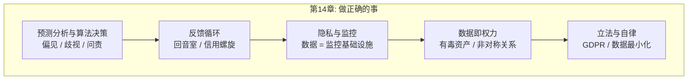
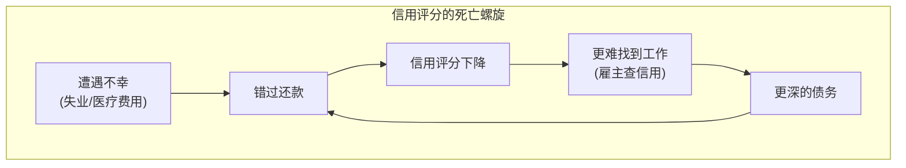
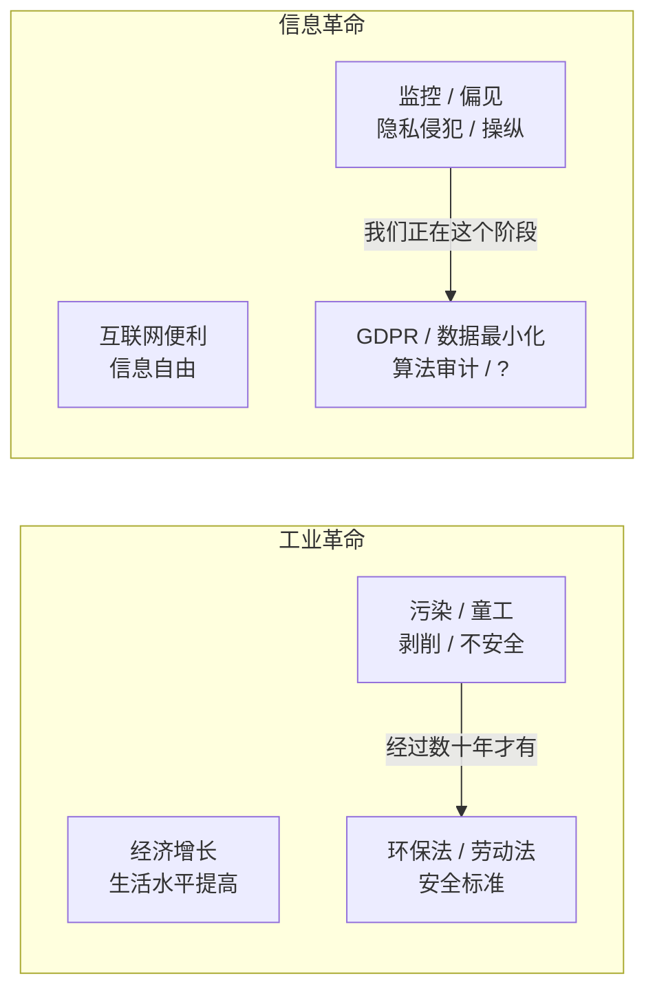
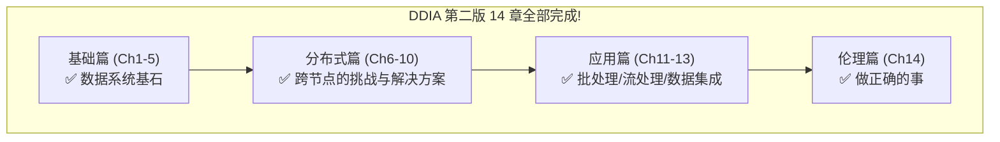

# 第14章：做正确的事 (Doing the Right Thing)

> *"Feeding AI systems on the world's beauty, ugliness, and cruelty, but expecting it to reflect only the beauty is a fantasy."*
> — Vinay Uday Prabhu and Abeba Birhane, "Large Datasets: A Pyrrhic Win for Computer Vision?" (2020)

---

## 🗺️ 章节概览

本章跳出技术，讨论数据系统的**伦理责任**——作为建造这些系统的工程师，我们有义务思考技术对人的影响。

---

## 📖 详细内容

### 14.1 预测分析的伦理困境

| 用数据预测... | 伦理问题 |
|------------|--------|
| 天气、疾病传播 | 无争议 ✅ |
| 个人是否会犯罪、违约、生病 | **直接影响个人命运** ⚠️ |

**核心问题**：银行拒贷、航空禁飞、保险拒保——如果这些决策由算法做出，被错误分类的人可能被系统性地排除在社会之外，被称为 **"algorithmic prison"** [10]。

### 14.2 偏见与歧视

> **"Machine learning is like money laundering for bias."** [15]

算法不是中立的——如果训练数据包含系统性偏见，算法会**学习并放大**这些偏见：

| 问题 | 说明 |
|------|------|
| **代理变量** | 反歧视法禁止按种族决策 → 但邮编、IP 地址是种族的强相关变量 → 算法间接歧视 |
| **统计 ≠ 个体** | 平均寿命 80 岁不意味着你 80 岁会死 → 预测系统的输出是概率性的，对个体可能完全错误 |
| **预测过去 ≠ 改善未来** | 预测分析只是外推过去的模式 → 如果过去是歧视性的，预测出的未来也是 |
| **不可解释性** | ML 模型不透明 → 被拒贷的人无法知道原因 → 无法申诉 |

### 14.3 责任与问责

| 人类决策 | 算法决策 |
|--------|--------|
| 可追责——决策者可被追究 | 谁负责？开发者？产品经理？CEO？ |
| 可申诉——可以解释原因 | ML 模型常常无法解释"为什么拒绝" |
| 有道德感——可以识别不公平 | 算法没有道德感——只优化目标函数 |

> **"Data and models should be our tools, not our masters."** [17]

### 14.4 反馈循环

**推荐系统的回音室**：算法预测"用户想看什么" → 只推送用户已有观点 → 用户越来越极端 → 算法学到"用户喜欢极端内容" → 推送更多极端内容 → **偏见的正反馈循环**。

### 14.5 隐私与监控

**思想实验**：将"data"替换为"surveillance"——

> "In our **surveillance**-driven organization we collect real-time **surveillance** streams and store them in our **surveillance** warehouse. Our **surveillance** scientists use advanced analytics and **surveillance** processing to derive new insights."

Kleppmann 直言：**我们已经建造了人类历史上最大的监控基础设施** [24]。

| 论点 | 说明 |
|------|------|
| **"我没什么要隐藏的"** | 你没有，但边缘化群体有；政权更迭后每个人都可能有 [27] |
| **"用户自愿同意了"** | 隐私政策晦涩难懂 → 用户无法做出知情同意；网络效应 → 不用 = 社交隔离 → 并非真正的自由选择 |
| **"数据是新石油"** | 更准确地说：**数据是有毒资产** [38] / **新铀矿** [39] → 一旦泄露/被滥用，后果不可逆 |

### 14.6 隐私 ≠ 保密

> **隐私不是保守秘密，而是自主选择权**——选择向谁透露什么、让什么保持私密。

当企业通过监控基础设施提取数据时，隐私权不是消失了，而是**从个人转移到了公司** → 公司决定透露什么（通常尽量少透露以保持竞争优势）。

### 14.7 工业革命的类比

> Bruce Schneier: "Data is the pollution problem of the information age, and protecting privacy is the environmental challenge. [...] Our grandchildren will look back at us during these early decades of the information age and judge us on how we addressed the challenge of data collection and misuse. We should try to make them proud." [26]

### 14.8 立法与自律

| 措施 | 说明 |
|------|------|
| **GDPR** | 数据最小化原则——只收集必要数据，明确目的，不能无限期保留 |
| **数据最小化** | 与大数据的"尽量多收集再探索"哲学直接矛盾 |
| **自律** | 技术行业需要文化转变——不再把用户当作被优化的指标，而是当作有尊严的人 |
| **Crypto-shredding** | 加密数据 → 删除密钥 = 等效删除（Ch12 已讨论） |

### 14.9 全书总结（Kleppmann 的 14 章回顾）

| 篇 | 章节 | 核心问题 |
|---|------|--------|
| **基础篇** | Ch1-5 | 单机数据系统如何工作？(存储/检索/编码) |
| **分布式篇** | Ch6-10 | 多机数据系统面临什么困难？如何解决？(复制/分片/事务/共识) |
| **应用篇** | Ch11-13 | 如何用批处理和流处理构建正确的数据系统？ |
| **伦理篇** | Ch14 | 我们建造的系统对人有什么影响？我们的责任是什么？ |

---

## 📝 本章要点总结

### 六大 Takeaways

1. **算法不是中立的**——训练数据有偏见 → 算法放大偏见 → 代理变量绕过反歧视法 → "money laundering for bias"

2. **反馈循环可以毁掉人生**——信用评分下降 → 找不到工作 → 还不了债 → 信用更差。推荐算法 → 回音室 → 极端化

3. **我们建造了史上最大的监控基础设施**——智能手机、IoT、社交网络。将"data"替换为"surveillance"就能看清本质

4. **隐私不是保守秘密，而是自主选择权**——隐私权从个人转移到公司时，个人失去了对自己数据的控制

5. **数据是有毒资产，不是新石油**——收集越多 → 泄露风险越大 → 后果不可逆。数据最小化原则

6. **工程师有伦理责任**——技术不是中性工具，它影响人的生活。"If we don't consider the societal impact of our work, we're not doing our job." [50]

---

## 🎉 全书完结

